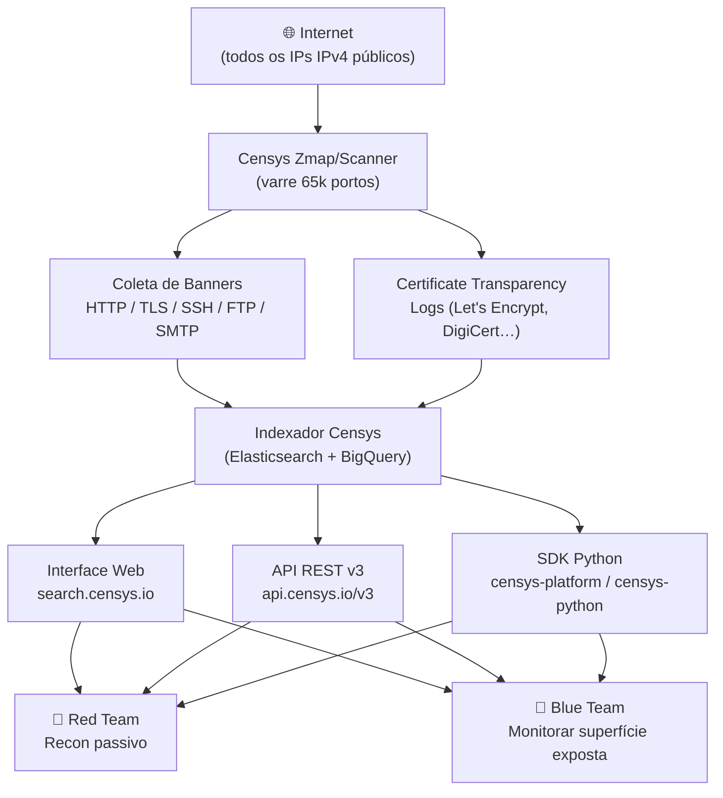
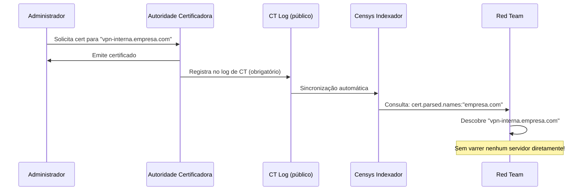
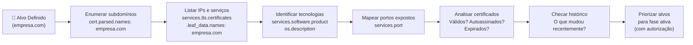

# Censys

> [!quote] Mapeando a Internet
> *Censys varre todos os IPs do planeta e fornece uma interface para consultar, pesquisar e filtrar informações.*

---

## 🔍 O que é Censys?

> [!success] Definição
> **Censys** é um motor de busca como se fosse o Google, porém ao invés de sites, ele funciona para **dispositivos ligados à Internet**.

[🔗 Censys Search](https://search.censys.io/) | [🔗 Documentação Oficial](https://docs.censys.com/) | [🔗 Platform](https://platform.censys.io/)

Criado em 2015 por pesquisadores da Universidade de Michigan, o Censys nasceu como ferramenta acadêmica com o objetivo de medir o estado de segurança da Internet global. Hoje é uma plataforma comercial (com plano gratuito limitado) amplamente usada por equipes de segurança ofensiva e defensiva.

Diferente de buscadores de páginas web, o Censys:
- Varre continuamente todos os **65.535 portos TCP/UDP** dos endereços IPv4 públicos.
- Indexa respostas de banners, certificados TLS, cabeçalhos HTTP, versões de software e metadados de sistema operacional.
- Monitora mudanças ao longo do tempo, permitindo análise histórica de infraestrutura.
- Integra dados de **Certificate Transparency (CT) logs**, que registram publicamente todos os certificados TLS emitidos por Autoridades Certificadoras reconhecidas.

---

## 🗺️ Arquitetura e Fluxo de Dados



---

## ⚖️ Ética e Legalidade

> [!danger] Atenção: art. 154-A do Código Penal
> O **art. 154-A** do Código Penal Brasileiro (incluído pela Lei 12.737/2012, "Lei Carolina Dieckmann") tipifica como crime **invadir dispositivo informático alheio**, com pena de detenção de 3 meses a 1 ano mais multa. A observação passiva de dados públicos (como os indexados pelo Censys) **não é invasão**, mas acessar os sistemas identificados sem autorização **é crime**.

**Regras de ouro para uso ético do Censys:**

- Censys coleta dados de forma passiva, igual a como um servidor web responde a qualquer requisição.
- Dados indexados são **públicos por natureza**: banners, certificados e cabeçalhos são enviados pelo próprio servidor.
- Pesquisar no Censys equivale a consultar um arquivo público, não a varrer o alvo diretamente.
- Usar as informações encontradas **para acessar sistemas sem autorização** é crime (art. 154-A CP).
- Em testes de penetração, obtenha sempre escopo escrito (contrato, regras de engajamento) antes de qualquer atividade além da pesquisa passiva.
- Pratique as técnicas abaixo **no seu próprio domínio e IP** ou em ambientes de laboratório dedicados (ex.: Hack The Box, TryHackMe, VMs isoladas).

---

## 🆚 Diferenças do Shodan

| Aspecto | Censys | Shodan |
|---------|--------|--------|
| **Foco principal** | Certificados SSL/TLS, infraestrutura corporativa | Dispositivos IoT, banners industriais |
| **Origem acadêmica** | Sim (Univ. Michigan, 2015) | Não |
| **Cobertura de portos** | Todos os 65.535 | Seleção de portos populares |
| **Certificate Transparency** | Integração nativa, CT logs completos | Parcial |
| **Query Language** | CenQL (estruturada, tipada) | Filtros simples por campo |
| **Interface web** | Moderna, filtros interativos | Clássica, funcional |
| **Exportação** | JSON, CSV | JSON |
| **API** | REST v3 + SDK Python | REST |
| **Histórico de hosts** | Sim (mudanças ao longo do tempo) | Sim |
| **ASM (Attack Surface Mgmt)** | Módulo dedicado (pago) | Não nativo |
| **Free tier** | 250 resultados/query | 100 resultados/query |

---

## 🧠 Censys Query Language (CenQL)

> [!info] CenQL: a linguagem de consulta do Censys Platform (2024+)
> O Censys migrou para a **Censys Query Language (CenQL)** na plataforma atual. A sintaxe é mais rigorosa e tipada que a versão legada. Queries são expressões booleanas sobre campos estruturados.

### Sintaxe Básica

```
<campo> <operador> <valor>
```

**Operadores disponíveis:**

| Operador | Significado | Exemplo |
|----------|-------------|---------|
| `:` | Contém / igualdade (texto) | `services.service_name: "HTTP"` |
| `=` | Igualdade exata | `ip = "8.8.8.8"` |
| `=~` | Regex | `services.tls.certificates.leaf_data.names =~ "*.iff.edu.br"` |
| `!=` | Diferente | `services.port != 80` |
| `>` / `<` / `>=` / `<=` | Comparação numérica/data | `services.port >= 8000` |
| `AND` | E lógico | `services.port: 443 AND location.country_code: "BR"` |
| `OR` | Ou lógico | `services.port: 80 OR services.port: 8080` |
| `NOT` | Negação | `NOT services.service_name: "HTTP"` |

### Agrupamento e Funções Avançadas

```
# Parênteses agrupam condições
(services.port: 80 OR services.port: 8080) AND location.country_code: "BR"

# same_service(): filtra campos dentro do MESMO serviço (evita falsos positivos)
same_service(services.port: 443 AND services.tls.certificates.leaf_data.issuer_dn: "Let's Encrypt")

# twist(): encontra variações de nomes (typosquatting)
twist("google.com")
```

> [!warning] Por que usar `same_service()`?
> Sem esse operador, `services.port: 443 AND services.tls.certificates.leaf_data.issuer_dn: "Let's Encrypt"` retorna hosts que têm **qualquer** serviço na porta 443 e **qualquer** certificado Let's Encrypt, mesmo que sejam em serviços diferentes. O `same_service()` garante que as condições se aplicam ao mesmo objeto de serviço.

---

## 📋 Campos Principais (Hosts)

| Campo | Tipo | Descrição | Exemplo |
|-------|------|-----------|---------|
| `ip` | string | Endereço IP | `ip = "200.129.0.1"` |
| `ip` (CIDR) | range | Bloco de IPs | `ip: 191.37.254.0/24` |
| `services.port` | int | Porto TCP/UDP | `services.port: 22` |
| `services.service_name` | string | Protocolo L7 | `services.service_name: "SSH"` |
| `services.transport_protocol` | string | TCP ou UDP | `services.transport_protocol: "UDP"` |
| `services.software.product` | string | Produto detectado | `services.software.product: "OpenSSH"` |
| `services.software.version` | string | Versão do software | `services.software.version: "7.4"` |
| `services.http.response.html_title` | string | Título da página | `services.http.response.html_title: "phpMyAdmin"` |
| `services.http.response.status_code` | int | Código HTTP | `services.http.response.status_code: 200` |
| `services.tls.certificates.leaf_data.names` | string | SANs do certificado | `services.tls.certificates.leaf_data.names: "iff.edu.br"` |
| `services.tls.certificates.leaf_data.issuer_dn` | string | Issuer do cert | `services.tls.certificates.leaf_data.issuer_dn: "Let's Encrypt"` |
| `services.tls.certificates.leaf_data.subject.organization` | string | Org. no cert | `services.tls.certificates.leaf_data.subject.organization: "IFF"` |
| `services.tls.certificates.leaf_data.expires_at` | date | Expiração do cert | `services.tls.certificates.leaf_data.expires_at < "2025-01-01"` |
| `location.country_code` | string | País (ISO 3166) | `location.country_code: "BR"` |
| `location.city` | string | Cidade | `location.city: "Campos dos Goytacazes"` |
| `location.postal_code` | string | CEP | `location.postal_code: "28035"` |
| `autonomous_system.name` | string | Nome do ASN | `autonomous_system.name: "CLARO"` |
| `autonomous_system.asn` | int | Número do AS | `autonomous_system.asn: 28573` |
| `autonomous_system.bgp_prefix` | string | Prefixo BGP | `autonomous_system.bgp_prefix: "187.100.0.0/14"` |
| `os.description` | string | Sistema operacional | `os.description: "Windows Server 2019"` |
| `labels` | string | Rótulos Censys | `labels: "cloud"` |

---

## 📋 Campos de Certificados

| Campo | Tipo | Descrição |
|-------|------|-----------|
| `cert.parsed.subject.common_name` | string | CN do certificado |
| `cert.parsed.names` | string | Todos os SANs |
| `cert.parsed.issuer.organization` | string | CA emissora |
| `cert.parsed.issuer_dn` | string | DN completo do issuer |
| `cert.parsed.subject_dn` | string | DN completo do subject |
| `cert.parsed.subject.organization` | string | Organização no certificado |
| `cert.parsed.validity.start` | date | Início de validade |
| `cert.parsed.validity.end` | date | Fim de validade |
| `cert.parsed.signature.self_signed` | bool | Autoassinado |
| `cert.parsed.subject_key_info.rsa_public_key.length` | int | Tamanho da chave RSA |
| `cert.tags` | string | Rótulos (trusted, expired…) |

---

## 🎯 Exemplos de Queries: Hosts

### Por Localização

```
# Dispositivos em Bom Jesus do Itabapoana
location.city: "Bom Jesus do Itabapoana"

# Dispositivos no Brasil
location.country_code: "BR"

# Dispositivos em Campos dos Goytacazes
location.city: "Campos dos Goytacazes"

# Bloco de IPs de uma organização pública
ip: 191.37.254.0/24

# Hosts no AS da Oi (ASN 7738)
autonomous_system.asn: 7738 AND services.port: 22
```

### Por Serviço e Software

```
# Servidores Apache no Brasil
services.software.product: "Apache" AND location.country_code: "BR"

# RDP exposto (alto risco)
services.port: 3389 AND os.description: "Windows"

# MongoDB sem autenticação (clássico erro de config)
services.port: 27017 AND services.service_name: "MONGODB"

# Painéis phpMyAdmin
services.http.response.html_title: "phpMyAdmin"

# Diretórios Apache expostos
services.http.response.html_title: "Index of /"

# Kibana sem autenticação
services.http.response.html_title: "Kibana"

# Servidores JBoss
services.http.response.html_title: "Welcome to JBoss"

# SSH com OpenSSH versão antiga (< 7.0, vulnerável)
services.service_name: "SSH" AND services.software.version < "7.0"

# FTP com login anônimo permitido
services.service_name: "FTP" AND services.ftp.implicit_tls: false
```

### Por Certificado TLS

```
# Hosts com certificados do domínio iff.edu.br
services.tls.certificates.leaf_data.names: "iff.edu.br"

# Hosts com certificados wildcard de um domínio
services.tls.certificates.leaf_data.names =~ "^\*\.iff\.edu\.br$"

# Certificados emitidos por Let's Encrypt no Brasil
same_service(
  services.tls.certificates.leaf_data.issuer_dn: "Let's Encrypt"
  AND services.port: 443
) AND location.country_code: "BR"

# Certificados autoassinados expostos na porta 443
same_service(
  services.tls.certificates.leaf_data.subject.common_name = services.tls.certificates.leaf_data.issuer.common_name
  AND services.port: 443
)

# Certificados que vencem em 30 dias (superfície de risco)
services.tls.certificates.leaf_data.expires_at < "2025-07-01" AND
services.tls.certificates.leaf_data.expires_at > "2025-06-01"

# Hosts com certificado da IBM (mapeamento de infra corporativa)
services.tls.certificates.leaf_data.subject.organization: "IBM"
```

### Queries Avançadas (Red Team)

```
# C2 Frameworks: Cobalt Strike (certificate padrão de trial)
same_service(
  services.tls.certificates.leaf_data.subject.organization: "Acme Co"
  AND services.port: 443
)

# Painéis de administração expostos na internet
services.http.response.html_title: "Admin" AND NOT autonomous_system.name: "CLOUDFLARE"

# Câmeras IP com interface web
services.http.response.html_title: "Network Camera" AND location.country_code: "BR"

# Dispositivos Cisco IOS com interface HTTP
services.http.response.html_title: "Cisco IOS" AND services.port: 80

# Servidores com porta 8443 e certificado customizado (infra suspeita)
same_service(
  services.port: 8443 AND
  services.tls.certificates.leaf_data.subject.organization: "Example Corp"
)
```

---

## 🎯 Exemplos de Queries: Certificados

```
# Todos os certificados de subdomínios de um domínio
cert.parsed.names: "iff.edu.br"

# Wildcards de uma organização
cert.parsed.subject.common_name: "*.iff.edu.br"

# Certificados autoassinados de uma org
cert.parsed.signature.self_signed: true AND
cert.parsed.subject.organization: "IFF"

# Certificados com chave RSA fraca (< 2048 bits)
cert.parsed.subject_key_info.rsa_public_key.length < 2048

# Certificados expirados ainda em uso (listados no CT)
cert.tags: "expired" AND cert.parsed.subject.organization: "Instituto Federal"

# Certificados emitidos para subdomínios que revelam estrutura interna
cert.parsed.names =~ "vpn\." OR cert.parsed.names =~ "mail\." AND
cert.parsed.subject.organization: "IFF"
```

---

## 🛠️ API REST v3

> [!tip] Autenticação
> A API v3 usa **Personal Access Token (PAT)**. Gere em: [platform.censys.io](https://platform.censys.io) > Account > API Keys.

### Endpoints Principais

```bash
# Base URL
https://api.censys.io/v3/

# Buscar hosts
GET /v3/hosts/search?q=<query>&per_page=25&cursor=<token>

# Ver detalhes de um host
GET /v3/hosts/{ip_address}

# Histórico de um host
GET /v3/hosts/{ip_address}/history

# Buscar certificados
GET /v3/certificates/search?q=<query>

# Agregar resultados
GET /v3/hosts/aggregate?q=<query>&field=<campo>
```

### Exemplos com curl

```bash
# Definir variável de ambiente com o token
export CENSYS_TOKEN="seu_personal_access_token_aqui"

# Buscar hosts com RDP aberto no Brasil
curl -s \
  -H "Authorization: Bearer $CENSYS_TOKEN" \
  -H "Accept: application/json" \
  "https://api.censys.io/v3/hosts/search?q=services.port%3A3389%20AND%20location.country_code%3A%22BR%22&per_page=10" \
  | python3 -m json.tool

# Ver detalhes do IP 8.8.8.8 (Google DNS)
curl -s \
  -H "Authorization: Bearer $CENSYS_TOKEN" \
  "https://api.censys.io/v3/hosts/8.8.8.8" \
  | python3 -m json.tool

# Histórico de mudanças em um host
curl -s \
  -H "Authorization: Bearer $CENSYS_TOKEN" \
  "https://api.censys.io/v3/hosts/8.8.8.8/history" \
  | python3 -m json.tool

# Agregar por país hosts com porta 3389
curl -s \
  -H "Authorization: Bearer $CENSYS_TOKEN" \
  "https://api.censys.io/v3/hosts/aggregate?q=services.port:3389&field=location.country_code&num_buckets=10" \
  | python3 -m json.tool
```

### Estrutura de Resposta (host)

```json
{
  "ip": "200.129.0.1",
  "services": [
    {
      "port": 443,
      "service_name": "HTTP",
      "transport_protocol": "TCP",
      "tls": {
        "certificates": {
          "leaf_data": {
            "names": ["exemplo.edu.br", "www.exemplo.edu.br"],
            "subject": {
              "common_name": "exemplo.edu.br",
              "organization": "Exemplo Edu"
            },
            "issuer_dn": "C=US, O=Let's Encrypt, CN=R3",
            "expires_at": "2025-09-15T12:00:00Z"
          }
        }
      }
    }
  ],
  "location": {
    "country": "Brazil",
    "country_code": "BR",
    "city": "Campos dos Goytacazes"
  },
  "autonomous_system": {
    "name": "CLARO",
    "asn": 28573,
    "bgp_prefix": "200.129.0.0/19"
  },
  "os": {
    "description": "Ubuntu 22.04"
  }
}
```

---

## 🐍 SDK Python

### Instalação

```bash
# SDK moderno (recomendado, Python >= 3.10)
pip install censys-platform

# SDK legado (Python >= 3.8, ainda funcional)
pip install censys
```

### Configuração

```bash
# SDK legado: configurar via CLI (salva em ~/.config/censys/censys.cfg)
censys config
# -> insira API ID e API Secret (da conta legada)

# SDK moderno: configurar via variável de ambiente
export CENSYS_TOKEN="seu_personal_access_token"
```

### Exemplos: SDK Legado (censys-python)

```python
from censys.search import CensysHosts, CensysCertificates

# Inicializar cliente de hosts
h = CensysHosts()

# Buscar hosts com porta 22 aberta no Brasil
query = 'services.port: 22 AND location.country_code: "BR"'
for page in h.search(query, per_page=25, pages=2):
    for host in page:
        print(f"IP: {host['ip']}")
        for svc in host.get('services', []):
            print(f"  Porto: {svc.get('port')} / {svc.get('service_name')}")

# Visualizar host específico
detalhes = h.view("8.8.8.8")
print(detalhes)

# Agregar por sistema operacional
agg = h.aggregate(
    query='services.port: 3389',
    field='os.description',
    num_buckets=10
)
for bucket in agg['buckets']:
    print(f"{bucket['key']}: {bucket['count']}")
```

### Exemplos: SDK Moderno (censys-platform)

```python
from censys.platform import CensysPlatform

# Inicializar com token
client = CensysPlatform(api_key="seu_personal_access_token")

# Buscar hosts
results = client.hosts.search(
    query='services.tls.certificates.leaf_data.names: "iff.edu.br"',
    per_page=50
)
for host in results:
    print(f"IP: {host['ip']}, Cidade: {host.get('location', {}).get('city')}")

# Ver histórico de um host (quais serviços mudaram ao longo do tempo)
historico = client.hosts.get_history("200.0.0.1")
for evento in historico:
    print(f"Timestamp: {evento['timestamp']}, Portos: {[s['port'] for s in evento.get('services', [])]}")
```

---

## 💻 CLI: cencli e censys

O Censys oferece duas ferramentas de linha de comando:

- **`censys`**: parte do SDK legado (`censys-python`), comandos `view`, `search`, `asm`.
- **`cencli`**: CLI dedicada à nova plataforma, instalada separadamente.

### Instalação

```bash
# CLI legada (vem com o SDK)
pip install censys

# cencli (nova plataforma)
pip install cencli
# ou
pipx install cencli
```

### Comandos Principais

```bash
# Configurar credenciais (legado)
censys config

# Configurar PAT (cencli)
cencli config

# Buscar hosts (censys legado)
censys search 'services.port: 3389 AND location.country_code: "BR"'

# Buscar hosts (cencli)
cencli search hosts 'services.port: 22 AND autonomous_system.name: "CLARO"'

# Ver detalhes de um host
censys view 8.8.8.8
cencli view host 8.8.8.8

# Ver múltiplos hosts
censys view 8.8.8.8,9.9.9.9

# Ver propriedade web (host:porto)
cencli view webproperty platform.censys.io:443

# Histórico de mudanças
cencli history host 8.8.8.8

# Agregar: quantos hosts por país têm RDP aberto?
cencli aggregate hosts \
  --query 'services.port: 3389' \
  --field location.country_code \
  --num-buckets 20

# CensEye: identificar infra similar a um host investigado
cencli censeye 185.220.101.1

# Exportar resultados em JSON
cencli search hosts 'services.port: 8080 AND location.country_code: "BR"' \
  --output-format json > hosts_br_8080.json
```

---

## 🔎 Certificate Transparency: o Poder do Censys para Subdomínios

> [!info] O que são CT Logs?
> **Certificate Transparency (RFC 6962)** é um padrão que obriga CAs (Autoridades Certificadoras como Let's Encrypt, DigiCert, Sectigo) a registrar todos os certificados emitidos em logs públicos auditáveis. O Censys sincroniza com dezenas desses logs e indexa cada certificado.

**Por que isso importa para o red team?**

Toda vez que um administrador emite um certificado TLS para `portal-interno.empresa.com`, esse nome aparece nos logs de CT, independentemente de o servidor estar publicamente acessível ou não. Isso revela:
- Subdomínios que o administrador tentou esconder.
- Nomes de servidores internos com certificados válidos.
- Histórico de nomes que já foram usados pela organização.
- Estrutura da infraestrutura (ex.: `vpn.empresa.com`, `mail.empresa.com`, `dev.empresa.com`).



### Estratégia de Enumeração de Subdomínios via Certificados

```bash
# Passo 1: encontrar todos os certificados do domínio-alvo (via web)
# Acesse: https://search.censys.io/certificates?q=cert.parsed.names%3A%22empresa.com%22

# Passo 2: usar a API para coletar programaticamente
curl -s \
  -H "Authorization: Bearer $CENSYS_TOKEN" \
  "https://api.censys.io/v3/certificates/search?q=cert.parsed.names%3A%22iff.edu.br%22&per_page=100" \
  | python3 -c "
import json, sys
data = json.load(sys.stdin)
nomes = set()
for cert in data.get('result', {}).get('hits', []):
    for nome in cert.get('parsed', {}).get('names', []):
        if 'iff.edu.br' in nome:
            nomes.add(nome)
for n in sorted(nomes):
    print(n)
"

# Passo 3: verificar quais subdomínios resolvem (existem no DNS)
# Salvar lista em arquivo e usar:
while read sub; do
    if host "$sub" > /dev/null 2>&1; then
        echo "[ATIVO] $sub"
    else
        echo "[INATIVO] $sub"
    fi
done < subdomains.txt
```

---

## 📊 Comparação Completa: Censys vs Shodan (2025-2026)

| Critério | Censys | Shodan |
|----------|--------|--------|
| **Preço (free tier)** | 250 resultados/query | 100 resultados/query |
| **Preço (pago)** | Planos a partir de US\$ 99/mês | Planos a partir de US\$ 69/mês |
| **Certificados SSL/TLS** | Excelente (CT logs nativos) | Bom |
| **IoT/Câmeras** | Bom | Excelente |
| **SCADA/ICS** | Bom | Excelente |
| **Interface web** | Moderna, filtros interativos | Funcional, clássica |
| **Query language** | CenQL (tipada, `same_service()`) | Filtros simples |
| **API** | REST v3 + SDK Python | REST + SDK Python |
| **ASM (Attack Surface Mgmt)** | Módulo nativo | Não nativo |
| **Histórico de hosts** | Sim | Sim |
| **Cobertura de portos** | Todos os 65.535 | Portos populares |
| **Regex em queries** | Sim | Limitado |
| **Aggregation** | Sim (API + CLI) | Sim (facets) |
| **Ideal para** | Recon de certs, infra corporativa | IoT, banners industriais |

---

## 🛠️ Recursos do Censys Platform

> [!success] Funcionalidades (2026)

| Recurso | Descrição |
|---------|-----------|
| **Host Search** | Busca por IPs e dispositivos (todos os 65.535 portos) |
| **Certificate Search** | Busca por certificados SSL/TLS via CT logs |
| **Web Properties** | Busca por hostname:porto (agrupa certificados e serviços) |
| **Data Export** | Exportar resultados em JSON, CSV |
| **API REST v3** | Acesso programático completo com PAT |
| **SDK Python** | `censys-platform` (moderno) e `censys-python` (legado) |
| **cencli** | CLI de linha de comando para automação |
| **Histórico de hosts** | Ver mudanças de serviços ao longo do tempo |
| **Aggregation** | Contar e agrupar resultados por qualquer campo |
| **CensEye** | Encontrar hosts com características similares a um alvo |
| **ASM (pago)** | Attack Surface Management contínuo para defender a própria org |
| **twist()** | Detectar typosquatting de domínios |

---

## 🔴 Red Team: Fluxo de Reconhecimento com Censys

> [!warning] Reconhecimento passivo: legal. Acesso não autorizado: crime (art. 154-A CP).



### Script de Reconhecimento Automatizado

```python
#!/usr/bin/env python3
"""
recon_censys.py: Reconhecimento passivo de um domínio-alvo via Censys.
Use apenas em alvos para os quais você tem autorização escrita.
"""

import os
import json
from censys.search import CensysHosts, CensysCertificates

DOMINIO_ALVO = "exemplo.edu.br"  # substitua pelo seu domínio

h = CensysHosts()
c = CensysCertificates()

print(f"\n=== RECONHECIMENTO PASSIVO: {DOMINIO_ALVO} ===\n")

# Passo 1: listar todos os hosts com certificado do domínio
print("[1] Hosts com certificado do domínio:")
query_hosts = f'services.tls.certificates.leaf_data.names: "{DOMINIO_ALVO}"'
for pagina in h.search(query_hosts, per_page=25, pages=2):
    for host in pagina:
        ip = host['ip']
        portos = [str(s.get('port', '?')) for s in host.get('services', [])]
        cidade = host.get('location', {}).get('city', 'N/A')
        asn = host.get('autonomous_system', {}).get('name', 'N/A')
        print(f"  IP: {ip} | Portos: {', '.join(portos)} | {cidade} | AS: {asn}")

# Passo 2: enumerar subdomínios via CT logs
print(f"\n[2] Subdomínios encontrados nos CT logs:")
query_certs = f'cert.parsed.names: "{DOMINIO_ALVO}"'
subdomains = set()
try:
    for pagina in c.search(query_certs, per_page=100, pages=3):
        for cert in pagina:
            for nome in cert.get('parsed', {}).get('names', []):
                if DOMINIO_ALVO in nome:
                    subdomains.add(nome)
except Exception as e:
    print(f"  Erro: {e}")

for sub in sorted(subdomains):
    print(f"  {sub}")

print(f"\n[3] Total de subdomínios únicos encontrados: {len(subdomains)}")
print("\n=== FIM DO RECONHECIMENTO PASSIVO ===")
```

---

## 🔵 Defesa: Monitorando a Sua Própria Superfície

> [!success] A mesma ferramenta que o atacante usa, o defensor usa para se conhecer primeiro.

A regra de ouro da segurança ofensiva defensiva: **conheça sua superfície antes do atacante**.

### O que monitorar periodicamente:

1. **Hosts expostos** com certificados do seu domínio (você conhece todos?).
2. **Certificados próximos da expiração** (causam outages e abrem janelas de ataque).
3. **Serviços em portos inesperados** (quem abriu essa porta 3389?).
4. **Subdomínios desconhecidos** nos CT logs (shadow IT, serviços esquecidos).
5. **Softwares com versões vulneráveis** expostos diretamente na internet.
6. **Certificados autoassinados** em produção (sinal de configuração negligente).

### Script de Monitoramento Defensivo

```python
#!/usr/bin/env python3
"""
monitor_surface.py: Monitora a superfície de exposição do seu domínio.
Execute periodicamente (cron, GitHub Actions) e compare resultados.
"""

import json
from datetime import datetime, timezone
from censys.search import CensysHosts

MEU_DOMINIO = "meudominio.edu.br"     # substitua pelo SEU domínio
MEU_IP_RANGE = "200.0.0.0/24"        # substitua pelo SEU bloco de IPs

h = CensysHosts()
alertas = []

# Verificar portos expostos no meu bloco de IPs
query = f'ip: {MEU_IP_RANGE}'
print(f"Escaneando {MEU_IP_RANGE}...")

for pagina in h.search(query, per_page=100, pages=1):
    for host in pagina:
        ip = host['ip']
        for servico in host.get('services', []):
            porto = servico.get('port')
            nome = servico.get('service_name', 'UNKNOWN')

            # Alertar portos não esperados em produção
            portos_proibidos = {3389, 27017, 9200, 5601, 6379, 5432}
            if porto in portos_proibidos:
                alertas.append(f"ALERTA: {ip}:{porto} ({nome}) exposto!")

            # Verificar certificados próximos da expiração
            tls = servico.get('tls', {})
            cert = tls.get('certificates', {}).get('leaf_data', {})
            expira = cert.get('expires_at')
            if expira:
                exp_dt = datetime.fromisoformat(expira.replace('Z', '+00:00'))
                dias_restantes = (exp_dt - datetime.now(timezone.utc)).days
                if dias_restantes < 30:
                    nomes_cert = cert.get('names', [])
                    alertas.append(
                        f"CERT EXPIRANDO: {ip}:{porto} "
                        f"({', '.join(nomes_cert)}) em {dias_restantes} dias!"
                    )

print(f"\n=== RELATÓRIO DE SUPERFÍCIE: {MEU_DOMINIO} ===")
if alertas:
    for a in alertas:
        print(f"  [!] {a}")
else:
    print("  Nenhum alerta encontrado.")
print("==========================================")
```

### Alertas de Certificados via API (sem SDK)

```bash
# Verificar certificados do seu domínio que vencem em 30 dias
DOMINIO="meudominio.edu.br"
DATA_LIMITE=$(date -d "+30 days" +%Y-%m-%dT%H:%M:%SZ)

curl -s \
  -H "Authorization: Bearer $CENSYS_TOKEN" \
  "https://api.censys.io/v3/hosts/search?q=same_service(services.tls.certificates.leaf_data.names%3A%22$DOMINIO%22%20AND%20services.tls.certificates.leaf_data.expires_at%20%3C%20%22$DATA_LIMITE%22)&per_page=50" \
  | python3 -c "
import json, sys
data = json.load(sys.stdin)
hosts = data.get('result', {}).get('hits', [])
print(f'Certificados expirando em 30 dias: {len(hosts)} hosts')
for host in hosts:
    ip = host.get('ip')
    for svc in host.get('services', []):
        exp = svc.get('tls', {}).get('certificates', {}).get('leaf_data', {}).get('expires_at', 'N/A')
        print(f'  {ip} -> expira: {exp}')
"
```

---

> [!example] 🧪 Atividade 1: Explore o Seu Próprio Domínio no Censys

**Objetivo:** mapear a superfície de exposição do seu domínio usando Censys Search (interface web).

**Pré-requisito:** ter um domínio próprio ou IP registrado no seu nome, ou usar um domínio da sua instituição com autorização.

**Passo a passo:**

1. Acesse [search.censys.io](https://search.censys.io/) e crie uma conta gratuita.
2. Na aba **Hosts**, execute a query:
   ```
   services.tls.certificates.leaf_data.names: "SEU_DOMINIO.com"
   ```
3. Anote os IPs retornados. Você reconhece todos?
4. Para cada IP, clique e veja a seção **Services**. Que portos estão abertos?
5. Na aba **Certificates**, execute:
   ```
   cert.parsed.names: "SEU_DOMINIO.com"
   ```
6. Quantos certificados históricos existem? Existem subdomínios que você não esperava?

**Resultado esperado:** lista de IPs com serviços, lista de subdomínios nos CT logs, certificados emitidos historicamente.

**Perguntas para reflexão:**
- Existem serviços expostos que não deveriam estar?
- Algum certificado está próximo da expiração?
- Há subdomínios "esquecidos" ainda ativos?

---

> [!example] 🧪 Atividade 2: Enumere Certificados de um Domínio Público

**Objetivo:** usar Censys para enumerar subdomínios de um domínio público bem conhecido, entendendo o que os CT logs revelam.

**Alvo sugerido:** `iff.edu.br` (domínio público de uma instituição federal, sem risco de infração).

**Passo a passo:**

1. Acesse [search.censys.io/certificates](https://search.censys.io/certificates)
2. Execute a query:
   ```
   cert.parsed.names: "iff.edu.br"
   ```
3. Observe os campos retornados:
   - `parsed.names`: todos os SANs (Subject Alternative Names) do certificado.
   - `parsed.issuer.organization`: quem emitiu (Let's Encrypt? DigiCert?).
   - `parsed.validity.end`: quando expira.
4. Tente identificar subdomínios internos ou staging:
   ```
   cert.parsed.names =~ "\.iff\.edu\.br$" AND NOT cert.parsed.names: "www.iff.edu.br"
   ```
5. Use a API para listar todos de forma programática:
   ```bash
   curl -s \
     -H "Authorization: Bearer $CENSYS_TOKEN" \
     "https://api.censys.io/v3/certificates/search?q=cert.parsed.names%3A%22iff.edu.br%22&per_page=50" \
     | python3 -m json.tool | grep '"names"' -A 5
   ```

**Resultado esperado:** lista de subdomínios presentes nos logs de CT, incluindo possivelmente subdomínios de staging, vpn, webmail, etc.

**Atenção ética:** apenas observe. Não tente acessar nenhum dos servidores identificados sem autorização escrita.

---

> [!example] 🧪 Atividade 3: Compare Censys e Shodan para o Mesmo Alvo

**Objetivo:** entender as diferenças práticas entre as duas ferramentas para o mesmo host.

**Alvo sugerido:** `8.8.8.8` (Google Public DNS, domínio público sem risco).

**Passo a passo no Censys:**

1. Acesse [search.censys.io](https://search.censys.io/) e digite `8.8.8.8` na busca.
2. Anote:
   - Portos e serviços listados.
   - Certificados TLS encontrados.
   - Sistema operacional detectado.
   - ASN e localização.
3. Tente a API:
   ```bash
   curl -s -H "Authorization: Bearer $CENSYS_TOKEN" \
     "https://api.censys.io/v3/hosts/8.8.8.8" | python3 -m json.tool
   ```

**Passo a passo no Shodan:**

1. Acesse [shodan.io](https://www.shodan.io/) e pesquise `8.8.8.8`.
2. Anote os mesmos campos: portos, banners, SO, ASN.

**Tabela comparativa (preencha durante a atividade):**

| Campo | Censys | Shodan |
|-------|--------|--------|
| Portos listados | | |
| Certificados TLS | | |
| SO detectado | | |
| ASN/Organização | | |
| Informação exclusiva | | |
| Informação faltando | | |

**Perguntas para reflexão:**
- Qual ferramenta listou mais portos?
- Qual mostrou mais detalhes sobre certificados TLS?
- As informações são convergentes ou contraditórias?
- Para que tipo de alvo cada ferramenta seria mais útil?

---

## ⚠️ Considerações Éticas (Revisão Final)

> [!danger] Atenção: limites legais e éticos
> - Use apenas para **reconhecimento autorizado**.
> - Dados públicos indexados pelo Censys não equivalem a autorização de acesso aos sistemas.
> - O **art. 154-A do Código Penal** tipifica a invasão de dispositivo informático alheio.
> - Reporte vulnerabilidades descobertas de forma responsável (responsible disclosure).
> - Em pentest profissional, documente o escopo e obtenha autorização escrita antes de qualquer atividade além da pesquisa passiva.
> - Pratique todas as técnicas acima **no seu próprio domínio/IP** ou em ambientes de laboratório dedicados.

---

## 🔗 Ferramentas Relacionadas

- **[[shodan|Shodan]]** (comparação direta, foco em IoT/ICS)
- **[[Information Gathering Frameworks (OSINT)|OSINT]]** (contexto de inteligência de fontes abertas)
- **[[Coleta de informações|Reconhecimento]]** (fase inicial do pentest)
- **Certificados SSL/TLS** (fundamentos de PKI e TLS)

---

> [!note] 📚 Fontes (2026)
> - [Censys Query Language (CenQL): Documentação Oficial](https://docs.censys.com/docs/censys-query-language)
> - [Censys Search Language (CSL): Legacy](https://docs.censys.com/docs/ls-csl)
> - [Platform Host Dataset: Campos disponíveis](https://docs.censys.com/docs/platform-host-dataset)
> - [Platform Certificate Dataset](https://docs.censys.com/docs/platform-certificate-dataset)
> - [cencli: CLI da nova plataforma (GitHub)](https://github.com/Censys/cencli)
> - [censys-python: SDK legado (GitHub)](https://github.com/censys/censys-python)
> - [censys-platform: SDK moderno (PyPI)](https://pypi.org/project/censys-platform/)
> - [Censys Example Queries: Platform](https://platform.censys.io/home/examples)
> - [Certificate Transparency and Precertificates: Censys Docs](https://docs.censys.com/docs/ls-ct-precerts)
> - [Censys ASM: Attack Surface Management](https://censys.com/product/attack-surface-management/)
> - [Using the Censys API for Advanced Threat Hunting: Blog Censys](https://censys.com/blog/threathunting-with-censys-api/)
> - [Censys Device Search Cheat Sheet: vespersec.net](https://vespersec.net/docs/osint-reconnaissance/censys-device-search-cheat-sheet/)
> - [Get Started with Censys APIs](https://docs.censys.com/reference/get-started)
> - [CLI Usage: censys-python 2.2.19](https://censys-python.readthedocs.io/en/stable/usage-cli.html)
