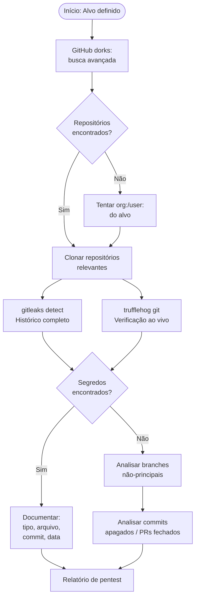
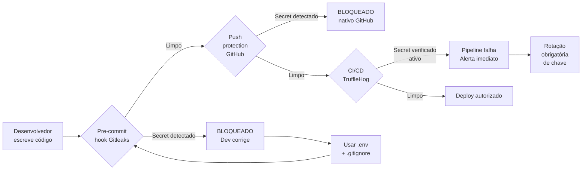

# Open-Source Code Analysis

> [!quote] Segredos no Código
> *Repositórios públicos frequentemente contêm credenciais, chaves de API e informações sensíveis expostas acidentalmente. Em 2025, mais de 28 milhões de credenciais foram encontradas expostas no GitHub.*

---

## 🎯 O que é?

> [!success] Definição
> **Análise de código open-source** é o processo de examinar repositórios públicos em busca de vulnerabilidades, credenciais vazadas e informações sensíveis. No contexto de red team e pentest, essa técnica integra a fase de **reconhecimento passivo**: nenhum pacote é enviado ao alvo; apenas informações já públicas são coletadas e analisadas.

A fase de recon em repositórios explora uma realidade comum no desenvolvimento de software: desenvolvedores frequentemente acidentalmente comitam segredos junto com o código funcional. Chaves de API, senhas de banco de dados, tokens OAuth, chaves SSH privadas e certificados digitais já foram encontrados em repositórios de empresas do porte de Samsung, Twitch e Uber.

### O que Procurar?

| Tipo | Exemplos | Impacto Potencial |
|------|----------|-------------------|
| **Credenciais** | Senhas, tokens de API | Acesso a sistemas e dados |
| **Configurações** | Arquivos .env, config.yml | Topologia interna, endpoints |
| **Chaves de nuvem** | AWS, Azure, GCP credentials | Controle de infraestrutura cloud |
| **Chaves privadas** | id_rsa, chaves PEM | Acesso a servidores, assinatura |
| **Tokens de serviço** | Slack, Stripe, Twilio | Fraude, exfiltração de dados |
| **Informações internas** | IPs, hostnames, endpoints | Mapeamento de rede interna |
| **Vulnerabilidades** | Código inseguro, dependências | Exploit direto |

---

## 🔍 Fluxo de Recon em Repositórios



---

## 🛠️ Arsenal de Ferramentas

> [!tip] Ferramentas Essenciais para Análise de Repositórios (2026)

| Ferramenta | Abordagem | Velocidade | Verificação ao vivo | Uso Principal |
|------------|-----------|------------|---------------------|---------------|
| **Gitleaks v8** | Regex + entropia de Shannon | Alta (Go binário) | Não | Pre-commit hook, CI/CD |
| **TruffleHog v3** | Regex + entropia + API call | Média (rede) | Sim (800+ tipos) | Scan profundo, confirmar se o secret funciona |
| **git-secrets** | Regex configurável | Alta | Não | Prevenção local |
| **ggshield (GitGuardian)** | ML + regras | Alta | Sim (parcial) | CI/CD enterprise |
| **GitHub Secret Scanning** | Nativo GitHub | Automático | Não | Detecção pós-push |
| **Gitrob** | Busca por nomes de arquivo | Média | Não | Recon em organizações |
| **GitHub Search (dorks)** | Busca textual | Manual | Não | Descoberta inicial |

> [!info] Gitleaks vs TruffleHog: qual usar?
> A resposta prática de 2026: **use os dois em camadas**. Gitleaks no pre-commit (rápido, sem rede, não atrasa o fluxo do dev). TruffleHog em CI/CD ou scan manual (verifica se o secret está realmente ativo via chamada de API ao provedor). Gitleaks diz "parece um segredo"; TruffleHog diz "o segredo funciona agora".

---

## 💻 GitHub Dorks: Busca Avançada

> [!info] O que são GitHub Dorks?
> GitHub Dorks são consultas avançadas que exploram os operadores de busca do GitHub para localizar informações sensíveis expostas em código público. A técnica é análoga ao [[Google hacking]] (Google Dorks), mas aplicada ao maior repositório de código do mundo.

### Operadores Principais

| Operador | Função | Exemplo |
|----------|--------|---------|
| `filename:` | Filtra por nome do arquivo | `filename:.env` |
| `extension:` | Filtra por extensão | `extension:pem` |
| `path:` | Busca dentro de caminhos | `path:config/database` |
| `org:` | Limita a uma organização | `org:empresa-alvo` |
| `user:` | Limita a um usuário | `user:dev-alvo` |
| `repo:` | Limita a um repositório | `repo:empresa/projeto` |
| `language:` | Filtra por linguagem | `language:python` |
| `in:file` | Busca no conteúdo do arquivo | `"senha" in:file` |
| `in:path` | Busca no caminho do arquivo | `credentials in:path` |

### Dorks Categorizados para Pentest

```
# ========================
# CREDENCIAIS E SENHAS
# ========================

# Arquivos .env com senhas
filename:.env password

# Arquivo de ambiente com chave de API
filename:.env "API_KEY"

# Arquivo de configuração com senha de banco
"DB_PASSWORD" extension:env

# Arquivos .env de qualquer tipo
filename:.env DB_PASSWORD OR DB_USER OR DB_HOST

# ========================
# CHAVES DE NUVEM
# ========================

# Chaves AWS (Access Key ID sempre começa com AKIA)
"AKIA" filename:credentials
"AKID" extension:py
"aws_access_key_id" extension:json

# Azure connection strings
"DefaultEndpointsProtocol=https" extension:config

# Google Cloud service account
"type": "service_account" filename:*.json

# ========================
# CHAVES PRIVADAS SSH / TLS
# ========================

"BEGIN RSA PRIVATE KEY"
"BEGIN OPENSSH PRIVATE KEY"
filename:id_rsa
filename:*.pem extension:pem

# ========================
# TOKENS DE SERVIÇOS
# ========================

# Slack (bot token)
"xoxb-" extension:json
"xoxp-" in:file

# Stripe (chave live)
"sk_live_" extension:js
"pk_live_" extension:js

# Twilio
"AC" "auth_token" extension:py

# SendGrid
"SG." in:file extension:env

# ========================
# BANCO DE DADOS
# ========================

# MongoDB URI com credenciais
"mongodb+srv://" extension:js

# PostgreSQL connection string
"postgresql://" in:file

# MySQL com senha hardcoded
"mysql_connect" "password" extension:php

# ========================
# BUSCA POR ORGANIZAÇÃO
# ========================

# Qualquer .env de uma organização
org:empresa-alvo filename:.env

# Tokens de API em arquivos de configuração
org:empresa-alvo "api_token" OR "api_key" extension:json

# Credenciais em arquivos YAML
org:empresa-alvo "password:" extension:yml
```

### Dork por Google (raw.githubusercontent.com)

O Google também indexa arquivos do GitHub. Esta abordagem contorna algumas limitações da API de busca do GitHub:

```
site:raw.githubusercontent.com "AKIA" ext:py
site:raw.githubusercontent.com "password" ext:env
site:raw.githubusercontent.com "BEGIN RSA PRIVATE KEY"
```

---

## 🔧 Gitleaks: Instalação e Uso Completo

> [!tip] Gitleaks v8: scanner rápido baseado em Go

### Instalação

```bash
# Linux (binário direto, sem dependências)
wget https://github.com/gitleaks/gitleaks/releases/latest/download/gitleaks_linux_x64.tar.gz
tar -xzf gitleaks_linux_x64.tar.gz
sudo mv gitleaks /usr/local/bin/

# Verificar instalação
gitleaks version

# Via Docker
docker pull zricethezav/gitleaks:latest
```

### Comandos Essenciais

```bash
# ============================================
# DETECTAR segredos no repositório ATUAL
# ============================================

# Scan completo (histórico + working tree)
gitleaks detect --source .

# Com saída verbosa (mostra cada match)
gitleaks detect --source . -v

# Exportar relatório JSON
gitleaks detect --source . --report-format json --report-path relatorio.json

# Scan sem cor (para log em arquivo)
gitleaks detect --source . --no-color --no-banner

# Redigir (ocultar) o valor do segredo no output
gitleaks detect --source . -v --redact

# ============================================
# ESCANEAR UM REPOSITÓRIO REMOTO
# ============================================

# Clonar e escanear automaticamente
gitleaks detect --source https://github.com/alvo/repo.git

# ============================================
# CONTROLAR O ESCOPO DO SCAN
# ============================================

# Só os últimos 50 commits
gitleaks detect --source . --log-opts="-50"

# Desde um commit específico
gitleaks detect --source . --log-opts="HEAD~100..HEAD"

# Escanear TODAS as branches
gitleaks detect --source . --log-opts="--all"

# ============================================
# USAR EM PRE-COMMIT (modo staged)
# ============================================

# Escanear apenas arquivos staged (sem histórico)
gitleaks protect --staged

# O exit code 1 indica leak encontrado; 0 = limpo
echo "Exit code: $?"
```

### Exemplo de Saída

```
Finding:     api_key = "sk-proj-XXXXXXXXXXXXXXXX..."
Secret:      sk-proj-XXXXXXXXXXXXXXXX...
RuleID:      openai-api-key
Entropy:     5.32
File:        src/config/settings.py
Line:        14
Commit:      a3f9c1d2e4b5a6f7...
Author:      dev@empresa.com
Date:        2024-03-15T10:23:45Z
Fingerprint: a3f9c1d2e4b5a6f7:src/config/settings.py:openai-api-key:14
```

### Configuração Customizada (.gitleaks.toml)

```toml
# .gitleaks.toml: regras personalizadas para o seu projeto
title = "Gitleaks Custom Config"

# Ignorar arquivos de teste e exemplos
[allowlist]
  description = "Allowlist global"
  paths = [
    '''tests/fixtures/''',
    '''docs/examples/''',
  ]
  # Ignorar strings de exemplo (não são secrets reais)
  regexes = [
    '''EXAMPLE_KEY_DO_NOT_USE''',
    '''your-api-key-here''',
  ]

# Regra customizada: detectar chaves internas do projeto
[[rules]]
  id = "minha-chave-interna"
  description = "Chave interna do sistema IFF"
  regex = '''IFF_SECRET_[A-Z0-9]{32}'''
  tags = ["custom", "iff"]
```

---

## 🐷 TruffleHog: Verificação ao Vivo

> [!tip] TruffleHog v3: o scanner que confirma se o secret ainda funciona

### Instalação

```bash
# Binário (Linux)
curl -sSfL https://raw.githubusercontent.com/trufflesecurity/trufflehog/main/scripts/install.sh | sh -s -- -b /usr/local/bin

# Via Docker
docker pull trufflesecurity/trufflehog:latest

# Verificar
trufflehog --version
```

### Comandos Essenciais

```bash
# ============================================
# ESCANEAR REPOSITÓRIO GIT LOCAL
# ============================================

# Scan completo do histórico
trufflehog git file://$(pwd)

# Apenas resultados VERIFICADOS (secret ativo agora)
trufflehog git file://$(pwd) --only-verified

# Saída JSON para pipeline
trufflehog git file://$(pwd) --only-verified --json

# ============================================
# ESCANEAR REPOSITÓRIO REMOTO
# ============================================

trufflehog git https://github.com/alvo/repo

# Só novos commits (desde um SHA)
trufflehog git https://github.com/alvo/repo --since-commit=abc123

# ============================================
# ESCANEAR ORGANIZAÇÃO DO GITHUB
# ============================================

# Requer GITHUB_TOKEN no ambiente
export GITHUB_TOKEN=ghp_sua_token_pessoal

# Escanear toda a organização (incluindo issues e PRs)
trufflehog github --org=nome-da-org --results=verified

# Com comentários de issues e PRs
trufflehog github --org=nome-da-org --issue-comments --pr-comments

# ============================================
# ESCANEAR FILESYSTEM (não-Git)
# ============================================

trufflehog filesystem /caminho/para/pasta --only-verified
```

### Interpretando o Output

```json
{
  "SourceMetadata": {
    "Data": {
      "Git": {
        "commit": "a3f9c1d...",
        "file": "src/config.py",
        "email": "dev@empresa.com",
        "repository": "https://github.com/empresa/repo",
        "timestamp": "2024-03-15 10:23:45 +0000 UTC",
        "line": 14
      }
    }
  },
  "SourceID": 1,
  "SourceType": 16,
  "SourceName": "trufflehog - git",
  "DetectorType": 49,
  "DetectorName": "OpenAI",
  "Verified": true,
  "Raw": "sk-proj-XXXXXXXXXXXXXXXX...",
  "ExtraData": {
    "account_type": "personal",
    "is_restricted": false
  }
}
```

> [!warning] Atenção ao campo `"Verified": true`
> Quando TruffleHog retorna `Verified: true`, o secret **ainda está ativo**. Isso representa um incidente de segurança ativo. Em pentest autorizado, documente imediatamente. Em program de bug bounty, reporte ao responsável. **Nunca use o secret.**

---

## 🕵️ Processo Completo de Análise

> [!success] Metodologia Passo a Passo

### Fase 1: Identificação de Repositórios

```bash
# 1. Buscar repositórios pelo nome da empresa/domínio
# Na interface do GitHub: https://github.com/search?q=empresa-alvo&type=repositories

# 2. Via API do GitHub (sem autenticação, 60 req/h)
curl "https://api.github.com/search/repositories?q=empresa-alvo&sort=updated"

# 3. Com token pessoal (5000 req/h)
curl -H "Authorization: token ghp_SEU_TOKEN" \
     "https://api.github.com/orgs/nome-org/repos?per_page=100"
```

### Fase 2: Clonagem e Scan

```bash
# Clonar sem checkout (mais rápido, pega histórico completo)
git clone --bare https://github.com/alvo/repo.git

# Entrar no repositório clonado
cd repo.git

# Rodar gitleaks no bare repo
gitleaks detect --source . --log-opts="--all" -v --report-format json --report-path /tmp/leaks.json

# Rodar trufflehog em paralelo
trufflehog git file://$(pwd) --only-verified --json > /tmp/trufflehog.json
```

### Fase 3: Análise do Histórico

```bash
# Ver commits onde um arquivo foi modificado/deletado
git log --all --full-history -- "*.env"
git log --all --full-history -- "*password*"
git log --all --full-history -- "*secret*"

# Ver o conteúdo de um arquivo em um commit específico
git show COMMIT_HASH:caminho/para/arquivo.env

# Buscar por padrão no histórico de commits
git log --all -S "AKIA" --oneline

# Listar todas as branches (incluindo remotas)
git branch -a

# Checar conteúdo de branch específica
git show origin/dev:src/config.py
```

### Fase 4: Análise de Commits Deletados

```bash
# Commits órfãos (não acessíveis por branches)
git fsck --lost-found

# Ver objetos perdidos
ls .git/lost-found/commit/

# Inspecionar objeto específico
git show <hash-do-objeto-perdido>
```

---

## 🎯 Casos Reais Documentados

> [!example] Tipos de Exposição Mais Comuns

Em estudos de segurança de 2024-2026, os tipos mais frequentes de secrets expostos no GitHub foram:

| Tipo de Secret | Frequência | Impacto Típico |
|----------------|-----------|----------------|
| Tokens de API genéricos | 35% | Acesso a serviços externos |
| Chaves AWS (AKIA) | 18% | Controle de cloud completo |
| Senhas de banco de dados | 12% | Exfiltração de dados |
| Chaves privadas SSH | 8% | Acesso a servidores |
| Tokens OAuth do GitHub | 7% | Acesso a mais repositórios |
| Chaves de serviços de pagamento | 5% | Fraude financeira |
| Tokens do Slack | 5% | Espionagem corporativa |

---

## ⚖️ Marco Legal: O que é Crime?

> [!danger] Fronteira Legal: Art. 154-A do Código Penal (Lei 12.737/2012, atualizado pela Lei 14.155/2021)

**Art. 154-A:** Invadir dispositivo informático de uso alheio, conectado ou não a rede de computadores, com o fim de obter, adulterar ou destruir dados ou informações sem autorização expressa ou tácita do usuário do dispositivo ou de instalar vulnerabilidades para obter vantagem ilícita.

**Pena:** reclusão de 1 a 4 anos e multa (redação de 2021, mais grave que a original de 2012).

A pena aumenta de 1/3 a 2/3 se houver divulgação, comercialização ou transmissão a terceiros dos dados obtidos.

### Linha Clara para Red Team Ético

| Ação | Status Legal |
|------|-------------|
| Buscar repositórios públicos no GitHub | **Legal** (acesso público autorizado) |
| Clonar repositório público | **Legal** |
| Usar gitleaks/trufflehog em repositório PRÓPRIO ou AUTORIZADO | **Legal** |
| Usar gitleaks/trufflehog em repositório público para pesquisa | **Legal** (apenas coleta de informação pública) |
| **Usar** credencial vazada encontrada para acessar sistemas | **Crime (Art. 154-A)** |
| Acessar sistema com credencial encontrada sem autorização | **Crime (Art. 154-A)** |
| Divulgar ou vender credenciais encontradas | **Crime (Art. 154-A + §§)** |

> [!warning] Regra prática
> Você pode **analisar** o que está público. Você **nunca pode usar** o que encontrou para acessar sistemas de terceiros sem autorização, mesmo que a credencial esteja tecnicamente acessível. A ilicitude está no uso, não na busca. **Pratique sempre em seus próprios repositórios ou em ambientes de lab criados para esse fim.**

---

## 🧪 Atividades Práticas

> [!example] 🧪 Atividade 1: Scan completo com Gitleaks no seu próprio repositório

**Objetivo:** identificar secrets acidentalmente commitados no histórico Git de um repositório pessoal ou de laboratório.

**Pré-requisito:** ter um repositório Git local (pode ser um clone de repositório público de testes, como `https://github.com/trufflesecurity/test_keys`).

```bash
# 1. Clonar o repositório de testes oficial do TruffleHog (criado para isso)
git clone https://github.com/trufflesecurity/test_keys.git
cd test_keys

# 2. Instalar Gitleaks
wget -q https://github.com/gitleaks/gitleaks/releases/latest/download/gitleaks_linux_x64.tar.gz
tar -xzf gitleaks_linux_x64.tar.gz

# 3. Rodar scan com saída verbosa
./gitleaks detect --source . -v --log-opts="--all"

# 4. Salvar relatório
./gitleaks detect --source . --log-opts="--all" \
    --report-format json \
    --report-path resultado-gitleaks.json

# 5. Ver os resultados
cat resultado-gitleaks.json | python3 -m json.tool | head -80
```

**Resultado esperado:** o gitleaks deve encontrar múltiplos secrets de teste intencionalmente commitados nesse repositório. Anote: quantos secrets? Qual tipo? Em qual arquivo e linha? Qual commit?

---

> [!example] 🧪 Atividade 2: TruffleHog com verificação ao vivo

**Objetivo:** usar o TruffleHog para escanear o mesmo repositório e comparar com o resultado do Gitleaks. Observar o campo `Verified`.

```bash
# No mesmo diretório test_keys do passo anterior

# 1. Instalar TruffleHog
curl -sSfL https://raw.githubusercontent.com/trufflesecurity/trufflehog/main/scripts/install.sh \
    | sh -s -- -b /usr/local/bin

# 2. Rodar scan com verificação
trufflehog git file://$(pwd) --json 2>/dev/null | python3 -m json.tool

# 3. Filtrar só os verificados (active secrets)
trufflehog git file://$(pwd) --only-verified --json 2>/dev/null

# 4. Comparar com a saída do Gitleaks
# Pergunta: quantos secrets o Gitleaks encontrou?
# Quantos o TruffleHog verificou como ATIVOS (Verified: true)?
# Por que o número pode ser diferente?
```

**Resultado esperado:** TruffleHog mostrará `"Verified": false` na maioria dos casos do repositório de teste (chaves de teste expiradas). A comparação entre os dois outputs ilustra a diferença entre "parece um secret" (Gitleaks) e "o secret funciona agora" (TruffleHog).

---

> [!example] 🧪 Atividade 3: GitHub Dork para encontrar exposição pública

**Objetivo:** usar a interface de busca do GitHub para localizar repositórios com arquivos .env contendo credenciais reais (apenas observação: NÃO usar as credenciais).

```
# Abrir: https://github.com/search

# Dork 1: arquivos .env com DB_PASSWORD
filename:.env DB_PASSWORD

# Dork 2: chaves AWS hardcoded em Python
"AKIA" extension:py

# Dork 3: chaves privadas SSH
filename:id_rsa "BEGIN OPENSSH PRIVATE KEY"

# Dork 4: tokens de Stripe em JavaScript
"sk_live_" extension:js

# Para cada resultado encontrado, anote:
# - Nome do repositório
# - Linha onde o secret aparece
# - Há quanto tempo o commit foi feito?
# - O repositório tem issues ou PRs reportando o problema?
```

**Discussão em sala:** Quantos resultados aparecem? O que isso diz sobre a cultura de desenvolvimento? Por que desenvolvedores cometem esse erro? Qual seria a forma correta de gerenciar essas configurações?

---

> [!example] 🧪 Atividade 4: Configurar pre-commit hook que bloqueia secrets

**Objetivo:** configurar o Gitleaks como pre-commit hook para que commits com secrets sejam bloqueados automaticamente.

```bash
# 1. Criar um repositório de teste
mkdir repo-seguro && cd repo-seguro
git init

# 2. Instalar o framework pre-commit
pip install pre-commit

# 3. Criar o arquivo de configuração
cat > .pre-commit-config.yaml << 'EOF'
repos:
  - repo: https://github.com/gitleaks/gitleaks
    rev: v8.24.2
    hooks:
      - id: gitleaks
        name: "Detectar secrets (Gitleaks)"
EOF

# 4. Instalar os hooks
pre-commit install

# 5. Testar: tentar commitar um "secret"
echo 'API_KEY=sk-proj-XXXXXXXXXXXXXXXXXXXXXXXXXXXXXX' > config.env
git add config.env
git commit -m "Testando o hook de segurança"

# Resultado esperado: commit BLOQUEADO com mensagem de erro do Gitleaks

# 6. Alternativa: hook manual sem framework (zero dependência)
cat > .git/hooks/pre-commit << 'HOOK'
#!/bin/bash
echo "[pre-commit] Verificando secrets com Gitleaks..."
gitleaks protect --staged --no-banner
if [ $? -ne 0 ]; then
    echo "COMMIT BLOQUEADO: secret detectado. Remova a credencial antes de commitar."
    exit 1
fi
HOOK
chmod +x .git/hooks/pre-commit

# 7. Testar novamente
echo 'AWS_SECRET=wJalrXUtnFEMI/K7MDENG/bPxRfiCYEXAMPLEKEY' > aws-config.txt
git add aws-config.txt
git commit -m "Outra tentativa"
# Resultado esperado: commit BLOQUEADO
```

**Extensão:** o que acontece se você tentar fazer `git commit --no-verify`? Isso mostra que hooks são uma barreira, não uma garantia absoluta. Por que isso reforça a necessidade de múltiplas camadas de defesa?

---

## 🛡️ Defesa: Como Prevenir Vazamentos

> [!success] Estratégia de Defesa em Camadas

A defesa efetiva contra secret leaks usa múltiplas barreiras, porque uma única camada pode falhar.



### Camada 1: Nunca commitar secrets (gestão correta de variáveis)

```bash
# .gitignore (adicionar no início do projeto)
.env
.env.local
.env.*.local
config/secrets.yml
config/credentials.yml
*.pem
*.key
id_rsa
id_ecdsa
*.pfx
*.p12

# Usar variáveis de ambiente em vez de valores hardcoded
# Errado:
API_KEY = "sk-proj-XXXXXXXXX"

# Certo:
import os
API_KEY = os.environ.get("API_KEY")
# Valor real fica no .env (que está no .gitignore)
```

### Camada 2: Pre-commit hooks (Gitleaks)

Ver Atividade 4 acima. O hook bloqueia o commit antes que o secret entre no histórico Git.

### Camada 3: GitHub Secret Scanning + Push Protection (nativo)

```bash
# Ativar via interface: Settings > Security & Analysis > Secret scanning
# Habilitar também: Push protection (bloqueia o push se detectar secret)

# Via GitHub CLI
gh secret set NOME_DA_VARIAVEL --body "valor_real"
# Secrets do repositório ficam em Settings > Secrets and variables > Actions
```

### Camada 4: Rotação obrigatória quando um secret vaza

```bash
# Protocolo de resposta a incidente de secret leak:

# 1. IMEDIATAMENTE: revogar a chave no painel do provedor
#    AWS: IAM > Access keys > Delete
#    GitHub: Settings > Developer settings > Personal access tokens > Delete
#    Stripe: Dashboard > Developers > API keys > Roll key

# 2. Remover do histórico Git (se ainda não foi para o remoto)
git filter-branch --force --index-filter \
    "git rm --cached --ignore-unmatch caminho/para/arquivo.env" \
    --prune-empty --tag-name-filter cat -- --all

# Alternativa moderna (mais segura que filter-branch)
# Instalar: pip install git-filter-repo
git filter-repo --path arquivo.env --invert-paths

# 3. Force push (apenas se o remoto ainda não foi acessado por terceiros)
git push origin --force --all

# 4. Criar nova chave e configurar nos sistemas que dependem dela

# 5. Verificar nos logs do provedor se a chave foi usada por alguém
```

> [!warning] Remover do histórico não é suficiente sozinho
> Se o repositório já foi clonado, forkado ou indexado por crawlers (GitHub Archive, grep.app, etc.) antes da remoção, o secret pode estar em cópias externas. A revogação imediata da chave no provedor é o passo mais crítico.

### Conexão: Boas Práticas e Riscos

Para práticas de desenvolvimento seguro que complementam esta estratégia, incluindo uso responsável de IA no código, veja **Boas Práticas e Riscos da IA no Desenvolvimento** (se existir no vault) ou consulte [[Google hacking]] para a perspectiva de recon passivo.

---

## 📊 Ferramentas Complementares de Recon em Código

> [!info] Expandindo o Arsenal

Além das ferramentas focadas em secrets, existem ferramentas complementares para análise de repositórios:

```bash
# Semgrep: análise estática de código por padrões (vulnerabilidades, não só secrets)
semgrep --config=auto .

# Bandit: análise estática para Python (vulnerabilidades de código)
pip install bandit
bandit -r . -f json -o relatorio-bandit.json

# Retire.js: dependências JavaScript vulneráveis
npm install -g retire
retire --path .

# Safety: dependências Python com CVEs conhecidas
pip install safety
safety check -r requirements.txt --json

# OSV-Scanner: varredura de dependências com banco de dados OSV
osv-scanner --lockfile=package-lock.json
```

---

> [!note] 📚 Fontes (2026)

- [Gitleaks (GitHub oficial)](https://github.com/gitleaks/gitleaks): repositório principal, v8.24.2+
- [TruffleHog (GitHub oficial)](https://github.com/trufflesecurity/trufflehog): verificação ao vivo de secrets
- [TruffleHog vs. Gitleaks: Comparação detalhada (Jit)](https://www.jit.io/resources/appsec-tools/trufflehog-vs-gitleaks-a-detailed-comparison-of-secret-scanning-tools)
- [Gitleaks vs TruffleHog 2026: Benchmarks (AppSecSanta)](https://appsecsanta.com/secret-scanning-tools/gitleaks-vs-trufflehog)
- [GitHub Dorking: Guia Completo 2026 (Medium)](https://medium.com/@thenewdate24/github-dorking-the-complete-2026-hunters-guide-to-finding-exposed-secrets-9a72331ed5bb)
- [Github Dorks & Leaks (HackTricks)](https://hacktricks.wiki/en/generic-methodologies-and-resources/external-recon-methodology/github-leaked-secrets.html)
- [28 milhões de credenciais vazadas no GitHub em 2025 (Snyk)](https://snyk.io/articles/state-of-secrets/)
- [Gitleaks + Pre-commit hooks: tutorial (Medium)](https://medium.com/@ketanpradhan/secure-your-git-repository-with-gitleaks-and-pre-commit-hooks-5f37bb03429b)
- [Pre-commit secret scanner antes do GitHub (DEV.to)](https://dev.to/siyadhkc/i-built-a-pre-commit-secret-scanner-because-githubs-is-too-late-1eo1)
- [Art. 154-A do Código Penal (Jusbrasil)](https://www.jusbrasil.com.br/topicos/28004011/artigo-154a-do-decreto-lei-n-2848-de-07-de-dezembro-de-1940)
- [Lei 14.155/2021: atualização do art. 154-A (Normas.leg.br)](https://normas.leg.br/?urn=urn%3Alex%3Abr%3Afederal%3Alei%3A2021-05-27%3B14155%21art1_cpt_alt1_art154-1)
- [Scanning Git for Secrets: Guia 2024 (TruffleSecurity)](https://trufflesecurity.com/blog/scanning-git-for-secrets-the-2024-comprehensive-guide)
- [GitHub Dorks: Hunter's Guide (Medium N0aziXss)](https://medium.com/@N0aziXss/github-dorking-the-hunters-guide-to-finding-secrets-in-public-code-f1b8582309e8)
