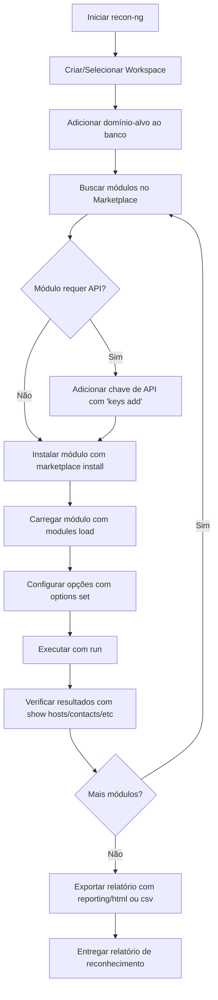

# Recon-ng

> [!quote] Framework de Inteligência
> *Recon-ng automatiza a coleta de informações públicas sobre alvos, organizando tudo em workspaces.*

---

## 🔍 O que é Recon-ng?

> [!success] Definição
> O **Recon-ng** é uma ferramenta OSINT (Open Source Intelligence) que vasculha dados públicos e acessíveis para recolher informações sobre pessoas, empresas, domínios e muito mais. Escrito em Python, seu design modular e interface similar ao Metasploit tornaram-no referência em reconhecimento automatizado para pentesters e pesquisadores de segurança.

### Características

| Característica | Descrição |
|----------------|-----------|
| **Modular** | Mais de 90 módulos para diferentes fontes e categorias |
| **Workspaces** | Organiza informações por projeto/alvo em banco SQLite separado |
| **Banco de dados** | Armazena todos os dados coletados automaticamente |
| **API integrada** | Conecta com Shodan, VirusTotal, HackerTarget, ARIN, Have I Been Pwned e outros |
| **Pré-instalado** | Já vem no Kali Linux; instalável via pip em qualquer distro |
| **Scripting** | Aceita scripts de comandos para automação de fluxos completos |
| **Relatórios** | Exporta resultados em HTML, CSV, JSON, XML e XLSX |

> [!info] 🗓️ Contexto 2026
> Em 2025/2026, o Recon-ng é amplamente adotado por profissionais de red team. Pesquisa OWASP 2025 indica que 78% dos pentesters preferem Recon-ng ao Maltego pela capacidade de scripting em pipelines DevSecOps. A versão 5 (atual) reformulou completamente o marketplace de módulos em relação à versão 4.

---

## ⚖️ Ética, Legalidade e Limites

> [!danger] Atenção Legal
> O uso não autorizado de ferramentas de reconhecimento pode configurar crime. No Brasil, o **art. 154-A do Código Penal** tipifica a invasão de dispositivo informático alheio, com pena de reclusão de 1 a 4 anos e multa (agravada se houver obtenção de dados pessoais ou econômicos). O Recon-ng coleta dados publicamente disponíveis (OSINT), mas cruzar essas informações com alvos sem autorização já é suficiente para gerar responsabilidade legal e ética.

### Regras do Profissional Ético

| Situação | Permitido? |
|----------|-----------|
| Recon no seu próprio domínio/servidor | Sim, sempre |
| Recon em ambiente de laboratório (CTF, HackTheBox, TryHackMe) | Sim, dentro dos limites da plataforma |
| Recon com autorização escrita do cliente (pentest formal) | Sim, com escopo definido |
| Recon em domínio de terceiro sem autorização | Não, ilegal |
| Recon para fins acadêmicos sobre alvos públicos com dados já indexados | Depende: consulte o professor e leia os termos de cada API |

> [!warning] Escopo é Tudo
> Antes de qualquer engajamento real, obtenha autorização por escrito com escopo claro: quais domínios, IPs e janela de tempo estão autorizados. O documento de autorização protege tanto o cliente quanto o profissional.

---

## 🏗️ Arquitetura Interna

O Recon-ng organiza seu funcionamento em camadas bem definidas:

```
recon-ng/
├── workspaces/          ← um banco SQLite por alvo/projeto
│   ├── domains          ← tabela de domínios
│   ├── hosts            ← tabela de hosts descobertos
│   ├── contacts         ← tabela de contatos/emails
│   ├── ports            ← tabela de portas abertas
│   ├── credentials      ← tabela de credenciais vazadas
│   └── vulnerabilities  ← tabela de vulnerabilidades
├── modules/             ← módulos instalados via marketplace
└── keys.db              ← armazenamento seguro de chaves de API
```

Cada workspace é independente: dados de um cliente não vazam para outro projeto. O banco SQLite fica em `~/.recon-ng/workspaces/<nome>/data.db`.

---

## 🔄 Fluxo de Trabalho no Recon-ng



---

## 💻 Instalação e Primeiros Passos

> [!tip] Instalação em Kali Linux / Debian / Ubuntu

### Instalação via pip (se não estiver pré-instalado)

```bash
# Instalar dependências e o recon-ng
pip3 install recon-ng

# Ou clonar o repositório oficial
git clone https://github.com/lanmaster53/recon-ng.git
cd recon-ng
pip3 install -r REQUIREMENTS
./recon-ng
```

### Iniciando o Recon-ng

```bash
# Iniciar a ferramenta (prompt interativo)
recon-ng

# Iniciar diretamente em um workspace existente
recon-ng -w nome_do_workspace
```

Ao iniciar, você verá o banner do recon-ng e o prompt `[recon-ng][default] >`. O workspace padrão se chama `default`.

---

## 📂 Gerenciando Workspaces

> [!tip] Workspaces
> Cada workspace armazena seu próprio banco de dados isolado. Use um workspace por alvo/cliente para manter os dados organizados.

```bash
# Criar novo workspace
workspaces create aula_seguranca

# Listar todos os workspaces
workspaces list

# Selecionar (trocar para) um workspace
workspaces select aula_seguranca

# Remover workspace (cuidado: apaga todos os dados)
workspaces remove aula_seguranca
```

Após criar ou selecionar o workspace, o prompt muda para `[recon-ng][aula_seguranca] >`, confirmando o contexto ativo.

---

## 📦 Marketplace de Módulos

> [!info] Marketplace
> O Recon-ng v5 introduziu o marketplace integrado. Os módulos não vêm instalados por padrão; você busca, instala e usa sob demanda.

### Comandos do Marketplace

```bash
# Listar todos os módulos disponíveis
marketplace search

# Buscar módulos por palavra-chave
marketplace search domains
marketplace search whois
marketplace search shodan
marketplace search email

# Ver informações detalhadas de um módulo
marketplace info recon/domains-hosts/hackertarget

# Instalar um módulo específico
marketplace install recon/domains-hosts/hackertarget

# Instalar TODOS os módulos de uma vez (demora alguns minutos)
marketplace install all

# Remover um módulo instalado
marketplace remove recon/domains-hosts/hackertarget

# Ver módulos que precisam de atualização
marketplace search * | grep Outdated
```

---

## 🛠️ Catálogo de Módulos por Categoria

> [!info] Estrutura de Nomes
> O nome do módulo segue o padrão `categoria/entrada-saida/nome`. Por exemplo, `recon/domains-hosts/hackertarget` está na categoria `recon`, recebe `domains` como entrada e produz `hosts` como saída.

### Reconhecimento: Domínios

| Módulo | Entrada | Saída | Descrição | Requer API? |
|--------|---------|-------|-----------|------------|
| `recon/domains-hosts/hackertarget` | domínio | hosts | Subdomínios via HackerTarget API | Não (gratuita) |
| `recon/domains-hosts/bing_domain_web` | domínio | hosts | Subdomínios via Bing | Não |
| `recon/domains-hosts/google_site_web` | domínio | hosts | Subdomínios via Google dork | Não |
| `recon/domains-hosts/brute_hosts` | domínio | hosts | Força bruta de subdomínios com wordlist | Não |
| `recon/domains-contacts/whois_pocs` | domínio | contatos | Contatos WHOIS via ARIN | Não |
| `recon/domains-vulnerabilities/xssed` | domínio | vulnerabilidades | XSS histórico no xssed.com | Não |
| `recon/domains-hosts/shodan_hostname` | domínio | hosts | Hosts via Shodan | Sim (Shodan) |

### Reconhecimento: Hosts e IPs

| Módulo | Entrada | Saída | Descrição | Requer API? |
|--------|---------|-------|-----------|------------|
| `recon/hosts-hosts/resolve` | host | host + IP | Resolve hostname para IP | Não |
| `recon/hosts-hosts/reverse_resolve` | IP | hostname | Resolução reversa de DNS | Não |
| `recon/hosts-ports/shodan_ip` | IP | portas | Portas abertas via Shodan | Sim (Shodan) |
| `recon/hosts-hosts/ipinfodb` | IP | geolocalização | Geolocalização do IP | Sim (IPInfoDB) |

### Reconhecimento: Contatos e Emails

| Módulo | Entrada | Saída | Descrição | Requer API? |
|--------|---------|-------|-----------|------------|
| `recon/contacts-profiles/fullcontact` | email | perfis sociais | Perfis em redes sociais | Sim (FullContact) |
| `recon/contacts-credentials/hibp_breach` | email | credenciais | Vazamentos via Have I Been Pwned | Sim (HaveIBeenPwned) |
| `recon/domains-contacts/pgp_search` | domínio | emails | Emails em servidores PGP | Não |

### Reconhecimento: Empresas

| Módulo | Entrada | Saída | Descrição | Requer API? |
|--------|---------|-------|-----------|------------|
| `recon/companies-multi/shodan_org` | empresa | hosts/ports | Ativos da empresa via Shodan | Sim (Shodan) |
| `recon/companies-contacts/linkedin_auth` | empresa | contatos | Funcionários via LinkedIn | Sim (LinkedIn) |

### Discovery

| Módulo | Descrição |
|--------|-----------|
| `discovery/info_disclosure/cache_snoop` | Verifica DNS cache snooping |
| `discovery/info_disclosure/interesting_files` | Arquivos sensíveis expostos |

### Importação

| Módulo | Descrição |
|--------|-----------|
| `import/csv_file` | Importa hosts/contatos de arquivo CSV |
| `import/list` | Importa lista simples de domínios/hosts |

### Relatórios (Exportação)

| Módulo | Formato | Descrição |
|--------|---------|-----------|
| `reporting/html` | HTML | Relatório completo com dashboard visual |
| `reporting/csv` | CSV | Exporta tabela por tabela |
| `reporting/json` | JSON | Formato estruturado para integração |
| `reporting/xml` | XML | Formato legado |
| `reporting/xlsx` | Excel | Planilha com múltiplas abas |
| `reporting/list` | TXT | Lista simples de valores |

---

## ⚙️ Comandos Principais do Prompt

### Comandos Gerais

| Comando | Função |
|---------|--------|
| `help` | Exibe ajuda completa |
| `marketplace search` | Buscar módulos disponíveis |
| `marketplace install` | Instalar um módulo |
| `modules load` | Carregar um módulo para uso |
| `modules list` | Listar módulos instalados |
| `info` | Ver informações do módulo carregado |
| `options list` | Ver opções do módulo |
| `options set` | Configurar uma opção |
| `run` | Executar o módulo |
| `back` | Sair do módulo atual |
| `exit` | Encerrar o recon-ng |

### Comandos de Banco de Dados

| Comando | Função |
|---------|--------|
| `db insert domains` | Inserir domínio manualmente |
| `db insert hosts` | Inserir host manualmente |
| `show domains` | Listar domínios cadastrados |
| `show hosts` | Listar hosts descobertos |
| `show contacts` | Listar contatos encontrados |
| `show ports` | Listar portas abertas |
| `show credentials` | Listar credenciais vazadas |
| `show vulnerabilities` | Listar vulnerabilidades |
| `show dashboard` | Resumo geral de todos os dados |
| `show schema` | Estrutura completa do banco de dados |

### Gerenciamento de Chaves de API

```bash
# Listar todas as chaves configuradas (e quais estão definidas)
keys list

# Adicionar uma chave de API
keys add shodan_api SUA_CHAVE_AQUI
keys add virustotal_api SUA_CHAVE_AQUI
keys add fullcontact_api SUA_CHAVE_AQUI
keys add hibp_api SUA_CHAVE_AQUI

# Remover uma chave de API
keys remove shodan_api
```

> [!info] Onde obter chaves gratuitas
> - **Shodan**: shodan.io (plano gratuito disponível)
> - **Have I Been Pwned**: haveibeenpwned.com/API/Key (pago, mas barato)
> - **HackerTarget**: hackertarget.com (uso básico gratuito, sem chave)
> - **VirusTotal**: virustotal.com (registro gratuito)

---

## 🔑 Configuração de Chaves de API

> [!warning] Chaves de API
> Muitos módulos poderosos requerem chaves de API. As chaves são armazenadas de forma segura em `~/.recon-ng/keys.db` e são compartilhadas entre todos os workspaces. Basta configurar uma vez.

```bash
# Verificar quais módulos precisam de chave
marketplace search * | grep needs-key

# Processo completo: verificar, adicionar e confirmar
[recon-ng][default] > keys list
[recon-ng][default] > keys add shodan_api ABC123SUACHAVESHODAN
[recon-ng][default] > keys list

# Saída esperada:
#  +-----------------+----------------------------------+
#  |       Name      |              Value               |
#  +-----------------+----------------------------------+
#  | shodan_api      | ABC123SUACHAVESHODAN             |
#  +-----------------+----------------------------------+
```

---

## 🚀 Fluxo Completo: Do Zero ao Relatório

Este é o fluxo que você executará em um pentest real de reconhecimento:

### Passo 1: Iniciar e criar workspace

```bash
# Iniciar o recon-ng
recon-ng

# Criar workspace para o alvo
[recon-ng][default] > workspaces create cliente_exemplo
[recon-ng][cliente_exemplo] >
```

### Passo 2: Adicionar o domínio-alvo ao banco

```bash
# Inserir o domínio alvo
[recon-ng][cliente_exemplo] > db insert domains

# O prompt pedirá o domínio:
# domain (TEXT): exemplo.com.br
# Inserido com sucesso

# Confirmar inserção
[recon-ng][cliente_exemplo] > show domains

# Saída esperada:
#  +----+----------------+--------+
#  | rowid |   domain   | module |
#  +-------+------------+--------+
#  |   1   | exemplo.com.br | user |
#  +-------+------------+--------+
```

### Passo 3: Instalar e carregar módulos

```bash
# Instalar o módulo hackertarget
[recon-ng][cliente_exemplo] > marketplace install recon/domains-hosts/hackertarget

# Carregar o módulo
[recon-ng][cliente_exemplo] > modules load recon/domains-hosts/hackertarget

# Ver informações e opções disponíveis
[recon-ng][cliente_exemplo][hackertarget] > info

# Saída esperada:
#  Name: HackerTarget Lookup
#  Path: modules/recon/domains-hosts/hackertarget
#  Author: Tim Tomes (@LaNMaSteR53)
#  Version: 1.1
#
#  Options:
#  +----------+-------------+----------+----------------------------+
#  |   Name   |    Current  | Required |       Description          |
#  +----------+-------------+----------+----------------------------+
#  |  SOURCE  | default     |   yes    | source of input            |
#  +----------+-------------+----------+----------------------------+
```

### Passo 4: Configurar e executar

```bash
# O SOURCE "default" já usa os domínios do banco automaticamente
# Para forçar um domínio específico (sem usar o banco):
[recon-ng][cliente_exemplo][hackertarget] > options set SOURCE exemplo.com.br

# Executar o módulo
[recon-ng][cliente_exemplo][hackertarget] > run

# Saída esperada (truncada para exemplo):
#  [*] Searching HackerTarget for subdomains of exemplo.com.br...
#  [*] mail.exemplo.com.br (200.123.45.1)
#  [*] www.exemplo.com.br (200.123.45.2)
#  [*] vpn.exemplo.com.br (200.123.45.3)
#  [*] ftp.exemplo.com.br (200.123.45.4)
#  [*] 4 total (4 new) hosts found.
```

### Passo 5: Verificar resultados no banco

```bash
# Voltar ao prompt principal
[recon-ng][cliente_exemplo][hackertarget] > back

# Ver todos os hosts descobertos
[recon-ng][cliente_exemplo] > show hosts

# Ver dashboard geral
[recon-ng][cliente_exemplo] > show dashboard
```

### Passo 6: Resolver IPs dos hosts descobertos

```bash
# Instalar e carregar módulo de resolução DNS
[recon-ng][cliente_exemplo] > marketplace install recon/hosts-hosts/resolve
[recon-ng][cliente_exemplo] > modules load recon/hosts-hosts/resolve
[recon-ng][cliente_exemplo][resolve] > run

# O módulo pega todos os hosts sem IP do banco e resolve automaticamente
# Saída esperada:
#  [*] Country: Brazil
#  [*] mail.exemplo.com.br => 200.123.45.1
#  [*] www.exemplo.com.br => 200.123.45.2
#  ...
```

### Passo 7: Coletar informações WHOIS

```bash
[recon-ng][cliente_exemplo] > back
[recon-ng][cliente_exemplo] > marketplace install recon/domains-contacts/whois_pocs
[recon-ng][cliente_exemplo] > modules load recon/domains-contacts/whois_pocs
[recon-ng][cliente_exemplo][whois_pocs] > run

# Extrai contatos (nome, email, telefone) do registro WHOIS do domínio
# Saída esperada:
#  [*] [email] admin@exemplo.com.br
#  [*] [email] noc@exemplo.com.br
#  [*] 2 total (2 new) contacts found.
```

### Passo 8: Gerar relatório HTML

```bash
[recon-ng][cliente_exemplo] > back
[recon-ng][cliente_exemplo] > marketplace install reporting/html
[recon-ng][cliente_exemplo] > modules load reporting/html

# Configurar o relatório
[recon-ng][cliente_exemplo][html] > options set CREATOR "Equipe Red Team IFF"
[recon-ng][cliente_exemplo][html] > options set CUSTOMER "Cliente Exemplo"
[recon-ng][cliente_exemplo][html] > options set FILENAME /tmp/relatorio_recon.html

# Gerar o relatório
[recon-ng][cliente_exemplo][html] > run

# Saída esperada:
#  [*] Generating HTML report...
#  [*] Report saved to /tmp/relatorio_recon.html
```

```bash
# Exportar também em CSV (uma tabela por vez)
[recon-ng][cliente_exemplo] > back
[recon-ng][cliente_exemplo] > modules load reporting/csv
[recon-ng][cliente_exemplo][csv] > options set TABLE hosts
[recon-ng][cliente_exemplo][csv] > options set FILENAME /tmp/hosts_recon.csv
[recon-ng][cliente_exemplo][csv] > run
```

---

## 📝 Scripting: Automatizando Fluxos com Arquivos de Recursos

> [!tip] Automação com Scripts
> O Recon-ng aceita arquivos de texto com comandos (um por linha) para automatizar fluxos completos. Ideal para repetir o mesmo recon em vários alvos.

```bash
# Criar arquivo de script: recon_basico.rc
workspaces create $ALVO
db insert domains
$DOMINIO
marketplace install recon/domains-hosts/hackertarget
modules load recon/domains-hosts/hackertarget
run
back
marketplace install recon/domains-contacts/whois_pocs
modules load recon/domains-contacts/whois_pocs
run
back
marketplace install recon/hosts-hosts/resolve
modules load recon/hosts-hosts/resolve
run
back
marketplace install reporting/html
modules load reporting/html
options set FILENAME /tmp/relatorio_$ALVO.html
run
exit
```

```bash
# Executar o script
recon-ng -r recon_basico.rc
```

---

## 🔒 Defesa: Como se Proteger do Recon-ng

> [!warning] Perspectiva Defensiva
> Entender como o Recon-ng coleta informações permite que gestores de segurança (blue team) reduzam a exposição da organização. Os dados coletados pelo Recon-ng são todos PÚBLICOS: o problema é a organização não saber o que está exposto.

### O que o Recon-ng Coleta e Como Dificultar

| O que é coletado | Fonte | Como mitigar |
|-----------------|-------|--------------|
| Subdomínios | DNS, Bing, Google, HackerTarget | Usar wildcard DNS com cuidado; não publicar subdomínios internos |
| Emails e contatos | WHOIS, PGP servers | Usar emails de privacidade no WHOIS (Privacy Guard); GDPR exige isso |
| IPs e portas | Shodan, banners públicos | Não expor serviços desnecessários; usar firewall; desabilitar banners |
| Credenciais vazadas | Have I Been Pwned, Pastebin | Autenticação multifator (MFA); rotação de senhas pós-breach |
| Tecnologias usadas | Headers HTTP, Shodan | Remover headers que revelam versões (X-Powered-By, Server) |
| Dados de registro WHOIS | ARIN, LACNIC, Registro.br | Proteção de privacidade no registrador do domínio |

### Verificando sua Exposição (Blue Team)

```bash
# Como gestor de segurança, VOCÊ pode rodar o Recon-ng
# contra SEU PRÓPRIO domínio para auditar sua exposição:

recon-ng
workspaces create auditoria_interna
db insert domains
# digitar: suaempresa.com.br
modules load recon/domains-hosts/hackertarget
run
show hosts

# Cada host listado é uma superfície de ataque visível ao adversário
```

> [!success] Princípio do "Assumir Violação"
> O melhor defensor já assume que o adversário COMPLETOU o recon. A defesa não é impedir o recon (impossível com dados OSINT), mas limitar o que pode ser feito COM essas informações: MFA, segmentação de rede, zero trust.

---

## 🧪 Atividades Práticas

> [!example] 🧪 Atividade 1: Instalar o Recon-ng, criar workspace e instalar um módulo
>
> **Objetivo:** Familiarizar-se com o ambiente do Recon-ng e o fluxo básico de instalação de módulos.
>
> **Ambiente:** Kali Linux (laboratório local ou VM)
>
> **Passos:**
>
> ```bash
> # 1. Iniciar o recon-ng
> recon-ng
>
> # 2. Criar um workspace com seu nome
> [recon-ng][default] > workspaces create lab_seginf
>
> # 3. Confirmar que o workspace foi criado
> [recon-ng][lab_seginf] > workspaces list
>
> # 4. Buscar módulos de domínio
> [recon-ng][lab_seginf] > marketplace search domains-hosts
>
> # 5. Instalar o módulo hackertarget
> [recon-ng][lab_seginf] > marketplace install recon/domains-hosts/hackertarget
>
> # 6. Carregar o módulo e ver suas informações
> [recon-ng][lab_seginf] > modules load recon/domains-hosts/hackertarget
> [recon-ng][lab_seginf][hackertarget] > info
> ```
>
> **Resultado esperado:** Prompt mostrando `[recon-ng][lab_seginf][hackertarget] >` com as opções do módulo visíveis.
>
> **Entregável:** Screenshot do terminal mostrando o módulo carregado e as opções exibidas pelo `info`.

> [!example] 🧪 Atividade 2: Rodar um módulo de recon contra o seu próprio domínio
>
> **Objetivo:** Executar reconhecimento real (autorizado) e interpretar os resultados.
>
> **Alvo autorizado:** Use o domínio institucional do IFF (`iff.edu.br`) como alvo de estudo (dados públicos) ou, se tiver, um domínio pessoal que você administra. **Não use domínios de terceiros.**
>
> **Passos:**
>
> ```bash
> # Dentro do workspace lab_seginf
>
> # 1. Inserir o domínio alvo no banco
> [recon-ng][lab_seginf][hackertarget] > back
> [recon-ng][lab_seginf] > db insert domains
> # domain (TEXT): iff.edu.br
>
> # 2. Confirmar inserção
> [recon-ng][lab_seginf] > show domains
>
> # 3. Carregar o módulo hackertarget
> [recon-ng][lab_seginf] > modules load recon/domains-hosts/hackertarget
>
> # 4. Confirmar que SOURCE aponta para o banco (valor "default")
> [recon-ng][lab_seginf][hackertarget] > options list
>
> # 5. Executar
> [recon-ng][lab_seginf][hackertarget] > run
>
> # 6. Ver hosts descobertos
> [recon-ng][lab_seginf][hackertarget] > back
> [recon-ng][lab_seginf] > show hosts
> ```
>
> **Resultado esperado:** Lista de subdomínios do IFF com seus IPs associados. Exemplos típicos: `www.iff.edu.br`, `mail.iff.edu.br`, `suap.iff.edu.br`, `academico.iff.edu.br`.
>
> **Análise:** Para cada host encontrado, responda: Este serviço deveria estar público? Qual é a superfície de ataque exposta?
>
> **Entregável:** Screenshot com `show hosts` e um parágrafo de análise da exposição observada.

> [!example] 🧪 Atividade 3: Exportar resultados em HTML e CSV
>
> **Objetivo:** Gerar relatório profissional dos dados coletados na atividade anterior.
>
> **Passos:**
>
> ```bash
> # Continuando no workspace lab_seginf com dados já coletados
>
> # 1. Instalar e carregar o módulo de relatório HTML
> [recon-ng][lab_seginf] > marketplace install reporting/html
> [recon-ng][lab_seginf] > modules load reporting/html
>
> # 2. Configurar o relatório
> [recon-ng][lab_seginf][html] > options set CREATOR "Seu Nome - IFF"
> [recon-ng][lab_seginf][html] > options set CUSTOMER "IFF (recon educacional)"
> [recon-ng][lab_seginf][html] > options set FILENAME /tmp/relatorio_iff.html
>
> # 3. Gerar o relatório
> [recon-ng][lab_seginf][html] > run
>
> # 4. Abrir no navegador para visualizar
> firefox /tmp/relatorio_iff.html &
>
> # 5. Exportar hosts em CSV separadamente
> [recon-ng][lab_seginf][html] > back
> [recon-ng][lab_seginf] > modules load reporting/csv
> [recon-ng][lab_seginf][csv] > options set TABLE hosts
> [recon-ng][lab_seginf][csv] > options set FILENAME /tmp/hosts_iff.csv
> [recon-ng][lab_seginf][csv] > run
>
> # 6. Verificar o CSV gerado
> cat /tmp/hosts_iff.csv
> ```
>
> **Resultado esperado:** Arquivo HTML com dashboard visual contendo todos os hosts, e arquivo CSV com colunas host, ip_address, region, country, latitude, longitude, notes, module.
>
> **Entregável:** PDF (ou screenshot) do relatório HTML aberto no navegador, mais o arquivo CSV.

---

## 🔄 Encadeando Módulos: Pipeline de Recon Completo

> [!tip] Inteligência Progressiva
> O poder do Recon-ng está no encadeamento: a saída de um módulo alimenta a entrada do próximo. Isso cria um pipeline de enriquecimento progressivo dos dados.

```
domínio
  └─▶ hackertarget ──▶ hosts (subdomínios)
        └─▶ resolve ──▶ hosts com IPs
              └─▶ shodan_ip ──▶ hosts com portas e serviços
domínio
  └─▶ whois_pocs ──▶ contatos (emails)
        └─▶ hibp_breach ──▶ credenciais vazadas
              └─▶ contacts-profiles/fullcontact ──▶ perfis sociais
```

```bash
# Pipeline completo (5 módulos encadeados)
# Cada módulo usa automaticamente os dados do anterior no banco

# Módulo 1: descobrir subdomínios
modules load recon/domains-hosts/hackertarget
run
back

# Módulo 2: resolver IPs dos subdomínios descobertos
modules load recon/hosts-hosts/resolve
run
back

# Módulo 3: coletar contatos WHOIS
modules load recon/domains-contacts/whois_pocs
run
back

# Módulo 4: verificar vazamentos com emails encontrados
# (requer chave de API do HIBP)
modules load recon/contacts-credentials/hibp_breach
run
back

# Módulo 5: gerar relatório final consolidado
modules load reporting/html
options set FILENAME /tmp/recon_completo.html
run
```

---

## 📚 Recursos de Aprendizado

> [!tip] Tutoriais e Documentação

| Recurso | Link |
|---------|------|
| **Playlist Oficial** | [Recon-ng V5 - Introduction And New Updates](https://www.youtube.com/watch?v=1RCqOhb0yxE&list=PLBf0hzazHTGOg9taK90uFjdcb8UgGfRKZ) |
| **Tutorial Tiago Tavares** | [Recon-NG](https://tiagotavares.io/2020/07/recon-ng/) |
| **Introdução (PT-BR)** | [Introdução ao Recon-NG parte 1](https://medium.com/canivete-sui%C3%A7o-hacker/recon-ng-1-f7296ae2f742) |
| **HackerTarget Tutorial** | [Recon-ng Tutorial](https://hackertarget.com/recon-ng-tutorial/) |
| **Guia Completo (EN)** | [Mastering Recon-ng - Medium](https://medium.com/@rajkumarkumawat/mastering-recon-ng-the-complete-osint-guide-for-ethical-hackers-226b352fbf5b) |
| **Cheat Sheet** | [Recon-ng Cheat Sheet - CyberSamir](https://blog.cybersamir.com/recon-ng-cheat-sheet/) |
| **Marketplace 200+ Módulos** | [Recon-ng Marketplace Explained](https://codingjourney.co.in/recon-ng-marketplace/) |
| **Repositório oficial** | [github.com/lanmaster53/recon-ng](https://github.com/lanmaster53/recon-ng) |

---

## ⚠️ Considerações Finais

> [!warning] Uso Responsável
> - Utilize apenas para alvos autorizados
> - Alguns módulos requerem chaves de API pagas
> - Respeite os termos de uso das APIs utilizadas
> - Documente suas descobertas de forma ética e profissional
> - Em pentest formal, inclua todas as descobertas de recon no relatório final
> - Dados OSINT podem revelar informações sensíveis de funcionários: trate com confidencialidade

> [!success] O Recon-ng no Contexto do Pentest
> O reconhecimento é a fase mais crítica de um pentest: quanto melhor o recon, mais preciso e eficiente será o restante do engajamento. O Recon-ng automatiza e organiza essa fase, mas a inteligência de INTERPRETAR os dados coletados é sempre humana.

---

> [!note] 📚 Fontes (2026)
> - [Mastering Recon-ng: The Complete OSINT Guide for Ethical Hackers](https://medium.com/@rajkumarkumawat/mastering-recon-ng-the-complete-osint-guide-for-ethical-hackers-226b352fbf5b) (Medium, 2025)
> - [How to Use Recon-ng Tool for OSINT, Bug Bounty Hunting, and Cybersecurity Reconnaissance](https://www.webasha.com/blog/how-to-use-recon-ng-tool-for-osint-bug-bounty-hunting-and-cybersecurity-reconnaissance-with-complete-commands-api-setup-and-real-world-examples) (WebAsha Technologies, 2025)
> - [Recon-ng Tutorial](https://hackertarget.com/recon-ng-tutorial/) (HackerTarget.com)
> - [Recon-ng Tutorial: Automated OSINT Framework Guide](https://scansearch.net/en/articles/recon-ng-tutorial-osint-framework/) (ScanSearch, 2025)
> - [Ultimate Recon-ng Cheat Sheet](https://blog.cybersamir.com/recon-ng-cheat-sheet/) (CyberSamir Blog)
> - [Recon-ng Marketplace: 200+ Powerful Modules Explained](https://codingjourney.co.in/recon-ng-marketplace/) (CodingJourney)
> - [Pen Methodologies Python: Recon-ng Modules for OSINT Gathering 2026](https://johal.in/pen-methodologies-python-recon-ng-modules-for-osint-gathering-2026-2/) (Johal.in, 2026)
> - [API Keys - recon-ng-marketplace Wiki](https://github.com/lanmaster53/recon-ng-marketplace/wiki/API-Keys) (GitHub oficial)
> - [Recon-ng V5 - Adding API Keys (Shodan)](https://www.youtube.com/watch?v=MUyX2QQugs0) (YouTube, canal oficial)
> - [Recon-ng Modules Cheat Sheet](https://vespersec.net/docs/osint-reconnaissance/recon-ng-modules-cheat-sheet/) (VesperSec)
