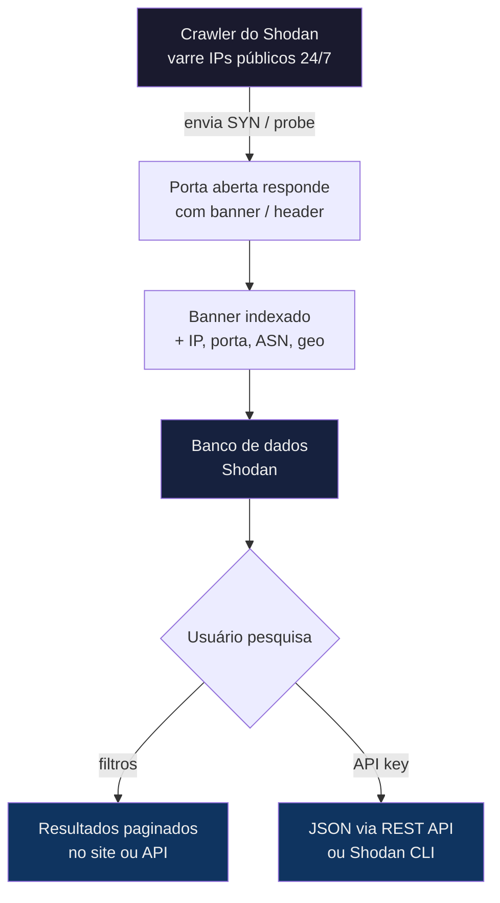
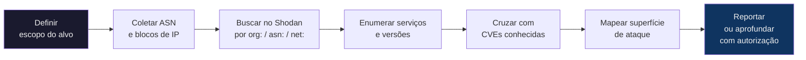
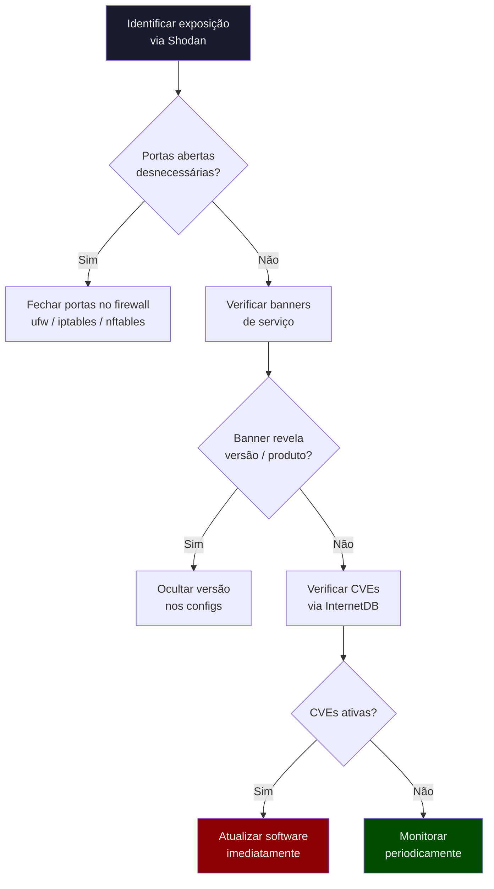

# Shodan

> [!quote] O Google dos Hackers
> *Shodan não indexa sites: ele indexa dispositivos conectados à Internet.*

---

## 🔍 O que é Shodan?

> [!success] Definição
> **Shodan** é um motor de busca que varre a Internet e indexa informações sobre dispositivos conectados: servidores, roteadores, câmeras de segurança, sistemas industriais, IoT e muito mais.

[🔗 Shodan - Acesso ao Site](https://www.shodan.io/)

Enquanto o Google indexa **conteúdo** (páginas HTML), o Shodan indexa **banners de serviço**: as respostas que servidores dão quando alguém bate em suas portas. O crawler do Shodan varre continuamente toda a faixa de IPs públicos da Internet, conecta-se em milhares de portas diferentes e grava a resposta inicial de cada serviço. Esse banner contém informações riquíssimas: versão do software, sistema operacional, certificado TLS, cabeçalhos HTTP, prompt de login e muito mais.

### O que o Shodan Encontra?

| Tipo | Exemplos |
|------|----------|
| **Servidores** | Web, FTP, SSH, Telnet |
| **Câmeras** | IP cameras, DVRs, NVRs |
| **IoT** | Smart TVs, geladeiras, termostatos |
| **Industrial** | SCADA, PLCs, sistemas de controle |
| **Redes** | Roteadores, switches, firewalls |
| **Bancos de dados** | MongoDB, Elasticsearch, Redis expostos |
| **Serviços em nuvem** | APIs expostas, buckets, painéis de admin |
| **Sistemas de controle predial** | HVAC, painéis de elevador, supervisão elétrica |

### Como o Shodan Funciona Internamente



> [!info] 🕐 Frequência de Atualização
> Os dorks e contagens são atualizados a cada 6 horas. Dados de host individuais podem ter até 30 dias. Para forçar um re-scan do seu próprio IP, use `shodan scan submit <IP>` (exige créditos de scan).

---

## 🌐 Contexto Legal e Ético

> [!danger] ⚖️ Art. 154-A do Código Penal Brasileiro
> **"Invadir dispositivo informático alheio, conectado ou não à rede de computadores, mediante violação indevida de mecanismo de segurança e sem autorização expressa ou tácita do titular do dispositivo, com o fim de obter, adulterar ou destruir dados ou informações sem autorização ou de instalar vulnerabilidades para obter vantagem ilícita."**
> Pena: detenção de 1 (um) a 4 (quatro) anos, e multa. (Lei 12.737/2012, agravada pela Lei 14.155/2021)

### O que é legal com o Shodan

O Shodan **observa** o que já está exposto publicamente na Internet. A empresa é quem faz o scan; você apenas lê os dados em cache. Isso é análogo a olhar para uma vitrine na rua: nenhuma lei proíbe olhar. O crime ocorre quando você **entra** sem permissão.

| Ação | Status Legal |
|------|-------------|
| Pesquisar no Shodan.io | Legal (reconhecimento passivo) |
| Usar a API do Shodan com filtros | Legal (reconhecimento passivo) |
| Verificar se um IP é seu próprio | Legal |
| Tentar login com credenciais padrão encontradas | **ILEGAL** (art. 154-A CP) |
| Explorar vulnerabilidade encontrada em sistema alheio | **ILEGAL** (art. 154-A + 154-B CP) |
| Usar em pentest com escopo assinado | Legal (autorização expressa) |

> [!tip] 💡 Regra de Ouro
> **Shodan = observar.** Tudo que vier depois (conectar, autenticar, explorar) precisa de autorização por escrito. Pratique sempre observando o **seu próprio IP** ou em ambientes de laboratório (HTB, TryHackMe, DVWA).

---

## 💻 Filtros de Busca

> [!tip] Operadores Principais

| Filtro | Descrição | Exemplo |
|--------|-----------|---------|
| `country:` | Filtrar por país (código ISO) | `country:BR` |
| `city:` | Filtrar por cidade | `city:"São Paulo"` |
| `port:` | Filtrar por porta | `port:22` |
| `os:` | Sistema operacional | `os:windows` |
| `product:` | Produto/software | `product:Apache` |
| `hostname:` | Nome do host | `hostname:.gov.br` |
| `net:` | Range de IP (CIDR) | `net:200.0.0.0/8` |
| `org:` | Organização (ISP ou empresa) | `org:"Claro NXT"` |
| `asn:` | Autonomous System Number | `asn:AS28573` |
| `http.title:` | Título da página HTTP | `http.title:"Router Login"` |
| `http.html:` | Conteúdo do HTML indexado | `http.html:"phpMyAdmin"` |
| `ssl.cert.subject.cn:` | Common Name do certificado TLS | `ssl.cert.subject.cn:empresa.com.br` |
| `ssl.cert.issuer.cn:` | Emissor do certificado | `ssl.cert.issuer.cn:"Let's Encrypt"` |
| `vuln:` | CVE específica | `vuln:CVE-2021-44228` |
| `has_screenshot:true` | Dispositivos com screenshot capturado | `has_screenshot:true port:5900` |
| `tag:` | Tag automática do Shodan | `tag:ics country:BR` |
| `version:` | Versão do software | `version:2.4.49 product:Apache` |
| `before:` / `after:` | Filtro por data de indexação | `before:2024-01-01` |

### Filtros Avançados para Pentesters (2025/2026)

| Filtro | Uso em Pentest | Exemplo |
|--------|---------------|---------|
| `ssl.cert.subject.cn:` | Enumerar subdomínios via certificado | `ssl.cert.subject.cn:"*.target.com.br"` |
| `http.component:` | Detectar tecnologia web | `http.component:wordpress` |
| `http.status:` | Filtrar por código HTTP | `http.status:200 http.title:"admin"` |
| `asn:` | Mapear infraestrutura de uma empresa | `asn:AS28573 org:"Claro"` |
| `vuln:` | Encontrar alvos com CVE conhecida | `vuln:CVE-2021-44228 country:BR` |
| `tag:cloud` | Infraestrutura em nuvem | `tag:cloud org:"Amazon"` |
| `tag:database` | Bancos de dados expostos | `tag:database country:BR` |
| `tag:ics` | Sistemas de controle industrial | `tag:ics country:BR` |

### Exemplos de Buscas

```
# Câmeras no Brasil
webcam country:BR

# Servidores Apache em São Paulo
product:Apache city:"São Paulo"

# Sistemas SCADA expostos no Brasil
port:502 country:BR

# MongoDB sem autenticação
product:MongoDB -authentication

# Roteadores com senha padrão
"default password" country:BR

# Dispositivos com screenshot via VNC
has_screenshot:true port:5900 country:BR

# Painéis phpMyAdmin expostos no Brasil
http.title:"phpMyAdmin" country:BR

# Log4Shell: sistemas ainda vulneráveis ao Log4j
vuln:CVE-2021-44228 country:BR

# Servidores SSH com versão OpenSSH antiga
product:OpenSSH version:6 country:BR

# Elasticsearch aberto no Brasil
product:Elasticsearch port:9200 country:BR

# Redis sem autenticação
product:Redis country:BR

# Painéis de câmera Hikvision
http.title:"Hikvision" country:BR

# Cisco IOS expostos
product:"Cisco IOS" country:BR
```

---

## 🎯 Buscas Interessantes (Dorks)

> [!warning] Use com Responsabilidade
> Estas buscas encontram sistemas **reais** com problemas de segurança **reais**. Visualizar os resultados é legal; interagir com os sistemas sem autorização é crime.

| Busca | O que Encontra |
|-------|----------------|
| `"Server: SQ-WEBCAM"` | Câmeras de segurança |
| `"port:5900 authentication disabled"` | VNC sem senha |
| `"X-Plex-Token"` | Servidores Plex expostos |
| `"MongoDB Server Information"` | MongoDB exposto |
| `"port:9200 elastic"` | Elasticsearch aberto |
| `"authentication disabled" port:5432` | PostgreSQL sem auth |
| `http.title:"pfSense"` | Firewalls pfSense com painel exposto |
| `http.title:"Grafana" country:BR` | Dashboards Grafana sem login |
| `http.title:"Kibana" country:BR` | Kibana (dados Elasticsearch) exposto |
| `"220" "230 Login successful" port:21` | FTP com login anônimo habilitado |
| `http.title:"Home Assistant"` | Automação residencial exposta |
| `"router" "admin" http.title:"login" country:BR` | Roteadores domésticos com painel aberto |
| `product:"Jenkins" country:BR` | Servidores Jenkins de CI/CD expostos |
| `http.title:"GitLab" country:BR` | Instâncias GitLab públicas |
| `product:"Jupyter Notebook" country:BR` | Notebooks Jupyter (execução de código!) |

### Dorks para Reconhecimento de Alvo Específico

```
# Todos os hosts de uma empresa (via certificado TLS)
ssl.cert.subject.cn:"empresa.com.br"

# Todos os hosts de um domínio (incluindo subdomínios)
hostname:empresa.com.br

# Infraestrutura de um ASN específico
asn:AS12345

# IPs de um range de uma organização
org:"Nome da Empresa" country:BR

# APIs REST expostas sem auth
http.title:"API" http.status:200 country:BR

# Painéis de administração
http.title:"admin panel" country:BR OR http.title:"painel admin" country:BR
```

---

## 🛠️ Ferramentas Shodan

> [!info] Recursos Adicionais

| Ferramenta | Descrição |
|------------|-----------|
| **Shodan CLI** | Interface de linha de comando (Python) |
| **Shodan API** | Integração programática (REST + Python SDK) |
| **Shodan Monitor** | Monitoramento de IPs/redes em tempo real |
| **Shodan Maps** | Visualização geográfica de resultados |
| **Shodan Images** | Galeria de screenshots de dispositivos |
| **Shodan Trends** | Análise histórica de dados (por facet) |
| **InternetDB** | API gratuita e sem auth para lookup rápido de IP |
| **CVEDB** | Banco de vulnerabilidades do Shodan (gratuito) |

---

## ⚙️ Shodan CLI: Guia Completo

### Instalando o CLI

```bash
# Instalar via pip (Python 3)
pip install shodan

# Inicializar com sua API Key (obter em https://account.shodan.io)
shodan init SUA_API_KEY

# Verificar se está funcionando
shodan info
```

### Comandos Essenciais do CLI

```bash
# Ver seu próprio IP público
shodan myip

# Detalhes de um host (substitua pelo IP alvo/seu IP)
shodan host 8.8.8.8

# Busca simples
shodan search "Apache"

# Contar resultados SEM gastar créditos
shodan count "product:nginx country:BR"

# Baixar resultados para arquivo (gasta 1 crédito por 100 resultados)
shodan download resultados.json.gz "port:22 country:BR"

# Analisar arquivo baixado
shodan parse resultados.json.gz

# Estatísticas de uma busca (facets)
shodan stats --facets country,port "product:Apache"

# Converter arquivo baixado para CSV
shodan convert resultados.json.gz csv

# Ver informações da conta (créditos disponíveis)
shodan info

# Scan sob demanda do SEU IP (exige créditos de scan)
shodan scan submit SEU_IP

# Verificar honeypot score de um IP
shodan honeyscore IP

# Alertas: criar alerta para seu IP ou rede
shodan alert create "Minha Rede" 200.1.2.0/24
shodan alert list
shodan alert remove ALERT_ID
```

### Combinando Filtros no CLI

```bash
# Servidores SSH no Brasil com OpenSSH antigo
shodan search --fields ip_str,port,org,version "product:OpenSSH country:BR version:7"

# Exportar IPs de bancos de dados expostos
shodan search --fields ip_str "tag:database country:BR" > ips_db.txt

# Contar por país (sem gastar crédito)
shodan count "port:3389"

# Busca com múltiplos filtros
shodan search "http.title:admin port:8080 country:BR"

# Baixar resultados de um alvo específico
shodan download alvo.json.gz "hostname:alvo.com.br"
shodan parse alvo.json.gz --fields ip_str,port,http.title,ssl.cert.subject.cn
```

### InternetDB: Lookup Gratuito Sem API Key

O InternetDB é uma API pública e gratuita do Shodan. Retorna portas abertas, CPEs, hostnames, tags e CVEs conhecidas de qualquer IPv4:

```bash
# Lookup via curl (sem API key)
curl -s https://internetdb.shodan.io/8.8.8.8 | python3 -m json.tool

# Exemplo de resposta:
# {
#   "cpes": ["cpe:/a:google:dns"],
#   "hostnames": ["dns.google"],
#   "ip": "8.8.8.8",
#   "ports": [53, 443],
#   "tags": [],
#   "vulns": []
# }

# Ver informações do SEU próprio IP
MEUIP=$(curl -s https://ipinfo.io/ip)
curl -s https://internetdb.shodan.io/$MEUIP | python3 -m json.tool
```

---

## 🐍 Shodan API com Python

A biblioteca oficial do Shodan em Python permite automatizar buscas, integrar em ferramentas e criar alertas programaticamente.

### Instalação e Setup

```bash
pip install shodan
```

### Script Básico: Busca e Extração

```python
import shodan

API_KEY = "SUA_API_KEY_AQUI"
api = shodan.Shodan(API_KEY)

# Busca simples
resultados = api.search("product:nginx country:BR port:80")

print(f"Total encontrado: {resultados['total']}")
for item in resultados['matches']:
    print(f"IP: {item['ip_str']}")
    print(f"Porta: {item['port']}")
    print(f"Org: {item.get('org', 'N/A')}")
    print(f"Data: {item['timestamp']}")
    print("---")
```

### Script: Detalhes de um Host

```python
import shodan

API_KEY = "SUA_API_KEY_AQUI"
api = shodan.Shodan(API_KEY)

# Consulta um host específico (use seu próprio IP para praticar)
host = api.host("8.8.8.8")

print(f"IP: {host['ip_str']}")
print(f"Organização: {host.get('org', 'N/A')}")
print(f"SO: {host.get('os', 'N/A')}")
print(f"País: {host.get('country_name', 'N/A')}")
print(f"Cidade: {host.get('city', 'N/A')}")
print(f"Hostnames: {', '.join(host.get('hostnames', []))}")
print(f"\nServiços encontrados:")
for item in host['data']:
    print(f"  Porta {item['port']}/{item['transport']}: {item.get('product', 'desconhecido')} {item.get('version', '')}")
    if 'vulns' in item:
        print(f"  CVEs: {list(item['vulns'].keys())}")
```

### Script: Monitorar seu Próprio IP com Shodan Monitor

```python
import shodan
import requests

API_KEY = "SUA_API_KEY_AQUI"
api = shodan.Shodan(API_KEY)

# Descobrir o próprio IP público
meu_ip = requests.get("https://ipinfo.io/ip").text.strip()
print(f"Meu IP público: {meu_ip}")

# Consultar o que o Shodan sabe sobre meu IP
try:
    host = api.host(meu_ip)
    print(f"\nPortas abertas encontradas pelo Shodan:")
    for servico in host['data']:
        print(f"  {servico['port']}/{servico['transport']}: {servico.get('product','?')} {servico.get('version','')}")
    if host.get('vulns'):
        print(f"\n[!] CVEs conhecidas: {list(host['vulns'].keys())}")
except shodan.APIError as e:
    print(f"Não encontrado no Shodan: {e}")
    print("(Isso é bom! Significa que seu IP não tem serviços expostos indexados.)")
```

---

## 📊 Metodologia de Reconhecimento com Shodan

O fluxo abaixo descreve como um pentester usa o Shodan durante a fase de **reconhecimento passivo** (sem interagir com o alvo):



### Passo a Passo: Reconhecimento de um Alvo

```bash
# 1. Descobrir o ASN da organização alvo
# (use um whois ou ferramenta como bgp.he.net)
# Exemplo: "Claro Brasil" usa AS28573

# 2. Contar hosts nesse ASN
shodan count "asn:AS28573"

# 3. Buscar serviços HTTP nesse ASN
shodan search --fields ip_str,port,http.title "asn:AS28573 port:80,443,8080,8443"

# 4. Enumerar via certificado TLS (descobre subdomínios)
shodan search --fields ip_str,ssl.cert.subject.cn "ssl.cert.subject.cn:*.empresa.com.br"

# 5. Verificar CVEs conhecidas no escopo
shodan search "asn:AS28573 vuln:CVE-2021-44228"

# 6. Baixar resultado completo para análise offline
shodan download alvo_completo.json.gz "asn:AS28573"
shodan parse alvo_completo.json.gz --fields ip_str,port,product,version,http.title,vulns
```

---

## 🔴 Atividades Práticas

> [!example] 🧪 Atividade 1: O que o Shodan sabe sobre VOCÊ?
>
> **Objetivo:** Descobrir a exposição pública do seu próprio IP sem gastar créditos.
>
> **Passo a passo:**
>
> ```bash
> # 1. Descobrir seu IP público
> curl https://ipinfo.io/ip
> # Ou via Shodan CLI:
> shodan myip
>
> # 2. Consultar o InternetDB (gratuito, sem API key)
> MEUIP=$(curl -s https://ipinfo.io/ip)
> curl -s https://internetdb.shodan.io/$MEUIP | python3 -m json.tool
>
> # 3. Se tiver conta Shodan, consultar diretamente:
> shodan host $MEUIP
> ```
>
> **O que observar no resultado:**
> - `ports`: quais portas estão abertas (visíveis pela Internet)
> - `vulns`: CVEs conhecidas associadas aos serviços
> - `tags`: classificação automática do Shodan
> - `hostnames`: nomes DNS associados ao IP
>
> **Resultado esperado (IP residencial normal):**
> ```json
> {
>   "cpes": [],
>   "hostnames": [],
>   "ip": "177.x.x.x",
>   "ports": [],
>   "tags": [],
>   "vulns": []
> }
> ```
> Sem portas e sem vulns: sua máquina está bem protegida pelo NAT do roteador.
>
> **Se aparecerem portas abertas:** documente quais são e avalie se devem estar expostas.

---

> [!example] 🧪 Atividade 2: Montar e Executar um Dork com Filtros Reais
>
> **Objetivo:** Construir uma busca Shodan com múltiplos filtros e interpretar os resultados de forma ética.
>
> **Cenário (observacional, sem interagir com os sistemas):**
>
> ```bash
> # 1. Contar painéis Grafana expostos no Brasil
> # (sem gastar crédito: só conta)
> shodan count "http.title:Grafana country:BR"
>
> # 2. Ver os primeiros resultados no site:
> # Acesse: https://www.shodan.io/search?query=http.title%3A%22Grafana%22+country%3ABR
>
> # 3. Via CLI, ver campos selecionados (usa 1 query de busca da cota)
> shodan search --fields ip_str,port,org,http.title "http.title:Grafana country:BR"
>
> # 4. Alternativa gratuita: usar o InternetDB em IPs encontrados
> # para ver CVEs sem gastar mais créditos:
> curl -s https://internetdb.shodan.io/IP_ENCONTRADO | python3 -m json.tool
> ```
>
> **Perguntas para reflexão após a atividade:**
> 1. Quantos painéis Grafana foram encontrados? O número é surpreendente?
> 2. Qual organização (org:) aparece com mais frequência?
> 3. Os resultados têm CVEs conhecidas?
> 4. Como você agiria se fosse o administrador de um desses sistemas?
>
> **Dica ética:** Se encontrar seu próprio sistema ou de sua escola/empresa, o próximo passo correto é reportar ao responsável, não explorar.

---

> [!example] 🧪 Atividade 3: Instalar o Shodan CLI e Executar `shodan host`
>
> **Objetivo:** Configurar o ambiente Shodan localmente e executar consultas via linha de comando.
>
> **Passo a passo:**
>
> ```bash
> # 1. Instalar a biblioteca Shodan
> pip install shodan
>
> # 2. Criar conta gratuita em https://account.shodan.io
> # e copiar sua API Key
>
> # 3. Inicializar o CLI com sua API key
> shodan init SUA_API_KEY_AQUI
>
> # 4. Verificar créditos disponíveis
> shodan info
> # Saída esperada:
> # Query Credits: 100
> # Scan Credits:  100
>
> # 5. Ver seu próprio IP público
> shodan myip
>
> # 6. Executar shodan host no SEU próprio IP
> MEUIP=$(shodan myip)
> shodan host $MEUIP
>
> # 7. Testar com um IP público conhecido (Google DNS)
> shodan host 8.8.8.8
> ```
>
> **Saída esperada do `shodan host 8.8.8.8`:**
> ```
> 8.8.8.8
> City:        Mountain View
> Country:     United States
> Organization:Google LLC
> Updated:     2026-01-15T10:22:11.123456
> Number of open ports: 2
>
> Ports:
>     53/udp   DNS
>    443/tcp   HTTPS
> ```
>
> **Para explorar mais (sem gastar créditos adicionais):**
> ```bash
> # Ver resultado em JSON completo
> shodan host 8.8.8.8 --history --format json
>
> # Contar resultados de uma busca (não gasta crédito de query)
> shodan count "product:nginx country:BR"
>
> # Ver estatísticas de portas abertas no Brasil
> shodan stats --facets port "country:BR"
> ```

---

## 🛡️ Defesa: Reduza sua Própria Exposição

A mesma ferramenta que um atacante usa para encontrar sistemas vulneráveis serve para você verificar e reduzir a exposição dos seus próprios sistemas.

### Checklist de Hardening



### Ações Concretas para Cada Serviço

#### Servidores Web (Apache / Nginx)

```bash
# Apache: ocultar versão e SO no banner
# /etc/apache2/conf-enabled/security.conf
ServerTokens Prod
ServerSignature Off

# Nginx: ocultar versão
# /etc/nginx/nginx.conf
server_tokens off;

# Restartar após mudança
sudo systemctl restart apache2   # ou nginx
```

#### SSH (evitar aparecer no Shodan)

```bash
# Mudar a porta padrão (reduz indexação automática)
# /etc/ssh/sshd_config
Port 2222

# Desabilitar login root
PermitRootLogin no

# Usar apenas autenticação por chave
PasswordAuthentication no

# Restringir IPs autorizados via firewall
sudo ufw allow from 200.1.2.3 to any port 2222
sudo ufw deny 2222

sudo systemctl restart sshd
```

#### Firewall: Fechar Portas Desnecessárias

```bash
# Verificar portas abertas localmente
sudo ss -tlnp
sudo nmap -sV localhost

# Bloquear portas que não devem estar expostas
sudo ufw deny 27017   # MongoDB
sudo ufw deny 6379    # Redis
sudo ufw deny 9200    # Elasticsearch
sudo ufw deny 5432    # PostgreSQL (se não precisar acesso externo)
sudo ufw deny 3389    # RDP
sudo ufw deny 5900    # VNC
sudo ufw enable

# Ver status do firewall
sudo ufw status verbose
```

#### Bancos de Dados: Nunca Expor à Internet

```bash
# MongoDB: bind apenas localhost
# /etc/mongod.conf
net:
  bindIp: 127.0.0.1

# Redis: bind localhost e exigir autenticação
# /etc/redis/redis.conf
bind 127.0.0.1
requirepass SenhaForteAqui

# Elasticsearch: bind localhost
# /etc/elasticsearch/elasticsearch.yml
network.host: 127.0.0.1
```

### Como Monitorar Sua Própria Exposição

```bash
# Verificação rápida via InternetDB (gratuito, sem API key)
MEUIP=$(curl -s https://ipinfo.io/ip)
curl -s https://internetdb.shodan.io/$MEUIP | python3 -m json.tool

# Com Shodan Monitor (conta paga): criar alerta para seu IP
shodan alert create "Servidor Produção" SEU_IP/32
# Você receberá email quando novas portas forem detectadas

# Scan local de portas abertas para comparar com o Shodan
sudo nmap -sV -p- localhost
# Compare com o que o Shodan reporta: diferença = problema
```

> [!tip] 📅 Monitore Regularmente
> Verifique seu IP no Shodan a cada 30 dias ou após qualquer alteração de configuração de rede. Uma porta aberta inadvertidamente pode ser encontrada por scanners automatizados em minutos.

---

## 🔗 Shodan vs. Ferramentas Similares

| Ferramenta | Foco | Gratuito? | Diferencial |
|------------|------|-----------|-------------|
| **Shodan** | Dispositivos / serviços / banners | Parcial (10 resultados free) | Mais antigo, maior base de dados histórica |
| **[[censys]]** | TLS / certificados / IPv4/IPv6 | Parcial | Excelente para mapeamento via TLS |
| **Fofa** | Similar ao Shodan (chinês) | Parcial | Boa cobertura de infraestrutura asiática |
| **ZoomEye** | Similar ao Shodan (chinês) | Parcial | Foco em vulnerabilidades de aplicação |
| **GreyNoise** | Ruído de rede / scanners | Parcial | Identifica quem está scaneando a Internet |
| **BinaryEdge** | Superfície de ataque | Parcial | Relatórios corporativos de exposição |
| **Netlas** | Alternativa moderna | Parcial | Interface mais amigável, dados recentes |

> Veja também: [[censys]] | [[Information Gathering Frameworks (OSINT)]] | [[Coleta de informações]] | [[Google hacking]]

---

## ⚠️ Considerações Éticas

> [!danger] Atenção
> - **Não acesse** sistemas sem autorização (art. 154-A CP: pena de 1 a 4 anos)
> - Use apenas para **reconhecimento autorizado** (pentest com escopo assinado)
> - Shodan mostra o que já está **exposto publicamente**
> - Reportar vulnerabilidades de forma **responsável** (responsible disclosure)
> - Em ambiente de aula: pratique observando o **seu próprio IP** ou redes autorizadas
> - **Responsible Disclosure:** se encontrar vulnerabilidade grave em sistema de terceiros, notifique o responsável pelo canal oficial antes de publicar

> [!success] O Shodan como Ferramenta Defensiva
> Profissionais de **blue team** usam o Shodan tanto quanto pentesters. A perspectiva do atacante é valiosa para o defensor: saber o que está exposto é o primeiro passo para proteger.

---

> [!note] 📚 Fontes (2026)
> - [Shodan.io - Site Oficial](https://www.shodan.io/)
> - [Shodan Filter Reference](https://www.shodan.io/search/filters)
> - [Shodan Search Examples](https://www.shodan.io/search/examples)
> - [InternetDB API (gratuita)](https://internetdb.shodan.io/)
> - [CVEDB - Banco de CVEs do Shodan](https://cvedb.shodan.io/)
> - [Shodan Help Center - Vulnerability Assessment](https://help.shodan.io/mastery/vulnerability-assessment)
> - [Shodan Python Library - GitHub Oficial](https://github.com/achillean/shodan-python)
> - [Shodan CLI Guide 2026 - Fun of Cybersecurity](https://funofcybersecurity.blogspot.com/2026/02/shodan-cli-complete-guide-to-scanning.html)
> - [Shodan Cheat Sheet - InfosecOne](https://infosecone.com/blog/shodan-cheat-sheet/)
> - [Mastering Shodan Dorks - OSINT Team](https://osintteam.blog/mastering-shodan-search-engine-dorks-a-comprehensive-guide-for-security-researchers-0e70e4e628cb)
> - [Hacker Search Engines 2025 - 5 Minute Breach](https://www.5minutebreach.com/p/hacker-search-engines)
> - [Shodan em 2026 - Plisio](https://plisio.net/cybersecurity/shodan)
> - [Awesome Shodan Queries - Jake Jarvis / GitHub](https://github.com/jakejarvis/awesome-shodan-queries)
> - [Shodan API Python Guide - Deniz Halil](https://denizhalil.com/2025/03/24/shodan-usage-guide-detecting-vulnerable-devices-with-python/)
> - [Art. 154-A CP - Lei 12.737/2012 e Lei 14.155/2021 - Planalto](https://www.planalto.gov.br/ccivil_03/_ato2011-2014/2012/lei/l12737.htm)
> - [Shodan for Pentesting Guide - Medium](https://sankalppatil12112001.medium.com/shodan-for-pentesting-the-ultimate-detailed-guide-part-2-fb95047a08d3)
