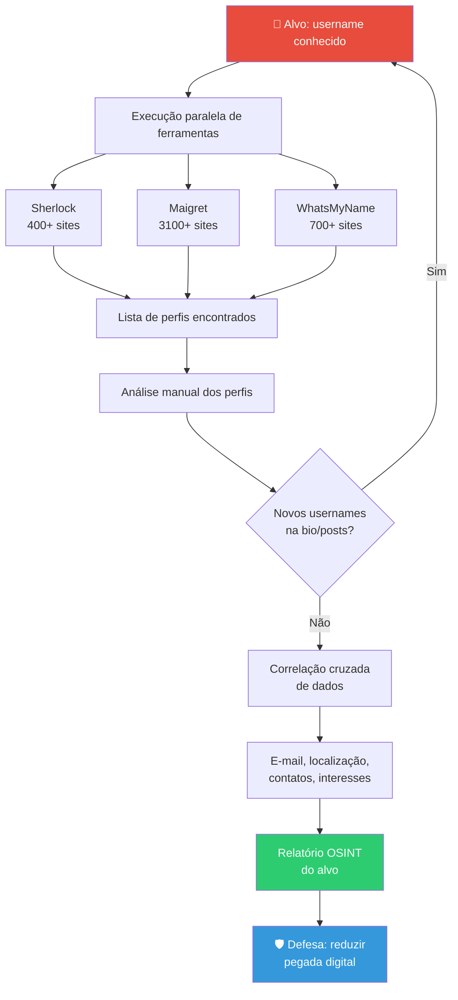
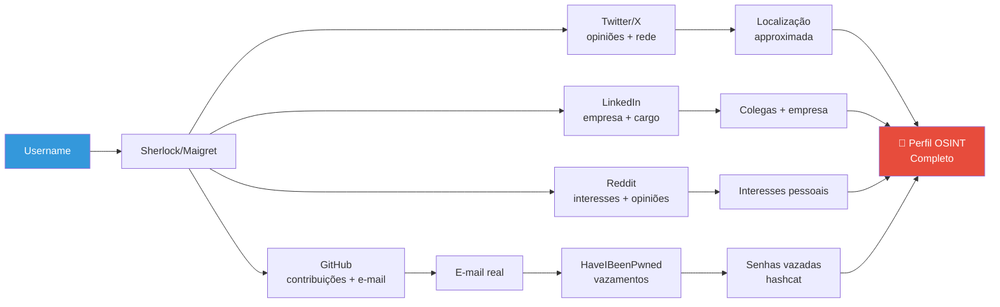

# Social Media Tools

> [!quote] Inteligência em Redes Sociais
> *As redes sociais são uma mina de ouro de informações para reconhecimento de alvos.*

---

## 🔍 O que é SOCMINT?

> [!success] Social Media Intelligence
> **SOCMINT** (Social Media Intelligence) é a coleta e análise de informações de redes sociais para fins de inteligência e segurança.

### Por que é importante?

| Informação | Uso em Pentest |
|------------|----------------|
| **E-mails corporativos** | Phishing direcionado |
| **Nomes de funcionários** | Engenharia social |
| **Tecnologias usadas** | Reconhecimento técnico |
| **Viagens/Eventos** | Janelas de oportunidade |
| **Conexões profissionais** | Mapeamento organizacional |
| **Fotos com geolocalização** | Localização física do alvo |
| **Hábitos e rotinas** | Engenharia social contextual |
| **Reclamações e opiniões** | Vetores de manipulação |

---

## 🧠 OSINT por Username: Conceito e Relevância

O **username** (nome de usuário) é um dos identificadores mais poderosos em OSINT. Uma pessoa tende a reutilizar o mesmo handle em dezenas de plataformas ao longo dos anos. Isso cria o que chamamos de **pegada digital por username**: um rastro rastreável que conecta contas, interesses, localização e até dados pessoais.

### Por que usernames vazam tanto?

- Pessoas escolhem um apelido memorável e o reusam em tudo
- Plataformas exibem o username publicamente (URL do perfil, menções)
- Mesmo contas "privadas" têm username público na URL
- Pesquisas no Google indexam perfis e menções a username

### O que se extrai de um username?

```
username → plataformas ativas
         → perfis públicos (foto, bio, localização)
         → conexões cruzadas (ex: LinkedIn + GitHub + Reddit)
         → posts e comentários históricos
         → e-mail (em alguns casos via vazamentos)
         → pseudônimos alternativos (bio de um perfil menciona outro)
```

> [!warning] ⚖️ Ética e Lei
> Coletar dados públicos é legal. **Usar para perseguir, assediar ou chantagear é crime.**
> - Art. 154-A do Código Penal (invasão de dispositivo informático e afins)
> - Lei 9.296/96 (interceptação de comunicações)
> - Lei Geral de Proteção de Dados (LGPD, Lei 13.709/2018): dados pessoais têm uso restrito, mesmo os públicos
>
> **Pratique sempre no seu próprio username ou em ambientes de teste com autorização.**

---

## 🗺️ Fluxo de Investigação OSINT por Username



---

## 🛠️ Arsenal de Ferramentas: Username Enumeration

> [!tip] Ferramentas por Cobertura (2026)

| Ferramenta | Sites Cobertos | Formato de Saída | Instalação | Destaques |
|------------|---------------|------------------|------------|-----------|
| **Sherlock** | 400+ | TXT, CSV, XLSX | pip/pipx/Docker/apt | Referência histórica, Kali nativo |
| **Maigret** | 3.100+ | HTML, PDF, JSON, XMind | pip | Busca recursiva, interface web, dossie completo |
| **WhatsMyName** | 700+ | Web/JSON | Web UI + integração | Dataset open source, base de outros tools |
| **Blackbird** | 600+ | PDF, CSV, JSON | pip | Usa WhatsMyName, profiling por IA |
| **Naminter** | 730+ | JSON | pip | Anti-bot via curl_cffi, bypass Cloudflare |
| **Social-Analyzer** | 900+ | Web/JSON | Docker | Análise de perfis e sentimento |
| **Maltego** | Multi | Grafo visual | Desktop (freemium) | Visualização de conexões e relações |
| **SpiderFoot** | Multi | Web dashboard | pip/Docker | OSINT automatizado, múltiplas fontes |
| **recon-ng** | Multi | Banco de dados | pip (já no Kali) | Framework modular, ver [[recon-ng]] |

---

## ⚙️ Sherlock: Instalação e Uso Completo

### Instalação

```bash
# Método recomendado (2025-2026): pipx (isola o ambiente)
pipx install sherlock-project

# Alternativa via pip
pip3 install sherlock-project

# No Kali Linux (já disponível via apt)
sudo apt update && sudo apt install sherlock

# Via Docker
docker pull sherlock/sherlock
docker run --rm sherlock/sherlock meu_usuario
```

### Comandos Fundamentais

```bash
# Busca básica: verifica username em 400+ sites
sherlock meu_usuario

# Mostra apenas perfis encontrados (sem os "não encontrados")
sherlock --print-found meu_usuario

# Define timeout por requisição (padrão: 60s)
sherlock --timeout 15 meu_usuario

# Busca em site específico
sherlock --site github.com meu_usuario

# Exportar resultado em CSV
sherlock --csv meu_usuario

# Exportar resultado em XLSX (Excel)
sherlock --xlsx meu_usuario

# Buscar múltiplos usernames de uma vez
sherlock usuario1 usuario2 usuario3

# Usar arquivo com lista de usernames
sherlock --usernames lista.txt

# Usar proxy Tor (anonimato durante a busca)
sherlock --tor meu_usuario

# Buscar via proxy HTTP
sherlock --proxy http://127.0.0.1:8080 meu_usuario

# Salvar saída em arquivo TXT
sherlock meu_usuario --output resultado.txt
```

### Interpretando a Saída

```
[*] Checking username meu_usuario on:
[+] GitHub: https://www.github.com/meu_usuario
[+] Twitter: https://twitter.com/meu_usuario
[-] Facebook: Not Found!
[+] Instagram: https://www.instagram.com/meu_usuario/
...
[*] Results: 87 found.
```

- `[+]` Perfil encontrado nessa plataforma
- `[-]` Não encontrado
- `[*]` Informação geral do processo

> [!example] 🧪 Atividade 1: Mapeie sua própria pegada com Sherlock
>
> **Objetivo:** descobrir em quais plataformas o SEU username aparece.
>
> **Pré-requisito:** ter o Sherlock instalado (Kali já vem com ele).
>
> ```bash
> # Substitua SEU_USERNAME pelo seu handle principal
> sherlock --print-found --csv SEU_USERNAME
> ```
>
> **Resultado esperado:** uma lista de URLs de perfis seus em diversas plataformas, exportada em CSV.
>
> **Questões para reflexão:**
> - Quantos perfis foram encontrados que você nem lembrava que tinha?
> - Algum perfil antigo expõe informações que você não quer mais públicas?
> - O resultado mudaria se você usasse um username diferente em cada rede?
>
> **Ação prática:** escolha 2 perfis encontrados que você não usa mais e delete-os (use `justdeleteme.xyz` para guia de exclusão por plataforma).

---

## ⚙️ Maigret: Dossie Completo com 3.100+ Sites

Maigret (inspirado no detetive Maigret de Simenon) vai além do Sherlock: ele não só encontra perfis, mas extrai dados diretamente das páginas (nome real, bio, localização, links para outros perfis) e permite **busca recursiva**: se encontrar um novo username na bio de um perfil, ele repete a busca automaticamente.

### Instalação

```bash
# Via pip (Python 3.10+)
pip3 install maigret

# Via pipx (recomendado, ambiente isolado)
pipx install maigret

# Via Docker (com interface web)
docker pull soxoj/maigret
docker run -p 5000:5000 soxoj/maigret --web

# No Kali: clonar e instalar manualmente
git clone https://github.com/soxoj/maigret
cd maigret
pip3 install -r requirements.txt
python3 maigret.py --help
```

### Comandos Fundamentais

```bash
# Busca básica em 3.100+ sites
maigret meu_usuario

# Gerar relatório HTML navegável (MUITO mais legível)
maigret meu_usuario --html

# Gerar PDF do dossie
maigret meu_usuario --pdf

# Gerar mapa mental XMind (mapeamento visual)
maigret meu_usuario --xmind

# Busca recursiva (segue usernames encontrados nas bios)
maigret meu_usuario --recursive

# Filtrar por categoria de site
maigret meu_usuario --tags social

# Filtrar por país
maigret meu_usuario --tags br

# Interface web local (abre em http://127.0.0.1:5000)
maigret --web

# Busca com timeout menor (mais rápido, menos preciso)
maigret meu_usuario --timeout 10

# Usar todos os sites sem filtro (mais lento, mais completo)
maigret meu_usuario --all-sites
```

### Diferença entre Sherlock e Maigret

| Aspecto | Sherlock | Maigret |
|---------|----------|---------|
| Sites | 400+ | 3.100+ |
| Extrai dados do perfil | Não | Sim (nome, bio, links) |
| Busca recursiva | Não | Sim |
| Relatório visual | Não | HTML, PDF, XMind |
| Velocidade | Mais rápido | Mais lento |
| Foco | Encontrar links | Construir dossie |

---

## ⚙️ WhatsMyName: Dataset Aberto e Ferramentas Derivadas

WhatsMyName é um **dataset comunitário** (JSON) com 700+ sites para verificação de username. Ele é a base de dados usada por diversas outras ferramentas (Blackbird, Naminter, recon-ng, Maltego, SpiderFoot).

### Uso via Interface Web

```
Acesse: https://whatsmyname.app
1. Digite o username
2. Clique em "Search"
3. Veja quais plataformas têm esse perfil
4. Filtre por categoria (social, gaming, tech, etc.)
```

### Uso via CLI (Blackbird, que usa a mesma base)

```bash
# Instalar Blackbird
pip3 install blackbird-osint

# Busca por username
blackbird -u meu_usuario

# Busca por e-mail
blackbird -e email@exemplo.com

# Gerar relatório PDF
blackbird -u meu_usuario --pdf
```

> [!example] 🧪 Atividade 2: Mapeie sua pegada com WhatsMyName e compare com o Sherlock
>
> **Objetivo:** comparar resultados de duas ferramentas diferentes para o mesmo username.
>
> **Parte A (web):**
> ```
> 1. Acesse https://whatsmyname.app
> 2. Busque SEU_USERNAME
> 3. Anote quantas plataformas foram encontradas e em quais categorias
> ```
>
> **Parte B (CLI com Sherlock):**
> ```bash
> sherlock --print-found SEU_USERNAME
> ```
>
> **Compare:**
> - Quais plataformas aparecem em uma ferramenta mas não na outra?
> - Que tipo de dado cada ferramenta retorna?
> - Qual seria mais útil para um pentest real?
>
> **Ação de defesa:** para cada plataforma encontrada em que você não quer ser localizável, vá até a configuração de privacidade e altere o username para algo genérico, ou exclua a conta.

---

## 🌐 Ferramentas OSINT por Plataforma Específica

### Instagram

```bash
# Instaloader: baixar perfil público (fotos, bio, seguidores)
pip3 install instaloader
instaloader NOME_DO_PERFIL

# Apenas metadados (sem baixar fotos)
instaloader --no-pictures --no-videos NOME_DO_PERFIL

# Baixar posts com geolocalização
instaloader --geotags NOME_DO_PERFIL
```

| Ferramenta | Função |
|------------|--------|
| **Instaloader** | Download de perfis públicos, metadados, geolocalização |
| **Osintgram** | Análise de seguidores, posts, comentadores, localizações |
| **SnapInsta** | Download de fotos/vídeos para evidência |

### Twitter / X

```bash
# Twint (scraping sem API)
pip3 install twint
twint -u nome_usuario              # todos os tweets
twint -u nome_usuario -s "palavra" # tweets com palavra-chave
twint -u nome_usuario --since 2024-01-01 # tweets desde data
twint -u nome_usuario --email      # busca e-mails nos tweets
```

### LinkedIn

| Ferramenta | Função |
|------------|--------|
| **LinkedIn Sales Navigator** | Mapeamento corporativo avançado (pago) |
| **CrossLinked** | Enumeração de e-mails de funcionários via LinkedIn |
| **linkedin2username** | Gera lista de possíveis usernames de e-mail a partir de funcionários |

```bash
# CrossLinked: gerar possíveis e-mails de funcionários
pip3 install crosslinked
crosslinked -f '{first}.{last}@empresa.com' "Nome da Empresa"
```

### Facebook

| Ferramenta | Função |
|------------|--------|
| **Search is Back** | Pesquisa avançada de pessoas e eventos |
| **StalkFace** | Análise de perfil público |
| **Lookup-ID** | Encontra ID numérico de perfil/página |

---

## 🔬 Análise Aprofundada de Perfis

### Extração de Metadados de Imagens (EXIF)

Fotos publicadas em redes sociais frequentemente contêm metadados EXIF com localização GPS, modelo do celular, data e hora exatos.

```bash
# Instalar exiftool
sudo apt install libimage-exiftool-perl

# Analisar metadados de uma imagem
exiftool foto.jpg

# Extrair apenas GPS
exiftool -gps:all foto.jpg

# Analisar imagem direto de URL (baixa e analisa)
wget -O /tmp/foto.jpg "URL_DA_FOTO"
exiftool /tmp/foto.jpg
```

> [!warning] ⚠️ Plataformas modernas removem EXIF
> Facebook, Instagram, Twitter e WhatsApp removem automaticamente os metadados EXIF ao fazer upload. Plataformas mais antigas ou e-mails diretos podem não fazer isso. **Sempre verifique antes de publicar uma foto sua.**

### Busca Reversa de Imagens

```bash
# Via linha de comando (usando APIs de busca reversa)
# Alternativa: acesso direto via browser com a imagem

# Serviços web para busca reversa:
# - Google Images: images.google.com
# - TinEye: tineye.com
# - Yandex Images: yandex.com/images (muito eficaz para faces)
# - PimEyes: pimeyes.com (reconhecimento facial, pago)
```

### Geolocalização por Pistas Visuais

Técnica de análise de imagens para determinar localização por elementos visuais (placa de carro, arquitetura, vegetação, sinalização, fonte de luz):

- Verificar placa de veículo visível (formato por país/estado)
- Observar tomadas elétricas, plugues (diferem por país)
- Analisar vegetação característica de região
- Buscar nomes de estabelecimentos ao fundo no Google Street View

---

## 📊 Correlação de Dados: Montando o Perfil Completo

A real inteligência OSINT está em **correlacionar** dados de múltiplas fontes:



### Verificação de Vazamentos

```bash
# Have I Been Pwned (via API)
curl "https://haveibeenpwned.com/api/v3/breachedaccount/EMAIL" \
  -H "hibp-api-key: SUA_CHAVE"

# Via web (sem API key)
# Acesse: https://haveibeenpwned.com
# Digite o e-mail e veja em quais vazamentos ele aparece

# Verificar se um username específico vazou
# Acesse: https://dehashed.com (pago, mas muito completo)
```

---

## 🛠️ Ferramentas Populares: Tabela Completa

> [!tip] Arsenal OSINT para Redes Sociais (2026)

| Ferramenta | Plataforma | Descrição | Tipo |
|------------|------------|-----------|------|
| **Sherlock** | Multi (400+) | Busca username em 400+ sites | CLI open source |
| **Maigret** | Multi (3.100+) | Dossie completo, busca recursiva | CLI open source |
| **WhatsMyName** | Multi (700+) | Dataset + web UI, base de outros tools | Web + dataset |
| **Blackbird** | Multi (600+) | Usa WhatsMyName + profiling IA | CLI open source |
| **Social-Analyzer** | Multi (900+) | Análise de perfis e sentimento | CLI/Docker |
| **Maltego** | Multi | Visualização de conexões em grafo | Desktop freemium |
| **SpiderFoot** | Multi | OSINT automatizado, módulos | Web/CLI |
| **recon-ng** | Multi | Framework modular, ver [[recon-ng]] | CLI framework |
| **Twint** | Twitter/X | Scraping sem API | CLI open source |
| **Instaloader** | Instagram | Download de perfis públicos | CLI open source |
| **CrossLinked** | LinkedIn | Enumeração de e-mails de funcionários | CLI open source |
| **Osintgram** | Instagram | Análise de seguidores e posts | CLI open source |
| **ExifTool** | Imagens | Extração de metadados EXIF | CLI |
| **theHarvester** | Multi | E-mails, domínios, hosts | CLI (já no Kali) |
| **Namechk** | Multi | Verificar disponibilidade de usernames | Web |

---

## 🌐 Recursos Online

> [!info] Ferramentas Web Essenciais

| Recurso | URL | Função |
|---------|-----|--------|
| **WhatsMyName** | whatsmyname.app | Verificar username em 700+ sites |
| **Namechk** | namechk.com | Disponibilidade de usernames |
| **Social Searcher** | social-searcher.com | Busca em redes sociais |
| **Have I Been Pwned** | haveibeenpwned.com | Verificar vazamentos |
| **OSINT Framework** | osintframework.com | Mapa de ferramentas OSINT |
| **IntelTechniques** | inteltechniques.com | Recursos OSINT avançados |
| **JustDeleteMe** | justdeleteme.xyz | Guias para excluir contas |
| **TinEye** | tineye.com | Busca reversa de imagens |
| **PimEyes** | pimeyes.com | Reconhecimento facial por imagem |
| **Bellingcat Toolkit** | bellingcat.gitbook.io/toolkit | Toolkit de investigação online |

---

## 🛡️ Defesa: Reduzindo sua Pegada Digital

Conhecer as técnicas de OSINT serve também para **proteger a si mesmo**. Um profissional de segurança deve saber auditar e reduzir sua própria exposição.

> [!info] 🔗 Veja também
> Esta seção se conecta diretamente com [[Anonimato e privacidade]] e [[Apagando rastros]].

### Auditoria de Pegada Digital: Passo a Passo

```bash
# 1. Busque seu próprio username com Sherlock
sherlock --print-found SEU_USERNAME --csv

# 2. Busque mais fundo com Maigret
maigret SEU_USERNAME --html

# 3. Busque seu e-mail no Have I Been Pwned
curl "https://haveibeenpwned.com/api/v3/breachedaccount/SEU@EMAIL.COM"

# 4. Busque seu nome no Google (aspas para exato)
# "Seu Nome Completo" site:linkedin.com OR site:github.com

# 5. Faça busca reversa da sua foto de perfil no TinEye/Yandex
```

### Estratégias de Redução de Exposição

| Ação | Impacto | Como Fazer |
|------|---------|------------|
| **Username único por plataforma** | Alto | Elimina correlação entre contas |
| **Deletar contas inativas** | Alto | justdeleteme.xyz por plataforma |
| **Foto de perfil diferente por rede** | Médio | Evita busca reversa de imagem |
| **Configurar perfis como privados** | Médio | Configurações de cada rede |
| **Remover EXIF antes de publicar** | Médio | `exiftool -all= foto.jpg` |
| **E-mail diferente por serviço** | Alto | Aliases (SimpleLogin, iCloud Hide My Email) |
| **Revisar permissões de localização** | Médio | Config do celular, por app |
| **Ativar 2FA** | Alto | App authenticator (não SMS) |
| **Remover de data brokers** | Alto | Opt-out manual ou serviço pago |

### Remover Metadados EXIF antes de Publicar

```bash
# Instalar exiftool
sudo apt install libimage-exiftool-perl

# Remover TODOS os metadados de uma foto
exiftool -all= foto.jpg

# Verificar que foi removido
exiftool foto_sem_exif.jpg

# Em lote (toda uma pasta)
exiftool -all= /pasta/de/fotos/
```

> [!example] 🧪 Atividade 3: Configure a privacidade de uma rede a partir do que achou
>
> **Objetivo:** usar os resultados do Sherlock/WhatsMyName para tomar uma ação concreta de proteção.
>
> **Passo a passo:**
> 1. Execute `sherlock --print-found SEU_USERNAME` e identifique a plataforma mais sensível que retornou
> 2. Acesse as configurações de privacidade dessa plataforma
> 3. Ajuste: perfil para privado, remova localização, oculte lista de seguidores/seguindo
> 4. Execute o Sherlock novamente. O perfil ainda aparece? (A URL existe, mas o conteúdo fica inacessível)
>
> **Reflexão:**
> - Por que a URL ainda aparece mesmo com o perfil privado?
> - Qual a diferença entre "privado" e "anônimo"?
> - O que um atacante ainda consegue ver num perfil privado?

---

## 📚 Recursos de Aprendizado

> [!tip] Para Aprofundar

**Sugestão de pesquisa:**
```
"social media tools security hacking"
"OSINT social media reconnaissance"
"social engineering information gathering"
"username enumeration OSINT 2025"
"OSINT digital footprint reduction"
```

### Cursos e Tutoriais

- OSINT Framework: [osintframework.com](https://osintframework.com/)
- IntelTechniques: Recursos OSINT avançados
- Bellingcat: Investigação online e OSINT
- GitHub soxoj/osint-namecheckers-list: lista completa de checkers por username

### Leituras Complementares (no Vault)

- [[Information Gathering Frameworks (OSINT)]]: visão geral de frameworks
- [[Email harvesting]]: coleta de e-mails de alvos
- [[Engenharia social]]: uso das informações coletadas
- [[Anonimato e privacidade]]: como se proteger
- [[Apagando rastros]]: redução de pegada digital
- [[Google hacking]]: dorks para OSINT avançado
- [[Coleta de informações]]: fase de reconhecimento completa

---

## ⚠️ Considerações Éticas e Legais

> [!danger] ⚖️ Limites Legais e Éticos
> - Respeite a **privacidade** das pessoas
> - Use apenas em **alvos autorizados** (pentest com contrato, ou seu próprio perfil)
> - Informação pública não é igual a uso irrestrito
> - **Art. 154-A do Código Penal**: invasão de dispositivo informático, pena de 1 a 4 anos
> - **LGPD (Lei 13.709/2018)**: dados pessoais têm uso restrito, mesmo os publicamente disponíveis
> - **Perseguição e assédio** configurados via informação OSINT são crimes (Lei 14.132/2021)
> - Documente de forma **ética, legal e rastreável**
> - Em CTFs e treinos: use plataformas como Trace Labs, HackTheBox OSINT, ou o seu próprio perfil

> [!success] ✅ Boas Práticas em Pentest
> - Tenha sempre **autorização por escrito** antes de coletar dados sobre alvos
> - Guarde logs de todas as atividades realizadas
> - Entregue relatórios apenas ao cliente contratante
> - Não compartilhe dados coletados com terceiros
> - Destrua dados sensíveis após o engajamento, conforme contrato

---

> [!note] 📚 Fontes (2026)
> - [Sherlock: Complete Guide 2026, Sherlockeye](https://sherlockeye.io/blog/sherlock-github-osint)
> - [Sherlock no Kali Linux, kali.org/tools/sherlock](https://www.kali.org/tools/sherlock/)
> - [Sherlock Manual 2025, ContactAlexey/GitHub](https://github.com/ContactAlexey/Sherlock-OSINT-Manual-2025)
> - [Maigret OSINT Tool, BrightCoding 2026](https://blog.brightcoding.dev/2026/06/03/maigret-osint-tool-build-username-dossiers-across-3000-sites-instantly)
> - [Maigret PyPI](https://pypi.org/project/maigret/)
> - [Maigret, Bellingcat Toolkit](https://bellingcat.gitbook.io/toolkit/more/all-tools/maigret)
> - [WhatsMyName GitHub, WebBreacher](https://github.com/webbreacher/whatsmyname)
> - [Username OSINT Guide 2026, FootprintIQ](https://footprintiq.app/username-osint-guide)
> - [OSINT namecheckers list, soxoj/GitHub](https://github.com/soxoj/osint-namecheckers-list)
> - [How to Protect Yourself from OSINT 2025, OSINTGuide](https://osintguide.com/2025/01/11/how-to-hide-yourself-from-osint/)
> - [OSINT for Digital Footprint, DigitalStakeout](https://www.digitalstakeout.com/blog/osint-online-privacy-protection)
> - [Social Media OSINT Tools Collection, osintambition](https://github.com/osintambition/Social-Media-OSINT-Tools-Collection)
> - [OSINT Instagram Guide, Authentic8](https://www.authentic8.com/blog/osint-instagram-guide)
> - [Top OSINT Tools 2025, Comparitech](https://www.comparitech.com/net-admin/osint-tools/)
