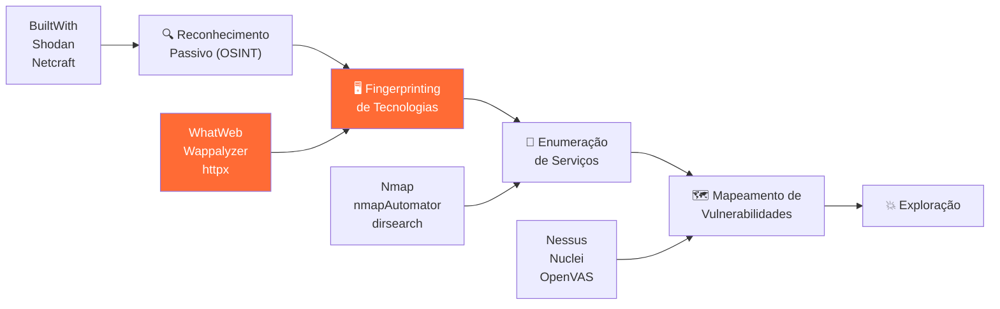
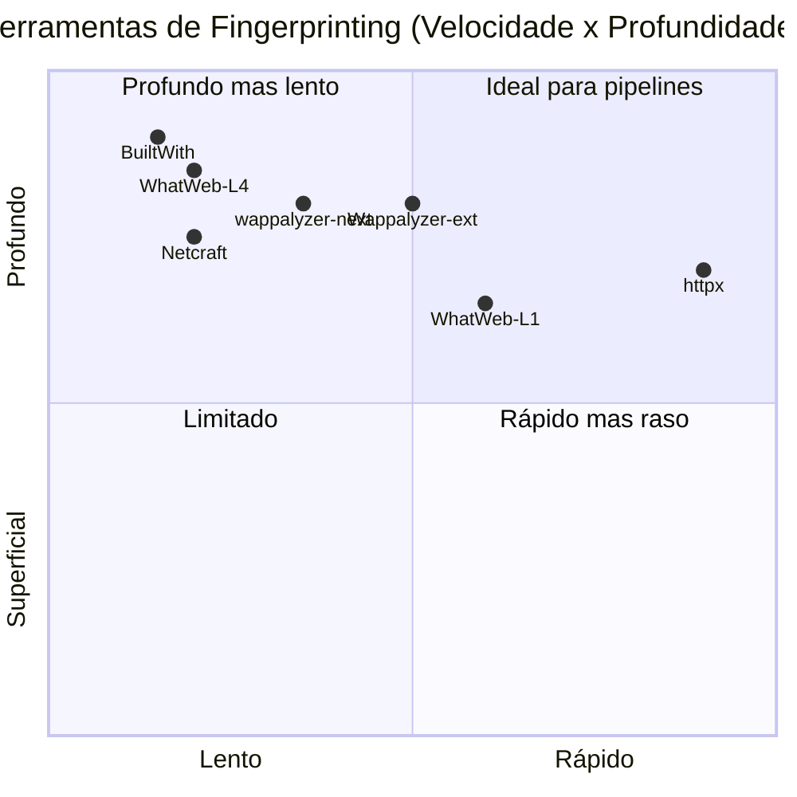
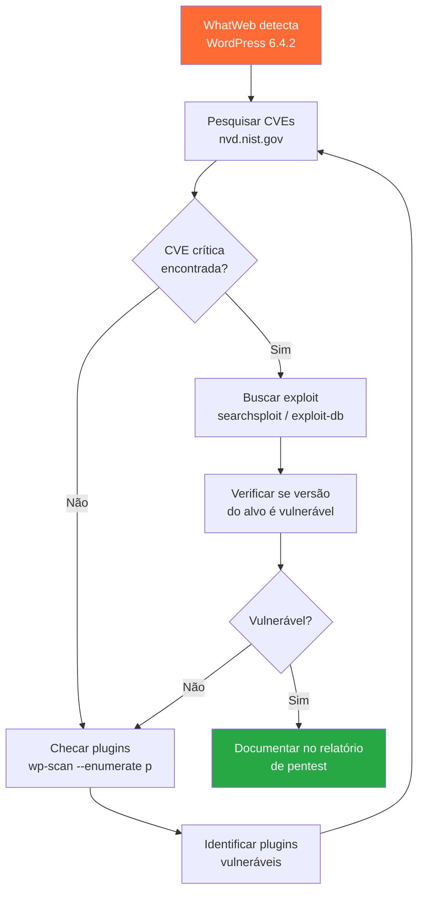

# Website Recon Tools (Reconhecimento de Tecnologias Web)

> [!quote] Conhecendo o Alvo
> *Identificar as tecnologias de um site é o primeiro passo para entender sua superfície de ataque.*

---

## 🎯 O que é?

> [!info] Technology Fingerprinting
> São ferramentas de reconhecimento que identificam as tecnologias utilizadas em websites, incluindo servidor web, frameworks, linguagens de programação, CMS, bibliotecas JavaScript e muito mais.

**Fingerprinting** é o processo de coletar evidências técnicas sobre um alvo para construir um perfil tecnológico preciso. Cada tecnologia deixa rastros: cabeçalhos HTTP específicos, estruturas de URL, cookies com nomes característicos, comentários no HTML, respostas de erro padronizadas e padrões de JavaScript. A combinação dessas evidências forma uma "impressão digital" única que permite identificar o stack com alto grau de confiança.

### Por que é Importante?

| Motivo | Descrição |
|--------|-----------|
| **Vulnerabilidades conhecidas** | Cada tecnologia tem suas CVEs específicas |
| **Vetores de ataque** | Diferentes stacks requerem diferentes abordagens |
| **Configurações padrão** | Muitos sistemas mantêm configurações inseguras |
| **Versões desatualizadas** | Identificar versões antigas com falhas conhecidas |
| **Estimativa de superfície** | Quanto mais tecnologias, maior a superfície de ataque |
| **Planejamento de exploits** | Selecionar ferramentas e payloads adequados ao alvo |

### Passivo vs. Ativo

> [!tip] Dois modos de reconhecimento
> Entender a distinção é fundamental para operar legalmente e de forma ética.

| Tipo | Como funciona | Impacto no alvo | Exemplo |
|------|---------------|-----------------|---------|
| **Passivo** | Consulta fontes públicas já indexadas | Nenhum ou mínimo | BuiltWith, Shodan, Wappalyzer extensão |
| **Ativo (leve)** | Faz requisições HTTP diretas ao alvo | Registrado nos logs | WhatWeb nível 1, httpx |
| **Ativo (agressivo)** | Múltiplas requisições, força bruta de caminhos | Alto: aciona WAFs e IDS | WhatWeb nível 4, nikto |

Fingerprinting de site público com requisição HTTP simples é considerado **passivo-leve** no contexto jurídico, pois simula o comportamento de qualquer navegador. O risco legal aumenta conforme o nível de agressividade e a presença de sistemas de autenticação ou avisos de uso.

---

## ⚖️ Ética e Marco Legal Brasileiro

> [!danger] Leia antes de praticar
> Reconhecimento sem autorização pode configurar crime mesmo sem invasão efetiva.

**Art. 154-A do Código Penal** (inserido pela Lei 12.737/2012, alterado pela Lei 14.155/2021):

> *"Invadir dispositivo informático alheio, conectado ou não à rede de computadores, mediante violação indevida de mecanismo de segurança e com o fim de obter, adulterar ou destruir dados ou informações sem autorização expressa ou tácita do titular..."*
>
> **Pena:** reclusão de 1 a 4 anos, e multa. Se houver obtenção de conteúdo de comunicações eletrônicas privadas: 2 a 5 anos.

**O que isso significa na prática:**

- Consultar BuiltWith ou Wappalyzer em um site público: **sem risco** (dado público)
- Rodar `whatweb -a 1` em um site público sem mecanismo de proteção violado: **zona cinza, baixo risco**
- Rodar scans agressivos (`-a 4`) ou fuzzing em sites sem autorização: **risco real de enquadramento**
- Qualquer ação em sistemas com aviso de uso proibido ou autenticação: **proibido sem autorização escrita**

**Regra de ouro:** antes de qualquer scan ativo, obtenha autorização escrita do proprietário do sistema. Em contexto educacional, use ambientes de laboratório controlados como [[Descobrindo alvos vulneráveis]] ou instâncias DVWA/Metasploitable próprias.

---

## 🗺️ Onde o Fingerprinting se Encaixa na Metodologia



O fingerprinting ocorre logo após a coleta inicial de informações (OSINT com [[whois]], [[shodan]], [[DNS Enumeration (Enumeração de DNS)]]) e alimenta diretamente a fase de mapeamento de vulnerabilidades. É o elo entre "saber quem é o alvo" e "saber como atacá-lo".

---

## 🛠️ Ferramentas Online

> [!success] Principais Recursos
> Ferramentas online são passivas por natureza, pois consultam dados já indexados, sem contato direto com o alvo.

| Ferramenta | URL | Descrição |
|------------|-----|-----------|
| **Pentest-Tools** | [pentest-tools.com](https://pentest-tools.com/information-gathering/website-reconnaissance-discover-web-application-technologies) | Scanner completo de tecnologias web |
| **Netcraft** | [netcraft.com](https://www.netcraft.com/) | Histórico de tecnologias e análise de sites |
| **BuiltWith** | [builtwith.com](https://builtwith.com/) | Perfil tecnológico detalhado com histórico temporal |
| **Wappalyzer** | [wappalyzer.com](https://www.wappalyzer.com/) | Extensão de browser mais API |
| **WhatRuns** | [whatruns.com](https://www.whatruns.com/) | Extensão de browser gratuita |
| **CRFT Lookup** | [crft.studio/lookup](https://www.crft.studio/lookup) | Alternativa open source ao Wappalyzer (2025) |
| **HackerTarget** | [hackertarget.com/whatweb-scan](https://hackertarget.com/whatweb-scan/) | WhatWeb e Wappalyzer online gratuitos |

### BuiltWith em Profundidade

O BuiltWith é especialmente valioso porque mantém **histórico temporal**: é possível ver quais tecnologias um site usava há 1, 5 ou 10 anos. Isso serve para:

- Identificar tecnologias legadas que ainda podem estar ativas em subdomínios
- Rastrear migrações de CMS (ex: saiu do WordPress e foi para Drupal)
- Encontrar plugins ou bibliotecas que foram abandonados mas não removidos
- Mapear fornecedores de CDN, analytics e publicidade associados ao alvo

**Uso da API BuiltWith (requer cadastro gratuito):**

```bash
# Consulta básica via API REST
curl "https://api.builtwith.com/v21/api.json?KEY=SEU_TOKEN&LOOKUP=exemplo.com.br"

# Extrair apenas tecnologias de CMS
curl "https://api.builtwith.com/v21/api.json?KEY=SEU_TOKEN&LOOKUP=exemplo.com.br" \
  | python3 -m json.tool | grep -A 2 '"Tag": "cms"'
```

---

## 💻 Ferramentas de Linha de Comando

> [!tip] Para Uso em Terminal
> As ferramentas de CLI permitem automação, integração em pipelines e coleta estruturada de dados.

| Ferramenta | Instalação | Descrição |
|------------|-----------|-----------|
| **WhatWeb** | `sudo apt install whatweb` (Kali) | Scanner Ruby com 1800+ plugins |
| **Wappalyzer CLI** | `npm install -g wappalyzer` | Versão CLI oficial (Node.js) |
| **wappalyzer-next** | `pipx install wappalyzer` | Alternativa Python com Playwright (2025) |
| **httpx** | `go install github.com/projectdiscovery/httpx/cmd/httpx@latest` | Toolkit HTTP multifuncional (ProjectDiscovery) |

---

## 🔬 WhatWeb: Fingerprinting em Profundidade

WhatWeb é o scanner de fingerprinting de websites mais completo disponível no Kali Linux. Escrito em Ruby, possui mais de **1.800 plugins** ativos capazes de detectar desde servidores web e CMS até tecnologias específicas de e-commerce e frameworks JavaScript.

### Níveis de Agressividade

| Nível | Nome | Comportamento | Quando Usar |
|-------|------|---------------|-------------|
| **1** | Stealthy | 1 requisição GET por alvo, segue redirecionamentos | Recon inicial, ambientes de produção com autorização |
| **3** | Aggressive | Algumas requisições extras para plugins identificados no nível 1 | Quando precisa confirmar tecnologias detectadas |
| **4** | Heavy | Muitas requisições, todos os plugins agressivos em todas as URLs | Pentest completo com autorização total |

> [!warning] Evasão de IDS
> O nível 1 do WhatWeb já é detectável pelo Snort IDS via assinatura de User-Agent. Para evasão, use `-U "Mozilla/5.0 ..."` para trocar o User-Agent e `--wait 2` para adicionar delay entre requisições.

### Comandos Essenciais do WhatWeb

```bash
# Scan básico (nível 1, stealthy)
whatweb https://exemplo.com.br

# Scan com saída verbosa (mostra cada plugin que encontrou)
whatweb -v https://exemplo.com.br

# Scan agressivo nível 3 (mais detalhes de versões)
whatweb -a 3 https://exemplo.com.br

# Scan mais pesado nível 4 (muitas requisições)
whatweb -a 4 https://exemplo.com.br

# Trocar User-Agent para evitar detecção por assinatura
whatweb -U "Mozilla/5.0 (Windows NT 10.0; Win64; x64) AppleWebKit/537.36" https://exemplo.com.br

# Adicionar delay entre requisições (evasão de IDS/rate limit)
whatweb --wait=2 --max-threads=1 https://exemplo.com.br

# Salvar output em arquivo texto
whatweb https://exemplo.com.br -o resultado.txt

# Output em JSON (para processar com outras ferramentas)
whatweb https://exemplo.com.br --log-json=resultado.json

# Scan de uma lista de URLs
whatweb -i urls.txt -a 3 --log-json=bulk_resultado.json

# Output mínimo (só o que importa, bom para pipelines)
whatweb --quiet https://exemplo.com.br

# Ver plugins disponíveis
whatweb --list-plugins | head -30
```

### Interpretando o Output do WhatWeb

```
http://exemplo.com.br [200 OK] Apache[2.4.57], Bootstrap[5.3.0],
Country[BRAZIL][BR], HTML5, HTTPServer[Ubuntu Linux][Apache/2.4.57 (Ubuntu)],
IP[177.x.x.x], JQuery[3.6.0], PHP[8.1.20], Title[Minha Empresa],
WordPress[6.4.2], X-Powered-By[PHP/8.1.20]
```

**Lendo o resultado:**

- `Apache[2.4.57]`: servidor web e versão exata, pesquisável em CVE databases
- `PHP[8.1.20]`: linguagem backend e versão
- `WordPress[6.4.2]`: CMS detectado, versão específica
- `JQuery[3.6.0]`: biblioteca JavaScript, pode ter CVEs conhecidas
- `X-Powered-By[PHP/8.1.20]`: cabeçalho HTTP revelando a versão (deveria ser suprimido)

**O que fazer com essas informações:**

```bash
# Buscar CVEs para WordPress 6.4.2
searchsploit wordpress 6.4.2

# Buscar no banco de dados nacional (NVD)
# https://nvd.nist.gov/vuln/search?query=wordpress+6.4.2

# Buscar CVEs para Apache 2.4.57
searchsploit apache 2.4.57
```

---

## 🧩 Wappalyzer: Extensão + CLI

Wappalyzer é uma ferramenta de fingerprinting que analisa HTML, variáveis JavaScript, cabeçalhos de resposta e cookies para identificar tecnologias. Está disponível como extensão de browser, CLI e API.

### Extensão de Browser

A extensão é gratuita e sem limites de uso para Chrome, Firefox, Edge e Safari. Ao visitar qualquer site, o ícone da extensão exibe um contador com as tecnologias detectadas. Clicando no ícone, você vê a lista completa organizada por categoria.

**Vantagens da extensão:** executa no contexto do browser, conseguindo inspecionar JavaScript dinâmico carregado após o page load, cookies de sessão e recursos carregados por SPA (Single Page Applications), o que ferramentas de linha de comando costumam perder.

### CLI Oficial (Node.js)

```bash
# Instalar
npm install -g wappalyzer

# Scan básico
wappalyzer https://exemplo.com.br

# Output JSON formatado
wappalyzer https://exemplo.com.br --pretty

# Timeout maior para sites lentos
wappalyzer https://exemplo.com.br --max-wait=5000

# Varrer múltiplas URLs
cat urls.txt | xargs -I{} wappalyzer {}
```

### wappalyzer-next: Alternativa Python Open Source (2025)

Em 2023, o Wappalyzer tornou-se pago para uso em larga escala. A alternativa open source mais ativa em 2025 é o `wappalyzer-next` de s0md3v, que usa Playwright para rodar a extensão real do Wappalyzer em Chromium headless, garantindo compatibilidade com as assinaturas mais recentes.

```bash
# Instalar via pipx (recomendado para isolar dependências)
pipx install wappalyzer

# Scan básico
wappalyzer https://exemplo.com.br

# Output JSON
wappalyzer https://exemplo.com.br --json

# Múltiplos workers para varredura em lote
wappalyzer --workers 4 --json < urls.txt

# Arquivo de entrada
wappalyzer --json --file urls.txt
```

> [!info] Por que wappalyzer-next funciona melhor em SPAs
> Por usar Playwright (headless Chromium real), o wappalyzer-next executa JavaScript e consegue detectar tecnologias que só aparecem após o carregamento dinâmico da página, como frameworks React, Vue e Angular. Ferramentas que fazem apenas um GET HTTP simples costumam perder essas informações.

---

## ⚡ httpx (ProjectDiscovery): O Canivete Suíço do Recon HTTP

O httpx é uma ferramenta de HTTP probing criada pela ProjectDiscovery, amplamente adotada em bug bounty e pentests profissionais. Ele combina detecção de tecnologias (usando as assinaturas do Wappalyzer), extração de metadados, verificação de hosts ativos e análise de TLS em uma única ferramenta rápida e paralelizável.

> [!info] Por que o httpx usa assinaturas do Wappalyzer
> O ProjectDiscovery integrou a base de assinaturas do Wappalyzer ao httpx diretamente. Quando você usa `-tech-detect`, o httpx aplica as mesmas regras de fingerprinting da extensão, mas via linha de comando e com capacidade de processar milhares de hosts em paralelo.

### Instalação

```bash
# Via Go (requer Go 1.21+)
go install -v github.com/projectdiscovery/httpx/cmd/httpx@latest

# Verificar instalação
httpx -version

# Atualizar
httpx -up
```

### Comandos Essenciais do httpx

```bash
# Probe básico em um único host
echo "https://exemplo.com.br" | httpx

# Detecção de tecnologias com título e status HTTP
echo "https://exemplo.com.br" | httpx -title -tech-detect -status-code

# Output mais completo: servidor, IP, tamanho da resposta
httpx -u https://exemplo.com.br -title -tech-detect -status-code -server -ip -content-length

# Processar lista de hosts (muito comum em bug bounty)
httpx -l hosts.txt -title -tech-detect -status-code -o resultado.txt

# Output em JSON para processamento posterior
httpx -l hosts.txt -tech-detect -title -json -o resultado.json

# Filtrar somente hosts com status 200
httpx -l hosts.txt -tech-detect -mc 200

# Detecção de tecnologias + TLS + ASN
httpx -l hosts.txt -tech-detect -tls-grab -asn

# Pipeline completo: subfinder -> httpx -> nuclei
subfinder -d exemplo.com.br -silent | httpx -tech-detect -title -status-code | tee hosts_vivos.txt

# Fingerprinting JARM (identifica implementação TLS do servidor)
httpx -l hosts.txt -jarm

# Seguir redirecionamentos
httpx -l hosts.txt -tech-detect -follow-redirects

# Definir número de threads (padrão 50)
httpx -l hosts.txt -tech-detect -threads 25

# Timeout personalizado
httpx -l hosts.txt -tech-detect -timeout 10

# Filtrar por tecnologia específica no output
httpx -l hosts.txt -tech-detect -title | grep -i wordpress
```

### Exemplo de Output do httpx

```
https://exemplo.com.br [200] [Bem-vindo] [Apache,PHP,WordPress,Bootstrap]
https://loja.exemplo.com.br [200] [Loja Online] [Nginx,Node.js,React]
https://painel.exemplo.com.br [302] [] [Apache,PHP]
https://api.exemplo.com.br [200] [API] [Nginx,Express]
```

**Lendo o output:**
- Coluna 1: URL
- `[200]`: HTTP status code
- `[Bem-vindo]`: título da página
- `[Apache,PHP,WordPress,Bootstrap]`: tecnologias detectadas

### Pipeline Profissional de Recon com httpx

```bash
# 1. Descobrir subdomínios ativos
subfinder -d empresa.com.br -silent > subdomains.txt

# 2. Verificar quais estão vivos e coletar fingerprint
cat subdomains.txt | httpx -tech-detect -title -status-code -server -ip \
  -threads 50 -timeout 10 -follow-redirects \
  -json -o fingerprint_completo.json

# 3. Filtrar alvos com WordPress para varredura específica
cat fingerprint_completo.json | jq '.[] | select(.technologies[] | contains("WordPress"))' \
  | jq '.url'

# 4. Rodar nuclei nos alvos WordPress identificados
cat wp_hosts.txt | nuclei -t technologies/wordpress/

# 5. Buscar painéis de admin expostos
cat fingerprint_completo.json | jq -r '.url' | \
  httpx -path /wp-admin,/administrator,/admin,/login -mc 200,301,302
```

---

## 🔎 Comparativo Detalhado das Ferramentas



| Ferramenta | Passivo/Ativo | Velocidade | Detecção JS dinâmico | Histórico | Automação | Gratuito |
|------------|--------------|-----------|---------------------|-----------|-----------|---------|
| **WhatWeb** | Ativo | Média | Não | Não | Excelente | Sim |
| **httpx** | Ativo | Muito alta | Não | Não | Excelente | Sim |
| **Wappalyzer extensão** | Passivo | Alta | Sim | Não | Limitada | Sim |
| **wappalyzer-next** | Ativo | Média | Sim | Não | Boa | Sim |
| **BuiltWith** | Passivo | Alta | Parcial | Sim | Via API (pago) | Parcial |
| **Netcraft** | Passivo | Alta | Não | Sim | Via API | Parcial |
| **Shodan** | Passivo | Alta | Não | Sim | Via API | Parcial |

---

## 📊 O que é Detectado?

> [!info] Categorias de Tecnologias

| Categoria | Exemplos | Por que importa para o atacante |
|-----------|----------|--------------------------------|
| **Servidor Web** | Apache, Nginx, IIS, LiteSpeed | CVEs específicas por versão; módulos ativos |
| **Linguagem** | PHP, Python, ASP.NET, Node.js, Ruby | Vetores de injeção e configurações típicas |
| **Framework** | Laravel, Django, React, Angular, Spring | Vulnerabilidades de framework (SQLi, CSRF, etc.) |
| **CMS** | WordPress, Joomla, Drupal, Magento | Plugins vulneráveis, painéis de admin padrão |
| **E-commerce** | WooCommerce, Shopify, PrestaShop | Dados de pagamento, integrações com terceiros |
| **CDN** | Cloudflare, Akamai, Fastly | Bypass de WAF, cache poisoning |
| **Analytics** | Google Analytics, Hotjar, Clarity | Coleta de dados do usuário, alvos de client-side |
| **Segurança** | WAF, reCAPTCHA, ModSecurity | Saber o que precisa ser bypassado |
| **JavaScript libs** | jQuery, Bootstrap, Lodash | Prototype pollution, XSS via libs desatualizadas |
| **Database (inferido)** | MySQL, PostgreSQL, MongoDB | Injeções específicas por banco |

### Da Tecnologia ao CVE: Fluxo Completo



---

## 🔍 Uso em Pentests

> [!warning] Metodologia

1. **Identificar tecnologias:** usar múltiplas ferramentas para confirmar (WhatWeb + Wappalyzer + httpx)
2. **Pesquisar versões:** verificar se há versões específicas detectadas
3. **Buscar CVEs:** procurar vulnerabilidades conhecidas no NVD, Exploit-DB, PacketStorm
4. **Verificar configurações:** identificar configurações padrão inseguras (senhas default, diretórios expostos)
5. **Documentar:** registrar todas as descobertas no relatório com evidências
6. **Cruzar informações:** combinar fingerprint com resultados de [[Escaneamento de IPs e portas (Port Scanning)]] e [[DNS Enumeration (Enumeração de DNS)]]

### Fluxo de Trabalho Completo (Metodologia OWASP)

O OWASP Testing Guide v4.2 define o fingerprinting de tecnologias no capítulo OTG-INFO-008 (Fingerprint Web Application Framework). A sequência recomendada é:

```bash
# Etapa 1: recon passivo (sem contato com o alvo)
# Verificar BuiltWith, Netcraft, Shodan, e histórico de DNS

# Etapa 2: requisição HTTP simples e análise de cabeçalhos
curl -I https://alvo.com.br
# Observar: Server, X-Powered-By, Set-Cookie, X-Generator, etc.

# Etapa 3: WhatWeb nível 1 (stealthy)
whatweb -a 1 -v https://alvo.com.br

# Etapa 4: httpx para visão geral rápida
echo "alvo.com.br" | httpx -tech-detect -title -status-code -server

# Etapa 5: se autorizado, WhatWeb nível 3 para confirmar versões
whatweb -a 3 https://alvo.com.br --log-json=fingerprint.json

# Etapa 6: cruzar com searchsploit
whatweb -a 1 https://alvo.com.br | grep -oP '(?<=\[)[^\]]+(?=\])' | \
  while read tech; do searchsploit "$tech" 2>/dev/null; done
```

---

> [!example] 🧪 Atividade 1: Fingerprint com WhatWeb em Site Próprio ou Autorizado

**Objetivo:** identificar o stack completo de um site e mapear potenciais vetores de ataque.

**Passo a passo:**

```bash
# 1. Instalar WhatWeb (já presente no Kali Linux)
sudo apt install whatweb  # se necessário

# 2. Scan básico no site do IFF (site público)
whatweb https://iff.edu.br

# 3. Scan mais detalhado com output verboso
whatweb -v https://iff.edu.br

# 4. Salvar resultado em JSON
whatweb https://iff.edu.br --log-json=iff_fingerprint.json

# 5. Visualizar de forma legível
cat iff_fingerprint.json | python3 -m json.tool
```

**Resultado esperado (exemplo):**

```
http://iff.edu.br [200 OK] Apache, Bootstrap[4.x], Country[BRAZIL][BR],
HTML5, HTTPServer[Apache], IP[200.x.x.x], JQuery[3.x],
Title[IFF - Instituto Federal Fluminense], WordPress[x.x.x]
```

**Para analisar:**
1. Qual servidor web está em uso? Qual a versão detectada?
2. Há alguma versão de PHP ou CMS identificada?
3. O cabeçalho `X-Powered-By` está presente? O que ele revela?
4. Pesquise no NVD (`nvd.nist.gov`) se há CVEs para as versões detectadas.
5. O que um atacante faria com essas informações?

**Reflexão:** sites públicos de instituições governamentais muitas vezes revelam versões exatas de software, configurações padrão e até credenciais de teste. Que medidas poderiam reduzir essa exposição?

---

> [!example] 🧪 Atividade 2: Comparação Wappalyzer Extensão vs. httpx

**Objetivo:** comparar o que diferentes ferramentas conseguem detectar no mesmo alvo e entender as diferenças de cobertura.

**Passo a passo:**

**Parte A: Extensão Wappalyzer**
1. Instale a extensão Wappalyzer no Chrome ou Firefox (gratuita, sem cadastro)
2. Visite `https://iff.edu.br` com o browser
3. Clique no ícone da extensão e anote todas as tecnologias listadas
4. Anote também as categorias (CMS, servidor, analytics, etc.)

**Parte B: httpx via terminal**
```bash
# Instalar httpx (se não tiver)
go install -v github.com/projectdiscovery/httpx/cmd/httpx@latest

# Ou via binário pré-compilado do Kali
sudo apt install golang-go && go install github.com/projectdiscovery/httpx/cmd/httpx@latest

# Rodar fingerprint
echo "iff.edu.br" | httpx -title -tech-detect -status-code -server -ip -v
```

**Parte C: Comparação**

| Tecnologia detectada | Wappalyzer (extensão) | httpx |
|---------------------|----------------------|-------|
| Servidor web | ? | ? |
| CMS | ? | ? |
| Framework JS | ? | ? |
| Analytics | ? | ? |
| CDN/WAF | ? | ? |

**Questões para responder:**
1. Quais tecnologias aparecem em um mas não no outro? Por quê?
2. A extensão Wappalyzer detectou tecnologias JavaScript dinâmicas que o httpx não viu?
3. Qual ferramenta você usaria como primeira escolha em um pentest e por quê?
4. Se você fosse o administrador desse site, qual informação você removeria dos cabeçalhos HTTP?

---

> [!example] 🧪 Atividade 3: Da Versão ao CVE

**Objetivo:** demonstrar o ciclo completo do fingerprinting até a identificação de vulnerabilidades exploráveis.

**Cenário:** você identificou com WhatWeb que um servidor usa `WordPress 5.8.1` e `PHP 7.4.3`.

**Passo a passo:**

```bash
# 1. Buscar exploits para WordPress 5.8.1
searchsploit wordpress 5.8

# 2. Buscar no Exploit-DB online
# https://www.exploit-db.com/search?q=wordpress+5.8

# 3. Verificar no NVD por CVEs de PHP 7.4
# https://nvd.nist.gov/vuln/search?query=php+7.4

# 4. Checar se o WordPress tem plugins detectados (com autorização!)
# wpscan --url https://alvo.com.br --enumerate p

# 5. Simular fingerprint em ambiente local (DVWA ou WordPress local)
# Instalar WordPress local via Docker:
docker run -d -p 8080:80 --name wp-test wordpress:5.8.1-php7.4-apache

# Fazer fingerprint do ambiente local
whatweb http://localhost:8080
httpx -u http://localhost:8080 -tech-detect -title -status-code
```

**Questões para responder:**
1. Quantas CVEs críticas existem para WordPress 5.8.x?
2. Qual seria a ação imediata recomendada ao administrador desse site?
3. Como o WhatWeb conseguiu detectar a versão exata do WordPress? Que arquivo ou cabeçalho revela isso?
4. Se o WordPress estivesse na versão mais recente mas com um plugin popular desatualizado, ainda haveria risco? Como identificar isso?

> [!tip] Dica: o WordPress revela sua versão no meta tag `generator` do HTML: `<meta name="generator" content="WordPress 5.8.1" />`. Remover essa tag é uma das primeiras medidas de hardening.

---

## 🛡️ Defesa: Escondendo o Stack

> [!warning] A defesa começa no fingerprinting
> O atacante usa as informações que o servidor revela voluntariamente. Cortar essa fonte é o primeiro passo do hardening.

### Por que o Stack Importa para o Atacante?

Quando um atacante sabe que você usa `Apache 2.4.49`, ele pode ir direto para o CVE-2021-41773 (path traversal crítico, CVSS 9.8), sem precisar descobrir a vulnerabilidade por força bruta. O fingerprinting reduz dramaticamente o tempo até a exploração.

**Cabeçalhos que revelam o stack:**

```http
Server: Apache/2.4.57 (Ubuntu)        # revela servidor, versão e OS
X-Powered-By: PHP/8.1.20              # revela linguagem e versão
X-Generator: Drupal 10                 # revela CMS e versão
Set-Cookie: PHPSESSID=xxx              # revela PHP
Set-Cookie: JSESSIONID=xxx             # revela Java/Tomcat
X-AspNet-Version: 4.0.30319            # revela ASP.NET e versão
```

### Como Remover Cabeçalhos Reveladores

**Apache (`/etc/apache2/apache2.conf`):**

```apache
# Suprimir versão completa, mostrar só "Apache"
ServerTokens Prod

# Suprimir linha de assinatura no rodapé de páginas de erro
ServerSignature Off
```

**Nginx (`/etc/nginx/nginx.conf`):**

```nginx
http {
    # Ocultar versão do Nginx
    server_tokens off;

    # Remover cabeçalho X-Powered-By (se usando PHP-FPM)
    fastcgi_hide_header X-Powered-By;
}
```

**PHP (`/etc/php/8.x/apache2/php.ini` ou `php-fpm.conf`):**

```ini
; Remover cabeçalho X-Powered-By
expose_php = Off
```

**WordPress (`functions.php` ou plugin de segurança):**

```php
// Remover meta tag generator
remove_action('wp_head', 'wp_generator');

// Remover versão de scripts e estilos
add_filter('style_loader_src', 'remove_version_query', 9999);
add_filter('script_loader_src', 'remove_version_query', 9999);
function remove_version_query($src) {
    return $src ? esc_url(remove_query_arg('ver', $src)) : false;
}
```

### Verificando a Eficácia do Hardening

```bash
# Antes e depois: comparar cabeçalhos
curl -I https://seu-site.com.br

# Rodar WhatWeb e verificar o que ainda é detectável
whatweb -v https://seu-site.com.br

# Verificar com httpx
echo "seu-site.com.br" | httpx -title -tech-detect -server -status-code
```

> [!danger] Hardening superficial não é segurança real
> Remover banners reduz a superfície de reconhecimento passivo, mas NÃO elimina vulnerabilidades. Um atacante determinado pode identificar o stack por outros meios: padrões de URL, estrutura de cookies, comportamento de erros, e timing de respostas. O hardening de banner deve ser acompanhado de: patching regular, WAF, monitoramento de logs e testes de penetração periódicos.

### Checklist de Hardening Anti-Fingerprinting

- [ ] `ServerTokens Prod` no Apache ou `server_tokens off` no Nginx
- [ ] `expose_php = Off` no php.ini
- [ ] Remover `X-Generator`, `X-Powered-By` e similares via regra de rewrite
- [ ] Remover meta tag `generator` do WordPress/CMS
- [ ] Páginas de erro customizadas (não revelar stack trace)
- [ ] Remover parâmetros de versão (`?ver=x.x`) de CSS/JS
- [ ] Cookies com nomes genéricos (não `PHPSESSID`, usar `session_id`)
- [ ] Remover comentários HTML com informações de versão ou framework
- [ ] Configurar WAF para bloquear scanners conhecidos (User-Agent do WhatWeb, Nikto, etc.)

---

## 🔗 Ferramentas Relacionadas

Combine o fingerprinting de tecnologias com as outras fases de reconhecimento:

- [[Coleta de informações]]: fase inicial de OSINT que precede o fingerprinting
- [[whois]]: identificar registrante e histórico do domínio
- [[shodan]]: fingerprinting passivo de serviços expostos na internet
- [[DNS Enumeration (Enumeração de DNS)]]: descobrir subdomínios para ampliar a superfície de fingerprinting
- [[Escaneamento de IPs e portas (Port Scanning)]]: complementar com detecção de serviços por porta
- [[Information Gathering Frameworks (OSINT)]]: frameworks que integram múltiplas técnicas
- [[Mapeamento de vulnerabilidades]]: próxima fase após identificar o stack

---

> [!note] 📚 Fontes (2026)
>
> - [GitHub: urbanadventurer/WhatWeb](https://github.com/urbanadventurer/WhatWeb) - Repositório oficial WhatWeb
> - [ProjectDiscovery Docs: Running httpx](https://docs.projectdiscovery.io/opensource/httpx/running) - Documentação oficial httpx
> - [GitHub: projectdiscovery/httpx](https://github.com/projectdiscovery/httpx) - Repositório oficial httpx
> - [ProjectDiscovery Blog: Tech Detect Tweet](https://x.com/pdiscoveryio/status/1921249260139368915) - httpx tech-detect usa Wappalyzer signatures (2025)
> - [GitHub: s0md3v/wappalyzer-next](https://github.com/s0md3v/wappalyzer-next) - Alternativa open source ao Wappalyzer CLI
> - [Medium: Automated Recon Pipeline Bug Bounty 2026](https://medium.com/@atnoforcybersecurity/how-i-built-an-automated-recon-pipeline-for-bug-bounty-hunting-bed3cb545317) - Pipeline real com httpx
> - [The Cyber Aryan: HTTPX Zero to Hero](https://thecyberaryan.github.io/blog/httpx.html) - Guia completo de uso do httpx
> - [Hacking Articles: Detailed Guide on httpx](https://www.hackingarticles.in/a-detailed-guide-on-httpx/) - Exemplos de comandos e uso
> - [OWASP: Fingerprint Web Application Framework](https://owasp.org/www-project-web-security-testing-guide/v41/4-Web_Application_Security_Testing/01-Information_Gathering/08-Fingerprint_Web_Application_Framework) - Metodologia OWASP OTG-INFO-008
> - [Acunetix: Configure Web Server Identity Disclosure](https://www.acunetix.com/blog/articles/configure-web-server-disclose-identity/) - Hardening de banners e cabeçalhos
> - [Lei 12.737/2012 (Planalto)](https://www.planalto.gov.br/ccivil_03/_ato2011-2014/2012/lei/l12737.htm) - Art. 154-A CP, crime de invasão de dispositivo informático
> - [YesWeHack: HTTP Fingerprinting Recon](https://www.yeswehack.com/learn-bug-bounty/recon-series-http-fingerprinting) - Técnicas de fingerprinting HTTP
> - [Sekuro: OSINT e Fingerprinting em Pentests](https://sekuro.io/blog/osint-fingerprinting-web-application-testing/) - Uso combinado de OSINT e fingerprinting
> - [HackerTarget: WhatWeb Online](https://hackertarget.com/whatweb-scan/) - WhatWeb e Wappalyzer online
> - [INE: Pentesting 101 Fingerprinting](https://ine.com/blog/pentesting-101-fingerprinting-continued) - Fundamentos de fingerprinting em pentests
> - [arxiv: Fingerprinting via HTTP Headers (Transformer)](https://arxiv.org/pdf/2404.00056) - Pesquisa acadêmica sobre fingerprinting por cabeçalhos HTTP (2024)
> - [Undercode Testing: 25+ Recon Commands](https://undercodetesting.com/the-ultimate-recon-arsenal-25-commands-to-supercharge-your-bug-bounty-workflow/) - Arsenal de recon com httpx para bug bounty
