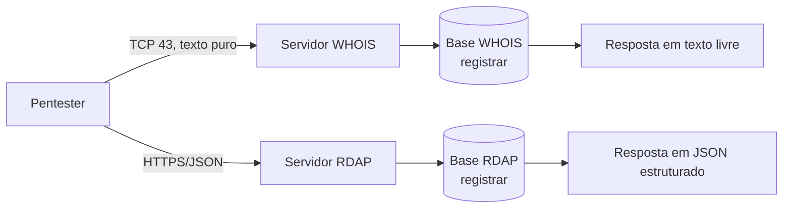
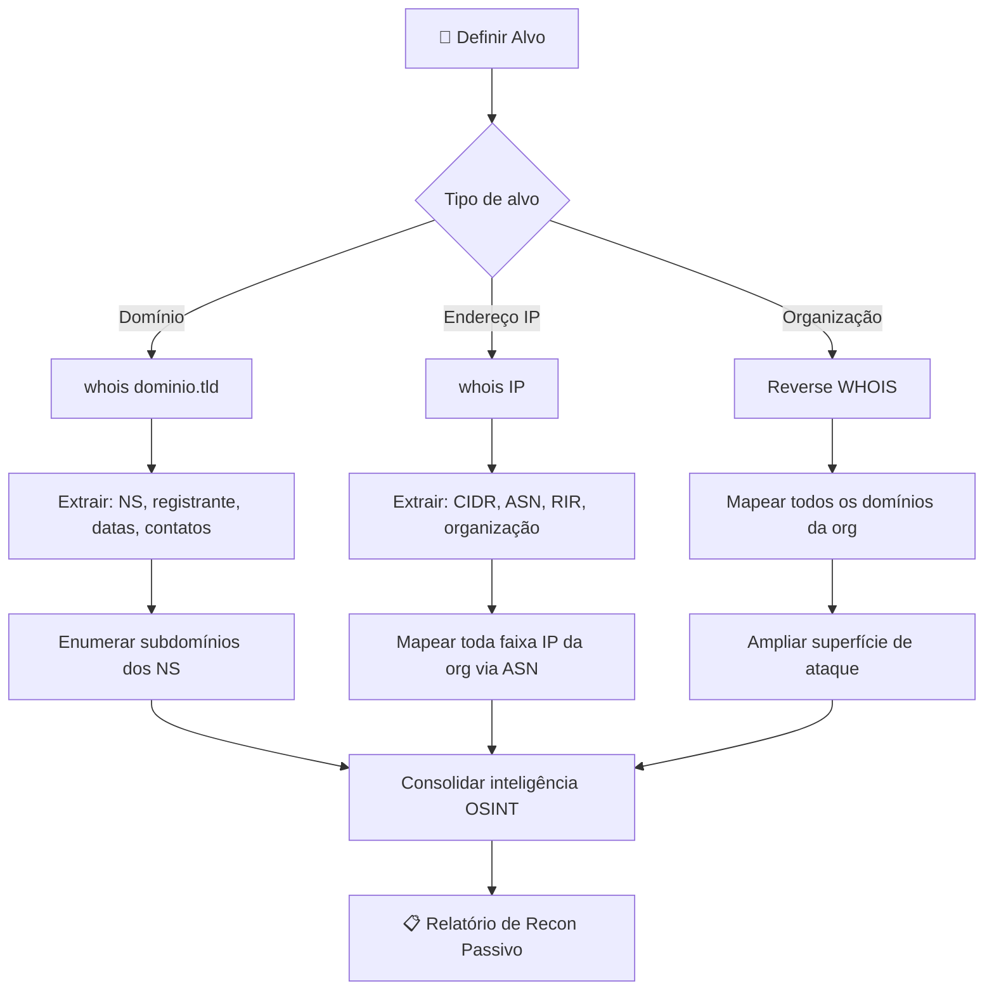
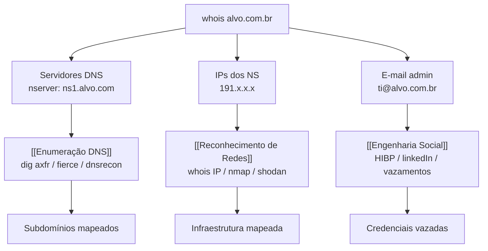

# WHOIS

> [!quote] Quem é o Dono?
> *WHOIS é uma ferramenta essencial para descobrir informações sobre a propriedade e configuração de um domínio.*

---

## 🔍 O que é WHOIS?

> [!success] Definição
> Ferramenta para consulta de informações públicas sobre um domínio, incluindo proprietário, contatos técnicos, servidores DNS e datas de registro.

WHOIS (pronuncia-se "who is") é um protocolo de consulta e resposta definido originalmente na **RFC 3912**, amplamente utilizado para obter informações de registro de recursos da Internet: domínios, blocos de endereços IP e Números de Sistema Autônomo (ASN). O protocolo opera sobre **TCP na porta 43**, enviando uma string de consulta em texto puro e recebendo uma resposta também em texto livre, sem estrutura padronizada.

A natureza não estruturada do WHOIS clássico é sua principal limitação, uma vez que cada registrar pode formatar a saída de maneira diferente. Por isso, em **28 de janeiro de 2025**, o ICANN tornou o protocolo **RDAP** (Registration Data Access Protocol) o único protocolo obrigatório para gTLDs, encerrando oficialmente a exigência do WHOIS na porta 43 para domínios genéricos de nível superior como `.com`, `.net` e `.org`. Para ccTLDs como `.br`, o WHOIS permanece ativo e é mantido pelo NIC.br.



---

## 📜 Histórico e Evolução do Protocolo

| Ano | Marco |
|-----|-------|
| 1982 | WHOIS criado pela DARPA para mapear usuários da ARPANET |
| 1985 | RFC 954 formaliza o protocolo WHOIS |
| 2004 | RFC 3912 substitui a RFC 954 como padrão atual |
| 2015 | ICANN inicia projeto RDAP como substituto moderno |
| 2019 | GDPR força redação massiva de dados pessoais nos registros |
| 2025 | **RDAP torna-se obrigatório para gTLDs (28/jan/2025); WHOIS aposentado para .com/.net/.org** |

---

## 💻 Uso via Terminal

### Comando Básico

```bash
whois iff.edu.br
```

### Exemplo de Saída

```bash
domain:      iff.edu.br
owner:       INST. FED. DE EDUCACAO CIENCIA E TECNO FLUMINENSE
ownerid:     10.779.511/0001-07
responsible: Luiz Augusto Caldas Pereira
country:     BR
owner-c:     ROASA107
tech-c:      ANACU15
nserver:     yoda.iff.edu.br 191.37.254.33
nserver:     sucrilhos.iff.edu.br 191.37.254.11
nserver:     atlantis.iff.edu.br 191.37.254.23
nserver:     cheetos.iff.edu.br 191.37.254.6
created:     20090114 #5183289
changed:     20170201
status:      published
```

---

## 📋 Informações Obtidas

| Campo | Descrição |
|-------|-----------|
| **domain** | Nome do domínio |
| **owner** | Proprietário do domínio |
| **ownerid** | CNPJ/CPF do proprietário |
| **responsible** | Pessoa responsável |
| **nserver** | Servidores DNS |
| **created** | Data de criação |
| **changed** | Data da última alteração |
| **status** | Status do registro |

---

## 🗂️ Campos Completos do WHOIS: Referência Técnica

A tabela a seguir cobre todos os campos relevantes que podem aparecer em consultas WHOIS a diferentes registradores. Nem todos os campos aparecem em todas as respostas, e a nomenclatura varia entre registradores.

| Campo WHOIS | Campo RDAP equivalente | Descrição | Disponível após GDPR/LGPD? |
|-------------|------------------------|-----------|---------------------------|
| `domain` | `ldhName` | Nome do domínio consultado | Sempre |
| `owner` / `registrant` | `vcardArray` (entity, registrant) | Nome do registrante | Redatado em gTLDs |
| `ownerid` | `vcardArray` (fn) | CPF/CNPJ do dono (.br) | Parcial (.br exige CPF/CNPJ) |
| `admin-c` | entity (administrative) | Contato administrativo | Redatado em gTLDs |
| `tech-c` | entity (technical) | Contato técnico | Parcialmente |
| `billing-c` | entity (billing) | Contato de cobrança | Raramente visível |
| `nserver` | `nameservers` | Servidores DNS autoritativos | Sempre |
| `registrar` | `entities` (registrar) | Empresa registradora | Sempre |
| `created` | `events` (registration) | Data de registro | Sempre |
| `changed` | `events` (last changed) | Última atualização | Sempre |
| `expires` | `events` (expiration) | Data de expiração | Sempre |
| `status` | `status` | Estado do registro (active, locked, etc.) | Sempre |
| `dsrecord` | `secureDNS` | Registro DNSSEC | Quando aplicável |
| `e-mail` | vcardArray (email) | E-mail do contato | Redatado em gTLDs |

> [!warning] Redação pós-GDPR e LGPD
> Desde 2018 (GDPR) e 2020 (LGPD), os registradores de gTLDs passaram a redigir por padrão os campos de contato pessoal (nome, e-mail, telefone, endereço). O que antes aparecia em texto claro agora exibe placeholders como `REDACTED FOR PRIVACY` ou dados genéricos do serviço de privacidade. Domínios `.br` gerenciados pelo NIC.br ainda exibem CNPJ/CPF de pessoas jurídicas, mas protegem CPF de pessoas físicas.

---

## 🆕 RDAP: O Sucessor Moderno do WHOIS (2025)

> [!info] O que é RDAP
> RDAP (Registration Data Access Protocol) é o protocolo que substituiu o WHOIS para gTLDs desde 28 de janeiro de 2025. Definido pelas RFCs 9082 e 9083, opera sobre HTTPS com respostas em JSON estruturado.

### Diferenças Fundamentais

| Característica | WHOIS (RFC 3912) | RDAP (RFC 9082/9083) |
|----------------|------------------|----------------------|
| Protocolo de transporte | TCP porta 43 | HTTPS (porta 443) |
| Formato da resposta | Texto livre, não padronizado | JSON estruturado e padronizado |
| Autenticação | Nenhuma | Suporte a OAuth e controle de acesso |
| Criptografia | Nenhuma (texto puro) | TLS obrigatório |
| Controle de acesso | Nenhum | Suporte a acesso diferenciado por perfil |
| Suporte a internacionalização | Limitado | Nativo (Unicode) |
| Dados GDPR/LGPD | Redação inconsistente | Redação padronizada por acesso |
| Status em 2025 | Aposentado para gTLDs | Obrigatório para gTLDs |

### Consulta RDAP na Linha de Comando

```bash
# Consulta RDAP de domínio (resposta em JSON)
curl -s "https://rdap.org/domain/google.com" | python3 -m json.tool

# Consulta RDAP via rdap.registro.br para domínios .br
curl -s "https://rdap.registro.br/domain/iff.edu.br" | python3 -m json.tool

# Extraindo campos específicos com jq
curl -s "https://rdap.org/domain/google.com" | jq '.events[] | select(.eventAction=="registration") | .eventDate'

# Descobrir qual servidor RDAP usar para um domínio (bootstrap ICANN)
curl -s "https://data.iana.org/rdap/dns.json" | jq '.services[] | select(.[0][] | contains("com"))'

# Consulta RDAP de bloco IP (via ARIN para IPs americanos)
curl -s "https://rdap.arin.net/registry/ip/8.8.8.8" | jq '{nome: .name, tipo: .type, cidr: .cidr0s}'

# Consulta RDAP de IP via LACNIC (América Latina, incluindo Brasil)
curl -s "https://rdap.lacnic.net/rdap/ip/200.130.0.1" | jq '.'

# Consulta RDAP de ASN
curl -s "https://rdap.arin.net/registry/autnum/AS15169" | jq '{nome: .name, tipo: .type}'
```

---

## 🔎 Passo a Passo: WHOIS de Domínio

A sequência abaixo representa o fluxo de reconhecimento passivo de um domínio via WHOIS e RDAP. Todos os comandos operam sobre dados públicos.

```bash
# Passo 1: Consulta básica de domínio .br
whois iff.edu.br

# Passo 2: Especificando o servidor WHOIS do registro.br
whois -h whois.registro.br iff.edu.br

# Passo 3: Consulta de domínio .com (passará para RDAP em muitos clientes modernos)
whois google.com

# Passo 4: Filtrar apenas os nameservers
whois iff.edu.br | grep -i nserver

# Passo 5: Filtrar datas de criação e expiração
whois iff.edu.br | grep -iE "created|changed|expires|expiry"

# Passo 6: Filtrar contatos (ainda funcionam para .br)
whois iff.edu.br | grep -iE "owner|responsible|e-mail|phone"

# Passo 7: Verificar status do domínio
whois google.com | grep -i "domain status"

# Passo 8: Verificar proteção DNSSEC
whois iff.edu.br | grep -i "dsrecord\|DNSSEC"
```

---

## 🔎 Passo a Passo: WHOIS de Endereço IP e ASN

> [!info] Por que consultar o WHOIS de um IP?
> Durante o reconhecimento de rede (network recon), descobrir o bloco de IPs de uma organização e o ASN associado permite mapear toda a infraestrutura de um alvo, identificar data centers usados, e encontrar outros ativos na mesma faixa.

```bash
# Passo 1: WHOIS básico de um IP
whois 191.37.254.33

# Passo 2: Identificando registradora regional (RIR)
# O cliente whois detecta automaticamente qual RIR consultar
# LACNIC: América Latina e Caribe
# ARIN: América do Norte
# RIPE NCC: Europa, Oriente Médio, Ásia Central
# APNIC: Ásia-Pacífico
# AFRINIC: África

# Passo 3: Consulta forçada ao LACNIC (para IPs brasileiros)
whois -h whois.lacnic.net 191.37.254.33

# Passo 4: Extraindo o ASN de um IP
whois 191.37.254.33 | grep -i "aut-num\|origin\|ASN"

# Passo 5: Descobrindo o bloco CIDR do alvo
whois 191.37.254.33 | grep -iE "inetnum|CIDR|NetRange|route"

# Passo 6: WHOIS do ASN para mapear a organização
whois AS28160

# Passo 7: Listando todos os prefixos IP do ASN (via Team Cymru)
whois -h whois.cymru.com " -v AS28160"

# Passo 8: Verificar reputação e histórico do bloco IP
whois 191.37.254.33 | grep -iE "abuse|descr|netname|org"

# Passo 9: Consulta RDAP de IP (estruturado, preferível em 2025+)
curl -s "https://rdap.lacnic.net/rdap/ip/191.37.254.33" | python3 -m json.tool
```

---

## 🌐 Ferramentas Online

> [!tip] Alternativas Web
> Caso prefira não usar o terminal, existem ferramentas online.

| Ferramenta | URL | Especialidade |
|------------|-----|---------------|
| **Registro.br** | [registro.br/whois](https://registro.br/tecnologia/ferramentas/whois/) | Domínios .br, interface oficial NIC.br |
| **Who.is** | [who.is](https://who.is/) | Interface amigável para qualquer TLD |
| **ICANN Lookup** | [lookup.icann.org](https://lookup.icann.org/) | Dados RDAP oficiais para gTLDs |
| **RDAP.org** | [rdap.org](https://rdap.org/) | Bootstrap RDAP público, todos os TLDs |
| **ARIN RDAP** | [search.arin.net](https://search.arin.net/) | IPs e ASNs americanos |
| **LACNIC RDAP** | [rdap.lacnic.net](https://rdap.lacnic.net/rdap/) | IPs e ASNs latino-americanos e brasileiros |
| **HackerTarget** | [hackertarget.com/whois-lookup](https://hackertarget.com/whois-lookup/) | Lookup + ASN lookup integrado |
| **BGP.he.net** | [bgp.he.net](https://bgp.he.net/) | Análise de ASN, roteamento BGP, prefixos |

---

## 🔄 Descoberta Reversa de DNS

> [!info] Reverse IP Lookup
> Listar todos os domínios que apontam para um determinado IP. Útil para descobrir outros sites hospedados no mesmo servidor.

[🔗 YouGetSignal - Reverse IP Lookup](https://www.yougetsignal.com/tools/web-sites-on-web-server/)

### Por que isso é útil?

- Descobrir outros domínios do mesmo proprietário
- Identificar sites em shared hosting
- Mapear a infraestrutura do alvo

### Reverse WHOIS: Busca por Organização

Enquanto o WHOIS clássico retorna informações de um único domínio, o **Reverse WHOIS** permite buscar todos os domínios registrados por uma organização ou e-mail. Isso multiplica o reconhecimento.

```bash
# Via ViewDNS.info (ferramenta online)
# https://viewdns.info/reversewhois/?q=instituto+federal+fluminense

# Via WhoisXML API (programático, plano gratuito disponível)
curl -s "https://reverse-whois-api.whoisxmlapi.com/api/v2" \
  -d '{"apiKey":"SUA_KEY","searchType":"current","mode":"purchase","basicSearchTerms":{"include":["iff.edu.br"]}}' \
  -H "Content-Type: application/json"
```

---

## 🗺️ Fluxo de Reconhecimento Passivo com WHOIS/RDAP

O diagrama abaixo ilustra como o WHOIS e o RDAP se encaixam em um fluxo típico de reconhecimento passivo (OSINT), sem gerar tráfego suspeito no alvo.



---

## 🎯 Informações Úteis para Pentest

> [!success] O que procurar no WHOIS

1. **Servidores DNS** (campos `nserver`): possíveis alvos de enumeração DNS, zone transfer e envenenamento de cache
2. **Contatos técnicos** (campos `tech-c`, `admin-c`, `e-mail`): e-mails para phishing/engenharia social, pesquisa em vazamentos de credenciais
3. **Data de criação** (campo `created`): sites recém-registrados podem ser infraestrutura de ataque; domínios antigos têm reputação consolidada
4. **Data de expiração** (campo `expires`): domínios prestes a expirar são alvo de domain hijacking
5. **Registrador** (campo `registrar`): vulnerabilidades conhecidas no painel do registrador podem ser exploradas
6. **Status do domínio** (campo `status`): `clientTransferProhibited` indica que o registrador bloqueou transferência; ausência desse lock é sinal de risco
7. **Bloco CIDR e ASN** (consulta de IP): permite mapear toda a infraestrutura pública da organização
8. **DNSSEC** (campo `dsrecord`): ausência de DNSSEC indica possibilidade de ataques de envenenamento de cache

> [!warning] Aspecto Legal
> A consulta WHOIS e RDAP acessa **dados públicos** disponibilizados voluntariamente pelos registradores. No Brasil, essa atividade é legal e não configura o crime previsto no **art. 154-A do Código Penal** (acesso não autorizado a sistema informático), pois não há invasão de sistema: a consulta ocorre a bancos de dados públicos projetados para esse fim. A LGPD (Lei 13.709/2018) também reconhece que dados tornados públicos pelo próprio titular ou por determinação legal têm tratamento diferenciado (art. 7º, inciso VII). Ainda assim, o uso das informações obtidas para fins ilícitos configura crime.

---

## 🔗 Encadeamento de Técnicas: WHOIS como Ponto de Partida



Os wikilinks acima apontam para outras aulas da disciplina. Caso o arquivo não exista ainda, o texto aparece em negrito no Obsidian.

---

## ⚙️ Ferramentas Complementares de Recon

Além do `whois` nativo, algumas ferramentas ampliam o reconhecimento baseado em registro de domínios e IPs.

| Ferramenta | Instalação | Uso principal |
|------------|-----------|---------------|
| `whois` (Linux nativo) | `sudo apt install whois` | Consulta básica de domínio e IP |
| `jq` | `sudo apt install jq` | Parsear saídas JSON do RDAP |
| `curl` | Nativo | Consultas RDAP via HTTPS |
| `dig` | `sudo apt install dnsutils` | Resolução DNS + verificação de NS |
| `amass` | `sudo apt install amass` | Enumeração passiva com WHOIS integrado |
| `theHarvester` | `pip install theHarvester` | Coleta OSINT incluindo WHOIS |
| `recon-ng` | `pip install recon-ng` | Framework OSINT modular com módulos WHOIS |
| `fierce` | `pip install fierce` | Brute-force de subdomínios + WHOIS |

```bash
# Exemplo com theHarvester (coleta ampla de OSINT incluindo WHOIS)
theHarvester -d iff.edu.br -b all

# Exemplo com amass para reconhecimento passivo
amass enum -passive -d iff.edu.br

# Consulta via API do Team Cymru (ASN e origem de IP)
whois -h whois.cymru.com "191.37.254.33"
```

---

## 🧪 Atividades Práticas

> [!example] 🧪 Atividade 1: WHOIS de Domínio Governamental Brasileiro
> **Objetivo:** Identificar registrante, datas e servidores DNS de um domínio .gov.br ou .edu.br público.
>
> **Comandos:**
> ```bash
> # Consultar o domínio
> whois iff.edu.br
>
> # Filtrar apenas as informações mais relevantes
> whois iff.edu.br | grep -iE "domain|owner|ownerid|nserver|created|changed|status|responsible"
>
> # Alternativa via web
> # Acesse: https://registro.br/tecnologia/ferramentas/whois/
> # Digite: iff.edu.br
> ```
>
> **O que encontrar e anotar:**
> - Nome e CNPJ do registrante
> - Nomes e IPs dos servidores DNS (nserver)
> - Data de criação e última alteração
> - Status do domínio
> - Nome do responsável técnico
>
> **Pergunta de reflexão:** Os servidores DNS têm nomes "criativos" (yoda, sucrilhos, atlantis, cheetos). O que isso pode revelar sobre a cultura de TI da organização? Isso é uma boa prática de segurança?

---

> [!example] 🧪 Atividade 2: WHOIS de Endereço IP e Identificação de ASN
> **Objetivo:** A partir de um IP obtido no WHOIS do domínio, mapear o bloco de endereços e o ASN da organização.
>
> **Comandos:**
> ```bash
> # Passo 1: Obter o IP de um dos nameservers do IFF
> whois iff.edu.br | grep nserver
> # Resultado esperado: nserver: yoda.iff.edu.br 191.37.254.33
>
> # Passo 2: Consultar o WHOIS do IP
> whois 191.37.254.33
>
> # Passo 3: Identificar o bloco CIDR
> whois 191.37.254.33 | grep -iE "inetnum|CIDR|route|prefix"
>
> # Passo 4: Identificar o ASN
> whois 191.37.254.33 | grep -iE "aut-num|origin|ASN"
>
> # Passo 5: Consultar o ASN para ver todos os prefixos
> # (substitua AS##### pelo número encontrado)
> whois -h whois.cymru.com " -v AS#####"
>
> # Passo 6: Confirmar via RDAP do LACNIC
> curl -s "https://rdap.lacnic.net/rdap/ip/191.37.254.33" | python3 -m json.tool | grep -iE '"name"|"handle"|"startAddress"|"endAddress"'
> ```
>
> **O que encontrar e anotar:**
> - Qual RIR gerencia o bloco (deve ser LACNIC para IPs brasileiros)
> - Qual o bloco CIDR completo da organização
> - Qual o número ASN
> - Qual o nome da organização registrada no RIR
>
> **Desafio:** Quantos endereços IP estão no bloco CIDR encontrado? (Dica: /24 = 256, /22 = 1024, /16 = 65.536)

---

> [!example] 🧪 Atividade 3: Comparação WHOIS .com (com privacy) vs WHOIS .com.br (sem privacy)
> **Objetivo:** Observar na prática o impacto do WHOIS Privacy Shield em domínios .com e comparar com a transparência dos domínios .com.br.
>
> **Comandos:**
> ```bash
> # Parte A: Domínio .com com proteção de privacidade
> whois facebook.com
> # Observe: os campos de contato estarão redatados ou mostrarão dados do serviço de privacidade
>
> # Parte B: Domínio .com.br de empresa pública
> whois globo.com.br
> # Observe: CNPJ e dados da empresa aparecem
>
> # Parte C: Comparar usando grep para isolar campos de contato
> echo "=== facebook.com ===" && whois facebook.com | grep -iE "registrant|admin|tech|email|phone|name|organization" | head -20
> echo "=== globo.com.br ===" && whois globo.com.br | grep -iE "owner|ownerid|responsible|e-mail|phone" | head -20
>
> # Parte D: Verificar via RDAP (novo padrão 2025)
> curl -s "https://rdap.org/domain/facebook.com" | python3 -m json.tool | grep -A5 '"roles"'
>
> # Parte E: Verificar RDAP do .br
> curl -s "https://rdap.registro.br/domain/globo.com.br" | python3 -m json.tool | grep -iE '"fn"|"org"|"email"' | head -10
> ```
>
> **O que registrar na comparação:**
>
> | Campo | facebook.com (.com) | globo.com.br (.com.br) |
> |-------|---------------------|------------------------|
> | Registrante visível | | |
> | E-mail de contato | | |
> | Telefone | | |
> | Endereço | | |
> | CNPJ/CPF | | |
>
> **Reflexão:** Por que o ccTLD .br ainda exibe o CNPJ de empresas mesmo após a LGPD? Consulte o art. 7º, inciso III da LGPD (cumprimento de obrigação legal).

---

## 🛡️ Defesa: WHOIS Privacy e Proteção de Dados

> [!warning] Privacidade WHOIS
> Muitos domínios utilizam serviços de privacidade que ocultam informações do proprietário. Nesses casos, você verá dados genéricos do provedor de privacidade.

### Como Funciona o WHOIS Privacy Shield

Quando um registrante contrata o serviço de privacidade, o registrador substitui os dados pessoais do dono pelos dados do próprio registrador ou de uma empresa intermediária. Isso é tecnicamente chamado de **proxy registration** (registro por procuração).

```
Antes do privacy shield:
  registrant: João da Silva
  email: joao@minhaempresa.com
  phone: +55 22 99999-9999

Depois do privacy shield:
  registrant: Privacy Service Ltd
  email: proxy-12345@registrarprotect.com
  phone: +1 480-555-0000
```

### Técnicas Legítimas para Identificar o Dono Real

Mesmo com o WHOIS Privacy Shield ativado, existem meios legítimos (e éticos) de identificar o verdadeiro proprietário de um domínio:

1. **Certificados SSL/TLS**: sites públicos têm certificados que frequentemente incluem o nome da organização (`openssl s_client -connect site.com:443 | openssl x509 -noout -subject`)
2. **Histórico WHOIS**: serviços como SecurityTrails, DomainTools e ViewDNS mantêm histórico de registros antes da ativação do privacy shield
3. **DNS Passivo (pDNS)**: registros históricos de resolução DNS podem revelar IPs e correlações
4. **Metadados de páginas web**: tags HTML, arquivos `robots.txt`, `sitemap.xml` e cabeçalhos HTTP frequentemente revelam a organização
5. **Registros RDNS**: o PTR reverso de IPs muitas vezes contém o hostname da empresa
6. **Certificados de CT Logs**: Certificate Transparency Logs são públicos e indexados por crt.sh

```bash
# Verificar certificado SSL para identificar organização
echo | openssl s_client -connect facebook.com:443 2>/dev/null | openssl x509 -noout -subject -issuer

# Buscar subdomínios via Certificate Transparency Logs
curl -s "https://crt.sh/?q=%.iff.edu.br&output=json" | jq '.[].name_value' | sort -u

# Verificar histórico de DNS passivo (via SecurityTrails API)
# https://securitytrails.com/domain/alvo.com/history/a
```

### WHOIS como Vetor de Engenharia Social: Perspectiva Defensiva

> [!danger] Risco para Organizações
> E-mails de contato técnico expostos no WHOIS são alvos primários para:
> - **Spear phishing**: e-mails direcionados ao responsável técnico (tem nome, cargo e contexto)
> - **Vishing**: ligações fingindo ser o registrador ou órgão regulador
> - **Whaling**: ataques direcionados ao responsável pelo domínio (muitas vezes o próprio dono da empresa)

**Contramedidas recomendadas para organizações:**
1. Ativar WHOIS Privacy Shield em domínios sensíveis (especialmente .com e outros gTLDs)
2. Usar e-mail de contato dedicado e monitorado para registros de domínio (não o e-mail pessoal do TI)
3. Ativar `clientTransferProhibited` e `clientUpdateProhibited` como status de domínio para dificultar sequestro
4. Verificar periodicamente os dados no registro.br para manter informações atualizadas (domínios .br não têm privacy shield automático)
5. Habilitar DNSSEC para prevenir envenenamento de cache DNS
6. Configurar alertas de expiração com antecedência mínima de 60 dias

---

## ⚖️ Ética, Legalidade e Art. 154-A

> [!caution] Uso Ético e Legal do WHOIS
> A consulta WHOIS é uma atividade **completamente legal** no Brasil e no mundo. Trata-se de acesso a um serviço público criado exatamente para este fim.

O **art. 154-A do Código Penal** (inserido pela Lei 12.737/2012, conhecida como Lei Carolina Dieckmann) tipifica o crime de:

> *"Invadir dispositivo informático de uso alheio, conectado ou não à rede de computadores, com o fim de obter, adulterar ou destruir dados ou informações sem autorização expressa ou tácita do usuário do dispositivo ou instalar vulnerabilidades para obter vantagem ilícita."*

A consulta WHOIS **não se enquadra** nesse tipo penal porque:
1. O servidor WHOIS é público, projetado para receber consultas anônimas
2. Não há acesso a dispositivo alheio, mas sim consulta a banco de dados público
3. O próprio registrador publica os dados por obrigação contratual com o registro

O que pode configurar crime é o **uso subsequente** das informações para fins ilícitos: phishing, fraude, acesso não autorizado a sistemas, etc.

**A linha ética no contexto de pentest:**
- Recon passivo (WHOIS, RDAP, OSINT público): sempre permitido em testes autorizados e em pesquisa acadêmica
- Uso das informações para acesso não autorizado: crime (art. 154-A e conexos)
- Toda atividade de pentest deve ter **contrato de escopo e autorização por escrito**

---

> [!note] 📚 Fontes (2026)

- [RDAP vs WHOIS: complete guide to the 2025 transition - CaptainDNS](https://www.captaindns.com/en/blog/rdap-vs-whois-complete-guide)
- [WHOIS vs RDAP: What Changed in 2025 - Dynadot](https://www.dynadot.com/hub/domain-management/whois-vs-rdap)
- [ICANN Update: Launching RDAP; Sunsetting WHOIS (27/01/2025)](https://www.icann.org/en/announcements/details/icann-update-launching-rdap-sunsetting-whois-27-01-2025-en)
- [RDAP for Pentest/OSINT - OSINT Philippines](https://blog.osintph.info/rdap-vs-whois-for-osint-why-you-should-already-be-using-the-modern-protocol/)
- [WHOIS and RDAP - ARIN (American Registry for Internet Numbers)](https://www.arin.net/resources/registry/whois/rdap/)
- [Registration Data Access Protocol - Wikipedia](https://en.wikipedia.org/wiki/Registration_Data_Access_Protocol)
- [WHOIS Privacy After GDPR: What Changed - WhoisFreaks](https://whoisfreaks.com/resources/blog/whois-privacy-and-the-gdpr)
- [43 - Pentesting WHOIS - HackTricks](https://hacktricks.wiki/en/network-services-pentesting/43-pentesting-whois.html)
- [ASN Lookup via CLI - ARIN](https://www.arin.net/resources/registry/whois/rws/cli/)
- [.BR Domain - WHOIS e registro.br - DomainDetails](https://domaindetails.com/tlds/BR)
- [RDAP Explained: The Modern WHOIS Replacement (2025) - DomainDetails KB](https://domaindetails.com/kb/technical-guides/rdap-explained)
