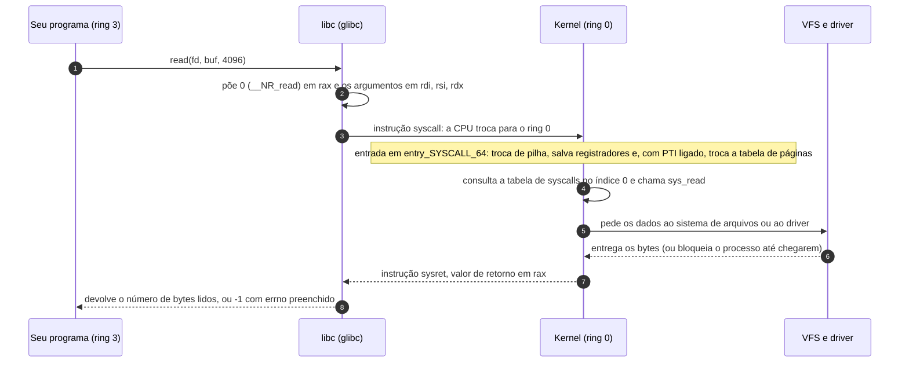
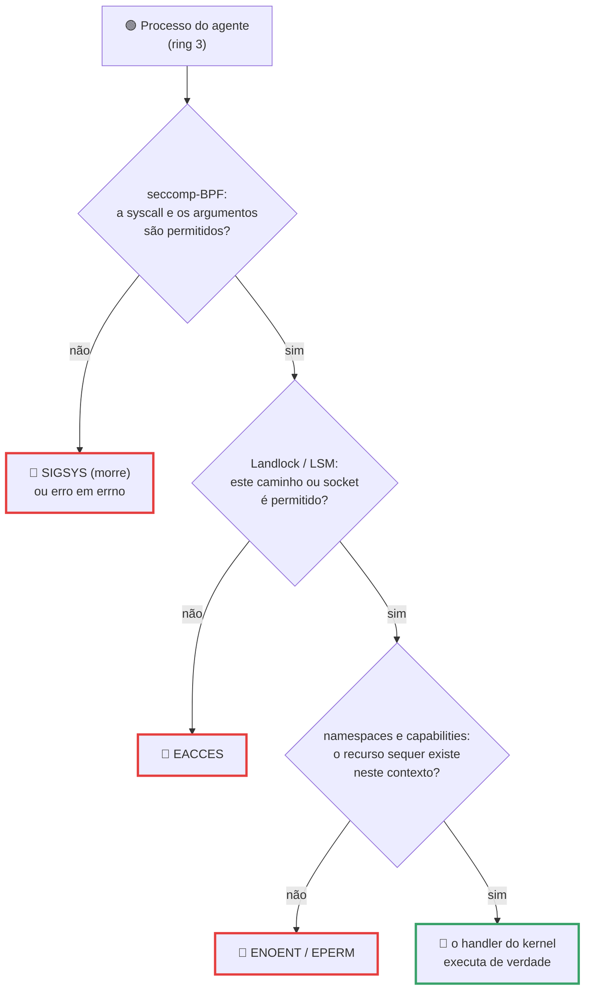

# Chamadas de Sistema

> [!quote] Todo programa, o tempo todo, batendo na mesma porta
> *Um `ls` numa pasta com dois arquivos executa 79 chamadas de sistema. Um `curl https://example.com` executa 732. Nenhum programa que você escreve consegue, sozinho, ler um arquivo, abrir um socket ou criar um processo: ele precisa pedir. Esta aula é sobre esse guichê, sobre o preço de cada pedido (medido aqui em nanossegundos) e sobre por que, em 2026, trancar o guichê virou o jeito de colocar um agente de IA dentro de uma caixa.*

> [!abstract] 🧭 O que você vai fazer nesta aula
> Ver com `strace` cada pedido que os seus programas fazem ao kernel, medir a diferença entre uma chamada real (centenas de nanossegundos) e uma que nem chega ao kernel (dezenas, via vDSO), escrever código em C e em Python que fala direto com o kernel, descobrir por que `printf` e `write` saem fora de ordem e achar quais processos do seu Linux já rodam com filtro `seccomp`. Ambiente: Ubuntu no WSL2, VM ou máquina real ([[Laboratório de SO: preparando o ambiente]]).
>
> As saídas coladas aqui foram capturadas em **Ubuntu 22.04.5, kernel 6.8.0-138, Intel Core i7-9750H, strace 5.16** (02/09/2026): os seus números serão parecidos, não idênticos.

---

## 1. 🚪 A fronteira: modo usuário e modo kernel

Na aula anterior ([[Introdução aos Sistemas Operacionais]]) vimos que o kernel é o único software com privilégio total sobre o hardware. A CPU tem pelo menos dois modos de execução e recusa, em silício, instruções privilegiadas no modo errado.

| | Modo usuário (ring 3) | Modo kernel (ring 0) |
|---|---|---|
| Quem roda ali | seu programa, navegador, Python, shell | kernel, drivers, sistemas de arquivos |
| Escreve direto no disco? | não | sim |
| Lê a memória de outro processo? | não (a MMU barra) | sim |
| Se travar, quem cai? | um processo | a máquina inteira |

![[Recursos/Sistemas operacionais/Chamadas de Sistema/aneis-de-protecao.png|Os anéis de proteção do x86: o kernel roda no ring 0 e as aplicações no ring 3. Os rings 1 e 2, previstos para drivers, quase não são usados por Linux e Windows (Wikimedia Commons)]]

A analogia é o **guichê do banco**: você não entra no cofre, preenche um pedido e entrega no guichê, onde alguém com a chave executa e devolve o resultado. A **chamada de sistema** (system call, ou syscall) é esse formulário, e o manual do Linux a define como *"the fundamental interface between an application and the Linux kernel"*.

> [!info] Chamada de sistema ≠ chamada de função de biblioteca
> `printf()` é função da biblioteca C e roda no seu processo, no ring 3; `write()` é a syscall que a `printf` acaba usando para entregar os bytes. `malloc()` é biblioteca, `brk` e `mmap` são as syscalls por trás dela. Confundir os dois é o erro nº 1 da matéria, e o `strace` da seção 4 resolve isso de vez.

> [!example] 🧪 Atividade 1: fotografar a fronteira em um comando trivial
> **Ferramenta:** `strace` (`sudo apt install strace`).
>
> 1. `mkdir -p /tmp/lab && cd /tmp/lab && touch a.txt b.txt`
> 2. Rode `strace -c ls` (a opção `-c` conta as chamadas em vez de listá-las) e anote o total, os erros (coluna `errors`) e as três mais frequentes.
> 3. Repita com `strace -c ls /` e compare o total.
>
> **Resultado esperado:** entre 60 e 120 chamadas para listar dois arquivos, com `mmap`, `openat` e `mprotect` no topo (aqui: 79 chamadas, 7 erros). Escreva no caderno: *"para mostrar dois nomes de arquivo, meu sistema atravessou a fronteira 79 vezes"*.
>
> 🪟 **No Windows:** o equivalente conceitual é o Process Monitor (seção 8); no WSL2 o `strace` funciona igual ao do Linux nativo. 🍎 **No macOS:** `sudo dtruss ls` exige desligar o SIP, então prefira o WSL2 ou uma VM.

---

## 2. 🔀 O caminho de uma chamada, passo a passo



Três detalhes que valem prova: (1) **não é um `call` comum**, quem atravessa é a instrução `syscall`, um portal que salta para um endereço fixo registrado pelo kernel no boot, e é por isso que a fronteira é segura; (2) **o número identifica o serviço**, vai em `rax`, com os argumentos em `rdi`, `rsi`, `rdx`, `r10`, `r8`, `r9`, nessa ordem (`man 2 syscall`); (3) **a libc mente um pouquinho, para o seu bem**: o kernel devolve erro como número negativo, e o wrapper inverte o sinal, guarda em `errno` e retorna `-1`. Foi por isso que você aprendeu a testar `if (fd < 0)`.

### Quanto custa atravessar a fronteira

| Operação | Custo | Fonte |
|---|---|---|
| `clock_gettime` via vDSO (não chega ao kernel) | **14,3 ns** aqui; 13 a 24 ns na referência | medido e [gms.tf, 2021](https://gms.tf/on-the-costs-of-syscalls.html) |
| Chamada de sistema real (`getpid`) | **606,2 ns** aqui; 78 a 649 ns conforme CPU e mitigações | idem |
| A mesma CPU sem mitigações de Meltdown | menos de 100 ns, contra 233 ns com mitigações | idem |
| Qualquer chamada sob `strace` | **15.068 ns** aqui (25x mais lenta) | medido |

Por que 600 ns e não 60? Em janeiro de 2018 vieram a público o **Meltdown** (CVE-2017-5754) e o **Spectre**, falhas de execução especulativa que deixam um processo comum ler memória do kernel (Meltdown afeta quase todo processador Intel com execução fora de ordem desde 1995). A correção do Linux, **KPTI**, mantém duas tabelas de páginas por processo e troca de tabela a cada entrada e saída do kernel, ao custo de cerca de uma centena de ciclos por troca. Brendan Gregg mediu o impacto entre **0,1% e 6%** na maioria das cargas. Veja o pedágio na sua máquina: `cat /sys/devices/system/cpu/vulnerabilities/meltdown` (aqui, `Mitigation: PTI`).

> [!example] 🧪 Atividade 2: medir a fronteira e caçar o vDSO
> **Ferramenta:** `gcc` (pacote `build-essential`), `strace`, `ldd`.
>
> 1. Salve como `custo.c` e compile com `gcc -O2 -o custo custo.c`. O programa faz 3 milhões de chamadas de cada tipo, e quem cronometra é o `time`:
> ```c
> /* custo.c  ->  gcc -O2 -o custo custo.c && time ./custo vdso && time ./custo syscall */
> #define _GNU_SOURCE
> #include <string.h>
> #include <time.h>
> #include <unistd.h>
> #include <sys/syscall.h>
> int main(int argc, char **argv) {
>     struct timespec t;
>     int vdso = (argc > 1 && strcmp(argv[1], "vdso") == 0);
>     for (long i = 0; i < 3000000; i++) { if (vdso) clock_gettime(CLOCK_REALTIME, &t); else syscall(SYS_getpid); }
>     return 0;
> }
> ```
> 2. `time ./custo vdso` e `time ./custo syscall`: divida cada tempo por 3.000.000 para achar o custo por chamada.
> 3. `strace -c ./custo syscall` e depois `strace -c ./custo vdso`: procure `getpid` e `clock_gettime`.
> 4. `ldd /bin/ls` e `cat /proc/self/maps | grep -E 'vdso|vvar'`: repita e veja o endereço mudar (ASLR).
> 5. `cat /sys/devices/system/cpu/vulnerabilities/meltdown`: anote a mitigação ativa.
>
> **Resultado esperado:** duas ordens de grandeza de diferença. Aqui, `time ./custo vdso` deu **0,047 s** e `time ./custo syscall` deu **1,883 s** para o mesmo número de chamadas, ou seja 14,3 ns por `clock_gettime` contra 606,2 ns por `getpid`. No `strace -c`, a versão `syscall` mostra `getpid` com 3.000.000 de chamadas e a versão `vdso` **não mostra `clock_gettime` nenhuma vez**, porque ela nunca chegou ao kernel (seção 6). O `linux-vdso.so.1` aparece no `ldd` sem existir em disco. Sob `strace` o programa ainda fica ~25x mais lento, como avisa o man page: *"a traced process runs more slowly"*.
>
> 🪟 **No Windows:** rode o mesmo código no WSL2. No Windows nativo, o análogo do vDSO é a `KUSER_SHARED_DATA`, de onde `GetTickCount64` lê a hora sem entrar no kernel: compare com `Measure-Command { 1..100000 | % { [Environment]::TickCount } }`.

---

## 3. 📚 A tabela de chamadas e as quatro famílias

O kernel guarda um vetor onde o índice é o número da chamada e o conteúdo é o endereço do handler. No x86-64 os primeiros são fáceis de decorar: `0 = read`, `1 = write`, `2 = open`, `56 = clone`, `57 = fork`, `59 = execve`, `60 = exit`, `61 = wait4`, `62 = kill`. A tabela cresce a cada versão: no ramo principal (7.3-rc1, de 30/08/2026) o maior número é **472, `fchroot`**, e `clone3` é o 435.

![[Recursos/Sistemas operacionais/Chamadas de Sistema/syscall-interface-glibc.png|A biblioteca C (verde) envolve a interface de chamadas de sistema (vermelho): cerca de 2000 funções de biblioteca para cerca de 380 chamadas de sistema. A aplicação conversa com a libc, e só a libc executa a instrução syscall (Wikimedia Commons)]]

Tanenbaum organiza as chamadas em famílias. Esta é a tabela para levar para a prova, já com o equivalente do Windows:

| Família | Linux (syscall real) | O que faz | Equivalente Win32 |
|---|---|---|---|
| **Processos** | `fork`, `clone`, `clone3` | cria processo (ou thread) | `CreateProcess` (cria e carrega de uma vez) |
| | `execve` | troca o programa que o processo executa | (embutido no `CreateProcess`) |
| | `wait4`, `waitid` | espera o filho terminar e colhe o status | `WaitForSingleObject` |
| | `exit_group`, `kill` | termina o processo, envia sinal | `ExitProcess`, `TerminateProcess` |
| **Arquivos** | `openat`, `openat2` | abre ou cria, devolve um descritor (fd) | `CreateFile` |
| | `read`, `write` | lê e escreve bytes | `ReadFile`, `WriteFile` |
| | `statx`, `newfstatat` | metadados (tamanho, dono, datas) | `GetFileAttributesEx` |
| **Diretórios** | `mkdir`, `rmdir` | cria e remove diretório | `CreateDirectory`, `RemoveDirectory` |
| | `getdents64` | lista o conteúdo do diretório | `FindFirstFile`, `FindNextFile` |
| | `mount`, `umount2` | monta e desmonta sistemas de arquivos | (letras de unidade, `SetVolumeMountPoint`) |
| **Outras** | `chdir`, `chmod` | diretório corrente, permissões | `SetCurrentDirectory`, `SetFileSecurity` |
| | `mmap`, `munmap`, `brk` | mapeia e libera memória | `VirtualAlloc`, `MapViewOfFile` |
| | `ioctl` | o faz-tudo dos drivers | `DeviceIoControl` |
| | `socket`, `connect`, `accept4` | rede | Winsock (`socket`, `connect`) |

Duas assimetrias que caem em prova: no Unix, criar processo (`fork`) e carregar programa (`execve`) são **duas** operações e no Windows são uma só (`CreateProcess`); e o Windows não expõe as syscalls como contrato público, a API oficial é a Win32 (seção 8).

> [!example] 🧪 Atividade 3: contar as chamadas de sistema do seu kernel
> **Ferramenta:** terminal Linux, `curl`, `awk` e, opcionalmente, `ausyscall` (pacote `auditd`).
>
> 1. Conte a tabela oficial do kernel mais recente (troque o `wc -l` por `tail -3` para ver as mais novas):
> ```bash
> curl -sL https://raw.githubusercontent.com/torvalds/linux/master/arch/x86/entry/syscalls/syscall_64.tbl \
>   | grep -Ev '^\s*#|^\s*$' | awk '$2=="common"||$2=="64"' | wc -l
> ```
> 2. Compare com a tabela que a **sua** máquina conhece: `ausyscall --dump | wc -l` (ou `grep -c '^#define __NR_' /usr/include/x86_64-linux-gnu/asm/unistd_64.h`).
> 3. Descubra números específicos com `ausyscall write` e `ausyscall execve`.
>
> **Resultado esperado:** a tabela do kernel novo tem mais entradas que a da sua distribuição (aqui: 362 pelo `ausyscall` do Ubuntu 22.04, com `futex_waitv` no 449, contra 472 no ramo principal). Anote a diferença e explique em uma frase por que ela existe.
>
> 🪟 **No Windows:** não existe lista oficial equivalente, e esse é o ponto. Abra a [documentação da Win32 API](https://learn.microsoft.com/en-us/windows/win32/api/) e conte as funções de `fileapi.h`: o contrato do Windows é a biblioteca, não a tabela.

---

## 4. 🔬 strace: ver as chamadas acontecendo

`strace` é o binóculo desta disciplina: ele usa `ptrace` para interceptar cada entrada e saída de syscall e imprimir a chamada, os argumentos e o retorno. Saída real de `strace -c ls`, comentada:

```
% time     seconds  usecs/call     calls    errors syscall
------ ----------- ----------- --------- --------- ----------------
 33,33    0,000099           5        18           mmap        <- mapear libc e buffers na memória
 14,14    0,000042           6         7           openat      <- abrir bibliotecas e o diretório
 11,45    0,000034           4         7           mprotect    <- ajustar permissões das páginas
  6,40    0,000019           2         9           close
  6,06    0,000018           2         8           newfstatat  <- metadados dos arquivos
  5,72    0,000017           3         5           read
  3,37    0,000010           5         2         2 statfs      <- 2 chamadas, 2 erros (normal)
  3,37    0,000010           5         2           getdents64  <- ler as entradas do diretório
  1,01    0,000003           3         1           write       <- imprimir a lista na tela
  0,00    0,000000           0         1           execve      <- o próprio ls sendo carregado
------ ----------- ----------- --------- --------- ----------------
100,00    0,000297           3        79         7 total
```

Três leituras imediatas: listar (`getdents64`) é trabalho minúsculo perto de **carregar o programa** (`mmap`, `openat`, `mprotect`); erro nem sempre é bug (o `ls` tenta `statfs` em lugares que podem não existir); e um único `write` produziu toda a saída. O separador decimal segue o locale, por isso os números saem com vírgula.

Agora a versão narrada, filtrando uma família de chamadas:

```
$ strace -e trace=openat cat /etc/hostname
openat(AT_FDCWD, "/etc/ld.so.cache", O_RDONLY|O_CLOEXEC) = 3   <- cache do linker: onde estão as libs
openat(AT_FDCWD, "/lib/x86_64-linux-gnu/libc.so.6", O_RDONLY|O_CLOEXEC) = 3
openat(AT_FDCWD, "/usr/lib/locale/locale-archive", O_RDONLY|O_CLOEXEC) = 3
openat(AT_FDCWD, "/etc/hostname", O_RDONLY) = 3   <- finalmente o arquivo que você pediu
linux
+++ exited with 0 +++
```

Leia como uma frase: *abra, a partir do diretório corrente (`AT_FDCWD`), o arquivo `/etc/hostname`, só para leitura; o kernel devolveu o descritor 3*. O 3 se repete porque cada arquivo é fechado antes do próximo e o kernel sempre entrega o **menor descritor livre** (0, 1 e 2 já são entrada, saída e erro).

| Opção | O que faz |
|---|---|
| `-c` | conta e resume em vez de listar |
| `-f` | segue processos filhos (obrigatório com pipe, shell ou thread) |
| `-e trace=openat,read` | filtra por chamada; `%file`, `%process` e `%network` filtram famílias |
| `-T` / `-tt` | tempo gasto dentro de cada chamada / carimbo de hora |
| `-p PID` / `-y` / `-k` | anexa a um processo vivo / mostra o caminho de cada fd / imprime a pilha |

Primos do `strace`: `ltrace -S -c cmd` (chamadas de biblioteca), `perf trace -s cmd` (mesma ideia com muito menos overhead) e `bpftrace`, porta de entrada do eBPF: `sudo bpftrace -e 'tracepoint:syscalls:sys_enter_* { @[comm]++ }'` conta syscalls por programa na máquina toda.

> [!tip] 💼 Isso é trabalho, não curiosidade
> "O serviço está lento e ninguém sabe por quê" é rotina de SRE, DevOps e MLOps. `strace -c -p PID` num processo travado responde em 10 segundos se ele está preso em disco (`read`), rede (`recvfrom`, `poll`), lock (`futex`) ou girando em CPU (nenhuma syscall). Em produção a mesma leitura se faz sem parar o processo, com eBPF e `perf`. Veja [[Tópicos/Redes de Computadores/DevOps|DevOps]].

> [!example] 🧪 Atividade 4: rastrear arquivos, pipes e uma requisição HTTPS
> **Ferramenta:** `strace`, `curl`, `python3`.
>
> 1. `strace -e trace=openat cat /etc/hostname`: separe o que é seu do que é infraestrutura.
> 2. `strace -T -e trace=%file cat /etc/hostname`: qual chamada demorou mais?
> 3. `strace -f -e trace=execve,clone,clone3,pipe2,dup2,wait4 bash -c 'ls | wc -l'`: desenhe no caderno quem criou quem, quem virou `ls` e quem virou `wc`.
> 4. `strace -c -f curl -s -o /dev/null https://example.com`: anote o total, compare com o `ls` da Atividade 1 e justifique a razão em duas linhas (dica: TLS, DNS, certificados).
> 5. `strace -e trace=epoll_create1,epoll_ctl,epoll_wait python3 -c "import asyncio; asyncio.run(asyncio.sleep(0.1))"`.
>
> **Resultado esperado:** no passo 3, três `execve` (bash, `ls`, `wc`), dois PIDs novos e um `pipe2` ligando os dois:
> ```
> execve("/usr/bin/bash", ["bash", "-c", "ls | wc -l"], 0x7ffd009c75a8 /* 46 vars */) = 0
> strace: Process 40088 attached
> strace: Process 40089 attached
> [pid 40088] execve("/usr/bin/ls", ["ls"], ...) = 0
> [pid 40089] execve("/usr/bin/wc", ["wc", "-l"], ...) = 0
> ```
> No passo 4, centenas de chamadas (aqui **732**, contra 79 do `ls`), com `mmap` 148, `read` 116, `rt_sigaction` 77 e `openat` 47 no topo. Guarde o desenho do passo 3: é o esqueleto da aula de [[Processos]].
>
> 🪟 **No Windows:** Process Monitor com filtro `Operation is Process Create` mostra a mesma árvore ao rodar `dir | find /c /v ""` no `cmd`.

---

## 5. 🧑‍💻 Laboratório: seu código chamando o kernel

Em C, `write(2)` é o wrapper mais fino sobre a syscall e `printf` é a versão confortável, com formatação e **buffer**. Esse buffer produz um efeito que surpreende todo mundo na primeira vez:

```c
/* buffer.c */
#include <stdio.h>
#include <unistd.h>
int main(void) {
    for (int i = 0; i < 3; i++) printf("printf %d\n", i);
    for (int i = 0; i < 3; i++) { char m[16]; int n = sprintf(m, "write %d\n", i); write(1, m, n); }
    return 0;
}
```

Compile com `gcc -o buffer buffer.c` e rode **redirecionando a saída**: `./buffer | cat`. A ordem inverte, e o `strace` explica por quê:

```
$ ./buffer | cat            $ strace -e trace=write ./buffer
write 0                     write(1, "write 0\n", 8) = 8
write 1                     write(1, "write 1\n", 8) = 8
write 2                     write(1, "write 2\n", 8) = 8
printf 0                    write(1, "printf 0\nprintf 1\nprintf 2\n", 27) = 27
printf 1                       ^ os três printf saíram numa syscall só, no fim do programa
printf 2
```

Quando a saída padrão não é um terminal, a glibc usa buffer de bloco: guarda os três `printf` na memória e só chama `write` uma vez, no fim do programa. Não é defeito, é a otimização da seção 2 em ação (uma syscall de 27 bytes custa menos que três de 9). O preço é a ordem, e é por isso que log de programa que trava some: ficou no buffer.

Em Python a história se repete uma camada acima. `os.write` é o wrapper direto da syscall e `print` passa pelo buffer de `sys.stdout`:

```
$ strace -e trace=write python3 -c 'import os; os.write(1, b"oi\n")'
write(1, "oi\n", 3) = 3

$ strace -c -e trace=write python3 -c 'print("a");print("b");print("c")' | cat
       1  write     <- um único write de 6 bytes: "a\nb\nc\n"

$ strace -c -e trace=write python3 -u -c 'print("a");print("b");print("c")' | cat
       6  write     <- a opção -u desliga o buffer
```

> [!example] 🧪 Atividade 5: provar o buffer em C e em Python
> **Ferramenta:** `gcc`, `python3`, `strace`.
>
> 1. Compile o `buffer.c` acima e rode direto no terminal (ordem certa, buffer por linha) e depois `./buffer | cat` (ordem invertida).
> 2. `strace -c -e trace=write ./buffer` e conte as chamadas.
> 3. Acrescente `fflush(stdout);` dentro do primeiro laço, recompile e repita os passos 1 e 2.
> 4. Em Python: `strace -c -e trace=write python3 -c 'print("a");print("b");print("c")' | cat`, depois o mesmo com `python3 -u`.
> 5. Bônus: `strace -f -e trace=clone,clone3 python3 -c 'import threading; t=threading.Thread(target=lambda: None); t.start(); t.join()'`.
>
> **Resultado esperado:** em C, 4 chamadas `write` sem `fflush` (3 do seu laço mais 1 do buffer) e 6 com `fflush`, na ordem certa; em Python, 1 chamada com buffer e 6 com `-u`. No bônus, a thread nasce com `clone3` e as flags `CLONE_VM|CLONE_FS|CLONE_FILES|CLONE_THREAD`, enquanto o `bash`, ao criar um processo, usa `clone` com `SIGCHLD` e sem `CLONE_VM`: compartilhar ou não a memória é a diferença entre thread e processo ([[Threads]]).
>
> 🪟 **No Windows:** o mesmo código C compila com MSVC ou MinGW e tem o mesmo comportamento; para ver as chamadas, use o WSL2 ou o Process Monitor filtrando `WriteFile`.

---

## 6. ⚡ Chamadas modernas: io_uring, epoll, clone3, openat2 e o vDSO

A tabela de syscalls não é museu: ela cresce quando a forma antiga de pedir vira gargalo.

| Chamada | Desde | Problema que resolve | Onde aparece |
|---|---|---|---|
| `epoll_create1`, `epoll_ctl`, `epoll_wait` | 2.5.44 | esperar em milhares de conexões sem varrer todas a cada volta (o C10K do `select`) | Nginx, Node.js, Redis, asyncio |
| `io_uring_setup`, `io_uring_enter`, `io_uring_register` | 5.1 (a página `io_uring(7)` documenta a partir do 5.4) | E/S em lote por filas em memória compartilhada com o kernel | bancos de dados, proxies, armazenamento |
| `clone3`, `pidfd_open` | 5.3 | criar tarefa com struct extensível; referenciar processo por descritor, sem a corrida do PID reciclado | glibc moderna, systemd, containers |
| `openat2` | 5.6 | abrir arquivo com restrição de resolução de caminho (`RESOLVE_BENEATH`, `RESOLVE_NO_SYMLINKS`) | runtimes de container, contra fuga por symlink |
| `landlock_create_ruleset` e cia. | 5.13 | um processo comum se autolimitar (seção 7) | sandbox de agentes de IA, navegadores |

O `io_uring` mostra bem a lógica de "menos syscalls": em vez de uma travessia da fronteira por operação, a aplicação escreve os pedidos numa fila em memória compartilhada com o kernel (a *submission queue*), avisa uma vez só e depois lê os resultados de outra fila (a *completion queue*), sem nova syscall. O man page é explícito: *"you can batch several requests in one go, simply by queueing up multiple SQEs [...] and make a single call to `io_uring_enter(2)`"*.

O **vDSO** resolve o caso oposto, o da chamada barata e frequentíssima: é *"a small shared library that the kernel automatically maps into the address space of all user-space applications"*. O kernel publica ali o relógio em páginas só de leitura, e a "chamada" vira leitura de memória comum, no ring 3. É o `linux-vdso.so.1` da Atividade 2, que aparece no `ldd` sem existir em disco; ele exporta `__vdso_clock_gettime`, `__vdso_gettimeofday`, `__vdso_time` e `__vdso_getcpu`, e desde o kernel 6.11 (set/2024) também o `getrandom()`.

---

## 7. 🛡️ Filtrar chamadas: seccomp, Landlock e o sandbox dos agentes de IA

Aqui a aula encontra o ângulo da disciplina. Se toda ação perigosa passa obrigatoriamente pela tabela de syscalls, então **controlar a tabela é controlar o programa**. Essa ideia, que era assunto de container, virou o alicerce dos assistentes de código de 2025-2026: quando você deixa um agente de IA rodar comandos na sua máquina, o que o segura não é o modelo, é o kernel.



**seccomp-BPF** é um filtro em bytecode BPF que o próprio processo instala sobre si mesmo (e que os filhos herdam, sem volta). Ele decide pelo **número da chamada e pelos argumentos**, com estas ações, da mais dura para a mais branda: `KILL_PROCESS`, `KILL_THREAD`, `TRAP`, `ERRNO`, `USER_NOTIF`, `TRACE`, `LOG`, `ALLOW`. **Landlock** resolve o que o seccomp não sabe fazer, que é dizer *quais arquivos*: é um módulo de segurança usável por processo comum, sem root, com três syscalls, e cresce por versões de ABI (1 em 5.13 para arquivos, 4 em 6.7 para TCP, 6 em 6.12 para sinais e sockets Unix, 8 em 7.0).

| Ferramenta | Como isola |
|---|---|
| **Docker** (perfil seccomp padrão) | lista de permissões; a documentação diz que o perfil *"disables around 44 system calls out of 300+"* |
| **Claude Code `/sandbox`** | bubblewrap + seccomp opcional + proxy com allowlist de domínios (nenhum pré-liberado); Seatbelt no macOS; no Ubuntu 24.04+ exige perfil AppArmor para o `bwrap` |
| **OpenAI Codex** | Seatbelt, bubblewrap ou sandbox nativo do Windows; modos `read-only`, `workspace-write` (padrão) e `danger-full-access`, com rede desligada por padrão |
| **bubblewrap** (base do Flatpak) | user namespaces sem root: `bwrap --ro-bind /usr /usr --proc /proc --dev /dev --unshare-pid --new-session bash` |
| **gVisor / Firecracker** | reimplementar a interface Linux em user space, em Go (gVisor), ou trocar o filtro por uma microVM sobre KVM que sobe em menos de 125 ms (Firecracker, que roda o AWS Lambda) |

Abrindo o perfil seccomp padrão do Docker (`default.json` do projeto moby, conferido em 02/09/2026): a ação padrão é **negar** (`SCMP_ACT_ERRNO`), o perfil libera 426 nomes de chamadas e **50 deles só valem com a capability correspondente** (`mount`, `unshare` e `setns` exigem `CAP_SYS_ADMIN`). As três chamadas do **`io_uring` não estão na lista**, porque a interface já acumulou falhas de segurança. E `clone3` aparece com `errnoRet: 38` (`ENOSYS`): o kernel finge que a chamada não existe para que a glibc caia no velho `clone`.

> [!example] 🧪 Atividade 6: achar os filtros ligados na sua máquina e criar um seu
> **Ferramenta:** `/proc`, `curl`, `jq`, `systemd-run`.
>
> 1. Veja o seu processo: `grep -E 'Seccomp|NoNewPrivs' /proc/self/status` (esperado `Seccomp: 0`, sem filtro).
> 2. Varra o sistema atrás de processos já filtrados:
> ```bash
> for p in $(ls /proc | grep -E '^[0-9]+$'); do
>   s=$(grep -m1 '^Seccomp:' /proc/$p/status 2>/dev/null | awk '{print $2}')
>   [ "$s" = "2" ] && echo "pid $p  $(cat /proc/$p/comm 2>/dev/null)"
> done
> ```
> 3. Baixe o perfil padrão do Docker e procure nele três chamadas da tabela da seção 3:
> ```bash
> curl -sL -o /tmp/sec.json https://raw.githubusercontent.com/moby/profiles/main/seccomp/default.json
> jq '.defaultAction' /tmp/sec.json
> jq '[.syscalls[].names[]] | unique | length' /tmp/sec.json
> jq -r '[.syscalls[].names[]] | index("io_uring_setup") // "BLOQUEADA"' /tmp/sec.json
> ```
> 4. Crie o seu filtro e mate um processo bloqueando uma única chamada: `systemd-run --user --pty --property=SystemCallFilter=~openat /bin/ls /` (compare com o mesmo comando sem o filtro). Se o `--user` reclamar de barramento, use `sudo systemd-run --scope -p SystemCallFilter=~openat ls /`.
> 5. Em vez de matar, devolva erro: acrescente `--property=SystemCallErrorNumber=EPERM`.
>
> **Resultado esperado:** `Seccomp: 2` (modo filtro) em vários serviços (aqui, `systemd-journald`, `systemd-udevd`, `pipewire` e `upowerd`); no perfil do Docker, ação padrão `SCMP_ACT_ERRNO`, 426 nomes permitidos e `io_uring_setup` ausente; e, no passo 4, o `ls` morrendo com `SIGSYS` ("Bad system call"), porque a documentação do systemd é clara: chamadas fora da lista *"result in immediate process termination with the SIGSYS signal"*. Entregue a lista dos processos filtrados da sua máquina e explique por que um daemon decide se automutilar assim.
>
> 🪟 **No Windows:** o análogo é o AppContainer com as mitigações do Exploit Guard. Rode `Get-ProcessMitigation -Name msedge.exe` no PowerShell como administrador e veja o que o navegador impõe a si mesmo.

> [!warning] Filtro não é mágica
> seccomp e Landlock reduzem a **superfície de ataque**, não eliminam o risco. O sandbox protege a sua máquina do que o agente faz; ele não protege o agente de ser enganado (injeção de prompt) nem impede que ele estrague os arquivos do diretório onde você mesmo deixou ele escrever. Isolamento é camada, não garantia. Aprofundamos em [[Segurança em Sistemas Operacionais]] e em [[Containers e Virtualização]].

---

## 8. 🪟 E no Windows: ntdll, as funções `Nt*` e o Process Monitor

O Windows tem a mesma fronteira, com nomes diferentes e uma decisão oposta na hora de expor o contrato:

| Camada | Windows | Linux |
|---|---|---|
| O que a documentação promete | **Win32 API** (`kernel32.dll`, `CreateFileW`, `ReadFile`) | as syscalls e a glibc, ambas documentadas |
| Camada intermediária | `ntdll.dll`, com a **native API** (`NtCreateFile`, `NtReadFile`) | glibc (wrappers finos) |
| Tabela do kernel | SSDT (System Service Descriptor Table), com números que **não são contrato público** e mudam entre versões | tabela de syscalls por arquitetura, com números estáveis |
| Quem executa | `ntoskrnl.exe` | kernel Linux |

![[Recursos/Sistemas operacionais/Chamadas de Sistema/windows-modo-usuario-modo-kernel.png|A pilha do Windows na documentação oficial: aplicações e Windows API em modo usuário, kernel, drivers e HAL em modo kernel, com a fronteira marcada pela linha tracejada (Microsoft Learn)]]

A Microsoft documenta que as funções `Nt*` e `Zw*` são *"serviced by the same kernel-mode system routine"* e que, do modo usuário, *"behave identically"* (a diferença aparece quando um driver as chama, porque a variante `Zw` avisa ao kernel que os parâmetros vêm de código confiável). Para você, programador de aplicação, a regra é simples: **use a Win32**, que é o que a Microsoft promete manter.

O binóculo equivalente ao `strace` é o **Process Monitor** (Sysinternals, versão publicada em 19/08/2026). Ele não mostra a syscall crua, e sim as operações de sistema de arquivos, registro, processos e threads, com a pilha de chamadas de cada operação.

![[Recursos/Sistemas operacionais/Chamadas de Sistema/process-monitor.png|Process Monitor capturando operações de um processo: cada linha é uma operação de arquivo ou de registro, com processo, PID, operação, caminho e resultado (Microsoft Sysinternals)]]

E o WSL2 não traduz nada: *"whereas WSL 1 used a translation layer that was built by the WSL team, WSL 2 includes its own Linux kernel with full system call compatibility"*. O WSL1 convertia syscalls do Linux em chamadas NT, com compatibilidade incompleta; o WSL2 roda um kernel Linux real, compilado pela Microsoft, numa VM leve. É por isso que `strace`, `docker` e `perf` funcionam no WSL2 e não funcionavam no WSL1.

> [!example] 🧪 Atividade 7: o "strace do Windows"
> **Ferramenta:** [Process Monitor](https://learn.microsoft.com/en-us/sysinternals/downloads/procmon) (Sysinternals, gratuito, sem instalação).
>
> 1. Execute o `Procmon64.exe` (`Ctrl+E` pausa a captura, `Ctrl+X` limpa).
> 2. `Ctrl+L` abre o filtro: crie `Process Name is notepad.exe` e aplique.
> 3. Volte a capturar, abra o Bloco de Notas, salve um arquivo em Documentos e feche.
> 4. Ache o `CreateFile` do seu arquivo, botão direito, `Properties`, aba `Stack`, e veja a pilha até a `ntdll.dll`.
> 5. Conte quantas operações o Bloco de Notas fez só para salvar uma linha de texto.
>
> **Resultado esperado:** dezenas a centenas de operações, com `CreateFile`, `WriteFile`, `CloseFile` e muito acesso ao registro. Compare com as 79 chamadas do `ls` (Atividade 1) e comente a diferença entre um programa de terminal e um gráfico.
>
> 🐧 **No Linux:** a Microsoft mantém o [Procmon for Linux](https://github.com/microsoft/ProcMon-for-Linux), com a mesma interface, sobre eBPF.

---

## ❓ Quiz rápido

> [!question]- 1. Um programa em C chama `printf("oi\n")` com a saída redirecionada para um arquivo. Quantas chamadas `write` isso gera, e quando?
> **Resposta:** normalmente **nenhuma na hora**. Com a saída em arquivo ou pipe, a glibc usa buffer de bloco e só chama `write` quando o buffer enche, no `fflush` ou no fim do programa. No terminal o buffer é por linha, e aí sai uma chamada por linha.

> [!question]- 2. Por que `clock_gettime` não aparece no `strace`, mesmo tendo sido chamada 3 milhões de vezes?
> **Resposta:** porque ela foi resolvida no **vDSO**, biblioteca que o kernel mapeia no espaço de endereçamento de todo processo. A leitura acontece em modo usuário, sem instrução `syscall`, então o `ptrace` (base do `strace`) não tem o que interceptar. É também por isso que custa ~14 ns em vez de ~600 ns.

> [!question]- 3. Sobre `fork` (Linux) e `CreateProcess` (Windows): (a) são a mesma chamada com nomes diferentes; (b) `fork` duplica o processo atual e carregar outro programa exige `execve`, enquanto `CreateProcess` faz as duas coisas; (c) o Windows não tem chamadas de sistema; (d) `fork` é biblioteca e `CreateProcess` é syscall.
> **Resposta:** **(b)**. A separação do Unix é o que permite ao shell mexer nos descritores entre o `fork` e o `execve`, que é como funcionam redirecionamento e pipe. O Windows tem syscalls sim, mas o contrato público é a Win32: a `CreateProcess` desce até `NtCreateUserProcess`, na `ntdll.dll`.

> [!question]- 4. Um container Docker tenta usar `io_uring_setup` e recebe erro, mesmo rodando como root dentro do container. Por quê?
> **Resposta:** porque o **perfil seccomp padrão do Docker** é uma lista de permissões com ação padrão `SCMP_ACT_ERRNO`, e as chamadas do `io_uring` não estão nela. Ser root dentro do container não ajuda: o filtro vale para o processo e para todos os filhos. Só `--security-opt seccomp=unconfined` ou um perfil próprio libera.

> [!question]- 5. Investigando um serviço lento, você roda `strace -c -p 4127` por 10 segundos e vê 96% do tempo em `futex`. O que isso sugere, e qual o risco de ter rodado esse comando?
> **Resposta:** `futex` é a primitiva de espera de mutexes e semáforos: o processo está **esperando por lock**, não por disco nem por CPU, o que aponta contenção entre threads ([[Threads]]). O risco é que o `strace` usa `ptrace` e deixa o processo muito mais lento (aqui, 25x numa chamada trivial). Em produção, prefira `perf trace` ou `bpftrace`.

---

## 🔗 Veja também

- [[Introdução aos Sistemas Operacionais]]: os modos da CPU, as interrupções e o hardware do outro lado desta fronteira.
- [[Processos]] e [[Threads]]: o que `fork`, `clone3`, `execve` e `wait4` realmente criam e destroem.
- [[Estrutura dos Sistemas Operacionais]]: por que um kernel monolítico atende a syscall dentro dele mesmo e um microkernel manda mensagem para um servidor em modo usuário.
- [[Segurança em Sistemas Operacionais]] e [[Containers e Virtualização]]: seccomp, Landlock, capabilities, namespaces e o que ainda passa por baixo deles.
- [[Linux na prática]]: `strace`, `lsof`, `perf` e a caixa de ferramentas do dia a dia.
- [[Sistemas Operacionais na Era da IA]] e [[Desenvolvimento de Software com IA]]: por que sandbox virou requisito de produto quando o software passou a escrever software.
- ➡️ **Próxima aula:** [[Estrutura dos Sistemas Operacionais]]

---

> [!note] 📚 Fontes (2026)
> - Man pages: [syscalls(2)](https://man7.org/linux/man-pages/man2/syscalls.2.html), [syscall(2), convenções por arquitetura](https://man7.org/linux/man-pages/man2/syscall.2.html), [strace(1)](https://man7.org/linux/man-pages/man1/strace.1.html), [vdso(7)](https://man7.org/linux/man-pages/man7/vdso.7.html), [io_uring(7)](https://man7.org/linux/man-pages/man7/io_uring.7.html), [epoll(7)](https://man7.org/linux/man-pages/man7/epoll.7.html), [openat2(2)](https://man7.org/linux/man-pages/man2/openat2.2.html) e [landlock(7)](https://man7.org/linux/man-pages/man7/landlock.7.html)
> - Kernel: [tabela x86-64 (`syscall_64.tbl`)](https://raw.githubusercontent.com/torvalds/linux/master/arch/x86/entry/syscalls/syscall_64.tbl), [kernel.org, versões em 02/09/2026](https://www.kernel.org/), [KernelNewbies: Linux 6.11](https://kernelnewbies.org/Linux_6.11) e [Page Table Isolation](https://docs.kernel.org/arch/x86/pti.html)
> - Custo e Meltdown: [Georg Sauthoff, "On the costs of syscalls" (2021)](https://gms.tf/on-the-costs-of-syscalls.html), [meltdownattack.com (CVE-2017-5754)](https://meltdownattack.com/) e [Brendan Gregg: KPTI/KAISER Meltdown performance (2018)](https://www.brendangregg.com/blog/2018-02-09/kpti-kaiser-meltdown-performance.html)
> - Filtros e sandbox: [seccomp BPF](https://docs.kernel.org/userspace-api/seccomp_filter.html), [Landlock](https://docs.kernel.org/userspace-api/landlock.html), [Docker: seccomp profiles](https://docs.docker.com/engine/security/seccomp/), [perfil padrão do Docker (moby)](https://raw.githubusercontent.com/moby/profiles/main/seccomp/default.json), [bubblewrap](https://github.com/containers/bubblewrap), [gVisor](https://gvisor.dev/docs/) e [Firecracker](https://firecracker-microvm.github.io/)
> - Sandbox de agentes de IA: [Claude Code: sandboxing](https://code.claude.com/docs/en/sandboxing) e [OpenAI Codex: sandboxing](https://learn.chatgpt.com/docs/sandboxing)
> - Windows: [Nt e Zw versions of the native system services routines](https://learn.microsoft.com/en-us/windows-hardware/drivers/kernel/using-nt-and-zw-versions-of-the-native-system-services-routines), [User mode and kernel mode (figura da pilha do Windows)](https://learn.microsoft.com/en-us/windows-hardware/drivers/gettingstarted/user-mode-and-kernel-mode), [Process Monitor (Sysinternals, 19/08/2026)](https://learn.microsoft.com/en-us/sysinternals/downloads/procmon) e [Comparando WSL 1 e WSL 2](https://learn.microsoft.com/en-us/windows/wsl/compare-versions)
> - [systemd.exec(5): `SystemCallFilter=` e `SystemCallErrorNumber=`](https://www.freedesktop.org/software/systemd/man/latest/systemd.exec.html)
> - Livros: Tanenbaum & Bos, *Sistemas Operacionais Modernos*, 4ª ed., seção 1.6 e cap. 11; [OSTEP](https://pages.cs.wisc.edu/~remzi/OSTEP/); [Maziero, *Sistemas Operacionais: Conceitos e Mecanismos* (UFPR)](https://wiki.inf.ufpr.br/maziero/doku.php?id=socm:start)
> - Imagens: [Priv rings.svg (Wikimedia Commons, Hertzsprung, CC BY-SA 3.0)](https://commons.wikimedia.org/wiki/File:Priv_rings.svg), [Linux kernel System Call Interface and glibc.svg (Wikimedia Commons, ScotXW, CC BY-SA 3.0)](https://commons.wikimedia.org/wiki/File:Linux_kernel_System_Call_Interface_and_glibc.svg) e [captura do Process Monitor (Microsoft Sysinternals)](https://learn.microsoft.com/en-us/sysinternals/downloads/procmon)
