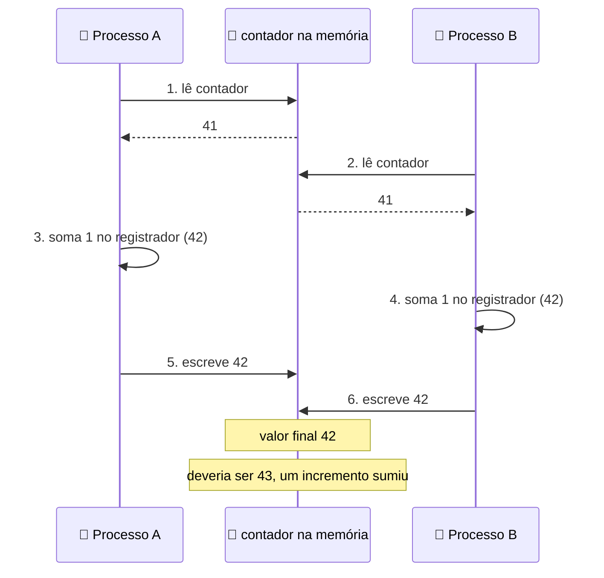
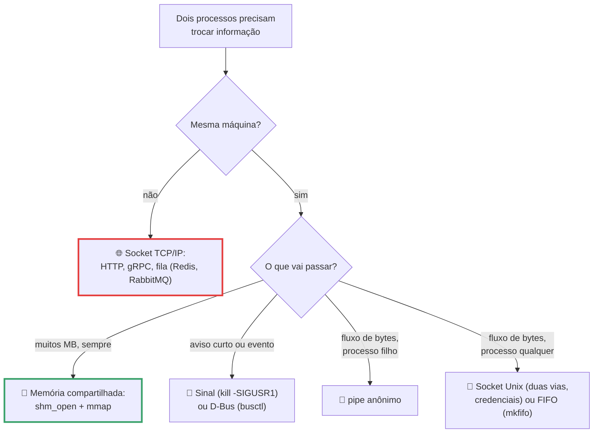

# Comunicação entre Processos

> [!quote] Duas threads, uma variável, um desastre
> *Rodei duas threads somando 1 a um contador, um milhão de vezes cada. O resultado deveria ser 2.000.000. Deu **1.019.923**. Quase metade dos incrementos evaporou, e nenhuma linha estava "errada": cada thread fez exatamente o que mandei. O erro estava no tempo.*

Na aula anterior, [[Threads]], você viu threads dividirem o mesmo espaço de endereçamento. Aquilo era a boa notícia; esta aula é a conta que chega junto. Quando duas execuções mexem no mesmo dado sem combinar quem vai primeiro, o resultado depende de quem o escalonador acordou naquele microssegundo: é o bug que some quando você põe um `print` para investigar e só aparece em produção às três da manhã.

---

## 1. 💥 A corrida que você vai reproduzir agora

Sem truque: duas threads, uma global, um milhão de somas cada.

```python
# race.py
import threading
contador, N = 0, 1_000_000

def incrementa():
    global contador
    for _ in range(N):
        contador += 1      # <- a linha do crime

ts = [threading.Thread(target=incrementa) for _ in range(2)]
for t in ts: t.start()
for t in ts: t.join()
print("esperado:", 2*N, "obtido:", contador)
```

Rodei em quatro interpretadores (Ubuntu 22.04, kernel 6.8, 12 núcleos):

| Interpretador | Esperado | Obtido | Perdidos |
|---|---|---|---|
| `python3.10`, `3.12` e `3.14` (com GIL) | 2.000.000 | 2.000.000 | 0 |
| `python3.14t` (**free-threading**, sem GIL) | 2.000.000 | **1.019.923** | **980.077** |

O mesmo código, correto ou catastrófico conforme o interpretador. No CPython com **GIL** (*Global Interpreter Lock*) só uma thread executa bytecode por vez, o que esconde a corrida neste laço; no 3.14 free-threaded as duas rodam em núcleos diferentes e o problema aparece inteiro.

> [!warning] O GIL não é solução de sincronização
> A documentação do Python é explícita: `L.append(x)`, `x = L[i]` e `D[x] = y` são atômicos, mas **`i = i+1` e `D[x] = D[x] + 1` não são**. E fecha com a frase que vale para qualquer linguagem: *"When in doubt, use a mutex!"* ([Python FAQ](https://docs.python.org/3/faq/library.html)). Depender do GIL é depender de um detalhe que o CPython está removendo.

Sem o `python3.14t`, troque threads por processos: `multiprocessing.Value(..., lock=False)` põe um inteiro em memória compartilhada real, sem trava, e a corrida explode em qualquer versão:

```python
# race_mp.py
from multiprocessing import Process, Value
N = 1_000_000

def incrementa(c):
    for _ in range(N):
        c.value += 1               # ler, somar, escrever: três passos, sem trava

if __name__ == "__main__":         # obrigatório: o Windows usa spawn, não fork
    c = Value('i', 0, lock=False)  # memória compartilhada, SEM trava
    ps = [Process(target=incrementa, args=(c,)) for _ in range(2)]
    for x in ps: x.start()
    for x in ps: x.join()
    print("esperado:", 2*N, "obtido:", c.value, "perdidos:", 2*N - c.value)
```

Saída real, três execuções seguidas:

```text
esperado: 2000000 obtido: 1294376 perdidos: 705624
esperado: 2000000 obtido: 1144088 perdidos: 855912
esperado: 2000000 obtido: 1157984 perdidos: 842016
```

**Três respostas diferentes para o mesmo programa.** Isso é uma **condição de corrida** (*race condition*): o resultado depende da ordem em que as execuções se intercalam, e quem decide é o escalonador. `contador += 1` parece uma operação, mas são três:



Tanenbaum conta o mesmo com o **spooler de impressão**: dois processos leem "a próxima vaga livre é a 7", ambos gravam na vaga 7, e um documento nunca é impresso. Nenhum programa tem bug: o bug está no entrelaçamento.

---

## 2. 🚧 Região crítica e as quatro condições

O trecho que mexe no recurso compartilhado é a **região crítica** (aqui, `contador += 1`), e a regra é fácil de enunciar e difícil de garantir: **duas execuções não podem estar dentro dela ao mesmo tempo**. Isso é **exclusão mútua**. Pense no banheiro de um posto: a região crítica é o cubículo e a exclusão mútua é a tranca (a solução ruim é o frentista gritando "acho que tem gente"). Uma tranca boa tem quatro propriedades:

| # | Condição | Em português claro | O que quebra se faltar |
|---|---|---|---|
| 1 | **Exclusão mútua** | Nunca dois dentro ao mesmo tempo | Volta a corrida da seção 1 |
| 2 | **Sem hipótese sobre velocidade** | Não vale supor "o outro é mais rápido" nem contar núcleos | Funciona no notebook, quebra no servidor de 96 núcleos |
| 3 | **Quem está fora não bloqueia** | Quem lava a mão não tranca o cubículo | Um processo lento na parte inocente congela todo mundo |
| 4 | **Ninguém espera para sempre** | Quem quer entrar acaba entrando | *Starvation*: o azarado nunca é atendido |

Separe dois primos: **deadlock** é ninguém andar, todos esperando uns aos outros; **starvation** é o sistema andar, mas sempre com os mesmos. A correção do contador cabe em duas linhas:

```python
trava = threading.Lock()
...
        with trava:            # entra na região crítica (bloqueia se estiver ocupada)
            contador += 1      # só uma execução aqui dentro por vez
```

Saída real no `python3.14t`, o interpretador que perdia quase um milhão de incrementos: `obtido: 2000000 tempo: 0.35s`, três vezes seguidas. Mas repare no preço: **sem a trava o laço levava 0,09 s; com a trava, 0,35 s**. Sincronização não é de graça, e por isso concorrência é sobre *encolher* a região crítica, nunca sobre travar mais.

> [!example] 🧪 Atividade 1: provoque a corrida, conserte e meça o preço
> **Ferramenta:** Python 3 (já vem no Ubuntu/WSL2), terminal.
>
> 1. Rode `for i in 1 2 3 4 5; do python3 race_mp.py; done`. Se algum der 2.000.000 certinho, suba `N` para `5_000_000`.
> 2. Rode o `race.py` no seu Python padrão; depois `uv python install 3.14t` e `uv run --python 3.14t race.py` (confirme o `False` em `sys._is_gil_enabled()`).
> 3. Aplique a trava e cronometre. Depois **encolha a região crítica**: acumule numa variável local e faça `with trava: contador += local` **uma vez só** no fim.
>
> **Resultado esperado:** tabela com três valores diferentes para o mesmo programa e os três tempos (sem trava, trava por iteração, trava no fim). A trava custa por quantas vezes é adquirida, não por existir.
>
> 🪟 **No Windows:** WSL2, ou Python nativo com o `if __name__ == "__main__":` (lá é `spawn`, não `fork`). 🍎 **No macOS:** igual ao Linux.

---

## 3. 🔒 Exclusão mútua com espera ocupada

Antes de existir chamada de sistema pronta, tentou-se resolver na unha. Cada tentativa falha de um jeito instrutivo.

| Tentativa | Como funciona | Por que não serve (ou serve) |
|---|---|---|
| **Desabilitar interrupções** | `cli` antes, `sti` depois | Só vale para **um** núcleo, e é instrução privilegiada: nas mãos de um programa comum, congelaria a máquina |
| **Variável de trava** | `while trava == 1: pass`, depois `trava = 1` | Testar e atribuir são **duas** operações: os dois passam pelo teste antes de qualquer um escrever. É a corrida de novo |
| **Alternância estrita** | `while vez != eu: pass` | Exclui mútuo mas **viola a condição 3**: se A é rápido e B é lento, A espera a vez de B com o cubículo vazio |
| **Peterson (1981)** | "Quero entrar" (`interesse`) mais "quem cedeu por último" (`vez`) | Correto em teoria e sem instrução especial, mas quebra em CPU moderna sem barreira de memória: o processador **reordena** leituras e escritas |
| **TSL / XCHG (atômica)** | Lê e escreve a memória num único ato indivisível | **É esta que o mundo usa.** No x86, o prefixo `LOCK` (`lock cmpxchg`, `lock xchg`, `lock xadd`); no ARM, `LDREX/STREX` |

A teoria vira um byte. Compile com `gcc -O2 -c atomico.c && objdump -d atomico.o`:

```c
int contador = 0;
void soma_normal(void)  { contador += 1; }              // sem garantia
void soma_atomica(void) { __atomic_fetch_add(&contador, 1, __ATOMIC_SEQ_CST); }
```

```text
<soma_normal>:    4:  83 05 00 00 00 00 01       addl   $0x1,0x0(%rip)
<soma_atomica>:  14:  f0 83 05 00 00 00 00  lock addl   $0x1,0x0(%rip)
```

Uma única diferença: o byte **`f0`**, o prefixo `LOCK` do x86, que manda o processador segurar a linha de cache durante a instrução inteira, para que nenhum outro núcleo toque naquele endereço. É o "test and set lock" (TSL) de Tanenbaum, na sua máquina, e as travas da biblioteca C são feitas em cima dele: **464** `lock cmpxchg` e **37** `lock xadd` na minha `libc` (glibc 2.35).

> [!example] 🧪 Atividade 2: ache a instrução atômica no seu binário
> **Ferramenta:** `gcc` e `objdump` (`sudo apt install build-essential binutils`).
>
> 1. Compile o C acima, rode `objdump -d atomico.o` e circule o `f0` na segunda função.
> 2. Conte as atômicas da sua libc: `objdump -d /lib/x86_64-linux-gnu/libc.so.6 | grep -oE 'lock (cmpxchg|xchg|xadd)[a-z]*' | sort | uniq -c | sort -rn`.
> 3. Peça a uma IA para prever o que muda ao trocar `__ATOMIC_SEQ_CST` por `__ATOMIC_RELAXED`, **rode e compare** com a doc dos builtins `__atomic` do GCC.
>
> **Resultado esperado:** as duas linhas de assembly lado a lado e o número de `lock cmpxchg` da sua libc (diferente do meu).
>
> 🪟 **No Windows:** WSL2, ou o [Compiler Explorer](https://godbolt.org/) no navegador (x86-64 gcc com `-O2`).

Todas essas soluções têm um defeito comum: `while (trava) ;` **queima CPU de graça** (o *busy waiting*, ou *spin lock*). Pior, existe a **inversão de prioridade**: se uma thread de prioridade alta gira esperando uma trava que uma de prioridade baixa segura, o escalonador nunca dá CPU à de baixa e as duas travam para sempre (foi o que quase matou a sonda Mars Pathfinder em 1997). A saída é **dormir e acordar**: em vez de girar, o processo sai da fila de prontos até alguém avisar.

---

## 4. 🎫 Semáforos, mutex, futex, monitores e barreiras

**Semáforo** (Dijkstra, 1965) é um contador inteiro com duas operações atômicas: **`down`** (`P`) decrementa se for maior que zero e **dorme** se for zero; **`up`** (`V`) incrementa e acorda alguém. É a chave do banheiro: com 3 chaves, três entram e a quarta espera (`Semaphore(3)`). O contador **guarda memória do aviso**, o que resolve de graça o *lost wakeup*, o "acorda" que chega antes do "dorme". **Mutex** é o caso com contador 1 (`threading.Lock()`), e a diferença importa: mutex tem **dono** (quem tranca destranca), semáforo não. Semáforo *conta recursos*; mutex *protege região crítica*.

### Futex: como o Linux faz isso rápido

O **futex** (*fast userspace mutex*) foi projetado assim, nas palavras do man page: *"the majority of the synchronization operations are performed in user space"*. A trava vive numa palavra de memória compartilhada manipulada com `lock cmpxchg`, e **o kernel só entra quando alguém precisa dormir** (`FUTEX_WAIT`) ou acordar alguém (`FUTEX_WAKE`). A versão com trava (2 milhões de aquisições) sob o `strace`:

```text
$ strace -f -c -e trace=futex python3 fix.py
% time     seconds  usecs/call     calls    errors syscall
100,00    0,031529          22      1395       438 futex
```

**2.000.000 de operações de trava geraram 1.395 chamadas ao kernel**, menos de 0,07%: o resto foi resolvido em espaço de usuário com instrução atômica pura. Por isso travar um mutex descontendido custa nanossegundos.

> [!example] 🧪 Atividade 3: conte as idas ao kernel
> **Ferramenta:** `strace` (`sudo apt install strace`).
>
> 1. Rode `strace -f -c -e trace=futex python3 fix.py` e anote a coluna `calls`.
> 2. Repita com a versão da Atividade 1 etapa 3 (região crítica encolhida) e com a SEM trava; calcule chamadas ao kernel dividido por aquisições de trava.
>
> **Resultado esperado:** os três números de `calls`, a percentagem e a resposta: o mutex do Python é uma chamada de sistema por operação? Por que não?
>
> 🪟 **No Windows:** use o WSL2. Lá o `FUTEX_WAIT` vira `WaitForSingleObject` e o rastreador é o **Process Monitor** (Sysinternals).

### Monitores, barreiras e RCU

Semáforo é poderoso e perigoso: inverta duas linhas (`down(mutex)` antes de `down(vazio)`) e você produz um deadlock silencioso. Hoare e Brinch Hansen propuseram o **monitor**: um objeto em que **todos os métodos são mutuamente exclusivos**, com **variáveis de condição** que têm `wait` (dorme e larga o monitor) e `signal` (acorda quem esperava). É o `threading.Condition` do Python, o `synchronized` do Java, o `sync.Cond` do Go. Regra de ouro: **espere sempre em um laço** (`while not tem_item(): condicao.wait()`), nunca num `if`, por causa do *spurious wakeup* e do caso em que outra thread roubou o item antes de o seu `wait` retornar.

**Barreira** é sincronização por **fase**, não por recurso: ninguém passa da linha até que todos cheguem (`threading.Barrier(N)`, cujo `wait()` devolve um índice único por thread, útil para eleger quem fecha a fase). É o padrão de simulação numérica e de treinamento distribuído: o `all-reduce` de cada passo é uma barreira.

E dentro do kernel do Linux existe o **RCU** (*Read, Copy, Update*): quem escreve faz uma cópia, altera e troca o ponteiro atomicamente, e a memória antiga só é liberada depois do *grace period*, quando nenhum leitor antigo a enxerga. Assim **os leitores dispensam operações atômicas e barreiras de memória**, lendo com custo quase zero, e é por isso que o RCU domina as estruturas lidas o tempo todo e escritas raramente (tabela de roteamento, lista de módulos, cache de diretórios).

---

## 5. 📨 Troca de mensagens: o cardápio de IPC do Linux

A alternativa a compartilhar memória é não compartilhar nada e **trocar mensagens**: `send` e `receive`. Custa uma cópia a mais, mas elimina classes inteiras de bug e funciona igual entre máquinas, base de todo sistema distribuído. O Linux oferece um cardápio, e escolher errado é erro clássico de júnior.



| Mecanismo | Como abre | Quando usar |
|---|---|---|
| **Pipe anônimo** | `pipe(2)`, a barra vertical do shell | Um sentido, só entre aparentados: encadear comandos, redirecionar a saída de um filho |
| **FIFO (pipe nomeado)** | `mkfifo`, `open(2)` | Um sentido, com nome no sistema de arquivos: dois programas independentes sem escrever servidor |
| **Fila POSIX** | `mq_open(3)`, `/nome` | Mensagens discretas com **prioridade**; `mq_notify(3)` avisa a primeira |
| **Memória compartilhada** | `shm_open(3)` + `mmap(2)` | Volume grande e contínuo. **Você mesmo tem que sincronizar** |
| **Socket Unix** | `socket(AF_UNIX)`, arquivo `.sock` | Cliente/servidor local, com **credenciais** (PID/UID) e passagem de descritores. É como Docker, systemd e X11 falam |
| **Sinal** | `kill(2)`, `kill -SIGUSR1` | Um sentido, sem dados: pare, recarregue a config |
| **D-Bus** | `busctl`, `dbus-send` | Dois sentidos, com **descoberta**: serviços do desktop e do systemd se anunciam e se chamam |
| **HTTP / gRPC** | Socket TCP | Local **ou rede**: microsserviços, APIs, servidores de inferência |

Medi o tempo para mandar **256 MB** de um processo a outro:

| Mecanismo | Tempo | Vazão |
|---|---|---|
| Pipe anônimo | 0,065 s | ~4.100 MB/s |
| Socket Unix (`socketpair`) | 0,035 s | ~7.700 MB/s |
| Memória compartilhada, **1ª volta** | 0,151 s | ~1.780 MB/s |
| Memória compartilhada, **2ª volta** | 0,015 s | ~17.400 MB/s |

A última linha é a interessante: com o mesmo código, a memória compartilhada é a **mais lenta de todas** na primeira passada e 4 vezes mais rápida que o socket na segunda, porque na primeira volta cada página ainda não estava mapeada e cada primeiro toque disparou um *page fault*. É o assunto de [[Gerenciamento de Memória]].

### O que o shell faz quando você digita a barra vertical

O `bash` cria o pipe e recebe dois descritores (3 para ler, 4 para escrever); cada filho redireciona o seu com `dup2` e só então chama `execve`, de modo que o `ls` escreve no descritor 1 sem fazer ideia de que existe um pipe:

```text
$ strace -f -e trace=pipe2,dup2,execve,clone3 bash -c 'ls /usr/bin | wc -l'
59678 execve("/usr/bin/bash", ["bash", "-c", "ls /usr/bin | wc -l"], ...) = 0
59678 pipe2([3, 4], 0)                  = 0
59679 dup2(4, 1)                        = 1
59680 dup2(3, 0)                        = 0
59679 execve("/usr/bin/ls", ["ls", "/usr/bin"], ...) = 0
59680 execve("/usr/bin/wc", ["wc", "-l"], ...) = 0
```

No `lsof`, os dois lados aparecem com o **mesmo inode** (`1w FIFO ... 345957 pipe` e `0r FIFO ... 345957 pipe`). E o pipe tem capacidade limitada, **65.536 bytes** no x86-64 desde o Linux 2.6.11 (confirmado com `fcntl(F_GETPIPE_SZ)`): cheio, o escritor **bloqueia**, e é isso que faz `yes | head -5` terminar em vez de encher o disco.

> [!example] 🧪 Atividade 4: o IPC do Linux no terminal
> **Ferramenta:** `strace`, `mkfifo`, `nc`, `ss`, `ipcs`, `busctl`, Python 3, dois terminais.
>
> 1. Rode o `strace` do pipeline acima e identifique **quem** chamou `pipe2` e **quais** descritores foram duplicados. Veja a capacidade do seu pipe: `python3 -c "import os,fcntl; r,w=os.pipe(); print(fcntl.fcntl(w,1032),'bytes')"`.
> 2. FIFO em **dois terminais**: `mkfifo /tmp/aula && cat /tmp/aula` no primeiro, `echo "oi" > /tmp/aula` no segundo (`ls -l` mostra tipo `p`). Prove a contrapressão com `yes > /tmp/aula` de um lado e `head -3 /tmp/aula` do outro, e explique por que o `yes` para.
> 3. Socket Unix: servidor `socket.AF_UNIX` em `/tmp/aula.sock` que ecoa o que chegar, e `printf 'ola\n' | nc -U /tmp/aula.sock` do outro terminal. Confirme com `ls -l` (um `s` na 1ª coluna) e `ss -x -a | grep aula`.
> 4. Sinais: script com handler de `SIGUSR1` que imprime o próprio PID e dorme. Mande `kill -SIGUSR1 <PID>` e depois `kill -SIGKILL <PID>`, explicando por que o handler não roda no segundo; confira a máscara com `grep SigCgt /proc/<PID>/status`.
> 5. Inventário do que já roda: `ipcs -m`, `ls -l /dev/shm`, `busctl list | head -20`, `busctl status <NOME>`. Por fim, refaça o benchmark de 256 MB com pipe, socket e [`multiprocessing.shared_memory`](https://docs.python.org/3/library/multiprocessing.shared_memory.html), medindo a memória compartilhada **duas vezes seguidas**.
>
> **Resultado esperado:** o `strace` com `pipe2`/`dup2` circulados, a capacidade em bytes, o `ls -l` com `p` e com `s`, o eco do `nc`, a linha `SigCgt`, três serviços do seu D-Bus e a tabela de vazão com as duas voltas.
>
> 🪟 **No Windows:** a barra vertical do PowerShell passa **objetos .NET**, não bytes, e sinais não existem (o mais próximo é `Stop-Process`, o `SIGKILL`); para o modelo Unix, WSL2. `AF_UNIX` funciona nativamente desde o Build 17063, e o FIFO vira *named pipe* (seção 9).

---

## 6. 🍝 Os quatro problemas clássicos

Estes quatro enunciados são o vocabulário da concorrência: aparecem em livro, entrevista e concurso, e cada um isola uma dificuldade.

### 6.1 Produtor-consumidor (buffer limitado)

Um lado produz, o outro consome, e entre eles um buffer de tamanho fixo. Duas coisas podem dar errado: pôr num buffer cheio e tirar de um vazio.

![[Recursos/Sistemas operacionais/Comunicação entre Processos/buffer-circular.png|Buffer circular de 4 posições: o ponteiro avança a cada inserção e volta ao início, a estrutura por trás de toda fila limitada]]

A solução clássica usa **três** primitivas: um mutex protegendo o buffer, um semáforo contando lugares vazios e outro contando itens cheios. Em Python, `queue.Queue` embrulha tudo (*"implements all the required locking semantics"*): `Queue(maxsize=N)` bloqueia o `put()` quando enche e o `get()` quando esvazia.

```python
buffer = queue.Queue(maxsize=5)   # 5 lugares; FIM = object() é a "pílula de veneno"

def produtor():
    for i in range(10):
        buffer.put(f"item{i}")    # BLOQUEIA se o buffer estiver cheio
        print(f"[produtor] pôs item{i}  fila={buffer.qsize()}")
    buffer.put(FIM)

def consumidor():
    while (item := buffer.get()) is not FIM:      # BLOQUEIA se estiver vazio
        print(f"    [consumidor] tirou {item}  fila={buffer.qsize()}")
        time.sleep(0.1)           # consumidor lento de propósito
```

Na saída real, com produtor rápido e consumidor lento, `fila` bate em 5 e não passa: a contrapressão obrigou o produtor a esperar. Mesmo mecanismo do pipe cheio, e o mesmo que um servidor de inferência usa ao enfileirar requisições em vez de estourar a VRAM.

### 6.2 Jantar dos filósofos (Dijkstra, 1965)

![[Recursos/Sistemas operacionais/Comunicação entre Processos/filosofos-jantando.png|Cinco filósofos, cinco pratos de espaguete e apenas cinco garfos. Para comer é preciso pegar os dois garfos vizinhos]]

Cada filósofo precisa de **dois** garfos, e a solução "óbvia" tem final infeliz: se os cinco pegarem o da esquerda ao mesmo tempo, ficam todos segurando um e esperando eternamente pelo outro.

```python
N = 5
garfos = [threading.Lock() for _ in range(N)]
refeicoes = [0] * N

def filosofo(i):
    esq, dir = i, (i + 1) % N
    while True:
        garfos[esq].acquire()      # todos pegam o garfo da ESQUERDA primeiro
        time.sleep(0.001)          # janela para o azar acontecer
        garfos[dir].acquire()      # ... e esperam eternamente o da DIREITA
        refeicoes[i] += 1
        garfos[dir].release(); garfos[esq].release()

for i in range(N):
    threading.Thread(target=filosofo, args=(i,), daemon=True).start()
time.sleep(5); print("refeições:", refeicoes, "| vivas:", threading.active_count()-1)
```

Saída real: `refeições: [0, 0, 0, 0, 0] | vivas: 5`. **Zero refeições em cinco segundos, cinco threads vivas.** Isso é deadlock, medido, na sua frente. A correção mais usada na indústria é impor uma **ordem global de aquisição**, que faz o último filósofo inverter a mão e quebra o ciclo:

```python
def filosofo(i):
    a, b = sorted((i, (i + 1) % N))      # SEMPRE o garfo de menor número primeiro
    while True:                           # isso quebra a espera circular
        with garfos[a], garfos[b]:
            refeicoes[i] += 1
            time.sleep(0.001)
```

Saída real da versão corrigida: `[159, 0, 403, 3990, 0]`. Ninguém travou, mas **dois filósofos comeram zero vezes**: deadlock resolvido, *starvation* não. Justiça é outro problema, com outra camada (o garçom: um semáforo que só deixa quatro filósofos à mesa).

### 6.3 Leitores e escritores

Vários leitores simultâneos são inofensivos, mas um escritor precisa de exclusividade. A solução usa um contador de leitores, protegido por um `mutex` à parte (ele também é dado compartilhado): **o primeiro leitor tranca o escritor, o último destranca**.

```python
with mutex: n_leitores += 1; primeiro = (n_leitores == 1)
if primeiro: recurso.acquire()              # o PRIMEIRO leitor tranca o escritor
le_os_dados()                               # (o escritor faz só "with recurso:")
with mutex: n_leitores -= 1; ultimo = (n_leitores == 0)
if ultimo: recurso.release()                # o ÚLTIMO leitor libera
```

Essa versão **prioriza leitores**: com um fluxo constante deles o escritor nunca entra (starvation de novo). Por isso o `pthread_rwlock` e o `RwLock` do Rust têm variantes com preferência de escritor, e é o cenário que o **RCU** ataca.

### 6.4 Barbeiro dorminhoco

Um barbeiro, uma cadeira de corte, N cadeiras de espera: sem cliente ele dorme, chegando cliente acorda, sala cheia o cliente vai embora. É o modelo de **pool de threads com fila limitada**, ou seja, um servidor web ou de LLM: `clientes` conta quem espera, `barbeiro` avisa a vez, e o mutex protege o contador. Na execução real com 3 cadeiras e 10 clientes, três foram embora e saíram 7 cortes: em 2026, o `OLLAMA_MAX_QUEUE` devolvendo erro quando a fila estoura em vez de derrubar a máquina.

> [!example] 🧪 Atividade 5: estrangule o buffer e depois trave os filósofos
> **Ferramenta:** Python 3 (`queue`, `threading`), `py-spy` opcional (`pip install py-spy`).
>
> 1. Rode o produtor-consumidor e confirme que `fila` bate em 5 e **não passa**. Troque para `maxsize=1` e depois `100`, cronometrando com `time`: em qual o produtor termina primeiro?
> 2. Suba para **3 produtores e 2 consumidores**. Rode a versão ingênua primeiro (ela trava), descubra por quê e conserte com uma pílula de veneno por consumidor.
> 3. Rode a versão ingênua dos filósofos e confirme: refeições `[0, 0, 0, 0, 0]` com 5 threads vivas. Travada, descubra **onde** cada thread parou com `py-spy dump --pid <PID>` ou `cat /proc/<PID>/task/*/wchan`.
> 4. Aplique a ordem global (`sorted`), confirme que agora tem refeição e conte por filósofo. Se algum ficou em zero, você achou *starvation*: implemente o **garçom** (`threading.Semaphore(N - 1)`) e compare a distribuição.
>
> **Resultado esperado:** as saídas com `fila=5` e `fila=0`, os dois tempos, a explicação do travamento da etapa 2, o vetor `[0,0,0,0,0]` com o dump das threads paradas no `acquire` e os dois vetores de refeições.
>
> 🪟 **No Windows:** tudo roda no Python nativo sem alteração; o `py-spy` também funciona lá.

---

## 7. 🔐 Prévia de deadlock: as quatro condições de Coffman

![[Recursos/Sistemas operacionais/Comunicação entre Processos/deadlock-2-processos.png|Grafo de alocação de recursos: P1 tem R2 e quer R1, P2 tem R1 e quer R2. O ciclo é a assinatura do impasse]]

Deadlock é tema de SO II, mas você já produziu um na Atividade 5. Coffman mostrou em 1971 que um impasse só existe com **as quatro** condições juntas:

| # | Condição | No jantar dos filósofos | Como quebrar |
|---|---|---|---|
| 1 | **Exclusão mútua** | Um garfo só serve a um filósofo | Recurso compartilhável (RCU, cópia por processo) |
| 2 | **Posse e espera** | Segura um garfo enquanto espera o outro | Pegar tudo de uma vez ou nada |
| 3 | **Não preempção** | Ninguém arranca o garfo da mão do outro | `lock.acquire(timeout=1)` e desistir soltando o que tem |
| 4 | **Espera circular** | O ciclo P1 → R1 → P2 → R2 → P1 da imagem | **Ordem global de aquisição** (o que você fez com o `sorted`) |

A quarta é quase sempre a que se ataca, porque é barata: numere os recursos e adquira em ordem crescente. O `lockdep`, dentro do kernel, faz essa contabilidade em tempo de execução.

> [!example] 🧪 Atividade 6: vença o Deadlock Empire
> **Ferramenta:** [The Deadlock Empire](https://deadlockempire.github.io/) (grátis, no navegador; Petr Hudeček e Michal Pokorný, HackCambridge 2016, GPLv2; confirmado no ar em 03/09/2026).
>
> 1. Abra o site. A inversão de papéis é o charme: **você é o escalonador**, e ganha quando quebra o código do programador escolhendo a dedo qual thread executa a próxima instrução.
> 2. Vença **pelo menos 5 fases**, começando pelas de contador e `if` e incluindo uma com `lock`/mutex e uma com semáforo. Print de cada vitória.
> 3. Na fase mais difícil, escreva em três linhas **qual das quatro condições de Coffman** você explorou.
>
> **Resultado esperado:** cinco prints de vitória e o parágrafo de análise.
>
> 🪟 **No Windows / 📱 no celular:** roda no navegador, sem instalar nada.

---

## 8. 🤖 IPC na era da IA

Aqui está a parte que parece novidade de 2026 e não é: é pipe de 1973 com JSON em cima. O **MCP** (*Model Context Protocol*) conecta um agente de IA às ferramentas dele, e o primeiro dos seus dois transportes é IPC clássico do Unix:

> No transporte **stdio**, *"the client launches the MCP server as a subprocess"*. O servidor lê mensagens JSON-RPC do `stdin` e escreve no `stdout`; *"messages are delimited by newlines, and MUST NOT contain embedded newlines"*; o servidor *"MUST NOT write anything to its `stdout` that is not a valid MCP message"* e pode usar o `stderr` livremente para log. ([Especificação MCP 2026-07-28](https://modelcontextprotocol.io/specification/2026-07-28/basic/transports/stdio))

Cada regra é um conceito desta aula:

| Regra do MCP | O conceito de SO por trás |
|---|---|
| Servidor lançado como **subprocesso** | `fork` + `execve` com `pipe2` e `dup2`, o `strace` da seção 5 |
| Mensagens delimitadas por **quebra de linha** | Pipe é **fluxo de bytes**, sem fronteira de mensagem: o protocolo precisa inventar uma |
| Nada além de protocolo no `stdout`; log no `stderr` | Descritores 1 e 2 são canais separados: um `print()` de depuração perdido no `stdout` **quebra o servidor** |
| Desligar fechando o `stdin`, depois `SIGTERM`, depois `SIGKILL` | Fim de arquivo é o sinal gracioso, e `SIGKILL` não pode ser capturado |
| Alternativa: **Streamable HTTP** | Um POST por mensagem no mesmo endpoint, resposta em JSON ou fluxo SSE: sai da máquina, entra na rede |

A especificação diz que esse enquadramento *"works unchanged over Unix domain sockets, TCP connections, or any similar channel"*: a tabela da seção 5 com outra roupa.

Do outro lado do cardápio estão as **filas**, e todo servidor de inferência é o barbeiro dorminhoco da 6.4: o **Ollama** enfileira quando falta memória (`OLLAMA_NUM_PARALLEL`, padrão 1, e `OLLAMA_MAX_QUEUE`, padrão 512, a sala de espera) e o **vLLM** faz *continuous batching* com **PagedAttention**, inspirada em memória virtual e paginação. Em pipeline de dados o produtor-consumidor vira **Redis, RabbitMQ ou Kafka** entre processos que nem estão na mesma máquina: mudou o transporte, não o problema. E o agente que escreve código na sua máquina usa IPC do kernel para se conter: o `/sandbox` do Claude Code usa `bubblewrap` (*user namespaces*) mais `socat` no Linux e WSL2, com proxy de domínios permitidos, e o Codex faz o mesmo com a rede desligada. Assunto de [[Containers e Virtualização]] e [[Segurança em Sistemas Operacionais]].

> [!example] 🧪 Atividade 7: escreva um servidor no estilo MCP em 15 linhas
> **Ferramenta:** Python 3 (`json`, `sys`, `subprocess`).
>
> 1. Crie o `servidor_stdio.py`: laço `for linha in sys.stdin:` que faz `json.loads`, soma os `params` e imprime **uma linha** com `json.dumps(...)` e `flush=True`, com todo log em `sys.stderr`. Teste por um pipe: `printf '%s\n' '{"jsonrpc":"2.0","id":1,"method":"soma","params":[7,35]}' | python3 servidor_stdio.py` deve responder `{"jsonrpc": "2.0", "id": 1, "result": 42}`.
> 2. Cliente com `subprocess.Popen(..., stdin=PIPE, stdout=PIPE, text=True)`: mande duas requisições e leia com `readline()`. Com ele vivo, confirme os pipes: `lsof -p <PID do servidor> | grep FIFO`.
> 3. **Quebre de propósito:** ponha um `print("depurando")` no servidor (sem `file=sys.stderr`) e rode o cliente. Registre a exceção.
> 4. Encerre fechando o `stdin` e confirme `srv.wait() == 0`; depois teste `srv.terminate()` (`SIGTERM`) e `srv.kill()` (`SIGKILL`).
>
> **Resultado esperado:** as respostas JSON, o traceback do passo 3 (o bug de "não escreva no stdout") e o código de saída 0.
>
> 🪟 **No Windows:** Python nativo. Sem `lsof`, use o **Process Explorer** (View > Lower Pane View > Handles) e procure `\Device\NamedPipe`.

---

## 9. 🪟 E no Windows?

O Windows tem o mesmo problema e outro cardápio: a documentação oficial lista **nove** mecanismos (Clipboard, COM, Data Copy, DDE, File Mapping, Mailslots, Pipes, RPC e Windows Sockets).

| Windows | Equivalente no Linux | Detalhe que importa |
|---|---|---|
| **Named pipe** (`\\.\pipe\nome`) e **anonymous pipe** | FIFO + socket Unix; `pipe(2)` | O nomeado é **bidirecional** (o FIFO do Unix não é) e funciona **pela rede**; o anônimo, só local e entre aparentados |
| **Mailslot** | Fila de mensagens | Sentido único, com **broadcast** para um domínio inteiro (400 bytes nesse caso). O protocolo remoto vem sendo desativado por padrão desde o Insider Build 25314 |
| **File mapping** | `shm_open` + `mmap` | Memória compartilhada nomeada, só local, e **você precisa sincronizar por fora** |
| **COM / DCOM, RPC, `WM_COPYDATA`** | D-Bus (de longe), gRPC | Objetos com interfaces, chamada remota e dados por mensagem de janela |
| **`WaitForSingleObject`** | `FUTEX_WAIT`, `sem_wait` | A primitiva de bloqueio: espera um objeto de sincronização ficar sinalizado |
| **Socket `AF_UNIX`** | Socket Unix | Existe no Windows desde o Insider Build 17063 |

E **o seu Windows tem centenas de named pipes abertos agora**: o PowerShell os lista como arquivos, porque para o Windows eles são.

> [!example] 🧪 Atividade 8: liste os named pipes do seu Windows
> **Ferramenta:** PowerShell (não precisa ser administrador).
>
> 1. `(Get-ChildItem \\.\pipe\).Count` e `Get-ChildItem \\.\pipe\ | Select-Object -First 30 Name`; depois procure os conhecidos com `Get-ChildItem \\.\pipe\ | Where-Object Name -match 'docker|wsl|chrome|Code|sql'`.
> 2. Crie o seu: `$p = New-Object System.IO.Pipes.NamedPipeServerStream('aula-so')` e, em outra janela, refaça o passo 1 para achar o `aula-so`.
> 3. Compare com o Linux: no WSL2, `ls -l /run/*.sock /run/*/*.sock 2>/dev/null | head`.
>
> **Resultado esperado:** o total de pipes, os que você reconheceu (com Docker Desktop, o `docker_engine` está lá) e o seu `aula-so` na listagem.
>
> 🍎 **No macOS:** `lsof -U | head -30` e `ls -l /var/run/*.sock`.

---

## ❓ Quiz rápido

> [!question]- 1. O mesmo programa deu 2.000.000 no `python3.12` e 1.019.923 no `python3.14t`. O que isso prova?
> **Resposta:** que o código **sempre teve** a corrida e o GIL a escondia. No `3.12` só uma thread executa bytecode por vez; no build free-threaded as duas rodam em paralelo. Corretude não pode depender de detalhe do interpretador: a doc do Python diz que `i = i+1` **não** é atômico.

> [!question]- 2. (V ou F) Desabilitar interrupções é solução aceitável de exclusão mútua num servidor de 96 núcleos.
> **Resposta:** **Falso**, por dois motivos. Afeta apenas **um** núcleo, e os outros 95 continuam entrando na região crítica; e é instrução privilegiada, que num programa comum deixaria qualquer processo congelar a máquina. É técnica de **kernel**, usada em trechos curtíssimos.

> [!question]- 3. Mandar 2 GB de tensores entre dois processos da mesma máquina, continuamente: pipe, socket Unix ou memória compartilhada? E o que mais vai precisar?
> **Resposta:** **memória compartilhada** (`shm_open` + `mmap`, ou `multiprocessing.shared_memory`), o único mecanismo em que o dado **não é copiado** através do kernel: ~17.400 MB/s com as páginas já mapeadas, contra ~7.700 MB/s do socket Unix. O preço: ela **não traz sincronização nenhuma**, então precisa de mutex ou semáforo por fora, senão volta a corrida da seção 1.

> [!question]- 4. Os filósofos ficaram com `[0, 0, 0, 0, 0]` refeições e as threads continuam vivas. Qual condição de Coffman você quebra ordenando os garfos por número?
> **Resposta:** a **espera circular** (condição 4). Com a ordem global, o filósofo 4 (que pegaria o garfo 4 e depois o 0) pega o 0 primeiro, e fica impossível fechar uma cadeia em que todos esperam por alguém de número maior. Isso elimina o deadlock, **não** a starvation: na medição real dois filósofos ficaram em zero refeições.

> [!question]- 5. Um servidor MCP em stdio parou de funcionar depois que alguém adicionou um `print("carregando config...")`. Por quê, e onde essa linha deveria estar?
> **Resposta:** porque o `print()` sem argumento vai para o **`stdout`**, canal exclusivo do protocolo (*"MUST NOT write anything to its `stdout` that is not a valid MCP message"*): o cliente lê aquela linha esperando JSON-RPC e falha no parse. O certo é o **`stderr`** (`print(..., file=sys.stderr)`), reservado para log. Mesma lição do `dup2` da seção 5: descritor 1 e 2 são canais diferentes de propósito.

---

## 🔗 Veja também

- [[Threads]]: de onde vem o problema. Threads compartilham memória por projeto, e por isso a sincronização é obrigatória.
- [[Processos]]: `fork`, `execve` e `wait`, do `strace` da seção 5. [[Chamadas de Sistema]]: por que ir ao kernel custa caro.
- [[Gerenciamento de Memória]]: o *page fault* que fez a memória compartilhada parecer lenta na primeira volta.
- [[Containers e Virtualização]]: *namespaces* de IPC, que isolam filas e memória compartilhada de um container. [[Sistemas Operacionais na Era da IA]]: servidores de inferência, filas e GPU disputada.
- ➡️ **Próxima aula:** [[Escalonamento de Processos]]

---

> [!note] 📚 Fontes (2026)
> - Python: [FAQ, o que é atômico](https://docs.python.org/3/faq/library.html) · [`queue`](https://docs.python.org/3/library/queue.html) · [`threading`](https://docs.python.org/3/library/threading.html) · [3.14](https://docs.python.org/3.14/whatsnew/3.14.html)
> - man7.org: [`futex(2)`](https://man7.org/linux/man-pages/man2/futex.2.html) · [`pipe(7)`](https://man7.org/linux/man-pages/man7/pipe.7.html) · [`mq_overview(7)`](https://man7.org/linux/man-pages/man7/mq_overview.7.html) · [`shm_overview(7)`](https://man7.org/linux/man-pages/man7/shm_overview.7.html) · [`unix(7)`](https://man7.org/linux/man-pages/man7/unix.7.html) · [`signal(7)`](https://man7.org/linux/man-pages/man7/signal.7.html) · [RCU](https://docs.kernel.org/RCU/whatisRCU.html)
> - MCP: [stdio, rev. 2026-07-28](https://modelcontextprotocol.io/specification/2026-07-28/basic/transports/stdio) · [transportes](https://modelcontextprotocol.io/docs/concepts/transports) · [IPC no Win32](https://learn.microsoft.com/en-us/windows/win32/ipc/interprocess-communications) · [Claude Code sandbox](https://code.claude.com/docs/en/sandboxing) · [Ollama FAQ](https://docs.ollama.com/faq) · [vLLM PagedAttention, SOSP 2023](https://arxiv.org/abs/2309.06180) · [Deadlock Empire](https://deadlockempire.github.io/)
> - Tanenbaum & Bos, *Sistemas Operacionais Modernos*, 4ª ed., cap. 2; Silberschatz, *Fundamentos de SO*, cap. 6 e 7.
> - Imagens (Wikimedia Commons): [dining philosophers, B. D. Esham, CC BY-SA 3.0](https://commons.wikimedia.org/wiki/File:An_illustration_of_the_dining_philosophers_problem.png) · [CircularBuffer.png, Phet07574, CC BY-SA 4.0](https://commons.wikimedia.org/wiki/File:CircularBuffer.png) · [Process_deadlock.svg, VolodyA! V Anarhist, Free Art License/GFDL 1.2+](https://commons.wikimedia.org/wiki/File:Process_deadlock.svg)
> - Medições próprias (Ubuntu 22.04.5, kernel 6.8.0, glibc 2.35, 12 núcleos, 03/09/2026): corrida em 4 interpretadores, custo da trava, `futex` no `strace`, vazão de pipe/socket/shm, prefixo `LOCK` no `objdump`.
