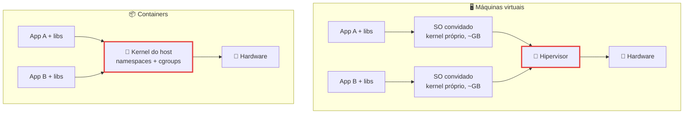
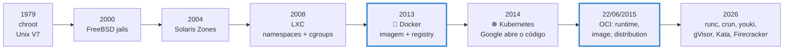
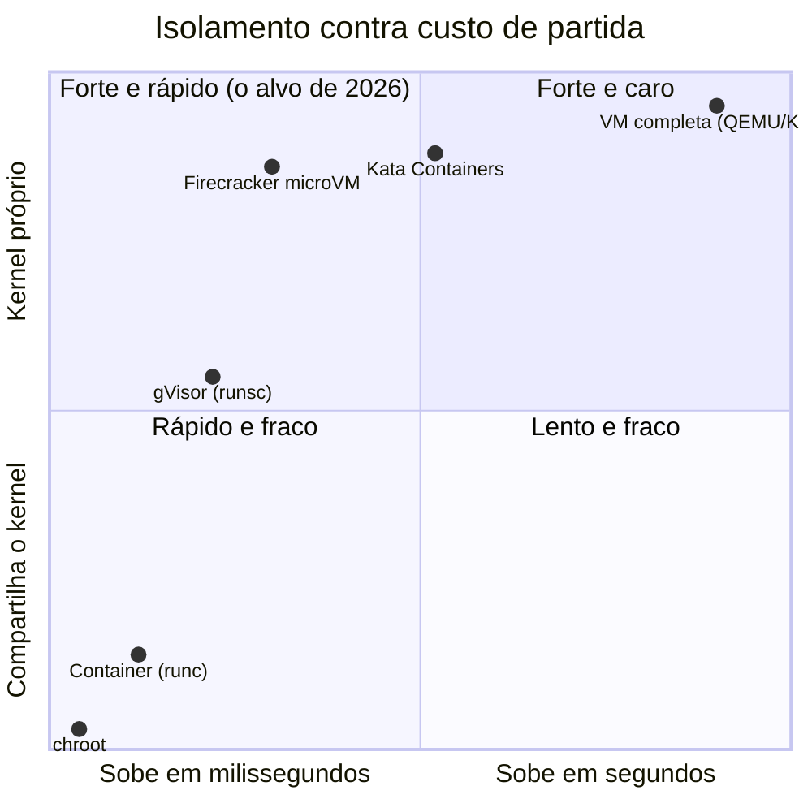

# Containers e Virtualização

> [!quote] Um container é um processo que foi convencido de que a máquina é só dele
> *Docker aparece em 71,1% das respostas do Stack Overflow 2025 (49 mil desenvolvedores, 177 países), 17 pontos a mais que no ano anterior. Mesmo assim quase ninguém sabe dizer o que acontece quando você digita `docker run`. A resposta é decepcionante e libertadora: não acontece quase nada de novo. O kernel cria o mesmo processo de sempre, só que mentindo para ele sobre quem são os vizinhos, quanta memória existe e onde fica a raiz do sistema de arquivos. Nesta aula a gente monta essa mentira à mão, sem Docker e sem `sudo`.*

> [!abstract] 🧭 O que você vai fazer nesta aula
> Ver os 8 namespaces do seu processo, construir um container do zero com `unshare` + `chroot`, limitar CPU e memória com cgroups v2 e provar o kill por OOM lendo `memory.events`, descobrir por que `--cap-drop ALL` **não** impede o `ping`, e montar o sandbox mínimo para rodar um agente de IA sem ele apagar o seu projeto. Pré-requisito: [[Linux na prática]] e o ambiente de [[Laboratório de SO: preparando o ambiente]].

---

## 1. 🧭 O problema e as duas respostas

Seu programa funciona na sua máquina. Ao sair dela aparecem três problemas: **isolamento** (o cliente A não pode ler os dados do cliente B nem derrubar o servidor), **empacotamento** (levar junto a versão exata do Python, da glibc e daquela lib de 2019) e **densidade** (quantas cópias cabem numa máquina antes de ela engasgar).

A indústria deu duas respostas, em camadas diferentes da pilha. Na **máquina virtual**, um programa chamado **hipervisor** (hypervisor) finge ser hardware: cada VM tem kernel próprio, boot próprio, tabela de páginas própria. O hipervisor **tipo 1** roda direto no metal (Xen, Hyper-V, KVM com QEMU); o **tipo 2** roda como aplicativo sobre um SO comum (VirtualBox 7.2.16, ago/2026). Detalhes em [[Estrutura dos Sistemas Operacionais]].

![[Recursos/Sistemas operacionais/Containers e Virtualização/hipervisor-tipo1-tipo2.png|Hipervisor tipo 2 (esquerda, sobre um SO hospedeiro) e tipo 1 (direita, direto sobre o hardware). Cada nuvem é um SO convidado com kernel próprio. Wikimedia Commons, CC0]]

No **container** não há kernel novo. O processo continua sendo um processo do kernel do host; muda só **o que ele vê e quanto pode consumir**.



| Critério | Máquina virtual | Container |
|---|---|---|
| Kernel | um por VM (convidado) | um só, o do host, para todos |
| Partida | segundos a minutos (boot completo) | milissegundos (é um `clone()` com flags) |
| Custo fixo | centenas de MB a GB de RAM por VM; imagem é um disco virtual de GB | o tamanho do processo; imagem de 8 MB (Alpine) a centenas de MB |
| Fronteira de segurança | virtualização por hardware (VT-x, AMD-V) | separação lógica no mesmo kernel |
| Roda outro SO? | sim (Windows sobre Linux) | não: só o que o kernel do host entende |
| Superfície de ataque | interface do hipervisor | syscalls do Linux (mais de 300) |
| Quando usar | multi-inquilino hostil, kernel diferente | microsserviço, CI, laboratório, densidade |

> [!warning] A frase que separa quem entendeu de quem decorou
> "Container é uma VM leve" está **errado**. Se você derruba o kernel de dentro de um container, derruba o host e todos os outros containers junto. Uma VM comprometida, no pior caso, entrega o kernel convidado. Isso não torna o container inútil: torna a escolha do isolamento uma decisão de risco (seção 7).

> [!example] 🧪 Atividade 1: Meça a diferença entre subir um container e subir uma VM
> **Ferramenta:** terminal Linux com Docker (WSL2, VM ou nativo).
>
> 1. `for i in 1 2 3 4 5; do /usr/bin/time -f "%e s" docker run --rm alpine true; done`
> 2. No PowerShell, `wsl --shutdown` e depois `Measure-Command { wsl -e true }`.
> 3. Compare o tamanho: `docker image ls alpine` contra o `.vhdx` ou `.vdi` da sua VM.
>
> **Resultado esperado:** tabela de 3 colunas (tempo de partida, tamanho em disco, kernel próprio sim/não). Na máquina do professor (Ubuntu 22.04, kernel 6.8.0-138, Docker 29.4.0) a imagem `alpine` ocupa 8,44 MB e o container sobe em fração de segundo; a VM do WSL2 leva segundos e reserva memória do Windows.
>
> 🪟 **No Windows:** o passo 1 roda no terminal do Ubuntu do WSL2. 🍎 **No macOS:** o Docker Desktop também roda dentro de uma VM leve, então o passo 1 mede container mais VM.

---

## 2. 🕰️ Do `chroot` (1979) ao Kubernetes

Container não foi inventado em 2013: foi montado peça por peça durante 34 anos.



| Ano | Peça | O que trouxe |
|---|---|---|
| 1979 | `chroot` (Unix V7) | trocar a raiz aparente do sistema de arquivos, e só isso: mesmos processos, mesma rede, mesmos recursos |
| 2000 | FreeBSD jails 4.0 | processos, usuários e rede numa cela (mas fora do Linux) |
| 2004 | Solaris Zones | zonas com limite de recurso e rede virtual (proprietário) |
| 2008 | LXC | juntou namespaces e cgroups do Linux numa ferramenta; faltava distribuir a imagem |
| 2013 | Docker | **imagem em camadas + registry + `docker run`**: virou formato de distribuição |
| 2014 | Kubernetes | orquestrar milhares de containers em muitas máquinas |
| 2015 | OCI (22/06, Docker + CoreOS e outros) | `runtime-spec`, `image-spec` e `distribution-spec`: qualquer runtime serve |

O `chroot` é o exemplo mais claro do que **não** é segurança. A documentação avisa: ele "não foi feito para se defender de adulteração intencional por usuários privilegiados (root)", os contextos "não empilham direito e um programa com privilégio suficiente pode fazer um segundo chroot para escapar" e ele "não foi feito para restringir uso de recursos como E/S, banda, espaço em disco ou tempo de CPU". Cada uma das três frases virou, décadas depois, um mecanismo separado: namespaces, `pivot_root` e cgroups.

---

## 3. 🧱 Os blocos do kernel

Não existe "subsistema de containers" no Linux. Existem mecanismos independentes que, combinados, produzem a ilusão. Docker, Podman, LXC e Kubernetes são só maneiras diferentes de chamá-los.

![[Recursos/Sistemas operacionais/Containers e Virtualização/docker-namespaces-cgroups.png|O Docker não implementa isolamento: ele orquestra recursos que já existem no kernel Linux (cgroups, namespaces, capabilities, SELinux, AppArmor, Netfilter). Wikimedia Commons, domínio público]]

### 3.1 Namespaces: o que o processo enxerga

Um namespace embrulha um recurso global do sistema de modo que quem está dentro vê uma **instância própria** dele. São **8 tipos**, criados por `clone()` ou `unshare()` e entrados com `setns()`:

| Namespace | Efeito visível | Desde |
|---|---|---|
| `pid` | seu processo vira **PID 1** e não vê os do host | 3.8 |
| `mnt` | montar e desmontar sem afetar o host | 3.8 |
| `net` | `eth0` própria, rotas e firewall próprios; a porta 80 dele não é a sua | 3.0 |
| `uts` | `hostname caixa` só muda lá dentro | 3.0 |
| `ipc` | filas, semáforos e memória compartilhada System V separados | 3.0 |
| `user` | ser **root dentro** e usuário comum fora | 3.8 |
| `cgroup` | não enxerga os limites dos vizinhos | 4.6 |
| `time` | fingir outro tempo de boot (`CLOCK_BOOTTIME`) | 5.6 |

O namespace de **usuário** mudou o jogo: dentro dele você é UID 0 com todas as capabilities, mas para o kernel do host continua sendo o UID 1000. É o que permite montar um container **sem `sudo`** (seção 4) e é a base do `bubblewrap`, do Flatpak e dos sandboxes de agente de IA da seção 8.

> [!example] 🧪 Atividade 2: Veja os 8 namespaces e crie os seus
> **Ferramenta:** `unshare` e `lsns` (pacote `util-linux`, já instalado).
>
> 1. `ls -l /proc/self/ns/` e anote o inode do `pid` e do `uts`.
> 2. Sem sudo: `unshare --user --map-root-user --fork --pid --mount-proc sh`
> 3. Lá dentro: `whoami`, `echo $$`, `ps -e`, `cat /proc/self/uid_map`, `ls -l /proc/self/ns/`.
> 4. Compare os inodes com os do passo 1, saia com `exit` e rode `lsns -t pid | head`.
>
> **Resultado esperado:** `whoami` responde `root`, `echo $$` responde `1` e `ps -e` lista dois ou três processos em vez das centenas do host. O `uid_map` mostra `0  1000  1`, que se lê como "o UID 0 aqui dentro é o UID 1000 lá fora, para 1 UID". Os inodes dos namespaces recriados mudam; os que você não pediu continuam iguais.
>
> 🪟 **No Windows:** funciona no WSL2 (kernel Linux real). No PowerShell não há equivalente direto: o Windows isola por *object namespaces* (seção 9).

### 3.2 cgroups v2: quanto o processo pode gastar

**cgroup** (control group) é a contabilidade e o limite. A versão 2, padrão no Ubuntu e no Docker moderno, monta uma hierarquia única em `/sys/fs/cgroup`, onde cada diretório é um grupo e cada arquivo é um botão:

| Arquivo | Para que serve | Exemplo |
|---|---|---|
| `cgroup.subtree_control` | liga controladores para os filhos | `+cpu +memory +pids` |
| `cgroup.procs` | põe um PID no grupo | escrever o PID move o processo |
| `cpu.max` | cota e período em microssegundos | `50000 100000` = meia CPU |
| `cpu.weight` | fatia relativa na disputa (1 a 10000, padrão 100) | ver [[Escalonamento de Processos]] |
| `memory.max` | teto duro: estourou, o OOM killer mata | `209715200` (200 MiB) |
| `memory.high` | teto suave: o kernel joga em *throttle* | pressão antes da morte |
| `memory.events` | histórico: campos `max`, `oom`, `oom_kill` | a certidão de óbito |
| `pids.max` | número máximo de processos | a vacina contra fork bomb |

> [!info] `--cpus 0.5` é só um apelido
> O Docker traduz `--cpus 0.5` para `--cpu-period=100000 --cpu-quota=50000`, que vira a linha `50000 100000` no arquivo `cpu.max` daquele container. Não há mágica no meio: o Docker é um tradutor de flags para arquivos do kernel.

> [!example] 🧪 Atividade 3: Prove que a flag do Docker é um arquivo do kernel, e mate por OOM
> **Ferramenta:** Docker.
>
> 1. `docker run --rm --cpus 0.5 --memory 200m --pids-limit 64 alpine sh -c 'cat /proc/self/cgroup /sys/fs/cgroup/cpu.max /sys/fs/cgroup/memory.max /sys/fs/cgroup/pids.max; nproc'`
> 2. Gere carga: `docker run -d --rm --name carga --cpus 0.5 --memory 200m alpine sh -c 'while :; do :; done'`, veja com `docker stats --no-stream` e encerre com `docker stop carga`.
> 3. Provoque o OOM: `docker run --rm --memory 32m --memory-swap 32m alpine sh -c 'dd if=/dev/zero of=/dev/shm/b bs=1M count=200'` e veja o código com `echo $?`.
> 4. Repita trocando o final por `dd ... 2>/dev/null; cat /sys/fs/cgroup/memory.events`.
>
> **Resultado esperado** (saídas reais): passo 1 devolve `0::/` (o namespace `cgroup` esconde a hierarquia do host: o container acha que está na raiz), `50000 100000`, `209715200`, `64` e `nproc: 12`; passo 2 mostra `carga 50.43% 400KiB / 200MiB`; passo 3 devolve **137** (128 + 9, ou seja `SIGKILL`); passo 4 mostra `max 46`, `oom 1`, `oom_kill 1`.
>
> Repare na armadilha do `nproc: 12`: o container **continua vendo 12 CPUs**, porque nenhum namespace esconde a contagem de núcleos. Ele só não consegue usar mais que meia. É por isso que a JVM antiga e o `multiprocessing` do Python criavam 12 threads dentro de um container de 0,5 CPU e engasgavam.
>
> 🪟 **No Windows:** igual no WSL2. Se os limites forem ignorados, confira a memória atribuída em `%UserProfile%\.wslconfig`.

### 3.3 Capabilities e seccomp: o que ele pode pedir ao kernel

Desde o kernel 2.2 não existe mais "root ou nada": o poder do superusuário foi partido em **41 capabilities** (a última, `CAP_CHECKPOINT_RESTORE`, chegou no 5.9), cada uma um bit em cinco conjuntos (`permitted`, `inheritable`, `effective`, `bounding`, `ambient`). O Docker inicia todo container com um subconjunto restrito; `--cap-drop ALL` zera e `--cap-add` devolve só o necessário.

O `seccomp-bpf` age um nível abaixo: um filtro BPF decide, por número de syscall e valor dos argumentos, se a chamada passa (`ALLOW`), volta erro (`ERRNO`), mata a thread ou o processo (`KILL_THREAD`, `KILL_PROCESS`), só registra (`LOG`) ou vai a um supervisor em espaço de usuário (`USER_NOTIF`). Instalar um filtro exige `no_new_privs`. O perfil padrão do Docker "desabilita cerca de 44 syscalls de mais de 300": pouco em número, muito em efeito, porque é o que impede reprogramar o relógio, carregar módulo de kernel ou montar sistemas de arquivos.

> [!example] 🧪 Atividade 4: Zere as capabilities e caia na armadilha do ping
> **Ferramenta:** Docker.
>
> 1. `docker run --rm alpine grep CapEff /proc/self/status`
> 2. `docker run --rm --cap-drop ALL alpine grep CapEff /proc/self/status`
> 3. Operação que exige `CAP_CHOWN`: `docker run --rm --cap-drop ALL alpine chown nobody /etc/hostname`
> 4. Agora o `ping`, que "todo mundo diz" que precisa de `CAP_NET_RAW`: `docker run --rm --cap-drop ALL alpine ping -c1 8.8.8.8`
> 5. Descubra por que funcionou: `docker run --rm alpine cat /proc/sys/net/ipv4/ping_group_range`
>
> **Resultado esperado:** `CapEff: 00000000a80425fb` no passo 1 e `CapEff: 0000000000000000` no passo 2. O passo 3 falha com `chown: /etc/hostname: Operation not permitted`. O passo 4 **funciona** (medido: `64 bytes from 8.8.8.8: seq=0 ttl=42 time=7.303 ms`) e o passo 5 explica: `ping_group_range` está em `0 2147483647`, então o kernel libera socket ICMP de datagrama para qualquer grupo e o `ping` do BusyBox usa esse caminho, sem socket raw. Roteiro que promete falha e entrega sucesso é a melhor aula do semestre: teste sempre no seu kernel antes de afirmar que algo está bloqueado.
>
> 🪟 **No Windows:** WSL2. O modelo do Windows (privilégios de token e integrity levels) aparece em [[Segurança em Sistemas Operacionais]].

> [!example] 🧪 Atividade 5: Faça o seccomp barrar o seu container aninhado
> **Ferramenta:** Docker.
>
> 1. `docker run --rm alpine unshare -Urpf --mount-proc sh -c 'whoami; ps'`
> 2. Anote a mensagem e o número hexadecimal que aparece nela.
> 3. Repita sem o filtro (só em laboratório): `docker run --rm --security-opt seccomp=unconfined alpine unshare -Urpf --mount-proc sh -c 'whoami; ps'`
>
> **Resultado esperado:** no passo 1, `unshare: unshare(0x30020000): Operation not permitted`. No passo 3 o erro **muda** para `unshare: can't mount none on / (flags:0x44000): Permission denied`. A mudança é a prova: com seccomp, a syscall `unshare` nem chega a executar; sem ele, ela roda e falha depois, por falta de capability. Dois mecanismos, dois erros.
>
> 🪟 **No Windows:** WSL2. O parente conceitual no Windows é a política de bloqueio de syscall dos processos protegidos e o AppContainer.

### 3.4 overlayfs: a imagem em camadas

Se cada container copiasse o rootfs inteiro, 200 containers gastariam 1,6 GB só para existir. O **overlayfs** empilha diretórios:

![[Recursos/Sistemas operacionais/Containers e Virtualização/overlayfs-camadas.png|A camada da imagem é o lowerdir (somente leitura, compartilhada), a camada do container é o upperdir (escrita) e o processo enxerga a união em merged. Documentação oficial do Docker]]

| overlayfs | Docker | Papel |
|---|---|---|
| `lowerdir` | camadas da imagem | somente leitura, **compartilhadas** por todos os containers daquela imagem |
| `upperdir` | camada do container | onde vai parar tudo o que ele escreve |
| `workdir` | (interno) | área de trabalho do kernel, no mesmo filesystem do `upperdir` |
| `merged` | ponto de montagem | a visão unificada que o processo enxerga |

Duas regras explicam quase todo comportamento estranho de imagem Docker. **Copy-up:** na primeira escrita num arquivo que só existe na imagem, o kernel copia o arquivo inteiro do `lowerdir` para o `upperdir` (editar 1 byte de um arquivo de 2 GB custa 2 GB de cópia). **Precedência e whiteouts:** onde os dois têm o mesmo caminho, o `upperdir` vence e esconde o de baixo; apagar um arquivo da imagem só cria um marcador (*whiteout*). Montado na mão é uma linha: `mount -t overlay overlay -olowerdir=/lower,upperdir=/upper,workdir=/work /merged` (com várias camadas, `lowerdir=/l1:/l2:/l3`, a mais à direita é a base).

> [!example] 🧪 Atividade 6: Inspecione as camadas e prove que apagar em Dockerfile não apaga nada
> **Ferramenta:** Docker, numa pasta vazia.
>
> 1. Veja que a imagem é um tarball de rootfs, a mesma ideia do `chroot` de 1979: `docker history alpine --format "table {{.CreatedBy}}\t{{.Size}}"` e `docker image inspect alpine python:3.11-slim --format "{{.RepoTags}} {{len .RootFS.Layers}} camada(s), driver {{.GraphDriver.Name}}"`
> 2. Crie um `Dockerfile` com três linhas: `FROM alpine`, `RUN echo "senha-do-banco-123" > /segredo.txt`, `RUN rm /segredo.txt`.
> 3. `docker build -t vazamento .` e confirme que sumiu: `docker run --rm vazamento ls /segredo.txt`
> 4. Extraia as camadas e procure: `docker save vazamento -o v.tar && mkdir -p x && tar -xf v.tar -C x && grep -rl "senha-do-banco" x/`
>
> **Resultado esperado:** no passo 1 aparece `ADD alpine-minirootfs-3.23.3-x86_64.tar.gz /` com 8.44MB (saída real), `alpine` com 1 camada, `python:3.11-slim` com 4, driver `overlay2`. O passo 3 diz que o arquivo não existe, mas o passo 4 **encontra** a string dentro de uma camada. Lição para a vida: segredo nunca entra em camada de imagem; use variável de ambiente, `--secret` do BuildKit ou um cofre.
>
> 🪟 **No Windows:** igual no WSL2. No PowerShell, a busca vira `Select-String -Path x\**\* -Pattern "senha-do-banco"`.

---

## 4. 🛠️ Container na mão, sem instalar nada

Agora a parte boa: montar um container com o que já está no seu Ubuntu, **sem `sudo`**.

**Passo 1, arrumar um rootfs.** Um "sistema de arquivos raiz" é só uma pasta com `/bin`, `/etc`, `/lib`:

```bash
mkdir -p ~/meu-container/rootfs && cd ~/meu-container

# opção A: exportar de uma imagem Docker (o container criado nunca chega a rodar)
CID=$(docker create alpine)
docker export "$CID" | tar -C rootfs -xf -
docker rm "$CID"

# opção B, sem Docker: baixar o minirootfs oficial do Alpine (~3,5 MB) de
# dl-cdn.alpinelinux.org/alpine/v3.23/releases/x86_64/ e extrair com tar -C rootfs -xzf
```

Na máquina do professor isso produziu `bin dev etc home lib media mnt opt proc root run sbin srv sys tmp usr var`, ocupando **8,7 MB**.

**Passo 2, criar os namespaces e trocar a raiz:**

```bash
unshare --user --map-root-user --fork --pid --mount --uts --ipc \
  /usr/sbin/chroot rootfs /bin/sh
```

Lá dentro, monte o `/proc` do container, batize a máquina e olhe em volta:

```sh
mount -t proc proc /proc
hostname meu-container
hostname ; id -u ; ps -ef
```

Saída real (usuário comum, nenhum `sudo` em lugar nenhum):

```
meu-container
0
PID   USER     TIME  COMMAND
    1 root      0:00 /bin/sh
    7 root      0:00 ps -ef
```

Pronto: `--user --map-root-user` deu o UID 0 de mentira, `--pid` fez o shell virar PID 1, `--mount` isolou as montagens, `--uts` liberou o `hostname`, o `chroot` trocou a raiz.

**Passo 3, cortar a rede.** Acrescente `--net` ao `unshare`. O namespace de rede nasce vazio: só a interface `lo` desligada, e `ping -c1 1.1.1.1` responde `ping: sendto: Network unreachable`. Dar rede a ele (veth, bridge, NAT) é o trabalho que o Docker faz por você, e que você estuda em [[Tópicos/Fundamentos da computação/Redes de Computadores|Redes de Computadores (Fundamentos)]].

**Passo 4, `pivot_root` em vez de `chroot`.** O `chroot` só muda o ponteiro de raiz; a raiz antiga continua montada e alcançável por quem tiver privilégio. Runtimes de verdade usam `pivot_root(2)`, que troca a **montagem** raiz e permite desmontar a antiga. O padrão documentado no man page, sem diretório temporário, é `chdir(new_root); pivot_root(".", "."); umount2(".", MNT_DETACH);`.

> [!example] 🧪 Atividade 7: Construa o seu container e prove os quatro isolamentos
> **Ferramenta:** `unshare`, `chroot`, `tar` (já instalados); Docker só para exportar o rootfs.
>
> 1. Monte o rootfs e entre no container (passos 1 e 2 acima).
> 2. **PID:** `ps -ef` dentro contra `ps -ef | wc -l` fora, no mesmo instante.
> 3. **UTS:** `hostname caixa` dentro, e confira que o hostname do host não mudou.
> 4. **User:** dentro, `id -u` dá 0; fora, `ps -o user,pid,comm -C sh` mostra o processo pertencendo ao seu usuário comum.
> 5. **Rede:** repita com `--net` e capture a mensagem do `ping`.
> 6. Liste as 3 coisas que o seu container **ainda não** isola (dica: limites de recurso, syscalls e relógio).
>
> **Resultado esperado:** um `evidencias.txt` com as 4 saídas lado a lado (dentro e fora) e as 3 lacunas identificadas. É o esqueleto do trabalho T2 de [[Trabalhos e Projetos de Sistemas Operacionais]].
>
> 🪟 **No Windows:** funciona no WSL2 com Ubuntu 24.04. Se `unshare --user` falhar com `Operation not permitted`, o kernel está com user namespace sem privilégio desabilitado: verifique `sysctl kernel.unprivileged_userns_clone` e, no Ubuntu 24.04+, o perfil AppArmor. Alternativa sem instalar nada: [Killercoda](https://killercoda.com/playgrounds/scenario/ubuntu) no navegador.

> [!example] 🧪 Atividade 8: Crie um cgroup na mão e amarre o seu container nele
> **Ferramenta:** `/sys/fs/cgroup` (com `sudo`).
>
> 1. Confirme a versão: `stat -fc %T /sys/fs/cgroup` deve dizer `cgroup2fs`.
> 2. Ligue os controladores e crie o grupo:
>    ```bash
>    echo "+cpu +memory +pids" | sudo tee /sys/fs/cgroup/cgroup.subtree_control
>    sudo mkdir /sys/fs/cgroup/aula
>    echo "50000 100000" | sudo tee /sys/fs/cgroup/aula/cpu.max
>    echo 104857600      | sudo tee /sys/fs/cgroup/aula/memory.max
>    echo 20             | sudo tee /sys/fs/cgroup/aula/pids.max
>    ```
> 3. Ache o PID do container da Atividade 7 (`pgrep -f "chroot rootfs"`) e mova-o: `echo <PID> | sudo tee /sys/fs/cgroup/aula/cgroup.procs`
> 4. Dentro do container rode `while :; do :; done &` e, no host, acompanhe com `systemd-cgtop -1 -n 5` e `cat /sys/fs/cgroup/aula/cpu.stat`.
> 5. Teste o `pids.max` com uma fork bomb dentro do container e confirme que a máquina **não** cai. Limpe com `sudo rmdir /sys/fs/cgroup/aula`.
>
> **Resultado esperado:** o consumo trava em cerca de 50% de um núcleo e `throttled_usec` cresce em `cpu.stat`. A fork bomb morre em 20 processos com `can't fork`. Sem sudo, o equivalente é `systemd-run --user --scope -p MemoryMax=100M -p CPUQuota=50% comando` (ver `systemd-run(1)` e `systemd.resource-control(5)`).
>
> 🪟 **No Windows:** o WSL2 tem cgroups v2 nas versões recentes; se `/sys/fs/cgroup` não for `cgroup2fs`, habilite `systemd=true` em `/etc/wsl.conf` e rode `wsl --shutdown`.

---

## 5. 🐳 Do artesanal ao Docker

Depois de fazer na mão, o Docker vira uma tabela de tradução. Instalação e comandos do dia a dia estão em [[Docker - gerenciamento de containers]]; aqui interessa **qual mecanismo do SO cada flag aciona**.

| O que você fez na mão | Flag do Docker | Mecanismo do kernel |
|---|---|---|
| `unshare --pid --uts --ipc --mount` | (padrão, sempre) | namespaces |
| `unshare --net` | `--network none` | namespace de rede |
| `chroot` ou `pivot_root` sobre o rootfs | a imagem | overlayfs + `pivot_root` |
| `echo "50000 100000" > cpu.max` | `--cpus 0.5` | cgroups v2 (`cpu.max`) |
| `echo 104857600 > memory.max` | `--memory 100m` | cgroups v2 (`memory.max`) |
| `echo 20 > pids.max` | `--pids-limit 20` | cgroups v2 (`pids.max`) |
| (não fez) | `--cap-drop ALL` | capabilities |
| (não fez) | `--security-opt seccomp=perfil.json` | seccomp-bpf |
| (não fez) | `--read-only` | montagem somente leitura do rootfs |

Os runtimes que fazem isso em produção são intercambiáveis porque seguem a `runtime-spec` da OCI: **runc** (Go, padrão do Docker), **crun** (C: 100 containers em 1,69 s contra 3,34 s do runc) e **youki** (Rust, sandbox da CNCF: criar e apagar em 111,5 ms contra 224,6 ms do runc e 47,3 ms do crun).

> [!tip] Receita de container endurecido
> ```bash
> docker run --rm --read-only --cap-drop ALL \
>   --security-opt no-new-privileges \
>   --user 1000:1000 --pids-limit 64 \
>   --memory 512m --cpus 1 --network none \
>   --tmpfs /tmp:rw,noexec,nosuid,size=64m minha-imagem
> ```
> Cada linha fecha uma porta: filesystem somente leitura, zero capabilities, proibição de ganhar privilégio por setuid, usuário não-root, teto de processos, teto de CPU e memória, nenhuma rede. No Compose os mesmos controles são `read_only`, `cap_drop`, `security_opt`, `user`, `pids_limit` e `deploy.resources.limits`.

> [!example] 🧪 Atividade 9: Endureça um container e colecione as mensagens de erro
> **Ferramenta:** Docker.
>
> 1. `docker run --rm --read-only alpine sh -c 'touch /tmp/x'`
> 2. `docker run --rm --cap-drop ALL alpine chown nobody /etc/hostname`
> 3. `docker run --rm --user 1000:1000 alpine sh -c 'id; touch /etc/foo'`
> 4. `docker run --rm --network none alpine ping -c1 -W2 1.1.1.1`
> 5. Monte a tabela "flag, ação tentada, mensagem exata, mecanismo que barrou".
>
> **Resultado esperado:** as mensagens medidas foram, em ordem, `touch: /tmp/x: Read-only file system`; `chown: /etc/hostname: Operation not permitted`; `uid=1000 gid=1000 groups=1000` seguido de `touch: /etc/foo: Permission denied`; e falha de rede no passo 4. Repare que os passos 2 e 3 dão erros **diferentes** para operações parecidas: um é capability, o outro é permissão de arquivo Unix comum.
>
> 🪟 **No Windows:** idêntico no Docker Desktop com WSL2.

---

## 6. ☸️ Orquestração, em uma seção só

Uma máquina com 40 containers ainda é administrável na mão; mil containers em 50 máquinas, não. O **Kubernetes** (aberto pelo Google em 2014, versão 1.37.0 em 26/08/2026) é o sistema operacional do data center: você declara o estado desejado e ele persegue esse estado.

| Conceito | Tradução para SO |
|---|---|
| **Pod** | um ou mais containers compartilhando namespaces de rede e IPC (por isso conversam por `localhost`) |
| **`requests`** | o que o `kube-scheduler` usa para escolher a máquina, e o mínimo reservado pelo kubelet |
| **`limits`** | o teto que o kubelet grava no cgroup: CPU vira *throttling*, memória vira OOM kill |
| **Node** | uma máquina rodando kubelet + runtime OCI (containerd + runc) |

A documentação oficial é explícita: limites de `cpu` "são aplicados por throttling de CPU" e "o kernel restringe o acesso à CPU correspondente ao limite do container"; limites de `memory` "são aplicados pelo kernel com mortes por falta de memória (OOM)". Ou seja, o YAML mais sofisticado do mundo termina escrevendo `cpu.max` e `memory.max` num arquivo de `/sys/fs/cgroup`. Quem fez a Atividade 3 sabe ler um incidente de produção, e é por isso que **SRE**, **DevOps** e **Platform Engineer** são vagas de sistema operacional disfarçadas (Kubernetes aparece em 28,5% das respostas do Stack Overflow 2025).

> [!example] 🧪 Atividade 10: Traduza um manifesto do Kubernetes para arquivos do kernel
> **Ferramenta:** Docker.
>
> 1. Dado `limits: {cpu: "500m", memory: "256Mi"}`, escreva o `docker run` equivalente (dica: `500m` é meio núcleo, `256Mi` são 268435456 bytes).
> 2. Rode o seu comando com `sh -c 'cat /sys/fs/cgroup/cpu.max /sys/fs/cgroup/memory.max'` e compare com o que previu.
> 3. Responda por escrito: o que acontece com o Pod se passar do `limits.memory`? E do `limits.cpu`?
>
> **Resultado esperado:** `docker run --rm --cpus 0.5 --memory 256m alpine ...` produzindo `50000 100000` e `268435456`. Estourar memória mata o container (`OOMKilled`, código 137); estourar CPU não mata nada, só deixa lento (throttling).
>
> 🪟 **No Windows:** o `minikube` roda sobre o Docker Desktop com WSL2, e o `kubectl describe pod` mostra o motivo `OOMKilled` do mesmo jeito.

---

## 7. 🔒 Quando o container não basta: isolamento forte

O container compartilha o kernel. Se você vai rodar **código de terceiros que não confia** (o job de um aluno, o código gerado por um agente de IA, a função de um cliente), a superfície de ataque é a interface inteira de syscalls do Linux. Três respostas da indústria:

![[Recursos/Sistemas operacionais/Containers e Virtualização/gvisor-sentry-gofer.png|No gVisor o Sentry implementa em espaço de usuário as syscalls que a aplicação faz, e o Gofer intermedeia o acesso a arquivos: a aplicação quase não toca o kernel do host. Documentação oficial do gVisor]]

| Abordagem | Como funciona | Custo | Onde é usado |
|---|---|---|---|
| **Container** (runc) | namespaces + cgroups + seccomp | quase zero | 99% dos casos |
| **gVisor** (`runsc`) | o **Sentry** (Go) é um "kernel de aplicação" que implementa a interface Linux em espaço de usuário; o **Gofer** intermedeia arquivos por 9P | syscalls mais caras | Google Cloud Run, App Engine |
| **Kata Containers** | "máquinas virtuais leves que se encaixam no ecossistema de containers": cada container numa VM (QEMU, Cloud Hypervisor ou Firecracker) | boot de VM, memória extra | nuvens multi-inquilino |
| **Firecracker** | microVM em Rust sobre KVM: até 125 ms até o `/sbin/init`, menos de 5 MiB por microVM, mais de 95% do desempenho de CPU do metal; o `jailer` aplica cgroups e namespaces e derruba privilégios | precisa de KVM | AWS Lambda e Fargate, E2B |

![[Recursos/Sistemas operacionais/Containers e Virtualização/firecracker-arquitetura.png|Cada microVM do Firecracker é um processo do host falando com o KVM, com dispositivo de bloco próprio e uma bridge de rede. Repositório oficial do Firecracker]]



O **WSL2** entra nessa conversa por um detalhe que quase ninguém nota: ele "roda um kernel Linux dentro de uma máquina virtual utilitária leve", construído pela Microsoft a partir do ramo estável e atualizado pelo Windows Update. Quando você usa Docker Desktop no Windows, seus containers não estão isolados só por namespaces: estão dentro de uma VM Hyper-V. Você ganhou uma camada de graça.

---

## 8. 🤖 Containers na era da IA

### 8.1 A GPU como recurso do container

Por padrão o container **não** enxerga a sua GPU: `/dev/nvidia*` não está no espaço de dispositivos dele. Quem resolve é o **NVIDIA Container Toolkit**, com um desenho elegante: o **driver continua no host** e o toolkit **injeta**, na criação do container, as bibliotecas de usuário e os *device nodes* corretos, por um hook `prestart` do runc (empacotado no `nvidia-container-runtime`) ou pelo padrão CDI via `nvidia-ctk`.

```bash
sudo nvidia-ctk runtime configure --runtime=docker && sudo systemctl restart docker
docker run --rm --gpus all nvidia/cuda:12.4.0-base-ubuntu22.04 nvidia-smi
```

No Kubernetes o mesmo recurso vira um número: o *device plugin* da NVIDIA anuncia `nvidia.com/gpu` e o Pod pede `limits: {nvidia.com/gpu: 1}`. Uma H100 pode ser fatiada em até 7 instâncias isoladas com MIG (`nvidia.com/mig-1g.5gb`) e, desde a versão 1.35, o Kubernetes tem **DRA** (Dynamic Resource Allocation) estável, com `ResourceClaim`, `DeviceClass` e `ResourceSlice`, tratando aceleradores como recurso de primeira classe. Aprofundamento em [[Sistemas Operacionais na Era da IA]].

> [!example] 🧪 Atividade 11 (opcional, quem tem GPU NVIDIA): Prove que a GPU não entra sozinha
> **Ferramenta:** máquina com GPU NVIDIA e driver instalado.
>
> 1. No host: `nvidia-smi -L` (na máquina do professor: `GPU 0: NVIDIA GeForce RTX 2060`).
> 2. Container comum: `docker run --rm ubuntu:24.04 sh -c 'ls /dev/nvidia* 2>&1; nvidia-smi 2>&1 | head -2'`
> 3. Com o toolkit: `docker run --rm --gpus all ubuntu:24.04 sh -c 'ls /dev/nvidia*; ls /usr/lib/x86_64-linux-gnu | grep -c nvidia; nvidia-smi'`
>
> **Resultado esperado:** no passo 2 não existe `/dev/nvidia0` nem o `nvidia-smi`; no passo 3 aparecem os device nodes, dezenas de bibliotecas injetadas e a tabela da GPU. "Dar GPU ao container" é o SO injetando dispositivos e bibliotecas, não virtualizar hardware. Sem GPU, faça em dupla. 🪟 **No Windows:** funciona no WSL2 com o driver NVIDIA para WSL instalado no **Windows** (não instale driver Linux dentro do WSL).

### 8.2 Sandbox de agente de IA

Um agente de programação recebe uma tarefa em texto e executa comandos na sua máquina. Duas ameaças aparecem juntas: erro do modelo e **prompt injection** (uma instrução escondida num arquivo, num issue do GitHub ou numa página web faz o agente rodar o que você não pediu). A engenharia da Anthropic é direta: "sandbox eficaz exige isolamento de sistema de arquivos **e** de rede", e o sandbox reduziu em 84% os pedidos de permissão ao usuário. Repare que **todo sandbox de agente é feito com as peças desta aula**:

| Sandbox | Filesystem | Rede | Mecanismo do SO |
|---|---|---|---|
| **Claude Code** (`/sandbox`) | escreve só no diretório de trabalho e no temp; não lê `~/.ssh` nem `~/.aws/credentials` | proxy com allowlist, nenhum domínio liberado por padrão | `bubblewrap` + `socat` (Linux e WSL2), Seatbelt (macOS), seccomp opcional |
| **sandbox-runtime** (`srt`) | `allowRead`, `denyRead`, `allowWrite`, `denyWrite` | proxies HTTP e SOCKS5 só com allowlist | bubblewrap + seccomp BPF + namespace de rede |
| **OpenAI Codex** | `read-only`, `workspace-write` (padrão), `danger-full-access` | desligada por padrão em `workspace-write` | `bwrap` + seccomp (Linux e WSL2), Seatbelt (macOS) |
| **Gemini CLI** | volume do projeto | conforme o container | `GEMINI_SANDBOX` = `docker`, `podman`, `sandbox-exec`, `runsc` ou `lxc` |
| **OpenHands** | `SANDBOX_VOLUMES` (montou com escrita, o agente altera) | do container | Docker, o padrão recomendado |
| **E2B** | sandbox efêmero na nuvem | do provedor | **Firecracker** microVM |
| **Docker Sandboxes** (`sbx`) | passthrough de filesystem | proxy com políticas | isolamento "Full (hypervisor)", daemon próprio |

Duas limitações declaradas pela própria documentação: montar `/var/run/docker.sock` dentro do sandbox "na prática concede acesso ao host" (quem fala com o daemon manda na máquina), e o proxy não inspeciona TLS, o que abre espaço para *domain fronting*. Sandbox não é botão: é modelo de ameaça.

> [!example] 🧪 Atividade 12: Coloque um agente de IA numa caixa e prove 5 bloqueios
> **Ferramenta:** Docker.
>
> 1. `mkdir -p ~/lab-agente/projeto && echo oi > ~/lab-agente/projeto/a.txt`
> 2. Suba a caixa:
>    ```bash
>    docker run --rm -it --network none --read-only --cap-drop ALL \
>      --security-opt no-new-privileges --user 1000:1000 \
>      --pids-limit 64 --memory 512m --cpus 1 \
>      -v ~/lab-agente/projeto:/projeto:rw \
>      --tmpfs /tmp:rw,noexec,nosuid,size=32m alpine sh
>    ```
> 3. Tente as 5 ações proibidas e **anote a mensagem exata**: ler `/root/.ssh/id_rsa`; escrever em `/etc/passwd`; escrever fora do projeto (`touch /opt/x`); acessar a internet (`wget -T3 https://example.com`); e uma fork bomb. Ao lado de cada erro escreva **qual mecanismo** barrou: permissão de arquivo, `--read-only`, capabilities, namespace de rede ou `pids.max`.
> 4. Repita sem as flags de proteção e conte quantas das 5 passam.
>
> **Resultado esperado:** uma matriz 5x3 (ação, erro exato, mecanismo). Escrever em `/projeto` deve continuar funcionando: sandbox que impede o trabalho não é usado por ninguém. Essa matriz é a entrega central do trabalho T7 de [[Trabalhos e Projetos de Sistemas Operacionais]].
>
> 🪟 **No Windows:** roda igual no Docker Desktop. Para o sandbox nativo do agente, o Claude Code exige WSL2 (`sudo apt-get install bubblewrap socat`); Windows nativo não é suportado.

---

## 9. 🪟 E no Windows?

O Windows tem containers de verdade, e a comparação mostra que os conceitos são do problema, não do Linux.

![[Recursos/Sistemas operacionais/Containers e Virtualização/windows-hyperv-isolation.png|Os dois modos de isolamento no Windows: à esquerda o isolamento por processo (kernel compartilhado, como no Linux) e à direita o isolamento Hyper-V, em que cada container ganha uma VM otimizada com kernel próprio. Documentação oficial da Microsoft]]

| Recurso | O que é | Detalhe |
|---|---|---|
| **Isolamento por processo** | mesmo kernel, isolado por *object namespaces*: filesystem, registro, portas, IDs de processo e thread, Object Manager | "aproximadamente o mesmo jeito que os containers Linux rodam" |
| **Isolamento Hyper-V** | cada container numa VM altamente otimizada, com kernel próprio | `docker run -it --isolation=hyperv mcr.microsoft.com/windows/servercore:ltsc2019 cmd` |
| **Docker Desktop** | o daemon roda dentro da VM do WSL2 | seus containers Linux no Windows já estão numa VM |
| **Windows Sandbox** | desktop descartável com virtualização por hipervisor | Pro, Enterprise e Education (não existe no Home); fechou, apagou tudo; **rede ligada por padrão** |
| **WSL Containers e MXC** | preview no Build 2026 (2 a 5/06/2026): Microsoft Execution Containers com níveis processo, sessão, micro-VM e Linux/WSL | infraestrutura pensada para agentes de IA |

O padrão muda com a edição: no Windows Server, containers usam isolamento por processo; no Windows 10 e 11 Pro e Enterprise, o padrão é Hyper-V.

> [!example] 🧪 Atividade 13: Veja o processo do container aparecer (e sumir) do host Windows
> **Ferramenta:** Windows Pro ou Enterprise.
>
> **Parte A, Windows Sandbox:** habilite **Windows Sandbox** em "Ativar ou desativar recursos do Windows", reinicie, abra o Sandbox, crie um arquivo na área de trabalho dele, feche e reabra. No Gerenciador de Tarefas do host, anote a memória do processo `vmmem` ou `vmmemWSL`.
>
> **Parte B, containers Windows:** rode `docker run -d mcr.microsoft.com/windows/servercore:ltsc2019 ping localhost -t`, depois `docker top <id>` e `Get-Process -Name ping` no PowerShell do host. Repita com `--isolation=hyperv` e rode `Get-Process -Name ping` e `Get-Process -Name vmwp`.
>
> **Resultado esperado:** o arquivo do Sandbox **sumiu** (tudo é descartado ao fechar). Na parte B, com isolamento por processo o **mesmo PID** aparece no host e dentro do container; com isolamento Hyper-V o `ping` não é encontrado no host e no lugar dele aparece o processo `vmwp`, a VM que encapsula o container. É a demonstração mais limpa que existe da diferença entre compartilhar e não compartilhar kernel.
>
> 🐧 **No Linux:** o equivalente da parte B é `docker run -d --name t alpine sleep 300`, depois `docker top t` e `pgrep -a sleep` no host: o mesmo processo aparece nos dois, com **PIDs diferentes** (namespace de PID).

---

## ❓ Quiz rápido

> [!question]- 1. Um processo em container com `--cpus 0.5` executa `nproc` e recebe `12`. Isso é bug do Docker?
> **Resposta:** não. Nenhum namespace virtualiza a contagem de CPUs: o `nproc` lê a informação do kernel do host. O limite vive no `cpu.max` do cgroup e age por *throttling*, sem esconder núcleos. Por isso a JVM antiga e o `multiprocessing` precisam ser ensinados a ler o cgroup, e não o `nproc`.

> [!question]- 2. O que realmente acontece ao rodar `docker run alpine`?
> **Resposta:** o kernel do host cria um processo comum com `clone()` usando flags de namespace, aplica limites de cgroup, monta um overlayfs com as camadas da imagem, troca a raiz com `pivot_root`, remove capabilities e instala um filtro seccomp. Nenhum kernel novo é iniciado, nenhum hardware é virtualizado, nenhum boot acontece.

> [!question]- 3. Você escreveu `RUN echo "senha" > /s.txt` seguido de `RUN rm /s.txt`. A senha está segura na imagem publicada?
> **Resposta:** não. O overlayfs empilha camadas: o `rm` só cria um *whiteout* que **esconde** o arquivo, sem apagar a camada de baixo. Quem baixar a imagem e extrair as camadas (`docker save` + `tar`) encontra a senha. Segredo se passa por variável de ambiente, `--secret` do BuildKit ou cofre externo.

> [!question]- 4. Container e VM: qual afirmação está correta?
> **Resposta:** a VM dá fronteira de segurança por hardware (VT-x, AMD-V) e roda um SO diferente do host, ao custo de boot completo e centenas de MB por instância; o container compartilha o kernel, sobe em milissegundos e só roda o que aquele kernel entende. Uma falha no kernel do host afeta **todos** os containers ao mesmo tempo, e é esse risco que gVisor, Kata e Firecracker atacam.

> [!question]- 5. Por que os sandboxes de agente de IA isolam sistema de arquivos **e** rede ao mesmo tempo?
> **Resposta:** porque as duas metades se anulam. Um agente que não pode escrever fora do projeto mas tem rede livre consegue **exfiltrar** o que leu (chaves, código, credenciais); e um agente sem rede mas com escrita livre pode plantar um `.git/hooks/pre-commit` ou alterar um `.mcp.json` para executar código depois. A documentação da Anthropic é explícita: "sandbox eficaz exige isolamento de sistema de arquivos e de rede".

---

## 🔗 Veja também

- [[Docker - gerenciamento de containers]]: instalação, Dockerfile, Compose e o dia a dia da ferramenta. Esta aula é o "por baixo do capô" daquela.
- [[Estrutura dos Sistemas Operacionais]]: hipervisores tipo 1 e 2, microkernels e onde a virtualização se encaixa.
- [[Escalonamento de Processos]] e [[Gerenciamento de Memória]]: `cpu.max` e o OOM killer do outro lado do balcão.
- [[Chamadas de Sistema]]: o seccomp filtra exatamente a interface que você estudou ali.
- [[Tópicos/Redes de Computadores/DevOps|DevOps]] e [[Computação em nuvem]]: onde esses conceitos viram vaga de emprego.
- [[Sistemas Operacionais na Era da IA]]: GPU como recurso gerenciado, MIG, DRA e servidores de inferência.
- ➡️ **Próxima aula:** [[Segurança em Sistemas Operacionais]]

---

> [!note] 📚 Fontes (2026)
> - Kernel: [namespaces(7)](https://man7.org/linux/man-pages/man7/namespaces.7.html), [unshare(1)](https://manpages.ubuntu.com/manpages/noble/en/man1/unshare.1.html), [pivot_root(2)](https://man7.org/linux/man-pages/man2/pivot_root.2.html), [capabilities(7)](https://man7.org/linux/man-pages/man7/capabilities.7.html), [cgroup v2](https://docs.kernel.org/admin-guide/cgroup-v2.html), [OverlayFS](https://docs.kernel.org/filesystems/overlayfs.html), [Seccomp BPF](https://docs.kernel.org/userspace-api/seccomp_filter.html), [systemd-cgtop(1)](https://man7.org/linux/man-pages/man1/systemd-cgtop.1.html)
> - Docker: [restrições de recursos](https://docs.docker.com/engine/containers/resource_constraints/), [docker run](https://docs.docker.com/reference/cli/docker/container/run/), [docker stats](https://docs.docker.com/reference/cli/docker/container/stats/), [segurança](https://docs.docker.com/engine/security/), [seccomp padrão](https://docs.docker.com/engine/security/seccomp/), [driver overlayfs](https://docs.docker.com/engine/storage/drivers/overlayfs-driver/)
> - Runtimes e isolamento: [runc](https://github.com/opencontainers/runc), [crun](https://github.com/containers/crun), [youki](https://github.com/youki-dev/youki), [OCI](https://opencontainers.org/about/overview/), [gVisor](https://gvisor.dev/docs/), [Kata](https://katacontainers.io/), [Firecracker](https://github.com/firecracker-microvm/firecracker/blob/main/docs/design.md), [bubblewrap](https://github.com/containers/bubblewrap)
> - Kubernetes e GPU: [recursos de containers](https://kubernetes.io/docs/concepts/configuration/manage-resources-containers/), [releases](https://kubernetes.io/releases/), [DRA](https://kubernetes.io/docs/concepts/scheduling-eviction/dynamic-resource-allocation/), [NVIDIA Container Toolkit](https://docs.nvidia.com/datacenter/cloud-native/container-toolkit/latest/arch-overview.html), [k8s-device-plugin](https://github.com/NVIDIA/k8s-device-plugin)
> - Sandboxes de agente: [Anthropic (engenharia)](https://www.anthropic.com/engineering/claude-code-sandboxing), [Claude Code sandboxing](https://code.claude.com/docs/en/sandboxing), [sandbox-runtime](https://github.com/anthropic-experimental/sandbox-runtime), [Codex](https://learn.chatgpt.com/docs/agent-approvals-security), [Gemini CLI](https://raw.githubusercontent.com/google-gemini/gemini-cli/main/docs/cli/sandbox.md), [OpenHands](https://docs.openhands.dev/usage/runtimes/docker), [Docker Sandboxes](https://docs.docker.com/ai/sandboxes/), [E2B](https://docs.e2b.dev/)
> - Windows: [modos de isolamento](https://learn.microsoft.com/en-us/virtualization/windowscontainers/manage-containers/hyperv-container), [Windows Sandbox](https://learn.microsoft.com/en-us/windows/security/application-security/application-isolation/windows-sandbox/), [WSL: versões](https://learn.microsoft.com/en-us/windows/wsl/compare-versions), [Build 2026](https://developer.microsoft.com/blog/build-recap/)
> - História e mercado: [chroot](https://en.wikipedia.org/wiki/Chroot) e [virtualização em nível de SO](https://en.wikipedia.org/wiki/OS-level_virtualization) (Wikipedia), [Stack Overflow Survey 2025](https://survey.stackoverflow.co/2025/technology)
> - Saídas marcadas como reais foram executadas em 03/09/2026 em Ubuntu 22.04 (kernel 6.8.0-xx-generic), Docker 29.4.0, runc 1.3.4, cgroups v2, GPU NVIDIA RTX 2060.
> - Imagens: [Hyperviseur.png (Wikimedia Commons, CC0)](https://commons.wikimedia.org/wiki/File:Hyperviseur.png); [Docker-linux-interfaces.svg (Wikimedia Commons, domínio público)](https://commons.wikimedia.org/wiki/File:Docker-linux-interfaces.svg); overlayfs (Docker docs), Sentry e Gofer (gVisor docs), integração com o host (Firecracker docs) e isolamento Hyper-V (Microsoft Learn), todos linkados acima.
