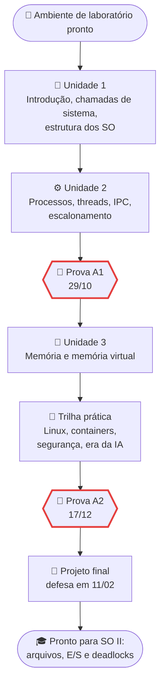

# Cronograma da disciplina

> [!quote] Um semestre, um kernel de verdade
> *Cada quinta-feira você observa uma parte do sistema operacional funcionando na sua própria máquina. No fim do semestre você terá construído um shell, medido um LLM na memória, limitado um serviço com cgroups e colocado um agente de IA dentro de uma caixa.*

> [!info] Como usar esta página
> - **Antes da aula:** leia a página do encontro e deixe o [[Laboratório de SO - preparando o ambiente|ambiente de laboratório]] funcionando.
> - **Na aula:** fazemos as atividades 🧪 da página juntos. Traga o notebook.
> - **Depois da aula:** os trabalhos ficam em [[Trabalhos e Projetos de Sistemas Operacionais]] e as datas aqui. O que foi dado em cada aula fica registrado no [[SO I 7Eng 2026-2|log da turma]].
> - Datas podem mudar por evento do campus ou feriado. A versão desta página é sempre a que vale.

---

## 📅 Encontros de 2026.2 (quintas, 12:50 às 15:40)

| # | Data | Aula | O que fazemos em sala | Entregas e avisos |
|---|------|------|-----------------------|-------------------|
| 1 | 27/08 | Apresentação da disciplina | Regras, site, metodologia, ferramentas | Criar conta no GitHub; instalar WSL2 ou VM |
| 2 | 03/09 | [[Introdução aos Sistemas Operacionais]] + [[Laboratório de SO - preparando o ambiente]] | Primeiro contato com o kernel: `uname`, `htop`, `/proc`, `nvidia-smi` | Ambiente pronto (print de `uname -a` e `htop`) |
| 3 | 10/09 | [[Chamadas de Sistema]] | `strace` em programas reais; syscalls de processo e de arquivo | |
| 4 | 17/09 | [[Estrutura dos Sistemas Operacionais]] | Módulos do kernel, WSL2 por dentro, VM × container | **T1 lançado** |
| 5 | 24/09 | [[Processos]] | `fork`/`exec`/`wait` em Python e C, zumbis, sinais | Semana da Mostra do Conhecimento: confirmar a aula |
| 6 | 01/10 | [[Threads]] | GIL × free-threading, `asyncio`, medições | **T1: entrega** |
| 7 | 08/10 | [[Comunicação entre Processos]] | Condição de corrida de verdade, mutex, semáforo, Deadlock Empire | **T2 lançado** |
| | 15/10 | Feriado (Dia do Professor) | | |
| 8 | 22/10 | [[Escalonamento de Processos]] | `nice`, `chrt`, `taskset`, cgroups `cpu.max`, simulador da OSTEP | **T2: entrega** |
| 9 | 29/10 | **Prova objetiva A1** + fechamento das unidades 1 e 2 | | Prova A1 (unidades 1 e 2) |
| 10 | 05/11 | [[Gerenciamento de Memória]] | `/proc/<pid>/maps`, page faults, TLB | **T3 lançado** |
| 11 | 12/11 | [[Memória Virtual e Substituição de Páginas]] | Simulador FIFO/LRU/Clock, OOM dentro de cgroup, LLM local na memória | |
| 12 | 19/11 | [[Linux na prática]] | Serviço `systemd` com limites, `journalctl`, timers | **T3: entrega** · **T4 lançado** |
| 13 | 26/11 | [[Containers e Virtualização]] | Container "na mão" (`unshare` + cgroups), Docker com limites | **Projeto final: proposta** |
| 14 | 03/12 | [[Segurança em Sistemas Operacionais]] | Permissões, capabilities, seccomp; casos CrowdStrike e xz | **T4: entrega** |
| 15 | 10/12 | [[Sistemas Operacionais na Era da IA]] | GPU como recurso, memória de LLM, sandbox de agente | |
| 16 | 17/12 | **Prova objetiva A2** + orientação dos projetos | | Prova A2 (unidade 3 + trilha prática) |
| | 24/12 a 29/01 | Recesso e férias | | Projeto final em andamento (atendimento remoto) |
| | 01 a 05/02 | Semana de A3 (recuperação) | | Prova A3 só para quem não atingiu a média |
| 17 | 11/02 | **Apresentação do projeto final** | Defesa oral individual | **Projeto final: entrega e apresentação** |

> [!warning] Datas que dependem do campus
> - **24/09:** cai na semana da Mostra do Conhecimento (21 a 26/09). Se a aula for suspensa, tudo anda uma semana e a prova A1 continua em 29/10.
> - **A2** vai oficialmente até 30/01/2027. Se a coordenação pedir as notas antes de 11/02, a apresentação do projeto passa para 17/12 e 11/02 vira aula de encerramento.

---

## 🗺️ A jornada do semestre

---

## 📊 Como a nota é composta

A disciplina segue a regra do curso superior: **A1 e A2** são avaliações regulares e **A3** é a recuperação. Cada etapa fecha pela **soma** dos pontos abaixo (nunca por média ponderada). Detalhes de cada trabalho em [[Trabalhos e Projetos de Sistemas Operacionais]].

| Etapa | Item | Pontos |
|-------|------|--------|
| A1 | Prova objetiva (unidades 1 e 2) | 3,0 |
| A1 | T1: Anatomia de um processo | 2,0 |
| A1 | T2: Laboratório de concorrência | 2,5 |
| A1 | T2.5: Mini-shell | 2,5 |
| A2 | Prova objetiva (unidade 3 + trilha prática) | 3,0 |
| A2 | T3: Investigação de memória (com um LLM local) | 2,0 |
| A2 | T4: Serviço em produção (systemd + limites + runbook) | 1,5 |
| A2 | Projeto final (com defesa oral) | 3,5 |

> [!tip] Pontos extras
> Existem pontos extras por contribuição (ver o fim da página de trabalhos). Eles entram na etapa em que foram conquistados.

---

## 🔗 Veja também

- [[Tópicos/Sistemas operacionais/index|Sistemas Operacionais]]: página principal da disciplina.
- [[Regras e boas práticas]]: formato de entrega (PDF), prazos, apresentações.
- [[Minha metodologia de ensino]]: por que as aulas são assim.
