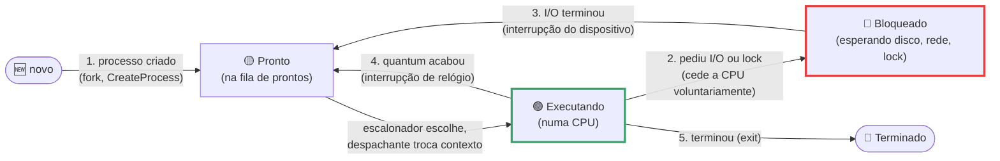
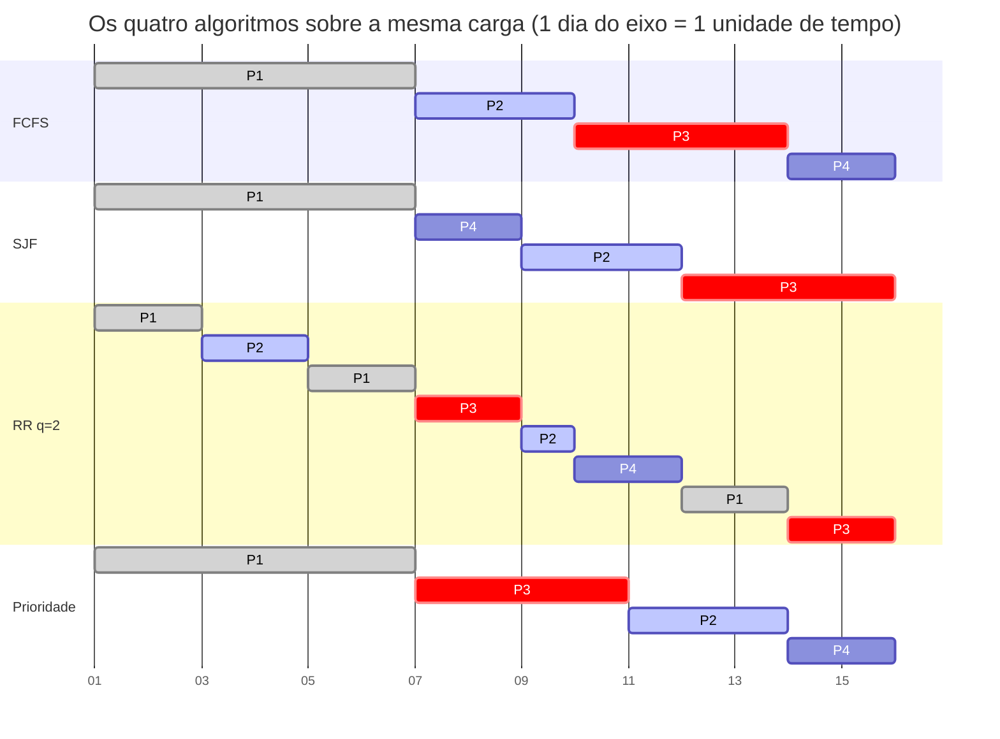
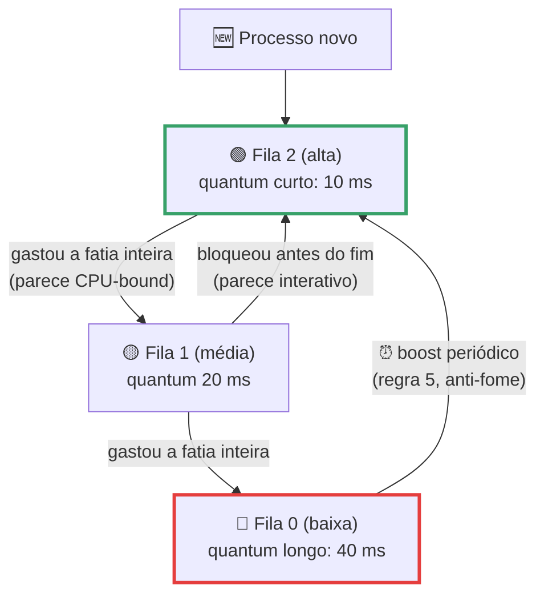
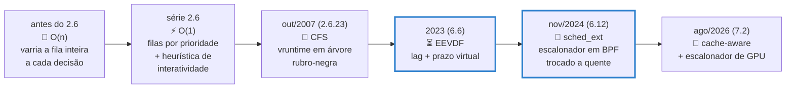

# Escalonamento de Processos

> [!quote] 295 processos, 12 núcleos, ninguém na fila
> *Na máquina onde esta página foi preparada, `ps -e --no-headers | wc -l` contou **295 processos** disputando **12 núcleos**. Nenhum esperou visivelmente. O código que faz esse malabarismo milhares de vezes por segundo já mudou de nome quatro vezes em vinte anos e, desde novembro de 2024, pode ser substituído por um programa **seu**, escrito em BPF, sem recompilar o kernel.*

> [!abstract] 🧭 O que você vai fazer nesta aula
> Calcular FCFS, SJF, round-robin e prioridades na mão e conferir no simulador da OSTEP; medir com cronômetro a diferença entre `nice 0` e `nice 19` no mesmo núcleo; pôr um teto de CPU num processo com uma linha de `systemd-run`; auditar as classes de escalonamento do seu sistema; e medir a **latência p99** de um processo interativo enquanto quatro devoradores de CPU brigam pelo mesmo núcleo. Aula anterior: [[Comunicação entre Processos]]. Ambiente ainda não montado? Comece por [[Laboratório de SO: preparando o ambiente]].

---

## 1. ⏱️ O problema: quem roda agora?

Todo processo de [[Processos]] e toda thread de [[Threads]] está em um de três lugares: **executando** numa CPU, **pronto** esperando a vez, ou **bloqueado** esperando disco, rede ou teclado. Quem escolhe qual dos prontos vira o próximo executando é o **escalonador** (*scheduler*); quem faz a troca é o **despachante** (*dispatcher*).

A analogia útil não é a fila do banco: é o **pronto-socorro**. Chegar primeiro não garante ser atendido primeiro, atendimento longo pode ser interrompido, alguns casos têm prioridade absoluta e alguém precisa impedir que o paciente menos grave fique esquecido no corredor.

| Perfil | Comportamento | Exemplos | O que quer |
|---|---|---|---|
| **CPU-bound** | rajadas longas, quase não bloqueia | compilar, treinar rede neural, render | fatias grandes (**throughput**) |
| **I/O-bound** | rajadas curtas, bloqueia o tempo todo | shell, editor, navegador, servidor web | ser acordado rápido (**latência**) |

Esse é o conflito central: throughput e latência disputam o mesmo recurso, e todo escalonador real é uma negociação entre os dois.



Nos pontos 1, 2, 3 e 5 qualquer escalonador decide algo. O ponto 4, a **interrupção periódica de relógio**, separa os dois mundos: no **não preemptivo** o processo roda até bloquear ou terminar (um laço infinito congela a máquina, como no Windows 3.x); no **preemptivo** o kernel toma a CPU de volta, e é assim em todo SO de uso geral moderno.

| Métrica | Definição | Quem se importa |
|---|---|---|
| **Throughput** | processos concluídos por unidade de tempo | lote, CI, treino de modelo |
| **Turnaround** | conclusão menos chegada | quem submeteu o job |
| **Tempo de espera** | turnaround menos CPU usada | análise do escalonador |
| **Tempo de resposta** | primeira execução menos chegada | usuário interativo |
| **Justiça** | fatias proporcionais ao direito de cada um | administrador, multiusuário |
| **Previsibilidade (p99)** | o pior caso que 99% das requisições respeitam | SRE, inferência |

A última linha merece atenção: um servidor de LLM com latência **média** de 80 ms pode ter **p99** de 4 segundos, porque a média é dominada pelas requisições rápidas e o p99 é o que o usuário reclama. Essa distinção volta na seção 6.

> [!example] 🧪 Atividade 1: descobrir o perfil de um processo pelas trocas de contexto
> **Ferramenta:** `/usr/bin/time -v` (pacote `time`; o `time` embutido do bash não tem `-v`, daí o caminho completo).
>
> 1. Um processo **CPU-bound**:
>    ```bash
>    /usr/bin/time -v python3 -c "
>    s=0
>    for i in range(30_000_000): s+=i
>    print(s)" 2>&1 | grep -E 'Percent of CPU|context switches'
>    ```
> 2. Um que **bloqueia o tempo todo** (300 sonos de 5 ms):
>    ```bash
>    /usr/bin/time -v python3 -c "
>    import time
>    for _ in range(300): time.sleep(0.005)" 2>&1 | grep -E 'Percent of CPU|context switches'
>    ```
>
> **Resultado esperado:** os seus quatro números ao lado da medição real desta máquina: o laço de soma deu **99% de CPU, 1 voluntária e 5 involuntárias**; os 300 sonos deram **1% de CPU, 301 voluntárias e 0 involuntárias**. Troca **involuntária** = o kernel tirou a CPU; **voluntária** = o processo devolveu.
>
> 🪟 **No Windows:** `Ctrl+Shift+Esc` → **Detalhes** → botão direito no cabeçalho → **Selecionar colunas** → **Alternâncias de contexto**. Ou rode os mesmos comandos no WSL2.

---

## 2. 📐 Os algoritmos clássicos, com números conferidos

Sempre os mesmos quatro processos. Todos os números desta seção foram calculados por simulação e conferidos duas vezes.

| Processo | Chegada | CPU necessária | Prioridade |
|---|---|---|---|
| P1 | 0 | 6 | 2 |
| P2 | 1 | 3 | 3 |
| P3 | 3 | 4 | **1 (mais alta)** |
| P4 | 5 | 2 | 4 (mais baixa) |

No **diagrama de Gantt** cada faixa mostra quem estava na CPU em cada instante. Como o Mermaid trabalha com datas, cada "dia" do eixo vale **uma unidade de tempo** (o dia 1 é o intervalo entre os instantes 0 e 1).



| Processo | CPU | Turnaround FCFS | SJF | RR (q=2) | Prioridade |
|---|---|---|---|---|---|
| P1 | 6 | 6 | 6 | 13 | 6 |
| P2 | 3 | 8 | 10 | 8 | 12 |
| P3 | 4 | 10 | 12 | 12 | 7 |
| P4 | 2 | 10 | 3 | 6 | 10 |
| **Turnaround médio** | | **8,50** | **7,75** | **9,75** | **8,75** |
| **Espera média** | | 4,75 | 4,00 | 6,00 | 5,00 |
| **Resposta média** | | 4,75 | 4,00 | **2,00** | 5,00 |

Leia de trás para a frente: **o round-robin é o pior em turnaround e o melhor em resposta**. Não existe algoritmo bom em tudo, existe algoritmo alinhado ao objetivo.

- **FCFS:** fila simples, sem preempção. Sofre do **efeito comboio**: P1 (6 unidades) segura P4 (2 unidades) por 13 unidades, como um caminhão numa pista simples.
- **SJF:** escolhe a menor rajada. É **ótimo** para o turnaround médio quando todos chegam juntos, mas o SO **não sabe** o tamanho da próxima rajada (estima pelo passado) e processos longos podem **passar fome** (*starvation*). A versão preemptiva, **SRTF**, ganha de todas aqui (turnaround 6,75, espera 3,00, resposta 0,25), ao custo de P1 só terminar no instante 15.
- **Prioridades:** o mais importante manda, e na variante preemptiva quem chega melhor colocado tira o atual da CPU. Risco de fome, corrigido com **envelhecimento** (*aging*). Cuidado também com a **inversão de prioridade**: em 1997 a Mars Pathfinder reiniciava sozinha em Marte porque uma tarefa importante esperava um mutex segurado por uma tarefa fraca, que vivia sendo preemptada; a correção, por rádio, foi ligar a **herança de prioridade** ([[Comunicação entre Processos]]).
- **Round-robin:** FCFS com preempção por relógio; cada um roda no máximo um **quantum** e volta ao fim da fila. É a base dos sistemas interativos.

![[Recursos/Sistemas operacionais/Escalonamento de Processos/round-robin-quantum-3.png|Round-robin com quantum 3 e dez processos: em cinza o tempo de espera, em preto o tempo de fato na CPU. As fatias de um mesmo processo ficam espalhadas pela linha do tempo (Wikimedia Commons, CC0)]]

| Quantum | Trocas de contexto | Turnaround médio | Resposta média |
|---|---|---|---|
| 1 | 14 | 9,50 | **0,75** |
| 2 | 7 | 9,75 | 2,00 |
| 3 | 5 | 9,50 | 3,00 |
| 4 | 4 | 9,25 | 3,75 |
| 6 ou mais | 3 | **8,50** | 4,75 (virou FCFS) |

Uma troca de contexto custa alguns microssegundos (salvar registradores, invalidar TLB, esfriar o cache): quantum pequeno demais e o sistema gasta mais tempo trocando do que trabalhando; grande demais e o RR degenera em FCFS. A regra de Tanenbaum é escolher o quantum de forma que **cerca de 80% das rajadas terminem dentro dele**. No Linux o valor equivalente é uma fatia base de 0,70 ms multiplicada pelo logaritmo do número de CPUs (`sysctl_sched_base_slice = 700000` ns, em `kernel/sched/fair.c`).

> [!example] 🧪 Atividade 2: calcular na mão e conferir com o simulador da OSTEP
> **Ferramenta:** `scheduler.py`, do repositório de exercícios do livro aberto OSTEP.
>
> 1. Baixe só o arquivo: `curl -sO https://raw.githubusercontent.com/remzi-arpacidusseau/ostep-homework/master/cpu-sched/scheduler.py`
> 2. Rode **sem** `-c` (mostra o problema, esconde a resposta) e calcule no caderno turnaround, resposta e espera de cada job. Atenção: aqui **todos chegam no instante 0**, diferente da tabela da aula.
>    ```bash
>    python3 scheduler.py -p FIFO -l 6,3,4,2
>    python3 scheduler.py -p RR -q 2 -l 6,3,4,2
>    ```
> 3. Confira com `-c`. A saída real do FIFO nesta carga termina em `Average -- Response: 7.00  Turnaround 10.75  Wait 7.00`.
> 4. Repita com `-p SJF` e `-p RR -q 1`. Use `-s <sua matrícula>` para gerar uma carga só sua.
> 5. Agora no navegador, no [Process Scheduling Solver](https://process-scheduling-solver.boonsuen.com/) (código aberto, roda até no celular): cadastre os processos **da tabela da aula** (chegadas 0, 1, 3, 5 e rajadas 6, 3, 4, 2), confira FCFS, SJF, SRTF e RR com quantum 2 contra as médias desta página e capture também o Gantt de **Priority (preemptive)** com as prioridades 2, 3, 1, 4.
>
> **Resultado esperado:** as suas contas batendo com o `-c` nas quatro configurações; uma frase explicando por que o RR tem a **pior** média de turnaround e a **melhor** de resposta; e os prints do visualizador, respondendo se a prioridade preemptiva melhorou ou piorou o turnaround médio (dá **9,00** contra 8,75 da não preemptiva, com a resposta média caindo de 5,00 para 4,25).
>
> 🪟 **No Windows:** o simulador roda igual no PowerShell com Python (`python scheduler.py ...`), no WSL2 ou em [replit.com](https://replit.com); o visualizador é um site.

---

## 3. 🎰 MLFQ, loteria e tempo real

Os clássicos supõem que o SO conhece o futuro. Os algoritmos de verdade **aprendem** observando o passado.

O **MLFQ** (*Multi-Level Feedback Queue*) domina os SOs de propósito geral desde o CTSS (1962) e passou por Solaris, FreeBSD e Windows NT. Várias filas com prioridade e quantum próprios; o processo **desce** quando gasta a fatia inteira (sinal de CPU-bound) e **fica no topo** quando bloqueia rápido (sinal de interativo). As regras, na formulação da OSTEP: (1) maior prioridade roda; (2) prioridades iguais rodam em round-robin; (3) processo novo entra na fila **mais alta**; (4) gastou a alocação do nível, desce; (5) de tempos em tempos **todos voltam ao topo** (o *boost*), o que evita fome.



Na **loteria**, cada processo recebe **bilhetes** e a cada fatia sorteia-se um. Quem tem 100 bilhetes contra 20 tende a receber 5 vezes mais CPU. A vantagem é a composição (bilhete é **proporção**, não prioridade absoluta, então ninguém morre de fome); a desvantagem é ser probabilístico, e no curto prazo a proporção erra feio.

> [!example] 🧪 Atividade 3: fome no MLFQ e (in)justiça na loteria
> **Ferramenta:** `mlfq.py` e `lottery.py`, da OSTEP.
>
> 1. Baixe os dois:
>    ```bash
>    B=https://raw.githubusercontent.com/remzi-arpacidusseau/ostep-homework/master
>    curl -sO $B/cpu-sched-mlfq/mlfq.py; curl -sO $B/cpu-sched-lottery/lottery.py
>    ```
> 2. **MLFQ:** job longo em 0 (120 unidades) e curto chegando em 20 (20 unidades), 3 filas, quantum 10. Localize a descida de fila e a chegada do novato; depois rode com boost (`-B 50`) e compare.
>    ```bash
>    python3 mlfq.py -n 3 -q 10 -l 0,120,0:20,20,0 -c | grep -E 'Run JOB|Job ' | head -40
>    ```
>    Nesta máquina: JOB 0 começa em PRIORITY 2, cai para 1 no instante 10, o JOB 1 entra por cima em PRIORITY 2 no instante 20 e o JOB 0 vai para o porão (PRIORITY 0) no instante 40. Turnaround: **140** contra **20**.
> 3. **Loteria:** dois processos de 60 unidades, 100 contra 20 bilhetes (proporção teórica 5 para 1). Repita com `-s 5`, `-s 100`, `-s 3` e `-s 13`.
>    ```bash
>    python3 lottery.py -l 60:100,60:20 -s 8 -c | awk '/JOB 0 DONE/{exit} /-> Run /{c[$NF]++} END{for(k in c) print "job "k": "c[k]" fatias"}'
>    ```
>
> **Resultado esperado:** as duas saídas do MLFQ, dizendo qual **regra** cada mudança de prioridade implementa e o que o boost fez com o turnaround do job 0; e a tabela das cinco sementes da loteria (com `-s 8` sai exatamente **60 e 12**, a proporção certa; com `-s 100`, 60 e 19; com `-s 3`, 60 e 9). Explique em duas linhas por que a loteria converge no longo prazo e erra tanto numa amostra curta: é por isso que o Linux usa contabilidade determinística, não sorteio.
>
> 🪟 **No Windows:** `python mlfq.py ...` no PowerShell ou no WSL2.

**Tempo real.** Em sistema crítico, entregar tarde equivale a não entregar: airbag, marca-passo, drone. Duas políticas dominam, ambas de Liu e Layland (1973). O **RMS** (*Rate Monotonic*) usa prioridade estática (período menor, prioridade maior) e garante os prazos até uma utilização de

$$U_{max} = n \cdot (2^{1/n} - 1)$$

que tende a cerca de 69% quando o número de tarefas cresce. O **EDF** (*Earliest Deadline First*) usa prioridade dinâmica (prazo mais próximo primeiro), aproveita até 100% da CPU e degrada de forma imprevisível se estourar. O Linux implementa EDF na política `SCHED_DEADLINE`: você declara `runtime`, `deadline` e `period` (com `runtime <= deadline <= period`) e o kernel **recusa** admitir a tarefa se a conta não fechar. É escalonamento com contrato.

---

## 4. 🐧 Linux por dentro: do O(1) ao EEVDF e ao sched_ext



O **CFS** (*Completely Fair Scheduler*), de Ingo Molnar, entrou no kernel 2.6.23 (2007) modelando "uma CPU multitarefa ideal e precisa" na qual N processos rodariam simultaneamente a 1/N da velocidade. Como isso não existe, o CFS mantém para cada processo um **tempo virtual de execução** (`vruntime`), que avança mais devagar para quem tem peso maior, e sempre roda quem tem o menor `vruntime`. Os prontos ficam ordenados por `vruntime` numa **árvore rubro-negra**, com busca do menor em tempo logarítmico:

![[Recursos/Sistemas operacionais/Escalonamento de Processos/red-black-tree.png|Árvore rubro-negra: a estrutura que o CFS usa para manter os processos prontos ordenados por vruntime. O nó mais à esquerda é sempre o próximo a rodar (Wikimedia Commons, Nomen4Omen, CC BY-SA 4.0)]]

### EEVDF: o que mudou em 2023

O CFS dividia CPU de forma justa, mas não sabia expressar **requisito de latência**: um player de áudio que acorda a cada 10 ms e um compilador que quer 200 ms seguidos passavam pela mesma régua. O kernel **6.6** (out/2023) trocou o CFS pelo **EEVDF** (*Earliest Eligible Virtual Deadline First*), de um artigo de Stoica e Abdel-Wahab (1995), implementado por Peter Zijlstra. São três ideias:

| Conceito | O que significa | Analogia |
|---|---|---|
| **lag** (atraso) | quanto de CPU o processo **tinha direito** menos quanto **de fato usou**. Positivo = o sistema deve a ele | o saldo da sua conta com o escalonador |
| **elegibilidade** | só concorre quem tem **lag maior ou igual a zero**, isto é, quem ainda é credor | só entra na fila quem tem saldo a receber |
| **prazo virtual** | entre os elegíveis, ganha o de **prazo mais cedo**, calculado a partir da fatia que a tarefa pediu | quem tem a consulta marcada mais cedo passa primeiro |

A consequência é elegante: **pedir uma fatia menor gera um prazo mais cedo**, então o processo negocia latência baixa em troca de fatias curtas, via `sched_setattr()`, sem depender de adivinhação do kernel. A transição terminou no **6.12** (nov/2024), o mesmo release que levou o `PREEMPT_RT` ao mainline depois de vinte anos fora da árvore.

### As classes de escalonamento

O Linux não tem "um" escalonador: tem uma pilha de classes consultadas em ordem, e uma classe só roda se nenhuma acima dela tiver trabalho.

| Ordem | Política (valor em `sched.h`) | Para que serve |
|---|---|---|
| 1 | `SCHED_DEADLINE` (6) | EDF com contrato (`runtime`, `deadline`, `period`); vence todo mundo |
| 2 | `SCHED_FIFO` (1) | tempo real, prioridade 1 a 99, **sem fatia**: roda até bloquear ou ceder |
| 2 | `SCHED_RR` (2) | igual ao FIFO, com quantum (`/proc/sys/kernel/sched_rr_timeslice_ms`, **100 ms** aqui) |
| 3 | `SCHED_OTHER` / `SCHED_NORMAL` (0) | o EEVDF; onde vivem 99% dos seus processos |
| 3 | `SCHED_BATCH` (3) | como o normal, mas assume CPU-bound e nunca é acordado por interatividade |
| 4 | `SCHED_IDLE` (5) | peso mais baixo ainda que um nice +19: só roda se ninguém quiser a CPU |
| 5 | `SCHED_EXT` (7) | escalonador definido por você em BPF (desde o 6.12) |

> [!danger] Um `SCHED_FIFO` mal usado congela a máquina
> Um `SCHED_FIFO` com laço infinito **não é preemptado** por nada de prioridade menor, e isso inclui a sua interface gráfica e o seu terminal. A rede de proteção é `sched_rt_runtime_us` (950000) contra `sched_rt_period_us` (1000000), que reserva **5% de cada segundo** às tarefas normais. Ainda assim, ao testar `chrt -f`, sempre combine com `taskset -c`.

### `nice` não é prioridade: é **peso**

O `nice` vai de -20 (egoísta) a +19 (gentil) e é traduzido por uma tabela fixa (`sched_prio_to_weight[]`, em `kernel/sched/core.c`). O comentário do próprio código dá a regra: cada nível muda o consumo de CPU em cerca de 10%, de forma multiplicativa (fator 1,25 entre vizinhos).

| nice | peso | Fatia contra um nice 0, disputando um núcleo |
|---|---|---|
| -20 | 88761 | 98,9% |
| -10 | 9548 | 90,3% |
| -5 | 3121 | 75,3% |
| **0** | **1024** | 50,0% |
| +5 | 335 | 24,7% |
| +10 | 110 | 9,7% |
| +19 | 15 | **1,4%** |

> [!example] 🧪 Atividade 4: provar a tabela de pesos com um cronômetro (e ver a migração sumir)
> **Ferramenta:** `nice`, `taskset`, `/usr/bin/time`, `htop` e, se houver, `perf`.
>
> 1. Veja quantos núcleos você tem (`nproc`) e use o **último** (se `nproc` diz 8, use o 7).
> 2. Dois devoradores de CPU **no mesmo núcleo**, um em nice 0 e outro em nice 19, por 10 segundos:
>    ```bash
>    taskset -c 7 /usr/bin/time -f "nice  0 -> %U s de CPU (%P de um núcleo)" \
>      timeout 10 nice -n 0  python3 -c "while True: pass" &
>    taskset -c 7 /usr/bin/time -f "nice 19 -> %U s de CPU (%P de um núcleo)" \
>      timeout 10 nice -n 19 python3 -c "while True: pass" &
>    wait
>    ```
> 3. Em outro terminal, veja os dois no `htop` (`sudo apt install htop`): ordene por `NI` com `F6` e observe `PRI`, `NI` e `%CPU`.
> 4. Meça agora o efeito da **afinidade** nas migrações entre núcleos, com e sem `taskset`:
>    ```bash
>    perf stat -e cpu-migrations,context-switches timeout 10 python3 -c "while True: pass"
>    perf stat -e cpu-migrations,context-switches taskset -c 3 timeout 10 python3 -c "while True: pass"
>    ```
>    Sem `perf` (comum no WSL2), observe a coluna `PSR` (a CPU atual) mudando ou parada: `timeout 20 python3 -c "while True: pass" &` e depois `for i in $(seq 1 10); do ps -o pid,psr,pcpu,comm -p $!; done`.
>
> **Resultado esperado:** a medição real desta máquina foi `nice 0 -> 9.85 s (98% de um núcleo)` e `nice 19 -> 0.14 s (1%)`, contra a previsão da tabela de pesos: **98,9% e 1,4%**. No passo 4, `cpu-migrations` diferente de zero no primeiro caso e **zero** no segundo. Entregue os quatro números e uma linha sobre o custo de uma migração para o cache L1/L2 ([[Hardware]]). Se os pesos derem diferente, confirme com `ps -o pid,ni,psr,comm -C python3` que os dois caíram no mesmo núcleo.
>
> 🪟 **No Windows:** no WSL2 é igual; a versão nativa está na Atividade 7. Para mudar a prioridade sem o Gerenciador de Tarefas: `(Get-Process -Id <pid>).PriorityClass = 'BelowNormal'`.

> [!example] 🧪 Atividade 5: auditar (e mudar) as classes de escalonamento da SUA máquina
> **Ferramenta:** `chrt`, `ps`, `/proc` e `/sys`. Só o passo 4 precisa de `sudo`.
>
> 1. A política do seu shell e as classes em uso no sistema:
>    ```bash
>    chrt -p $$
>    ps -eo class= | sort | uniq -c
>    ps -eo pid,class,rtprio,ni,pri,comm | awk 'NR==1 || $2!="TS"' | head -15
>    ```
>    Nesta máquina: `SCHED_OTHER` no shell, `38 FF` (SCHED_FIFO, as threads `migration/N` e `watchdog/N` do próprio kernel) e `253 TS` (o EEVDF).
> 2. Os botões de ajuste que o seu kernel expõe (aqui deram `100` e `950000 / 1000000`):
>    ```bash
>    ls /proc/sys/kernel/ | grep '^sched'
>    cat /proc/sys/kernel/sched_rr_timeslice_ms
>    cat /proc/sys/kernel/sched_rt_runtime_us /proc/sys/kernel/sched_rt_period_us
>    ```
> 3. Seu kernel tem sched_ext? Algum escalonador BPF está carregado agora?
>    ```bash
>    uname -r; grep CONFIG_SCHED_CLASS_EXT /boot/config-$(uname -r) 2>/dev/null || zgrep SCHED_CLASS_EXT /proc/config.gz
>    cat /sys/kernel/sched_ext/state 2>/dev/null || echo "sched_ext ausente (kernel < 6.12 ou sem CONFIG_SCHED_CLASS_EXT)"
>    ```
> 4. Um processo em tempo real, **preso a um núcleo** (o `taskset` não é opcional aqui):
>    ```bash
>    sudo chrt -f 50 taskset -c 7 timeout 10 python3 -c "while True: pass" &
>    ps -eo pid,class,rtprio,ni,comm -C python3
>    ```
>
> **Resultado esperado:** a lista dos processos `FF` do seu sistema, a saída do passo 2 com uma frase por parâmetro e o print do passo 4 com `CLS = FF` e `RTPRIO = 50`. Antes de rodar, peça a uma IA para **prever** cada saída; confira cada divergência em [`man 7 sched`](https://man7.org/linux/man-pages/man7/sched.7.html) e registre onde a IA errou.
>
> 🪟 **No Windows:** rode no WSL2 (o kernel é Linux de verdade, então `/proc/sys/kernel/sched_*` existe; use o `zgrep /proc/config.gz` porque não há `/boot/config-*`). O equivalente nativo do `chrt -f` é **Definir prioridade → Tempo real**, e o próprio Windows avisa que pode deixar o sistema instável.

### cgroups v2: peso e teto

`nice` distribui a sobra; **cgroups** impõem contrato. É a base de containers, do systemd e de todo cluster Kubernetes ([[Containers e Virtualização]]).

| Arquivo do cgroup | Formato | Padrão | O que faz |
|---|---|---|---|
| `cpu.weight` | 1 a 10000 | 100 | **peso relativo**: divide a CPU disponível na proporção dos pesos (o `nice` dos grupos) |
| `cpu.max` | `MAX PERIOD` em µs | `max 100000` | **teto absoluto**: no máximo MAX µs de CPU a cada PERIOD. `50000 100000` = meio núcleo |
| `cpu.stat` | contadores | | `nr_throttled` e `throttled_usec`: quantas vezes o grupo bateu no teto |
| `cpu.pressure` | PSI | | quanto tempo o grupo passou esperando CPU (o sinal que o SRE olha) |

A diferença é pergunta favorita de entrevista: **peso é elástico** (máquina ociosa, você usa tudo); **teto é rígido** (mesmo com a máquina vazia você não passa do limite, e o excedente vira *throttling*).

> [!example] 🧪 Atividade 6: colocar um teto de 20% de CPU num processo, com uma linha
> **Ferramenta:** `systemd-run` (já instalado no Ubuntu), que cria um cgroup temporário sem `mkdir` em `/sys/fs/cgroup`.
>
> 1. Num terminal: `systemd-run --user --scope -p CPUQuota=20% python3 -c "while True: pass"`
> 2. Em outro, confirme o teto no `top` (a coluna `%CPU` estabiliza perto de 20) e veja o cgroup ao vivo com `systemd-cgtop -m -n 5`.
> 3. Leia os números reais do controle:
>    ```bash
>    S=$(systemctl --user list-units --type=scope --no-legend | awk '/run-/{print $1; exit}')
>    D=/sys/fs/cgroup/user.slice/user-$(id -u).slice/user@$(id -u).service/app.slice/$S
>    cat $D/cpu.max $D/cpu.stat
>    ```
> 4. Repita com `-p CPUQuota=150%` e explique o resultado (dica: 100% é **um** núcleo).
>
> **Resultado esperado:** `20000 100000` no `cpu.max`, `nr_throttled` maior que zero no `cpu.stat` e o print do `top` travado em ~20%. Compare com a Atividade 4: `nice 19` deu 1% porque **havia briga**; a cota dá 20% mesmo com a máquina ociosa.
>
> 🪟 **No Windows:** não há equivalente por processo; o mais próximo é limitar a VM/WSL2 no `.wslconfig` (`processors=`) ou usar **Job Objects** pela API. Com Docker Desktop, `docker run --cpus=0.2` faz exatamente isto por baixo (cgroup v2 dentro da VM Linux).

**Afinidade, NUMA e núcleos heterogêneos.** `taskset` prende o processo a um conjunto de núcleos: ganha cache quente, perde flexibilidade (`taskset -p $$` mostra a máscara, `fff` = 12 núcleos aqui). Em servidores com vários soquetes o escalonador tenta manter processo e memória no mesmo nó **NUMA**. Em topologias assimétricas (big.LITTLE) entra o **EAS** (*Energy Aware Scheduling*), que prevê o custo energético de cada decisão e é desligado acima de 80% de utilização. Nos Intel de 12ª geração em diante, o **Thread Director** informa ao SO, pela interface **HFI**, a capacidade de desempenho e de eficiência de cada CPU numa escala de 0 a 255.

### sched_ext: escreva o seu próprio escalonador

Em nov/2024 o kernel **6.12** ganhou o `sched_ext`: uma classe de escalonamento definida por **programas BPF** carregados em tempo de execução. Você implementa alguns callbacks (`select_cpu()`, `enqueue()`, `dispatch()`, `dequeue()`), carrega, e o kernel passa a chamar o seu código. Se ele travar ou você acionar `SysRq-S`, o kernel **devolve todas as tarefas ao escalonador justo** automaticamente: é a diferença entre experimentar em módulo de kernel (que derruba a máquina) e experimentar com rede de proteção.

![[Recursos/Sistemas operacionais/Escalonamento de Processos/steam-deck.png|Steam Deck: o console portátil da Valve roda Linux e usa o scx_lavd, um escalonador em BPF desenvolvido pela Igalia sob contrato da Valve para reduzir engasgos em jogos (Wikimedia Commons, Liam Dawe/GamingOnLinux, CC BY-SA 4.0)]]

O **scx_lavd** (*Latency-criticality Aware Virtual Deadline*) nasceu para o **Steam Deck**, para reduzir o *stuttering* em jogos no Linux, e segundo o Phoronix (dez/2025) entrega desempenho igual ou melhor que o EEVDF. A **Meta** apresentou no Linux Plumbers Conference 2025 a palestra *"How do we make a Steam Deck scheduler work on large servers"*: o escalonador de um console portátil avaliado como padrão de uma frota de servidores. O repositório `sched-ext/scx` afirma que Meta e Google estão comprometidos com o projeto e que a Meta está em implantação em massa. Há uma família inteira em Rust mais BPF: `scx_rusty`, `scx_bpfland`, `scx_layered`, `scx_flash`, `scx_p2dq`.

---

## 5. 🪟 E no Windows (e no macOS)

O NT usa **prioridades absolutas com round-robin dentro de cada nível**: sempre roda uma thread do nível mais alto que tenha alguém pronto, e só desce quando o nível esvazia. São **32 níveis, de 0 a 31**, e a documentação da Microsoft é explícita: só a thread de zeragem de páginas pode ter prioridade 0.

| Elemento | Windows | Linux |
|---|---|---|
| Unidade escalonada | **thread** (o processo só empresta a classe) | **task** (thread) |
| Faixas | 0 a 15 dinâmica, 16 a 31 tempo real | nice -20 a +19; rtprio 1 a 99 (FIFO/RR) |
| Como se calcula | classe do processo (IDLE a REALTIME) **mais** nível da thread (IDLE a TIME_CRITICAL): NORMAL + NORMAL = **8**, REALTIME + TIME_CRITICAL = **31** | política, e peso do nice ou rtprio |
| Quantum | 2 intervalos de relógio no cliente, 12 no servidor (relógio de 10 a 15 ms). *Fonte secundária: Windows Internals* | fatia base de 0,70 ms escalada pelo log do número de CPUs |
| Truque de latência | **boosts** temporários para a janela em primeiro plano e para quem sai de um I/O, decaindo a cada quantum | EEVDF: quem dormiu tem lag positivo e vira elegível na hora |

O Windows tem ainda o **MMCSS** (*Multimedia Class Scheduler Service*), que trata áudio e jogos por categoria registrada (`Audio`, `Games`, `Playback`, `Pro Audio`, `Capture`, `Window Manager`), com faixas de prioridade por categoria (Low 8 a 15, Medium 16 a 22, High 23 a 26) e a chave `SystemResponsiveness`, cujo padrão 20 reserva 20% da CPU para as tarefas de baixa prioridade não morrerem de fome. É o "modo de jogo" no fundo do poço ([[Windows]]).

No **macOS e iOS** a Apple inverteu a interface: o desenvolvedor não escolhe prioridade, escolhe **QoS** (*Quality of Service*), declarando a **intenção** enquanto o SO decide prioridade, CPU e até frequência. As classes vão de `User-interactive` ("virtualmente instantâneo") a `Background` ("minutos ou horas"), passando por `User-initiated` e `Utility`. A filosofia é a do EEVDF: **o programa declara o requisito, o kernel resolve**.

---

## 6. 🤖 Escalonamento na era da IA

O escalonador de CPU virou metade da história: numa máquina que serve modelos, o recurso disputado é a **GPU**, e as mesmas perguntas voltam com outra roupa.

| Mecanismo | Como funciona | Isolamento | Quando usar |
|---|---|---|---|
| **Time-slicing** (padrão) | troca de contexto entre processos, um de cada vez | nenhum de memória: um processo estoura a VRAM e derruba o vizinho | desenvolvimento, máquina compartilhada |
| **MPS** (Multi-Process Service) | os *kernels* CUDA de processos diferentes **se sobrepõem**, sem troca de contexto | fraco (compartilham contexto) | muitos processos pequenos que não enchem a GPU |
| **MIG** (Multi-Instance GPU) | particiona o hardware: até **7 instâncias** por GPU, com SMs e memória próprios (numa H100 de 80 GB, de 7 fatias de 10 GB a uma única de 80 GB) | forte, em hardware | produção multi-inquilino, cluster |

No Kubernetes isso vira recurso agendável: `nvidia.com/gpu` para a GPU inteira, réplicas de time-slicing (10 réplicas em 8 GPUs anunciam 80 unidades) ou perfis MIG como `nvidia.com/mig-1g.5gb`: o escalonador do cluster faz com GPUs o que o EEVDF faz com núcleos. E o kernel entrou na dança: o **Linux 7.2** (agosto de 2026) trouxe um **escalonador de GPU com justiça derivada do CFS** e o **cache-aware task scheduling**, que co-loca tarefas que compartilham dados no mesmo cache de último nível.

**Por que o p99 manda em servidor de inferência:** um servidor de LLM processa requisições em lote (*continuous batching*), e cada requisição a mais aumenta a vazão total e **piora a latência individual**. É o trade-off do quantum do round-robin, agora com dinheiro em cima, porque contrato de nível de serviço fala em p99, não em média. Daí a importância de `nice`, cota de cgroup e afinidade: um treino longo em `nice 19` no mesmo servidor de um endpoint de inferência é a diferença entre "o cliente nem percebe" e "o alerta tocou às 3h" ([[Sistemas Operacionais na Era da IA]]).

> [!example] 🧪 Atividade 7: medir o efeito da prioridade no Windows
> **Ferramenta:** Gerenciador de Tarefas e PowerShell. Só tem Linux? Faça a variante do fim.
>
> 1. Em dois PowerShell, o mesmo devorador de CPU:
>    ```powershell
>    $t = [Diagnostics.Stopwatch]::StartNew(); $s=0; while ($t.Elapsed.TotalSeconds -lt 30) { $s++ }; "$s iteracoes"
>    ```
> 2. No Gerenciador de Tarefas (`Ctrl+Shift+Esc`), aba **Detalhes**, ache os dois `powershell.exe` e use **Definir afinidade** para deixar os dois no **mesmo núcleo**.
> 3. Em um deles, **Definir prioridade → Baixa**; no outro, deixe **Normal**. Rode os dois juntos e compare o número de iterações.
> 4. Confirme pelo PowerShell: `Get-Process powershell | Select-Object Id, PriorityClass, ProcessorAffinity`
>
> **Resultado esperado:** o processo Normal termina com **muito** mais iterações que o de prioridade Baixa (mesma lógica da Atividade 4, outro SO). Entregue os dois números e o print.
>
> 🐧 **Variante Linux/WSL2:** repita a Atividade 4 e compare os fatores. O Linux, com peso 1024 contra 15, chega perto de 70 para 1; o Windows usa prioridades absolutas com boost, então a razão costuma ser outra. Explique a origem da diferença.

> [!example] 🧪 Atividade 8: medir o p99 de um processo interativo sob briga por CPU
> **Ferramenta:** Python 3 e `taskset`. Roda em qualquer máquina, sem GPU.
>
> 1. Salve como `lat.py` (pede para acordar em 5 ms, 400 vezes, e mede o **atraso extra**):
>    ```python
>    import time
>    amostras = []
>    for _ in range(400):
>        t0 = time.perf_counter()
>        time.sleep(0.005)
>        amostras.append((time.perf_counter() - t0 - 0.005) * 1000)
>    amostras.sort()
>    p = lambda q: amostras[int(q * len(amostras)) - 1]
>    print(f"p50={p(0.50):6.2f} ms   p99={p(0.99):6.2f} ms   max={amostras[-1]:6.2f} ms")
>    ```
> 2. Três cenários, todos no **mesmo** núcleo (troque o 7 pelo último da sua máquina):
>    ```bash
>    taskset -c 7 python3 lat.py                                    # A) núcleo ocioso
>    for i in 1 2 3 4; do taskset -c 7 timeout 12 python3 -c "while True: pass" & done
>    taskset -c 7 python3 lat.py; wait                              # B) 4 devoradores em nice 0
>    for i in 1 2 3 4; do taskset -c 7 nice -n 19 timeout 12 python3 -c "while True: pass" & done
>    taskset -c 7 python3 lat.py; wait                              # C) os mesmos em nice 19
>    ```
>
> **Resultado esperado:** a sua tabela ao lado da medição real desta máquina:
>
> | Cenário | p50 | p99 | máximo |
> |---|---|---|---|
> | A) núcleo ocioso | 0,14 ms | 0,36 ms | 1,33 ms |
> | B) 4 devoradores em nice 0 | 0,06 ms | **2,89 ms** | 3,65 ms |
> | C) 4 devoradores em nice 19 | 0,06 ms | **0,07 ms** | 2,78 ms |
>
> Responda: por que a **mediana quase não muda** entre os três cenários, enquanto o p99 varia 40 vezes? Essa é a resposta que vale a vaga de SRE.
>
> 🖥️ **Com GPU NVIDIA:** rode `nvidia-smi --query-compute-apps=pid,used_memory --format=csv` com dois processos usando a placa e veja que **ambos aparecem ao mesmo tempo**: é o time-slicing em ação. `nvidia-smi -L` mostra se há instâncias MIG. 🪟 **No Windows:** o mesmo script funciona; use o Gerenciador de Tarefas para pôr todos no mesmo núcleo.

---

## 7. 🔧 Caixa de ferramentas e o que o mercado cobra

| Ferramenta | Comando típico | O que responde |
|---|---|---|
| `top` / `htop` | `top`, depois `f` para escolher colunas | `PR`, `NI`, `%CPU`, load average |
| `ps` | `ps -eo pid,tid,class,rtprio,ni,pri,psr,pcpu,stat,comm` | classe (`TS`, `FF`, `RR`, `B`, `IDL`, `DLN`) e CPU atual (`PSR`) |
| `chrt` · `nice`/`renice` · `taskset` | `chrt -p PID`; `nice -n 19 cmd`; `taskset -c 0-3 cmd` | política, peso (só root **abaixa** o nice) e afinidade |
| `systemd-run` / `systemd-cgtop` | `systemd-run --user --scope -p CPUQuota=20% cmd`; `systemd-cgtop -m -n 5` | teto de CPU e consumo por cgroup |
| `pidstat` | `pidstat -w -t -p PID 1` | trocas voluntárias e involuntárias por thread |
| `perf sched` / `bpftrace` | `sudo perf sched latency`; `sudo bpftrace -e 'tracepoint:sched:sched_switch { @[comm] = count(); }'` | latência de escalonamento e quem troca de contexto |

No mercado, escalonamento aparece em três lugares concretos: **SRE e Platform** (por que o p99 piorou depois que subimos as réplicas? o pod está sofrendo *CPU throttling*?), **MLOps** (dividir uma GPU entre times com MIG ou time-slicing) e **concurso público**, quase sempre no formato "calcule o turnaround médio deste conjunto em SJF", que é a Atividade 2. O trabalho que fecha o tema está em [[Trabalhos e Projetos de Sistemas Operacionais]]; termos soltos, no [[Glossário de Sistemas Operacionais]].

---

## ❓ Quiz rápido

> [!question]- 1. Um processo teve 604 trocas de contexto voluntárias e 34 involuntárias em meio segundo. CPU-bound ou I/O-bound?
> **Resposta:** I/O-bound. Troca **voluntária** = o próprio processo devolveu a CPU (bloqueou em I/O, lock ou `sleep`); **involuntária** = o kernel tomou a CPU porque a fatia acabou. Um CPU-bound tem o padrão inverso, como o laço da Atividade 1 (1 voluntária, 5 involuntárias).

> [!question]- 2. Na carga da aula, o round-robin com quantum 2 teve o **pior** turnaround médio (9,75) e ainda assim é a base dos sistemas interativos. Por quê?
> **Resposta:** porque turnaround médio não é a métrica do usuário sentado na frente da tela. O RR teve a **melhor resposta média** (2,00 contra 4,75 do FCFS): todo processo começa a rodar cedo. Quem otimiza turnaround (SJF, 7,75) faz os curtos passarem na frente, mas o primeiro caractere que você digita pode esperar muito. Escalonador não é bom em abstrato: é bom para um objetivo.

> [!question]- 3. `nice -n 19` e `systemd-run --scope -p CPUQuota=20%` limitam CPU. Qual a diferença prática?
> **Resposta:** `nice` mexe no **peso relativo**: se ninguém mais quiser a CPU, um processo em nice 19 usa 100% dela (na Atividade 4 só deu 1% porque **havia briga** no mesmo núcleo). `CPUQuota` (o `cpu.max` do cgroup v2) é um **teto absoluto**: 20% são 20 ms a cada 100 ms mesmo com a máquina ociosa, e o excedente vira *throttling* contabilizado em `cpu.stat`. Peso é elástico, teto é rígido.

> [!question]- 4. Em uma frase cada: o que são lag, elegibilidade e prazo virtual no EEVDF?
> **Resposta:** **lag** é o saldo do processo, quanto de CPU ele tinha direito menos quanto usou (positivo = o sistema deve a ele); **elegibilidade** é a regra de que só concorre quem tem lag maior ou igual a zero; **prazo virtual** é o desempate entre os elegíveis, ganhando o de prazo mais cedo. Como o prazo deriva da fatia pedida, o processo pode **pedir fatias curtas para conseguir latência baixa**, sem depender de heurística do kernel.

> [!question]- 5. Você carrega um escalonador `sched_ext` em BPF e ele trava as tarefas. O que acontece com a máquina?
> **Resposta:** nada irreversível. Se o programa BPF falha, viola uma invariante ou o operador aciona `SysRq-S`, o kernel **desregistra o escalonador e devolve todas as tarefas ao escalonador justo** (EEVDF) automaticamente. É a diferença para um módulo de kernel tradicional, no qual o mesmo bug exigiria reiniciar, e é o que permitiu a Valve, Meta e Google experimentarem escalonadores em produção.

---

## 🔗 Veja também

- [[Processos]] e [[Threads]]: o que exatamente está sendo escalonado (no Linux, a thread).
- [[Comunicação entre Processos]]: mutex, semáforos e a inversão de prioridade da Pathfinder.
- [[Containers e Virtualização]]: `cpu.max` e `cpu.weight` são a espinha dorsal do `docker run --cpus`.
- [[Linux na prática]]: `top`, `htop`, `systemd` e o resto da caixa de ferramentas no dia a dia.
- [[Sistemas Operacionais na Era da IA]]: MIG, MPS e escalonamento de GPU com mais profundidade.
- [[Windows]]: como o NT organiza processos, threads e prioridades.
- ➡️ **Próxima aula:** [[Gerenciamento de Memória]]

---

> [!note] 📚 Fontes (verificadas em setembro de 2026)
> - Kernel: [CFS](https://docs.kernel.org/scheduler/sched-design-CFS.html) · [EEVDF](https://docs.kernel.org/scheduler/sched-eevdf.html) · [sched_ext](https://docs.kernel.org/scheduler/sched-ext.html) · [cgroup v2](https://docs.kernel.org/admin-guide/cgroup-v2.html) · [EAS](https://docs.kernel.org/scheduler/sched-energy.html) · [Intel HFI](https://docs.kernel.org/arch/x86/intel-hfi.html)
> - Código: `sched_prio_to_weight[]` e a regra dos 10% em [core.c](https://raw.githubusercontent.com/torvalds/linux/master/kernel/sched/core.c) · `sysctl_sched_base_slice = 700000` ns em [fair.c](https://raw.githubusercontent.com/torvalds/linux/master/kernel/sched/fair.c) · constantes `SCHED_*` em [uapi/linux/sched.h](https://raw.githubusercontent.com/torvalds/linux/master/include/uapi/linux/sched.h)
> - Releases: [2.6.23, CFS](https://kernelnewbies.org/Linux_2_6_23) · [6.6, EEVDF](https://kernelnewbies.org/Linux_6.6) · [6.12, sched_ext e PREEMPT_RT](https://kernelnewbies.org/Linux_6.12) · [7.2, cache-aware e escalonador de GPU](https://kernelnewbies.org/Linux_7.2) · [LWN sobre o EEVDF (2023)](https://lwn.net/Articles/925371/) · [Phoronix, Meta e o scx_lavd (dez/2025)](https://www.phoronix.com/news/Meta-SCX-LAVD-Steam-Deck-Server) · [sched-ext/scx](https://github.com/sched-ext/scx)
> - Manuais: [sched(7)](https://man7.org/linux/man-pages/man7/sched.7.html) · [chrt(1)](https://man7.org/linux/man-pages/man1/chrt.1.html) · [taskset(1)](https://man7.org/linux/man-pages/man1/taskset.1.html) · [systemd-run(1)](https://manpages.ubuntu.com/manpages/noble/en/man1/systemd-run.1.html)
> - Windows e macOS: [Scheduling Priorities](https://learn.microsoft.com/en-us/windows/win32/procthread/scheduling-priorities) · [Context Switches](https://learn.microsoft.com/en-us/windows/win32/procthread/context-switches) · [MMCSS](https://learn.microsoft.com/en-us/windows/win32/procthread/multimedia-class-scheduler-service) · [QoS Classes, Apple](https://developer.apple.com/library/archive/documentation/Performance/Conceptual/EnergyGuide-iOS/PrioritizeWorkWithQoS.html)
> - GPU: [NVIDIA MPS](https://docs.nvidia.com/deploy/mps/index.html) · [perfis MIG](https://docs.nvidia.com/datacenter/tesla/mig-user-guide/supported-mig-profiles.html) · [k8s-device-plugin](https://github.com/NVIDIA/k8s-device-plugin)
> - OSTEP: [Scheduling](https://pages.cs.wisc.edu/~remzi/OSTEP/cpu-sched.pdf) · [MLFQ](https://pages.cs.wisc.edu/~remzi/OSTEP/cpu-sched-mlfq.pdf) · [Lottery](https://pages.cs.wisc.edu/~remzi/OSTEP/cpu-sched-lottery.pdf) · [simuladores](https://github.com/remzi-arpacidusseau/ostep-homework) · [Process Scheduling Solver](https://process-scheduling-solver.boonsuen.com/)
> - Livros do PPC: Tanenbaum e Bos, *Sistemas Operacionais Modernos* (4ª ed.), cap. 2.4; Silberschatz, cap. 5; Maziero, *Sistemas Operacionais: Conceitos e Mecanismos*. RMS e EDF: Liu e Layland, JACM 20(1), 1973.
> - Imagens (Wikimedia Commons): [Round-robin schedule quantum 3, Maxtremus, CC0](https://commons.wikimedia.org/wiki/File:Round-robin_schedule_quantum_3.png) · [Red-black tree example with NIL, Nomen4Omen, CC BY-SA 4.0](https://commons.wikimedia.org/wiki/File:Red-black_tree_example_with_NIL.svg) · [Steam Deck front, Liam Dawe/GamingOnLinux, CC BY-SA 4.0](https://commons.wikimedia.org/wiki/File:Steam_Deck_(front).jpg)
