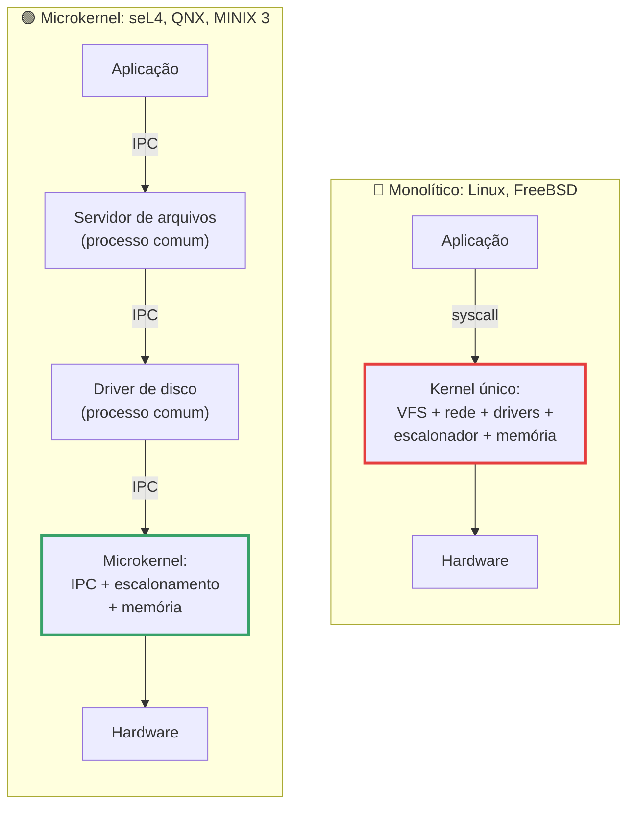
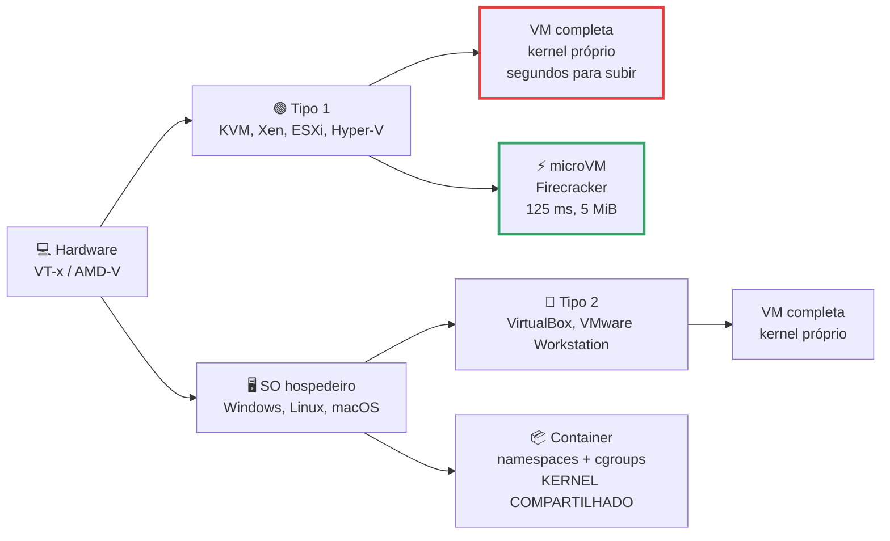
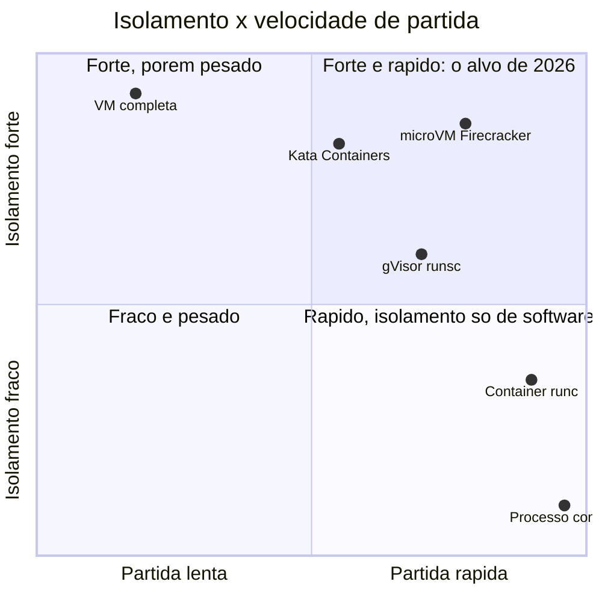

# Estrutura dos Sistemas Operacionais

> [!quote] Onde você corta o sistema?
> *O kernel do Linux tem quase 41 milhões de linhas em um único binário privilegiado. O seL4, que voa em drones e roda em bilhões de chips de banda base, tem cerca de 10 mil linhas e uma prova matemática de que está correto. Os dois são sistemas operacionais sérios. A diferença não é tamanho: é onde cada projeto passou a linha entre "isto roda em modo kernel" e "isto roda como um programa comum".*

Em [[Chamadas de Sistema]] você viu a **fronteira**: a instrução que leva o processador do modo usuário para o modo kernel. A pergunta agora não é como se atravessa a fronteira, e sim **o que cabe do lado privilegiado dela**. Essa decisão explica por que o Linux troca driver sem reiniciar, por que o seu carro roda QNX, por que a AWS inventou uma VM que liga em 125 ms e por que o WSL2 é, literalmente, uma máquina virtual.

---

## 1. 🧭 A pergunta que define a arquitetura

Pense em um hospital. Tudo em uma sala só: a comunicação é instantânea, mas uma bandeja contaminada derruba o hospital inteiro. Prédios separados: um incêndio na farmácia não fecha a cirurgia, mas cada exame vira papelada. Sistemas operacionais vivem esse dilema. Tudo em modo kernel é chamada de função (nanossegundos) e um bug em qualquer driver mata a máquina. Tudo em processos separados custa **IPC** (*inter-process communication*: mensagem, troca de contexto, cópia), mas um driver que morre é só um processo que reinicia. Tanenbaum organiza as respostas em seis estruturas, e nenhuma é museu: todas têm representante vivo em 2026.

| # | Estrutura | Ideia central | Quem usa hoje |
|---|---|---|---|
| 1 | **Monolítico** | Todo o SO em um binário em modo kernel | Linux, FreeBSD, Windows (em parte) |
| 2 | **Em camadas** | Níveis de privilégio decrescente, cada um usando só o de baixo | Virou hardware: os anéis do x86 |
| 3 | **Microkernel** | Só IPC, escalonamento e memória básica no kernel; o resto vira processo | seL4, QNX 8.0, MINIX 3, Zircon, Redox, HongMeng |
| 4 | **Cliente-servidor / híbrido** | Serviços respondem a pedidos; parte volta ao kernel por desempenho | Windows NT, XNU (macOS), GNU Hurd |
| 5 | **Máquinas virtuais** | Uma camada abaixo do SO multiplexa o hardware inteiro | KVM, Xen, Hyper-V, ESXi, VirtualBox, Firecracker, WSL2 |
| 6 | **Exokernel** | O kernel só multiplexa o hardware; a abstração vira biblioteca no processo | Unikernels e, em parte, eBPF e sched_ext |

![[Recursos/Sistemas operacionais/Estrutura dos Sistemas Operacionais/monolitico-microkernel-hibrido.png|Kernel monolítico (tudo em modo kernel), microkernel (drivers e servidores em modo usuário) e kernel híbrido]]

A figura é a aula inteira: a faixa vermelha do modo kernel **encolhe** da esquerda para a direita, e o que sai dela reaparece em cima, no modo usuário.



O preço de cada escolha, lado a lado:

| Critério | Monolítico | Camadas | Microkernel | Híbrido | Máquina virtual | Exokernel |
|---|---|---|---|---|---|---|
| Onde vive o driver | Modo kernel | Camada baixa | Processo em modo usuário | Modo kernel | No SO convidado | Biblioteca do app |
| Custo de um I/O | Chamada de função | Entre camadas | 2 ou mais IPCs | Chamada de função | Chamada + saída ao hipervisor | Chamada de função |
| Bug no driver derruba | A máquina | A máquina | Só aquele processo | A máquina | Só aquela VM | Só aquele app |
| Superfície privilegiada | Enorme | Grande | Mínima | Grande | Hipervisor + convidado | Mínima |

> [!info] A regra que resume tudo
> Você troca **latência por blast radius**. Quanto mais coisa em modo kernel, mais rápido o caminho comum e maior o estrago de um bug. Quanto menos, mais mensagens e mais chance de auditar o que restou.

---

## 2. 🏗️ Monolítico: o Linux por dentro

O Linux é monolítico, mas **modular**. Escalonador, memória, pilha TCP/IP, sistemas de arquivos e milhares de drivers rodam no mesmo espaço de endereçamento privilegiado, e o driver de rede chama direto uma função do alocador. A modularidade não está em separar processos: está em **carregar e descarregar pedaços do kernel em execução**, os *loadable kernel modules* (`.ko`).

![[Recursos/Sistemas operacionais/Estrutura dos Sistemas Operacionais/mapa-do-kernel-linux.png|Mapa do kernel Linux: colunas por subsistema (processos, memória, armazenamento, rede) e linhas por nível, do espaço de usuário ao hardware]]

Cada opção do kernel tem três estados na compilação, e é aí que "monolítico modular" fica concreto: `CONFIG_X=y` vai embutido no `vmlinuz` e não sai mais; `CONFIG_X=m` vira um `.ko` carregado sob demanda; `# CONFIG_X is not set` nem é compilado.

As ferramentas do pacote `kmod` são o painel de controle: `lsmod` só formata `/proc/modules`, `modinfo` lê os metadados de um `.ko`, `modprobe` resolve dependências e carrega, `depmod` reconstrói o mapa. Quando o driver não está na árvore oficial (o caso clássico é o da NVIDIA), entra o **DKMS** (*Dynamic Kernel Module Support*), que guarda o fonte e recompila o módulo a cada kernel novo. É por isso que atualizar kernel com placa NVIDIA demora mais.

> [!example] 🧪 Atividade 1: fazer o inventário do seu próprio kernel
> **Ferramenta:** terminal Linux (Ubuntu 24.04 nativo, VM ou WSL2). Se `lsmod` ou `modinfo` não forem encontrados, eles moram em `/usr/sbin`.
>
> 1. Kernel em uso, módulos carregados, módulos disponíveis no disco e o "menu" de compilação:
>    ```bash
>    uname -r
>    lsmod | tail -n +2 | wc -l
>    ls /sys/module | wc -l
>    find /lib/modules/$(uname -r)/kernel -name '*.ko*' | wc -l
>    du -sh /lib/modules/$(uname -r)/kernel
>    grep -c '^CONFIG_' /boot/config-$(uname -r)
>    grep -E '^(CONFIG_MODULES|CONFIG_KVM|CONFIG_OVERLAY_FS|CONFIG_BPF_SYSCALL|CONFIG_RUST)=' /boot/config-$(uname -r)
>    ```
> 2. Os cinco módulos com mais "clientes" (a 3ª coluna do `lsmod` é o contador de uso) e a ficha de um deles:
>    ```bash
>    lsmod | sort -k3 -nr | head -5
>    modinfo kvm_intel | head -12     # em CPU AMD, troque por kvm_amd
>    ```
>
> **Resultado esperado:** cinco números anotados. Na máquina desta aula (kernel `6.8.0-xx-generic`) deram **212 módulos carregados**, **338 entradas em `/sys/module`**, **6.474 arquivos `.ko` ocupando 594 MB** e **9.563 opções de configuração**, com `CONFIG_KVM=m`, `CONFIG_OVERLAY_FS=m`, `CONFIG_MODULES=y`, `CONFIG_BPF_SYSCALL=y` e nenhum `CONFIG_RUST`. Menos de 4% do que existe está carregado. Explique em uma frase por que `CONFIG_MODULES` tem de ser `y` e nunca `m`.
>
> 🪟 **No Windows:** PowerShell como administrador, `driverquery /v | more`: são os drivers em modo kernel carregados agora. 🍎 **No macOS:** `kmutil showloaded`.

> [!example] 🧪 Atividade 2: navegar o mapa interativo do kernel
> **Ferramenta:** [makelinux.github.io/kernel/map](https://makelinux.github.io/kernel/map/), a versão clicável da imagem acima.
>
> 1. Na coluna **system**, linha **user space interfaces**, clique em `sys_read` e siga as setas até `hardware interfaces`, anotando **todas** as caixas do caminho.
> 2. Repita com `sys_clone` (coluna *processing*) e `mmap` (coluna *memory*).
>
> **Resultado esperado:** dois caminhos escritos, do tipo `sys_read -> vfs_read -> ... -> disk controllers drivers`, com o número de níveis atravessados. Ao lado, responda: em um microkernel, quais dessas caixas teriam virado processos separados?
>
> 🪟 **No Windows:** o mapa roda no navegador, sem instalar nada.

---

## 3. 🥞 Camadas e anéis: a ideia que virou hardware

O sistema **THE**, de Dijkstra (1968), propôs camadas rígidas: nível 0 para o processador, 1 para a memória, 2 para o console. A regra era brutal, uma camada só chama a imediatamente abaixo, e isso permitia provar propriedades camada por camada. O **MULTICS** levou a ideia a anéis concêntricos de proteção.

A camada pura morreu como forma de organizar código (I/O real não respeita hierarquia), mas **virou hardware**. O x86 tem quatro anéis e usa dois: anel 0 para o kernel, anel 3 para as aplicações. Com virtualização apareceu o informalmente chamado "anel -1", habilitado pelas extensões Intel VT-x e AMD-V.

| Nível | x86 | Quem roda ali |
|---|---|---|
| Hipervisor | VMX root ("anel -1") | KVM, Hyper-V, Xen, ESXi |
| Kernel | Anel 0 | Linux, `ntoskrnl.exe`, drivers |
| Não usados | Anéis 1 e 2 | Praticamente nada desde os anos 1990 |
| Usuário | Anel 3 | Firefox, Python, o seu programa em C |

> [!tip] Por que sobraram só dois anéis?
> Proteção por hardware é cara de manter, e sistemas portáveis precisam rodar onde só existem dois níveis. Usar os quatro anéis do x86 impediria o mesmo kernel de rodar em ARM ou RISC-V. A portabilidade venceu a granularidade.

---

## 4. 🔬 Microkernel: pouco no kernel, muito no espaço do usuário

No modo kernel ficam apenas **IPC, escalonamento básico e gerência primária de memória**. Sistema de arquivos, pilha de rede, drivers e até o gerenciador de processos viram servidores em modo usuário, conversando por mensagens. O MINIX 3 se descreve como "um microkernel minúsculo, com o resto do sistema operacional rodando como uma série de processos isolados e protegidos em modo usuário".

| Sistema | O número que importa |
|---|---|
| **seL4** (L4, GPLv2, aviônica e defesa) | Prova de correção funcional em Isabelle/HOL, verificação estendida até o **binário** em ARM e RISC-V; cerca de **10.000 linhas** (RISC-V, abr/2025) |
| **QNX OS 8.0** (BlackBerry, automotivo) | POSIX + troca de mensagens; sistemas de arquivos e rede fora do kernel |
| **MINIX 3** (didático, Tanenbaum) | Reinicia driver que travou sem derrubar o sistema |
| **Zircon** (kernel do Fuchsia, Google) | Cerca de **100 chamadas de sistema**, quase todas não bloqueantes |
| **Redox** (tudo em **Rust**, MIT) | Microkernel + `relibc`, `RedoxFS`, shell Ion e ambiente Orbital |
| **GNU Hurd** (servidores sobre GNU Mach) | Cerca de **três quartos** dos pacotes Debian já portados |
| **HongMeng** (HarmonyOS NEXT, Huawei) | 27 milhões de ativações de HarmonyOS 5 e 6 até 25/11/2025 |

> [!warning] O calcanhar de Aquiles: o custo do IPC
> Ler um arquivo pode virar quatro travessias de fronteira: o app manda mensagem ao servidor de arquivos, que manda ao driver de disco, que responde, que responde. Foi essa conta que fez o Linux nascer monolítico em 1991 e gerou o célebre debate entre Tanenbaum e Linus Torvalds. Hoje o placar é misto: o Linux venceu no servidor e no desktop; os microkernels venceram onde uma falha mata alguém (aviônica, automotivo, banda base).

> [!example] 🧪 Atividade 3: medir a diferença de escala entre monolítico e microkernel
> **Ferramenta:** terminal Linux + o [FAQ do seL4](https://sel4.systems/About/FAQ.html).
>
> 1. Conte os símbolos que o seu kernel expõe em memória: `wc -l < /proc/kallsyms`
> 2. Some o número de módulos `.ko` da Atividade 1 e, no FAQ do seL4, o tamanho do kernel verificado em linhas. Monte uma tabela de três linhas com os três números.
>
> **Resultado esperado:** na máquina da aula, `/proc/kallsyms` tinha **375.472 símbolos**. Contra as cerca de 10.000 linhas do seL4, é uma ordem de grandeza visível sem nenhuma teoria. Escreva uma frase respondendo qual dos dois é possível verificar formalmente, e por quê.
>
> 🪟 **No Windows:** rode a etapa 1 dentro do WSL2 (lá também é Linux).

---

## 5. 🖧 Cliente-servidor e híbridos: Windows NT e macOS

A estrutura **cliente-servidor** é o microkernel visto de outro ângulo: componentes do SO são servidores, programas são clientes, tudo acontece por pedidos, e o servidor pode até estar em outra máquina sem o cliente perceber. Na prática comercial quem venceu foi o **híbrido**: começar com desenho de microkernel e trazer de volta ao modo kernel tudo que ficou lento demais.

![[Recursos/Sistemas operacionais/Estrutura dos Sistemas Operacionais/arquitetura-windows-nt.png|Arquitetura do Windows NT: subsistemas de ambiente em modo usuário, Executive com os gerenciadores, microkernel e HAL em modo kernel]]

O **Windows NT** (base do 10, do 11 e do Server) é o exemplo de manual. Em modo usuário ficam os *subsistemas de ambiente* (Win32 e, historicamente, POSIX e OS/2), que traduzem a API conhecida pelo programa para as chamadas nativas. Em modo kernel ficam o **Executive** (objeto, processo, memória virtual, E/S, energia, plug and play e segurança), o **kernel** propriamente dito (threads, interrupções, sincronização) e a **HAL** (*Hardware Abstraction Layer*), que esconde as diferenças de chipset.

O **XNU**, kernel do macOS e do iOS, é híbrido por composição literal: o nome significa "X is Not Unix" e o código junta o microkernel **Mach** (Carnegie Mellon), a camada **BSD** (processos, POSIX, rede) e o **IOKit**, framework de drivers em C++ (as pastas `osfmk`, `bsd`, `iokit` e `libkern` do repositório). Mach está lá, mas rodando em modo kernel junto com o BSD: microkernel na origem, monolítico na entrega.

> [!info] Híbrido não é meio-termo confortável
> NT e XNU pagam parte do preço dos dois modelos: a complexidade de protocolo do microkernel e o blast radius do monolítico. Quando a Microsoft quis reduzir o risco de um driver de terceiros, em 2025, a resposta não foi mudar a estrutura: foi tirar o antivírus do modo kernel, com a plataforma da Windows Resiliency Initiative (26/06/2025). É a lição do microkernel entrando pela porta dos fundos.

---

## 6. 💽 Máquinas virtuais: hipervisores, microVMs e o WSL2

A quinta estrutura não reorganiza o kernel: coloca **outra camada embaixo dele**. O hipervisor multiplexa o hardware inteiro e dá a cada convidado a ilusão de uma máquina completa, com kernel próprio.

![[Recursos/Sistemas operacionais/Estrutura dos Sistemas Operacionais/hipervisor-tipo-1-e-tipo-2.png|Hipervisor tipo 1 (direto sobre o hardware) e tipo 2 (rodando como programa dentro de um sistema operacional hospedeiro)]]

| | **Tipo 1 (bare metal)** | **Tipo 2 (hosted)** |
|---|---|---|
| Roda sobre | O hardware, sem SO abaixo | Um SO hospedeiro comum |
| Exemplos em 2026 | KVM, Xen 4.22 (05/08/2026), Hyper-V, VMware ESXi | VirtualBox 7.2.16 (18/08/2026), VMware Workstation, Parallels |
| Desempenho e uso | Próximo do nativo; nuvem e datacenter | Uma indireção a mais; laboratório na sua máquina |

O KVM embaralha essa classificação: é um **módulo do kernel Linux** que transforma o próprio Linux em hipervisor tipo 1. Você fala com ele por `ioctl` em `/dev/kvm` (`KVM_CREATE_VM` cria a VM, `KVM_CREATE_VCPU` cria uma CPU virtual, `KVM_RUN` a coloca para rodar) e quem emula os dispositivos em modo usuário é o QEMU. Nada disso funciona sem **hardware assist**: VT-x e AMD-V criam o modo privilegiado extra do hipervisor. Antes delas, virtualizar exigia tradução binária ou **paravirtualização** (o convidado sabe que é virtual e chama o hipervisor de propósito, como nos primeiros Xen).

A ponta moderna são as **microVMs**. O Firecracker, escrito em Rust pela AWS sobre o KVM, corta tudo que uma VM de propósito geral tem de sobra: cinco dispositivos emulados, boot de **até 125 ms** até o `/sbin/init`, **menos de 5 MiB** de overhead por microVM, mais de 95% do desempenho do bare metal e 150 microVMs por segundo em um host. É o que roda o AWS Lambda, com mais de 15 trilhões de invocações por mês. **Isolamento de VM deixou de ser sinônimo de lentidão.**



E o **WSL2** é exatamente isto. A Microsoft o descreve como "rodar um kernel Linux dentro de uma máquina virtual utilitária leve", com kernel "construído pela Microsoft a partir do ramo estável mais recente" de kernel.org, servido pelo Windows Update, com 100% de compatibilidade de chamadas de sistema e systemd. Esse kernel é público (ramo `linux-msft-wsl-6.18.y`). O WSL1 era outra coisa: uma camada de tradução que reimplementava as chamadas Linux sobre o NT, sem kernel Linux nenhum. Por isso o Docker não rodava no WSL1 e roda no WSL2.

> [!example] 🧪 Atividade 4: descobrir se você está dentro de uma máquina virtual
> **Ferramenta:** `systemd-detect-virt`, `/proc/cpuinfo` e `lscpu`.
>
> 1. Pergunte ao sistema o que ele acha que é e veja se a **sua CPU** sabe virtualizar (`vmx` na Intel, `svm` na AMD):
>    ```bash
>    systemd-detect-virt          # "none", "kvm", "microsoft", "wsl", "docker"...
>    systemd-detect-virt --container
>    systemd-detect-virt --list | head -20
>    grep -c -E '(vmx|svm)' /proc/cpuinfo
>    lscpu | grep -i virtual
>    ls -l /dev/kvm
>    ```
>
> **Resultado esperado:** um veredito escrito. Na máquina da aula saiu `none` (hardware real), **24** linhas com `vmx`, `Virtualization: VT-x` no `lscpu` e `/dev/kvm` presente. No WSL2 o esperado é `wsl`; numa VM do VirtualBox, `oracle`; dentro de um container, `docker`. Anote o seu e explique o que revela. A pegadinha: uma coisa é **ser** virtualizado, outra é **poder** virtualizar.
>
> 🪟 **No Windows:** Gerenciador de Tarefas, aba Desempenho, campo "Virtualização: habilitada". É o mesmo VT-x/AMD-V que a etapa 2 mede pelo Linux.

> [!example] 🧪 Atividade 5: provar que o WSL2 é uma VM com kernel de verdade
> **Ferramenta:** WSL2 no Windows. Sem Windows, faça a mesma prova em uma VM do VirtualBox comparada com o host.
>
> 1. No PowerShell: `wsl --version`, `wsl --list --verbose`, `wsl --status`.
> 2. Dentro do Ubuntu do WSL2: `uname -r`, `cat /proc/version` e `systemd-detect-virt`.
> 3. Derrube a VM inteira com `wsl --shutdown`, reabra o Ubuntu e rode `uptime`.
>
> **Resultado esperado:** o `uname -r` mostra um kernel Linux cujo nome identifica o build da Microsoft (procure `microsoft` na saída), o `wsl --list --verbose` confirma `VERSION 2` e, depois do `--shutdown`, o `uptime` reinicia do zero, porque a VM foi realmente desligada. Anote a sua versão de kernel e diga se é mais nova ou mais velha que o 6.8 do Ubuntu 24.04.
>
> 🐧 **Sem Windows:** rode os comandos da etapa 2 dentro de uma VM VirtualBox e no host; `systemd-detect-virt` deve dizer `oracle` dentro e `none` fora.

---

## 7. 🧫 Exokernel e unikernels: o que sobreviveu dessas ideias

O **exokernel**, do MIT, invertia tudo: o kernel deveria apenas "multiplexar o hardware bruto com segurança", sem impor abstração. Sistema de arquivos, pilha TCP e memória viravam **bibliotecas** ligadas à aplicação, trocáveis por versões sob medida (o servidor web Cheetah, feito assim, chegou a ser 8 vezes mais rápido que o do NCSA). Os **unikernels** são a herança viva: você compila a aplicação junto com só as partes do SO que ela usa e gera "um objeto binário de espaço de endereçamento único", sem separação entre kernel e usuário. O Unikraft (Linux Foundation) promete imagens que sobem "em milissegundos"; o MirageOS 4.0 gera unikernels em OCaml sobre Xen ou KVM.

E no Linux, três ideias de exokernel entraram pela porta da frente:

| Mecanismo | Ideia de exokernel que realiza | Estado em 2026 |
|---|---|---|
| **eBPF** | Rodar código do usuário dentro do kernel com segurança, sem módulo | Programas "sandboxed em um contexto privilegiado como o kernel", com verificador e JIT; syscall `bpf()` desde o 3.18 (2014) |
| **sched_ext** | Escrever a política de escalonamento fora do kernel | Escalonadores em BPF desde o 6.12 (LTS, 17/11/2024); o 7.1 trouxe sub-escalonadores por cgroup |
| **io_uring** | Tirar a syscall do caminho de I/O com filas compartilhadas | O 7.1 trouxe "BPF-powered io_uring" |

> [!tip] O padrão a guardar
> Nenhuma estrutura "ganhou": o que houve foi **absorção**. O Linux é monolítico, mas roubou do exokernel a extensibilidade (eBPF), do microkernel o isolamento por processo (drivers em espaço de usuário via FUSE, sandboxes) e da virtualização a multiplexação (KVM, que é um módulo).

---

## 8. 📦 Containers como estrutura (prévia)

Container **não é VM**: não há hipervisor nem kernel convidado, e todos os containers de um host compartilham o mesmo kernel. O que existe é o kernel mentindo de forma controlada para um grupo de processos, com três primitivas.

![[Recursos/Sistemas operacionais/Estrutura dos Sistemas Operacionais/docker-namespaces-cgroups.png|O Docker não é uma camada de virtualização: ele orquestra primitivas que já existem no kernel Linux, como namespaces, cgroups, capabilities, SELinux e AppArmor]]

| Primitiva | O que faz | Onde você vê |
|---|---|---|
| **namespaces** (8 tipos) | Isolam a *visão*: PID, rede, montagens, hostname, usuários, IPC, cgroup e tempo | `ls /proc/self/ns` |
| **cgroups v2** | Limitam o *consumo*: CPU, memória, I/O, número de processos | `/sys/fs/cgroup` |
| **overlayfs** | Empilha camadas somente-leitura sob uma de escrita, com *copy-up* e *whiteouts* | `mount -t overlay` |

Somando capabilities restritas (o Docker "inicia containers com um conjunto restrito de capabilities") e filtros seccomp, você tem um container. O trabalho braçal é de um runtime OCI: **runc** (Go, o padrão), **crun** (C, sobe 100 containers em 1,69 s contra 3,34 s do runc) e **youki** (Rust, CNCF: cria e apaga um container em 111,5 ms contra 224,6 ms do runc). No meio do caminho estão os híbridos: o **gVisor** roda um "kernel de aplicação que implementa uma interface parecida com Linux", em Go, interceptando as syscalls antes do kernel real; o **Kata Containers** entrega "máquinas virtuais leves que se encaixam no ecossistema de containers", com QEMU ou Firecracker por baixo.

| | Máquina virtual | microVM | Container |
|---|---|---|---|
| Kernel | Próprio, completo | Próprio, enxuto | **Compartilhado com o host** |
| Fronteira de segurança | Hipervisor (hardware) | Hipervisor (hardware) | Chamadas de sistema (software) |
| Partida e memória | Segundos, centenas de MB | Cerca de 125 ms, menos de 5 MiB | Dezenas de ms, só o processo |
| Densidade por host | Dezenas | Centenas | Centenas ou milhares |



> [!example] 🧪 Atividade 6: comprovar que o container usa o kernel do host
> **Ferramenta:** Docker (no Windows, Docker Desktop com backend WSL2). Sem Docker, faça só a etapa 3, que não precisa de root nem instalação.
>
> 1. No host: `uname -r ; ps -e | wc -l ; hostname`
> 2. Os mesmos comandos dentro de um Alpine:
>    ```bash
>    docker run --rm -it alpine sh -c 'uname -r; ps -e | wc -l; hostname; head -2 /etc/os-release'
>    ```
> 3. Agora **na mão**, sem Docker, com um comando só:
>    ```bash
>    unshare --user --map-root-user --fork --pid --mount-proc sh -c 'echo "meu PID aqui dentro: $$"; ps -e | wc -l; whoami'
>    ```
>
> **Resultado esperado:** o `uname -r` é **idêntico** dentro e fora (mesmo kernel), mas o `/etc/os-release` diz Alpine e o `ps -e` mostra pouquíssimos processos. Na etapa 3, a saída da máquina da aula foi `meu PID aqui dentro: 1`, apenas **4** linhas no `ps -e` e `whoami` respondendo `root` sem nenhum privilégio real concedido. Você construiu meio container com um comando. Escreva por que o `uname -r` não muda mas o `ps` muda.
>
> 🪟 **No Windows:** com backend WSL2 o daemon do Docker roda dentro da VM, então o `uname -r` do container bate com o kernel da Microsoft, não com o Windows: prova de que o container está dentro da VM, e não sobre o NT.

A página completa, com namespaces um a um, cgroups, imagens em camadas e Kubernetes, é [[Containers e Virtualização]].

---

## 9. 🦀 O kernel Linux em 2026, em números

Em **02/09/2026** o kernel.org listava a mainline em **7.3-rc1** (30/08/2026), a estável em **7.2.3** e seis kernels *longterm* (6.18, 6.12, 6.6, 6.1, 5.15 e 5.10). O ritmo é de relógio: **janela de merge de 2 semanas** para recursos novos, depois **7 semanas** de correção com um *release candidate* por semana (`rc7` costuma ser o último). Dá um kernel novo a cada 9 ou 10 semanas; um *longterm* nasce com previsão de 2 anos, extensível se a indústria bancar.

| Métrica (fonte) | Valor |
|---|---|
| Tamanho da árvore no 7.3-rc1, com `cloc` (Phoronix, 30/08/2026) | **40,98 milhões de linhas**, sendo 30,9 milhões de código |
| Maior driver isolado (Phoronix, 30/08/2026) | `drivers/gpu/drm/amd`, **6,52 milhões de linhas**, cerca de 16% do kernel |
| Commits no ciclo do 7.2 (LWN, ago/2026) | **16.418**, segundo ciclo mais movimentado da história |
| Gente no ciclo do 7.2 (LWN, ago/2026) | **2.652** desenvolvedores (recorde; 2.479 no 7.1), **613** estreantes, **249** empresas |

O **Rust** entrou no kernel na versão 6.1 (dez/2022) e deixou de ser experimento em **12/12/2025**, com o patch "rust: conclude the Rust experiment" e a frase de Miguel Ojeda: "Rust is here to stay". Já estão no mainline o driver **Binder** do Android, o **Nova** (que pretende suceder o nouveau para GPUs NVIDIA com GSP), PHYs de rede e o `null_blk`; o compilador mínimo é o Rust 1.78, ligado por `CONFIG_RUST`. O **Ubuntu 26.04 LTS** (23/04/2026) veio com kernel 7.0, `sudo-rs` e coreutils em Rust. E não é só Linux: a Microsoft colocou o `win32kbase_rs.sys`, um pedaço da região GDI em Rust, dentro do kernel do Windows em uma build Insider de 2023.

> [!example] 🧪 Atividade 7: ler o nascimento do seu sistema no log do kernel
> **Ferramenta:** `dmesg` ou `journalctl -k` (o buffer de mensagens do kernel desde o boot).
>
> 1. Leia o começo do boot (se `dmesg` responder "Operation not permitted", use a segunda linha), procure quem detectou virtualização e memória e veja quem compilou o kernel:
>    ```bash
>    sudo dmesg | head -30
>    journalctl -k -b | head -30
>    sudo dmesg | grep -i -E 'hypervisor|kvm|Memory:' | head
>    cat /proc/version
>    ```
>
> **Resultado esperado:** as primeiras linhas do `dmesg` sempre trazem versão, compilador e linha de comando de boot. Na máquina da aula, `/proc/version` devolveu `Linux version 6.8.0-xx-generic ... gcc-12 ... #138~22.04.1-Ubuntu SMP PREEMPT_DYNAMIC`. Anote a sua versão, o compilador e o modelo de preempção (`PREEMPT_DYNAMIC`, `PREEMPT_RT`) e diga o que esse campo tem a ver com [[Escalonamento de Processos]].
>
> 🪟 **No Windows:** o Visualizador de Eventos (`eventvwr.msc`), em Logs do Windows > Sistema, origens `Kernel-General` e `Kernel-Boot`.

---

## 10. 🪟 E no Windows?

Cinco linhas, porque a arquitetura do NT já está detalhada em [[Windows]]:

1. O Windows moderno é **híbrido**: nasceu com desenho de microkernel e trouxe de volta ao modo kernel o que ficou lento.
2. Em **modo usuário** ficam as aplicações e os subsistemas de ambiente (Win32 e, historicamente, POSIX e OS/2).
3. Em **modo kernel** ficam o **Executive** (objeto, processo, memória virtual, E/S, energia, plug and play, segurança), o **kernel** (threads, interrupções, sincronização) e os drivers.
4. Embaixo de tudo, a **HAL** abstrai o chipset e permite o mesmo `ntoskrnl.exe` rodar em Intel, AMD e ARM.
5. O Hyper-V acrescenta uma camada abaixo do próprio Windows (exige VT-x/AMD-V e SLAT; a partição raiz cria as filhas por *hypercalls*). É ele que sustenta o WSL2.

No Build 2026 (2 a 5/06/2026) a Microsoft anunciou os **Microsoft Execution Containers**, WSL Containers em preview e o Coreutils for Windows em disponibilidade geral. A motivação declarada é isolar agentes de IA: desde 16/10/2025 o Windows descreve um *agent workspace*, ambiente contido com desktop próprio, conta separada e permissões granulares.

---

## 11. 🤖 Estrutura, era da IA e mercado

**Quase tudo que a IA trouxe de novo é problema de estrutura de SO.** Onde fica a fronteira de confiança quando um agente executa código que ninguém leu? As respostas de 2026 são as seis estruturas desta página, aplicadas: **microVM** (AWS Lambda com Firecracker; sandbox de agente que sobe e morre em centenas de milissegundos), **kernel de aplicação** (o gVisor entre o código não confiável e o kernel real), **primitiva de kernel** (sandbox com user namespaces, seccomp BPF e Landlock, sem VM) e **extensibilidade estilo exokernel** (observabilidade de GPU e de latência com eBPF, sem módulo e sem reiniciar).

No mercado isso tem nome de vaga: quem sabe justificar a escolha entre VM, microVM e container trabalha com SRE, DevOps, Platform Engineering e MLOps. No Brasil a média de SRE/DevOps era de **R\$ 10.438** por mês em jun/2026, e LFCS e CKA custam US\$ 445 cada. Em supercomputação a resposta é unânime desde nov/2017: **100% das 500 máquinas do TOP500 rodam Linux**.

> [!example] 🧪 Atividade 8: usar a IA como copiloto de laboratório (e desconfiar dela)
> **Ferramenta:** qualquer assistente de IA + o seu terminal.
>
> 1. **Antes de rodar**, peça: *"na minha máquina Ubuntu com kernel 6.8, o que exatamente vão imprimir `systemd-detect-virt`, `lsmod | wc -l` e `grep -c vmx /proc/cpuinfo`?"* Anote as previsões, rode os comandos e compare.
> 2. Peça a explicação de por que `uname -r` é igual dentro e fora de um container mas diferente dentro de uma VM e **confirme ou refute** no manual do `systemd-detect-virt`.
>
> **Resultado esperado:** uma tabela "previsto x medido" e um parágrafo apontando onde a IA chutou (número de máquina específica é o caso clássico). A regra: **peça, execute, verifique na fonte primária**.

---

## ❓ Quiz rápido

> [!question]- 1. Um driver de rede trava e entra em loop. Em qual arquitetura o sistema tem mais chance de continuar funcionando?
> **Resposta:** no **microkernel** (MINIX 3, seL4, QNX): o driver é um processo comum em modo usuário e pode ser morto e reiniciado sem derrubar o kernel. No Linux, monolítico, ele roda em modo kernel e um loop lá dentro pode travar a máquina inteira.

> [!question]- 2. Você roda `uname -r` no host e dentro de um container Docker e recebe a mesma resposta. Isso é bug?
> **Resposta:** não, é a definição de container. Container **não tem kernel próprio**: todos compartilham o kernel do host e são isolados por namespaces (visão) e cgroups (consumo). O que muda é o `/etc/os-release`, a lista de processos e o hostname.

> [!question]- 3. Qual opção descreve corretamente o WSL2? (a) camada de tradução que converte chamadas Linux em chamadas do NT; (b) máquina virtual leve sobre Hyper-V rodando um kernel Linux compilado pela Microsoft; (c) container sobre o kernel do Windows; (d) emulador de x86.
> **Resposta:** **b**. A alternativa **a** descreve o WSL1, que não tinha kernel Linux e por isso não rodava Docker. O kernel do WSL2 é público, vem do ramo estável de kernel.org e chega pelo Windows Update.

> [!question]- 4. `systemd-detect-virt` respondeu `none`, mas `grep -c vmx /proc/cpuinfo` devolveu 8. O que isso significa?
> **Resposta:** que você está em **hardware real** e que a sua CPU Intel tem VT-x habilitado em 8 núcleos lógicos, ou seja, ela **pode hospedar** VMs com KVM. Ser virtualizado e poder virtualizar são coisas diferentes.

> [!question]- 5. Verdadeiro ou falso: o Linux é monolítico, portanto não dá para trocar componentes do kernel sem reiniciar.
> **Resposta:** **falso**. O Linux é monolítico **modular**: `modprobe` carrega e `rmmod` descarrega módulos `.ko` em execução, o DKMS recompila módulos de terceiros a cada kernel novo e o eBPF injeta código verificado sem módulo nenhum. Monolítico descreve o *espaço de endereçamento*, não a rigidez do binário.

---

## 🔗 Veja também

- [[Chamadas de Sistema]]: a fronteira entre modo usuário e modo kernel, régua desta aula.
- [[Containers e Virtualização]]: namespaces, cgroups, imagens em camadas, Docker e Kubernetes.
- [[Windows]]: a arquitetura do NT em detalhe (Executive, HAL, Gerenciador de Tarefas, PowerShell).
- [[Sistemas utilizados]]: como montar VMs, WSL2 e distros de laboratório.
- [[Sistemas Operacionais na Era da IA]]: sandbox de agente, GPU como recurso e servidores de inferência.
- [[Laboratório de SO: preparando o ambiente]]: se algum comando desta aula não rodou, o problema está aqui.
- ➡️ **Próxima aula:** [[Processos]]

---

> [!note] 📚 Fontes (2026)
> - Kernel: [releases e LTS](https://www.kernel.org/releases.html), [versões em 02/09/2026](https://www.kernel.org/), [tamanho da árvore no 7.3-rc1 (Phoronix, 30/08/2026)](https://www.phoronix.com/news/Linux-7.3-rc1-Code-Stats), [ciclo 7.2 (LWN, ago/2026)](https://lwn.net/Articles/1088776/) e [Linux 7.1](https://kernelnewbies.org/Linux_7.1)
> - Rust: [Rust for Linux](https://rust-for-linux.com/), [fim do experimento (LWN, 13/12/2025)](https://lwn.net/Articles/1050174/) e [Ubuntu 26.04 LTS](https://canonical.com/blog/canonical-releases-ubuntu-26-04-lts-resolute-raccoon)
> - Manuais Ubuntu 24.04: [lsmod](https://manpages.ubuntu.com/manpages/noble/en/man8/lsmod.8.html), [dkms](https://manpages.ubuntu.com/manpages/noble/en/man8/dkms.8.html), [systemd-detect-virt](https://manpages.ubuntu.com/manpages/noble/en/man1/systemd-detect-virt.1.html), [unshare](https://manpages.ubuntu.com/manpages/noble/en/man1/unshare.1.html) e o [mapa do kernel](https://makelinux.github.io/kernel/map/)
> - Microkernels: [seL4](https://sel4.systems/About/FAQ.html), [QNX 8.0](https://www.qnx.com/developers/docs/8.0/com.qnx.doc.neutrino.sys_arch/topic/intro.html), [MINIX 3](https://www.minix3.org/), [Zircon](https://fuchsia.dev/fuchsia-src/concepts/kernel), [Redox](https://github.com/redox-os/redox), [Hurd](https://www.debian.org/ports/hurd/) e [HarmonyOS NEXT](https://en.wikipedia.org/wiki/HarmonyOS_NEXT)
> - Windows e híbridos: [componentes do Windows](https://learn.microsoft.com/en-us/windows-hardware/drivers/kernel/overview-of-windows-components), [Hyper-V](https://learn.microsoft.com/en-us/virtualization/hyper-v-on-windows/reference/hyper-v-architecture), [Windows Resiliency Initiative](https://blogs.windows.com/windowsexperience/2025/06/26/the-windows-resiliency-initiative-building-resilience-for-a-future-ready-enterprise/), [agentes no Windows](https://blogs.windows.com/windowsexperience/2025/10/16/securing-ai-agents-on-windows/), [Build 2026](https://developer.microsoft.com/blog/build-recap/) e [XNU](https://github.com/apple-oss-distributions/xnu)
> - Virtualização e WSL: [API do KVM](https://docs.kernel.org/virt/kvm/api.html), [QEMU](https://www.qemu.org/), [Xen](https://xenproject.org/), [VirtualBox](https://www.virtualbox.org/), [Firecracker](https://firecracker-microvm.github.io/), [WSL 1 x WSL 2](https://learn.microsoft.com/en-us/windows/wsl/compare-versions), [comandos do WSL](https://learn.microsoft.com/en-us/windows/wsl/basic-commands) e [kernel do WSL2](https://github.com/microsoft/WSL2-Linux-Kernel)
> - Exokernel e containers: [Exokernel (MIT)](https://pdos.csail.mit.edu/archive/exo/), [Unikraft](https://unikraft.org/docs/concepts), [MirageOS](https://mirage.io/), [eBPF](https://ebpf.io/what-is-ebpf/), [overlayfs](https://docs.kernel.org/filesystems/overlayfs.html), [Docker](https://docs.docker.com/engine/security/), [crun](https://github.com/containers/crun), [youki](https://github.com/youki-dev/youki), [gVisor](https://gvisor.dev/docs/) e [Kata](https://katacontainers.io/)
> - Mercado: [salário SRE/DevOps no Brasil (Glassdoor, jun/2026)](https://www.glassdoor.com.br/Sal%C3%A1rios/sre-devops-engineer-sal%C3%A1rio-SRCH_KO0,19.htm), [LFCS](https://training.linuxfoundation.org/certification/linux-foundation-certified-sysadmin-lfcs/), [CKA](https://training.linuxfoundation.org/certification/certified-kubernetes-administrator-cka/) e [TOP500 (jun/2026)](https://top500.org/lists/top500/2026/06/)
> - Livros-base: Tanenbaum & Bos, *Sistemas Operacionais Modernos* (4ª ed.), seção 1.7; Silberschatz, *Fundamentos de SO*, cap. 2; Maziero, *Sistemas Operacionais: Conceitos e Mecanismos* (aberto).
> - Imagens (Wikimedia Commons, uso educacional): [OS-structure2.svg, domínio público](https://commons.wikimedia.org/wiki/File:OS-structure2.svg), [Linux_kernel_map.png, CC BY 3.0, C. Shulyupin](https://commons.wikimedia.org/wiki/File:Linux_kernel_map.png), [Windows_2000_architecture.svg, CC BY-SA 3.0 e GFDL, Grm wnr e Ta bu shi da yu](https://commons.wikimedia.org/wiki/File:Windows_2000_architecture.svg), [Hyperviseur.png, CC0](https://commons.wikimedia.org/wiki/File:Hyperviseur.png) e [Docker-linux-interfaces.svg, domínio público](https://commons.wikimedia.org/wiki/File:Docker-linux-interfaces.svg)
