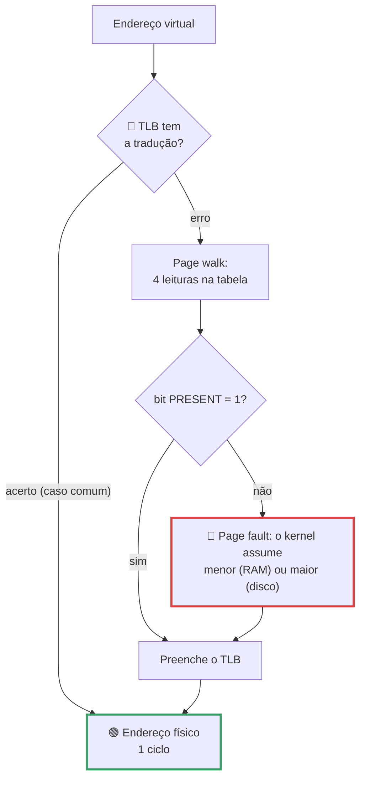
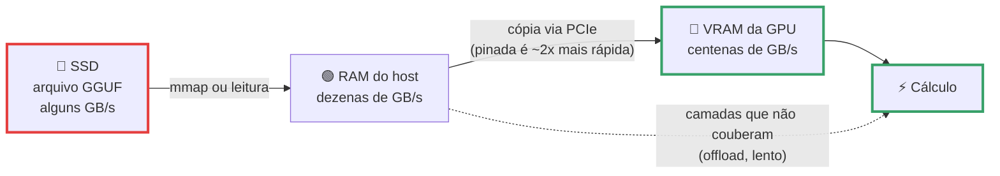

# Gerenciamento de Memória

> [!quote] Todo processo acha que a máquina é só dele
> *Rode dois programas iguais ao mesmo tempo no seu Linux e peça o endereço da mesma variável global. Os dois respondem o mesmo número, `0x555555558010`, e ainda assim guardam valores diferentes lá dentro sem nunca se atrapalharem. Essa mentira coordenada, sustentada por uma tabela em RAM e um circuito dentro da CPU, é o que permite o seu notebook rodar 300 processos com 16 GB, e o que decide se um modelo de 7 bilhões de parâmetros cabe na sua máquina.*

> [!abstract] 🧭 O que você vai fazer nesta aula
> Provar que dois processos usam o mesmo endereço sem conflito, ver o `malloc` virar `mmap` no `strace`, traduzir um endereço na mão e conferir no simulador da OSTEP, contar page faults, medir copy-on-write com `smaps_rollup`, ler o mapa do seu processo em `/proc/self/maps`, abrir o VMMap no Windows e calcular por que um LLM de 7B em FP16 não entra em 8 GB. Ambiente: Ubuntu 24.04 (WSL2, VM ou nativo), veja [[Laboratório de SO - preparando o ambiente]].

Na aula anterior, [[Escalonamento de Processos]], a disputa era pela CPU. Aqui a pergunta muda: **quem usa a RAM, e como o SO faz cada processo acreditar que ela é toda dele**.

---

## 1. 🧱 O mundo sem abstração de memória

No começo (e ainda hoje, num microcontrolador ou num bootloader) o programa enxerga a memória física crua: o endereço da instrução é o endereço que vai para os pinos da RAM. Simples, rápido e desastroso assim que você quer rodar **dois** programas, porque ambos foram compilados achando que começam no endereço 0.

A saída clássica de hardware, anterior à paginação, foram dois registradores na CPU: o **base** (onde começa a região do processo na memória física) e o **limite** (o tamanho dela). A cada acesso o hardware calcula:

$$\text{endereço físico} = \text{base} + \text{endereço virtual}, \quad \text{se } \text{endereço virtual} < \text{limite}$$

Se estourar o limite, a CPU dispara uma exceção e o SO mata o processo. Um somador e um comparador resolvem **realocação** (carregar o programa em qualquer lugar) e **proteção** (um processo não alcança o outro). O preço: cada processo precisa de um bloco **contíguo** de memória física.

> [!example] 🧪 Atividade 1: provar que o endereço virtual é uma mentira útil
> **Ferramenta:** `gcc` e `setarch` (pacote `util-linux`, já vem no Ubuntu).
>
> 1. Crie `espaco.c`, compile e rode **duas cópias ao mesmo tempo** com a aleatorização de endereços desligada:
>    ```c
>    #include <stdio.h>
>    #include <unistd.h>
>    int global = 42;
>    int main(void) {
>        printf("pid=%d &global=%p global=%d\n", getpid(), (void *)&global, global);
>        global = getpid(); sleep(3);
>        printf("pid=%d &global=%p global=%d\n", getpid(), (void *)&global, global);
>        return 0;
>    }
>    ```
>    ```bash
>    gcc -O0 -o espaco espaco.c
>    (setarch -R ./espaco & setarch -R ./espaco & wait)
>    ```
>
> **Resultado esperado:** os dois processos imprimem **o mesmo endereço** e valores diferentes. Saída real desta máquina:
> ```text
> pid=55147 &global=0x555555558010 global=42
> pid=55148 &global=0x555555558010 global=42
> pid=55147 &global=0x555555558010 global=55147
> pid=55148 &global=0x555555558010 global=55148
> ```
> Conclusão a anotar: `0x555555558010` **não existe na RAM**, é um índice numa tabela privada de cada processo.
>
> 🪟 **No Windows:** rode no WSL2. Sem WSL2, abra duas instâncias do mesmo `.exe` no Process Explorer e compare a coluna "Virtual Size".

---

## 2. 🗺️ Espaços de endereçamento, swapping e a gerência dos buracos

Nasce aí o conceito central: o **espaço de endereçamento** (address space), o conjunto de endereços que um processo pode usar, independente da RAM existente.

Quando a soma dos processos não cabe na RAM, a solução histórica foi o **swapping** (troca): mover o processo inteiro para o disco e trazer de volta depois. Como processos de tamanhos diferentes entram e saem, a memória vira um queijo suíço. Isso é **fragmentação externa**: sobra memória total, mas nenhum buraco contíguo grande o bastante.

O SO precisa saber quais pedaços estão livres (**mapa de bits**, 1 bit por unidade de alocação, ou **lista encadeada** de segmentos) e escolher **qual** buraco usar. Com buracos de **20, 15, 40, 10 e 25 MiB** nessa ordem e um pedido de **12 MiB**:

| Algoritmo | Escolhe | Sobra | Efeito colateral |
|---|---|---|---|
| **First fit** (o primeiro que serve) | 20 MiB | 8 MiB | Rápido, é o baseline |
| **Next fit** (idem, a partir de onde parou) | 20 MiB | 8 MiB | Espalha a fragmentação pela memória toda |
| **Best fit** (o menor que serve) | 15 MiB | 3 MiB | Varre tudo e **cria cacos inúteis** de 3 MiB |
| **Worst fit** (o maior de todos) | 40 MiB | 28 MiB | Destrói os buracos grandes, os mais valiosos |

Há ainda o *quick fit*, com listas separadas por faixa de tamanho: aloca rápido, mas fundir buracos vizinhos fica caro. A intuição engana: *best fit* parece o mais educado e, em simulação, costuma perder para o *first fit*, porque enche a memória de fragmentos minúsculos (Tanenbaum & Bos, cap. 3).

Hoje o seu programa fala com o **alocador da biblioteca C**, que gerencia um bloco grande obtido do kernel por duas portas: **`brk`/`sbrk`** empurra o topo do heap alguns quilobytes para cima (as alocações pequenas) e **`mmap`** pede uma região nova e independente, devolvível sozinha depois. O glibc troca `brk` por `mmap` acima de um limiar dinâmico (`M_MMAP_THRESHOLD`, em `man 3 mallopt`).

> [!example] 🧪 Atividade 2: flagrar o `malloc` pedindo memória ao kernel
> **Ferramenta:** `strace` (`sudo apt install strace`).
>
> 1. Aloque meio gigabyte de uma vez e filtre só as chamadas de memória:
>    ```bash
>    strace -e trace=brk,mmap python3 -c "x=bytearray(500_000_000)" 2>&1 | tail -8
>    ```
> 2. Repita com `x=bytearray(1000)`.
>
> **Resultado esperado:** para 500 MB aparece **uma** linha de `mmap` anônimo (saída real):
> ```text
> brk(0x64a16b3ca000)                     = 0x64a16b3ca000
> mmap(NULL, 500002816, PROT_READ|PROT_WRITE, MAP_PRIVATE|MAP_ANONYMOUS, -1, 0) = 0x774200cc3000
> ```
> Note o `MAP_ANONYMOUS` (memória sem arquivo por trás) e o fd `-1`. Para 1000 bytes não aparece nada novo: coube no heap que o interpretador já tinha. Entregue as duas saídas e responda: por que o kernel recebeu 500002816 e não 500000000?
>
> 🪟 **No Windows:** WSL2 roda igual. Nativo o equivalente é `VirtualAlloc`/`HeapAlloc`, visível no VMMap (atividade 7) como "Private Data" e "Heap". Sobre essas chamadas, veja [[Chamadas de Sistema]].

---

## 3. 📄 Memória virtual e paginação

Swapping de processo inteiro morreu porque é tudo ou nada. A ideia que venceu foi a **paginação**: quebrar o espaço de endereçamento em pedaços de tamanho fixo e mapear cada um, individualmente, para qualquer lugar da RAM (ou para lugar nenhum).

- **Página** (page): o pedaço no espaço **virtual**, 4 KiB por padrão em x86-64.
- **Moldura** (page frame): o pedaço do mesmo tamanho na memória **física**.
- **Tabela de páginas**: o dicionário página → moldura, um por processo, mantido pelo SO.
- **MMU** (Memory Management Unit): o circuito da CPU que traduz em toda instrução, sem software no meio.

![[Recursos/Sistemas operacionais/Gerenciamento de Memória/memoria-virtual-espacos.png|Cada processo tem um espaço virtual contíguo (à esquerda). O SO espalha as páginas pela RAM, entremeadas com as de outros processos, e algumas nem estão na RAM: foram para o disco (Wikimedia Commons)]]

### Traduzindo um endereço na mão

Com página de 4 KiB os 12 bits de baixo do endereço são o **deslocamento** dentro da página (porque `2^12 = 4096`) e o resto é o **número da página virtual** (VPN):

$$\text{VPN} = \left\lfloor \frac{\text{endereço virtual}}{4096} \right\rfloor \qquad \text{deslocamento} = \text{endereço virtual} \bmod 4096$$

Exemplo clássico do Tanenbaum, endereço virtual **8196**, com a página 2 morando na **moldura 6**:

$$8196 = 2 \times 4096 + 4 \;\Rightarrow\; \text{VPN} = 2,\ \text{desloc.} = 4 \;\Rightarrow\; \text{físico} = 6 \times 4096 + 4 = 24580$$

O deslocamento **nunca é traduzido**: passa direto do virtual para o físico. Por isso o tamanho da página é sempre potência de 2, e a divisão vira um corte de bits, de graça, no hardware.

### O que cabe dentro de uma entrada da tabela

Uma entrada (PTE, *page table entry*) do x86-64 tem 64 bits. Os nomes são os do kernel Linux (`arch/x86/include/asm/pgtable_types.h`):

| Bit | Nome no kernel | Significado | Quem escreve |
|---|---|---|---|
| 0 | `_PAGE_BIT_PRESENT` | A página está na RAM. Se for 0, o acesso causa **page fault** | SO |
| 1 e 2 | `_PAGE_BIT_RW`, `_PAGE_BIT_USER` | Permite escrita; acessível em modo usuário | SO |
| 5 | `_PAGE_BIT_ACCESSED` | "Foi acessada" (**bit de referência**) | **CPU** |
| 6 | `_PAGE_BIT_DIRTY` | "Foi escrita" (**bit de modificação**) | **CPU** |
| 7 | `_PAGE_BIT_PSE` | É uma página grande (2 MiB ou 1 GiB) | SO |
| 12 a 51 | (endereço) | Número da moldura física | SO |
| 63 | `_PAGE_BIT_NX` | Proibido executar código daqui (defesa contra shellcode) | SO |

Os bits 3 e 4 controlam cache e o 8 (`GLOBAL`) evita invalidar a entrada no TLB ao trocar de processo. Guarde os dois escritos pela **CPU**: é lendo `ACCESSED` e `DIRTY` que o SO descobre quais páginas estão em uso e quais precisam ser gravadas antes de despejadas, assunto da próxima aula.

![[Recursos/Sistemas operacionais/Gerenciamento de Memória/tabela-de-paginas-acoes.png|As três saídas possíveis de uma tradução: acerto no TLB, acerto na tabela de páginas, ou página ausente, que exige ir ao disco (Wikimedia Commons)]]

### Page fault: o menor e o maior

Um **page fault** (falta de página) é a exceção disparada quando o bit `PRESENT` está zerado. Nem toda falta é ruim:

| Tipo | O que faltava | Custo típico | Quando acontece |
|---|---|---|---|
| **Minor** (menor) | Só a **entrada** na tabela; o dado já está na RAM ou é página nova zerada | Centenas de ns | Primeiro toque em memória recém-alocada, arquivo já no page cache, copy-on-write |
| **Major** (maior) | O **dado**, que precisa vir do disco | Dezenas a milhares de µs | Executável lido pela primeira vez, página que foi para o swap |

O Linux só entrega memória de verdade quando você **toca** nela (*demand paging*). Por isso `bytearray(500_000_000)` mede meio giga de RSS e cerca de 122 mil faltas menores: são 122.070 páginas de 4 KiB, uma falta cada.

> [!example] 🧪 Atividade 3: contar faltas de página e traduzir endereços
> **Ferramenta:** `/usr/bin/time -v` (o binário, não o `time` do bash), `perf` e o simulador `paging-linear-translate.py` do [OSTEP](https://pages.cs.wisc.edu/~remzi/OSTEP/).
>
> 1. ```bash
>    getconf PAGESIZE
>    /usr/bin/time -v python3 -c "x=bytearray(500_000_000)" 2>&1 | grep -Ei 'Maximum resident|page faults'
>    ```
> 2. Divida as faltas menores pelo número de páginas da alocação e veja se bate. Repita com `bytearray(1_000_000_000)`: o número dobra.
> 3. Traduza endereços de verdade no simulador:
>    ```bash
>    git clone https://github.com/remzi-arpacidusseau/ostep-homework
>    python3 ostep-homework/vm-paging/paging-linear-translate.py -P 4k -a 16k -p 32k -v -n 5 -s 7
>    ```
>    Faça os 5 **no papel** (separe VPN e deslocamento, procure a VPN na tabela impressa), confira com `-c` no fim do comando e repita com `-P 1k`.
>
> **Resultado esperado:** saída real desta máquina, com zero faltas maiores e uma falta menor por página de 4 KiB:
> ```text
> Maximum resident set size (kbytes): 496256
> Major (requiring I/O) page faults: 0
> Minor (reclaiming a frame) page faults: 122878
> ```
> Entregue a conta e a sua tabela de traduções batendo 5 de 5 com o `-c`. Pelo contador de hardware: `perf stat -e page-faults,minor-faults,major-faults -- python3 -c "x=bytearray(500_000_000)"` (se reclamar de `perf_event_paranoid`, rode `sudo sysctl kernel.perf_event_paranoid=1`).
>
> 🪟 **No Windows:** WSL2 roda idêntico, e o simulador é Python puro (roda no PowerShell). Nativo, o Process Explorer tem "Page Faults" e "Page Fault Delta" em View → Select Columns → Process Performance.

### Copy-on-write: o `fork` que não copia nada

Quando um processo faz `fork()`, o Linux **não** duplica a memória: copia só a tabela de páginas, marca tudo como somente leitura nos dois lados e espera. Na primeira escrita a MMU dispara um page fault, o kernel duplica **aquela página** e libera a escrita. É o **copy-on-write** (COW), e sem ele um `fork` de um processo de 4 GB seria impraticável. Detalhes do `fork` em [[Processos]].

> [!example] 🧪 Atividade 4: medir copy-on-write com `smaps_rollup`
> **Ferramenta:** `/proc/PID/smaps_rollup` (kernel 4.14+), Python.
>
> 1. Salve como `cow.py` e rode com `python3 cow.py`:
>    ```python
>    import os, re, time
>    def rollup(pid):
>        txt = open(f"/proc/{pid}/smaps_rollup").read()
>        return re.findall(r"(?:Rss|Pss|Shared_Dirty):\s+\d+ kB", txt)
>    buf = bytearray(200 * 1024 * 1024)
>    for i in range(0, len(buf), 4096):
>        buf[i] = 1
>    if os.fork() == 0:
>        time.sleep(0.3); os._exit(0)
>    time.sleep(0.2); print("com filho vivo:", rollup(os.getpid()))
>    os.wait();       print("filho morreu:  ", rollup(os.getpid()))
>    ```
>
> **Resultado esperado:** o RSS **não muda**, mas o PSS praticamente dobra quando o filho morre. Saída real (kB):
> ```text
> com filho vivo: Rss=213200 Pss=104398 Shared_Dirty=207276
> filho morreu:   Rss=213328 Pss=208055 Shared_Dirty=0
> ```
> Os 200 MB existem **uma vez só** na RAM enquanto os dois processos vivem: cada um paga metade no PSS. Explique por escrito por que `Shared_Dirty` zerou.
>
> 🪟 **No Windows:** não há `fork`; o `CreateProcess` carrega a imagem do zero. O equivalente conceitual é o compartilhamento de DLLs, visível no VMMap como "Shareable WS".

---

## 4. ⚡ Acelerando: TLB, tabelas multinível e páginas grandes

Duas contas mostram por que a paginação ingênua não funcionaria.

**Problema 1: a tabela não cabe.** Em x86-64 com 4 níveis o espaço virtual usa 48 bits. Uma tabela linear teria:

$$\frac{2^{48}}{2^{12}} = 2^{36}\ \text{entradas} \times 8\ \text{bytes} = 2^{39}\ \text{bytes} = 512\ \text{GiB}$$

Meio terabyte de tabela **por processo**, para mapear um espaço quase todo vazio. **Problema 2: a tradução dobra o custo**, porque a tabela também está na memória.

### Solução 1: tabelas multinível

Só se materializa o pedaço da tabela em uso. O x86-64 quebra os 48 bits em quatro índices de 9 bits mais o deslocamento de 12 (`9+9+9+9+12 = 48`). Cada nível tem 512 entradas de 8 bytes, ou seja **exatamente uma página de 4 KiB**. Os nomes na Intel são PML4, PDPT, PD e PT; no Linux, `pgd`, `p4d`/`pud`, `pmd` e `pte`.

![[Recursos/Sistemas operacionais/Gerenciamento de Memória/paginacao-x86-64-4-niveis.png|Os quatro níveis da tradução em x86-64 com páginas de 4 KiB: cada índice de 9 bits seleciona uma entrada, e a última aponta a moldura física (Wikimedia Commons)]]

O endereço `0x00007F3A2B4C5678` se decompõe em: PML4 (bits 47 a 39) = 254, PDPT (38 a 30) = 232, PD (29 a 21) = 346, PT (20 a 12) = 197 e deslocamento (11 a 0) = 1656, ou `0x678`.

Um processo que usa 1 MB precisa de 4 tabelas de 4 KiB, não de 512 GiB. O preço é que uma tradução sem cache custa **quatro leituras de memória** antes do acesso de verdade: é o *page table walk*. Com 5 níveis (LA57, opcional desde Ice Lake) o espaço virtual vai a 57 bits, "128 PiB of virtual" e "4 PiB of physical" na doc do kernel; por compatibilidade o Linux não entrega nada acima de 47 bits sem um *hint* explícito no `mmap`.

### Solução 2: TLB

O **TLB** (Translation Lookaside Buffer) é uma cache associativa dentro da MMU que guarda as últimas traduções página → moldura. Acerto = tradução em um ciclo. Erro = *page walk* de quatro leituras.

![[Recursos/Sistemas operacionais/Gerenciamento de Memória/tlb-fluxo.png|O caminho de um endereço virtual: TLB primeiro; no erro, a tabela de páginas; se a página não estiver presente, o disco, e o resultado volta atualizando os dois níveis (Wikimedia Commons, Arilou, CC BY-SA 4.0)]]



O TLB é, nas palavras da doc do kernel, "a pretty scarce resource": tem poucas entradas e é disputado. Dois detalhes. O **PCID/ASID** marca cada entrada com o processo dono, para que a troca de contexto (troca do registrador CR3) não invalide o TLB inteiro. E o **KPTI**, a mitigação do Meltdown, mantém **duas** tabelas por processo e troca CR3 a cada chamada de sistema, algo "on the order of a hundred cycles"; sem PCID, cada chamada esvaziava o TLB. Brendan Gregg mediu entre 0,1% e 6% de overhead na maioria das cargas: segurança de hardware sai do orçamento de memória.

### Solução 3: páginas grandes

Se uma entrada de TLB cobre 4 KiB, um programa que percorre 2 GB esgota o TLB o tempo todo. O x86-64 permite parar a tradução mais cedo e usar **páginas de 2 MiB** (nível PMD) ou **1 GiB** (nível PUD): uma entrada passa a cobrir 512 vezes mais memória. No Linux isso é automático via **THP** (Transparent Huge Pages), com os modos `always`, `madvise` e `never`, e nos kernels recentes há o **mTHP**, com tamanhos intermediários em `hugepages-64kB/` e afins. O outro lado: páginas grandes desperdiçam memória por fragmentação interna.

> [!example] 🧪 Atividade 5: páginas grandes e a máquina inteira sob carga
> **Ferramenta:** `/sys/kernel/mm/transparent_hugepage/`, `/proc/vmstat`, `free`, `vmstat` e `stress-ng` (`sudo apt install stress-ng`).
>
> 1. Estado inicial: `cat /sys/kernel/mm/transparent_hugepage/enabled`, `grep thp_fault_alloc /proc/vmstat` e `free -h -w`.
> 2. Em outro terminal, segure 1 GB por 2 minutos e anote o PID:
>    ```bash
>    python3 -c "import time; x=bytearray(1024**3); time.sleep(120)" & echo $!
>    ```
> 3. Com esse PID: `grep -E 'Rss|AnonHugePages' /proc/PID/smaps_rollup` e `grep thp_fault_alloc /proc/vmstat` de novo.
> 4. Agora pressione a máquina de verdade, com `vmstat 1` rodando ao lado:
>    ```bash
>    stress-ng --vm 2 --vm-bytes 40% --timeout 60s --metrics-brief
>    ```
>
> **Resultado esperado:** o `enabled` mostra algo como `always [madvise] never` (aqui o ativo é `madvise`); `AnonHugePages` diz quanto do 1 GB virou página de 2 MiB, e se der 0 no modo `madvise` você explica por quê (o Python não chamou `madvise(MADV_HUGEPAGE)`). No passo 4, anote `free`, `cache` e as colunas `si`/`so` (swap in/out) do `vmstat`, e explique por que `available` (27 Gi nesta máquina) é muito maior que `free` (466 Mi): quase toda a RAM "livre" é page cache, devolvida na hora se alguém precisar.
>
> 🪟 **No Windows:** páginas grandes exigem o privilégio "Bloquear páginas na memória" (secpol.msc), e o VMMap tem a linha "Page Table". Para a carga, use Gerenciador de Tarefas → Desempenho → Memória ("Em cache" equivale ao `cache` do Linux).

---

## 5. 🐧 O espaço de endereçamento real de um processo Linux

O Linux expõe o mapa de qualquer processo em `/proc/PID/maps`. Esta é a saída **real** de `cat /proc/self/maps`, o mapa do próprio `cat` enquanto ele se lê:

```text
5c9267c71000-5c9267c75000 r-xp 00002000 103:02 9437316   /usr/bin/cat   <- TEXT (código, executável)
5c9267c78000-5c9267c79000 rw-p 00008000 103:02 9437316   /usr/bin/cat   <- DATA + BSS
5c928808c000-5c92880ad000 rw-p 00000000 00:00 0          [heap]         <- heap (cresce com brk)
7917a8028000-7917a81bd000 r-xp 00028000 103:02 9439351   .../libc.so.6  <- código da libc (compartilhado)
7917a821a000-7917a821c000 rw-p 00219000 103:02 9439351   .../libc.so.6  <- dados privados da libc
7917a821c000-7917a8229000 rw-p 00000000 00:00 0                         <- anônima (mmap do malloc)
7fff9931a000-7fff9933b000 rw-p 00000000 00:00 0          [stack]        <- pilha (cresce para baixo)
7fff993a2000-7fff993a4000 r-xp 00000000 00:00 0          [vdso]         <- "biblioteca" injetada pelo kernel
```

Cada linha é uma **VMA** (Virtual Memory Area), região com os mesmos atributos. Os campos, em ordem: intervalo de endereços virtuais, permissões (`r`, `w`, `x`, e `p` de privada com COW ou `s` de compartilhada), deslocamento dentro do arquivo, dispositivo `major:minor`, inode e caminho.

![[Recursos/Sistemas operacionais/Gerenciamento de Memória/layout-memoria-processo.png|O layout clássico: código (text) embaixo, dados inicializados (data), não inicializados (bss), heap crescendo para cima e pilha crescendo para baixo (Wikimedia Commons)]]

Duas coisas que o desenho clássico não mostra: as **bibliotecas compartilhadas** ficam num bloco no meio (a região de `mmap`), e o **vDSO** é uma biblioteca minúscula que o kernel injeta em todo processo para que chamadas como `clock_gettime` não precisem entrar no modo kernel.

### VSZ, RSS, PSS e USS: quatro respostas para "quanta memória esse processo usa?"

| Métrica | O que conta | Onde ver |
|---|---|---|
| **VSZ / VmSize** | Tudo que foi **mapeado**, tocado ou não. Quase inútil sozinho | `top` (VIRT), `/proc/PID/status` |
| **RSS / VmRSS** | Páginas **residentes** na RAM agora. **Conta em dobro** o compartilhado | `ps` (RSS), `top` (RES) |
| **PSS** | RSS com cada página compartilhada dividida pelo nº de donos. A métrica honesta para somar processos | `smaps_rollup`, `smem` |
| **USS** | Só o exclusivo do processo. É o que você libera de fato ao matá-lo | `smem` |

Um exemplo real: o bash desta sessão tem `VmSize: 1266132 kB` (1,2 GB **virtual**) e `VmRSS: 7152 kB` (7 MB de verdade). A diferença de 170 vezes separa uma métrica de marketing de uma métrica de operação.

**ASLR.** Se o endereço da pilha fosse sempre o mesmo, escrever um exploit seria trivial. O **ASLR** (Address Space Layout Randomization) sorteia a posição da pilha, do heap e das bibliotecas a cada execução. Rodando `grep '\[stack\]' /proc/self/maps` duas vezes seguidas, saída real:

```text
ASLR ligado (padrão):        7fff01993000  e depois  7fff9f99b000
ASLR desligado (setarch -R): 7ffffffde000  e depois  7ffffffde000
```

O nível fica em `/proc/sys/kernel/randomize_va_space` (0 desligado, 1 parcial, 2 completo, o padrão). Mais sobre isso em [[Segurança em Sistemas Operacionais]].

> [!example] 🧪 Atividade 6: mapear o seu próprio shell
> **Ferramenta:** `/proc`, `pmap` e `smem` (`sudo apt install smem`).
>
> 1. ```bash
>    cat /proc/$$/maps
>    pmap -x $$ | tail -20
>    grep -E 'VmPeak|VmSize|VmHWM|VmRSS|RssAnon|RssFile|VmSwap' /proc/$$/status
>    cat /proc/$$/smaps_rollup
>    ```
> 2. Localize no `maps` do seu bash: a região `r-xp` do binário, o `[heap]`, o `[stack]`, o `[vdso]` e pelo menos duas bibliotecas.
> 3. Confirme a identidade `VmRSS = RssAnon + RssFile + RssShmem`.
> 4. Ranking honesto de toda a máquina: `smem -t -k -s pss | tail -15`. Compare PSS e RSS do seu navegador.
>
> **Resultado esperado:** uma tabela sua com VSZ, RSS e PSS, a soma do item 3 fechando, cada região identificada e a explicação da diferença entre `Rss` e `Pss`. Nesta máquina o bash deu `Rss: 1504 kB` e `Pss: 148 kB`, dez vezes menos, porque quase tudo são bibliotecas compartilhadas com o sistema.
>
> 🪟 **No Windows:** WSL2 tem `/proc` completo. Nativo, as colunas Total WS, Private WS e Shareable WS do VMMap são RSS, USS e a parte compartilhada.

---

## 6. 🪟 E no Windows

O vocabulário muda, a mecânica é a mesma: o Windows também usa paginação de 4 KiB com quatro níveis em x86-64.

| Conceito Linux | Conceito Windows | Detalhe |
|---|---|---|
| RSS / USS | **Working set** / **Private working set** | Páginas do processo na RAM agora, e a parte exclusiva |
| VSZ | **Virtual size** | Tudo que foi reservado ou confirmado |
| Falta menor | **Soft page fault** | A página está na RAM (standby list, demand-zero) |
| Falta maior | **Hard page fault** | Precisa de E/S no backing store |
| Swap | **Pagefile** (`pagefile.sys`) | Arquivo, não partição |
| `Committed_AS` / `overcommit_memory` | **Commit charge** / **Commit limit** | O que o sistema prometeu, e o teto (RAM mais os pagefiles) |

Duas particularidades que caem em prova e em entrevista:

- **Memória comprometida não é memória usada.** O commit charge conta o que o sistema **prometeu**, mesmo nunca tocado. Quando chega a 90% do commit limit, o Windows aumenta o pagefile sozinho, até 3 vezes o tamanho da RAM ou 4 GB, o que for maior.
- **Working set é ajustável.** Um *working set manager* apara o conjunto de trabalho sob pressão, mandando páginas para a standby list antes do disco. É por isso que minimizar uma janela derruba o número no Gerenciador de Tarefas sem o programa perder nada.

![[Recursos/Sistemas operacionais/Gerenciamento de Memória/vmmap-windows.png|VMMap (Sysinternals) dividindo um processo do Explorer em Image, Mapped File, Shareable, Heap, Stack, Private Data e Page Table, com as colunas Total WS, Private WS e Shareable WS (Microsoft Learn)]]

> [!example] 🧪 Atividade 7: dissecar um processo com o VMMap
> **Ferramenta:** [VMMap](https://learn.microsoft.com/en-us/sysinternals/downloads/vmmap) e [RAMMap](https://learn.microsoft.com/en-us/sysinternals/downloads/rammap) (Sysinternals, gratuitos, sem instalação).
>
> 1. Execute o VMMap como administrador e escolha uma aba do Chrome ou do Edge (`chrome.exe`/`msedge.exe`).
> 2. Anote as linhas **Image**, **Heap**, **Private Data**, **Stack** e **Page Table** nas colunas Size, Committed, Private e Total WS.
> 3. Responda com números: quanto do processo é código compartilhado (Image mais Shareable) e quanto é dado privado? Quanto custam as **tabelas de páginas** desse processo?
> 4. No RAMMap, aba **Use Counts**, compare o total físico com a soma dos working sets.
>
> **Resultado esperado:** um print do VMMap com os cinco números e uma frase explicando por que a soma dos working sets de todos os processos é maior que a RAM instalada (resposta: compartilhamento, o que o PSS resolve no Linux).
>
> 🐧 **No Linux:** o par equivalente é `pmap -X PID` e `cat /proc/meminfo`. Se só tiver Linux, conte as VMAs do navegador: `wc -l < /proc/$(pgrep -n firefox)/maps`.

---

## 7. 🤖 Memória na era da IA

Aqui o conteúdo de 1970 decide se você consegue rodar um modelo em 2026. Um LLM (Large Language Model) é, para o SO, **um arquivo grande de números que precisa estar em memória para ser multiplicado milhões de vezes por segundo**. Onde ele fica muda tudo:



O tamanho dos pesos é aritmética de primeiro grau:

$$\text{bytes} \approx N_{\text{parâmetros}} \times \frac{\text{bits por parâmetro}}{8}$$

| Precisão (modelo de 7B) | Bits por peso | Tamanho dos pesos | Cabe numa GPU de 8 GB? |
|---|---|---|---|
| FP16 / BF16 (treino) | 16 | 14,0 GB (13,0 GiB) | ❌ Nem perto |
| INT8 / Q8_0 | 8 | 7,0 GB (6,5 GiB) | ⚠️ No limite, sem espaço para o KV cache |
| INT4 / Q4_K_M | 4 | 3,5 GB (3,3 GiB) | ✅ Com folga |

**Quantização é um problema de gerência de memória**: trocar precisão numérica por espaço. Os arquivos GGUF reais do Llama 3.1 8B confirmam a conta (o excedente é metadado e camadas em precisão maior): F32 32,13 GB, Q8_0 8,54 GB, Q5_K_M 5,73 GB, Q4_K_M 4,92 GB, Q2_K 3,18 GB. E os pesos são metade da história: o **KV cache** (o rascunho da atenção) cresce com o contexto e com o lote, e costuma ser ele que estoura a memória em produção.

Quatro conceitos desta aula, aplicados:

- **`mmap` dos pesos.** O llama.cpp mapeia o arquivo GGUF em vez de lê-lo para um buffer. As páginas entram no **page cache** sob demanda e aparecem como `RssFile` e `Shared_Clean` no `smaps`, por isso a **segunda** carga do mesmo modelo é quase instantânea. A flag `--no-mmap` carrega tudo para memória anônima (`RssAnon`, `Private_Dirty`), mais lento mas imune a despejo; `--mlock` prende as páginas na RAM (`Locked`).
- **Memória pinada (page-locked).** A GPU não lida com paginação: para copiar da RAM paginável para a VRAM, o driver precisa antes copiar para um buffer travado. Alocar direto em memória pinada (`cudaMallocHost`) elimina essa cópia: 2,31 GB/s (paginável) contra 5,77 GB/s (pinada), na medição da NVIDIA.
- **Memória unificada.** Quando CPU e GPU compartilham a **mesma tabela de páginas** e a mesma memória física, o offload deixa de ser drama: é o caso do Apple Silicon (até 512 GB no M3 Ultra) e do NVIDIA Grace Hopper, com NVLink-C2C a 900 GB/s, 7 vezes o PCIe Gen5.
- **Paginação dentro do servidor de inferência.** O vLLM implementou o **PagedAttention**, descrito no artigo do SOSP 2023 como "inspirado em memória virtual e paginação": o KV cache vira blocos de tamanho fixo mapeados por uma tabela, com desperdício quase zero e 2 a 4 vezes mais throughput. Quando o hardware não paginava do jeito de que precisavam, os autores **reimplementaram a paginação em software**. Mais disso em [[Sistemas Operacionais na Era da IA]].

> [!example] 🧪 Atividade 8: onde mora o seu modelo
> **Ferramenta:** [Ollama](https://ollama.com) (ou `llama.cpp`), `smaps_rollup`, `free -h`.
>
> 1. Baixe um modelo pequeno: `ollama run qwen3:0.6b "diga oi"` (menos de 1 GB).
> 2. Antes e depois de carregar, rode `free -h -w` e anote `free` e `cache`.
> 3. Leia a memória de verdade do processo:
>    ```bash
>    pgrep -a ollama
>    grep -E 'Rss|Pss|Shared_Clean|Private_Dirty|Locked' /proc/PID/smaps_rollup
>    ollama ps
>    ```
> 4. Descarregue (`ollama stop qwen3:0.6b`), carregue de novo e **cronometre as duas cargas** com `time`.
>
> **Resultado esperado:** uma tabela com o tamanho do arquivo do modelo, `Rss`, `Shared_Clean` (a parte que veio do `mmap`), `Private_Dirty` e a coluna PROCESSOR do `ollama ps` (100% GPU, 100% CPU ou dividido). A segunda carga deve ser bem mais rápida: explique por quê, usando a expressão **page cache**.
>
> 🪟 **No Windows:** o Ollama tem instalador nativo; use o VMMap no `ollama.exe` e compare "Mapped File" com o tamanho do `.gguf`. Sem GPU nem RAM sobrando, faça a atividade só com a **conta**: escolha um modelo no Hugging Face, some pesos mais KV cache e diga em qual quantização ele caberia no seu notebook.

> [!example] 🧪 Atividade 9: provocar um OOM controlado (e sobreviver)
> **Ferramenta:** `systemd-run` com cgroup v2 (systemd 255 no Ubuntu 24.04).
>
> 1. Rode um programa faminto dentro de uma caixa de 200 MB:
>    ```bash
>    systemd-run --user --scope -p MemoryMax=200M python3 -c "x=bytearray(500_000_000)"
>    ```
> 2. Veja o veredito do kernel: `journalctl -k -n 20 | grep -i -E 'out of memory|killed process'`
> 3. Repita com `-p MemoryMax=800M` e confirme que agora passa.
> 4. Durante o passo 1, em outro terminal: `cat /proc/pressure/memory`
>
> **Resultado esperado:** no passo 1 o processo morre com "Killed" e o `journalctl` mostra a linha do OOM killer com o nome do cgroup; no passo 3 ele completa. Anote as linhas `some` e `full` do `/proc/pressure/memory`: medem quanto tempo as tarefas ficaram **paradas esperando memória**, o sinal que um SRE observa antes do desastre. Se o `--user` reclamar de delegação, repita com `sudo` e sem ele.
>
> 🪟 **No Windows:** o equivalente é um Job Object com limite de memória, ou o WSL2 (que já usa cgroups). Com Docker: `docker run --rm -m 200m python:3-slim python -c "x=bytearray(500_000_000)"` termina com exit code 137. Mais sobre cgroups em [[Containers e Virtualização]].

> [!tip] 💼 Por que isso cai em entrevista
> "O modelo não cabe" é o primeiro incidente na vida de quem trabalha com MLOps, e "o container morreu com exit 137" é o segundo. Vagas de SRE/DevOps no Brasil tinham mediana de R\$ 10.438 por mês em jun/2026 (Glassdoor BR), e a conversa técnica passa por aqui: diferença entre RSS e PSS, o que o OOM killer olha e por que `free` mostrar pouca memória livre não é problema. Estas atividades são o roteiro do trabalho prático de memória em [[Possíveis trabalhos e projetos de Sistemas Operacionais]].

---

## ❓ Quiz rápido

> [!question]- 1. Com páginas de 4 KiB, a que página virtual e deslocamento corresponde o endereço virtual 20488?
> **Resposta:** página 5, deslocamento 8, porque 20488 = 5 x 4096 + 8. Se a página 5 estiver na moldura 3, o endereço físico é 3 x 4096 + 8 = 12296. O deslocamento nunca muda na tradução.

> [!question]- 2. Um processo tem VSZ de 1,2 GB e RSS de 7 MB. Ele está com vazamento de memória?
> **Resposta:** Não há evidência disso. O VSZ conta tudo que foi **mapeado**, incluindo regiões nunca tocadas (bibliotecas inteiras, arenas de `malloc`, pilhas de threads). Só o RSS mede páginas residentes. Para responder de verdade, acompanhe `VmHWM` e o PSS ao longo do tempo.

> [!question]- 3. (V/F) Toda falta de página (page fault) implica uma leitura de disco.
> **Resposta:** **Falso.** A maioria são faltas **menores**: primeiro toque em memória recém-alocada (o kernel entrega uma página zerada), arquivo já no page cache, ou escrita em página marcada como copy-on-write. Só a falta **maior** exige E/S. Na atividade 3 foram 122.878 menores e **zero** maiores.

> [!question]- 4. Por que o x86-64 usa quatro níveis de tabela em vez de uma tabela linear?
> **Resposta:** Uma tabela linear para 48 bits com páginas de 4 KiB teria 2^36 entradas de 8 bytes, ou seja **512 GiB por processo**, quase toda vazia. Com 4 níveis de 9 bits, cada tabela ocupa exatamente uma página de 4 KiB e só os ramos usados existem: um processo pequeno gasta alguns KiB. O custo é o page walk de 4 leituras quando o TLB erra.

> [!question]- 5. Depois de um `fork()`, pai e filho somam RSS de 400 MB, mas o `free -h` não mudou. Explique.
> **Resposta:** **Copy-on-write.** O `fork` copiou só a tabela de páginas; as páginas físicas são as mesmas, marcadas como somente leitura nos dois processos, e o RSS conta cada uma duas vezes. O **PSS** divide a página compartilhada pelo número de donos e revela a verdade: na atividade 4, RSS de 213 MB com PSS de 104 MB, que só volta a 208 MB quando o outro processo morre.

---

## 🔗 Veja também

- [[Escalonamento de Processos]]: a aula anterior, sobre o outro recurso disputado, a CPU.
- [[Processos]]: o dono do espaço de endereçamento, e o `fork` que motiva o copy-on-write.
- [[Chamadas de Sistema]]: `brk`, `mmap`, `madvise` e `mlock` vistas por dentro.
- [[Hardware]]: MMU, caches e hierarquia de memória, a base física desta aula.
- [[Containers e Virtualização]]: cgroups v2 e `memory.max`, usados na atividade 9.
- ➡️ **Próxima aula:** [[Memória Virtual e Substituição de Páginas]], onde a pergunta vira "a RAM acabou, qual página eu tiro?". Os termos desta aula em uma linha cada: [[Glossário de Sistemas Operacionais]].

---

> [!note] 📚 Fontes (2026)
> - Kernel Linux: [Page Tables](https://docs.kernel.org/mm/page_tables.html) · [Concepts overview](https://docs.kernel.org/admin-guide/mm/concepts.html) · [Mapa de memória do x86-64](https://docs.kernel.org/arch/x86/x86_64/mm.html) · [5-level paging](https://docs.kernel.org/arch/x86/x86_64/5level-paging.html) · [Transparent Hugepage e mTHP](https://docs.kernel.org/admin-guide/mm/transhuge.html) · [Page Table Isolation](https://docs.kernel.org/arch/x86/pti.html) · [cgroup v2](https://docs.kernel.org/admin-guide/cgroup-v2.html) · [PSI](https://docs.kernel.org/accounting/psi.html) · [bits da PTE em pgtable_types.h](https://raw.githubusercontent.com/torvalds/linux/master/arch/x86/include/asm/pgtable_types.h)
> - [Brendan Gregg, KPTI/KAISER Meltdown Performance (fev/2018)](https://www.brendangregg.com/blog/2018-02-09/kpti-kaiser-meltdown-performance.html) · [OSTEP, simuladores de paginação](https://github.com/remzi-arpacidusseau/ostep-homework)
> - Man pages: [proc_pid_maps(5)](https://man7.org/linux/man-pages/man5/proc_pid_maps.5.html) · [proc_meminfo(5)](https://man7.org/linux/man-pages/man5/proc_meminfo.5.html) · [pmap(1)](https://man7.org/linux/man-pages/man1/pmap.1.html) · [mallopt(3)](https://man7.org/linux/man-pages/man3/mallopt.3.html) · [time(1)](https://man7.org/linux/man-pages/man1/time.1.html) · [perf-stat(1)](https://man7.org/linux/man-pages/man1/perf-stat.1.html) · [smem(8)](https://manpages.ubuntu.com/manpages/noble/en/man8/smem.8.html)
> - Windows: [Working Set](https://learn.microsoft.com/en-us/windows/win32/memory/working-set) · [Page file e commit limit](https://learn.microsoft.com/en-us/troubleshoot/windows-client/performance/introduction-to-the-page-file) · [VMMap](https://learn.microsoft.com/en-us/sysinternals/downloads/vmmap) · [RAMMap](https://learn.microsoft.com/en-us/sysinternals/downloads/rammap)
> - IA: [llama.cpp](https://github.com/ggml-org/llama.cpp) · [Ollama FAQ](https://docs.ollama.com/faq) · [GGUF do Llama 3.1 8B](https://huggingface.co/bartowski/Meta-Llama-3.1-8B-Instruct-GGUF) · [vLLM PagedAttention, SOSP 2023](https://arxiv.org/abs/2309.06180) · [Memória pinada em CUDA](https://developer.nvidia.com/blog/how-optimize-data-transfers-cuda-cc/) · [Grace Hopper, NVLink-C2C](https://www.nvidia.com/en-us/data-center/grace-hopper-superchip/)
> - Livros: Tanenbaum & Bos, *Sistemas Operacionais Modernos*, 4ª ed., cap. 3; Arpaci-Dusseau, *Operating Systems: Three Easy Pieces* (livre), virtualização de memória.
> - Imagens (Wikimedia Commons): [Virtual memory.svg (Ehamberg, CC BY-SA 3.0)](https://commons.wikimedia.org/wiki/File:Virtual_memory.svg) · [Page table actions.svg (Marcos vicente, CC BY-SA 3.0)](https://commons.wikimedia.org/wiki/File:Page_table_actions.svg) · [X86 Paging 64bit.svg (RokerHRO, CC BY-SA 3.0)](https://commons.wikimedia.org/wiki/File:X86_Paging_64bit.svg) · [TLB.svg (Arilou, CC BY-SA 4.0)](https://commons.wikimedia.org/wiki/File:TLB.svg) · [Program memory layout.svg (Dougct / G. A. G. Díaz, CC BY-SA 3.0)](https://commons.wikimedia.org/wiki/File:Program_memory_layout.svg) · [VMMap (Microsoft Learn)](https://learn.microsoft.com/en-us/sysinternals/downloads/vmmap)
> - As saídas de terminal marcadas como reais foram executadas em Ubuntu com kernel 6.8 em 02/09/2026. Os números da sua máquina vão diferir: é esse o ponto das atividades.
