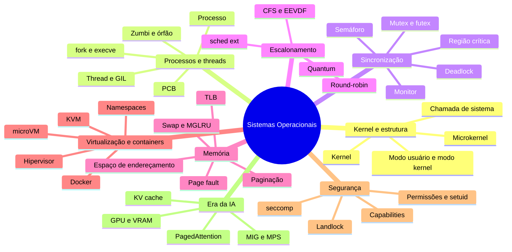
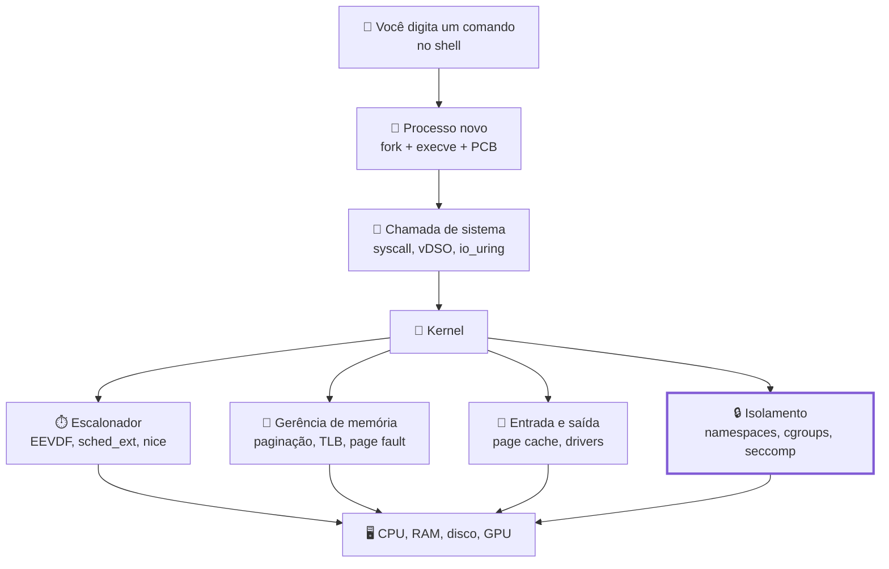

# Glossário de Sistemas Operacionais

> [!quote] O vocabulário de quem conversa com o kernel
> *Metade da dificuldade de Sistemas Operacionais é vocabulário: "moldura", "vruntime", "namespace", "page fault". Quando os nomes param de assustar, sobra o que interessa, que é entender a máquina.*

> [!tip] Como usar esta página
> Referência rápida dos termos da disciplina: os clássicos de prova e os modernos que aparecem em vaga de emprego, changelog de kernel e documentação de nuvem. Cada verbete tem 1 a 3 linhas e um **link para a página onde o assunto é tratado de verdade**. Termos em inglês ficam em inglês quando é assim que o mercado fala (`page fault`, `scheduler`, `namespace`).
> Use `Ctrl+F` (ou `Cmd+F`) para achar o termo. Se o que você procura não está aqui, traga na aula.

---

## 🗺️ Os grandes grupos

> [!abstract] Antes do A-Z, o mapa
> O glossário é alfabético, mas as ideias se organizam em oito famílias. Quem entende a família quase adivinha o termo isolado.

| Família | Termos-chave | Onde estudar |
|---|---|---|
| 🐧 **Kernel e estrutura** | kernel, modo usuário, syscall, microkernel, eBPF | [[Introdução aos Sistemas Operacionais]], [[Chamadas de Sistema]], [[Estrutura dos Sistemas Operacionais]] |
| 🧬 **Processos e threads** | processo, PCB, fork, sinal, zumbi, thread, GIL | [[Processos]], [[Threads]] |
| 🔐 **Sincronização e IPC** | região crítica, semáforo, mutex, futex, pipe, deadlock | [[Comunicação entre Processos]] |
| ⏱️ **Escalonamento** | preempção, quantum, round-robin, CFS, EEVDF, sched_ext | [[Escalonamento de Processos]] |
| 🧠 **Memória** | página, TLB, page fault, LRU, thrashing, swap | [[Gerenciamento de Memória]], [[Memória Virtual e Substituição de Páginas]] |
| 📦 **Virtualização e containers** | hipervisor, KVM, namespaces, cgroups, microVM | [[Containers e Virtualização]] |
| 🛡️ **Segurança** | capabilities, seccomp, Landlock, SELinux, ASLR | [[Segurança em Sistemas Operacionais]] |
| 🤖 **Era da IA** | GPU, VRAM, NPU, MIG, KV cache, quantização | [[Sistemas Operacionais na Era da IA]] |

![[Recursos/Sistemas operacionais/Glossário de Sistemas Operacionais/estrutura-simplificada-kernel-linux.png|Estrutura simplificada do kernel Linux: a interface de chamadas de sistema no topo e, embaixo, os subsistemas que dão nome a quase todos os termos deste glossário (ScotXW, Wikimedia Commons, CC BY-SA 4.0)]]

---

## 🅰️ A

- **ACL (lista de controle de acesso):** lista de quem pode fazer o quê em cada objeto; é como Linux e Windows implementam a matriz de acesso. Ver [[Segurança em Sistemas Operacionais]].
- **Agent workspace:** ambiente contido do Windows (out/2025) onde agentes de IA trabalham com desktop próprio, conta separada e permissões limitadas. Ver [[Sistemas Operacionais na Era da IA]].
- **ASLR:** o kernel sorteia os endereços de pilha, heap e bibliotecas a cada execução, para o atacante não saber onde mirar. Ver [[Segurança em Sistemas Operacionais]].
- **asyncio:** concorrência cooperativa do Python (`async` e `await`) num thread só, para carga de entrada e saída. Ver [[Threads]].

## 🅱️ B

- **Belady:** o **algoritmo ótimo** (tirar a página que só voltará bem mais adiante) é a régua teórica; a **anomalia de Belady** mostra que, no FIFO, mais molduras podem dar mais faltas. Ver [[Memória Virtual e Substituição de Páginas]].

## 🧩 C

- **Capabilities:** o poder do `root` fatiado em 41 privilégios menores (`CAP_NET_ADMIN`, `CAP_SYS_ADMIN`). Ver [[Segurança em Sistemas Operacionais]].
- **cgroups:** grupos de processos com limite e medição de CPU, memória e E/S; a versão 2 é oficial desde o Linux 4.5 e sustenta os limites de container. Ver [[Containers e Virtualização]].
- **CFS (Completely Fair Scheduler):** escalonador padrão do Linux de 2007 a 2023, com tempo virtual numa árvore rubro-negra. Substituído pelo EEVDF. Ver [[Escalonamento de Processos]].
- **Chamada de sistema (syscall):** o único jeito de pedir algo ao kernel; custa algumas centenas de nanossegundos por causa da troca de modo. Ver [[Chamadas de Sistema]].
- **Clock (segunda chance):** substituição de páginas com um ponteiro girando numa lista circular, poupando quem tem o bit de referência ligado. Ver [[Memória Virtual e Substituição de Páginas]].
- **clone e clone3:** a syscall por baixo do `fork` e das threads; as flags dizem o que pai e filho compartilham (`CLONE_VM`, `CLONE_THREAD`). Ver [[Processos]].
- **Condição de corrida (race condition):** o resultado passa a depender da ordem de chegada a um dado compartilhado. Ver [[Comunicação entre Processos]].
- **Container:** processo comum isolado por namespaces, cgroups, capabilities e seccomp, sem kernel próprio. Herdeiro do `chroot` (1979). Ver [[Containers e Virtualização]].
- **Copy-on-write (COW):** o `fork` não copia a memória: marca as páginas como somente leitura e duplica cada uma só quando alguém escreve. Ver [[Processos]].
- **Troca de contexto:** salvar o estado de uma tarefa e carregar o de outra; o preço da multiprogramação, contado em `nvcsw` no `/proc`. Ver [[Processos]].

## 🧨 D

- **Deadlock (impasse):** processos travados esperando recursos uns dos outros; exige as quatro condições de Coffman ao mesmo tempo. Ver [[Comunicação entre Processos]].
- **Demand paging:** carregar a página do disco só no primeiro acesso, em vez do programa inteiro. Ver [[Memória Virtual e Substituição de Páginas]].
- **Docker:** a ferramenta que popularizou containers em 2013; o formato virou o padrão OCI. Ver [[Containers e Virtualização]].

## ⚡ E

- **eBPF:** máquina virtual dentro do kernel que roda programas verificados sem módulo nem reboot; veio no Linux 3.18 (2014) e hoje sustenta observabilidade, rede e escalonadores. Ver [[Estrutura dos Sistemas Operacionais]].
- **EEVDF:** escalonador padrão do Linux desde a versão 6.6 (out/2023): cada tarefa tem um `lag` e um prazo virtual, e vence a elegível de prazo mais cedo. Ver [[Escalonamento de Processos]].
- **Espaço de endereçamento:** os endereços que o processo enxerga como se fossem a memória inteira, traduzidos pela MMU. Ver [[Gerenciamento de Memória]].
- **execve:** substitui a imagem do processo por outro programa, mantendo o PID; o segundo passo do par `fork` e `exec`. Ver [[Processos]].

## 🍴 F

- **FCFS:** ordem de chegada, sem preempção; um processo longo atrasa todo mundo (efeito comboio). Ver [[Escalonamento de Processos]].
- **FIFO:** como **substituição de páginas**, tira a mais antiga (e sofre a anomalia de Belady); como **arquivo**, é o pipe nomeado do `mkfifo`. Ver [[Memória Virtual e Substituição de Páginas]].
- **Firecracker:** microVM em Rust da AWS sobre KVM, que arranca em menos de 125 ms com menos de 5 MiB de sobrecarga. Roda o AWS Lambda. Ver [[Containers e Virtualização]].
- **fork:** cria um filho quase idêntico ao pai, por copy-on-write; devolve 0 no filho e o PID do filho no pai. Ver [[Processos]].
- **Free-threading (Python sem GIL):** PEP 703, experimental no 3.13 e **oficialmente suportado no 3.14** (out/2025), com 5% a 10% de penalidade em thread única. Ver [[Threads]].
- **futex:** trava resolvida em espaço de usuário quando não há disputa; só a espera de verdade entra no kernel. Ver [[Comunicação entre Processos]].

## 🎮 G

- **GIL (Global Interpreter Lock):** trava global do CPython: um thread de bytecode por vez, por isso threads ajudam em E/S e não em CPU. Ver [[Threads]].
- **GPU:** para o SO, um dispositivo com driver, filas e memória própria, que precisa ser escalonado e isolado como qualquer outro. Ver [[Sistemas Operacionais na Era da IA]].
- **gVisor:** sandbox do Google com um "kernel de aplicação" em Go (o Sentry) que implementa a interface do Linux em espaço de usuário. Ver [[Containers e Virtualização]].

## 🧱 H

- **Hipervisor:** cria e gerencia máquinas virtuais. **Tipo 1** roda direto no hardware (KVM, Hyper-V, Xen); **tipo 2** roda sobre um SO hospedeiro (VirtualBox). Ver [[Containers e Virtualização]].

## 🔁 I

- **init (PID 1):** o primeiro processo do sistema, ancestral de todos e pai adotivo dos órfãos; no Linux moderno, o `systemd`. Ver [[Processos]].
- **Interrupção:** sinal do hardware que desvia a CPU para o kernel; é como o SO retoma o controle da máquina. Ver [[Introdução aos Sistemas Operacionais]].
- **io_uring:** entrada e saída assíncrona do Linux (5.1, 2019) com dois anéis compartilhados entre programa e kernel, que derruba o número de syscalls. Ver [[Chamadas de Sistema]].

## 🐧 K

- **Kernel (núcleo):** a parte do SO que roda em modo privilegiado e controla CPU, memória, dispositivos e processos; o resto é programa comum. Ver [[Introdução aos Sistemas Operacionais]].
- **KSM (Kernel Samepage Merging):** o kernel funde páginas idênticas numa só, marcada como copy-on-write; útil com muitas VMs iguais. Ver [[Gerenciamento de Memória]].
- **KV cache:** o cache de chaves e valores da atenção de um LLM; **cresce com o contexto** e costuma estourar a VRAM antes dos pesos. Ver [[Sistemas Operacionais na Era da IA]].
- **KVM:** o módulo que transforma o Linux num hipervisor tipo 1, exposto como `/dev/kvm` e usado por QEMU e Firecracker. Ver [[Containers e Virtualização]].

## 🔗 L

- **Landlock:** módulo de segurança (Linux 5.13) que deixa um programa **sem privilégio** restringir a si mesmo, listando o que continua liberado. Ver [[Segurança em Sistemas Operacionais]].
- **LRU (Least Recently Used):** descartar a página usada há mais tempo; caro em hardware puro, por isso o sistema usa aproximações. Ver [[Memória Virtual e Substituição de Páginas]].

## 🧠 M

- **MCP (Model Context Protocol):** liga um agente de IA a ferramentas por `stdio` (pipes) ou HTTP; é IPC com nome novo, nativo no Windows desde dez/2025. Ver [[Comunicação entre Processos]].
- **Memória compartilhada:** região mapeada por vários processos (`shm_open`, `mmap`); o IPC mais rápido e o que mais exige sincronização. Ver [[Comunicação entre Processos]].
- **Memória unificada:** CPU e acelerador enxergam o mesmo espaço de memória, sem cópia (Apple Silicon, até 512 GB no Mac Studio M3 Ultra). Ver [[Sistemas Operacionais na Era da IA]].
- **Memória virtual:** a ilusão, mantida por hardware e SO, de que cada processo tem uma memória grande, contínua e só dele. Ver [[Memória Virtual e Substituição de Páginas]].
- **MGLRU:** substituição de páginas por **gerações**, no Linux desde a versão 6.1 (dez/2022); o Linux 7.2 relata cerca de 30% de ganho em MongoDB. Ver [[Memória Virtual e Substituição de Páginas]].
- **Microkernel:** só o essencial fica no kernel e o resto vira serviço em espaço de usuário (Minix 3, seL4, QNX): mais robusto, com custo de IPC. Ver [[Estrutura dos Sistemas Operacionais]].
- **microVM:** máquina virtual minimalista, com poucos dispositivos emulados, feita para arrancar em milissegundos (Firecracker, Kata). Ver [[Containers e Virtualização]].
- **MIG e MPS:** as duas formas de dividir uma GPU NVIDIA: **MIG** parte o hardware em até 7 instâncias isoladas, **MPS** deixa processos diferentes se sobreporem na mesma GPU. Ver [[Sistemas Operacionais na Era da IA]].
- **MLFQ:** várias filas com prioridades e quantums diferentes: quem gasta CPU desce, quem é interativo sobe. Ver [[Escalonamento de Processos]].
- **mmap:** mapeia um arquivo (ou memória anônima) direto no espaço de endereçamento; é assim que chegam bibliotecas e os pesos de um LLM. Ver [[Gerenciamento de Memória]].
- **MMU:** hardware que traduz endereço virtual em físico a cada acesso, consultando tabelas de página e a TLB. Ver [[Introdução aos Sistemas Operacionais]].
- **Modo usuário e modo kernel:** os dois níveis de privilégio da CPU (ring 3 e ring 0); a ponte entre eles é a chamada de sistema. Ver [[Introdução aos Sistemas Operacionais]].
- **Monitor:** junta dados, procedimentos e exclusão mútua automática, com variáveis de condição; é o que existe atrás do `synchronized` de Java. Ver [[Comunicação entre Processos]].
- **Mutex:** trava binária com dono, para proteger uma região crítica; quem tranca deveria ser quem destranca. Ver [[Comunicação entre Processos]].

## 📦 N

- **Namespaces:** os oito tipos de isolamento do kernel (pid, mount, net, uts, ipc, user, cgroup, time) que fazem o processo enxergar uma máquina só dele. Ver [[Containers e Virtualização]].
- **nice e renice:** prioridade de processos comuns, de -20 (exige privilégio) a 19; vira peso na conta do escalonador. Ver [[Escalonamento de Processos]].
- **NPU:** acelerador de IA no processador dos Copilot+ PCs (40 TOPS ou mais), já visível no Gerenciador de Tarefas. Ver [[Sistemas Operacionais na Era da IA]].

## 💀 O

- **OOM killer:** mata um processo quando a memória acaba, guiado por `oom_score_adj`; o `systemd-oomd` age antes, usando PSI e cgroups. Ver [[Memória Virtual e Substituição de Páginas]].
- **Órfão:** processo cujo pai morreu antes dele; é adotado pelo `init`, que passa a recolher seu código de saída. Ver [[Processos]].

## 📄 P

- **Page cache:** memória com o conteúdo de arquivos já lidos; é por isso que carregar o mesmo modelo pela segunda vez voa. Ver [[Memória Virtual e Substituição de Páginas]].
- **Page fault (falta de página):** interrupção quando o endereço não está mapeado em memória física: **minor** resolve sem disco, **major** vai ao disco. Ver [[Gerenciamento de Memória]].
- **PagedAttention:** o vLLM (SOSP 2023) aplicou **paginação ao KV cache**, em blocos não contíguos, e ganhou de 2 a 4 vezes mais throughput. Ver [[Sistemas Operacionais na Era da IA]].
- **Paginação:** memória virtual em **páginas** e memória física em **molduras**, ligadas por tabelas de página; no x86-64, 4 KB e quatro níveis. Ver [[Gerenciamento de Memória]].
- **PCB (Process Control Block):** onde o kernel guarda tudo sobre um processo (PID, estado, registradores, arquivos); no Linux, a `struct task_struct`. Ver [[Processos]].
- **Pinned memory:** memória marcada para nunca ir ao swap, exigida por transferência direta com GPU. Ver [[Sistemas Operacionais na Era da IA]].
- **Pipe:** canal unidirecional entre dois processos (`ls | grep`), o IPC mais usado do mundo Unix. Ver [[Comunicação entre Processos]].
- **Preempção:** o SO tirar a CPU de quem ainda queria continuar; sem ela, um laço infinito trava a máquina. Ver [[Escalonamento de Processos]].
- **/proc:** sistema de arquivos virtual que expõe o estado do kernel como texto (`/proc/<pid>/status`, `maps`, `/proc/pressure/memory`). Ver [[Processos]].
- **Processo:** um programa em execução, com espaço de endereçamento, estado e recursos próprios. Ver [[Processos]].
- **PSI (Pressure Stall Information):** métrica do Linux 4.20 em `/proc/pressure/` que mede quanto tempo as tarefas ficaram **paradas esperando** um recurso. Ver [[Memória Virtual e Substituição de Páginas]].

## ⏱️ Q

- **Quantização:** baixar a precisão dos pesos (16 para 8 ou 4 bits) para caber na memória: um modelo de 7 bilhões ocupa cerca de 14 GB em FP16 e 3,5 GB em 4 bits. Ver [[Sistemas Operacionais na Era da IA]].
- **Quantum:** o tempo máximo na CPU antes da preempção; curto demais desperdiça em troca de contexto, longo demais piora a resposta. Ver [[Escalonamento de Processos]].

## 🔄 R

- **RCU (Read-Copy-Update):** leitores não travam nada e o escritor publica uma cópia nova, liberando a antiga quando ninguém mais a lê. Ver [[Comunicação entre Processos]].
- **Região crítica:** o trecho que acessa recurso compartilhado e não pode rodar em dois fluxos ao mesmo tempo. Ver [[Comunicação entre Processos]].
- **Round-robin:** cada processo pronto recebe um quantum e volta para o fim da fila; o algoritmo interativo mais simples que funciona. Ver [[Escalonamento de Processos]].
- **RSS, VSZ e PSS:** **VSZ** é o reservado (virtual), **RSS** o que está de fato na RAM, **PSS** divide as páginas compartilhadas entre quem as usa. Ver [[Gerenciamento de Memória]].

## 🔒 S

- **Sandbox:** caixa para código não confiável, montada com namespaces, seccomp, Landlock e sistema de arquivos restrito. Ver [[Segurança em Sistemas Operacionais]].
- **sched_ext:** classe do Linux 6.12 (nov/2024) que permite **escrever o escalonador em eBPF** e voltar ao padrão se ele falhar (`scx_lavd`, do Steam Deck). Ver [[Escalonamento de Processos]].
- **seccomp:** filtro que decide, syscall por syscall, o que um processo pode chamar; o perfil padrão do Docker bloqueia cerca de 44 das mais de 300. Ver [[Segurança em Sistemas Operacionais]].
- **SELinux e AppArmor:** os módulos de segurança obrigatória mais usados: o SELinux etiqueta objetos (Red Hat), o AppArmor amarra perfis a caminhos (Ubuntu). Ver [[Segurança em Sistemas Operacionais]].
- **Semáforo:** contador com duas operações atômicas (`down` e `up`) que resolve exclusão mútua e produtor-consumidor. Invenção de Dijkstra. Ver [[Comunicação entre Processos]].
- **setuid:** bit que faz o programa rodar com os privilégios do **dono do arquivo**, não de quem executou; é assim que o `passwd` funciona. Ver [[Segurança em Sistemas Operacionais]].
- **Shell:** o interpretador de comandos (bash, zsh, PowerShell); não faz parte do kernel, é programa comum que cria processos. Ver [[Linux na prática]].
- **Sinal (signal):** notificação assíncrona a um processo: `SIGTERM` pede para terminar, `SIGKILL` mata sem defesa, `SIGSTOP` congela. Ver [[Processos]].
- **SJF e SRTF:** trabalho mais curto primeiro, sem ou com preempção; ótimos no papel, impossíveis na prática, porque exigem saber o futuro. Ver [[Escalonamento de Processos]].
- **strace:** mostra todas as chamadas de sistema de um programa; `-c` resume, `-f` segue os filhos, `-p` entra num processo vivo. Ver [[Chamadas de Sistema]].
- **Swap:** área em disco para páginas expulsas da RAM; o `swappiness` regula o gosto do kernel por usá-la. Ver [[Memória Virtual e Substituição de Páginas]].
- **systemd:** o gerenciador de serviços do Linux moderno: PID 1, unidades, `systemctl`, `journalctl`, timers e limites por cgroup. Ver [[Linux na prática]].

## 🧵 T

- **Thrashing:** o sistema passa mais tempo trocando páginas do que trabalhando, porque o conjunto de trabalho não cabe na memória. Ver [[Memória Virtual e Substituição de Páginas]].
- **Thread:** fluxo de execução dentro de um processo: compartilha memória e arquivos, mas tem pilha e registradores próprios. No Linux, 1:1 com uma tarefa do kernel. Ver [[Threads]].
- **THP (Transparent Huge Pages):** o kernel promove regiões para páginas de 2 MB sem o programa pedir; visível como `AnonHugePages`. Ver [[Gerenciamento de Memória]].
- **TLB:** cache de traduções de endereço dentro da MMU; o erro obriga a percorrer a tabela de páginas. Recurso escasso, daí as páginas de 2 MB. Ver [[Gerenciamento de Memória]].

## 🛰️ U

- **Unikernel:** aplicação e só as partes do SO de que ela precisa, num binário de espaço de endereçamento único que arranca em milissegundos (Unikraft). Ver [[Estrutura dos Sistemas Operacionais]].
- **unshare:** cria namespaces novos; `unshare --fork --pid --mount-proc` já entrega um "container" com PID 1 próprio, sem Docker. Ver [[Containers e Virtualização]].

## 🖥️ V

- **vDSO:** biblioteca que o kernel mapeia em todo processo para que `clock_gettime` vire chamada comum, sem troca de modo (dezenas de nanossegundos). Ver [[Chamadas de Sistema]].
- **VRAM:** a memória da placa de vídeo, onde precisam caber pesos, ativações e KV cache; quando não cabe, dá `CUDA out of memory`. Ver [[Sistemas Operacionais na Era da IA]].
- **vruntime:** o tempo virtual ponderado pela prioridade que o CFS usava para escolher a tarefa menos servida; o vocabulário sobreviveu no EEVDF. Ver [[Escalonamento de Processos]].

## 🪟 W

- **Windows NT (arquitetura):** modelo híbrido com HAL, kernel, executive e subsistemas; a API Win32 fica sobre a API nativa do `ntdll.dll`. Ver [[Windows]].
- **Working set:** as páginas que o processo realmente usa numa janela recente; mantê-lo na memória é a receita contra thrashing. Ver [[Memória Virtual e Substituição de Páginas]].
- **WSL2:** VM leve de Hyper-V com um kernel Linux real compilado pela Microsoft; por isso suporta systemd e containers, e o WSL1 não. Ver [[Laboratório de SO: preparando o ambiente]].

## ✖️ X

- **XCHG e TSL (Test and Set Lock):** instruções atômicas que leem e escrevem uma posição de memória num passo só; o tijolo sob mutex e semáforo. Ver [[Comunicação entre Processos]].

## 🛑 Y

- **yield (`sched_yield`):** o processo abre mão do resto do quantum e volta para a fila de prontos. Ver [[Escalonamento de Processos]].

## 🧟 Z

- **Zumbi (processo defunct):** já terminou, mas continua na tabela porque o pai não chamou `wait`; aparece como `Z` no `ps`. Ver [[Processos]].
- **zram e zswap:** swap comprimido: o **zram** é um disco de swap na própria RAM, o **zswap** um cache comprimido na frente do swap de disco. Ver [[Memória Virtual e Substituição de Páginas]].

---

## 🧭 Onde as famílias se encontram

Um comando qualquer digitado no terminal já encosta em quase todo o glossário:

> [!info] Falsos amigos que derrubam gente em prova
> - **Página** é a divisão do espaço **virtual**; **moldura** (frame) é a da memória **física**. A tabela de páginas liga uma à outra.
> - **Programa** é o arquivo parado no disco; **processo** é ele em execução (o mesmo programa vira dez processos sem problema).
> - **Concorrência** é alternar entre várias tarefas; **paralelismo** é executá-las ao mesmo tempo, em núcleos diferentes. Thread em Python com GIL dá concorrência, não paralelismo de CPU.
> - **Bloqueado** não é **pronto**: quem está bloqueado espera um evento e nem quer a CPU; quem está pronto quer, mas não é a vez dele.
> - **VSZ** alto não é problema: é memória reservada, não usada. Olhe o **RSS**.

---

> [!tip] 🤖 Como usar este glossário com IA (do jeito certo)
> A IA é excelente para **gerar exemplo** de termo abstrato e péssima como **fonte final da verdade**. O ciclo é sempre o mesmo: pergunte, execute, verifique.
>
> 1. **Peça o exemplo executável:** *"Explique `page fault` em duas frases e me dê um comando que provoque um page fault major no Ubuntu 24.04 e outro que mostre a contagem."*
> 2. **Execute de verdade** (WSL2, VM ou container). Se o comando ou a flag não existe, você acabou de flagrar uma alucinação.
> 3. **Verifique na fonte primária:** `man 2 <syscall>`, `man 5 proc`, [docs.kernel.org](https://docs.kernel.org/) ou a saída real do sistema. A man page ganha da IA sempre.
> 4. **Refaça o verbete com suas palavras.** Se não consegue explicar sem olhar, ainda não sabe o termo.
>
> Dois avisos: nunca cole comando destrutivo sugerido por IA sem entender (`rm -rf`, `dd`, `curl | bash`), e desconfie de número ou versão que a IA afirme sem link. Nesta disciplina, **número sem fonte não vale ponto**.

---

## 🔗 Veja também

- [[Tópicos/Sistemas operacionais/index|Sistemas Operacionais]]: o índice da disciplina, com as páginas na ordem em que serão vistas.
- [[Materiais, cursos e certificações de SO]]: livros abertos, cursos, simuladores e certificações para ir além de cada verbete.
- [[Laboratório de SO: preparando o ambiente]]: monte o ambiente antes de tentar executar qualquer coisa daqui.
- [[Sistemas Operacionais|Sistemas Operacionais (Fundamentos da Computação)]]: a visão introdutória do 1º período, boa para revisar os termos básicos.
- [[Glossário de Engenharia de Software com IA]]: o glossário irmão, do lado de cima da pilha (agentes, contexto, MCP, RAG).
- ➡️ **Continue por aqui:** [[Cronograma da disciplina]], para saber em que semana cada família de termos aparece.

---

> [!note] 📚 Fontes (2026)
> - [The Linux Kernel documentation](https://docs.kernel.org/): EEVDF, sched_ext, MGLRU, cgroup v2, PSI, THP, KSM, zswap, seccomp e Landlock.
> - [Linux man pages (man7.org)](https://man7.org/linux/man-pages/): `syscalls(2)`, `clone(2)`, `fork(2)`, `wait(2)`, `futex(2)`, `namespaces(7)`, `capabilities(7)`, `vdso(7)`.
> - KernelNewbies: [6.6](https://kernelnewbies.org/Linux_6.6) (EEVDF), [6.12](https://kernelnewbies.org/Linux_6.12) (sched_ext), [6.1](https://kernelnewbies.org/Linux_6.1) (MGLRU), [7.2](https://kernelnewbies.org/Linux_7.2) (ago/2026).
> - [Python 3.14: free-threading suportado](https://docs.python.org/3.14/whatsnew/3.14.html) e [PEP 703](https://peps.python.org/pep-0703/).
> - [PagedAttention (SOSP 2023)](https://arxiv.org/abs/2309.06180), [NVIDIA MIG](https://docs.nvidia.com/datacenter/tesla/mig-user-guide/) e [MPS](https://docs.nvidia.com/deploy/mps/index.html).
> - [Firecracker](https://firecracker-microvm.github.io/), [gVisor](https://gvisor.dev/docs/) e [seccomp no Docker](https://docs.docker.com/engine/security/seccomp/).
> - [WSL: comparação de versões](https://learn.microsoft.com/en-us/windows/wsl/compare-versions) e [segurança de agentes no Windows](https://blogs.windows.com/windowsexperience/2025/10/16/securing-ai-agents-on-windows/).
> - Livros-base: Tanenbaum & Bos, *Sistemas Operacionais Modernos* (4ª ed.); Silberschatz; Maziero (aberto); [OSTEP](https://pages.cs.wisc.edu/~remzi/OSTEP/) (aberto).
> - Imagem: [Simplified Structure of the Linux Kernel (Wikimedia Commons, ScotXW, CC BY-SA 4.0)](https://commons.wikimedia.org/wiki/File:Simplified_Structure_of_the_Linux_Kernel.svg).

> [!question] Faltou um termo?
> Este glossário é vivo. Encontrou num artigo, numa vaga ou num log de erro um termo de SO que não está aqui? Traga para a aula com a fonte: verbete novo aceito entra na página com o seu nome no log da turma. 😉
