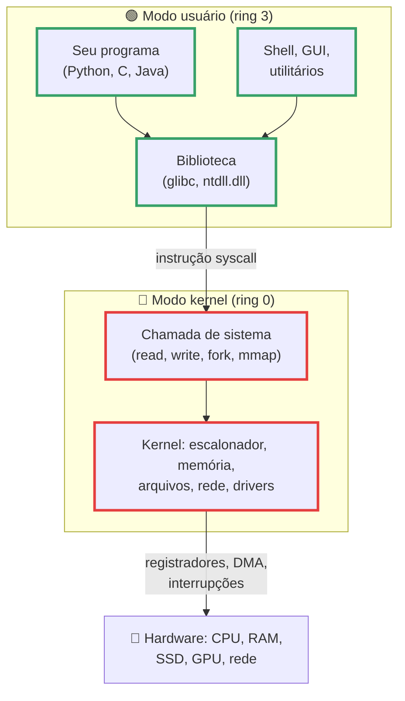
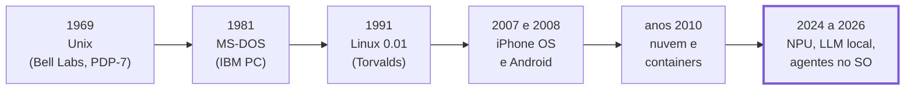
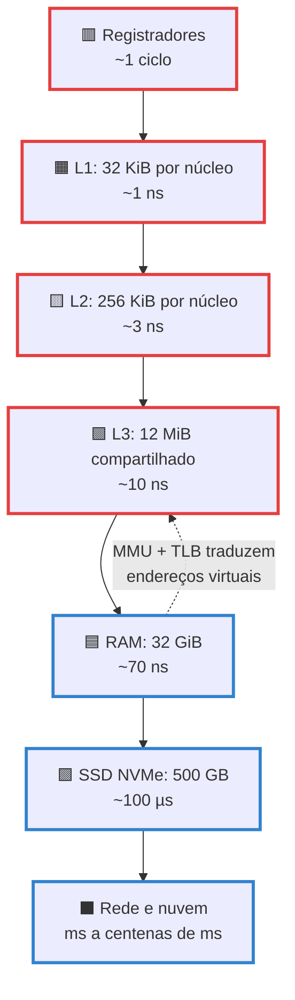
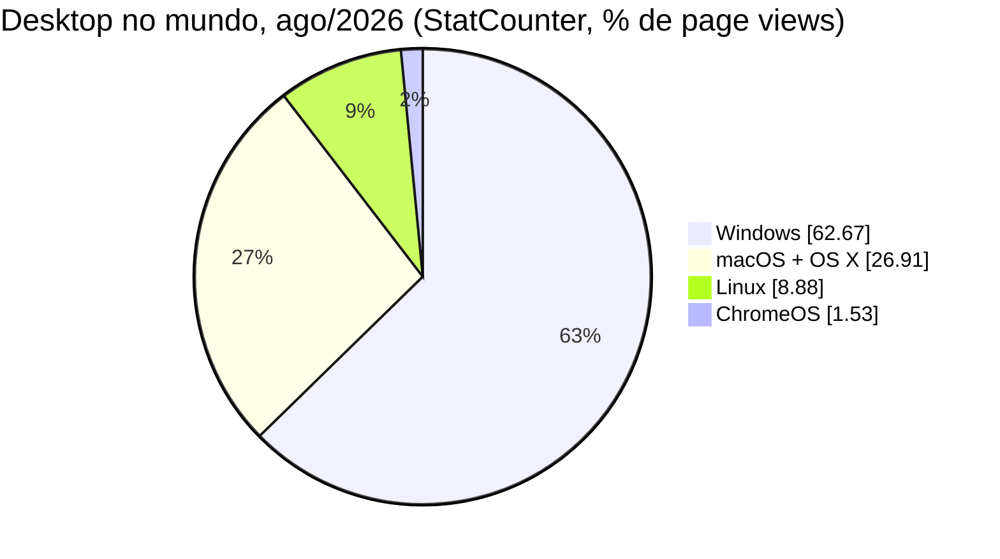
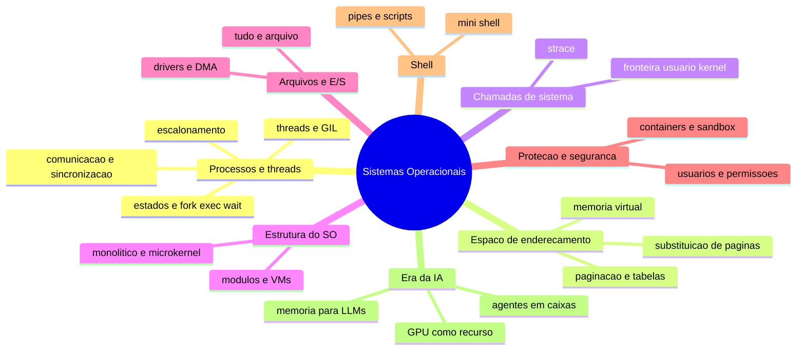

# Introdução aos Sistemas Operacionais

> [!quote] O software que decide quem usa a máquina
> *Em 19 de julho de 2024, uma atualização defeituosa de um driver que roda dentro do kernel do Windows derrubou cerca de 8,5 milhões de computadores em aeroportos, hospitais e bancos: a Delta cancelou mais de 7.000 voos e o prejuízo estimado nas empresas da Fortune 500 passou de US\$ 5,4 bilhões. Nenhum vírus, nenhum invasor: só um pedaço de código executando no modo mais privilegiado da CPU. Entender por que isso acontece, e por que os 500 supercomputadores mais rápidos do planeta, o seu celular e a GPU que responde ao ChatGPT dependem do mesmo tipo de software, é o assunto desta disciplina.*

> [!abstract] 🧭 O que você vai fazer nesta aula
> Descobrir o que o kernel da sua máquina administra (`lscpu`, `free -h`, `lsblk`), ver interrupções acontecendo em tempo real (`/proc/interrupts`), medir a hierarquia de memória com um programa de 25 linhas, achar a GPU e a VRAM (`nvidia-smi`), ler os números do mercado de 2026 e conhecer o mapa dos conceitos que vamos estudar até fevereiro. Traga o notebook. Se ainda não tem Linux, comece por [[Laboratório de SO: preparando o ambiente]].

---

## 1. 🎯 O que é um sistema operacional

Tanenbaum abre o livro com duas respostas que se completam:

| Visão | O que o SO faz | Analogia |
|---|---|---|
| **Máquina estendida** (de cima para baixo) | Esconde o hardware feio (controladores, registradores, interrupções) atrás de abstrações limpas: **processo**, **arquivo**, **espaço de endereçamento**, **socket** | A recepção do hotel: você pede "um quarto" e não precisa saber em que andar passa o encanamento |
| **Gerente de recursos** (de baixo para cima) | Divide CPU, memória, disco, rede e GPU entre programas que competem, no **tempo** (revezamento) e no **espaço** (cada um com a sua fatia) | O maestro: decide quem toca, quando, por quanto tempo, e tira do palco quem desafina |

No dia a dia, "sistema operacional" é o pacote inteiro (Windows 11, Ubuntu 26.04, Android 17). Mas o que roda com privilégio total sobre o hardware é só o **kernel** (núcleo). Todo o resto é software comum, rodando em cima dele:

| Camada | Exemplos | Roda em modo |
|---|---|---|
| Kernel | Linux 7.2, NT (`ntoskrnl.exe`), XNU (macOS e iOS) | kernel (privilegiado) |
| Bibliotecas de sistema | glibc, `ntdll.dll`, libSystem | usuário |
| Shell e utilitários | bash, PowerShell, `ls`, `ps`, `systemd` | usuário |
| Interface gráfica | GNOME, KDE, Explorer, Finder | usuário |
| Distribuição | Ubuntu = kernel Linux + GNU + GNOME + apt + milhares de pacotes | (empacotamento) |

![[Recursos/Sistemas operacionais/Introdução aos Sistemas Operacionais/camadas-so.png|O SO fica entre as aplicações e o hardware: toda requisição desce por ele e toda resposta sobe por ele (Wikimedia Commons)]]



> [!info] Kernel × distribuição × shell
> "Instalei o Linux" quer dizer "instalei uma distribuição (Ubuntu, Fedora, Debian) que traz o kernel Linux mais milhares de programas". O kernel sozinho não tem nem o comando `ls` (ele vem do pacote coreutils). Por isso o Android é Linux (mesmo kernel) sem ser "GNU/Linux", e o WSL2 do Windows roda um kernel Linux de verdade dentro de uma máquina virtual leve (a Microsoft abriu o código do WSL em 19/05/2025).

> [!example] 🧪 Atividade 1: Separe o kernel do resto na sua máquina
> **Ferramenta:** terminal Linux (WSL2, VM ou nativo).
>
> 1. Versão do kernel e de quem o compilou: `uname -sr` e `cat /proc/version`.
> 2. Versão da distribuição (não é a do kernel): `head -2 /etc/os-release`.
> 3. Versão do shell: `echo $SHELL` e `bash --version | head -1`.
> 4. Quantos programas vieram "de brinde": `ls /usr/bin | wc -l`.
> 5. O primeiro processo que o kernel cria: `ps -o pid,comm -p 1`.
>
> **Resultado esperado:** três versões diferentes anotadas (no notebook do professor: kernel `6.8.0-xx-generic`, distribuição `Ubuntu 22.04 LTS`, shell `bash 5.1.16`) e o PID 1 sendo o `systemd`. Se as três versões fossem "a mesma coisa", elas não poderiam ter números diferentes.
>
> 🪟 **No Windows:** `winver` (versão e build), no PowerShell `$PSVersionTable.PSVersion` (versão do shell) e `Get-ComputerInfo -Property OsName,OsVersion,OsBuildNumber`. O kernel é o `ntoskrnl.exe` em `C:\Windows\System32`. 🍎 **No macOS:** `uname -sr` mostra `Darwin` (o kernel XNU), e `sw_vers` mostra a versão do macOS.

---

## 2. 🕰️ Uma história curta

Cada geração de hardware criou um problema novo, e o SO nasceu como a resposta a ele:

| Geração (Tanenbaum) | Anos | O problema que apareceu | Marcos datados |
|---|---|---|---|
| 1ª: válvulas | 1945 a 1955 | Não havia SO: o programador operava a máquina no painel, um job por vez | ENIAC, painéis de conexão |
| 2ª: transistores | 1955 a 1965 | Máquina cara e ociosa entre jobs: nasce o processamento em **lote** (batch) e o "monitor" residente | FMS, IBSYS |
| 3ª: circuitos integrados | 1965 a 1980 | Vários jobs na memória ao mesmo tempo: **multiprogramação**, spooling, **tempo compartilhado** | OS/360 (anunciado em 1964), Multics (1969), **Unix (1969)** num PDP-7 do Bell Labs |
| 4ª: computadores pessoais | 1980 até hoje | Um SO por pessoa, interface gráfica, rede | CP/M (1974), MS-DOS (1981), Macintosh (1984), Windows 1.0 (1985), **Linux 0.01 (1991)**, Windows NT 3.1 (1993), Windows 95, Mac OS X (2001) |
| 5ª: computadores móveis | 1990 até hoje | Um SO no bolso: bateria, sensores e loja de apps mandam | Symbian (2000), iPhone OS (2007), Android 1.0 (2008) |
| Nuvem e containers | anos 2010 até hoje | O SO vira mercadoria: milhares de VMs e containers por data center | Sistemas Unix (Linux na maioria) em 92,0% dos sites (W3Techs, set/2026); Docker usado por 71,1% dos devs (Stack Overflow 2025) |
| **SO com IA embutida** | 2024 até hoje | NPU como recurso, modelo de linguagem local, agentes com conta própria | Copilot+ PC (20/05/2024), Apple Intelligence no macOS 15 (16/09/2024), "agent workspace" no Windows (2025), Android 17 com Gemini Nano (16/06/2026), Aluminium OS anunciado (12/05/2026) |



![[Recursos/Sistemas operacionais/Introdução aos Sistemas Operacionais/thompson-ritchie-pdp11.png|Ken Thompson (esq.) e Dennis Ritchie (dir.) em 1973, os criadores do Unix e da linguagem C (Wikimedia Commons)]]

![[Recursos/Sistemas operacionais/Introdução aos Sistemas Operacionais/pdp7-unix.png|Um DEC PDP-7 (exemplar de Oslo, antes da restauração): foi numa máquina assim, em 1969, que o Unix nasceu (Wikimedia Commons)]]

> [!tip] Por que o Unix importa tanto
> Linux, Android, macOS, iOS e os BSDs descendem do Unix por código ou por ideias: arquivo como sequência de bytes, "tudo é arquivo" (até o teclado e a placa de rede), processos criados por `fork` e `exec`, e um shell que encadeia programas pequenos com `|`. Quando você aprende isso uma vez, aprende para todos eles.

> [!example] 🧪 Atividade 2: Descubra a idade e o status do seu kernel
> **Ferramenta:** terminal + [kernel.org](https://www.kernel.org/) + [kernelnewbies.org](https://kernelnewbies.org/).
>
> 1. `uname -r`. No WSL2 a versão termina em `-microsoft-standard-WSL2`: é um kernel Linux compilado pela Microsoft.
> 2. Abra kernel.org e procure a sua série (em 02/09/2026: stable 7.2.3; longterm 6.18, 6.12, 6.6, 6.1, 5.15 e 5.10). Ela está na lista? É LTS? Se não aparece (caso do 6.8 do Ubuntu 24.04), quem mantém as correções é a distribuição, não o kernel.org.
> 3. Em kernelnewbies, abra a página da sua versão (ou de `Linux_7.2`) e anote uma novidade que você entendeu (exemplo: 7.2 trouxe "cache-aware scheduling", que agrupa tarefas no mesmo cache L3).
>
> **Resultado esperado:** uma linha no seu caderno de laboratório com versão, status (stable, LTS, mantido pela distro) e uma feature.
>
> 🪟 **No Windows:** `winver` e confira na [página de release health do Windows 11](https://learn.microsoft.com/en-us/windows/release-health/windows11-release-information) se a sua versão ainda recebe atualizações (a 24H2 Home/Pro termina em 13/10/2026; o Windows 10 acabou em 14/10/2025 e ainda estava em 30,14% dos desktops Windows em ago/2026).

---

## 3. 🖥️ Revisão de hardware que o SO administra

O SO existe por causa do hardware. Quatro blocos importam agora: a **CPU** (com seus modos e interrupções), a **memória** (em camadas), os **dispositivos** (com controladores e DMA) e, em 2026, a **GPU**.

### 3.1 CPU: registradores, modos e interrupções

Além dos registradores de uso geral, a CPU tem o **contador de programa** (PC, próxima instrução), o **ponteiro de pilha** (SP) e a **palavra de estado** (PSW), que guarda, entre outros bits, o **modo** atual. No x86 existem quatro anéis de privilégio (0 a 3), mas Linux e Windows usam só dois: **ring 0** para o kernel e **ring 3** para tudo o que é seu. Instruções que mexem na MMU, desligam interrupções ou falam com dispositivos só executam em ring 0; em ring 3 elas geram uma exceção e o kernel decide o que fazer (em geral, matar o processo). Abaixo do ring 0 ainda há o hipervisor (VT-x e AMD-V, o "ring -1"), que é como VMs e o WSL2 funcionam.

Só existem três portas de entrada para o modo kernel, e todas passam pelo mesmo caminho: a CPU salva o estado, troca para ring 0 e pula para uma rotina do kernel.

| Porta | Quem dispara | Exemplo | Síncrona? |
|---|---|---|---|
| **Interrupção** | Hardware (teclado, disco, timer, placa de rede) | Você apertou uma tecla; o SSD terminou de ler | Não: chega a qualquer momento |
| **Exceção (trap)** | A própria instrução que falhou | Divisão por zero, acesso a página que não está na RAM (page fault) | Sim |
| **Chamada de sistema** | O programa, de propósito (instrução `syscall`) | `read`, `write`, `fork`, `mmap` | Sim |

Hoje nenhuma CPU é "uma" CPU: o notebook do professor tem 6 núcleos físicos e 12 threads (SMT), e os Intel de 12ª geração em diante misturam **P-cores** (frequência e IPC altos) com **E-cores** (desempenho por watt), avisando o SO pelo **Thread Director**; o Linux lê esse aviso pela interface HFI e, desde o 7.2, ainda agrupa tarefas que compartilham dados no mesmo cache L3 (cache-aware scheduling). Escalonar bem esse hardware é o assunto de [[Escalonamento de Processos]].

> [!warning] Modo kernel: poder total, culpa total
> A documentação da Microsoft resume: "todo código em modo kernel compartilha um único espaço de endereçamento virtual; se um driver em modo kernel falha, ele derruba o sistema operacional inteiro". Foi exatamente isso no caso CrowdStrike de 19/07/2024: um arquivo de configuração provocou leitura fora dos limites num driver de segurança em ring 0 e ~8,5 milhões de máquinas Windows (menos de 1% da base) travaram na tela azul. A resposta da Microsoft, a Windows Resiliency Initiative (jun/2025), tira o antivírus do kernel e o leva para modo usuário. Ring 0 é o lugar mais perigoso do computador.

> [!example] 🧪 Atividade 3: Radiografia da sua máquina
> **Ferramenta:** `lscpu`, `nproc`, `free`, `lsblk` (todos no Ubuntu 24.04 e no WSL2).
>
> 1. `lscpu | grep -i -E 'model name|^CPU\(s\)|thread|core|socket|L1d|L2|L3'` (modelo, threads por núcleo, núcleos, caches).
> 2. `nproc` (quantas CPUs lógicas o kernel enxerga) e `lscpu | grep -i -o -E 'vmx|svm' | head -1` (se aparecer, a CPU tem virtualização por hardware: é o que o WSL2 e as VMs usam).
> 3. `free -h` (RAM total, usada, em cache e **disponível**) e `lsblk -o NAME,SIZE,TYPE,MOUNTPOINTS` (discos e partições).
>
> **Resultado esperado:** uma tabela pessoal com CPU, núcleos físicos × lógicos, L1/L2/L3, RAM e discos. No notebook do professor: `Intel Core i7-9750H`, 6 núcleos e 12 threads, L1d 32 KiB por núcleo, L2 256 KiB por núcleo, L3 12 MiB compartilhado, 31 GiB de RAM (27 GiB disponíveis com 20 GiB em cache) e um NVMe de 457 GB. Repare que `free` mostra "used" pequeno e "buff/cache" enorme: o kernel usa toda a RAM sobrando como cache de disco e devolve quando alguém precisa.
>
> 🪟 **No Windows:** `systeminfo` (SO, RAM, hotfixes) e, no PowerShell, `Get-CimInstance Win32_Processor | Select-Object Name,NumberOfCores,NumberOfLogicalProcessors,L2CacheSize,L3CacheSize` (caches em KB) e `Get-PhysicalDisk | Select-Object FriendlyName,MediaType,Size`. 🍎 **No macOS:** `sysctl -n machdep.cpu.brand_string`, `sysctl hw.memsize` e `system_profiler SPHardwareDataType`.

> [!example] 🧪 Atividade 4: Veja as interrupções acontecendo
> **Ferramenta:** `/proc/interrupts` (o kernel registra o número de interrupções por CPU e por dispositivo) + `watch`.
>
> 1. `head -3 /proc/interrupts` para entender o formato: uma coluna por CPU e, no fim da linha, o dispositivo.
> 2. `watch -n1 -d cat /proc/interrupts` (`-d` realça o que mudou desde a última atualização). Digite, mexa o mouse, toque um vídeo, copie um arquivo grande.
> 3. Identifique quem está gerando cada tipo: `i8042` (teclado e touchpad PS/2), `xhci_hcd` (USB), `nvme0q*` (SSD, uma fila por CPU), `LOC` (o timer que faz o escalonador acordar), `RES` (um núcleo pedindo a outro para reescalonar). `Ctrl+C` para sair.
>
> **Resultado esperado:** você aponta pelo menos três linhas que mudam e diz o que causou cada uma. No notebook do professor, `nvme0q1` acumulava 187.060 interrupções e o `ahci` 174.434 desde o boot; a interrupção 1 (`i8042`) fica parada se você usa teclado USB. **No WSL2** o teclado pertence ao Windows: você verá só o timer (`LOC`) e as interrupções do hipervisor variando, o que já ilustra a VM por baixo.
>
> 🪟 **No Windows:** `typeperf -q Processor` lista os contadores do objeto Processor; rode então `typeperf "\Processor(_Total)\Interrupts/sec" -si 1 -sc 10` (dez amostras, uma por segundo) e digite enquanto ele mede. No [Process Explorer](https://learn.microsoft.com/en-us/sysinternals/downloads/process-explorer) a linha `Interrupts` mostra a CPU gasta com interrupções.

### 3.2 Memória: uma hierarquia com degraus de 100 vezes

Não existe memória grande, barata e rápida ao mesmo tempo, então o computador empilha várias, e o SO (com ajuda do hardware) decide o que fica onde. Os números clássicos de Jeff Dean e Peter Norvig e a medição no notebook do professor contam a mesma história:

| Nível | Tamanho típico (i7-9750H) | Latência clássica (Dean/Norvig, ~2012) | Medido na atividade 5 |
|---|---|---|---|
| Registradores | dezenas de bytes | ~0,3 ns (1 ciclo) | (não se mede assim) |
| Cache L1 | 32 KiB de dados por núcleo | 0,5 ns | 1,2 ns |
| Cache L2 | 256 KiB por núcleo | 7 ns | 2 a 4 ns |
| Cache L3 | 12 MiB compartilhado | (entre L2 e RAM) | 7 a 13 ns |
| RAM (DRAM) | 32 GiB | 100 ns | 37 a 74 ns |
| SSD NVMe | 500 GB | 150 µs (leitura aleatória de 4 KB) | (1.000x a RAM) |
| HDD | 2 TB | 10 ms (seek) | (100.000x a RAM) |
| Rede (outro data center) | ilimitado | 150 ms (Califórnia a Holanda e volta) | |

![[Recursos/Sistemas operacionais/Introdução aos Sistemas Operacionais/hierarquia-de-memoria.png|A pirâmide da memória: quanto mais alto, mais rápido, menor e mais caro; quanto mais baixo, maior e mais lento (Wikimedia Commons)]]



Os caches são gerenciados pelo hardware. Da RAM para baixo, quem manda é o SO: a **MMU** (unidade de gerenciamento de memória) traduz cada endereço virtual que o seu programa usa para um endereço físico, em unidades de **página** (4 KB no x86-64, ou 2 MB e 1 GB nas huge pages), consultando tabelas que o kernel monta; um pequeno cache dessas traduções, o **TLB**, evita que cada acesso à memória vire vários (a documentação do kernel o chama de "um recurso bem escasso"). Quando a página não está na RAM, a MMU gera um **page fault**, o kernel busca no disco e o programa nem percebe. É a memória virtual, tema de [[Gerenciamento de Memória]] e [[Memória Virtual e Substituição de Páginas]], e também a ideia que o vLLM copiou para caber mais conversas na GPU (seção 7).

> [!example] 🧪 Atividade 5: Meça a hierarquia de memória com 25 linhas de C
> **Ferramenta:** `gcc` (`sudo apt install build-essential` no Ubuntu/WSL2) + `getconf` + `lscpu -C`.
>
> 1. Peça à sua IA para prever a saída antes de rodar: "um programa percorre um vetor embaralhado de 4 KB, 8 KB ... 128 MB seguindo ponteiros; quanto tempo por acesso em cada tamanho?"
> 2. Salve como `cache.c`, compile com `gcc -O2 cache.c -o cache` e rode `./cache` (leva uns 10 s):
>
> ```c
> #include <stdio.h>
> #include <stdlib.h>
> #include <time.h>
> int main(void) {
>     const long passos = 20 * 1000 * 1000L;          /* acessos por tamanho */
>     for (long kb = 4; kb <= 128 * 1024; kb *= 2) {
>         long n = kb * 1024 / sizeof(long);
>         long *v = malloc(n * sizeof(long));
>         for (long i = 0; i < n; i++) v[i] = i;
>         for (long i = n - 1; i > 0; i--) {          /* embaralha: cada acesso salta para outro lugar */
>             long j = rand() % i; long t = v[i]; v[i] = v[j]; v[j] = t;
>         }
>         struct timespec a, b; long p = 0;
>         clock_gettime(CLOCK_MONOTONIC, &a);
>         for (long i = 0; i < passos; i++) p = v[p];  /* cada acesso depende do anterior */
>         clock_gettime(CLOCK_MONOTONIC, &b);
>         double ns = ((b.tv_sec - a.tv_sec) * 1e9 + (b.tv_nsec - a.tv_nsec)) / passos;
>         printf("%8ld KB  %6.1f ns/acesso%s\n", kb, ns, p == -1 ? "!" : "");
>         free(v);
>     }
>     return 0;
> }
> ```
>
> 3. Compare os degraus com os tamanhos reais dos caches: `getconf -a | grep -i CACHE` e `lscpu -C`.
>
> **Resultado esperado:** uma escada. No notebook do professor: 1,2 ns até 32 KB (L1), 2 a 4 ns até 256 KB (L2), 7 a 13 ns até 8 MB (L3 de 12 MiB) e 37 a 74 ns de 16 MB em diante (RAM). Anote onde a sua curva sobe e confira com os tamanhos de L1/L2/L3 que o `lscpu` mostrou. A previsão da IA acertou os degraus? E os valores?
>
> 🪟 **No Windows:** compile e rode no WSL2 (mesmo código). Os tamanhos de cache vêm de `Get-CimInstance Win32_Processor | Select-Object L2CacheSize,L3CacheSize` (em KB).

### 3.3 Dispositivos, controladores, DMA e barramentos

Cada dispositivo (SSD, placa de rede, teclado, GPU) tem um **controlador**, um chip com registradores próprios que o kernel programa por meio de um **driver**. Para não gastar a CPU copiando byte a byte, o controlador faz **DMA** (acesso direto à memória): o kernel diz "leia 1 MB do bloco X para o endereço Y", o disco trabalha sozinho, copia direto para a RAM e, ao terminar, gera uma **interrupção**. Enquanto isso o escalonador entrega a CPU a outro processo. É por isso que o `/proc/interrupts` da atividade 4 tinha uma fila de interrupções por CPU para o NVMe. Tudo isso conversa por **barramentos**: PCIe (GPU, NVMe, Wi-Fi), USB, SATA, e você os vê com `lspci`, `lsusb` e `lsblk`. Entrada e saída ganha uma disciplina inteira (Sistemas Operacionais II); aqui basta o mecanismo.

### 3.4 A GPU como acelerador (e por que ela importa para a IA)

Uma GPU tem milhares de núcleos simples e uma memória própria, a **VRAM**: 6 GB numa RTX 2060 de notebook, 80 GB numa H100 de data center. Para o kernel ela é um dispositivo PCIe com driver, filas de comandos, DMA e interrupções, mas com um agravante: é o recurso mais caro e mais disputado da era da IA, e o modelo de linguagem só roda rápido se os pesos couberem na VRAM (o llama.cpp escolhe quantas camadas vão para a GPU com `-ngl`; o Ollama mostra em `ollama ps` se o modelo ficou "100% GPU" ou dividido "48%/52% CPU/GPU"). Por isso o SO aprendeu a **escalonar** e **particionar** a GPU: o Linux 7.2 (16/08/2026) ganhou um escalonador de GPU com justiça inspirada no CFS, a NVIDIA mantém módulos de kernel abertos (driver Nova em Rust a caminho), e o **MIG** divide uma H100 em até 7 instâncias isoladas. No TOP500 de jun/2026, 276 dos 500 supercomputadores usam aceleradores.

> [!example] 🧪 Atividade 6: Descubra a GPU e a VRAM
> **Ferramenta:** `nvidia-smi` (vem com o driver NVIDIA, no Linux e no Windows 64 bits) ou `lspci`.
>
> 1. `lspci | grep -i -E 'vga|3d|display'`: lista as GPUs que o kernel enxerga (integrada e dedicada).
> 2. Se houver NVIDIA: `nvidia-smi` e depois `nvidia-smi --query-gpu=name,memory.total,memory.used,driver_version --format=csv`.
> 3. Abra um vídeo ou um jogo e repita: a coluna `memory.used` e os processos listados mudam.
>
> **Resultado esperado:** nome da GPU, VRAM total e usada, versão do driver. No notebook do professor: `Intel UHD Graphics 630` (integrada) e `NVIDIA GeForce RTX 2060, 6144 MiB, 4 MiB, 580.173.02` em repouso. Guarde o número da VRAM: no trabalho T3 você vai descobrir qual modelo de linguagem cabe nela.
>
> 🪟 **No Windows:** Gerenciador de Tarefas → Desempenho → GPU (memória dedicada e compartilhada) ou, no PowerShell, `Get-CimInstance Win32_VideoController | Select-Object Name,AdapterRAM,DriverVersion` (`AdapterRAM` é um inteiro de 32 bits em bytes, então placas com mais de 4 GB aparecem erradas; confie no Gerenciador). Se você usa WSL2 com driver NVIDIA no Windows, teste `nvidia-smi` dentro do WSL2 também. 🍎 **No macOS:** `system_profiler SPDisplaysDataType`; nos chips M a memória é unificada (o Mac Studio M3 Ultra chega a 512 GB, o suficiente para um modelo de 600 bilhões de parâmetros).

---

## 4. 🧩 Tipos de sistemas operacionais

A tabela clássica de Tanenbaum, com o que roda em 2026:

| Tipo | O que o define | Exemplos em 2026 |
|---|---|---|
| Mainframe | Milhares de transações por segundo, E/S gigante, lote + tempo compartilhado | IBM z/OS |
| Servidor e nuvem | Muitos usuários pela rede, VMs e containers | Linux (Ubuntu 15,1% e Debian 5,9% dos sites com distro conhecida, W3Techs), Windows Server 2025 (GA 01/11/2024) |
| Multiprocessador | Dezenas de núcleos, NUMA, escalonador ciente de cache | Todo Linux e Windows atual; Linux 7.2 com cache-aware scheduling |
| Desktop e notebook | Uma pessoa, GUI, drivers para tudo | Windows 11 (26H1 em 10/02/2026), macOS 26 e 27, Ubuntu 26.04 LTS, Fedora 44 |
| Móvel | Bateria, sensores, loja de apps, sandbox por app | Android 17, iOS, HarmonyOS 6 (sem AOSP, microkernel HongMeng) |
| Embarcado | Fixo num aparelho, sem instalar nada | Linux embarcado (46% dos devs, Eclipse 2024), Android Automotive (40+ montadoras), QNX |
| Tempo real | Prazo é parte da correção: atrasar = falhar | QNX 8.0 (microkernel), FreeRTOS (29%), Zephyr (21%), Linux com PREEMPT_RT (no mainline desde o 6.12) |
| Sensores e IoT | Kilobytes de RAM, microcontrolador, meses de bateria | Zephyr, FreeRTOS, ThreadX (13%) |
| Cartões inteligentes | Um chip no cartão do banco ou no SIM, uma tarefa por vez | Java Card |
| Jogos e handheld | Linux imutável + camada de compatibilidade | SteamOS 3 (Arch + Proton), 21% dos usuários Linux da Steam |
| MicroVM e serverless | Boot em milissegundos para isolar uma função ou um agente | Firecracker (boot < 125 ms, base do AWS Lambda) |

> [!info] "Tempo real" não é "rápido"
> Um SO de tempo real promete **prazo**, não velocidade: o airbag tem de disparar em X ms sempre, mesmo que isso deixe o rádio mais lento. É por isso que o QNX roda com microkernel (sistema de arquivos e rede fora do kernel, isolados) e o Linux precisou de 20 anos para levar o PREEMPT_RT ao mainline (6.12, nov/2024). Voltamos nisso em [[Estrutura dos Sistemas Operacionais]] e [[Escalonamento de Processos]].

> [!example] 🧪 Atividade 7: Três kernels em dez minutos (celular, notebook e navegador)
> **Ferramenta:** o seu celular, o seu notebook e o [DistroSea](https://distrosea.com/) (mais de 100 distribuições rodando no navegador, sem instalar nada).
>
> 1. **Celular Android:** Configurações → Sobre o telefone → (Informações do software) → **Versão do kernel**. Alternativa: instale o [Termux](https://termux.dev/en/) (F-Droid ou GitHub, sem root) e rode `uname -a`. **iPhone:** Ajustes → Geral → Sobre mostra a versão do iOS; o kernel (Darwin/XNU) não aparece na interface.
> 2. **Notebook:** `uname -r` (você já tem da atividade 2).
> 3. **Navegador:** no DistroSea, escolha uma distribuição que você nunca usou (Fedora, openSUSE, Alpine), abra o terminal dela e rode `uname -a` e `cat /etc/os-release`.
>
> **Resultado esperado:** três versões de kernel anotadas lado a lado. Em geral o celular roda um kernel mais antigo que o notebook (o fabricante congela a versão), e a distro no navegador é uma VM: procure `hypervisor` em `lscpu` para confirmar.
>
> 🪟 **No Windows:** o passo 3 não precisa de Linux instalado; o [Killercoda](https://killercoda.com/) é outra opção de ambiente Linux interativo no navegador.

---

## 5. 📊 Panorama 2026: quem roda o quê

Os números abaixo são de agosto e setembro de 2026 (fontes no fim da página). Leia a data e a metodologia junto com o número: o StatCounter, por exemplo, conta **page views** em mais de 1 milhão de sites, não instalações.

| Segmento | Números (com data) |
|---|---|
| Desktop, mundo (StatCounter, ago/2026) | Windows 62,67%, macOS + OS X 26,9%, Linux 8,88%, ChromeOS 1,53% |
| Desktop, Brasil (StatCounter, ago/2026) | Windows 54,14%, macOS + OS X 40,99%, Linux 4,43%, ChromeOS 0,45% |
| Versões do Windows no desktop (ago/2026) | Windows 11 68,6%, Windows 10 30,14% (sem suporte desde 14/10/2025), Windows 7 0,96% |
| Celular, mundo e Brasil (StatCounter, ago/2026) | Android 67,61% e iOS 32,36%; no Brasil Android 75,45% e iOS 24,54% |
| Todas as plataformas, mundo (ago/2026) | Android 38,66%, Windows 26,49%, iOS 19,02%: mais da metade do que navega é celular |
| Servidores web (W3Techs, 02/09/2026) | Unix 92,0% dos sites, Windows 8,2% |
| Nuvem e containers (Stack Overflow 2025) | AWS 43,3%, Azure 26,3%, Google Cloud 24,6%; Docker 71,1%, Kubernetes 28,5% |
| Supercomputadores (TOP500, jun/2026) | **500 de 500 rodam Linux** (desde nov/2017); nº 1 é o LineShine (China, 2.198 PFlop/s, Kylin OS); 5 sistemas exascale; 276 com aceleradores |
| Jogos (Steam, ago/2026) | Windows 93,95%, Linux 3,90% (recorde de 5,33% em mar/2026), macOS 2,14% |
| Embarcados (Eclipse, 2024) | Linux 46%, FreeRTOS 29%, Zephyr 21%, ThreadX 13% |



> [!warning] Um número sem série é uma armadilha
> Entre junho e agosto de 2026 o Windows "caiu" 15 pontos no mundo e 30 no Brasil no StatCounter, e o macOS "saltou" para 33% no Brasil. Ninguém trocou de computador em 60 dias: é artefato de amostra e de detecção do navegador. O Linux "dobrou" de 4,48% (ago/2025) para 8,88% (ago/2026), mas o salto está concentrado nesses mesmos meses. Antes de citar, olhe a série de 12 meses e cruze com outra fonte (Steam, Stack Overflow). É o que a atividade 8 pede.

![[Recursos/Sistemas operacionais/Introdução aos Sistemas Operacionais/top500-sistemas-operacionais.png|Sistemas operacionais no TOP500 de 1993 a 2021: o Unix proprietário some e o Linux chega a 100% em novembro de 2017 (Wikimedia Commons, dados do top500.org)]]

![[Recursos/Sistemas operacionais/Introdução aos Sistemas Operacionais/frontier-supercomputador.png|Frontier (Oak Ridge, EUA): 1.353 PFlop/s, GPUs AMD MI250X, HPE Cray OS (Linux); 3º lugar no TOP500 de jun/2026 (foto OLCF/ORNL, CC BY 2.0)]]

> [!example] 🧪 Atividade 8: StatCounter, Brasil × mundo, desktop × celular
> **Ferramenta:** [StatCounter desktop mundo](https://gs.statcounter.com/os-market-share/desktop/worldwide), [desktop Brasil](https://gs.statcounter.com/os-market-share/desktop/brazil), [celular Brasil](https://gs.statcounter.com/os-market-share/mobile/brazil) + LibreOffice Calc ou Google Planilhas.
>
> 1. Nas páginas de desktop, mude o período para os últimos 12 meses e exporte o CSV do gráfico (link de download logo abaixo dele).
> 2. Plote Windows, macOS e Linux mês a mês para mundo e Brasil no mesmo gráfico.
> 3. Abra a página de celular do Brasil e anote Android × iOS.
>
> **Resultado esperado:** um gráfico com duas curvas por sistema e três linhas de conclusão: em que mês a série "quebra", qual a diferença Brasil × mundo, e por que "% de page views" não é "% de computadores".
>
> 🪟 **No Windows:** é tudo no navegador; qualquer planilha serve.

> [!example] 🧪 Atividade 9: O SO dos dez supercomputadores mais rápidos
> **Ferramenta:** a [lista TOP500 de junho de 2026](https://top500.org/lists/top500/2026/06/).
>
> 1. Abra a lista e clique nos 10 primeiros sistemas; em cada um, anote o campo **Operating System** e o acelerador (GPU).
> 2. Conte quantos nomes de SO diferentes apareceram (Kylin OS, TOSS, HPE Cray OS, RHEL...).
> 3. Para cada nome, descubra em 1 minuto de busca qual kernel ele usa.
>
> **Resultado esperado:** uma tabela de 10 linhas (posição, país, PFlop/s, SO, acelerador) e a constatação de que todos os nomes escondem o mesmo kernel. Pergunta para a próxima aula: se o kernel é o mesmo, o que muda entre um Kylin OS e um Ubuntu?

---

## 6. 🧠 Os conceitos que vamos estudar (o mapa da disciplina)



| Conceito | Em três linhas | Onde aprofundamos |
|---|---|---|
| **Processo** | Um programa em execução, com sua memória, seus arquivos abertos e seu estado (pronto, rodando, bloqueado). O kernel cria com `fork`/`clone`, troca de programa com `exec`, e o pai espera com `wait`. Threads são linhas de execução dentro de um processo, e o escalonador decide quem usa cada núcleo. | [[Processos]], [[Threads]], [[Comunicação entre Processos]], [[Escalonamento de Processos]] |
| **Espaço de endereçamento** | Cada processo vê a memória como se fosse só dele, de 0 até bilhões de endereços. A MMU traduz páginas virtuais para quadros físicos e o kernel decide o que fica na RAM e o que vai para o disco. | [[Gerenciamento de Memória]], [[Memória Virtual e Substituição de Páginas]] |
| **Chamada de sistema** | A única porta oficial do modo usuário para o kernel. Cada `print`, `open` ou `socket` da sua linguagem vira uma ou mais syscalls. `strace` mostra todas. | [[Chamadas de Sistema]] |
| **Estrutura** | Monolítico (Linux), microkernel (QNX, seL4), híbrido (NT, XNU), máquinas virtuais e containers. Como o WSL2 e o Docker funcionam por dentro. | [[Estrutura dos Sistemas Operacionais]], [[Containers e Virtualização]] |
| **Arquivos e E/S** | Arquivo é uma sequência de bytes com nome; diretórios formam uma árvore; dispositivos aparecem como arquivos em `/dev`. Drivers, DMA e interrupções fazem o trabalho pesado. Detalhes ficam para SO II. | [[Linux na prática]] |
| **Proteção e segurança** | Usuários, permissões, `sudo`, capabilities, seccomp, namespaces: quem pode fazer o quê, e como colocar um programa (ou um agente de IA) numa caixa. | [[Segurança em Sistemas Operacionais]], [[Containers e Virtualização]] |
| **Shell** | O interpretador de comandos: um programa comum que lê o que você digita, cria processos e liga a saída de um à entrada do outro. Você vai escrever o seu (T2.5). | [[Linux na prática]], [[Windows]] |
| **SO na era da IA** | GPU escalonada, memória para modelos, servidores de inferência, sandbox de agentes e o SO com IA embutida. | [[Sistemas Operacionais na Era da IA]] |

> [!example] 🧪 Atividade 10: Os conceitos do mapa em oito comandos
> **Ferramenta:** terminal Linux (+ `strace`: `sudo apt install strace`).
>
> 1. **Processos:** `ps -e | wc -l` (quantos processos existem agora) e `ps -o pid,ppid,stat,comm -p $$` (o seu shell).
> 2. **Espaço de endereçamento:** `head -4 /proc/self/maps` (as primeiras regiões de memória do próprio `head`, com endereços virtuais e permissões `r-xp`).
> 3. **Chamadas de sistema:** `strace -c ls > /dev/null` (a tabela de syscalls que um simples `ls` fez).
> 4. **Arquivos e E/S:** `ls -l /dev/null /dev/tty` (o `c` no início = dispositivo de caracteres) e `df -h /`.
> 5. **Proteção:** `ls -l /etc/shadow` e `cat /etc/shadow`.
> 6. **Shell:** `type cd ls` (um é interno ao shell, o outro é um programa) e `ls | wc -l` (dois processos ligados por um pipe).
>
> **Resultado esperado:** as seis saídas coladas no caderno de laboratório com uma frase de interpretação cada. No notebook do professor: 311 processos; `head` mapeado em `63ab40758000` com `r--p` e `r-xp`; o `ls` fez 80 chamadas de sistema (18 `mmap`, 9 `close`, 5 `read`, 8 com erro); `crw-rw-rw- ... 1, 3 /dev/null`; `cat: /etc/shadow: Permission denied`; `cd is a shell builtin` e `ls is /usr/bin/ls`.
>
> 🪟 **No Windows:** `(Get-Process).Count`, `whoami /priv` (privilégios do seu token), `Get-Command cd` (é um alias de `Set-Location`), `icacls C:\Windows\System32\config\SAM` (acesso negado) e o Process Explorer para ver DLLs e handles de um processo.

---

## 7. 🤖 O SO na era da IA (o ângulo desta turma)

Em 2024 a IA entrou no sistema operacional; em 2025 e 2026 o sistema operacional passou a ser desenhado para ela:

- **NPU como recurso.** Os Copilot+ PCs (20/05/2024) exigem uma NPU de 40+ TOPS, e o Gerenciador de Tarefas do Windows mostra a NPU ao lado de CPU e GPU. O Recall roda num enclave isolado por virtualização (VBS) com chaves no TPM: privacidade virou função do SO.
- **Modelo local e isolado.** O Android 17 (16/06/2026) roda o Gemini Nano num serviço AICore separado; a Apple combina Apple Intelligence local com o Private Cloud Compute, um SO endurecido sem shell remoto e com imagens públicas para auditoria; a Siri avançada do macOS 27 só roda com 12 GB de RAM.
- **Agentes como usuários.** O Windows criou uma **conta de agente** separada e um "agent workspace" (Insider de 17/11/2025), registrou o **MCP** no próprio sistema (05/12/2025) e apresentou na Build 2026 os Execution Containers (processo, sessão, micro-VM). A imprensa chama de "agentic OS"; a Microsoft chama de "agentic features". O que é, na prática: usuários, permissões, isolamento e auditoria, os mesmos conceitos de [[Segurança em Sistemas Operacionais]].
- **A infraestrutura de IA é SO puro.** Cada problema de servir um modelo de linguagem tem nome antigo:

| Problema de IA (2026) | Conceito de SO | Página |
|---|---|---|
| Caber mais conversas na VRAM: o vLLM criou o **PagedAttention** "inspirado em memória virtual e paginação" (2 a 4x de throughput) | Paginação e memória virtual | [[Memória Virtual e Substituição de Páginas]] |
| Carregar 30 GB de pesos sem copiar: o llama.cpp faz `mmap` do arquivo e o Ollama descarrega o modelo após 5 min ocioso | Arquivos mapeados em memória, page cache | [[Gerenciamento de Memória]] |
| Uma H100 para vários times: MIG (até 7 instâncias), time-slicing, escalonador de GPU do Linux 7.2, DRA estável no Kubernetes 1.35 | Escalonamento e multiplexação de recursos | [[Escalonamento de Processos]], [[Sistemas Operacionais na Era da IA]] |
| Um agente que executa comandos sem estragar a máquina: Claude Code e Codex usam bubblewrap (user namespaces), seccomp e Landlock no Linux; Firecracker sobe uma microVM em menos de 125 ms | Processos, namespaces, chamadas de sistema filtradas, virtualização | [[Containers e Virtualização]], [[Chamadas de Sistema]] |

> [!tip] 💼 Mercado
> Quem administra isso tem nome: SRE, DevOps, engenheiro de plataforma, MLOps. No Brasil, a média de SRE/DevOps era de R\$ 10.438 por mês (Glassdoor, jun/2026); nos EUA, US\$ 162.440 por ano. Segundo a Linux Foundation (jun/2025), 68% das organizações dizem não ter gente com habilidades de IA, e a certificação de entrada (LFCS) custa US\$ 445 e é 100% prática em linha de comando. Os laboratórios desta disciplina são o começo desse caminho; veja [[Materiais, cursos e certificações de SO]].

> [!example] 🧪 Atividade 11 (extra): A GPU e a RAM como recursos de um modelo de linguagem
> **Ferramenta:** [Ollama](https://docs.ollama.com/faq) instalado (Linux, WSL2 ou Windows) + `nvidia-smi` ou `free`.
>
> 1. Num terminal: `watch -n1 free -h` (sem GPU) ou `watch -n1 nvidia-smi --query-compute-apps=pid,used_memory --format=csv` (com GPU NVIDIA).
> 2. Em outro: `ollama run llama3.2` e faça uma pergunta. Depois `ollama ps`: o modelo está "100% GPU" ou dividido entre CPU e GPU?
> 3. Feche o chat, espere 5 minutos e repita `ollama ps` e o `watch`.
>
> **Resultado esperado:** a memória (RAM ou VRAM) sobe alguns GB ao carregar, o processo aparece na lista da GPU e some depois de 5 minutos ociosos, porque o Ollama descarrega o modelo por padrão. É o gerente de recursos em ação; voltamos aqui no T3 e na aula [[Sistemas Operacionais na Era da IA]].
>
> 🪟 **No Windows:** mesmo Ollama; a memória dedicada da GPU aparece em Gerenciador de Tarefas → Desempenho → GPU.

---

## ❓ Quiz rápido

> [!question]- 1. Qual destes NÃO faz parte do kernel? (a) escalonador de CPU, (b) driver da placa de rede, (c) bash, (d) gerenciador de memória virtual
> **Resposta: (c).** O bash é um programa comum em modo usuário, como qualquer outro. Escalonador, drivers e memória virtual rodam em ring 0. Foi por um driver em ring 0 que o caso CrowdStrike derrubou milhões de máquinas.

> [!question]- 2. Verdadeiro ou falso: no x86, Linux e Windows usam os quatro anéis de privilégio da CPU.
> **Resposta: falso.** A CPU oferece os anéis 0 a 3, mas os dois sistemas usam só ring 0 (kernel) e ring 3 (usuário), em parte por herança de arquiteturas que só tinham dois níveis. O hipervisor fica "abaixo", no chamado ring -1 (VT-x, AMD-V).

> [!question]- 3. Um programa chama `read()` num arquivo que não está na RAM. O que acontece com a CPU enquanto o SSD trabalha? (a) fica em loop esperando, (b) o kernel programa o DMA, bloqueia o processo e escalona outro; a interrupção do SSD avisa quando terminou, (c) o programa lê byte a byte pelo barramento
> **Resposta: (b).** É a combinação DMA + interrupção + escalonamento que faz o computador parecer fazer várias coisas ao mesmo tempo com poucos núcleos. Você viu as interrupções do NVMe subindo na atividade 4.

> [!question]- 4. O StatCounter de ago/2026 diz Linux com 8,88% do desktop mundial. Por que é errado afirmar "8,88% dos computadores rodam Linux"?
> **Resposta:** o StatCounter mede **page views** em sites que usam o seu contador, não instalações nem usuários; um mesmo PC pode gerar mil visitas. Além disso a série de 2026 tem uma anomalia (o Windows "cai" 15 pontos em dois meses), sinal de artefato de amostra. O certo é dizer "8,88% das page views de desktop" e mostrar a série de 12 meses.

> [!question]- 5. Qual conceito clássico de SO inspirou o PagedAttention do vLLM, e por que ele aumenta o throughput da GPU?
> **Resposta:** a **memória virtual com paginação**. O cache de atenção de cada conversa é dividido em blocos de tamanho fixo (páginas) alocados sob demanda e mapeados por uma tabela, em vez de reservar um bloco contíguo do tamanho máximo. Quase não sobra VRAM desperdiçada, então mais conversas cabem ao mesmo tempo (2 a 4x de throughput, SOSP 2023).

---

## 🔗 Veja também

- [[Laboratório de SO: preparando o ambiente]]: WSL2, VM, Docker ou navegador; deixe pronto antes da próxima aula.
- [[Sistemas Operacionais|Sistemas Operacionais (Fundamentos da Computação)]] e [[Hardware]]: a visão do 1º período, para revisar o vocabulário.
- [[Cronograma da disciplina]] e [[Trabalhos e Projetos de Sistemas Operacionais]]: datas, provas e o que cada trabalho pede.
- [[Glossário de Sistemas Operacionais]]: kernel, ring, interrupção, page fault, DMA e os demais termos desta página em uma linha cada.
- [[Sistemas utilizados]]: distribuições, VMs e WSL2 na disciplina de Segurança.
- [[Desenvolvimento de Software com IA]]: por que os agentes de código precisam de uma caixa (sandbox) para rodar.
- ➡️ **Próxima aula:** [[Chamadas de Sistema]]

---

> [!note] 📚 Fontes (2026)
> - [StatCounter: OS market share, desktop, mundo (ago/2026)](https://gs.statcounter.com/os-market-share/desktop/worldwide), [desktop, Brasil](https://gs.statcounter.com/os-market-share/desktop/brazil), [celular, mundo](https://gs.statcounter.com/os-market-share/mobile/worldwide), [celular, Brasil](https://gs.statcounter.com/os-market-share/mobile/brazil), [todas as plataformas](https://gs.statcounter.com/os-market-share/all/worldwide), [versões do Windows](https://gs.statcounter.com/os-version-market-share/windows/desktop/worldwide) e [metodologia (FAQ)](https://gs.statcounter.com/faq)
> - [W3Techs: Usage of operating systems for websites (02/09/2026)](https://w3techs.com/technologies/overview/operating_system) e [Linux por distribuição](https://w3techs.com/technologies/details/os-linux)
> - [Stack Overflow Developer Survey 2025: Technology](https://survey.stackoverflow.co/2025/technology)
> - [TOP500, lista de junho de 2026](https://top500.org/lists/top500/2026/06/), [destaques da lista](https://top500.org/lists/top500/2026/06/highs/) e [TOP500 (Wikipedia): 100% Linux desde nov/2017](https://en.wikipedia.org/wiki/TOP500)
> - [Steam Hardware & Software Survey (ago/2026)](https://store.steampowered.com/hwsurvey/) e [Phoronix: Steam Survey August 2026](https://www.phoronix.com/news/Steam-Survey-August-2026)
> - [Eclipse Foundation: 2024 IoT & Embedded Developer Survey (dez/2024)](https://newsroom.eclipse.org/news/announcements/eclipse-foundation-unveils-2024-iot-embedded-developer-survey-results)
> - [Microsoft Lifecycle: Windows 10 Home and Pro (fim em 14/10/2025)](https://learn.microsoft.com/en-us/lifecycle/products/windows-10-home-and-pro), [Windows 11 Home and Pro](https://learn.microsoft.com/en-us/lifecycle/products/windows-11-home-and-pro) e [Windows 11 release health](https://learn.microsoft.com/en-us/windows/release-health/windows11-release-information)
> - [Microsoft: Copilot+ PCs e NPU (Windows AI)](https://learn.microsoft.com/en-us/windows/ai/npu-devices/), [Recall: arquitetura de segurança (set/2024)](https://blogs.windows.com/windowsexperience/2024/09/27/update-on-recall-security-and-privacy-architecture/), [Securing AI agents on Windows (out/2025)](https://blogs.windows.com/windowsexperience/2025/10/16/securing-ai-agents-on-windows/), [Insider Preview Build 26220.7262 (nov/2025)](https://blogs.windows.com/windows-insider/2025/11/17/announcing-windows-11-insider-preview-build-26220-7262-dev-beta-channels/), [The Register: MCP nativo no Windows (dez/2025)](https://www.theregister.com/2025/12/08/microsoft_windows_insiders_agentic_future/), [Build 2026 recap (jun/2026)](https://developer.microsoft.com/blog/build-recap/), [Windows Resiliency Initiative (jun/2025)](https://blogs.windows.com/windowsexperience/2025/06/26/the-windows-resiliency-initiative-building-resilience-for-a-future-ready-enterprise/) e [WSL open source (mai/2025)](https://blogs.windows.com/windowsdeveloper/2025/05/19/the-windows-subsystem-for-linux-is-now-open-source/)
> - [Microsoft Learn: User mode and kernel mode](https://learn.microsoft.com/en-us/windows-hardware/drivers/gettingstarted/user-mode-and-kernel-mode), [systeminfo](https://learn.microsoft.com/en-us/windows-server/administration/windows-commands/systeminfo), [Get-ComputerInfo](https://learn.microsoft.com/en-us/powershell/module/microsoft.powershell.management/get-computerinfo), [typeperf](https://learn.microsoft.com/en-us/windows-server/administration/windows-commands/typeperf), [Win32_Processor](https://learn.microsoft.com/en-us/windows/win32/cimwin32prov/win32-processor), [Win32_VideoController](https://learn.microsoft.com/en-us/windows/win32/cimwin32prov/win32-videocontroller) e [Process Explorer (Sysinternals, ago/2026)](https://learn.microsoft.com/en-us/sysinternals/downloads/process-explorer)
> - [Wikipedia: 2024 CrowdStrike-related IT outages](https://en.wikipedia.org/wiki/2024_CrowdStrike-related_IT_outages), [Protection ring](https://en.wikipedia.org/wiki/Protection_ring), [Timeline of operating systems](https://en.wikipedia.org/wiki/Timeline_of_operating_systems), [Android 17](https://en.wikipedia.org/wiki/Android_17), [Aluminium OS](https://en.wikipedia.org/wiki/Aluminium_OS), [macOS Golden Gate (macOS 27)](https://en.wikipedia.org/wiki/MacOS_Golden_Gate), [HarmonyOS NEXT](https://en.wikipedia.org/wiki/HarmonyOS_NEXT), [Android Automotive](https://en.wikipedia.org/wiki/Android_Automotive), [SteamOS](https://en.wikipedia.org/wiki/SteamOS), [Windows Server 2025](https://en.wikipedia.org/wiki/Windows_Server_2025) e [Rust for Linux](https://en.wikipedia.org/wiki/Rust_for_Linux)
> - [Apple: Private Cloud Compute (jun/2024)](https://security.apple.com/blog/private-cloud-compute/) e [Mac Studio M3 Ultra com 512 GB (mar/2025)](https://www.apple.com/newsroom/2025/03/apple-unveils-new-mac-studio-the-most-powerful-mac-ever/)
> - [kernel.org (versões em 02/09/2026)](https://www.kernel.org/), [KernelNewbies: Linux 6.12](https://kernelnewbies.org/Linux_6.12), [Linux 7.0](https://kernelnewbies.org/Linux_7.0), [Linux 7.2](https://kernelnewbies.org/Linux_7.2), [Ubuntu 26.04 LTS (Canonical, abr/2026)](https://canonical.com/blog/canonical-releases-ubuntu-26-04-lts-resolute-raccoon) e [NVIDIA open GPU kernel modules](https://github.com/NVIDIA/open-gpu-kernel-modules)
> - [Documentação do kernel: page tables e TLB](https://docs.kernel.org/mm/page_tables.html), [Intel HFI](https://docs.kernel.org/arch/x86/intel-hfi.html), [Intel: how hybrid design works (P-cores, E-cores, Thread Director)](https://www.intel.com/content/www/us/en/gaming/resources/how-hybrid-design-works.html) e [QNX OS 8.0: arquitetura de microkernel](https://www.qnx.com/developers/docs/8.0/com.qnx.doc.neutrino.sys_arch/topic/intro.html)
> - [Latency Numbers Every Programmer Should Know (Jeff Dean e Peter Norvig, gist de J. Bonér)](https://gist.github.com/jboner/2841832)
> - Man pages: [proc_interrupts(5)](https://man7.org/linux/man-pages/man5/proc_interrupts.5.html), [watch(1)](https://man7.org/linux/man-pages/man1/watch.1.html), [lscpu(1)](https://man7.org/linux/man-pages/man1/lscpu.1.html), [free(1)](https://man7.org/linux/man-pages/man1/free.1.html) e [strace(1)](https://man7.org/linux/man-pages/man1/strace.1.html)
> - [NVIDIA: nvidia-smi (System Management Interface)](https://developer.nvidia.com/system-management-interface), [perfis MIG da H100](https://docs.nvidia.com/datacenter/tesla/mig-user-guide/supported-mig-profiles.html), [vLLM: PagedAttention (SOSP 2023, arXiv)](https://arxiv.org/abs/2309.06180), [llama.cpp server (mmap, -ngl)](https://github.com/ggml-org/llama.cpp/blob/master/tools/server/README.md), [Ollama FAQ (GPU, descarga após 5 min)](https://docs.ollama.com/faq), [Kubernetes: Dynamic Resource Allocation](https://kubernetes.io/docs/concepts/scheduling-eviction/dynamic-resource-allocation/), [Claude Code: sandboxing](https://code.claude.com/docs/en/sandboxing), [OpenAI Codex: sandboxing](https://learn.chatgpt.com/docs/sandboxing) e [Firecracker](https://firecracker-microvm.github.io/)
> - [Glassdoor BR: salário de SRE/DevOps (jun/2026)](https://www.glassdoor.com.br/Sal%C3%A1rios/sre-devops-engineer-sal%C3%A1rio-SRCH_KO0,19.htm), [Glassdoor US: SRE/DevOps](https://www.glassdoor.com/Salaries/sre-devops-engineer-salary-SRCH_KO0,19.htm), [Linux Foundation: 2025 State of Tech Talent (jun/2025)](https://www.linuxfoundation.org/press/linux-foundation-report-finds-organizations-embrace-upskilling-and-open-source-to-meet-ai-driven-job-demands) e [LFCS](https://training.linuxfoundation.org/certification/linux-foundation-certified-sysadmin-lfcs/)
> - Ambientes no navegador e no celular: [DistroSea](https://distrosea.com/), [Killercoda](https://killercoda.com/) e [Termux](https://termux.dev/en/)
> - Livros: Tanenbaum & Bos, *Sistemas Operacionais Modernos*, 4ª ed., cap. 1 (livro-base do PPC); [OSTEP: Operating Systems: Three Easy Pieces (livro aberto)](https://pages.cs.wisc.edu/~remzi/OSTEP/); [Maziero, *Sistemas Operacionais: Conceitos e Mecanismos* (UFPR, 2019, livro aberto)](https://wiki.inf.ufpr.br/maziero/doku.php?id=socm:start)
> - Imagens: [Operating system placement.svg (Wikimedia Commons, Golftheman, CC BY-SA 3.0)](https://commons.wikimedia.org/wiki/File:Operating_system_placement.svg), [Ken Thompson and Dennis Ritchie.jpg (Wikimedia Commons, Jargon File, domínio público)](https://commons.wikimedia.org/wiki/File:Ken_Thompson_and_Dennis_Ritchie.jpg), [Pdp7-oslo-2005.jpeg (Wikimedia Commons, Toresbe, CC SA 1.0)](https://commons.wikimedia.org/wiki/File:Pdp7-oslo-2005.jpeg), [ComputerMemoryHierarchy.svg (Wikimedia Commons, Danlash e Fred the Oyster, domínio público)](https://commons.wikimedia.org/wiki/File:ComputerMemoryHierarchy.svg), [Operating systems used on top 500 supercomputers.svg (Wikimedia Commons, Benedikt.Seidl, domínio público)](https://commons.wikimedia.org/wiki/File:Operating_systems_used_on_top_500_supercomputers.svg) e [Frontier Supercomputer (2).jpg (Wikimedia Commons, OLCF at ORNL, CC BY 2.0)](https://commons.wikimedia.org/wiki/File:Frontier_Supercomputer_(2).jpg)
