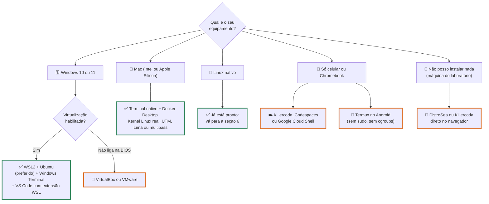
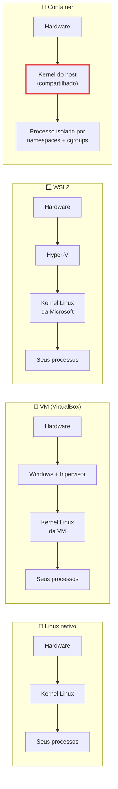
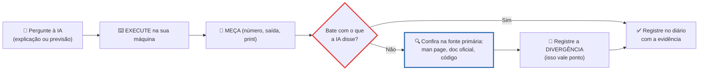

# Laboratório de SO - preparando o ambiente

> [!quote] Nesta disciplina, o sistema operacional não é slide
> *Você vai parar processos com sinais, provocar um OOM killer de propósito, medir quantas páginas de memória um LLM ocupa e prender um agente de IA dentro de um container. Nada disso cabe num caderno: cabe num terminal Linux. Esta página existe para que, ao fim de hoje, todo mundo tenha esse terminal, com rede de segurança para quando algo quebrar (e vai quebrar: é parte do plano).*

> [!abstract] 🧭 O que você vai fazer nesta aula
> Escolher o seu caminho para o Linux, instalar, provar com `uname -a` e `htop`, limitar os recursos da sua máquina virtual e ver o SO obedecer, criar a rede de segurança (snapshot ou `wsl --export`), montar a caixa de ferramentas numa linha só e combinar as regras de uso de IA do semestre.

![[Recursos/Sistemas operacionais/Laboratório de SO - preparando o ambiente/tux-mascote-linux.png|Tux, mascote do Linux, desenhado por Larry Ewing em 1996. O pinguim está em quase todo servidor, celular Android e supercomputador do planeta, e vai estar no seu notebook o semestre inteiro.]]

---

## 1. 🎯 O que você precisa (e qual caminho é o seu)

O requisito real é curto: **um Linux com terminal onde você possa usar `sudo`**. O resto é conforto.

| Recurso | Mínimo | Para que serve aqui |
|---|---|---|
| Linux com `sudo` | obrigatório | `/proc`, `strace`, cgroups, systemd |
| RAM e disco para o Linux | 4 GB e 15 GB (confortável: 8 GB e 40 GB) | labs de memória virtual, LLM local, imagens Docker |
| Virtualização na CPU | necessária para WSL2 e VM | ambos são máquinas virtuais |
| Docker | opcional, recomendado | "Linux descartável", labs de container |
| GPU NVIDIA | **não é necessária** | toda atividade com GPU tem variante em CPU |

> [!info] Por que Linux, e o que não repetimos aqui
> Porque é onde o mercado opera e onde o sistema se deixa examinar: o `/proc` mostra cada processo como uma pasta com seus arquivos abertos, seu mapa de memória e seu contador de trocas de contexto, em texto puro. Nenhum outro SO abre assim. Distribuições, VirtualBox, VMware e Kali via WSL2 já estão em [[Sistemas utilizados]]; aqui, só o que é específico de SO.



> [!warning] O caminho do navegador tem limite
> Killercoda, Codespaces e Cloud Shell resolvem a maior parte das atividades, mas **não** dão `perf` com contadores de hardware nem módulos de kernel. Se você depende só do navegador, me avise nesta primeira semana: os trabalhos têm variantes e o laboratório do campus tem máquinas com Linux.

---

## 2. 🪟 WSL2 passo a passo (o caminho preferido no Windows)

O WSL2 (Windows Subsystem for Linux, versão 2) não é emulador: é um **kernel Linux de verdade numa máquina virtual leve gerenciada pelo Hyper-V**, integrado ao Windows em arquivos, rede e GPU. O que você observa ali é um Linux legítimo, com `/proc`, cgroups e systemd.

Abra o **PowerShell como Administrador**, rode `wsl --install` (que, segundo a Microsoft, "habilita os recursos necessários para rodar o WSL e instala a distribuição Ubuntu do Linux") e **reinicie o computador**. Pré-requisito oficial: Windows 10 versão 2004 ou superior (**Build 19041+**) ou Windows 11.

```powershell
wsl --install            # instala o WSL + Ubuntu
wsl --list --online      # distros disponíveis (curto: wsl -l -o)
wsl --install -d Ubuntu  # instalar uma distro específica
wsl --list --verbose     # instaladas, estado e versão do WSL (wsl -l -v)
wsl --set-default-version 2
wsl --version            # versão do WSL, do kernel e do WSLg
wsl --shutdown           # desliga a VM do WSL2 (após mudar o .wslconfig)
```

![[Recursos/Sistemas operacionais/Laboratório de SO - preparando o ambiente/ubuntu-no-wsl.png|Ubuntu no Windows Terminal via WSL2. Na segunda linha o kernel se identifica como "5.15.133.1-microsoft-standard-WSL2": esse sufixo é a prova de que o Linux ali é real, com kernel compilado pela Microsoft.]]

| Armadilha que trava a turma todo ano | Conserto |
|---|---|
| `wsl --install` roda mas o Ubuntu não abre, ou erro de "virtual machine platform": **virtualização desligada na BIOS/UEFI** | reiniciar na BIOS (F2, F10, Del ou Esc) e ligar **Intel VT-x / AMD-V / SVM Mode**, em geral na aba Security ou Advanced |
| VirtualBox ou Docker Desktop pararam depois: o **Hyper-V** ocupa o hipervisor da máquina | VirtualBox 7 e VMware convivem, mas ficam lentos: use Docker Desktop com backend WSL2 e evite VM pesada ao mesmo tempo |
| Download trava em 0,0% ou falha sem mensagem: **antivírus ou proxy** interceptando a loja | a documentação sugere `wsl --install --web-download -d <DistroName>`; se persistir, pause o antivírus durante a instalação |

> [!tip] O terminal certo faz diferença
> Instale o **Windows Terminal** e o **VS Code** com a extensão **WSL**. Abrir uma pasta com `code .` de dentro do Ubuntu levanta um servidor remoto: o editor roda no Windows, e o compilador, o `strace` e o Python rodam no Linux. É o modelo usado em produção.

> [!example] 🧪 Atividade 1: Instalar o Linux e provar que ele é Linux
> **Ferramenta:** Gerenciador de Tarefas + PowerShell + Ubuntu no WSL2 (ou a sua VM, ou o Linux nativo).
>
> 1. Confirme a virtualização: Ctrl+Shift+Esc → **Desempenho** → **CPU** → linha **Virtualização**. No Linux: `grep -c -E 'vmx|svm' /proc/cpuinfo` (qualquer número maior que zero serve).
> 2. Instale pelo roteiro acima e crie usuário e senha quando o Ubuntu pedir.
> 3. Dentro do Ubuntu: `uname -a`, `lscpu | head -15`, `free -h && nproc`. No PowerShell: `wsl --list --verbose`.
>
> **Resultado esperado:** `uname -a` com o nome do kernel, a arquitetura `x86_64` e (no WSL2) o sufixo `-microsoft-standard-WSL2`; e `wsl -l -v` mostrando `VERSION 2`. Guarde o print: é metade da entrega de hoje. Virtualização **Desabilitado**? O conserto está na tabela acima.
>
> 🍎 **No macOS:** `uname -a` responde `Darwin`: é outro kernel, não é falha; para kernel Linux use Docker (seção 4) ou UTM/Lima. ☁️ **Sem máquina:** faça no Killercoda e diga isso na entrega.

### `.wslconfig`: você decidindo quanto a VM pode consumir

Seu primeiro exercício real de **gerência de recursos**. O arquivo não existe por padrão: crie em `%UserProfile%\.wslconfig` (isto é, `C:\Users\<seu-usuario>\.wslconfig`), válido para **todas** as distros WSL2.

```ini
# %UserProfile%\.wslconfig
[wsl2]
memory=4GB       # padrão: 50% da memória total do Windows
processors=2     # padrão: o mesmo número de processadores lógicos do Windows
swap=2GB         # padrão: 25% da memória, arredondado para cima
```

Pela Microsoft, `memory` aceita sufixo (`8GB`, `512MB`), `processors` é um número, e a mudança **só vale depois de** `wsl --shutdown` (a "regra dos 8 segundos": o subsistema precisa parar de verdade antes de reler a configuração).

> [!example] 🧪 Atividade 2: Cortar CPU e memória e ver o SO obedecer
> **Ferramenta:** Bloco de Notas + PowerShell + Ubuntu no WSL2 (em VM, faça o equivalente nas configurações da máquina).
>
> 1. No Ubuntu, anote os valores atuais: `nproc && free -h`.
> 2. No Windows, crie `%UserProfile%\.wslconfig` com o bloco acima, usando `processors=2` e `memory=2GB`.
> 3. No PowerShell: `wsl --shutdown`, espere alguns segundos e reabra o Ubuntu.
> 4. Rode de novo `nproc && free -h`. Depois desfaça e repita para voltar ao normal.
>
> **Resultado esperado:** `nproc` cai para `2` e o total do `free -h` cai para perto de 2 GB. Com três linhas de arquivo você fez o que um hipervisor faz: **particionar recursos físicos entre máquinas**. Anote os quatro números (antes e depois).

> [!tip] systemd dentro do WSL2
> Serviços, `journalctl` e limites com cgroups dependem do **systemd**. O Ubuntu do `wsl --install` já vem com ele; confira com `systemctl list-unit-files --type=service`. Se der erro, edite `/etc/wsl.conf` com `sudo`, acrescente as linhas abaixo e rode `wsl.exe --shutdown`:
> ```ini
> [boot]
> systemd=true
> ```

---

## 3. 💽 Máquina virtual: a rede de segurança dos labs destrutivos

VirtualBox, VMware e UTM já foram comparados em [[Sistemas utilizados]]. O que interessa aqui é **por que** ter uma VM mesmo tendo WSL2: o **snapshot**.

![[Recursos/Sistemas operacionais/Laboratório de SO - preparando o ambiente/virtualbox-gerenciador.png|O gerenciador do Oracle VM VirtualBox: cada linha é um sistema operacional inteiro dentro de um arquivo de disco, e à direita estão a memória, os processadores e a ordem de boot que o hipervisor entrega àquele "hardware" fictício.]]

| Situação da disciplina | WSL2 dá conta? | Por que a VM ajuda |
|---|---|---|
| `strace`, `/proc`, `htop`, `ps`, systemd, cgroups v2 | ✅ Sim | |
| Forçar **OOM killer** dentro de cgroup | ⚠️ Sim, mas trava a sessão | snapshot restaura em segundos |
| Container "na mão" (`unshare`, `pivot_root`) | ⚠️ Depende de user namespace liberado | a VM tem root de verdade |
| `sched_ext` (escalonador em eBPF) | ❌ Precisa de kernel 6.12+ | Ubuntu 26.04 LTS traz kernel GA 7.0 e cita `sched_ext` nas notas de versão |
| Quebrar o sistema sem perder o semestre | ❌ Reinstalar | snapshot |

**Qual ISO baixar:** **Ubuntu 24.04 LTS** (Noble Numbat, kernel 6.8) para estabilidade, ou **Ubuntu 26.04 LTS** (Resolute Raccoon, kernel GA 7.0) para as novidades do kernel. Server ocupa menos disco; Desktop é mais amigável. Instale depois o **Guest Additions** (VirtualBox) ou o **VMware Tools**, sem os quais falta área de transferência compartilhada, pasta compartilhada e resolução decente.

> [!danger] Antes de qualquer laboratório destrutivo, snapshot
> Existem atividades feitas para quebrar: estourar memória até o kernel matar o processo, encher o disco, trocar a política de escalonamento. A regra da casa é **snapshot antes, experimento depois**; quem não tem VM usa `wsl --export`.

> [!example] 🧪 Atividade 3: Criar a sua rede de segurança
> **Ferramenta:** VirtualBox (**Máquina → Snapshots → Tirar**) ou `wsl --export`.
>
> 1. **Em VM:** com a máquina desligada, tire um snapshot `limpo-2026-09-03`. Ligue, crie um arquivo bobo (`touch ~/EU_QUEBREI_TUDO`), desligue e **restaure** o snapshot.
> 2. **No WSL2:** exporte a distro no PowerShell (`wsl --export Ubuntu C:\backup\ubuntu-limpo.tar`) e guarde o `.tar`. Para restaurar depois de um desastre: `wsl --unregister Ubuntu` e então `wsl --import Ubuntu C:\WSL\Ubuntu C:\backup\ubuntu-limpo.tar`.
>
> **Resultado esperado:** na VM, `EU_QUEBREI_TUDO` **desaparece** após a restauração (prova de que o snapshot funciona). No WSL2, um `.tar` no disco com a data de hoje. Sem essa rede, não faça os labs destrutivos do semestre.

---

## 4. 🐳 Docker: o Linux descartável

Docker é o jeito mais rápido de ter "outra distribuição", e o mais fácil de jogar fora:

```bash
docker run -it --rm ubuntu:24.04 bash                            # apagado ao sair (--rm)
docker run -it --rm --memory=256m --cpus=0.5 ubuntu:24.04 bash   # com limites
docker run hello-world                                           # teste de instalação
```

No Ubuntu, instale pelo repositório oficial (`docker-ce`, `docker-ce-cli`, `containerd.io`, `docker-buildx-plugin`, `docker-compose-plugin`). No Windows e no macOS, **Docker Desktop** com backend WSL2.

> [!warning] Container não é máquina virtual
> Um container **compartilha o kernel do host**: por isso sobe instantaneamente e por isso **não** serve para testar módulo de kernel nem `sched_ext`. E o perfil seccomp padrão do Docker bloqueia cerca de 44 chamadas de sistema, entre elas `mount`, `unshare`, `setns`, `ptrace` e `perf_event_open`, então várias atividades não rodam em container sem `--privileged` ou `--security-opt seccomp=unconfined`. Quando acontecer, não é bug seu: veja [[Containers e Virtualização]].



> [!example] 🧪 Atividade 4: Provar que o container usa o kernel da sua máquina
> **Ferramenta:** Docker (Desktop no Windows/macOS, Engine no Linux).
>
> 1. No host, anote: `uname -r && head -2 /etc/os-release`.
> 2. Repita dentro de containers de duas distros diferentes e leia o limite que você mesmo impôs:
>    ```bash
>    docker run -it --rm ubuntu:24.04 bash -c 'uname -r; head -2 /etc/os-release'
>    docker run -it --rm debian:12   bash -c 'uname -r; head -2 /etc/os-release'
>    docker run -it --rm --memory=64m ubuntu:24.04 cat /sys/fs/cgroup/memory.max
>    ```
>
> **Resultado esperado:** `uname -r` **idêntico** nos três casos, mas `/etc/os-release` diferente: você trocou de distribuição sem trocar de kernel. E `memory.max` mostra `67108864` (64 MB em bytes). Anote as saídas lado a lado.
>
> 🪟 **No Windows:** rode dentro do Ubuntu do WSL2 com Docker Desktop no backend WSL2.

---

## 5. ☁️ Sem instalar nada: Linux no navegador

Notebook morreu, máquina do laboratório ou só celular? Dá para acompanhar boa parte da disciplina pelo navegador.

| Plataforma | O que dá | Limite (fonte oficial) |
|---|---|---|
| [Killercoda](https://killercoda.com/playgrounds/scenario/ubuntu) | playground Ubuntu e cenários de Linux, Docker e Kubernetes | limites não publicados; exige conta |
| [GitHub Codespaces](https://github.com/features/codespaces) | VM Linux com VS Code no navegador e `sudo`; menor máquina: 2 núcleos, 8 GB de RAM, 32 GB de disco | **120 h de núcleo e 15 GB-mês** no Free, **180 h e 20 GB** no Pro; a máquina de 4 núcleos gasta o dobro por hora |
| [Google Cloud Shell](https://shell.cloud.google.com/) | Debian com `sudo` e 5 GB de home persistente | **50 h por semana**; sessão cai com 40 min de inatividade e no máximo 12 h; home apagado após 120 dias sem uso |
| [DistroSea](https://distrosea.com/) | "Test drive Linux distros online": 100+ sistemas em desktop remoto | sessão curta, sem persistência, sem conta |
| Termux (Android) | shell Linux no celular, com `pkg install` | sem `sudo`, sem cgroups, `/proc` incompleto |

⚠️ O antigo **Play with Docker** (`labs.play-with-docker.com`), muito citado em tutoriais, foi descontinuado (indisponível desde 1º de março de 2026). Use Killercoda ou Codespaces.

> [!example] 🧪 Atividade 5: Um Linux que você não instalou
> **Ferramenta:** Killercoda ou GitHub Codespaces (faça mesmo com a máquina ok: é o seu plano B do semestre).
>
> 1. **Killercoda:** abra <https://killercoda.com/playgrounds/scenario/ubuntu> e inicie o playground. **Codespaces:** em um repositório seu, **Code → Codespaces → Create codespace on main**.
> 2. No terminal remoto: `uname -a && nproc && free -h`, depois `grep 'model name' /proc/cpuinfo | head -1` e `id`.
>
> **Resultado esperado:** print do terminal remoto com as saídas e uma linha comparando com a Atividade 1 ("na minha máquina são N núcleos, aqui são M"). No Codespaces, **pare o codespace** ao terminar: as horas correm com ele ligado.

---

## 6. 🧰 A caixa de ferramentas (uma linha de comando)

Com estas ferramentas você vai observar processos, memória e chamadas de sistema o semestre inteiro. No Ubuntu, instale tudo de uma vez:

```bash
sudo apt update
sudo apt install -y htop btop strace ltrace lsof sysstat stress-ng bpftrace \
  linux-tools-common util-linux procps psmisc smem valgrind \
  git curl python3-venv python3-pip gcc make
```

| Pacote | O que você vai fazer com ele | Aula |
|---|---|---|
| `htop`, `btop`, `procps` (`ps`, `top`, `free`, `vmstat`, `pmap`), `psmisc` (`pstree`, `fuser`) | processos e threads ao vivo, árvore de fork, memória, trocas de contexto | [[Processos]] |
| `strace`, `ltrace`, `lsof` | **cada chamada de sistema** que um programa faz e o que ele tem aberto | [[Chamadas de Sistema]] |
| `sysstat` (`pidstat`, `sar`), `linux-tools-common` (`perf`), `stress-ng` | CPU, faltas de página e migrações sob carga controlada | [[Escalonamento de Processos]] |
| `smem`, `valgrind` (`--tool=lackey`) | memória em USS/PSS/RSS e trace real de acessos | [[Gerenciamento de Memória]], [[Memória Virtual e Substituição de Páginas]] |
| `bpftrace`, `util-linux` (`unshare`, `nsenter`, `taskset`, `chrt`) | eBPF sem recompilar nada; namespaces, afinidade e política de escalonamento | [[Linux na prática]], [[Containers e Virtualização]] |
| `git`, `curl`, `gcc`, `make`, `python3-venv` | clonar, baixar, compilar, isolar ambientes Python | todos os trabalhos |

> [!info] Dois detalhes que economizam uma hora de frustração
> O `perf` é casado com o kernel: se `linux-tools-common` não bastar, instale `linux-tools-$(uname -r)`; no WSL2 isso costuma falhar (kernel da Microsoft), então use `/usr/bin/time -v` e `pidstat`. E `time` no bash é palavra reservada do shell, **não** o `/usr/bin/time`: para faltas de página, use o caminho completo.

> [!tip] 🪟 E no Windows? A caixa de ferramentas nativa
> O **Sysinternals Suite** (Microsoft) cobre metade da tabela: **Process Explorer** ([download](https://download.sysinternals.com/files/ProcessExplorer.zip)) é o `htop` do Windows, com handles, DLLs carregadas e árvore de processos, e roda direto de <https://live.sysinternals.com/procexp.exe> sem instalar; **Process Monitor** é o `strace` do Windows; **VMMap** e **RAMMap** cuidam de memória. Sem baixar nada: `tasklist`, `Get-Process` e `resmon`.

> [!example] 🧪 Atividade 6: Instalar a caixa e ver a primeira syscall da sua vida
> **Ferramenta:** `apt`, `strace`, `htop`, `pstree`.
>
> 1. Rode o `apt install` completo acima e conte as chamadas de sistema de um simples `ls`: `strace -c ls /tmp`.
> 2. No `htop`, aperte **F5** (árvore), **H** (threads) e **F6** (ordenar por memória); ache o processo que mais consome memória. Depois, `pstree -p | head -20` para localizar o `bash` de onde você está digitando.
>
> **Resultado esperado:** uma tabela como esta, saída real de um Ubuntu com kernel 6.8 (a sua terá números diferentes, e é isso que interessa):
> ```
> % time     seconds  usecs/call     calls    errors syscall
> ------ ----------- ----------- --------- --------- ----------------
>  21,66    0,000060           3        18           mmap
>  12,64    0,000035           4         8           newfstatat
>  11,19    0,000031          15         2           getdents64
>   7,94    0,000022           3         7           openat
> ```
> Responda no caderno: **quantas syscalls diferentes** o `ls` fez e qual delas leu o conteúdo do diretório? (A resposta completa vem em [[Chamadas de Sistema]].) Entregue também o print do `htop` com a árvore aberta.

### `uv`, o Python sem GIL e os simuladores da OSTEP

Os laboratórios de [[Threads]] comparam Python com e sem GIL (Global Interpreter Lock, a trava global que, na documentação oficial, faz com que "apenas uma thread execute código Python por vez"). Desde o Python 3.14 (out/2025) a versão **free-threaded** é oficialmente suportada; instale com o `uv`, cuja documentação avisa que essas versões "só são selecionadas quando explicitamente pedidas, por exemplo com `3.13t`".

```bash
curl -LsSf https://astral.sh/uv/install.sh | sh
uv python install 3.14 3.14t   # o sufixo "t" é o free-threaded
uv python list
```

> [!example] 🧪 Atividade 7: O Python que desliga a trava global, e os simuladores da OSTEP
> **Ferramenta:** `uv` + `git` + simuladores do livro aberto *Operating Systems: Three Easy Pieces*.
>
> 1. Instale os dois interpretadores com o bloco acima.
> 2. Pergunte a cada um se a trava está ligada:
>    ```bash
>    uv run --python 3.14  python -c "import sys; print(sys._is_gil_enabled())"
>    uv run --python 3.14t python -c "import sys; print(sys._is_gil_enabled())"
>    ```
> 3. Clone os simuladores e rode o primeiro:
>    ```bash
>    git clone https://github.com/remzi-arpacidusseau/ostep-homework ~/so/ostep-homework
>    cd ~/so/ostep-homework/cpu-intro && python3 process-run.py -l 5:100,5:100 -c
>    ```
>
> **Resultado esperado:** `True` no primeiro comando e `False` no segundo (a trava desligada é literalmente a diferença entre `3.14` e `3.14t`), e o `process-run.py` imprimindo a linha do tempo com os estados `RUN`, `READY` e `WAITING`. Esse simulador volta em [[Escalonamento de Processos]].
>
> ☁️ **Sem máquina:** roda igual no Codespaces e no Killercoda. 🪟 **No Windows:** o `uv` tem instalador para PowerShell, mas prefira fazer dentro do WSL2.

> [!tip] Opcional, para dezembro: Ollama
> Em [[Sistemas Operacionais na Era da IA]] vamos medir um modelo de linguagem local. **Não precisa de GPU**: todo lab tem variante em CPU com modelos pequenos. `ollama ps` mostra o que está carregado e onde (CPU ou GPU).
> ```bash
> curl -fsSL https://ollama.com/install.sh | sh   # ou em container:
> docker run -d -v ollama:/root/.ollama -p 11434:11434 --name ollama ollama/ollama
> ```

---

## 7. 🤖 IA como copiloto de laboratório (as regras da disciplina)

Você vai usar IA aqui. Isso não é tolerado, é **esperado**: é como se trabalha em 2026, e [[Desenvolvimento de Software com IA]] e [[Vibe Coding e Engenharia Agêntica]] tratam disso a fundo. O que muda é o que eu avalio: não o texto que a IA produziu, mas a **evidência de que você executou, mediu e conferiu**. Um grupo de trabalho da ITiCSE 2024 registra a virada de "produto" para "processo" e resume numa regra: *"um estudante precisa ser capaz de explicar o código que entrega"*.

| ✅ Pode (e deve) | ❌ Não pode |
|---|---|
| Pedir que a IA **explique** uma saída de `strace`, um campo de `/proc`, um erro | Entregar a explicação da IA como se fosse sua medição |
| Pedir que a IA **gere** script, `Makefile`, gráfico | Entregar código que você não sabe explicar linha a linha |
| Pedir **hipóteses** e **previsões** antes de você medir | Inventar número: todo valor vem de uma execução sua |
| Usar IA para revisar o texto do relatório | Omitir que usou IA, ou colar comando destrutivo sem entender |



Divergência não é fracasso, é achado: quando a IA erra a flag ou inventa um campo de `/proc`, **isso vira parágrafo do relatório**, com a man page citada ao lado.

**Diário de uso de IA (obrigatório em todos os trabalhos).** Por marco: data, o que eu tentei, **o que a IA gerou** (ferramenta, versão, prompt resumido), o que estava errado, o que eu mudei e a **evidência** (commit, log, print). Fecha com a declaração de uso: quais ferramentas, para quê, quais trechos foram gerados e revisados, e o que foi feito sem IA. Modelo e rubrica em [[Possíveis trabalhos e projetos de Sistemas Operacionais]]. Na defesa oral sorteio três perguntas: uma sobre um artefato **seu** (uma linha do seu `strace`), uma contrafactual ("e se mudasse X?") e uma de mercado ("como isso aparece num incidente?").

> [!danger] Comandos que você nunca cola sem entender
> | Comando | O que pode acontecer |
> |---|---|
> | `rm -rf /` ou `rm -rf $VAR/` com a variável vazia | apaga o sistema inteiro: a variável vazia vira `rm -rf /` |
> | `dd if=... of=/dev/sda` | escreve direto no disco, destruindo partições e dados |
> | `curl ... \| bash` ou `wget -O- ... \| sh` | executa como você um script que você não leu: baixe, leia, depois rode |
> | `chmod -R 777 /` ou `mkfs.ext4 /dev/sdX` | destrói o modelo de permissões ([[Segurança em Sistemas Operacionais]]); formata o dispositivo |
> | `:(){ :\|:& };:` | fork bomb: trava a máquina esgotando a tabela de processos |
>
> Regra prática: **se o comando toca em `/dev`, na raiz `/` ou usa `-rf`, releia duas vezes e confirme que existe snapshot.** Vamos rodar uma fork bomb de propósito no semestre, dentro de um cgroup com limite, e aí é seguro.

> [!example] 🧪 Atividade 8: Colocar a IA à prova com a man page
> **Ferramenta:** qualquer assistente de IA (ChatGPT, Claude, Gemini, Copilot) + `strace` + `man`.
>
> 1. **Antes de rodar qualquer coisa**, pergunte ao assistente: *"quantas chamadas de sistema distintas o comando `ls /tmp` faz num Ubuntu 24.04, e quais são as três mais frequentes?"*. Copie a resposta.
> 2. Meça de verdade (`strace -c ls /tmp`) e confira na fonte primária: `man 2 mmap | head -30` e `man 2 getdents64 | head -20`.
> 3. Pergunte à IA o que faz uma flag que você não conhece (por exemplo `strace -f`), rode `man 1 strace` e confirme se bate.
>
> **Resultado esperado:** um parágrafo de 5 linhas com o que a IA previu, o que a sua máquina mediu e a citação da man page que resolveu a diferença. Se a IA acertou, diga; se errou, mostre onde. Esse parágrafo é o modelo de tudo que você vai entregar no semestre.

---

## 8. ✅ Checklist "ambiente pronto"

Esta é a entrega da primeira semana de laboratório (o professor confirma a data em aula):

| # | Item | Como provar | Obrigatório |
|---|---|---|---|
| 1 | Um Linux com terminal e `sudo` | `uname -a` | ✅ sim |
| 2 | Sei quantos núcleos e quanta RAM ele tem | `lscpu`, `free -h`, `nproc` | ✅ sim |
| 3 | `htop` e a caixa de ferramentas instalados | print do `htop` (F5) e `strace -c ls` | ✅ sim |
| 4 | Rede de segurança criada | snapshot da VM ou `.tar` do `wsl --export` | ✅ sim |
| 5 | Conta no GitHub criada | usuário | ✅ sim |
| 6 | Plano B no navegador testado | print do Killercoda ou Codespaces | ⚠️ recomendado |
| 7 | Docker funcionando | `docker run hello-world` | ⚪ opcional |
| 8 | `uv` com `3.14` e `3.14t`, OSTEP clonado | `sys._is_gil_enabled()` dando `True` e `False` | ⚪ obrigatório em out/2026 |

> [!success] O que entregar hoje na aula
> **Dois prints, num único PDF, com o seu nome:** a saída de **`uname -a`** no seu Linux (WSL2, VM, nativo, Codespaces ou Killercoda; diga qual) e o **`htop`** rodando, com a árvore de processos aberta (tecla **F5**).
>
> Quem está no navegador entrega igual, com uma linha explicando por quê. Ninguém fica de fora por causa de hardware: quem estiver travado fala comigo hoje, porque a próxima aula é [[Chamadas de Sistema]] e exige `strace` funcionando.

---

## ❓ Quiz rápido

> [!question]- 1. Você roda `uname -r` no Ubuntu do WSL2 e depois dentro de `docker run -it ubuntu:24.04 bash`. O que acontece?
> **Resposta:** a saída é **a mesma**. O container compartilha o kernel do host e troca só o espaço de usuário (bibliotecas, `apt`, `/etc/os-release`). É por isso que ele sobe em milissegundos e por isso não serve para testar módulo de kernel nem `sched_ext`.

> [!question]- 2. Você editou o `.wslconfig` com `processors=2`, fechou a janela do Ubuntu, abriu de novo, e `nproc` continua mostrando 12. Por quê?
> **Resposta:** fechar a janela não desliga a máquina virtual do WSL2. É preciso `wsl --shutdown` e esperar (a Microsoft fala em cerca de 8 segundos) até o subsistema parar de verdade e reler a configuração.

> [!question]- 3. Qual destas afirmações está ERRADA? (a) o `.wslconfig` fica em `%UserProfile%`; (b) `wsl --export` gera um `.tar` que serve de backup; (c) o Docker padrão permite qualquer chamada de sistema; (d) snapshot de VM restaura o estado anterior em segundos.
> **Resposta:** a **(c)**. O perfil seccomp padrão do Docker bloqueia cerca de 44 chamadas de sistema, entre elas `mount`, `unshare`, `setns`, `ptrace` e `perf_event_open`, e por isso vários labs de namespaces não rodam em container comum.

> [!question]- 4. A IA afirma que `strace -c ls` mostra `read` como a syscall mais frequente. Você roda e vê `mmap` no topo. Qual é o procedimento correto?
> **Resposta:** confiar na **sua medição**, conferir na fonte primária (`man 2 mmap`) por que `mmap` domina (o carregador dinâmico mapeia a libc e outras bibliotecas antes de o `ls` fazer qualquer coisa) e **registrar a divergência** no diário de uso de IA. Divergência documentada vale ponto; número inventado zera.

> [!question]- 5. Você só tem um Chromebook. Qual combinação faz mais sentido e qual limite você precisa conhecer?
> **Resposta:** **Codespaces** como base (Linux com `sudo` e VS Code no navegador, 120 horas de núcleo e 15 GB-mês grátis no plano Free) e **Killercoda** para tarefas rápidas. Limites: as horas correm enquanto o codespace está ligado, e não há contadores de hardware do `perf` nem módulos de kernel, então esses labs têm variantes específicas.

---

## 🔗 Veja também

- [[Sistemas utilizados]]: distribuições, VirtualBox, VMware e Kali via WSL2, detalhados na disciplina de Segurança.
- [[Instalação e configurações]]: Python, Git e editores, o outro lado do mesmo problema.
- [[Linux na prática]]: comandos do dia a dia, permissões, systemd e `journalctl`.
- [[Containers e Virtualização]] e [[Docker - gerenciamento de containers]]: o que há por baixo do `docker run` de hoje.
- [[Possíveis trabalhos e projetos de Sistemas Operacionais]]: o modelo do diário de uso de IA e as rubricas.
- [[Materiais, cursos e certificações de SO]], [[Glossário de Sistemas Operacionais]].
- ➡️ **Próxima aula:** [[Introdução aos Sistemas Operacionais]]

---

> [!note] 📚 Fontes (2026)
> - Microsoft Learn: [Install WSL (jun/2026)](https://learn.microsoft.com/windows/wsl/install) · [Basic commands (dez/2025)](https://learn.microsoft.com/en-us/windows/wsl/basic-commands) · [`.wslconfig` e `wsl.conf` (abr/2026)](https://learn.microsoft.com/windows/wsl/wsl-config) · [Process Explorer (ago/2026)](https://learn.microsoft.com/en-us/sysinternals/downloads/process-explorer)
> - [Codespaces overview](https://docs.github.com/en/codespaces/overview) e [cotas por plano](https://docs.github.com/en/billing/concepts/product-billing/github-codespaces) · [Cloud Shell limitations](https://docs.cloud.google.com/shell/docs/limitations) · [Killercoda Ubuntu](https://killercoda.com/playgrounds/scenario/ubuntu) · [DistroSea](https://distrosea.com/)
> - [Docker Engine no Ubuntu](https://docs.docker.com/engine/install/ubuntu/) · [Seccomp profiles for Docker](https://docs.docker.com/engine/security/seccomp/) · [Ubuntu 26.04 LTS](https://documentation.ubuntu.com/release-notes/26.04/summary-for-lts-users/) · [kernels Ubuntu](https://ubuntu.com/kernel/lifecycle)
> - [uv: builds free-threaded](https://docs.astral.sh/uv/concepts/python-versions/) · [What's New in Python 3.14](https://docs.python.org/3/whatsnew/3.14.html) · [free threading](https://docs.python.org/3/howto/free-threading-python.html) · [OSTEP homework](https://github.com/remzi-arpacidusseau/ostep-homework) · [Ollama](https://docs.ollama.com/linux) e [em Docker](https://docs.ollama.com/docker) · [`time(1)`](https://man7.org/linux/man-pages/man1/time.1.html)
> - Prather et al., *Beyond the Hype* (ITiCSE Working Group 2024, [DOI 10.1145/3689187.3709614](https://doi.org/10.1145/3689187.3709614))
> - Imagens (Wikimedia Commons): [Tux.svg (Larry Ewing e The GIMP)](https://commons.wikimedia.org/wiki/File:Tux.svg) · [Ubuntu WSL.png](https://commons.wikimedia.org/wiki/File:Ubuntu_WSL.png) · [VirtualBox Screenshot ENG 2021](https://commons.wikimedia.org/wiki/File:VirtualBox_Screenshot_ENG_2021.01.25_-_22.08.59.74_neu.png)
