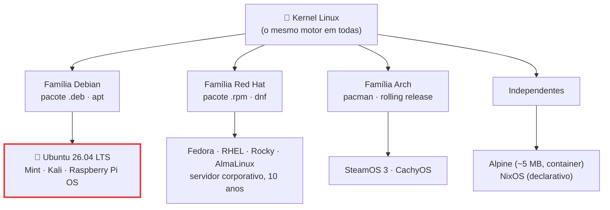
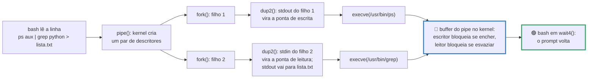
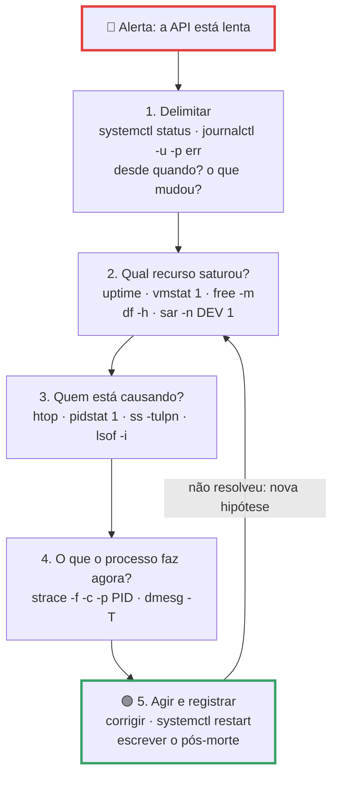

# Linux na prática

> [!quote] O sistema que você não vê, mas que sustenta tudo
> *Desde novembro de 2017, os 500 supercomputadores mais rápidos do planeta rodam kernel Linux, sem exceção. Em setembro de 2026, o W3Techs mede sistemas Unix em 92,0% dos sites da web. A GPU que responde ao seu chatbot, o roteador da sua casa, o Android no seu bolso e o container onde a sua API vai para produção usam as mesmas chamadas de sistema das aulas anteriores. A diferença é que hoje você opera essa máquina em vez de só descrevê-la.*

> [!abstract] 🧭 O que você vai fazer nesta aula
> Identificar a sua máquina, atravessar o sistema de arquivos como quem caça um bug, quebrar e consertar permissões, escrever um serviço `systemd` real para uma API Python com `MemoryMax=100M` e ver o kernel matar e reiniciar o processo, ler o log com `journalctl`, agendar um timer, achar quem está na porta 8000, aplicar um runbook de incidente em cinco passos, escrever um backup que passa no `shellcheck` e limitar a memória do seu WSL2. Sem ambiente ainda? Comece por [[Laboratório de SO: preparando o ambiente]].

---

## 1. 🐧 Por que Linux (e qual Linux)

![[Recursos/Sistemas operacionais/Linux na prática/tux.png|Tux, o mascote do kernel Linux, desenhado por Larry Ewing em 1996 (Wikimedia Commons)]]

| Onde | Número | Fonte e data |
|---|---|---|
| Sites da web | Unix 92,0%, Windows 8,2%; entre os Linux, Ubuntu 15,1% e Debian 5,9% | W3Techs, 02/09/2026 |
| Supercomputadores | 500 de 500 com Linux; nº 1 LineShine (China), 2.198,40 PFlop/s, Kylin OS | TOP500, jun/2026 |
| Nuvem e ferramentas | AWS 43,3%, Azure 26,3%; Docker 71,1% (+17 pontos em um ano), Kubernetes 28,5% | Stack Overflow, 2025 |
| Celular e desktop | Android 67,61% no mundo; Linux 8,88% no desktop e 3,90% no Steam (recorde de 5,33% em mar/2026, puxado pelo SteamOS) | StatCounter e Steam, ago/2026 |
| Quem programa | Ubuntu 27,7% e WSL 17,1% no uso pessoal | Stack Overflow, 2024 |

Leia de cima para baixo: **quanto mais perto do desktop, menos Linux; quanto mais perto de onde o software roda de verdade, mais Linux.** Você vai desenvolver no Windows e entregar no Linux, e é essa a razão prática desta aula.

> [!info] Distribuição não é sistema operacional
> O kernel é um projeto só (`kernel.org`: mainline 7.3-rc1, estável 7.2.3, LTS 6.18.49 em 02/09/2026). Uma **distribuição** é o kernel mais bibliotecas GNU, gerenciador de pacotes, init, ambiente gráfico e política de atualização. Trocar de distro é trocar de montadora, não de motor.



| Objetivo | Escolha | Por quê |
|---|---|---|
| Aprender e trabalhar (nosso caso) | **Ubuntu LTS** | Mais tutoriais, 5 anos de suporte, padrão do WSL, o Linux mais comum na web |
| Servidor de banco, governo, empresa | RHEL, Rocky, AlmaLinux | Ciclo de 10 anos, certificação RHCSA, suporte contratado |
| Imagem de container pequena | Alpine | Usa `musl` no lugar da `glibc`, o que às vezes quebra binário compilado para Ubuntu |
| Última versão de tudo, sempre | Arch | Rolling release: nunca "vira de versão", mas quebra se você não ler o changelog |

O **Ubuntu 26.04 LTS** ("Resolute Raccoon", 23/04/2026) traz kernel 7.0, `sudo-rs` e coreutils em Rust, criptografia com TPM em disponibilidade geral, CUDA e ROCm nos repositórios e só Wayland. Serve 24.04 ou 26.04: os comandos são os mesmos.

> [!example] 🧪 Atividade 1: A identidade da sua máquina em cinco comandos
> **Ferramenta:** terminal Linux (WSL2, VM ou Docker).
>
> 1. Rode e cole as cinco saídas:
>    ```bash
>    cat /etc/os-release | head -3     # distribuição e versão
>    uname -r ; uname -m               # versão do kernel e arquitetura
>    ps -p 1 -o pid,comm=              # quem é o PID 1 (o init)
>    command -v apt dnf pacman apk     # qual gerenciador de pacotes existe aqui
>    ```
> 2. Compare o seu `uname -r` com a lista em [kernel.org](https://www.kernel.org/): você está na série LTS ou na estável?
> 3. Peça a uma IA para **prever** as cinco saídas antes de rodar. Onde ela errou?
>
> **Resultado esperado:** as saídas coladas, mais uma frase dizendo distro, família e quantas versões de kernel você está atrás do mainline.
>
> 🪟 **No Windows:** rode dentro do WSL2 (`wsl` no PowerShell); para comparar, `Get-ComputerInfo | Select OsName, OsVersion`. 🍎 **No macOS:** `sw_vers` e `uname -r` (o kernel é XNU, não Linux).

---

## 2. 💻 O shell, o FHS e "tudo é arquivo"

O **shell** (interpretador de comandos) é um programa comum, em modo usuário, que faz três coisas: lê a linha, cria processos com `fork` e `execve`, e espera com `wait4`. Você viu esse mecanismo em [[Processos]]; aqui ele vira produtividade.

O **bash** 5.3 é o padrão de quase toda distro e o que os scripts do mundo assumem: comando externo roda em ambiente separado, herdando arquivos abertos, diretório atual, `umask` e variáveis exportadas. O **zsh** 5.9 é o padrão do macOS, o **fish** 4.8.1 foi reescrito de C++ para Rust em 2025 e não é compatível com `sh`. No Windows, o **PowerShell** 7.6 "aceita e devolve objetos .NET": no Unix o que passa pelo `|` é um fluxo de bytes que cada programa reinterpreta; no PowerShell passa um objeto com propriedades. Filosofias diferentes, não uma melhor que a outra.

![[Recursos/Sistemas operacionais/Linux na prática/fhs-hierarquia.png|A hierarquia padrão do sistema de arquivos Unix (FHS): cada diretório da raiz tem função definida, e é por isso que um comando aprendido no Ubuntu funciona no Rocky (Wikimedia Commons)]]

| Diretório | O que guarda | Quando você vai lá |
|---|---|---|
| `/etc` | Configuração do sistema, em texto puro | `/etc/passwd`, `/etc/fstab`, units do systemd |
| `/var/log` | Logs | Investigar incidente (junto com `journalctl`) |
| `/proc` | Sistema de arquivos **virtual**: o kernel expondo processos e estado | `/proc/PID/status`, `/proc/meminfo`, `/proc/pressure/memory` |
| `/sys` | Kernel expondo dispositivos, drivers e **cgroups** | `/sys/fs/cgroup/...` (limites de container) |
| `/dev` | Arquivos de dispositivo | `/dev/null`, `/dev/sda`, `/dev/nvidia0` |
| `/opt`, `/tmp` | Software de terceiros; temporários apagados no boot | Onde a sua API vai morar; `/tmp` tem permissão `1777` |

> [!info] "Tudo é arquivo"
> Processo, memória, dispositivo, socket e estado do kernel aparecem como **arquivo** e por isso respondem às mesmas quatro chamadas de sistema (`open`, `read`, `write`, `close`) de [[Chamadas de Sistema]]. Ler o estado de um processo não exige API especial: é `cat /proc/PID/status`.

Quando você digita `ps aux | grep python > lista.txt`, o bash executa uma coreografia de chamadas de sistema: é o **pipe anônimo** de [[Comunicação entre Processos]].



Cinco operadores para decorar: `>` sobrescreve a saída, `>>` acrescenta, `2>` redireciona só o erro, `2>&1` junta erro com saída, `<` alimenta a entrada. E `|` liga a saída de um à entrada do outro sem passar pelo disco.

Quando você não sabe o comando: `man 5 systemd.service` (o número é a seção: 1 comandos, 2 syscalls, 5 formatos de arquivo), `tldr` para exemplos curtos (`pipx install tldr`, ou o cliente web em [tldr.inbrowser.app](https://tldr.inbrowser.app)) e [explainshell.com](https://explainshell.com/), que mapeia **cada flag** de uma linha ao trecho da man page: é o melhor jeito de conferir comando que a IA gerou.

> [!example] 🧪 Atividade 2: Um passeio pelo FHS provando que "tudo é arquivo"
> **Ferramenta:** terminal Linux e [explainshell.com](https://explainshell.com/).
>
> 1. Leia o kernel como texto e rode um pipeline com redirecionamento:
>    ```bash
>    grep MemTotal /proc/meminfo ; ls -l /dev/null ; ls /sys/fs/cgroup | head -5
>    cat /proc/self/status | head -12     # o "cat" descrevendo a si mesmo
>    ps -eo pid,ppid,stat,comm | grep -v '\[' | wc -l > /tmp/procs.txt ; cat /tmp/procs.txt
>    ls /naoexiste 2> /tmp/erro.txt ; cat /tmp/erro.txt
>    ```
> 2. Cole a linha do `ps` no explainshell e tire o print com cada flag explicada.
>
> **Resultado esperado:** o `State:` do `/proc/self/status` (tem que ser `R`, porque o `cat` está rodando naquele instante), o número dentro de `/tmp/procs.txt` e o print do explainshell.
>
> 🪟 **No Windows:** `Get-Process | Measure-Object` faz o mesmo pipeline com objetos; não existe `/proc`, o equivalente é o Process Explorer.

> [!example] 🧪 Atividade 3: OverTheWire Bandit, níveis 0 a 10
> **Ferramenta:** [OverTheWire Bandit](https://overthewire.org/wargames/bandit/), jogo em que cada senha está escondida atrás de um comando de shell.
>
> 1. Conecte com `ssh -p 2220 bandit0@bandit.labs.overthewire.org` (senha do nível 0: `bandit0`).
> 2. Suba do nível 0 ao 10: vai precisar de `ls -la`, `cat`, `file`, `find`, `grep`, `sort`, `uniq`, `du`, `base64` e de aspas para nomes de arquivo estranhos.
> 3. Ao final, rode `history > bandit.txt` e comente cada linha decisiva.
>
> **Resultado esperado:** print da tela do nível 11 (prova de que passou do 10) e o `bandit.txt` comentado. Prepare-se para refazer o nível 8 ao vivo em 2 minutos.
>
> 🪟 **No Windows:** o `ssh` já vem no Windows 10 e 11; o comando roda direto no PowerShell.

> [!example] 🧪 Atividade 4: cmdchallenge, dez one-liners
> **Ferramenta:** [cmdchallenge.com](https://cmdchallenge.com/) (roda no navegador) e [explainshell.com](https://explainshell.com/).
>
> 1. Resolva 10 desafios, começando pelos de listar, contar e filtrar arquivos.
> 2. Para três deles, cole a sua solução no explainshell e salve o print.
> 3. Peça a uma IA uma solução alternativa para 1 desafio, rode as duas e cronometre com `time`.
>
> **Resultado esperado:** print dos 10 desafios resolvidos, 3 prints do explainshell e uma frase dizendo qual solução (sua ou da IA) é mais legível e por quê.
>
> 🪟 **No Windows:** roda no navegador, não precisa de Linux local. Para treinar offline, o [Linux Journey](https://labex.io/linuxjourney) cobre Command Line, Text-Fu e Permissions.

---

## 3. 🔐 Usuários, grupos e permissões

Todo arquivo tem dono (UID), grupo (GID) e nove bits de permissão em três blocos: dono, grupo, outros. Cada bloco tem `r` (ler, 4), `w` (escrever, 2) e `x` (executar, 1). A soma dentro do bloco é o **octal**. Saída real de um Ubuntu:

```console
$ stat -c '%a %A %U:%G %n' /etc/passwd /usr/bin/passwd /tmp
644 -rw-r--r-- root:root /etc/passwd
4755 -rwsr-xr-x root:root /usr/bin/passwd
1777 drwxrwxrwt root:root /tmp
```

| Octal | Significado | Uso típico |
|---|---|---|
| `600` | só o dono lê e escreve | Chave privada SSH (o `ssh` recusa a chave se for mais aberta) |
| `640` | dono lê e escreve, grupo só lê | Configuração com segredo, lida por um grupo de serviço |
| `755` | todos leem e executam, só o dono escreve | Programa, diretório |
| `4755` | `755` mais **setuid** | `/usr/bin/passwd` roda com o UID do dono (root), não do chamador: é assim que um usuário comum edita `/etc/shadow` |
| `1777` | `777` mais **sticky bit** | `/tmp`: todo mundo escreve, mas só o dono apaga o próprio arquivo |

> [!warning] O `x` em diretório não é "executar"
> Em diretório, `x` significa **atravessar**. Sem `x` você não entra, mesmo tendo `r`; e `r` sem `x` deixa listar os nomes, mas não ler os arquivos. É a causa nº 1 de "permission denied" que parece impossível.

Três mecanismos completam o quadro. O **`umask`** é a máscara que o kernel subtrai da permissão padrão: no Ubuntu vale `0002`, então arquivo nasce `666 - 002 = 664` e diretório nasce `777 - 002 = 775` (você vê o de qualquer processo na linha `Umask:` de `/proc/PID/status`). O **`sudo`** executa como outro usuário conforme o `/etc/sudoers`: não é "modo deus", é regra auditável, e cada uso vai para o log. E **grupos** existem para dar permissão a papéis, não a pessoas: `id` mostra os seus e `usermod -aG grupo usuario` adiciona (o `-a` é obrigatório, senão você **substitui** todos). Setuid e `sudo` são exatamente onde nasce a escalada de privilégio, assunto de [[Escalonamento de privilégios]] e [[Segurança em Sistemas Operacionais]].

> [!example] 🧪 Atividade 5: Quebre e conserte uma permissão
> **Ferramenta:** terminal Linux com `sudo`.
>
> 1. Monte o cenário, teste trocando de identidade e explique cada resultado pelo octal:
>    ```bash
>    sudo useradd -m -s /bin/bash apiso && sudo groupadd equipe && sudo usermod -aG equipe apiso
>    echo "SENHA=123" | sudo tee /etc/segredo.conf
>    sudo chown root:equipe /etc/segredo.conf && sudo chmod 640 /etc/segredo.conf
>    sudo -u apiso  cat /etc/segredo.conf     # funciona? por quê?
>    sudo -u nobody cat /etc/segredo.conf     # deve falhar
>    ```
> 2. Veja o `umask` agindo e ache os setuid da máquina:
>    ```bash
>    umask ; touch /tmp/a.txt ; stat -c '%a %n' /tmp/a.txt
>    umask 077 ; touch /tmp/b.txt ; stat -c '%a %n' /tmp/b.txt
>    find /usr/bin -perm -4000 -ls 2>/dev/null | head
>    ```
>
> **Resultado esperado:** uma tabela de quatro linhas (comando, octal do arquivo, quem executou, funcionou ou não) justificando cada caso, os dois octais gerados pelos dois `umask` e a lista dos setuid.
>
> 🪟 **No Windows:** o modelo é ACL, não bits: rode `icacls C:\Windows\System32\drivers\etc\hosts` e compare com os 9 bits do Linux.

---

## 4. 📦 Pacotes, atualizações e kernel

Instalar software no Linux quase nunca é baixar um `.exe`. Você pede a um **gerenciador de pacotes** que resolva dependências, baixe de um repositório assinado e registre o que instalou.

| Família | Instalar | Atualizar tudo | Qual pacote deu este arquivo |
|---|---|---|---|
| Debian/Ubuntu | `sudo apt install htop` | `sudo apt update && sudo apt upgrade` | `dpkg -S /usr/bin/htop` |
| Red Hat/Fedora/Rocky | `sudo dnf install htop` | `sudo dnf upgrade` | `rpm -qf /usr/bin/htop` |
| Arch | `sudo pacman -S htop` | `sudo pacman -Syu` | `pacman -Qo /usr/bin/htop` |
| Alpine | `apk add htop` | `apk upgrade` | `apk info -W /usr/bin/htop` |

Ao lado deles existem **snap** (padrão no Ubuntu) e **flatpak**, que empacotam o aplicativo com as dependências e rodam com sandbox, ao custo de disco e de tempo de partida. No mundo Python, `pip` e `uv` instalam bibliotecas: **nunca** com `sudo pip install` no sistema, sempre em ambiente virtual, porque `apt` e `pip` disputam os mesmos arquivos e quem perde é você. O **kernel** também é um pacote: `uname -r` diz o que está rodando, `/boot` guarda as imagens instaladas, e trocar exige reiniciar (salvo `livepatch`). É por isso que servidor sério tem janela de manutenção.

> [!example] 🧪 Atividade 6: Rastreie a origem de um binário
> **Ferramenta:** `apt` e `dpkg` (ou `dnf`/`rpm` no Fedora).
>
> 1. Siga a trilha de um comando que você usa e confira o kernel:
>    ```bash
>    command -v htop ; dpkg -S "$(command -v htop)"     # onde está e de que pacote veio
>    apt-cache policy htop                              # instalada x disponível no repositório
>    apt list --installed 2>/dev/null | wc -l ; apt list --upgradable
>    uname -r ; ls -1 /boot/vmlinuz-*
>    ```
>
> **Resultado esperado:** nome do pacote de origem, total de pacotes instalados, quantos estão desatualizados e quantas imagens de kernel há em `/boot`. Responda em uma frase: por que existe mais de um `vmlinuz` ali?
>
> 🪟 **No Windows:** `winget list | Measure-Object` conta os aplicativos gerenciados e `Get-HotFix | Select -First 5` lista atualizações. O Windows não tem um "pacote" para o próprio kernel.

---

## 5. ⚙️ systemd: o gerente de serviços

O PID 1 do Ubuntu, do Fedora e do Debian é o `systemd`: primeiro processo criado pelo kernel e pai adotivo de todo órfão (ideia de [[Processos]]). Ele inicia serviços na ordem certa, reinicia o que morreu, coleta os logs, agenda tarefas e aplica limites de CPU e memória via cgroups.

![[Recursos/Sistemas operacionais/Linux na prática/systemd-componentes.png|Componentes do systemd: os utilitários (systemctl, journalctl, analyze), os daemons (journald, networkd, logind), o núcleo com os tipos de unidade (service, timer, mount, socket, swap) e a base no kernel com cgroups (Wikimedia Commons)]]

Tipos de unit que importam: `.service` (um daemon, uma API, um script), `.timer` (agendamento), `.socket` (ativa o serviço só quando alguém conecta), `.target` (agrupa unidades, como `multi-user.target`) e `.scope`/`.slice` (agrupam processos para aplicar limite de recurso). Comandos do dia a dia: `systemctl status UNIT`, `start`, `stop`, `restart`, `enable --now` (liga agora e no boot), `cat UNIT` (mostra o arquivo real), `edit UNIT` (drop-in sem tocar no original), `daemon-reload` (reler depois de editar) e `list-units --type=service --state=running`.

### Um serviço para a sua API Python

Uma API FastAPI em `/opt/api-so`, com um endpoint que vaza memória de propósito:

```python
# /opt/api-so/app.py
from fastapi import FastAPI

app = FastAPI()
VAZAMENTO = []

@app.get("/health")
def health():
    return {"status": "ok"}

@app.get("/leak")
def leak():
    VAZAMENTO.append(bytearray(10 * 1024 * 1024))   # +10 MB a cada chamada
    return {"blocos": len(VAZAMENTO), "mb": len(VAZAMENTO) * 10}
```

A unit, em `/etc/systemd/system/api-so.service`:

```ini
[Unit]
Description=API de demonstracao da aula de SO
After=network-online.target
Wants=network-online.target

[Service]
Type=exec
User=apiso
Group=apiso
WorkingDirectory=/opt/api-so
ExecStart=/opt/api-so/.venv/bin/uvicorn app:app --host 127.0.0.1 --port 8000
Restart=on-failure
RestartSec=2s
MemoryMax=100M
CPUQuota=50%
TasksMax=64
NoNewPrivileges=yes
PrivateTmp=yes
ProtectSystem=strict
ProtectHome=yes

[Install]
WantedBy=multi-user.target
```

| Diretiva | Efeito |
|---|---|
| `Type=exec` | Conta como no ar assim que o binário é executado (os outros: `simple`, `forking`, `oneshot`, `dbus`, `notify`, `notify-reload`, `idle`) |
| `Restart=on-failure` | Reinicia em código sujo, sinal sujo, timeout, watchdog **e OOM** (alternativas: `no`, `on-success`, `on-abnormal`, `on-watchdog`, `on-abort`, `always`); `RestartSec=` ajusta a espera, padrão 100 ms |
| `MemoryMax=100M` | **Teto absoluto** no cgroup: passou, o kernel mata. `MemoryHigh=` só estrangula, não mata |
| `CPUQuota=50%` | Metade de um núcleo, a mesma primitiva do `docker run --cpus 0.5` de [[Containers e Virtualização]]; `TasksMax=` limita processos e threads (barreira contra fork bomb) |
| `User=`, `NoNewPrivileges=`, `ProtectSystem=strict` | Não rodar como root, não ganhar privilégio depois, sistema de arquivos somente leitura |

```bash
sudo systemctl daemon-reload
sudo systemctl enable --now api-so.service
curl -s http://127.0.0.1:8000/health
systemd-analyze security api-so.service   # nota de exposição: 0.0 (ótimo) a 10.0 (péssimo)
```

O `systemd-analyze security` é um bom professor. Neste Ubuntu, o `cron.service` padrão tira:

```console
$ systemd-analyze security cron.service
✗ ProcSubset=   Service has full access to non-process /proc files   0.1
→ Overall exposure level for cron.service: 9.6 UNSAFE 😨
```

> [!example] 🧪 Atividade 7: Um serviço systemd que sobrevive ao próprio vazamento
> **Ferramenta:** `systemd`, Python 3 com FastAPI e `uvicorn`, `curl`.
>
> 1. Prepare o ambiente, salve o `app.py` e a unit acima e suba:
>    ```bash
>    sudo mkdir -p /opt/api-so && sudo chown "$USER" /opt/api-so
>    python3 -m venv /opt/api-so/.venv && /opt/api-so/.venv/bin/pip install fastapi uvicorn
>    sudo systemctl daemon-reload && sudo systemctl enable --now api-so
>    curl -s http://127.0.0.1:8000/health ; systemd-analyze security api-so.service | tail -3
>    ```
> 2. Provoque o vazamento e assista em outro terminal:
>    ```bash
>    watch -n1 'systemctl show api-so -p MemoryCurrent,NRestarts'      # terminal 2
>    for i in $(seq 1 20); do curl -s http://127.0.0.1:8000/leak; echo; done
>    ```
> 3. Acrescente `SystemCallFilter=@system-service` à unit, faça `daemon-reload` e `restart`, e compare a nota antes e depois.
>
> **Resultado esperado:** `MemoryCurrent` chegando perto de 100 M, `NRestarts` saindo de 0 (o kernel matou, o systemd reergueu) e as duas notas do `systemd-analyze security`. Anote quantas chamadas de `/leak` estouraram o teto.
>
> 🪟 **No Windows:** rode no WSL2 com systemd ligado (seção 9). O equivalente nativo é `New-Service` mais limites de Job Object, sem nada tão direto quanto `MemoryMax`.

### Logs: `journalctl`

O `journald` guarda os logs de forma estruturada e indexada, por unidade, prioridade e tempo. Nada de caçar em `/var/log/*.log`.

| Comando | Para quê |
|---|---|
| `journalctl -u api-so -f` | Seguir ao vivo o log de uma unidade |
| `journalctl -u api-so -n 50 -p err` | Últimas 50 linhas, só de prioridade `err` ou pior |
| `journalctl -b` / `-b -1` | Só o boot atual, ou o anterior (útil depois de travar) |
| `journalctl -k` | Mensagens do kernel: é aqui que aparece o OOM killer |
| `journalctl --since "2026-09-03 08:00"` / `-o json-pretty` / `--disk-usage` | Janela de tempo; saída estruturada para script; espaço em disco |

> [!example] 🧪 Atividade 8: Encontre o assassino no log
> **Ferramenta:** `journalctl`.
>
> 1. Depois da Atividade 7, procure o registro da morte por memória e confira o contador do cgroup:
>    ```bash
>    journalctl -u api-so -n 30 --no-pager ; journalctl -u api-so -p err --since "-30min"
>    journalctl -k --since "-30min" --no-pager | grep -i -E 'oom|memory cgroup|killed'
>    cat /sys/fs/cgroup/system.slice/api-so.service/memory.events ; journalctl --disk-usage
>    ```
>
> **Resultado esperado:** a linha exata do kernel dizendo qual processo foi morto e por qual cgroup, o número em `oom_kill` dentro de `memory.events` e o tamanho do journal em disco.
>
> 🪟 **No Windows:** `Get-WinEvent -LogName System -MaxEvents 20` ou o Visualizador de Eventos. O journal filtra por unidade de serviço; o Windows, por provedor e ID de evento.

### Timers: o cron do systemd

O `cron` continua simples e continua existindo: uma linha em `crontab -e`, cinco campos, roda. Um timer do systemd ganha em quatro pontos: o log vai para o journal por unidade, o serviço herda todos os limites de recurso, `Persistent=true` recupera execução perdida com a máquina desligada e `RandomizedDelaySec=` evita que mil servidores disparem no mesmo segundo.

```ini
# /etc/systemd/system/relatorio.timer
[Unit]
Description=Roda o relatorio periodicamente

[Timer]
OnBootSec=1min
OnUnitActiveSec=1min
Persistent=true
Unit=relatorio.service

[Install]
WantedBy=timers.target
```

O `foo.timer` ativa automaticamente o `foo.service` de mesmo nome (o `Unit=` só é preciso quando os nomes diferem). Para agenda de calendário, `OnCalendar=` aceita expressões que o `systemd-analyze calendar` valida **antes** de você errar em produção:

```console
$ systemd-analyze calendar "Mon..Fri 08:30"
  Original form: Mon..Fri 08:30
Normalized form: Mon..Fri *-*-* 08:30:00
    Next elapse: Fri 2026-09-04 08:30:00 -03
       From now: 23h left
```

> [!example] 🧪 Atividade 9: Um timer que dispara a cada minuto
> **Ferramenta:** timers do `systemd`.
>
> 1. Crie o serviço `oneshot`, salve o `relatorio.timer` acima e ative:
>    ```bash
>    printf '[Unit]\nDescription=Relatorio\n\n[Service]\nType=oneshot\nExecStart=/usr/bin/uptime\n' | sudo tee /etc/systemd/system/relatorio.service
>    sudo systemctl daemon-reload && sudo systemctl enable --now relatorio.timer
>    systemctl list-timers relatorio.timer
>    ```
> 2. Espere 3 minutos, leia `journalctl -u relatorio.service --no-pager | tail -20`, valide `systemd-analyze calendar "Mon *-*-01..07 09:00"` e escreva a mesma tarefa no cron (`crontab -e`, linha `* * * * * /usr/bin/uptime`).
>
> **Resultado esperado:** três execuções no journal com carimbo de tempo, a saída do `systemctl list-timers` com `NEXT` e `LEFT`, e a resposta: onde foi parar a saída do timer (journal, por unidade) e a do cron (e-mail local ou nada)?
>
> 🪟 **No Windows:** `Get-ScheduledTask | Select TaskName, State` mostra o Agendador de Tarefas, o análogo. No WSL2 com systemd, o timer funciona igual.

---

## 6. 🔭 Troubleshooting: o runbook de incidente

Quando quebra em produção ninguém tem tempo de "investigar": tem que ter método. O de Brendan Gregg, escrito na Netflix, cabe em 60 segundos e é o mais usado do mercado: `uptime` (carga em 1, 5 e 15 min), `dmesg | tail` (o kernel reclamou?), `vmstat 1` (coluna `r` da fila de execução, `si`/`so` de swap), `mpstat -P ALL 1` (um núcleo em 100% e o resto ocioso = programa mono-thread), `pidstat 1` (quem consome ao longo do tempo), `iostat -xz 1` (`%util` e `await` do disco), `free -m` (a coluna que importa é `available`, não `free`), `sar -n DEV 1` e `sar -n TCP,ETCP 1` (rede e retransmissão) e por fim `top` ou `htop` para confirmar a hipótese. Por trás disso está o **método USE**, do mesmo autor: "para cada recurso, verifique utilização, saturação e erros".

![[Recursos/Sistemas operacionais/Linux na prática/htop.png|htop: medidores de CPU e memória em cima, lista de processos ordenável embaixo e teclas de função na base (F5 mostra a árvore de processos, F6 ordena, F9 mata) (Wikimedia Commons)]]



| Sintoma | Ferramentas | Detalhe que salva |
|---|---|---|
| CPU alta | `top`, `htop`, `pidstat 1`, `mpstat -P ALL 1` | No `htop`, `H` mostra as threads e `F5` a árvore de fork |
| Memória alta | `free -h`, `smem -t -k`, `/proc/pressure/memory`, `journalctl -k` | `available` é o que importa; o OOM aparece no log do kernel |
| Disco cheio | `df -h`, `df -i`, `du -sh * \| sort -h`, `lsof \| grep deleted` | `df -i` pega o caso cruel (sobra espaço, acabaram os inodes); arquivo apagado ainda aberto só libera espaço quando o último descritor fecha |
| Porta ocupada | `ss -tulpn`, `lsof -i :8000` | No `ss`: `-t` TCP, `-u` UDP, `-l` só quem escuta, `-p` processo, `-n` sem resolver nome |
| Processo travado | `strace -f -c -p PID`, `ps -o stat` | Estado `D` é I/O ininterrupto: o problema é disco ou rede, não CPU |

> [!warning] `strace` é um microscópio, não um monitor
> Ele para o processo a cada chamada de sistema e pode deixá-lo dezenas de vezes mais lento. Use `-c` (só o resumo) e por poucos segundos. Em produção séria o instrumento é o eBPF (`bpftrace`, `execsnoop-bpfcc`), que roda dentro do kernel com custo baixo.

> [!example] 🧪 Atividade 10: Os 60 segundos da Netflix sob carga real
> **Ferramenta:** `stress-ng`, `sysstat` (dá `pidstat`, `mpstat`, `iostat`, `sar`) e `htop`.
>
> 1. `sudo apt install -y stress-ng sysstat htop`. Num terminal crie carga, no outro rode a sequência e salve:
>    ```bash
>    stress-ng --cpu 4 --vm 1 --vm-bytes 60% --timeout 90s --metrics-brief   # terminal 1
>    { uptime; dmesg | tail -5; vmstat 1 3; mpstat -P ALL 1 2; pidstat 1 2; free -m; } > incidente.txt 2>&1
>    ```
> 2. Abra o `htop`, aperte `F5` (árvore) e `H` (threads) e tire um print com o `stress-ng` no topo.
>
> **Resultado esperado:** o `incidente.txt` e uma conclusão de 3 linhas: qual recurso saturou, qual processo é o responsável e **qual número prova isso** (a coluna `r` do `vmstat`, o `%CPU` do `pidstat` ou o `available` do `free`).
>
> 🪟 **No Windows:** o análogo do `htop` é a aba Desempenho do Gerenciador de Tarefas, e o do `pidstat` é o Monitor de Recursos (`resmon`). No WSL2 os comandos Linux funcionam normalmente.

> [!example] 🧪 Atividade 11: Quem está na porta 8000?
> **Ferramenta:** `ss` (pacote `iproute2`, já instalado) e `lsof`.
>
> 1. Fotografe as portas **antes** de subir a API, suba o serviço da Atividade 7, fotografe de novo e compare:
>    ```bash
>    ss -tulpn > portas-antes.txt ; sudo systemctl start api-so ; ss -tulpn > portas-depois.txt
>    diff portas-antes.txt portas-depois.txt ; sudo lsof -i :8000 -n -P
>    ```
> 2. Provoque o erro clássico: com a API no ar, tente `python3 -m http.server 8000`, leia a mensagem e descubra o PID culpado com `lsof`. Depois espie as chamadas de sistema da API:
>    ```bash
>    sudo timeout 5 strace -f -c -p "$(systemctl show api-so -p MainPID --value)"
>    ```
>
> **Resultado esperado:** o `diff` mostrando a linha nova, o PID e o usuário que seguram a porta, a mensagem literal de "address already in use" e a tabela do `strace -c` dizendo qual chamada domina (provavelmente `epoll_wait` ou `accept4`, o que prova que a API passa a vida bloqueada esperando conexão).
>
> 🪟 **No Windows:** `Get-NetTCPConnection -State Listen | Select LocalPort, OwningProcess`, ou `netstat -ano | findstr :8000` seguido de `tasklist /FI "PID eq <pid>"`.

---

## 7. 🌐 Acesso remoto: SSH, tmux e firewall

Servidor não tem monitor: tudo acontece por SSH, e a primeira regra é **chave, não senha**. A metade pública vai para o servidor; a privada nunca sai da sua máquina, e por isso precisa estar em `600`.

```bash
ssh-keygen -t ed25519 -C "seu-email"                        # gera ~/.ssh/id_ed25519 e .pub
ssh-copy-id usuario@servidor                                # instala a pública no authorized_keys de lá
scp arquivo.txt usuario@servidor:/tmp/                      # copia um arquivo
rsync -avh --progress pasta/ usuario@servidor:/destino/     # copia só o que mudou
```

Se a conexão cair no meio de um comando de 40 minutos, o processo morre junto (o shell recebe `SIGHUP` e derruba o grupo de processos). A resposta é o **tmux**, um multiplexador de terminal: a sessão vive no servidor, não no seu link. `tmux new -s deploy` cria, `Ctrl+b` depois `d` desanexa, `tmux ls` lista e `tmux attach -t deploy` volta de qualquer lugar. E o mínimo de firewall: no Ubuntu, o `ufw` é uma casca amigável sobre o `nftables`.

```bash
sudo ufw default deny incoming
sudo ufw allow ssh                                  # equivale a 22/tcp
sudo ufw allow 8000/tcp
sudo ufw enable ; sudo ufw status verbose
sudo ufw allow from 10.0.0.0/8 to any port 8000     # só a rede interna
```

> [!danger] A ordem importa
> `ufw enable` com política `deny incoming` **antes** de liberar o SSH derruba você para fora do servidor remoto, e não tem volta sem console físico. Sempre `allow ssh` primeiro. É um dos erros mais caros de SRE iniciante. Portas, protocolos e firewall aparecem com mais fôlego em [[Ferramentas de rede]] e [[Tópicos/Fundamentos da computação/Redes de Computadores|Redes de Computadores (Fundamentos)]].

> [!example] 🧪 Atividade 12: Login sem senha, sessão que sobrevive e porta fechada
> **Ferramenta:** `ssh-keygen`, `ssh-copy-id`, `tmux`, `ufw`. Use duas máquinas, ou WSL2 como cliente e uma VM como servidor.
>
> 1. Gere a chave, confira a permissão e instale a pública:
>    ```bash
>    ssh-keygen -t ed25519 -f ~/.ssh/aula_so ; stat -c '%a %n' ~/.ssh/aula_so   # tem que ser 600
>    ssh-copy-id -i ~/.ssh/aula_so.pub usuario@destino
>    ssh -i ~/.ssh/aula_so usuario@destino "hostname; uptime"
>    ```
> 2. Prove que o tmux salva o trabalho: `tmux new -s teste`, rode `sleep 300`, **feche a janela inteira do terminal**, reconecte e faça `tmux attach -t teste`. O `sleep` ainda está lá?
> 3. Anote `sudo ufw status verbose`, aplique `sudo ufw default deny incoming && sudo ufw allow ssh && sudo ufw enable` e teste `curl http://IP:8000/health` de outra máquina antes e depois de `sudo ufw allow 8000/tcp`.
>
> **Resultado esperado:** login por chave sem digitar senha, o `sleep` sobrevivendo ao fechamento do terminal, e dois `curl` com resultados diferentes (recusado e respondido) provando o efeito da regra de firewall.
>
> 🪟 **No Windows:** `ssh` e `ssh-keygen` já vêm no sistema; o `ssh-copy-id` não, use `type $env:UserProfile\.ssh\id_ed25519.pub | ssh usuario@destino "cat >> .ssh/authorized_keys"`.

---

## 8. 📜 Shell script sem gambiarra

Script de servidor tem uma regra de ouro na primeira linha do corpo: `set -euo pipefail`. O `-e` aborta no primeiro comando que falhar (sem ele o script segue alegremente depois do erro e apaga a coisa errada); o `-u` dá erro ao usar variável não definida, o que impede o clássico `rm -rf "$DIR"/` com `DIR` vazio virando `rm -rf /`; e o `-o pipefail` faz o pipeline falhar se **qualquer** etapa falhar, não só a última. O resto do vocabulário mínimo: variáveis sempre entre aspas ao usar, `if [ -d "$DIR" ]`, `for f in *.txt`, `$?` com o código de saída do último comando (0 = sucesso), `$1` para argumentos e `"$(comando)"` para capturar saída.

```bash
#!/usr/bin/env bash
set -euo pipefail

ORIGEM="${1:?uso: backup.sh <origem> <destino>}"
DESTINO="${2:?uso: backup.sh <origem> <destino>}"
LOG="/var/log/backup-so.log"

if [ ! -d "$ORIGEM" ]; then
    echo "origem inexistente: $ORIGEM" >&2
    exit 1
fi

mkdir -p "$DESTINO"
echo "[$(date --iso-8601=seconds)] iniciando backup de $ORIGEM" >> "$LOG"
rsync -avh --delete --exclude '.cache' "$ORIGEM/" "$DESTINO/" >> "$LOG" 2>&1
```

As opções do `rsync` que você vai usar sempre: `-a` (modo arquivo, preserva permissões, dono e links), `-v`, `-h`, `--delete` (apaga no destino o que sumiu na origem, cuidado) e `-n`/`--dry-run` (ensaio, não escreve nada). Rode **sempre** com `--dry-run` na primeira vez. E antes de colocar qualquer script num timer ou no cron: passe o `shellcheck`, que enxerga o que os olhos não veem. Saída real numa versão descuidada:

```console
$ shellcheck backup.sh
In backup.sh line 4:
for f in $(ls *.txt); do
         ^---------^ SC2045 (error): Iterating over ls output is fragile. Use globs.

In backup.sh line 5:
  cp $f $DEST
     ^-- SC2086 (info): Double quote to prevent globbing and word splitting.
```

Cada código tem uma página explicando o porquê (`shellcheck.net/wiki/SC2086`, por exemplo). Script de produção sai limpo.

> [!example] 🧪 Atividade 13: Backup com rsync aprovado pelo shellcheck
> **Ferramenta:** `bash`, `rsync`, `shellcheck` (`sudo apt install -y shellcheck rsync`).
>
> 1. Escreva o `backup.sh` acima **de propósito com erros**: tire as aspas de `"$ORIGEM"`, troque o teste por `for f in $(ls *.txt)` e remova o `set -euo pipefail`. Rode `shellcheck backup.sh` e anote todos os códigos SC.
> 2. Corrija um a um até a saída ficar vazia; leia a página de dois deles em `shellcheck.net/wiki/SCxxxx`.
> 3. Teste sem destruir nada e depois de verdade, e agende com o timer da Atividade 9:
>    ```bash
>    mkdir -p ~/lab-origem && echo teste > ~/lab-origem/a.txt
>    rsync -avhn --delete ~/lab-origem/ ~/lab-destino/    # ensaio: -n nao escreve
>    bash backup.sh ~/lab-origem ~/lab-destino ; echo "codigo de saida: $?"
>    ```
>
> **Resultado esperado:** a lista dos códigos SC da versão quebrada, saída do `shellcheck` **vazia** na versão final, código de saída `0` e o conteúdo de `~/lab-destino` idêntico ao da origem.
>
> 🪟 **No Windows:** rode no WSL2, ou use a versão online em [shellcheck.net](https://www.shellcheck.net/); o equivalente PowerShell é o PSScriptAnalyzer.

---

## 9. 🪟 WSL2 na prática (e no Windows?)

A maioria de vocês está num notebook com Windows. A boa notícia: a Microsoft entrega um **kernel Linux real** rodando numa máquina virtual leve sobre o Hyper-V, com integração de arquivos e de rede. É o WSL2, e desde 19/05/2025 boa parte dele é código aberto.

No PowerShell: `wsl --install` instala (Windows 10 build 19041+ ou Windows 11), `wsl --list --verbose` (ou `wsl -l -v`) lista distros e versões, `wsl --list --running` mostra o que está vivo, `wsl --shutdown` desliga tudo e `wsl --terminate Ubuntu` desliga uma só.

Duas coisas confundem todo mundo. Primeiro, **são dois arquivos de configuração diferentes**: `/etc/wsl.conf` fica **dentro** da distro e configura aquela distro (montagem, rede, usuário padrão, systemd), enquanto `%UserProfile%\.wslconfig` fica **no Windows** e configura a máquina virtual que roda todas as distros (memória, CPU, swap, rede). Segundo, **a regra dos 8 segundos**: depois de editar o `.wslconfig`, a mudança só vale quando a VM realmente parar, então feche tudo, rode `wsl --shutdown`, espere, e só então reabra.

Por padrão o WSL2 pega **50% da memória total do Windows** e o **mesmo número de processadores lógicos**, com swap de 25% da memória arredondado para cima. Em máquina de 8 GB isso costuma ser demais. O arquivo `%UserProfile%\.wslconfig`:

```ini
[wsl2]
memory=4GB
processors=2
swap=2GB
```

É o mesmo conceito de alocação de recurso de uma VM que você vai ver em [[Containers e Virtualização]]: você está dimensionando um hipervisor. Para ter `systemd` (e portanto tudo da seção 5), edite `/etc/wsl.conf` **dentro** da distro com `[boot]` e `systemd=true`, rode `wsl.exe --shutdown` e, ao reabrir, `systemctl list-unit-files --type=service` deve responder. Os discos do Windows aparecem em `/mnt/c`, `/mnt/d` (configurável em `[automount] root=`), mas mantenha os arquivos do projeto **dentro** do sistema de arquivos do Linux (`~/projeto`): em `/mnt/c/Users/...` cada acesso atravessa uma tradução cara.

> [!warning] Duas armadilhas do WSL2 para esta disciplina
> O **cgroup v2** (necessário para os limites de memória do systemd e do Docker) só é padrão a partir do WSL 2.5.1; em versões anteriores é preciso acrescentar `kernelCommandLine = cgroup_no_v1=all systemd.unified_cgroup_hierarchy=1` no `.wslconfig`. E o Ubuntu 24.04 em diante restringe **user namespaces** sem privilégio via AppArmor: se um experimento com `unshare` falhar, confira `sysctl kernel.apparmor_restrict_unprivileged_userns` (0 = liberado).

> [!example] 🧪 Atividade 14: Redimensione a sua própria máquina virtual
> **Ferramenta:** WSL2 no Windows (em Linux nativo ou macOS, mude RAM e vCPU de uma VM no VirtualBox, UTM ou multipass).
>
> 1. **Antes:** dentro do WSL2, rode `free -h` e `nproc` e anote os dois números.
> 2. No PowerShell, `notepad $env:UserProfile\.wslconfig`, escreva o bloco `[wsl2]` com `memory=4GB`, `processors=2` e `swap=2GB`, e aplique: `wsl --shutdown`, espere 10 segundos, confirme com `wsl --list --running` que não sobrou distro viva e reabra o Ubuntu.
> 3. **Depois:** rode `free -h`, `nproc` e `ps -p 1 -o comm=` (deve responder `systemd`; se responder `init`, aplique a receita do `/etc/wsl.conf` acima).
>
> **Resultado esperado:** uma tabela antes/depois com `MemTotal` e número de CPUs provando que o `.wslconfig` redimensionou a VM, e o `ps -p 1` confirmando o PID 1. Responda: por que o `free -h` mostra um pouco menos de 4 GB e não exatos 4 GB?

> [!tip] 💼 Isso é literalmente descrição de vaga
> credsystem (SRE): "Conhecimento de sistemas operacionais Linux", "Troubleshooting da infraestrutura da aplicação", "SLIs, SLAs e SLOs". C6 Bank (SRE): "Conhecer os Sistemas Operacionais Windows e Linux", "lidar com pressão em tempo de incidentes". SESC SP (Engenheiro de Plataforma, R\$ 15.683,00): "Conhecimentos avançados de Linux", "Ansible, Bash, Python". CNU 2025 (FGV), Bloco 3: "sistemas operacionais (Linux, Windows, virtualização)". INFRA S.A. 2025 (Cebraspe): "Gerenciamento de memória, processos e Linux". Mediana do Glassdoor Brasil: SRE/DevOps R\$ 10.438 por mês (817 salários, jun/2026). Para virar papel: **LFCS** (US\$ 445, 2 h, prática, vale 2 anos) ou **LPIC-1** (dois exames de US\$ 200, valem 5 anos). Treino gratuito depois da aula: [Linux Journey](https://labex.io/linuxjourney), [Linux Upskill Challenge](https://linuxupskillchallenge.org/) e o Bandit até o nível 33. Mais em [[Materiais, cursos e certificações de SO]] e [[Tópicos/Redes de Computadores/DevOps|DevOps]].

---

## ❓ Quiz rápido

> [!question]- 1. Um arquivo tem permissão `640` e pertence a `root:equipe`. A usuária `ana`, do grupo `equipe`, consegue editar o arquivo?
> **Resposta:** não. `640` é `rw-` para o dono, `r--` para o grupo e `---` para outros. Ana entra pelo bloco do grupo, então lê, mas não escreve. Para editar precisaria de `660` ou de `sudo`.

> [!question]- 2. Um serviço com `MemoryMax=100M` e `Restart=on-failure` estoura a memória. O que acontece, na ordem?
> **Resposta:** o kernel mata o processo dentro do cgroup do serviço (o OOM aparece em `journalctl -k` e no contador `oom_kill` de `memory.events`); o systemd vê a saída suja e, como `on-failure` também cobre OOM, reinicia depois de `RestartSec`. O contador `NRestarts` sobe.

> [!question]- 3. Você roda `ss -tulpn` e nenhum processo aparece ao lado das portas. Por quê?
> **Resposta:** falta privilégio. O `-p` só mostra o dono do socket quando você tem permissão de vê-lo: rode com `sudo`. As portas aparecem de qualquer jeito, mas a coluna de processo fica vazia para sockets de outros usuários.

> [!question]- 4. Qual é a diferença prática entre um timer do systemd e uma linha do cron?
> **Resposta:** o timer dispara um `.service`, então herda os limites de recurso da unit, e a saída vai indexada para o journal (`journalctl -u`). Ainda tem `Persistent=true` (recupera execução perdida com a máquina desligada) e `RandomizedDelaySec=`. O cron é mais simples de escrever, mas a saída vai para e-mail local ou se perde.

> [!question]- 5. Um colega diz que o disco está cheio, mas `df -h` mostra 40% livre e o programa insiste em "No space left on device". O que investigar?
> **Resposta:** os inodes (`df -i`): pode sobrar espaço em bytes e ter acabado a tabela de inodes, o que acontece com milhões de arquivos minúsculos. A outra hipótese é arquivo apagado ainda aberto por um processo (`lsof | grep deleted`): o espaço só volta quando o último descritor fechar.

---

## 🔗 Veja também

- [[Processos]], [[Comunicação entre Processos]] e [[Chamadas de Sistema]]: o `fork`/`exec`/`wait`, o pipe que o shell executa a cada linha e o que o `strace` mostra.
- [[Gerenciamento de Memória]] e [[Memória Virtual e Substituição de Páginas]]: por que `free -h` tem `available` diferente de `free`, e o que o OOM killer faz.
- [[Escalonamento de Processos]]: `nice`, `CPUQuota=` e a fila de execução da coluna `r` do `vmstat`.
- [[Segurança em Sistemas Operacionais]] e [[Escalonamento de privilégios]]: setuid, `sudo`, capabilities e o hardening das units.
- [[Windows]] e [[Sistemas utilizados]]: o outro lado, e como montar VM ou WSL2. [[Ferramentas de rede]] e [[Automações]] aprofundam `ss`, firewall e agendamento.
- [[Laboratório de SO: preparando o ambiente]]: se algum comando desta página não rodou na sua máquina.
- ➡️ **Próxima aula:** [[Containers e Virtualização]]

---

> [!note] 📚 Fontes (2026)
> - [Operating systems for websites (W3Techs, 02/09/2026)](https://w3techs.com/technologies/overview/operating_system) e [distribuições Linux](https://w3techs.com/technologies/details/os-linux) · [TOP500, junho/2026](https://top500.org/lists/top500/2026/06/) · [Steam Hardware Survey (ago/2026)](https://store.steampowered.com/hwsurvey/) e [análise do Phoronix](https://www.phoronix.com/news/Steam-Survey-August-2026)
> - [StatCounter, desktop mundial](https://gs.statcounter.com/os-market-share/desktop/worldwide) e [Brasil](https://gs.statcounter.com/os-market-share/desktop/brazil) · [Stack Overflow Survey 2025](https://survey.stackoverflow.co/2025/technology) e [2024, plataformas](https://survey.stackoverflow.co/2024/technology#most-popular-technologies-platform)
> - [The Linux Kernel Archives (02/09/2026)](https://www.kernel.org/) · [Ubuntu 26.04 LTS Resolute Raccoon (Canonical, 23/04/2026)](https://canonical.com/blog/canonical-releases-ubuntu-26-04-lts-resolute-raccoon) · [Bash Reference Manual](https://tiswww.case.edu/php/chet/bash/bashref.html) · [PowerShell overview (Microsoft Learn)](https://learn.microsoft.com/en-us/powershell/scripting/overview)
> - [systemd.service(5)](https://man7.org/linux/man-pages/man5/systemd.service.5.html), [systemd.exec(5)](https://man7.org/linux/man-pages/man5/systemd.exec.5.html), [systemd.resource-control(5)](https://man7.org/linux/man-pages/man5/systemd.resource-control.5.html), [systemd.timer(5)](https://man7.org/linux/man-pages/man5/systemd.timer.5.html), [systemd-analyze(1)](https://man7.org/linux/man-pages/man1/systemd-analyze.1.html), [journalctl(1)](https://man7.org/linux/man-pages/man1/journalctl.1.html)
> - [Linux Performance Analysis in 60,000 Milliseconds (Brendan Gregg, Netflix)](https://www.brendangregg.com/Articles/Netflix_Linux_Perf_Analysis_60s.pdf) e [The USE Method](https://www.brendangregg.com/usemethod.html) · [strace(1)](https://man7.org/linux/man-pages/man1/strace.1.html), [lsof(8)](https://manpages.ubuntu.com/manpages/noble/en/man8/lsof.8.html), [pidstat(1)](https://man7.org/linux/man-pages/man1/pidstat.1.html), [ufw(8)](https://manpages.ubuntu.com/manpages/noble/en/man8/ufw.8.html)
> - [Advanced settings configuration in WSL (Microsoft Learn, abr/2026)](https://learn.microsoft.com/en-us/windows/wsl/wsl-config), [Install WSL](https://learn.microsoft.com/en-us/windows/wsl/install), [systemd no WSL](https://learn.microsoft.com/en-us/windows/wsl/systemd), [WSL is now open source (19/05/2025)](https://blogs.windows.com/windowsdeveloper/2025/05/19/the-windows-subsystem-for-linux-is-now-open-source/)
> - [ShellCheck](https://www.shellcheck.net/), [tldr pages](https://tldr.sh/), [explainshell](https://explainshell.com/) ([repositório](https://github.com/idank/explainshell)), [OverTheWire Bandit](https://overthewire.org/wargames/bandit/), [cmdchallenge](https://cmdchallenge.com/), [Linux Journey](https://labex.io/linuxjourney), [Linux Upskill Challenge](https://linuxupskillchallenge.org/)
> - [LFCS (Linux Foundation)](https://training.linuxfoundation.org/certification/linux-foundation-certified-sysadmin-lfcs/), [LPIC-1 (LPI)](https://www.lpi.org/our-certifications/lpic-1-overview/), salários no [Glassdoor Brasil](https://www.glassdoor.com.br/Sal%C3%A1rios/sre-devops-engineer-sal%C3%A1rio-SRCH_KO0,19.htm)
> - Imagens: [Tux.svg (Wikimedia Commons, Larry Ewing e GIMP)](https://commons.wikimedia.org/wiki/File:Tux.svg), [Standard-unix-filesystem-hierarchy.svg (Wikimedia Commons)](https://commons.wikimedia.org/wiki/File:Standard-unix-filesystem-hierarchy.svg), [Systemd_components.svg (Wikimedia Commons, CC BY-SA)](https://commons.wikimedia.org/wiki/File:Systemd_components.svg), [Htop.png (Wikimedia Commons)](https://commons.wikimedia.org/wiki/File:Htop.png)
