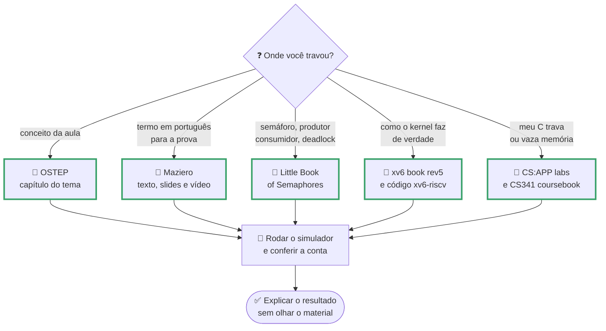
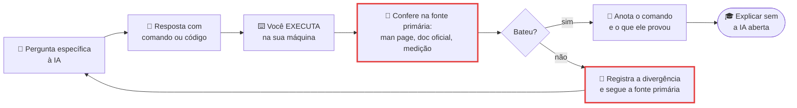

# Materiais, cursos e certificações de SO

> [!quote] O melhor material de SO do mundo custa zero
> *O livro que Wisconsin, Duke e Rose-Hulman adotam é gratuito em PDF, o kernel didático do MIT vem com 9 laboratórios e corretor automático, e os simuladores que dizem "quanto esse processo esperou na fila" cabem em 27 arquivos Python.*

> [!abstract] 🧭 Como ler esta página
> Cada item traz **link**, **custo** (🆓 grátis, 💰 pago, 🟡 freemium) e **idioma** (🇧🇷 ou 🇬🇧); tudo conferido em **02 e 03/09/2026**. Onde o preço só existe dentro da loja ou muda por país, está escrito "não publicado" em vez de um número inventado. As **cinco atividades 🧪** são o jeito certo de usar o material: monte antes o [[Laboratório de SO: preparando o ambiente|ambiente de laboratório]].

---

## 1. 📖 Os livros do PPC (e o que dá para pegar de graça)

O plano da disciplina (PPC, Resolução CONSUP 130/2023) lista sete livros. Nenhum é gratuito, mas quase todos têm material oficial aberto em volta.

| Livro do PPC | Para que serve | O que existe de graça |
|---|---|---|
| **Tanenbaum & Bos**, *Sistemas Operacionais Modernos*, 4ª ed. 💰 🇧🇷 | Livro-base: processos, threads, escalonamento e memória na ordem da ementa | O **MINIX 3**, sistema didático do autor: [minix3.org](https://minix3.org/) |
| **Silberschatz, Galvin & Gagne**, *Operating System Concepts*, 10ª ed. 💰 🇬🇧 | Definições canônicas, as que caem em concurso | [os-book.com](https://www.os-book.com/OS10/index.html): slides dos 21 capítulos, exercícios com solução, código C e Java, VM Linux |
| **Oliveira, Carissimi & Toscani** (UFRGS) 💰 🇧🇷 | Texto brasileiro clássico, forte em escalonamento e memória | Só a [página do livro](https://www.inf.ufrgs.br/~asc/livro/index.html) |
| **Machado & Maia**, *Arquitetura de Sistemas Operacionais* 💰 🇧🇷 | Didático, com linguagem próxima da de banca | O simulador **SOsim** e 3 manuais de laboratório (seção 5) |
| **Deitel, Deitel & Choffnes**, *Operating Systems*, 3ª ed. 💰 🇬🇧 | Panorama largo com estudos de caso | Nada ([edições na Open Library](https://openlibrary.org/search?q=Operating+Systems+Deitel+Choffnes)) |
| **Ward**, *How Linux Works*, 3ª ed. (2021) 💰 🇬🇧 | O Linux por dentro: boot, systemd, `/proc`, processos | Nada (a editora bloqueia leitura) |
| **Negus**, *Linux Bible*, 10ª ed. 💰 🇬🇧 | Referência de administração, útil para as certificações da seção 7 | Nada ([Open Library](https://openlibrary.org/search?q=Linux+Bible+Christopher+Negus)) |

> [!tip] 💡 A regra prática
> Leia o **capítulo do Tanenbaum ou do Silberschatz** para a prova (é o vocabulário da banca), leia o **OSTEP** para entender e **rode o simulador** para acreditar. Os três juntos levam menos tempo do que reler o mesmo capítulo três vezes.

---

## 2. 🆓 Os livros abertos (o coração do estudo)

![[Recursos/Sistemas operacionais/Materiais, cursos e certificações de SO/ostep-capa.png|Capa do OSTEP (Operating Systems: Three Easy Pieces), de Remzi e Andrea Arpaci-Dusseau: o livro aberto que virou padrão no ensino de SO]]

O **OSTEP** está na **versão 1.10** e é gratuito capítulo a capítulo em PDF, "para sempre", segundo a própria página; as três peças são virtualização, concorrência e persistência. O arquivo único com índice custa **US\$ 10,00** e o impresso, **US\$ 28,27** ou **US\$ 39,75**. Junto vêm dois repositórios que valem tanto quanto o texto: [ostep-homework](https://github.com/remzi-arpacidusseau/ostep-homework) (simuladores da seção 5) e [ostep-projects](https://github.com/remzi-arpacidusseau/ostep-projects) (projetos com teste automático, inclusive um shell).

| Livro aberto | Resolve o quê |
|---|---|
| [**OSTEP** v1.10](https://pages.cs.wisc.edu/~remzi/OSTEP/) 🆓 🇬🇧 | O conceito explicado como conversa, com simulador por capítulo |
| [**Maziero**, *Conceitos e Mecanismos*](https://wiki.inf.ufpr.br/maziero/doku.php?id=socm:start) (UFPR, 2019, CC BY-NC-SA) 🆓 🇧🇷 | O melhor texto aberto em português, com **texto, slides e videoaula por capítulo**; o [curso CI1215](https://wiki.inf.ufpr.br/maziero/doku.php?id=so:start) traz o mini-SO **PingPongOS** |
| [**Downey**, *The Little Book of Semaphores*](https://greenteapress.com/wp/semaphores/) 🆓 🇬🇧 | Sair do "entendi semáforo" para "sei escrever a solução": produtor-consumidor, leitores-escritores e filósofos, com as tentativas erradas no caminho |
| [**xv6 book** rev5](https://pdos.csail.mit.edu/6.1810/2025/xv6/book-riscv-rev5.pdf) (116 pp, 02/09/2025) 🆓 🇬🇧 | Ver `fork`, tabela de páginas e sistema de arquivos escritos por inteiro, com links para o [código real](https://github.com/mit-pdos/xv6-riscv) |
| [**CS:APP**: laboratórios](https://csapp.cs.cmu.edu/3e/labs.html) 🆓 🇬🇧 (livro 💰) | Exercícios de C de sistemas: **Shell Lab** (processos e sinais), **Malloc Lab** e **Proxy Lab** (sockets com threads) |
| [**CS 341 Coursebook**, UIUC](https://cs341.cs.illinois.edu/coursebook/) 🆓 🇬🇧 | O "OSTEP do lado do usuário": processos, alocadores, threads, deadlock, IPC e sinais em Linux real |
| **e-Tec Brasil** ([IFCE 2016](https://proedu.rnp.br/handle/123456789/711), [Cuiabá 2014](https://proedu.rnp.br/handle/123456789/1540)) 🆓 🇧🇷 | Nivelar o vocabulário se o 1º período ficou longe |



---

## 3. 🎓 Cursos de referência com material aberto

Nenhuma delas cobra para você ler o material: o que fica atrás de login é a nota.

- [**MIT 6.1810**](https://pdos.csail.mit.edu/6.1810/) 🆓 🇬🇧: 9 laboratórios no xv6-riscv (chamadas de sistema, tabelas de páginas, traps, copy-on-write, locking, arquivos, mmap) e o [cronograma de 2025](https://pdos.csail.mit.edu/6.1810/2025/schedule.html) com 23 aulas.
- [**Berkeley CS162**](https://cs162.org/) 🆓 🇬🇧: projetos no Pintos, listas com shell e servidor HTTP, slides, e a [aula 1 do prof. Kubiatowicz](https://www.youtube.com/watch?v=pPzVV2kkGHc) no YouTube. O [**Stanford CS212**](https://www.scs.stanford.edu/26sp-cs212/) publica os 4 projetos Pintos com especificação aberta e o [CS140 de 2020](https://web.stanford.edu/~ouster/cgi-bin/cs140-spring20/index.php) tem provas com gabarito.
- [**Wisconsin CS537**](https://pages.cs.wisc.edu/~remzi/Classes/537/) 🆓 🇬🇧: handouts, notas e **provas antigas** do autor do OSTEP.
- [**CMU 15-213**](https://www.cs.cmu.edu/~213/) 🆓 🇬🇧: slides de processos, memória virtual, alocação dinâmica e sincronização.
- [**UIUC CS341**](https://cs341.cs.illinois.edu/) 🆓 🇬🇧: coursebook aberto e [repositório de aulas](https://github.com/angrave/CS341-Lectures-FA26) com código.
- [**UNIVESP**](https://www.youtube.com/playlist?list=PLxI8Can9yAHeK7GUEGxMsqoPRmJKwI9Jw) (prof. Jó Ueyama, ICMC-USP) 🆓 🇧🇷: curso inteiro em vídeo, bom para ver antes da aula.
- [**UFSC INE5412**](https://www.inf.ufsc.br/~marcio.castro/teaching/) (prof. Márcio Castro) 🆓 🇧🇷: [videoaulas de SO](https://youtube.com/playlist?list=PLclgVC78V1aZhM6WkaOGhSHuQPLwAfpVG) e a de [Programação Concorrente](https://www.youtube.com/playlist?list=PLclgVC78V1ablSPeeeTLMJ_jIIwp0tiMu), que complementa [[Threads]].
- [**UNICAMP MC504**](http://www.ic.unicamp.br/~islene/1s2021-mc504/) (profa. Islene Garcia) 🆓 🇧🇷: slides de pthreads e semáforos, com dois projetos multithread.

Cursos livres que ainda dão badge ou certificado:

- [**LFS101, Introduction to Linux**](https://training.linuxfoundation.org/training/introduction-to-linux/) 🆓 🇬🇧: 60 horas, 18 capítulos, laboratórios, badge e 90 dias de acesso; é a base gratuita das certificações da seção 7. O [**RH024**](https://www.redhat.com/en/services/training/rh024-red-hat-linux-technical-overview) 🆓 🇬🇧 traz 15 vídeos de shell, espaço de usuário e de kernel, permissões, boot e containers.
- [**Operating Systems and You**](https://www.coursera.org/learn/os-power-user) (Google) 🟡 🇬🇧 com legendas em português: 6 módulos, ~30 horas, grátis se assistir sem certificado. No [**Nand2Tetris, projeto 12**](https://www.nand2tetris.org/project12) 🟡 🇬🇧 você escreve o "sistema operacional" da máquina, com `alloc` e `deAlloc` sobre lista de livres, o que casa com [[Gerenciamento de Memória]].

---

## 4. 🧗 Plataformas práticas: aqui o teclado é o professor

> [!warning] ⚠️ Um clássico saiu do ar
> O **Play with Docker** foi **descontinuado em 1º de março de 2026**, segundo [aviso no próprio site](https://labs.play-with-docker.com/). Tutorial antigo que mandar usá-lo: troque por Killercoda ou Docker local ([[Containers e Virtualização]]).

- [**Linux Journey**](https://labex.io/linuxjourney) 🆓 🇬🇧, sem cadastro: trilhas curtas com quiz de linha de comando, permissões, **processos**, boot, kernel, init e logs.
- [**OverTheWire Bandit**](https://overthewire.org/wargames/bandit/) 🆓 🇬🇧: níveis de shell por SSH, cada um ensinando comandos novos para achar a senha do próximo.
- [**Linux Upskill Challenge**](https://linuxupskillchallenge.org/) 🆓 🇬🇧: 20 dias de administração real (SSH, usuários, `systemctl`, servidor); exige VM ou VPS sua.
- [**cmdchallenge**](https://cmdchallenge.com/) 🆓 🇬🇧: desafios de uma linha só de shell, no navegador. [**explainshell**](https://explainshell.com/) 🆓 🇬🇧 explica cada flag da sua linha com o trecho da man page.
- [**Killercoda**](https://killercoda.com/) 🟡 🇬🇧: cenários de Linux, Docker e Kubernetes num terminal no navegador; limites da conta grátis não publicados.
- [**CodeCrafters**](https://codecrafters.io/) 🟡 🇬🇧: "Build your own Shell" em 47 estágios, além de Redis, Git e grep; o plano grátis libera só os estágios iniciais.
- [**HTB Academy, Linux Fundamentals**](https://academy.hackthebox.com/course/preview/linux-fundamentals) 🟡 🇬🇧: 30 seções com máquina no navegador; exige conta e o custo em créditos não aparece sem login.
- [**TryHackMe, Linux Fundamentals**](https://tryhackme.com/room/linuxfundamentalspart1) 🟡 🇬🇧: trilha guiada com máquina no navegador. **Não verificado em 02/09/2026** (o site bloqueou o acesso automatizado): confira antes de contar com ele.
- [**Linux From Scratch 13.1**](https://www.linuxfromscratch.org/) 🆓 🇬🇧: compilar uma distribuição do zero; a 13.1 saiu em **1º/09/2026**. Projeto de férias, junto com [**Writing an OS in Rust**](https://os.phil-opp.com/) 🆓 🇬🇧 e 🇧🇷 (12 posts, do binário sem SO até paginação e heap).

> [!example] 🧪 Atividade 1: Fechar o módulo "Processes" do Linux Journey conferindo tudo na sua máquina
> **Ferramenta:** [Linux Journey](https://labex.io/linuxjourney) e o terminal do seu Linux ou WSL2.
>
> 1. Faça o módulo **Processes** da trilha Grasshopper inteiro, respondendo aos quizzes.
> 2. Rode na sua máquina cada comando citado nas lições, no mínimo estes três:
>
> ```bash
> ps -eo pid,ppid,stat,comm --sort=-pid | head -15
> ps -eo pid,stat,comm | awk '$2 ~ /^[ZD]/'
> uname -a
> ```
>
> 3. Anote o **PID e o PPID** do seu `bash` e confirme se o pai é quem você imaginava.
> 4. Procure processo em estado `Z` (zumbi) ou `D` (sono ininterrompível); não achando nenhum, escreva por que isso é boa notícia.
>
> **Resultado esperado:** print do módulo concluído e um arquivo com as três saídas reais e duas linhas explicando um estado encontrado (os estados estão em [[Processos]]).
>
> 🪟 **No Windows:** o site é igual e os comandos rodam no WSL2. Sem WSL2, use `Get-Process | Sort-Object Id -Descending | Select-Object -First 15 Id, ProcessName` no PowerShell e a aba **Detalhes** do Gerenciador de Tarefas com a coluna PID ligada.

> [!example] 🧪 Atividade 2: Vencer os níveis 0 a 10 do Bandit com diário de comandos
> **Ferramenta:** [OverTheWire Bandit](https://overthewire.org/wargames/bandit/), por SSH.
>
> 1. Leia a página do [nível 0](https://overthewire.org/wargames/bandit/bandit0.html) e conecte (usuário e senha do nível 0 são os dois `bandit0`):
>
> ```bash
> ssh -p 2220 bandit0@bandit.labs.overthewire.org
> ```
>
> 2. Suba do nível 0 ao 10 anotando, em cada um, a senha e o comando que a revelou.
> 3. Comando novo para você (`file`, `du`, `find -size`, `grep -v`, `sort | uniq -u`, `base64 -d`): cole a linha no [explainshell](https://explainshell.com/) e leia o que cada flag faz.
> 4. Gere o diário com `history | tail -60 > bandit-diario.txt` e comente as cinco linhas mais importantes.
>
> **Resultado esperado:** o `bandit-diario.txt` comentado e um print do banner do nível 11. Em aula você refaz **um nível sorteado** em 2 minutos, ao vivo.
>
> 🪟 **No Windows:** o cliente `ssh` do PowerShell aceita a mesma linha; com WSL2 é idêntico ao Linux. No celular, o Termux também tem `ssh`.

> [!example] 🧪 Atividade 3: Dez desafios do cmdchallenge com as flags explicadas
> **Ferramenta:** [cmdchallenge](https://cmdchallenge.com/) e [explainshell](https://explainshell.com/).
>
> 1. Resolva **10 desafios** do cmdchallenge (o site roda cada solução e diz se passou).
> 2. Cole 3 das suas soluções no explainshell.
> 3. Monte uma tabela: comando, o que você achava que a flag fazia, o que a man page diz.
> 4. Confirme na man page local, por exemplo `man 1 find` e `man 1 sort`.
>
> **Resultado esperado:** prints dos 10 desafios resolvidos e a tabela com pelo menos **uma divergência** entre o que você supunha e o que a documentação diz. Treino direto para [[Linux na prática]].
>
> 🪟 **No Windows:** tudo roda no navegador; sem WSL2, leia as man pages em [man7.org](https://man7.org/linux/man-pages/).

---

## 5. 🕹️ Simuladores, visualizadores e jogos

### 5.1 Os simuladores da OSTEP

O repositório [ostep-homework](https://github.com/remzi-arpacidusseau/ostep-homework) tem **30 pastas** e **27 arquivos `.py`** (cerca de 25 simuladores distintos, porque `x86.py` aparece em duas pastas). O padrão é sempre o mesmo: `-s <semente>` gera um problema diferente para cada aluno, você resolve **no papel** e só então roda `-c` para ver a solução. Quem faz na ordem inversa não aprende nada.

| Pasta | Programa | Tema |
|---|---|---|
| `cpu-intro`, `cpu-api` | `process-run.py`, `fork.py` | Estados do processo; árvore de `fork` e `exec` |
| `cpu-sched` | `scheduler.py` | FIFO, SJF e Round Robin |
| `cpu-sched-mlfq` | `mlfq.py` | Filas multinível com prioridade e boost |
| `cpu-sched-lottery`, `-multi` | `lottery.py`, `multi.py` | Loteria; multiprocessador e afinidade de cache |
| `vm-mechanism`, `vm-segmentation` | `relocation.py`, `segmentation.py` | Base e limite; segmentação |
| `vm-freespace` | `malloc.py` | First, best e worst fit; coalescência |
| `vm-paging`, `vm-smalltables` | `paging-linear-translate.py`, `paging-multilevel-translate.py` | Tabela de páginas linear e multinível |
| `vm-beyondphys`, `-policy` | `mem.c`, `paging-policy.py` | FIFO, LRU, LFU, OPT, RAND e CLOCK |
| `threads-intro`, `threads-locks` | `x86.py` | Intercalação de threads em assembly didático |
| `threads-api`, `-cv`, `-sema`, `-bugs` | código C | pthreads, condição, semáforos, bugs de concorrência |
| `file-*`, `dist-afs`, `dist-nfs` | `disk.py`, `raid.py`, `vsfs.py`, `ffs.py`, `fsck.py`, `lfs.py`, `ssd.py`, `checksum.py`, `afs.py` | Disco, RAID, inodes, FFS, fsck, LFS, SSD e checksums (SO II) |

As linhas de `cpu-` valem para [[Escalonamento de Processos]]; as de `vm-`, para [[Gerenciamento de Memória]] e [[Memória Virtual e Substituição de Páginas]]; as de `threads-`, para [[Threads]] e [[Comunicação entre Processos]]. Saída real do `scheduler.py` (Round Robin, quantum 2, semente 7, rodado em 03/09/2026):

```
$ python3 scheduler.py -p RR -q 2 -j 3 -s 7 -c
Job 0 ( length = 4 )   Job 1 ( length = 2 )   Job 2 ( length = 7 )
  [ time   0 ] Run job   0 for 2.00 secs
  [ time   2 ] Run job   1 for 2.00 secs ( DONE at 4.00 )
  [ time   4 ] Run job   2 for 2.00 secs
  [ time   6 ] Run job   0 for 2.00 secs ( DONE at 8.00 )
  [ time  12 ] Run job   2 for 1.00 secs ( DONE at 13.00 )
  Average -- Response: 2.00  Turnaround 8.33  Wait 4.00
```

Com os **mesmos três trabalhos**, o FIFO dá resposta média 3,33 e turnaround médio 7,67: o Round Robin ganha muito em resposta e perde um pouco em turnaround. É a discussão inteira da aula de escalonamento, em 30 segundos.

### 5.2 Visualizadores e jogos no navegador

- [**Process Scheduling Solver**](https://process-scheduling-solver.boonsuen.com/) 🆓 🇬🇧: Gantt de FCFS, SJF, SRTF, Round Robin e prioridade, com turnaround e espera calculados.
- [**OS Algorithms Simulator**](https://ddpigeon.github.io/os-simulator/) 🆓 🇬🇧: o mais completo, com escalonamento, **sincronização**, **algoritmo do banqueiro**, alocação de memória, páginas e disco.
- [**Page Replacement Simulator**](https://josefdc.github.io/page-replacement-simulator/) 🆓 🇬🇧: FIFO, segunda chance, LRU e ótimo **passo a passo**, com faltas e acertos; o [outro visualizador](https://page-replacement-by-thrillim.vercel.app/) traz sete políticas, incluindo MRU e LFU.
- [**The Deadlock Empire**](https://deadlockempire.github.io/) 🆓 🇬🇧: jogo em que **você é o escalonador** e intercala threads para provocar corrida, deadlock ou violação de invariante.
- [**Compiler Explorer (godbolt)**](https://godbolt.org/) 🆓 🇬🇧: o assembly do seu C lado a lado; ótimo para ver a instrução `syscall` de um `write` sem libc.
- [**Mapa interativo do kernel**](https://makelinux.github.io/kernel/map/) 🆓 🇬🇧: SVG navegável com as camadas do kernel e links para o código de cada função.
- [**SOsim**](https://www.training.com.br/sosim/) 🆓 🇧🇷: o simulador do livro do PPC (Machado & Maia), com estados de processo, escalonamento e memória paginada; v2.0 de 2007, Windows, roda no Wine.

> [!example] 🧪 Atividade 4: Rodar o simulador da OSTEP e reproduzir a anomalia de Belady
> **Ferramenta:** repositório [ostep-homework](https://github.com/remzi-arpacidusseau/ostep-homework) e Python 3.
>
> 1. Clone: `git clone --depth 1 https://github.com/remzi-arpacidusseau/ostep-homework.git`
> 2. Gere um problema **com a sua matrícula como semente**, calcule turnaround e espera **no papel** e só depois confira:
>
> ```bash
> python3 cpu-sched/scheduler.py -p RR -q 2 -j 3 -s SUA_MATRICULA
> python3 cpu-sched/scheduler.py -p RR -q 2 -j 3 -s SUA_MATRICULA -c
> python3 cpu-sched/scheduler.py -p FIFO -j 3 -s SUA_MATRICULA -c
> ```
>
> 3. Agora prove que **dar mais memória pode piorar**: mesma sequência de páginas com FIFO em 3 e em 4 quadros.
>
> ```bash
> python3 vm-beyondphys-policy/paging-policy.py --policy=FIFO -C 3 -a 1,2,3,4,1,2,5,1,2,3,4,5 -c | tail -3
> python3 vm-beyondphys-policy/paging-policy.py --policy=FIFO -C 4 -a 1,2,3,4,1,2,5,1,2,3,4,5 -c | tail -3
> ```
>
> 4. Repita o passo 3 com `--policy=LRU` e depois `--policy=OPT`.
>
> **Resultado esperado:** com 3 quadros o FIFO termina com **9 faltas**; com 4, com **10** (a anomalia de Belady, que reaparece em [[Memória Virtual e Substituição de Páginas]]). Entregue as duas linhas `FINALSTATS`, a tabela feita à mão do passo 2 e uma frase dizendo se o LRU também sofre a anomalia.
>
> 🪟 **No Windows:** com WSL2 os comandos são idênticos. Sem WSL2, instale o Python pela Microsoft Store, troque `python3` por `py` e use o Git for Windows para clonar.

---

## 6. 🎥 Canais, vídeos e zines

- [**Core Dumped**](https://www.youtube.com/@CoreDumpped) 🇬🇧: animações de CPU, processos, threads e memória; o melhor lugar para **ver** uma troca de contexto.
- [**Jacob Sorber**](https://www.youtube.com/c/JacobSorber) 🇬🇧: C de sistemas em 10 a 20 minutos (`fork`, pipes, sinais, threads). [**Low Level**](https://www.youtube.com/@LowLevelTV) 🇬🇧 vai para assembly, kernel e vulnerabilidades.
- [**Neso Academy**](https://www.youtube.com/playlist?list=PLBlnK6fEyqRiVhbXDGLXDk_OQAeuVcp2O) 🇬🇧: aulas curtas de lousa, boas de véspera; [**Computerphile**](https://www.youtube.com/@Computerphile) 🇬🇧 dá o contexto amplo.
- [**Brendan Gregg**](https://www.brendangregg.com/linuxperf.html) 🇬🇧: o maior nome de desempenho em Linux (palestras, mapas de ferramentas, eBPF).
- [**Liz Rice, Containers From Scratch**](https://www.youtube.com/watch?v=8fi7uSYlOdc) 🇬🇧: container do zero em Go com namespaces, `chroot` e cgroups; a ponte entre SO e Docker.
- [**Carlos Maziero**](https://www.youtube.com/c/CarlosMaziero) 🇧🇷: as videoaulas do livro aberto, capítulo por capítulo; [**UNIVESP**](https://www.youtube.com/playlist?list=PLxI8Can9yAHeK7GUEGxMsqoPRmJKwI9Jw) e [**UFSC INE5412**](https://youtube.com/playlist?list=PLclgVC78V1aZhM6WkaOGhSHuQPLwAfpVG) 🇧🇷 trazem cursos inteiros.
- [**Fabio Akita**](https://www.youtube.com/@Akitando) 🇧🇷: longos e opinativos, bons como provocação, não como fonte única; [**Diolinux**](https://www.youtube.com/@Diolinux) e [**Código Fonte TV**](https://www.youtube.com/@codigofontetv) 🇧🇷 dão notícia e vocabulário de mercado.

As **zines da Julia Evans** ([wizardzines.com](https://wizardzines.com/zines/)) são quadrinhos técnicos que explicam uma ferramenta inteira em poucas páginas. **Grátis**: *Spying on your programs with strace* ([PDF](https://jvns.ca/strace-zine-v3.pdf)), *Linux debugging tools you'll love*, *Profiling and tracing with perf* e *So you want to be a wizard*; as pagas custam de US\$ 10 a US\$ 12. Leia a do `strace` antes da aula de [[Chamadas de Sistema]]: 20 minutos que economizam horas.

![[Recursos/Sistemas operacionais/Materiais, cursos e certificações de SO/gregg-linux-observability-tools.png|Mapa de ferramentas de observabilidade do Linux, de Brendan Gregg: cada seta liga um comando à parte do sistema que ele enxerga]]

O mapa acima responde à pergunta que mais aparece no laboratório: "qual comando eu uso para ver isso?". Ache a camada (escalonador, memória virtual, arquivos, rede) e o comando está do lado.

---

## 7. 🏅 Certificações que o mercado reconhece

![[Recursos/Sistemas operacionais/Materiais, cursos e certificações de SO/tux.png|Tux, o mascote do Linux: quase toda certificação de infraestrutura cobra, no fundo, a mesma base de sistema operacional]]

Certificação não substitui diploma nem projeto, mas passa pelo filtro automático de currículo e organiza o que estudar. Repare na última coluna: dá para se preparar de graça em todas.

| Certificação | Preço | Validade | O que cobra de SO | Estudo grátis |
|---|---|---|---|---|
| [**LFCS**](https://training.linuxfoundation.org/certification/linux-foundation-certified-sysadmin-lfcs/) (Linux Foundation) | US\$ 445 | 2 anos | Alto: comandos 20%, armazenamento 20%, rede 25%, operações 25%; **prática**, 2 h | LFS101, Linux Journey, Bandit |
| [**LFCA**](https://training.linuxfoundation.org/certification/certified-it-associate/) (Linux Foundation) | US\$ 250 | 2 anos | Médio: Linux 16%, administração 30%, nuvem 18%, segurança 14% | LFS101, RH024 |
| [**LPIC-1**](https://www.lpi.org/our-certifications/lpic-1-overview/) (LPI, 2 provas) | US\$ 200 [cada](https://www.lpi.org/exam-pricing/) | 5 anos | Alto: boot, kernel, processos, arquivos, permissões e shell; **existe em português** | LFS101, Bandit, man pages |
| [**Linux+ XK0-006**](https://www.comptia.org/certifications/linux) (CompTIA) | não publicado | ~3 anos | Alto: gerência 23%, troubleshooting 22%, serviços 20%, segurança 18%; versão de 15/07/2025, só em inglês | LFS101 e laboratório próprio |
| [**RHCSA EX200**](https://www.redhat.com/en/services/training/ex200-red-hat-certified-system-administrator-rhcsa-exam) (Red Hat) | não publicado | não publicado | Alto: shell, permissões, pacotes, LVM, SELinux, systemd; prática, em RHEL 10 | RH024 e VM com AlmaLinux |
| [**CKA**](https://training.linuxfoundation.org/certification/certified-kubernetes-administrator-cka/) e [**CKAD**](https://training.linuxfoundation.org/certification/certified-kubernetes-application-developer-ckad/) (CNCF) | US\$ 445 cada | 2 anos | Médio na CKA (troubleshooting 30%, cluster 25%, rede 20%); baixo na CKAD, que olha a aplicação | [Kubernetes Basics](https://kubernetes.io/docs/tutorials/kubernetes-basics/), Killercoda |
| Nuvem: [**AWS SAA-C03**](https://aws.amazon.com/certification/certified-solutions-architect-associate/), [**Azure AZ-104**](https://learn.microsoft.com/en-us/credentials/certifications/azure-administrator/) e [**Google Cloud ACE**](https://cloud.google.com/learn/certification/cloud-engineer) | US\$ 150, por país e US\$ 125 | 3 anos (Azure renova todo ano, grátis) | Baixo: instâncias, imagens e armazenamento; o pré-requisito oficial da AZ-104 é familiaridade com SO, redes e virtualização; as três têm prova em português | Trilhas gratuitas de AWS Skill Builder, Microsoft Learn e Google Cloud Skills Boost |

> [!tip] 💰 Por onde começar sem gastar
> A ordem que mais rende no 7º período: **LFS101 → Linux Journey e Bandit** (tudo grátis) → **LPIC-1** (a mais barata entre as que cobram muito SO, em português e válida por 5 anos) → **CKA ou uma de nuvem**, já trabalhando. Os cargos que essa trilha abre pagavam, em 2026, mediana de **R\$ 10.438 por mês** no Brasil para SRE/DevOps e **R\$ 13.750** no nível sênior (Glassdoor BR, jun e jul/2026). Compare com [[Certificações de redes]].

---

## 8. 🏛️ Concursos públicos: o que realmente cai de SO

Concurso não pede que você escreva um kernel: pede que **distinga conceitos vizinhos** em uma frase (processo e thread, concorrência e paralelismo, prevenção e evitação de deadlock, paginação e segmentação, Round Robin e SJF, FAT32 e NTFS, `top` e `free`). Em 2025, bancas municipais (AMEOSC, FADENOR, Unochapecó, SELECON, IGEDUC) e grandes (CEBRASPE no BANRISUL e na AEB, CESGRANRIO no BANESE) repetiram o mesmo cardápio: **escalonamento, deadlock, memória virtual, threads e comandos de Linux**. Sete questões reais de 2025, adaptadas do [simulado do PCI Concursos](https://www.pciconcursos.com.br/simulados/informatica/sistemas-operacionais): responda antes de abrir o gabarito.

> [!question]- 1. (AMEOSC 2025, Pref. de Guarujá do Sul/SC) Qual a diferença entre processo e thread?
> **Resposta:** o **processo** é a instância de um programa em execução, com recursos alocados a ele (espaço de endereçamento, arquivos abertos, memória); a **thread** é a unidade de execução **dentro** dele, e as threads do mesmo processo compartilham esse espaço. Veja [[Processos]] e [[Threads]].

> [!question]- 2. (FADENOR 2025, Pref. de Jequitaí/MG) Julgue: I. Deadlock envolve espera circular por recursos. II. Na paginação, a memória é dividida em quadros de tamanho fixo. III. O Round Robin prioriza o processo de menor tempo de execução. IV. A memória virtual usa a MMU para traduzir endereços.
> **Resposta:** corretos **I, II e IV**. O **III é falso**: quem prioriza o menor tempo é o **SJF**; o Round Robin dá a todos a mesma fatia (quantum), em rodízio. Confira com o `scheduler.py` da atividade 4.

> [!question]- 3. (FADENOR 2025, Pref. de Jequitaí/MG) Julgue: I. Threads do mesmo processo compartilham memória. II. Condição de corrida ocorre quando o resultado depende da ordem de execução. III. Concorrência é o mesmo que paralelismo. IV. O mutex garante exclusão mútua.
> **Resposta:** corretos **I, II e IV**. O **III é falso**: concorrência é lidar com várias tarefas em andamento (pode ser num núcleo só, alternando); paralelismo é executá-las **ao mesmo tempo**, com mais de um núcleo. Veja [[Comunicação entre Processos]].

> [!question]- 4. (Unochapecó 2025, Pref. de Guatambu/SC) Decidir qual processo usa a CPU em cada momento é tarefa de qual gerência do sistema operacional?
> **Resposta:** da **gerência de processos** (o escalonador). A de memória cuida de alocação e endereçamento; a de arquivos, do armazenamento; a de E/S, dos dispositivos.

> [!question]- 5. (SELECON 2025, Polícia Militar/SE) Qual comando do Linux mostra o uso de memória RAM em tempo real?
> **Resposta:** `top`, que atualiza a tela continuamente. O `free -h` mostra a memória **naquele instante** e o `ps` lista processos sem atualizar. O `htop` faz o mesmo com interface melhor, mas não vem instalado por padrão.

> [!question]- 6. (IGEDUC 2025, Câmara de Bezerros/PE) Qual recurso é exclusivo do NTFS em relação ao FAT32?
> **Resposta:** as **listas de controle de acesso (ACLs)** e a criptografia **EFS**. O FAT32 não guarda permissões por usuário nem criptografa, e limita o arquivo a 4 GB. Mais em [[Windows]].

> [!question]- 7. (UNO Chapecó 2025, Câmara de Chapecó/SC) Desfragmentar faz sentido em qual mídia?
> **Resposta:** em **HDD**, onde a fragmentação obriga a cabeça a percorrer distâncias maiores. Em **SSD** não se desfragmenta: não há movimento mecânico e a escrita extra gasta as células; ele usa o **TRIM**, que avisa ao controlador quais blocos podem ser apagados.

> [!example] 🧪 Atividade 5: Resolver uma questão de concurso e provar a resposta no terminal
> **Ferramenta:** o [simulado do PCI Concursos](https://www.pciconcursos.com.br/simulados/informatica/sistemas-operacionais) e o seu terminal.
>
> 1. Responda a questão 5 acima **sem consultar**.
> 2. Prove a resposta na máquina, comparando as três candidatas:
>
> ```bash
> free -h
> ps -eo pid,comm,%mem --sort=-%mem | head -6
> top -b -n 1 | head -12
> ```
>
> 3. Explique em duas linhas por que só uma delas atende ao "em tempo real" do enunciado.
> 4. Confirme cada afirmação na man page (`man 1 top`, `man 1 free`, `man 1 ps`) e cite a linha que a sustenta.
> 5. Repita com mais **três questões** do simulado, de assuntos diferentes.
>
> **Resultado esperado:** arquivo com as quatro questões respondidas, a saída real dos comandos e, para cada uma, a frase da man page (ou do livro) que prova o gabarito. Questão respondida "de cabeça" não conta.
>
> 🪟 **No Windows:** o equivalente em tempo real é o **Gerenciador de Tarefas** (aba Desempenho) ou `Get-Counter '\Memory\Available MBytes'` no PowerShell; o retrato instantâneo é o [`systeminfo`](https://learn.microsoft.com/en-us/windows-server/administration/windows-commands/systeminfo).

---

## 9. 🤖 Como estudar SO com IA (e não se enganar)

As universidades resolveram isso de formas bem diferentes. O **MIT 6.1810** não proíbe nada, mas reserva **15% da nota a check-offs orais**: o monitor sorteia um laboratório seu e pergunta sobre a solução. A **UIUC CS341** separa duas pistas, projeto grande "com IA" e desafio semanal "sem IA". **Duke** e **Rose-Hulman** proíbem. Fowles e colegas (maio/2026) mediram o efeito de **code reviews orais semanais**: o uso de IA subiu e o desempenho em prova ficou igual, ou seja, a verificação oral neutraliza o dano sem precisar proibir.

A regra aqui é simples: **a IA propõe, a fonte primária julga** (man page, documentação oficial, capítulo do livro ou a sua medição).



| Prompt que funciona | Por que é bom |
|---|---|
| "Explique linha por linha esta saída de `strace -c ls`, diga qual chamada domina o tempo e liste as man pages que eu devo abrir para conferir." | Trabalha sobre a **sua saída real** e já entrega o caminho da verificação |
| "Faça 8 questões de múltipla escolha sobre escalonamento no estilo CESGRANRIO, sem gabarito. Eu respondo e você corrige apontando o erro de cada alternativa." | Treino ativo no formato da banca, com a IA como corretora |
| "Prevejo que o FIFO com 4 quadros gera menos faltas que com 3. Antes de eu rodar o simulador, aponte que suposição minha pode estar errada." | Faz a IA atacar o seu raciocínio (aqui, a anomalia de Belady) |
| "Este código com pthreads às vezes imprime valor errado. Não corrija: aponte a região crítica e que ferramenta do Linux mostraria a corrida." | Mantém a autoria do conserto com você e leva a uma ferramenta real |

> [!warning] ⚠️ Os três erros que mais custam nota
> 1. **Colar a resposta da IA sem executar.** No check-off oral isso aparece em 30 segundos.
> 2. **Aceitar flag inventada.** Modelos erram nomes de opções, e `man` e `--help` são gratuitos.
> 3. **Pedir "resolva o laboratório".** Você perde a parte que a prova cobra; peça "me faça três perguntas que testem se eu entendi minha própria solução".

---

## 10. 🪟 E no Windows? Materiais para quem não vai trocar de sistema

A disciplina é Linux-first, mas metade do que vamos medir também existe no Windows, com outro nome:

- [**Sysinternals Suite**](https://learn.microsoft.com/en-us/sysinternals/downloads/sysinternals-suite) 🆓 (Russinovich, 19/08/2026): o laboratório num zip, com [**Process Explorer**](https://learn.microsoft.com/en-us/sysinternals/downloads/process-explorer) (processos e handles), **Process Monitor** (chamadas de arquivo e registro), **VMMap**, **RAMMap** e **Sysmon**.
- [**Documentação do WSL**](https://learn.microsoft.com/en-us/windows/wsl/) 🆓: instalar o Ubuntu dentro do Windows, WSL 1 contra WSL 2, GPU e memória. É o caminho oficial da disciplina, com passo a passo em [[Laboratório de SO: preparando o ambiente]].
- [**User mode and kernel mode**](https://learn.microsoft.com/en-us/windows-hardware/drivers/gettingstarted/user-mode-and-kernel-mode) 🆓 e a nossa página [[Windows]] 🇧🇷: a mesma fronteira de anéis de proteção que estudamos, na linguagem da Microsoft e depois na nossa.

---

## ❓ Quiz rápido

> [!question]- 1. Qual é o livro aberto adotado por Wisconsin, Duke e Rose-Hulman, com simuladores em Python por capítulo?
> **Resposta:** o **OSTEP** (*Operating Systems: Three Easy Pieces*), versão 1.10, gratuito em PDF. Os simuladores estão no repositório `ostep-homework` (30 pastas, 27 arquivos `.py`).

> [!question]- 2. Você quer estudar em português, com texto, slides e videoaula do mesmo autor por capítulo. Qual é a escolha?
> **Resposta:** o livro do **Carlos Maziero** (UFPR, 2019, CC BY-NC-SA), gratuito, com PDF, slides e vídeo de cada capítulo no wiki do autor.

> [!question]- 3. Entre LPIC-1 e LFCS, qual é a mais barata e por quanto tempo cada uma vale?
> **Resposta:** a **LPIC-1** custa US\$ 200 por prova (são duas) e vale **5 anos**; a **LFCS** custa US\$ 445 e vale **2 anos**. A LFCS é prática, de 2 horas; a LPIC-1 tem 60 questões por prova e existe **em português**.

> [!question]- 4. No `scheduler.py` da OSTEP, para que serve a flag `-s` e por que usar a sua matrícula nela?
> **Resposta:** `-s` define a **semente** que gera os trabalhos. Com a matrícula, cada aluno recebe um problema diferente, o que torna a cópia inútil e obriga o cálculo à mão antes de conferir com `-c`.

> [!question]- 5. Uma IA afirma que existe a flag `--realtime` no comando `free`. O que fazer?
> **Resposta:** conferir na fonte primária: o `man 1 free` não lista essa opção (para atualização contínua existe `-s <segundos>`, ou usa-se o `top`). A IA propõe, a man page julga, e a divergência entra na entrega.

---

## 🔗 Veja também

- [[Laboratório de SO: preparando o ambiente]]: monte o ambiente antes de tentar qualquer atividade desta página.
- [[Cronograma da disciplina]] e [[Trabalhos e Projetos de Sistemas Operacionais]]: em que semana cada material é cobrado.
- [[Glossário de Sistemas Operacionais]]: os termos dos livros e das questões, em uma linha cada.
- [[Escalonamento de Processos]] e [[Memória Virtual e Substituição de Páginas]]: as aulas que mais usam os simuladores da seção 5.
- [[Certificações de redes]]: a trilha equivalente do lado de redes, e [[Tópicos/Redes de Computadores/DevOps|DevOps]] com [[Tópicos/Segurança da informação/index|Segurança da Informação]] mostram onde essas certificações são usadas.
- ➡️ **Próxima aula:** [[Introdução aos Sistemas Operacionais]]

---

> [!note] 📚 Fontes (2026)
> Cada item traz o link no próprio texto, acessado em 02 e 03/09/2026. Os números, datas e imagens vêm daqui:
>
> - [OSTEP](https://pages.cs.wisc.edu/~remzi/OSTEP/): v1.10, PDF único US\$ 10,00, impresso US\$ 28,27 e US\$ 39,75. [ostep-homework](https://github.com/remzi-arpacidusseau/ostep-homework): 30 pastas e 27 arquivos `.py` conferidos pela API do GitHub em 03/09/2026; flags e saídas executadas localmente na mesma data. Datas: [xv6 book rev5](https://pdos.csail.mit.edu/6.1810/2025/xv6/book-riscv-rev5.pdf) (02/09/2025), [LFS 13.1](https://www.linuxfromscratch.org/) (01/09/2026), [Play with Docker](https://labs.play-with-docker.com/) (fim em 01/03/2026), [Linux+ XK0-006](https://www.comptia.org/certifications/linux) (15/07/2025) e [Sysinternals](https://learn.microsoft.com/en-us/sysinternals/downloads/sysinternals-suite) (19/08/2026).
> - Preços e validade das certificações: as páginas oficiais linkadas na seção 7. Salários: [Glassdoor BR, SRE/DevOps (jun/2026)](https://www.glassdoor.com.br/Sal%C3%A1rios/sre-devops-engineer-sal%C3%A1rio-SRCH_KO0,19.htm) e [DevOps sênior (jul/2026)](https://www.glassdoor.com.br/Sal%C3%A1rios/senior-devops-engineer-sal%C3%A1rio-SRCH_KO0,22.htm).
> - Questões: [PCI Concursos, simulado de SO](https://www.pciconcursos.com.br/simulados/informatica/sistemas-operacionais) (30 questões de 2025). Ensino com IA: [MIT 6.1810](https://pdos.csail.mit.edu/6.1810/2025/general.html), [UIUC CS341](https://cs341.cs.illinois.edu/), [Duke CPS 310](https://courses.cs.duke.edu/spring25/compsci310/syllabus.pdf), [Rose-Hulman](https://www.rose-hulman.edu/class/csse/csse332/2425d/docs/syllabus/syllabus/) e [Fowles et al. (mai/2026)](https://arxiv.org/abs/2605.21374).
> - Imagens: capa do [OSTEP](https://pages.cs.wisc.edu/~remzi/OSTEP/) (Arpaci-Dusseau, uso educacional), [Linux Performance Observability Tools (Brendan Gregg, 2021)](https://www.brendangregg.com/linuxperf.html) e [Tux.svg (Wikimedia Commons; Larry Ewing e The GIMP, com Simon Budig e Garrett LeSage)](https://commons.wikimedia.org/wiki/File:Tux.svg).
