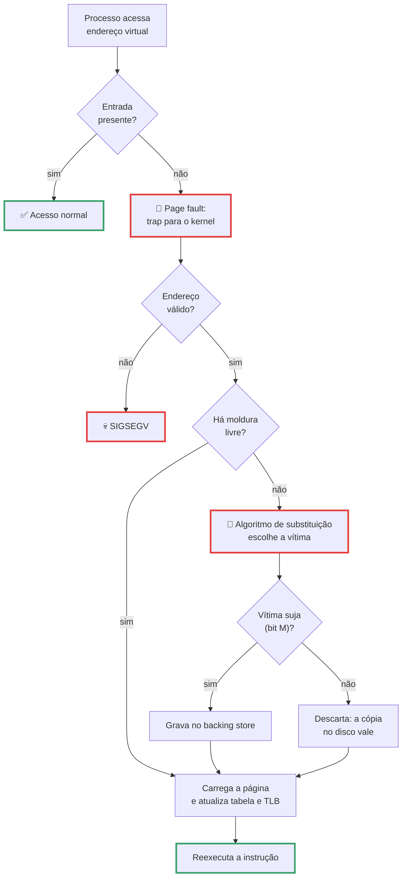
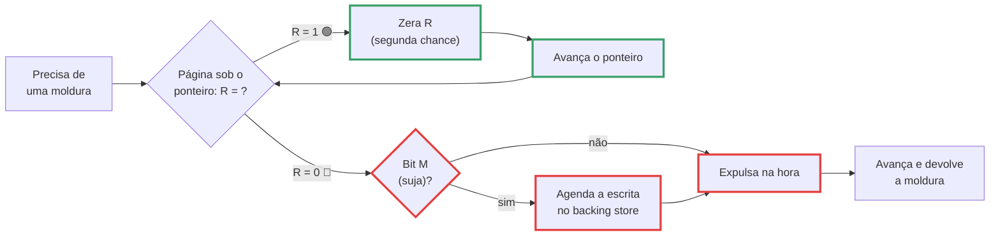
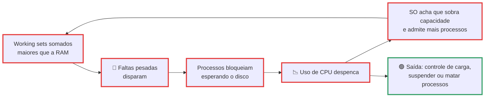

# Memória Virtual e Substituição de Páginas

> [!quote] A memória sempre acaba
> *Todo sistema operacional promete a cada processo um espaço de endereçamento gigante que a RAM não tem. A promessa funciona porque quase nenhum programa usa tudo ao mesmo tempo. Quando a conta aperta alguém precisa decidir qual página sai da memória, e essa escolha de microssegundos separa uma máquina que responde de uma que congela. No notebook do professor o kernel já retirou 2.027.418 páginas da memória só pelo `kswapd` desde o último boot, e você nem percebeu.*

> [!abstract] 🧭 O que você vai fazer nesta aula
> Escrever um simulador de paginação em Python e ver o FIFO perder para o LRU e os dois perderem para o ótimo; reproduzir a anomalia de Belady; provocar thrashing de propósito; matar um processo com o OOM killer dentro de um cgroup; descobrir se o seu kernel usa MGLRU; e calcular por que um 7B não cabe em 8 GB. Aula anterior: [[Gerenciamento de Memória]].

---

## 1. 🔄 Demand paging: a promessa que funciona porque ninguém usa tudo

Num x86-64 com tabelas de 4 níveis cada processo enxerga cerca de **128 TB** de espaço virtual de usuário, enquanto a máquina tem 8, 16 ou 32 GB de RAM. A conta não fecha e mesmo assim funciona, graças ao **demand paging** (paginação por demanda): o SO monta a tabela de páginas com quase tudo marcado como ausente e só traz uma página quando alguém toca nela. É como ter uma **mesa de estudo pequena** e uma **estante enorme** atrás: o livro só vem para a mesa quando é preciso, e quando a mesa enche aparece a pergunta que domina esta aula, **qual livro volta para a estante?**

![[Recursos/Sistemas operacionais/Memória Virtual e Substituição de Páginas/paginacao-e-swapping.png|Tabela de páginas com o bit de validade: as entradas com 1 apontam para molduras na memória física, as com 0 apontam para o disco. Tocar numa página inválida gera um page fault (Wikimedia Commons)]]

Quando a CPU acessa um endereço cuja entrada está com o bit de presença em 0, a MMU dispara uma **falta de página** (page fault), exceção que devolve o controle ao kernel. Duas espécies bem diferentes:

| Tipo | O que aconteceu | Custo | Exemplo |
|---|---|---|---|
| **Minor fault** (leve) | A página já está na RAM (page cache, página compartilhada, página zerada); só faltava mapear | nano a microssegundos | segunda vez que um programa abre a mesma biblioteca |
| **Major fault** (pesada) | A página precisa vir do disco (arquivo ou swap) | microssegundos em NVMe, milissegundos em HDD | primeiro acesso a um arquivo grande, retorno do swap |

No notebook do professor, desde o boot: **28.240.669 faltas no total** e apenas **117.596 pesadas** (`/proc/vmstat`, campos `pgfault` e `pgmajfault`). Ou seja, **99,58% das faltas nunca tocaram no disco**. É esse desequilíbrio que faz a memória virtual parecer mágica.




---

## 2. 🎯 Qual página tirar? Os algoritmos clássicos

Todo algoritmo de substituição tenta adivinhar o futuro com informação do passado. A tabela resume o quadro que Tanenbaum & Bos apresentam no capítulo de gerência de memória:

| Algoritmo | Como escolhe a vítima | Veredito |
|---|---|---|
| **Ótimo** (Belady, 1966) | a que só voltará a ser usada mais tarde de todas | exige o futuro: serve de **régua** |
| **NRU** | a classe mais baixa da combinação dos bits (R, M) | grosseiro, mas barato |
| **FIFO** | a que entrou há mais tempo | joga fora páginas quentes; sofre a anomalia de Belady |
| **Segunda chance** | FIFO que perdoa quem tem R = 1 | conserta o pior defeito do FIFO |
| **Clock** | segunda chance em lista circular com ponteiro | é o que os SOs reais implementam |
| **LRU** | a que está sem uso há mais tempo | ótimo, mas exige hardware caro |
| **NFU / Aging** | contador por página, deslocado a cada tique, somado ao bit R | aproxima bem o LRU em software |
| **Working set / WSClock** | páginas fora do conjunto de trabalho do processo | bom e eficiente, usado na prática |
| **Aleatório** | sorteio | pior que clock, melhor do que parece |

O **clock** cabe num parágrafo: as molduras formam um círculo e um ponteiro aponta para uma delas. Na hora de escolher a vítima o ponteiro olha a página sob ele: se R = 0 é a vítima; se R = 1, zera o R (segunda chance) e avança. Como todo acesso põe R de volta em 1, quem é usado com frequência sobrevive à passagem do ponteiro.



> [!warning] LRU puro em software é inviável
> LRU exato exigiria atualizar uma estrutura de dados a cada instrução. O que existe são aproximações que usam o bit R, atualizado de graça pelo hardware: **LRU é o alvo, clock e aging são o que se atinge.**

---

## 3. 🧮 A conta na mão: 20 referências, 3 molduras

A string de referência clássica (a mesma do Silberschatz, e a que cai em prova e concurso):

```
7 0 1 2 0 3 0 4 2 3 0 3 2 1 2 0 1 7 0 1
```

**3 molduras**, vazias no início. Cada célula mostra as molduras na ordem física (`·` é vazia), ✅ é acerto, ❌ é falta e o número após o ❌ é a página expulsa.

| Ref | FIFO | LRU | Ótimo |
|---|---|---|---|
| **7** | `7··` ❌ | `7··` ❌ | `7··` ❌ |
| **0** | `70·` ❌ | `70·` ❌ | `70·` ❌ |
| **1** | `701` ❌ | `701` ❌ | `701` ❌ |
| **2** | `201` ❌7 | `201` ❌7 | `201` ❌7 |
| **0** | `201` ✅ | `201` ✅ | `201` ✅ |
| **3** | `231` ❌0 | `203` ❌1 | `203` ❌1 |
| **0** | `230` ❌1 | `203` ✅ | `203` ✅ |
| **4** | `430` ❌2 | `403` ❌2 | `243` ❌0 |
| **2** | `420` ❌3 | `402` ❌3 | `243` ✅ |
| **3** | `423` ❌0 | `432` ❌0 | `243` ✅ |
| **0** | `023` ❌4 | `032` ❌4 | `203` ❌4 |
| **3** | `023` ✅ | `032` ✅ | `203` ✅ |
| **2** | `023` ✅ | `032` ✅ | `203` ✅ |
| **1** | `013` ❌2 | `132` ❌0 | `201` ❌3 |
| **2** | `012` ❌3 | `132` ✅ | `201` ✅ |
| **0** | `012` ✅ | `102` ❌3 | `201` ✅ |
| **1** | `012` ✅ | `102` ✅ | `201` ✅ |
| **7** | `712` ❌0 | `107` ❌2 | `701` ❌2 |
| **0** | `702` ❌1 | `107` ✅ | `701` ✅ |
| **1** | `701` ❌2 | `107` ✅ | `701` ✅ |
| **Faltas** | **15** | **12** | **9** |

O LRU erra **20% menos** que o FIFO e o ótimo erra **40% menos**; a distância entre 12 e 9 é o espaço que sobra para qualquer algoritmo real melhorar. Repare na 6ª referência: o FIFO expulsa a página 0 que **acabou de ser usada**, só porque ela entrou cedo. Com **4 molduras** os mesmos dados dão FIFO 10, LRU 8 e ótimo 8: mais memória ajuda todo mundo. Quase sempre.

> [!example] 🧪 Atividade 1: Escreva o simulador e confira a tabela acima
> **Ferramenta:** Python 3 (terminal Linux, WSL2, macOS ou Windows).
>
> 1. Salve como `paginacao.py`:
>
> ```python
> def simular(ref, molduras, politica):
>     memoria, fila, faltas = [], [], 0
>     for i, pagina in enumerate(ref):
>         if pagina in memoria:
>             if politica == "LRU":
>                 fila.remove(pagina); fila.append(pagina)
>             continue
>         faltas += 1
>         if len(memoria) < molduras:
>             memoria.append(pagina); fila.append(pagina)
>         else:
>             if politica == "OTIMO":
>                 futuro = {p: (ref.index(p, i + 1) if p in ref[i + 1:] else 10**9) for p in memoria}
>                 vitima = max(futuro, key=futuro.get)
>                 fila.remove(vitima)
>             else:                       # FIFO e LRU tiram o primeiro da fila
>                 vitima = fila.pop(0)
>             memoria[memoria.index(vitima)] = pagina
>             fila.append(pagina)
>     return faltas
>
> REF = [7,0,1,2,0,3,0,4,2,3,0,3,2,1,2,0,1,7,0,1]
> for m in (3, 4):
>     print(m, "molduras:", {p: simular(REF, m, p) for p in ("FIFO", "LRU", "OTIMO")})
> ```
>
> 2. Rode `python3 paginacao.py` e compare com a tabela, linha por linha, até a 10ª referência.
>
> **Resultado esperado:** `3 molduras: {'FIFO': 15, 'LRU': 12, 'OTIMO': 9}` e `4 molduras: {'FIFO': 10, 'LRU': 8, 'OTIMO': 8}`.
>
> **Extensão obrigatória:** acrescente a política `CLOCK` (lista circular, vetor de bits R e ponteiro; ao carregar, R = 1). Com 3 molduras a resposta é **14 faltas**; com a convenção alternativa de carregar com R = 0, dá 11. Descubra qual das duas o seu código implementou.
>
> 🪟 **No Windows:** `python paginacao.py` no PowerShell, ou `https://www.online-python.com` sem instalar nada.

### A anomalia de Belady: mais memória, mais faltas

O senso comum diz que mais RAM sempre reduz as faltas. Para o FIFO isso é **falso**, e o contraexemplo cabe em 12 referências: `1 2 3 4 1 2 5 1 2 3 4 5`.

| Ref | FIFO, 3 molduras | FIFO, 4 molduras |
|---|---|---|
| **1** | `1··` ❌ | `1···` ❌ |
| **2** | `12·` ❌ | `12··` ❌ |
| **3** | `123` ❌ | `123·` ❌ |
| **4** | `423` ❌1 | `1234` ❌ |
| **1** | `413` ❌2 | `1234` ✅ |
| **2** | `412` ❌3 | `1234` ✅ |
| **5** | `512` ❌4 | `5234` ❌1 |
| **1** | `512` ✅ | `5134` ❌2 |
| **2** | `512` ✅ | `5124` ❌3 |
| **3** | `532` ❌1 | `5123` ❌4 |
| **4** | `534` ❌2 | `4123` ❌5 |
| **5** | `534` ✅ | `4523` ❌1 |
| **Faltas** | **9** | **10** |

Você comprou memória e piorou. Acontece porque o FIFO não é um **algoritmo de pilha**: o conjunto residente com `n` molduras não é necessariamente subconjunto do conjunto com `n+1`. LRU e ótimo são de pilha e nunca sofrem a anomalia (aqui, com 4 molduras, LRU cai de 10 para 8 e o ótimo de 7 para 6).

> [!example] 🧪 Atividade 2: Reproduza Belady e confira num simulador que não é seu
> **Ferramenta:** o seu `paginacao.py` e o `paging-policy.py` do livro aberto OSTEP.
>
> 1. Rode `simular(BELADY, m, "FIFO")` para `BELADY = [1,2,3,4,1,2,5,1,2,3,4,5]` com `m` igual a 3 e a 4.
> 2. Confira com o simulador oficial, e repita trocando `FIFO` por `LRU` e por `OPT`:
>
> ```bash
> git clone https://github.com/remzi-arpacidusseau/ostep-homework
> cd ostep-homework/vm-beyondphys-policy
> ./paging-policy.py --addresses=1,2,3,4,1,2,5,1,2,3,4,5 --policy=FIFO --cachesize=3 -c | tail -3
> ./paging-policy.py --addresses=1,2,3,4,1,2,5,1,2,3,4,5 --policy=FIFO --cachesize=4 -c | tail -3
> ```
>
> **Resultado esperado:** FIFO vai de 9 para 10 faltas ao ganhar uma moldura (a anomalia), LRU vai de 10 para 8 e OPT de 7 para 6. Entregue as saídas do `paging-policy.py` e a do seu script lado a lado: se baterem, o seu simulador está correto. 🪟 No Windows, use o WSL2.

---

## 4. 📉 Working set, localidade e thrashing

Programas não acessam memória ao acaso: têm **localidade temporal** (o que foi usado agora será usado de novo já já) e **espacial** (quem usa `v[i]` vai usar `v[i+1]`). Por isso um programa passa a vida usando um punhado de páginas de cada vez. O **conjunto de trabalho** (working set) de um processo, escrito `W(t, Δ)`, é o conjunto de páginas referenciadas nas últimas `Δ` unidades de tempo: uma foto do que ele precisa **agora**.

![[Recursos/Sistemas operacionais/Memória Virtual e Substituição de Páginas/working-set-no-tempo.png|Conjunto de trabalho ao longo do tempo: fases estáveis (WS1 a WS4) separadas por picos de transição, quando o programa muda de fase e toca páginas novas (Wikimedia Commons)]]

Nas **fases estáveis** o processo precisa de poucas páginas e vive feliz. Nas **transições** (abrir um arquivo novo, começar outra etapa do algoritmo) o working set explode por instantes, e é ali que chove page fault mesmo numa máquina folgada. Se a soma dos working sets ativos passar da memória física, cada processo começa a roubar páginas dos outros: é o **thrashing**, em que a CPU fica ociosa esperando disco e o SO, vendo CPU ociosa, é tentado a admitir **mais** processos, o que piora tudo.



| Sintoma | Onde olhar | Saudável | Em thrashing |
|---|---|---|---|
| Troca com o swap | `vmstat 1`, colunas `si` e `so` | 0 quase sempre | dezenas de milhares de KB/s |
| Faltas pesadas | `sar -B 1`, coluna `majflt/s` | perto de 0 | centenas por segundo |
| Varredura direta | `/proc/vmstat`, `pgscan_direct` | quase parado | crescendo depressa |
| Pressão de memória | `/proc/pressure/memory`, linha `full` | `avg10=0.00` | `avg10` acima de 10 |
| CPU | `vmstat 1`, colunas `wa` e `id` | `wa` baixo | `wa` alto **e** `id` alto juntos |

Para não chegar lá o SO tem quatro alavancas: **alocação local** (cada processo só rouba molduras dele: isola, mas desperdiça) contra **global** (a vítima sai de qualquer moldura, que é o que o Linux faz); **PFF** (page fault frequency: quem falta demais ganha molduras, quem falta de menos perde); **controle de carga** (suspender processos inteiros, reduzindo o grau de multiprogramação); e, no fim da linha, **matar** (seção 8). O `full` do PSI, em `/proc/pressure/memory`, é a definição operacional de thrashing: significa que **nenhuma** tarefa está fazendo trabalho útil, e é por isso que o `systemd-oomd` decide por ele, e não por "quanto de RAM sobrou".

> [!example] 🧪 Atividade 3: Provoque thrashing e assista pelo `vmstat`
> **Ferramenta:** `stress-ng` (`sudo apt install stress-ng`), `vmstat`, `sar` e `/proc/pressure/memory`. Faça em **VM ou WSL2**.
>
> 1. Três terminais lado a lado: `vmstat 1`, `watch -n1 cat /proc/pressure/memory` e `sar -B 1 60`. Anote a linha de base (`si` e `so` em 0, `full avg10=0.00`, `pgscand/s` em 0).
> 2. Encha a memória: `stress-ng --vm 2 --vm-bytes 90% --timeout 60s --metrics-brief`. Sem poder instalar nada: `python3 -c "a=[bytearray(200_000_000) for _ in range(20)]; input()"`.
> 3. Observe `si`, `so`, a coluna `wa`, a linha `full` do PSI e, no `sar`, `pgscank/s` (varredura do `kswapd`, em segundo plano) contra `pgscand/s` (reclaim direto, feito pelo próprio processo, que é o sinal de aperto de verdade).
> 4. Confira `getconf PAGESIZE` (o `p` que a fórmula da seção 5 prevê) e os acumulados do boot em `grep -E '^(pgsteal_kswapd|pgscan_direct) ' /proc/vmstat`: no notebook do professor são 2.027.418 contra 735, ou seja, **99,96% da limpeza aconteceu em segundo plano**.
>
> **Resultado esperado:** `si`/`so` saem do zero, `wa` sobe, o `full avg10` deixa de ser `0.00` e o `pgscand/s` aparece. Entregue um print dos três terminais e diga qual coluna te convenceu de que o gargalo era memória, e não CPU.
>
> 🪟 **No Windows:** Gerenciador de Tarefas > Desempenho > Memória; rode o mesmo laço Python e veja "Comprometida" passar da RAM física.

---

## 5. 🛠️ Questões de projeto

### Tamanho de página: uma otimização com resposta fechada

Página pequena desperdiça menos na última página de cada região (fragmentação **interna**) mas exige tabela maior. Com `s` = tamanho médio do processo em bytes, `e` = tamanho de uma entrada da tabela e `p` = tamanho da página, Tanenbaum escreve a sobrecarga e deriva:

$$\text{sobrecarga}(p) = \underbrace{\frac{s \cdot e}{p}}_{\text{tabela de páginas}} + \underbrace{\frac{p}{2}}_{\text{fragmentação interna média}} \quad \Longrightarrow \quad p_{\text{ótimo}} = \sqrt{2 \cdot s \cdot e}$$

| Processo médio `s` | Entrada `e` | `p` ótimo |
|---|---|---|
| 1 MB | 8 bytes | **4 KB** |
| 64 MB | 8 bytes | 32 KB |
| 1 GB | 8 bytes | 128 KB |

A primeira linha explica por que 4 KB virou padrão da indústria (o `PAGE_SHIFT 12` do Linux em x86-64) e as outras explicam as **huge pages** de 2 MB e 1 GB: não é capricho, é a mesma conta com `s` de processo moderno.

| Outras decisões | O que o Linux faz hoje |
|---|---|
| **Espaços separados de instrução e dados** | um espaço só, com permissões por região (`r-xp` para código, `rw-p` para dados) |
| **Páginas compartilhadas e bibliotecas** | compartilha agressivamente: `fork` usa copy-on-write, e a ligação dinâmica com código independente de posição deixa a mesma moldura da `libc` servir a todos os processos |
| **Arquivos mapeados** (`mmap`) | base do carregamento de executáveis, bibliotecas e (seção 10) dos pesos de modelos de IA |
| **Política de limpeza** | um daemon de paginação (`kswapd`) acorda na marca d'água baixa e libera molduras **antes** de faltarem |
| **Prepaging** | traz as vizinhas junto: readahead e *fault-around* mapeiam várias páginas de uma vez |


---

## 6. ⚙️ Questões de implementação

### O que o SO faz num page fault

1. O hardware salva o contador de programa e desvia para o kernel (trap); o assembly salva os registradores e chama a rotina em C.
2. O SO descobre **qual endereço virtual** causou a falta (no x86 ele vem no registrador CR2).
3. Verifica se o endereço é válido e se a operação (ler, escrever, executar) é permitida ali. Se não for: `SIGSEGV`, o famoso "segmentation fault".
4. Procura moldura livre; não havendo, roda o algoritmo de substituição. Vítima suja: agenda a escrita e **bloqueia o processo** (outro roda enquanto isso).
5. Agenda a leitura da página pedida (do arquivo ou do swap), bloqueia de novo e, na interrupção do disco, atualiza a tabela e liga o bit de presença.
6. Restaura o contador de programa para a **instrução que falhou**; ela executa de novo, agora com sucesso, e o programa nem fica sabendo.

O passo 6 é mais sutil do que parece: a instrução é reexecutada do começo, o que exige que o hardware permita desfazer efeitos parciais (por isso instruções com autoincremento dão dor de cabeça ao projetista de CPU).

### Backing store: onde a página vai morar

| Opção | Como funciona |
|---|---|
| **Partição de swap** | área bruta no disco, sem sistema de arquivos: menor sobrecarga |
| **Arquivo de swap** | arquivo comum (`/swapfile`), padrão hoje, redimensionável a quente |
| **zswap** | *cache* comprimido **na própria RAM**, na frente do swap real |
| **zram** | disco comprimido em RAM usado como swap (`mkswap` e `swapon`): Chromebooks, Android, containers |
| **Arquivo mapeado** | páginas de código, bibliotecas e `mmap` voltam para o **arquivo original**, não para o swap |

Só páginas **anônimas** (heap, pilha, `malloc`) precisam de swap; páginas de arquivo já têm cópia no disco. Por isso uma máquina sem swap não fica sem memória virtual: ela apenas descarta e relê código do disco o tempo todo.

> [!warning] Bloqueio de páginas, política e mecanismo
> Se um driver iniciou um DMA lendo direto para a moldura 42 e o algoritmo escolher a moldura 42 como vítima, os dados vão parar no lugar errado. Por isso existem páginas **bloqueadas** (*pinned*): `mlock()`, o mesmo mecanismo do `--mlock` do llama.cpp e da memória *page-locked* que a NVIDIA pede para transferências rápidas.
>
> Repare na separação: "escrever no disco, atualizar a tabela, invalidar a TLB" é **mecanismo**; "qual página tirar" é **política**. O Mach empurrou a política para um paginador externo em espaço de usuário e no Linux o `userfaultfd` deixa um processo comum tratar as próprias faltas (é assim que funciona a migração ao vivo de VMs). Foi essa separação que permitiu adotar o MGLRU sem mexer no tratamento de falta.

> [!example] 🧪 Atividade 4: Descubra o backing store da sua máquina
> **Ferramenta:** `swapon`, `/sys/module/zswap/parameters/` e `/proc/vmstat`.
>
> 1. `swapon --show` (se o comando não for encontrado, use `/usr/sbin/swapon --show`).
> 2. `grep -H . /sys/module/zswap/parameters/*` (o zswap está ligado?).
> 3. `grep -E '^(pswpin|pswpout) ' /proc/vmstat` e `cat /proc/sys/vm/swappiness` (faixa 0 a 200, padrão 60).
>
> **Resultado esperado:** os quatro dados da sua máquina numa tabela. No notebook do professor: `/swapfile` de 2 GB do tipo `file`, zswap com `enabled:N` e `max_pool_percent:20`, `pswpout 6` (quase nada foi para o swap) e `swappiness 10`, mais baixo que o padrão de propósito, numa máquina com 31 GB de RAM. Explique em duas linhas o que mudaria com `swappiness` em 100.
>
> 🪟 **No Windows:** o equivalente é o `pagefile.sys` (Sistema > Configurações avançadas > Desempenho > Avançado > Memória virtual). O Windows calcula um *commit limit* igual à RAM mais os arquivos de paginação, e a documentação da Microsoft diz que o arquivo pode crescer até três vezes a RAM (ou 4 GB, o que for maior) quando o commit chega a 90% do limite.

---

## 7. 🧩 Segmentação: o caminho que a história quase tomou

Paginação divide a memória em pedaços de tamanho fixo que **não significam nada** para o programador. A **segmentação** faz o contrário: divide o espaço de endereçamento em regiões de tamanho variável correspondentes a objetos lógicos (o código, a pilha, a tabela de símbolos do compilador). Cada segmento é um espaço linear independente que cresce sozinho, e o endereço vira um par (número do segmento, deslocamento).

![[Recursos/Sistemas operacionais/Memória Virtual e Substituição de Páginas/segmentacao-traducao.png|Tradução de endereço segmentado: o par (s, d) consulta a tabela de segmentos, o deslocamento é comparado com o limite e, passando, é somado à base; estourando o limite, o hardware gera erro (Wikimedia Commons)]]

A segmentação pura morreu de **fragmentação externa**, como a alocação por partições variáveis. A saída foi juntar as duas ideias em **segmentação com paginação**: o segmento continua sendo a unidade lógica e de proteção, mas é paginado, então nenhum precisa de bloco físico contíguo. Foi o desenho do MULTICS (1965) e depois do x86 em modo protegido, com seletores de segmento (GDT e LDT) por cima da paginação.

E hoje? No **x86-64 em modo longo a segmentação foi praticamente aposentada**: as bases de `CS`, `DS`, `ES` e `SS` são forçadas a zero e o modelo é "flat" (o endereço virtual é o próprio deslocamento). Sobraram `FS` e `GS`, usados como ponteiro rápido para dados por thread e por CPU. Toda vez que um binário protegido por *stack canary* confere se a pilha foi corrompida, ele lê `%fs:0x28`: um acesso segmentado, vivo, no seu `hello world`.

> [!example] 🧪 Atividade 5: Ache o último resquício de segmentação num binário seu
> **Ferramenta:** `gcc` e `objdump` (`sudo apt install build-essential binutils`; no Windows, WSL2).
>
> ```bash
> printf '#include <stdio.h>\nint main(){char b[64];scanf("%%63s",b);return 0;}\n' > canario.c
> gcc -O0 -o canario canario.c && objdump -d canario | grep 'fs:0x28'
> ```
>
> **Resultado esperado:** duas linhas como estas, o canário de pilha lido do segmento FS e depois conferido. Explique em duas linhas por que o compilador usa um segmento em vez de um endereço fixo (dica: o valor precisa ser diferente **por thread**).
>
> ```
> 1195: 64 48 8b 04 25 28 00    mov    %fs:0x28,%rax
> 11d4: 64 48 2b 14 25 28 00    sub    %fs:0x28,%rdx
> ```

---

## 8. 🐧 O Linux de 2026: quem decide e como você observa

O Linux clássico mantém, por zona de memória, **duas listas LRU**: a **ativa** e a **inativa**, separadas ainda em anônimas e de arquivo. Página nova entra na inativa; referenciada de novo, promove para a ativa; sob pressão o kernel varre a inativa e expulsa. As quatro listas estão à sua frente agora:

```
$ grep -E 'Active|Inactive' /proc/meminfo
Active:          9635084 kB      Active(anon):    3117360 kB
Inactive:       19621940 kB      Inactive(anon):      728 kB
Active(file):    6517724 kB      Inactive(file): 19621212 kB
```

Desde o **kernel 6.1 (dezembro de 2022)** existe uma alternativa que virou padrão nas distribuições: o **MGLRU** (Multi-Gen LRU, LRU multigeracional). Em vez de duas listas ele mantém **várias gerações** de páginas ("páginas com recência de acesso parecida"), varre **tabelas de páginas** em vez do mapeamento reverso, usa filtros de Bloom para pular regiões frias e tem um controlador PID equilibrando anônimas contra arquivo. Resultado: menos CPU em reclaim e menos OOM. O kernel **7.2 (16/08/2026)** trouxe mais um ajuste, com ganho de cerca de 30% em testes com MongoDB/YCSB.

| Peça | Onde | O que faz |
|---|---|---|
| `kswapd` | processo do kernel | limpa em segundo plano ao cair da marca d'água baixa |
| `vm.swappiness` | `/proc/sys/vm/swappiness` | 0 a 200, padrão 60: preferência por expulsar anônimas |
| **zswap / zram** | `/sys/module/zswap/`, `/sys/block/zram0/` | compressão em RAM antes ou no lugar do swap em disco |
| **PSI** | `/proc/pressure/memory` | stall por memória em janelas de 10, 60 e 300 segundos |
| **MGLRU** | `/sys/kernel/mm/lru_gen/enabled` | reclaim multigeracional (`0x0007` = tudo ligado) |
| **DAMON** | `/sys/kernel/mm/damon/` | monitora o padrão de acesso e permite reclaim proativo |
| **cgroup v2** | `memory.high`, `memory.max`, `memory.events` | `high` freia o cgroup, `max` é o teto que dispara OOM |
| **systemd-oomd** | `oomctl` | mata cgroups inteiros por PSI (60% de pressão, 90% de swap) |
| **OOM killer** | `oom_score_adj` | último recurso, escolhe a vítima por pontuação |
| **NUMA e CXL** | `numactl`, `numa_balancing=2` | memória em camadas: páginas quentes sobem, frias descem |

> [!example] 🧪 Atividade 6: Tire o retrato do subsistema de memória do seu kernel
> **Ferramenta:** só leitura de `/sys` e `/proc`, nada destrutivo.
>
> 1. `uname -r` e `cat /sys/kernel/mm/lru_gen/enabled` (arquivo ausente = kernel sem MGLRU).
> 2. `cat /proc/sys/vm/swappiness`, `cat /proc/sys/vm/overcommit_memory`, `cat /proc/pressure/memory` e `cat /sys/fs/cgroup/memory.pressure`.
> 3. Peça a uma IA (ChatGPT, Claude, Gemini) para **prever** o valor de `lru_gen/enabled` no Ubuntu 24.04 e explicar cada bit; compare com a sua máquina e com a documentação oficial do MGLRU.
>
> **Resultado esperado:** no notebook do professor (kernel `6.8.0-xx-generic`) a resposta é `0x0007`, MGLRU ligado com todos os recursos opcionais; `swappiness` em `10`; e o PSI em repouso mostra `some avg10=0.00 ... total=76331`, provando que já houve pressão desde o boot. Entregue o retrato da **sua** máquina e diga onde a previsão da IA errou.
>
> 🪟 **No Windows:** não há equivalente do MGLRU; rode `Get-MMAgent` para ver as políticas de prefetch e de combinação de páginas.

> [!example] 🧪 Atividade 7: Mate um processo com o OOM killer, de propósito
> **Ferramenta:** `systemd-run` com limite de cgroup v2 e `journalctl`. É o experimento mais importante da aula: é o que acontece quando o Kubernetes mostra `OOMKilled` no seu container. Faça em VM ou WSL2.
>
> 1. Rode um devorador dentro de um cgroup com teto de 100 MB:
>
> ```bash
> systemd-run --user --scope -p MemoryMax=100M python3 -c "b=bytearray(1_000_000_000); print('nao chega aqui')"
> ```
>
> 2. Leia o veredito: `journalctl -k -n 30 | grep -i -E 'out of memory|oom|killed'`.
> 3. Repita com `-p MemoryMax=2G` (agora imprime) e com `-p MemoryHigh=100M`, que **estrangula** em vez de matar.
>
> **Resultado esperado:** no passo 1 o shell devolve `Killed` e o `journalctl -k` mostra `Memory cgroup out of memory: Killed process ... anon-rss:...`. Entregue as saídas e explique a diferença entre `MemoryHigh` e `MemoryMax` pelos seus resultados. Se o `--user` reclamar, use `sudo systemd-run --scope -p MemoryMax=100M ...`.
>
> 🪟 **No Windows:** não existe OOM killer; quando o commit estoura as alocações **falham**. Rode o mesmo Python no PowerShell e veja `MemoryError` em vez de `Killed`: overcommit com execução sumária contra recusa antecipada.

---

## 9. 🪟 E no Windows?

| Conceito da aula | Nome no Windows | Onde observar |
|---|---|---|
| Páginas residentes de um processo | **working set** | Gerenciador de Tarefas, VMMap |
| Páginas prontas para reaproveitar | **standby list** (o "Em cache") | RAMMap, `Use Counts` e `Priority Summary` |
| Páginas sujas esperando escrita | **modified list** | RAMMap, aba `Use Counts` |
| Falta leve e falta pesada | **soft** e **hard page fault** | Monitor de Recursos, "Faltas graves/s" |
| Backing store | **pagefile** e *commit limit* | Configurações de memória virtual |
| zswap | **compressão de memória** ("Em uso (Compactada)") | Gerenciador de Tarefas > Desempenho |
| Prepaging e deduplicação | **SysMain** (o antigo SuperFetch) e **page combining** (o KSM do Linux) | `Get-MMAgent` no PowerShell |

O Windows aposta mais alto em **prever** o que você vai usar: o SysMain observa seu padrão e pré-carrega aplicativos, e a compressão de memória evita a ida ao disco comprimindo páginas na própria RAM (mesma ideia do zswap, ligada por padrão no cliente e desligada no servidor; desliga com `Disable-MMAgent -MemoryCompression`).

> [!example] 🧪 Atividade 8: Radiografe a memória física com o RAMMap
> **Ferramenta:** RAMMap (Sysinternals, versão de 26/03/2026) e PowerShell.
>
> 1. Rode o RAMMap (não instala nada). Na aba **Use Counts**, anote `Active`, `Standby` e `Modified`: `Standby` mais `Free` é a memória que o Windows entrega na hora se você pedir.
> 2. Na aba **File Summary**, ordene por tamanho e descubra qual arquivo ocupa mais RAM em cache.
> 3. No PowerShell, `Get-MMAgent`: anote `ApplicationLaunchPrefetching`, `ApplicationPreLaunch` e `PageCombining`.
> 4. Abra um programa pesado, feche e atualize (F5): as páginas dele migram do working set para a `Standby` em vez de sumir.
>
> **Resultado esperado:** o antes e depois de `Use Counts` com a `Standby` crescendo, mais a saída do `Get-MMAgent`. Explique por que a memória "livre" quase nunca é grande num Windows saudável.
>
> 🐧 **No Linux:** o equivalente da `Standby` é o `buff/cache` do `free -h`. No notebook do professor: 31 GB de RAM, 3,7 GB em uso, 692 MB livres e **26 GB em cache**, com 27 GB "disponíveis". Memória livre é memória desperdiçada.

---

## 10. 🤖 Memória virtual na era da IA

Toda a frustração de "instalei o modelo e não rodou" cabe numa soma de três parcelas:

$$\text{memória} \approx \underbrace{P \times \frac{b}{8}}_{\text{pesos}} + \underbrace{2 \cdot L \cdot H_{kv} \cdot d \cdot t \cdot n}_{\text{KV cache}} + \text{overhead}$$

onde `P` é o número de parâmetros, `b` os bits por parâmetro, `L` o número de camadas, `H_kv` as cabeças de chave e valor, `d` a dimensão da cabeça, `t` os bytes por elemento e `n` os tokens do contexto.

**Parcela 1, os pesos.** Um modelo de 7 bilhões de parâmetros:

| Precisão | Bytes por parâmetro | 7B ocupa | Cabe em 8 GB de RAM? |
|---|---|---|---|
| FP32 | 4 | 28 GB | não, nem perto |
| FP16 / BF16 | 2 | 14 GB | **não** |
| INT8 | 1 | 7 GB | tecnicamente sim, na prática não (sobra pouco para o SO) |
| INT4 | 0,5 | 3,5 GB | sim, com folga para o contexto |

Com arquivos GGUF reais do Llama 3.1 8B: F32 ocupa 32,13 GB, Q8_0 8,54 GB, Q5_K_M 5,73 GB, Q4_K_M 4,92 GB e Q2_K 3,18 GB. **Quantizar é uma decisão de gerência de memória.**

**Parcela 2, o KV cache**, a que pega a maioria de surpresa porque **cresce com o contexto**. O Llama 3.1 8B tem 32 camadas, 8 cabeças de chave/valor e dimensão 128; em FP16, `2 × 32 × 8 × 128 × 2 bytes = 131.072 bytes por token`, ou **128 KiB por token**.

| Contexto | KV cache em FP16 |
|---|---|
| 4.096 tokens (padrão do Ollama) | 512 MiB |
| 32.768 tokens | 4 GiB |
| 131.072 tokens (o máximo do modelo) | **16 GiB** |

Com o contexto no máximo o **cache fica maior que o modelo quantizado**. Por isso o Ollama expõe `OLLAMA_KV_CACHE_TYPE` (`f16`, `q8_0`, `q4_0`): quantizar o cache também é decisão de memória.

**Parcela 3, o `mmap`.** O llama.cpp não lê o arquivo de pesos para um buffer: faz `mmap` do GGUF, e as páginas do modelo entram como **páginas de arquivo** no page cache, como na seção 5. A primeira carga gera faltas pesadas (vem do SSD) e a segunda é quase instantânea, porque as páginas ficam em cache mesmo depois de o processo morrer. Sob pressão elas estão limpas e são descartadas sem ir para o swap; `--no-mmap` muda isso, tornando os pesos memória anônima que compete por swap. `--mlock` prende as páginas na RAM (o `mlock()` da seção 6) e `-ngl N` decide quantas camadas vão para a VRAM: paginação manual entre dois níveis. O Ollama automatiza: usa a GPU se couber, senão divide (a coluna `PROCESSOR` do `ollama ps` mostra `100% GPU` ou `48%/52% CPU/GPU`), descarrega o modelo após 5 minutos ocioso e **enfileira** requisições quando falta memória.

Na GPU não existe, por padrão, demand paging para a VRAM: se a alocação não cabe, ela falha. O `CUDA out of memory` é uma falta de página **sem** rede de proteção. Para não desperdiçar essa memória cara o vLLM criou o **PagedAttention**, descrito no artigo do SOSP 2023 como inspirado em memória virtual e paginação: o KV cache vira **blocos de tamanho fixo** (as páginas) com uma tabela de blocos por sequência (a tabela de páginas), o que elimina a fragmentação, permite compartilhar blocos e rende de 2 a 4 vezes mais vazão. O `--gpu-memory-utilization` (padrão 0,92) é a marca d'água e o `--cpu-offload-gb` é literalmente swap para a RAM do host.

> [!success] O ciclo se fecha
> Reserva com marca d'água, blocos de tamanho fixo, tabela de tradução, compartilhamento por cópia sob demanda, despejo quando falta espaço e fila quando nem isso resolve: tudo o que a indústria de IA reinventou entre 2023 e 2026 para servir LLM já estava no capítulo de memória virtual do Tanenbaum. Mudou a unidade (blocos de KV cache em vez de páginas de 4 KB) e o hardware (VRAM em vez de RAM). Os algoritmos, não. Em vaga de SRE, DevOps ou MLOps é esse vocabulário que aparece na entrevista.

> [!example] 🧪 Atividade 9: Meça um modelo de verdade e feche a conta
> **Ferramenta:** Ollama (`curl -fsSL https://ollama.com/install.sh | sh`) ou llama.cpp, mais `free -h`. Funciona sem GPU.
>
> 1. `free -h`: anote `used` e `buff/cache`.
> 2. `ollama run llama3.2:1b "explique page fault em uma frase"`, depois `ollama ps` (coluna `PROCESSOR`) e `free -h` de novo: **quanto foi para `used` e quanto para `buff/cache`?**
> 3. Espere 5 minutos e rode `ollama ps` (o modelo sumiu, descarregado por inatividade); repita a pergunta com `time` e compare com a primeira carga.
> 4. Feche a conta: parâmetros vezes bits por parâmetro mais o KV cache de 4096 tokens, contra o tamanho do arquivo em `~/.ollama/models` e o RSS de `ps -o rss= -C ollama`.
> 5. **Com GPU:** `nvidia-smi --query-compute-apps=pid,used_memory --format=csv` durante a inferência; depois peça um modelo grande demais e leia o `CUDA out of memory`.
>
> **Resultado esperado:** estimativa contra medição com erro abaixo de 20%, o `free -h` mostrando boa parte do modelo entrando como **cache de arquivo** (efeito do `mmap`) e a segunda carga bem mais rápida que a primeira. Explique em duas linhas por quê. 🪟 No Windows o Ollama tem instalador nativo; use o Gerenciador de Tarefas no lugar do `free -h`.

---

## ❓ Quiz rápido

> [!question]- 1. Com a string `7 0 1 2 0 3 0 4 2 3 0 3 2 1 2 0 1 7 0 1` e 3 molduras, quantas faltas dão FIFO, LRU e ótimo?
> **Resposta:** 15, 12 e 9. O ótimo é o piso (nenhum algoritmo real fica abaixo) e o FIFO é o pior dos três porque ignora o uso recente: na 6ª referência ele expulsa a página 0 que acabara de ser usada.

> [!question]- 2. Um servidor com FIFO passou de 3 para 4 molduras e as faltas aumentaram. Isso é bug?
> **Resposta:** Não, é a **anomalia de Belady**. FIFO não é algoritmo de pilha: o conjunto residente com 4 molduras não contém necessariamente o de 3, então mais memória pode piorar. LRU e ótimo são de pilha e nunca sofrem isso.

> [!question]- 3. `vmstat 1` mostra `si` e `so` altos, `wa` alto, `id` alto e disco em 100%. O que é e qual é a saída?
> **Resposta:** Thrashing. A soma dos conjuntos de trabalho passou da memória física e a máquina troca páginas em vez de executar. A saída não é admitir mais processos: é reduzir o grau de multiprogramação, dar mais memória, ou limitar por cgroup quem está devorando. Confirme pela linha `full` de `/proc/pressure/memory`.

> [!question]- 4. Por que uma página de arquivo limpa é mais barata de expulsar que uma anônima suja?
> **Resposta:** A limpa já tem cópia idêntica no disco: o SO só descarta a moldura, zero E/S. A anônima suja precisa ser escrita no swap antes (uma escrita agora, uma leitura depois). É também por isso que o `mmap` dos pesos de um modelo é mais amigável ao sistema do que carregá-los em memória anônima.

> [!question]- 5. Você tem 8 GB de RAM e quer rodar um 7B com contexto de 32 mil tokens. Q4 (3,5 GB de pesos) resolve?
> **Resposta:** Não necessariamente: falta contar o KV cache. Num modelo tipo Llama 3.1 8B em FP16 são 128 KiB por token, e 32.768 tokens dão **4 GiB**. Somando pesos, cache e overhead do runtime você estoura os 8 GB. Saídas: reduzir o contexto, quantizar o KV cache (`OLLAMA_KV_CACHE_TYPE=q8_0`) ou mandar camadas para a GPU.

---

## 🔗 Veja também

- [[Gerenciamento de Memória]]: a aula anterior, com tabela de páginas, TLB, `/proc/<pid>/maps` e a diferença entre RSS, VSZ e PSS.
- [[Escalonamento de Processos]]: quem decide **quando** cada processo roda; com esta aula, o par de decisões que define se a máquina responde.
- [[Containers e Virtualização]]: `memory.max` de cgroup e o `OOMKilled` do Kubernetes, que é o assunto da seção 8.
- [[Sistemas Operacionais na Era da IA]]: GPU como recurso gerenciado e o que muda quando o SO administra VRAM.
- ➡️ **Próxima aula:** [[Linux na prática]]

---

> [!note] 📚 Fontes (2026)
> - Documentação do kernel Linux: [conceitos de memória](https://docs.kernel.org/admin-guide/mm/concepts.html) · [MGLRU](https://docs.kernel.org/mm/multigen_lru.html) e [seu guia de administração](https://docs.kernel.org/admin-guide/mm/multigen_lru.html) · [PSI](https://docs.kernel.org/accounting/psi.html) · [zswap](https://docs.kernel.org/admin-guide/mm/zswap.html) · [zram](https://docs.kernel.org/admin-guide/blockdev/zram.html) · [sysctls de `vm`](https://docs.kernel.org/admin-guide/sysctl/vm.html) · [cgroup v2](https://docs.kernel.org/admin-guide/cgroup-v2.html) · [DAMON](https://docs.kernel.org/admin-guide/mm/damon/index.html) · [CXL](https://docs.kernel.org/driver-api/cxl/linux/overview.html) · [x86-64](https://docs.kernel.org/arch/x86/x86_64/mm.html)
> - [MGLRU no Linux 6.1 (11/12/2022)](https://kernelnewbies.org/Linux_6.1) · [Linux 7.2, 16/08/2026](https://kernelnewbies.org/Linux_7.2) · [`vmstat`](https://man7.org/linux/man-pages/man8/vmstat.8.html) · [`free`](https://man7.org/linux/man-pages/man1/free.1.html) · [`stress-ng`](https://manpages.ubuntu.com/manpages/noble/en/man1/stress-ng.1.html) · [`systemd-run`](https://manpages.ubuntu.com/manpages/noble/en/man1/systemd-run.1.html) · [`systemd-oomd`](https://manpages.ubuntu.com/manpages/noble/en/man8/systemd-oomd.service.8.html)
> - [Algoritmos de substituição (Wikipedia, EN)](https://en.wikipedia.org/wiki/Page_replacement_algorithm) · [OSTEP: `paging-policy.py`](https://github.com/remzi-arpacidusseau/ostep-homework)
> - Microsoft: [working set e faltas leves x pesadas](https://learn.microsoft.com/en-us/windows/win32/memory/working-set) · [pagefile e commit limit](https://learn.microsoft.com/en-us/troubleshoot/windows-client/performance/introduction-to-the-page-file) · [RAMMap (26/03/2026)](https://learn.microsoft.com/en-us/sysinternals/downloads/rammap) · [`Get-MMAgent`](https://learn.microsoft.com/en-us/powershell/module/mmagent/get-mmagent) e [`Disable-MMAgent`](https://learn.microsoft.com/en-us/powershell/module/mmagent/disable-mmagent)
> - IA: [llama.cpp](https://github.com/ggml-org/llama.cpp/blob/master/tools/server/README.md) · [FAQ do Ollama](https://docs.ollama.com/faq) · [PagedAttention e vLLM (SOSP 2023)](https://arxiv.org/abs/2309.06180) · [argumentos do vLLM](https://docs.vllm.ai/en/latest/configuration/engine_args.html) · [configuração do Llama 3.1 8B](https://huggingface.co/NousResearch/Meta-Llama-3.1-8B/raw/main/config.json)
> - Livros: Tanenbaum & Bos, *Sistemas Operacionais Modernos*, 4ª ed.; Silberschatz, *Fundamentos de Sistemas Operacionais*; Maziero, *Sistemas Operacionais: Conceitos e Mecanismos* (livro aberto).
> - Imagens (Wikimedia Commons): [Pagination et swapping](https://commons.wikimedia.org/wiki/File:Gestionnaire_de_m%C3%A9moire_virtuelle_-_Pagination_et_swapping.png) · [Ws1.png](https://commons.wikimedia.org/wiki/File:Ws1.png) · [Vm7.png](https://commons.wikimedia.org/wiki/File:Vm7.png)
