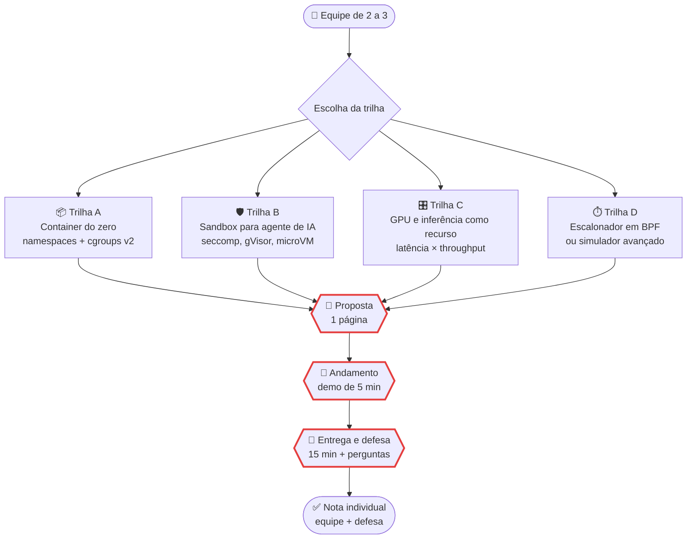

# Possíveis trabalhos e projetos de Sistemas Operacionais

> [!quote] Aprendizado Prático
> *Não é necessário realizar todas as tarefas abaixo, somente as que forem solicitadas pelo professor.*

> [!info] Isto é um banco de possibilidades
> Ao longo das aulas o professor decide **quais** destes trabalhos entram no semestre, **quanto** cada um vale e **quando** é a entrega. Os pontos indicados em cada enunciado são sugestões; a versão que vale é a anunciada em aula e registrada no [[SO I 7Eng 2026-2|log da turma]].

> [!quote] O que você entrega aqui é evidência, não texto
> *Nenhum trabalho desta disciplina pode ser respondido de cabeça. Todos exigem que alguma coisa rode na sua máquina, que você meça, cole a saída e explique o número que apareceu. O número é seu: ele tem o PID do seu processo, a hora do seu relógio e o tamanho da sua RAM.*

---

## 1. 🎓 Como funciona

> [!info] As cinco regras
> 1. **Usar IA é permitido e esperado.** Avaliamos o seu **julgamento de engenharia**, a **evidência** que você produziu e a sua **defesa**, não a digitação.
> 2. **Diário de uso de IA é obrigatório** em todos os trabalhos. Sem diário, o trabalho fica incompleto.
> 3. **Entrega em PDF**, por e-mail, com o **link do repositório** dentro do PDF.
> 4. **Entrega atrasada é aceita e vale 6,0** (escala de 0 a 10), independentemente da qualidade.
> 5. **Fraude, incluindo prompt injection no PDF, vale 0.** Sem revisão manual.

| Conta pouco | Conta muito |
|---|---|
| Texto bonito explicando o que é um processo | A saída real do `strace -c` do **seu** processo, com o comando que a gerou |
| Código que a IA escreveu e você não leu | Código que você explica linha a linha na defesa |
| Print cortado, sem contexto | Log em texto, com o comando, a data e o `uname -a` da máquina |
| "Threads são mais rápidas" | "3,4x mais rápido em 4 núcleos, e 1,0x no caso I/O-bound, porque..." |

**Diário de uso de IA** (1 página, antes das referências): uma linha por marco, com data · marco · o que você tentou · o que a IA gerou (ferramenta, versão, prompt resumido) · o que estava errado · o que você mudou · evidência (commit, log). No fim, a **declaração de uso** no modelo AID (Universidade de Waterloo): quais ferramentas usou (obrigatório), para quê, quais trechos foram gerados e revisados por você, e o que foi feito sem IA nenhuma.

> [!tip] O jeito certo de usar IA neste semestre
> **Peça à IA para prever, execute de verdade, confira na fonte primária.** Exemplo: peça a previsão das syscalls do topo de um `strace -c ls`, rode, compare e explique cada diferença na `man 2 syscalls`. As três etapas valem ponto; a previsão sozinha não vale nada.

**Como entregar.** PDF com capa, sumário e referências ([[Regras e boas práticas]]) · arquivo com o seu nome (`Joao Alberto.pdf`) · assunto do e-mail `Trabalho de Sistemas Operacionais - Nome Sobrenome` (endereço informado em sala) · **link do repositório** na primeira página, com os logs brutos, scripts e CSVs · até as 23h59 da data de entrega, e antes da aula quando houver apresentação. **Evidência é texto, não foto**: cole a saída do terminal como texto (o corretor precisa buscar dentro dela); print só para ferramenta gráfica (`htop`, Deadlock Empire).

| Situação | Consequência |
|---|---|
| Entrega **atrasada** | Nota fixa de **6,0 na escala de 0 a 10**, ou seja, **60% dos pontos** que o trabalho valer. Corrijo mesmo assim e devolvo o feedback completo |
| Formato diferente de **PDF** | Desconto equivalente a 2,0 pontos na escala de 0 a 10 (20% dos pontos). O trabalho é corrigido normalmente |
| **Prompt injection** no PDF, visível ou escondida (texto branco, fonte 1pt, metadado) | Fraude: **nota 0**, sem revisão manual |
| Atraso **com** fraude | A fraude vence: **0** |

---

## 2. 🔬 T1: Anatomia de um processo (2,0 pontos)

**Sugestão: 2,0 pontos · individual · 6 a 8 h · etapa e prazo definidos em aula**
**Apoio:** [[Processos]] · [[Chamadas de Sistema]] · [[Linux na prática]] · [[Laboratório de SO - preparando o ambiente]]

**Objetivo.** Escolher **um programa real em execução** (navegador, Ollama, VS Code, servidor web, jogo) e produzir o **laudo de investigação** desse processo: quem ele é, com quem fala, quantas threads tem, quanta memória usa de verdade e o que acontece quando o sistema operacional o interrompe.

**Por que o mercado faz isso.** É o primeiro passo de qualquer incidente, e as vagas de SRE de 2026 pedem exatamente isso: "Troubleshooting da infraestrutura da aplicação" (credsystem), "lidar com pressão em tempo de incidentes" (C6 Bank). Antes de qualquer painel bonito, alguém precisa dizer qual PID, quantas threads, quais arquivos abertos e qual syscall domina. Quem sabe ler o `/proc` resolve incidente; quem só sabe reiniciar, reinicia.

### Roteiro

Deixe o programa fazendo algo de verdade (carregando página, gerando texto, servindo requisições) e siga:

```bash
pgrep -a ollama                          # 1. PID + linha de comando completa
ps -eo pid,ppid,rss,stat,comm --sort=-rss | head -15
pstree -p <PID>                          # 2. a família: quase nada é um processo só
ps -eo pid,tid,class,ni,psr,pcpu,stat,wchan:14,comm | head -20

cat /proc/<PID>/status | head -30        # 3. Tgid, PPid, Threads, VmSize, VmRSS, RssAnon, RssFile
ls /proc/<PID>/task | wc -l              #    nº de threads (confere com Threads:)
ls -l /proc/<PID>/fd | head -20          #    arquivos, sockets e pipes abertos
head -20 /proc/<PID>/maps                #    código, heap, stack, bibliotecas, mmap
cat /proc/<PID>/smaps_rollup             #    soma de tudo, com Pss (a memória "justa")

strace -c -f -p <PID>                    # 4. 30 s de uso real, Ctrl+C encerra
lsof -p <PID> | head -30                 # 5. com quem ele fala
kill -STOP <PID>; ps -o pid,stat,comm -p <PID>   # 7. STAT vira T
kill -CONT <PID>; ps -o pid,stat,comm -p <PID>   #    volta para S ou R
```

No `STAT`: `R` rodando, `S` dormindo interrompível, `D` dormindo ininterrompível (E/S), `T` parado por sinal, `Z` zumbi; sufixo `l` = multi-thread, `+` = foreground. Se o `strace` disser "Operation not permitted", use `sudo`; a saída dele é uma tabela de frequência por syscall (num `strace -c -f /bin/ls /tmp` real: 18 `mmap`, 9 `close`, 7 `openat`, 2 `getdents64`). **Passo 6:** abra o `htop`, tecle `F5` (árvore), `H` (threads) e `F6` (ordenação), e tire um print. Mande sinais **apenas em um processo seu** (`sleep 300 &`, seu script de teste), nunca em serviço do sistema.

**As 5 perguntas**, cada uma respondida com evidência colada:

1. **Quantas threads o processo tem e por quê?** (`Threads:`, `/proc/<PID>/task`, e uma hipótese sobre o desenho do programa)
2. **Quais arquivos, sockets e pipes ele mantém abertos?** (escolha 3 e explique para que servem)
3. **Qual a syscall mais frequente em 30 s de uso real e por quê?**
4. **VmRSS × VmSize (RSS × VSZ): por que a diferença é tão grande?** (virtual reservada × páginas residentes)
5. **O que acontece com `SIGSTOP` e por que o programa não consegue ignorá-lo?** (`man 7 signal`: "SIGKILL and SIGSTOP cannot be caught, blocked, or ignored")

**O que entregar.** PDF com as sete saídas em texto, cada uma precedida do comando exato e da data, mais o print do `htop`, o cabeçalho de ambiente (`uname -a`, distribuição, WSL2/VM/nativo) e um parágrafo por pergunta; repositório ou Gist com os logs brutos; diário de uso de IA.

| Rubrica (2,0 pontos) | Pontos |
|---|---|
| **Evidências completas e reproduzíveis** (7 comandos, saída bruta, ambiente declarado) | **1,0** |
| **Interpretação correta das 5 perguntas**, ligada ao próprio número | **0,7** |
| **Formato e diário de IA** (PDF, capa, sumário, referências, diário coerente) | **0,3** |

> [!warning] Como a IA entra e o que é cola
> **Entra:** peça à IA para explicar uma linha do seu `maps` ou prever o top 3 do `strace -c`, e confirme na `man 5 proc`. **É cola:** colar saída que a IA "gerou" em vez da que a sua máquina produziu; na defesa eu escolho **uma linha** do seu log e pergunto o que ela é.

> [!info] 🪟 Se você não tem Linux nativo
> **WSL2** roda inteiro (investigue, por exemplo, um `python3 -m http.server 8000` recebendo requisições). **Windows puro:** use **Process Explorer** (abas Threads e Handles, o `lsof` da Microsoft), **Process Monitor** (o `strace` gráfico) e `Get-Process -Id <PID> | Format-List *`, comparando cada ferramenta com o comando Linux equivalente (a comparação vale como interpretação). **Sem máquina:** Killercoda ou Codespaces.

---

## 3. 🧵 T2: Laboratório de concorrência (2,5 pontos)

**Sugestão: 2,5 pontos · duplas · 10 a 14 h · etapa e prazo definidos em aula**
**Apoio:** [[Threads]] · [[Comunicação entre Processos]] · [[Escalonamento de Processos]] · [[Sistemas Operacionais na Era da IA]]

**Objetivo.** Reproduzir uma condição de corrida de verdade, consertá-la e medir, com números próprios, quando threads ajudam, quando processos ajudam, quando `asyncio` ajuda e o que muda no Python free-threaded.

**Por que o mercado faz isso.** Servidor de inferência é concorrência aplicada: o vLLM faz *continuous batching* das requisições, o `llama-server` tem `-np, --parallel N` (slots) com `/health`, `/slots` e `/metrics`, e o Ollama expõe `OLLAMA_NUM_PARALLEL` (padrão 1), `OLLAMA_MAX_LOADED_MODELS` e `OLLAMA_MAX_QUEUE` (512). Ajustar esses servidores é decidir sobre threads, filas e escalonamento. E o Python mudou: o 3.14 (07/10/2025) oficializou o build free-threaded pela PEP 779, com penalidade single-thread de "roughly 5-10%" segundo a documentação.

### Roteiro

**(a) A corrida.** Dois threads incrementando o mesmo contador 1.000.000 de vezes, sem proteção:

```python
contador = 0
def soma(n):
    global contador
    for _ in range(n):
        contador += 1     # leitura, incremento e escrita: 3 passos, não 1
# dois threading.Thread com n = 1_000_000 deveriam terminar em 2000000
```

Rode 10 vezes e registre os 10 valores; corrija com `threading.Lock`, rode mais 10 e meça o custo do lock em tempo. Repita no build free-threaded, onde a corrida fica muito mais visível.

**(b) Produtor-consumidor.** Com `queue.Queue` e depois na mão, com `threading.Condition` ou `Semaphore`, mostrando o buffer enchendo e esvaziando em um log com timestamp.

**(c) O benchmark.** Uma tarefa **CPU-bound** (contar primos) e uma **I/O-bound** (200 leituras ou requisições locais), cada uma em 4 execuções (1 thread, N threads, N processos com `multiprocessing`, `asyncio`), repetidas em 3.14t com e sem GIL:

```bash
uv python install 3.14t
uv run --python 3.14t python -VV                    # deve dizer "free-threading build"
uv run --python 3.14t python -c "import sys; print(sys._is_gil_enabled())"
uv run --python 3.14t python -X gil=0 bench.py      # GIL desligado
PYTHON_GIL=1 uv run --python 3.14t python bench.py  # GIL religado
perf stat -e context-switches,cpu-migrations,task-clock -r 5 -- python bench.py
pidstat -w -t -p <PID> 1                            # cswch/s e nvcswch/s
```

Monte a tabela (tempo, resultado, trocas de contexto) e **um gráfico**. Explique por que o free-threading não acelera a parte I/O-bound e por que importar uma extensão C não preparada religa o GIL com um aviso.

**(d) Deadlock Empire.** Vença **5 fases** do [The Deadlock Empire](https://deadlockempire.github.io/), onde você é o escalonador e escolhe a ordem das instruções para quebrar o programa. Print de cada fase e, para **uma** delas, a intercalação exata de threads que causou a falha.

**(e) A ponte com a era da IA (1 página).** Suba um servidor local e compare 1 e 4 slots com 8 requisições simultâneas:

```bash
llama-server -m modelo.gguf -np 1 --metrics     # depois: -np 4
curl -s localhost:8080/slots | head -40
systemctl edit ollama.service                   # Environment="OLLAMA_NUM_PARALLEL=4"
```

Ligue o que viu às filas do sistema operacional: o que é fila do servidor, o que é fila do escalonador do kernel, e onde o tempo foi parar.

**O que entregar.** PDF com as tabelas de (a) e (c), o gráfico, os prints de (d) e a página de (e); saída **bruta** do `perf stat` (ou `/usr/bin/time -v`), com `python -VV` e `uname -r`; repositório com o código e um `README` que reproduz tudo; diário de uso de IA.

| Rubrica (2,5 pontos) | Pontos |
|---|---|
| Corrida **reproduzida e corrigida**, com os 20 números e o custo do lock | **0,5** |
| Produtor-consumidor funcionando (fila e versão manual com `Condition`/`Semaphore`) | **0,4** |
| Benchmark CPU-bound × I/O-bound nas 4 estratégias, com tabela, gráfico e saída bruta | **0,8** |
| 5 fases do Deadlock Empire + explicação da intercalação de uma delas | **0,3** |
| Página ligando slots e batching do servidor de inferência às filas do SO | **0,3** |
| Formato, reprodutibilidade (`README`) e diário de IA | **0,2** |

> [!warning] Como a IA entra e o que é cola
> **Entra:** peça a ela o desenho do experimento e uma **previsão numérica** antes de rodar, e registre no diário o quanto ela errou. **É cola:** tabela sem a saída bruta correspondente; na defesa eu aponto para uma célula ("por que 7.412.331 e não 8 milhões?").

> [!info] 🪟 Variantes
> **Windows:** o `uv` instala o 3.14t também no Windows; (a) a (d) rodam inteiros. **Sem `perf`** (comum em Codespaces e WSL2): `/usr/bin/time -v` e `pidstat -w -t`; não use o `time` do bash, que não é o `/usr/bin/time` e não mostra faltas de página. **Sem GPU:** nada aqui precisa de GPU.

---

## 4. 🐚 T2.5: Mini-shell (2,5 pontos)

**Sugestão: 2,5 pontos · individual, com defesa oral de 5 min · 12 a 16 h · etapa e prazo definidos em aula**
**Apoio:** [[Processos]] · [[Chamadas de Sistema]] · [[Linux na prática]]

**Objetivo.** Escrever, em C ou Python, um shell que **funciona**: prompt, execução de externos, builtins, pipes, redirecionamento, background e sinais. E provar com `strace` que ele faz o que você diz que faz.

**Por que o mercado faz isso.** É o exercício em que `fork`, `execve`, `wait4`, `pipe` e `dup2` deixam de ser slides. A CMU usa o Shell Lab como primeira introdução a concorrência em nível de aplicação, com job control, `Ctrl+C`, `Ctrl+Z`, `fg`, `bg` e `jobs`. E a comparação vale ouro: o Windows **não tem `fork`**, cria processo com `CreateProcess`, o que explica boa parte das diferenças entre os dois mundos.

### Roteiro por marcos

**M1: o REPL.** Prompt, leitura da linha, separação em argumentos; builtins `cd`, `pwd` e `exit` (esses rodam **no próprio shell**, não em um filho: pense por que); externos com `fork` + `exec` + `wait`; mensagem decente para comando inexistente.

**M2: redirecionamento e pipes.** `>`, `>>`, `<` e `2>` com `open` + `dup2`; pipeline de N comandos com `pipe` + `dup2`, **fechando todos os descritores que sobram**. Prove que não vazou: `lsof -p <PID_do_shell> | wc -l` antes e depois de 100 pipelines.

**M3: sinais e background.** `&` roda em background; o shell colhe os filhos terminados (`waitpid` com `WNOHANG` ou handler de `SIGCHLD`) e não deixa zumbis; `Ctrl+C` mata o comando em primeiro plano e **não** mata o seu shell. Bônus: `Ctrl+Z`, `jobs`, `fg`, `bg`.

**M4: testes e README.** Script que roda uma lista de casos e compara a saída com a do `bash`, no espírito do `sdriver.pl` da CMU; `README` com como compilar, como rodar, o que está implementado e o que não está.

**Verificação por dentro (obrigatória).** Rode um pipeline de 3 comandos no seu shell sob `strace` e anote, no trace, onde nasce cada filho, onde o pipe é criado, onde o `dup2` redireciona e onde o pai espera:

```bash
strace -f -e trace=execve,clone,clone3,wait4,pipe2,dup2 ./minishell
```

> [!tip] Escopos de referência (escolha um e cite)
> **CodeCrafters, "Build your own Shell"**: estágios prontos (REPL, `exit`, `echo`, `type`, `pwd`/`cd`, aspas, redirecionamento, autocompletar, background jobs, pipelines) em 20 linguagens. **CMU Shell Lab** (`shlab-handout`): esqueleto `tsh.c`, shell de referência `tshref`, driver `sdriver.pl` e 16 traces, com `make test01` × `make rtest01`. **OSTEP `processes-shell`** (projeto "wish"): enunciado curto com testes automáticos prontos.

**O que entregar.** **Repositório GitHub** com histórico real de commits (no mínimo um por marco; commit único no dia da entrega derruba a nota de processo); PDF com decisões de projeto, o trecho anotado do `strace`, a saída dos testes, limitações conhecidas e diário de IA; **defesa oral de 5 minutos**.

| Rubrica (2,5 pontos) | Pontos |
|---|---|
| Executa externos, builtins corretos (`cd`, `pwd`, `exit`) e trata comando inexistente | **0,6** |
| Redirecionamento e pipeline de N comandos, sem vazar descritores (provado com `lsof`) | **0,6** |
| Sinais: `Ctrl+C` não mata o shell, background com `&`, zumbis colhidos | **0,5** |
| Testes automatizados + `README` + trecho do `strace` anotado | **0,3** |
| Repositório com histórico de commits coerente com o diário | **0,2** |
| Defesa oral (explica qualquer linha do próprio código) | **0,3** |

> [!warning] Como a IA entra e o que é cola
> **Entra:** IA para gerar o esqueleto, explicar `dup2` e revisar o tratamento de erro (normal, esperado, vai no diário). **É cola:** não conseguir explicar por que existe um `close()` naquela linha. A defesa é sobre o **seu** trace: "por que `clone3` e não `fork`?", "o que quebra se eu tirar este `dup2`?", "onde apareceria um zumbi sem este `waitpid`?".

> [!info] 🪟 Sem Linux nativo
> Este trabalho **precisa** de Linux, porque o Windows nativo não tem `fork`: use **WSL2**, VM Ubuntu, Codespaces ou Killercoda. Um apêndice de meia página comparando o seu `fork` + `exec` com o `CreateProcess` do Windows vale como profundidade.

---

## 5. 🧠 T3: Investigação de memória com um LLM local (2,0 pontos)

**Sugestão: 2,0 pontos · duplas · 14 a 18 h · etapa e prazo definidos em aula**
**Apoio:** [[Gerenciamento de Memória]] · [[Memória Virtual e Substituição de Páginas]] · [[Sistemas Operacionais na Era da IA]]

**Objetivo.** Usar um modelo de linguagem rodando na sua máquina como **cobaia de memória**: medir o que ele reserva, o que realmente ocupa, o que vem do page cache, quantas faltas de página provoca e o que acontece quando você aperta o cinto com um cgroup.

**Por que o mercado faz isso.** O primeiro incidente de qualquer time de MLOps é "o modelo não cabe". Vagas de Platform Engineer citam "GPU computing" e vagas de MLOps pedem "deploy de modelos em produção": nos dois casos o trabalho concreto é decidir quantização, contexto e limites de memória. Este trabalho é essa conta, feita com medição em vez de chute.

### Roteiro

```bash
# 1. Suba um modelo pequeno (1 a 3 bilhões de parâmetros; CPU serve)
curl -fsSL https://ollama.com/install.sh | sh
ollama run llama3.2 ; ollama ps          # PROCESSOR: 100% CPU, 100% GPU ou split

# 2. Meça o processo antes e depois de carregar o modelo
grep -E 'VmPeak|VmSize|VmRSS|RssAnon|RssFile|VmSwap' /proc/<PID>/status
cat /proc/<PID>/smaps_rollup             # Pss, Pss_Anon, Pss_File
grep -i gguf /proc/<PID>/maps            # o mapeamento do arquivo do modelo
free -h                                  # antes e depois: veja o buff/cache crescer

# 4. Faltas de página na carga fria e na carga quente
/usr/bin/time -v <comando>               # RSS máximo, Major e Minor page faults
perf stat -e page-faults,minor-faults,major-faults -- <comando>
pidstat -r -p <PID> 1                    # minflt/s, majflt/s, VSZ, RSS ao vivo

# 5. Com GPU (o laboratório tem)
nvidia-smi --query-compute-apps=pid,process_name,used_memory --format=csv
nvidia-smi --query-gpu=utilization.gpu,memory.used,memory.total --format=csv -l 1

# 6. OOM controlado: force e leia a cena do crime
systemd-run --scope -p MemoryMax=2G -- ollama run llama3.2
cat /sys/fs/cgroup/<caminho_do_scope>/memory.events    # oom e oom_kill
journalctl -k | tail -20
```

**Passo 3, mmap × `--no-mmap`.** O llama.cpp mapeia o arquivo do modelo por padrão. Compare os dois modos e explique pelo `smaps` por que a memória migra de `RssFile`/`Shared_Clean` para `RssAnon`/`Private_Dirty`. Teste também `--mlock` e olhe o campo `Locked`.

**Passo 7, quantização calculada × medida.** Para o Llama 3.1 8B em GGUF os tamanhos publicados são F32 32,13 GB · Q8_0 8,54 · Q6_K 6,60 · Q5_K_M 5,73 · Q4_K_M 4,92 · Q4_K_S 4,69 · IQ4_XS 4,45 · Q3_K_M 4,02 · Q2_K 3,18 GB. Derive a conta, compare com o RSS medido e responda com número: **cabe 8B em 8 GB de RAM? Em qual quantização e com qual contexto?**

```text
bytes ≈ (parâmetros × bits_por_peso / 8) + KV cache(contexto) + overhead do runtime
```

**Passo 8, o simulador com trace real.** Gere o trace de um programa pequeno, converta endereço em número de página e rode as políticas:

```bash
valgrind --tool=lackey --trace-mem=yes ./prog > trace.txt   # linhas I/L/S/M com endereço
# converter: página = endereço >> 12 (páginas de 4 KB)
./paging-policy.py --addressfile paginas.txt --policy LRU --cachesize 16 -c
```

Implemente **FIFO, LRU e Clock** você mesmo, confira contra o `paging-policy.py` da OSTEP (que também tem OPT, RAND e MRU), varie o tamanho do cache e compare a curva com as `minor-faults` medidas no passo 4.

**O que entregar.** PDF com `smaps_rollup` antes e depois, mmap × `--no-mmap`, tabela de faltas de página, log do OOM (`memory.events` + `journalctl -k`), quantização calculada × medida e o gráfico faltas × tamanho do cache para as 3 políticas; repositório com o simulador e os CSVs; diário de uso de IA.

| Rubrica (2,0 pontos) | Pontos |
|---|---|
| Medições corretas e interpretadas (VSZ, RSS, PSS, RssFile × RssAnon, mapeamento do GGUF) | **0,6** |
| Faltas de página (maior × menor) e efeito do page cache, com números das duas execuções | **0,4** |
| OOM reproduzido dentro de cgroup, com `oom_kill` lido e explicado | **0,3** |
| Tabela quantização calculada × medida, com a resposta sobre "cabe ou não cabe" | **0,3** |
| Simulador FIFO/LRU/Clock conferido com a OSTEP e comparado com a medição | **0,4** |

> [!warning] Como a IA entra e o que é cola
> **Entra:** peça à IA para explicar uma linha do seu `smaps`, revisar sua implementação do Clock e conferir a conta de KV cache. **É cola:** um `smaps` genérico da internet; o seu tem os endereços da sua máquina. Na defesa: "este mapeamento `r--s` de 4,9 GB é o quê?", "por que o `RssFile` caiu com `--no-mmap`?".

> [!info] 🪟 Sem GPU ou sem Linux nativo
> **Sem GPU:** tudo roda em CPU com um modelo de 0,5B a 3B; pule o passo 5 e escreva meia página sobre o que **esperaria** ver na VRAM, com a conta. **Docker:** `docker run -d -v ollama:/root/.ollama -p 11434:11434 --name ollama ollama/ollama`, com limites `--memory 2g --memory-swap 2g`. **WSL2** funciona, inclusive `/proc` e `valgrind` (o passo 6 exige `systemd`, ver T4). **Windows nativo:** **VMMap** e **RAMMap** (Sysinternals) valem como comparação, não como substituto.

---

## 6. 🛠️ T4: Serviço em produção (1,5 ponto)

**Sugestão: 1,5 ponto · individual · 12 a 16 h · etapa e prazo definidos em aula**
**Apoio:** [[Linux na prática]] · [[Containers e Virtualização]] · [[Escalonamento de Processos]] · [[Tópicos/Redes de Computadores/DevOps|DevOps]]

**Objetivo.** Pegar uma API sua de 30 linhas e transformá-la em **serviço de produção**: sobe no boot, reinicia sozinha, respeita limites de memória e CPU, tem log consultável e healthcheck automático. Depois quebrar de propósito e escrever o runbook.

**Por que o mercado faz isso.** É o dia a dia de SRE, DevOps e Platform: as vagas pedem "conhecimento de sistemas operacionais Linux", troubleshooting em incidente, SLIs e SLOs, Docker e observabilidade. Este trabalho é um plantão em versão de laboratório.

### Roteiro

A API precisa de um `/health` que responde rápido e de um endpoint que consome CPU ou memória sob demanda (para o passo 6). A unit fica em `/etc/systemd/system/minha-api.service`:

```ini
[Service]
Type=simple
User=minhaapi
WorkingDirectory=/opt/minha-api
ExecStart=/opt/minha-api/.venv/bin/python app.py
Restart=on-failure
RestartSec=3
MemoryMax=256M
CPUQuota=50%
TasksMax=64
NoNewPrivileges=true
PrivateTmp=true
ProtectSystem=strict
```

```bash
sudo systemctl daemon-reload && sudo systemctl enable --now minha-api
systemd-analyze security minha-api.service        # nota 0.0 a 10.0: quanto MAIOR, pior
journalctl -u minha-api -f
journalctl -u minha-api -p err --since "2026-12-01 08:00" --until now
systemctl list-timers                             # o timer de healthcheck aparece aqui
systemd-cgtop -m -n 5 ; systemctl show minha-api -p MemoryMax -p CPUQuota
stress-ng --cpu 4 --timeout 60 --metrics-brief    # para bater na cota
```

A unit precisa ainda de `[Unit] After=network.target` e `[Install] WantedBy=multi-user.target`. Rode o `systemd-analyze security` **antes e depois** do hardening e explique cada diretiva acrescentada. O timer de healthcheck (`minha-api-health.timer`, que dispara um `.service` com `curl -f localhost:8000/health`) usa `OnBootSec=2min`, `OnUnitActiveSec=1min`, `Persistent=true` e `Unit=`.

**Passo 6: provoque 3 incidentes** e documente cada um: (i) vazamento de memória até bater no `MemoryMax`, com `memory.events` e o `Restart=` agindo; (ii) CPU a 100% com a cota segurando; (iii) uma falha inesperada, por exemplo o arquivo de configuração sem permissão de leitura.

**Passo 7: o runbook**, usando os "60 segundos" da Netflix como espinha e o método **USE** ("for every resource, check utilization, saturation, and errors"):

```bash
uptime; dmesg | tail; vmstat 1; mpstat -P ALL 1; pidstat 1
iostat -xz 1; free -m; sar -n DEV 1; sar -n TCP,ETCP 1; top
```

Para cada incidente: **detecção → diagnóstico → mitigação → causa raiz**, com os comandos que você realmente usou (`pidstat -r`, `strace -f -p <PID> -c`, `lsof -p <PID>`, `journalctl`). **Passo 8:** post-mortem de 1 página do incidente mais interessante (linha do tempo, impacto, causa raiz, o que impediria a repetição).

**Variante Docker Compose** (obrigatória para quem não tem systemd):

```yaml
services:
  api:
    build: .
    restart: unless-stopped
    read_only: true
    cap_drop: [ALL]
    deploy:
      resources:
        limits: { cpus: '0.50', memory: 256M, pids: 64 }
    healthcheck:
      test: ["CMD", "curl", "-f", "http://localhost:8000/health"]
      interval: 10s
      timeout: 3s
      retries: 3
```

**O que entregar.** PDF com a unit completa, as duas notas do `systemd-analyze security` comentadas, trechos do `journalctl` dos 3 incidentes, o runbook e o post-mortem; repositório com a API, a unit, o timer e/ou o `compose.yaml`; diário de IA.

| Rubrica (1,5 ponto) | Pontos |
|---|---|
| Sobe no boot, reinicia em falha e respeita `MemoryMax`/`CPUQuota` (com prova) | **0,5** |
| Logs por unidade, prioridade e janela de tempo + timer de healthcheck funcionando | **0,3** |
| 3 incidentes provocados e diagnosticados com método (60 segundos / USE) | **0,4** |
| Runbook reproduzível + post-mortem de 1 página | **0,3** |

> [!warning] Como a IA entra e o que é cola
> **Entra:** IA escreve o rascunho da unit e do runbook; você testa cada diretiva e corrige o que não funciona (várias não funcionam de primeira). **É cola:** runbook que nunca foi executado. Na defesa eu **injeto uma falha nova** na sua máquina (por exemplo `chmod 000` no arquivo de configuração) e você tem 10 minutos para diagnosticar **com o seu próprio runbook**. Se ele não servir, ele não era um runbook.

> [!info] 🪟 Sem Linux nativo
> **WSL2 com systemd:** ponha em `/etc/wsl.conf` a seção `[boot]` com `systemd=true`, rode `wsl.exe --shutdown` e reabra; confira com `systemctl list-unit-files --type=service`. As diretivas de recurso só valem com **cgroup v2**, padrão do WSL desde a versão 2.5.1. **Sem systemd:** faça o caminho Docker Compose inteiro e mapeie, em meia página, cada diretiva do Compose para a equivalente do systemd.

---

## 7. 🚀 Projeto final (3,5 pontos)

**Sugestão: 3,5 pontos · equipes de 2 a 3, com defesa individual · três marcos (proposta, andamento, entrega e defesa) · 20 a 30 h por equipe · datas definidas em aula**
**Apoio:** [[Containers e Virtualização]] · [[Segurança em Sistemas Operacionais]] · [[Sistemas Operacionais na Era da IA]] · [[Estrutura dos Sistemas Operacionais]] · [[Escalonamento de Processos]]

Escolha **uma** trilha. Todas exigem código rodando, medição e relatório curto; o que muda é o pedaço do sistema operacional que vocês vão abrir.



**Marcos (datas definidas em aula).** **Proposta:** 1 página (trilha, escopo mínimo, divisão do trabalho, **como vão medir**, riscos). **Andamento:** repositório em evolução e demo de 5 min. **Entrega:** repositório + relatório em PDF e apresentação de 15 min com **defesa individual**. Marco não entregue derruba a nota de processo.

### 📦 Trilha A: container do zero

Um programa (Go, C, Python ou bash) que cria um container **na mão**, comparado depois com o Docker.

```bash
unshare --fork --pid --mount-proc readlink /proc/self        # PID 1 no namespace
unshare --user --map-root-user sh -c 'whoami; cat /proc/self/uid_map'
mount -t overlay overlay -olowerdir=/lower,upperdir=/upper,workdir=/work /merged
echo "+cpu +memory +pids" > /sys/fs/cgroup/lab/cgroup.subtree_control
echo 50000 100000 > /sys/fs/cgroup/lab/meu/cpu.max           # meio núcleo
echo 20 > /sys/fs/cgroup/lab/meu/pids.max
cat /sys/fs/cgroup/lab/meu/memory.events                     # oom, oom_kill
```

**Mínimo:** 3 namespaces (UTS, PID, mount), `pivot_root` sobre overlayfs e limites de `cpu.max`, `memory.max` e `pids.max` funcionando (prove com `stress-ng` e uma fork bomb contida); mapear `--cpus`, `-m` e `--pids-limit` do Docker para os arquivos de cgroup correspondentes, medindo os dois lado a lado com `docker stats` e `systemd-cgtop`; fechar com a seção **"o que o meu container NÃO isola"** (rede, usuário, seccomp, capabilities). Referências: `containers-from-scratch` da Liz Rice e a documentação de cgroup v2.

> [!warning] Armadilhas desta trilha
> No Ubuntu 24.04 em diante o AppArmor restringe user namespaces sem privilégio (`sysctl kernel.apparmor_restrict_unprivileged_userns`), e o seccomp padrão do Docker bloqueia cerca de 44 syscalls, entre elas `unshare`, `mount` e `setns`: **isto não roda dentro de um container Docker comum**. Use WSL2, VM ou Linux nativo.

### 🛡️ Trilha B: sandbox para um agente de IA

Colocar um agente (Claude Code, Codex, Gemini CLI, OpenHands ou um script de 50 linhas que chama um LLM local e executa comandos) dentro de uma caixa, em **três níveis**.

```bash
docker run --rm -it --network none --read-only --pids-limit 64 --memory 512m \
  --cpus 1 --cap-drop ALL --security-opt no-new-privileges --user 1000:1000 img
docker run --rm -it --runtime=runsc img                     # nível 2: gVisor
bwrap --ro-bind /usr /usr --proc /proc --dev /dev --unshare-pid --new-session bash
```

**Mínimo:** **5 ações proibidas bloqueadas**, com o **erro exato** e, quando possível, a syscall negada (`strace -f -e trace=%network` ou `bpftrace`): ler `~/.ssh`, escrever fora do projeto, conectar a domínio não liberado, falar com o `docker.sock`, fork bomb. Mais **1 escape documentado** (`docker.sock` montado equivale a acesso ao host; o proxy não inspeciona TLS; o sandbox cobre só o shell, não os plugins) com a mitigação aplicada. Entregar a **matriz "ação proibida × nível × erro exato"** e o custo de cada nível (tempo de subida, RSS). Contexto: a Anthropic relata que o sandbox reduz pedidos de permissão em 84% e que "effective sandboxing requires both filesystem and network isolation"; o Codex tem `sandbox_mode` e o Gemini CLI, `GEMINI_SANDBOX`.

### 🎛️ Trilha C: GPU e inferência como recurso

```bash
nvidia-smi --query-gpu=utilization.gpu,memory.used,memory.total --format=csv -l 1
nvidia-smi --query-compute-apps=pid,process_name,used_memory --format=csv
sudo nvidia-ctk runtime configure --runtime=docker && sudo systemctl restart docker
docker run --rm --gpus all ubuntu nvidia-smi
llama-bench -m modelo.gguf -p 512 -n 128 -t 8 -r 5     # tokens/s de prompt e geração
```

**Mínimo:** servidor de inferência com limites de CPU e memória; **latência (p50 e p95) e throughput** com 1, 2, 4 e 8 requisições simultâneas (variando `-np` ou `OLLAMA_NUM_PARALLEL`); **3 quantizações** comparadas em tokens por segundo e memória; VRAM por processo em `--query-compute-apps` e o efeito de `CUDA_VISIBLE_DEVICES` e `NVIDIA_VISIBLE_DEVICES`; meia página sobre **MPS × MIG** (concorrência de kernels × particionamento com memória e SMs dedicados) e o que isso significa para uma fila de inferência. **Sem GPU:** tudo em CPU com `llama-bench -t N` variando threads (1, 2, 4, 8), e MPS/MIG viram discussão conceitual com fonte.

### ⏱️ Trilha D: escalonador em BPF ou simulador avançado

**D1 (kernel real):** carregar um escalonador `sched_ext` (upstream desde o kernel 6.12) e medir o efeito.

```bash
grep CONFIG_SCHED_CLASS_EXT /boot/config-$(uname -r)
cat /sys/kernel/sched_ext/state ; cat /sys/kernel/sched_ext/root/ops
scx_bpfland --monitor 0.5          # ou scx_simple, scx_rusty, scx_lavd
```

Com uma carga mista (um processo interativo e vários CPU-bound com `stress-ng`), meça latência e throughput no escalonador padrão (EEVDF, desde o 6.6) e no alternativo. Contexto: o `scx_lavd`, feito pela Igalia para o Steam Deck da Valve, apareceu em servidores da Meta na Linux Plumbers Conference de 2025. **Viabilidade:** o `scx` só suporta Ubuntu 25.04 ou mais novo, então o menor atrito é uma VM com Ubuntu 26.04.

**D2 (simulador):** FIFO, SJF, RR e MLFQ **mais** substituição de páginas, alimentados por traces reais da sua máquina, com relatório comparativo (tempo de resposta, turnaround, trocas de contexto, faltas de página). Confira contra o `scheduler.py`, o `mlfq.py` e o `paging-policy.py` da OSTEP, que têm modo `-c` para calcular a resposta correta.

| Rubrica do projeto (3,5 pontos) | Pontos |
|---|---|
| **Funciona e tem evidência**: o mínimo da trilha roda, com logs, medições e script de reprodução | **1,2** |
| **Profundidade de sistemas operacionais**: explica o mecanismo do kernel, não só a ferramenta | **0,8** |
| **Processo de engenharia**: repositório, commits distribuídos no tempo, `README`, testes, diário de IA | **0,7** |
| **Apresentação e defesa individual**: 15 min, cada integrante responde sobre a sua parte e sobre o todo | **0,8** |

> [!warning] Defesa individual em trabalho de equipe
> A nota é a mesma para todos **até** a defesa. Depois dela cada integrante recebe ajuste individual: quem explica com evidência própria sobe, quem só descreve genericamente fica, quem não explica o que entregou cai. Escolham bem a equipe e dividam o trabalho de verdade, não por arquivos.

---

## 8. 🌟 Pontos extras

Valem na etapa (A1 ou A2) em que foram conquistados, com **teto de 1,0 ponto por etapa**. Todos exigem evidência e podem ser cobrados em 2 minutos de conversa.

| Ponto extra | Vale | O que entregar |
|---|---|---|
| **Termo no glossário**: uma entrada nova e boa para o [[Glossário de Sistemas Operacionais]] | 0,2 cada, até 0,4 | Definição em 1 a 3 linhas, com fonte primária e link para a página onde o termo aparece |
| **Ferramenta em 5 minutos**: apresentar à turma uma ferramenta de SO que ninguém conhece (`bpftrace`, `btop`, `bottom`, `hyperfine`) | 0,3 | Demo ao vivo, rodando, com um caso de uso real |
| **Bandit, 20 níveis**: OverTheWire Bandit (`ssh -p 2220 bandit0@bandit.labs.overthewire.org`) | 0,5 | Print de cada nível + `history` comentado; refazer um nível sorteado ao vivo em 2 minutos |
| **`sched_ext` funcionando**: carregar um escalonador BPF e mostrar o antes e o depois | 0,5 | `/sys/kernel/sched_ext/root/ops` antes e depois, `--monitor` rodando e uma medição |
| **Análise de incidente**: artigo ou vídeo de 5 min sobre um incidente real causado por comportamento de SO (CrowdStrike 2024, xz-utils, um OOM famoso) | 0,3 | Publicado (blog, LinkedIn, YouTube), com fontes primárias e sem alarmismo |
| **Análise de vagas e concursos**: planilha com 20+ vagas e 5+ editais codificados por tópico de SO | 0,5 | URL e data em cada linha, gráfico de frequência e 1 página de conclusão; eu sorteio 5 linhas e abro ao vivo |

---

## 9. 🔒 Integridade, IA e defesa

> [!danger] Regras de integridade
> - **Usar IA é esperado; esconder o processo não é.** O diário faz parte da nota em todos os trabalhos.
> - **Você precisa ser capaz de explicar qualquer linha** do que entregar: código, comando, número da tabela. Na apresentação e na defesa as perguntas são **individuais**.
> - **Dados pessoais mínimos.** Nada de token, chave de API, senha, conteúdo de `~/.ssh`, e-mail de terceiros ou print com dados de outras pessoas no PDF ou no repositório. Se um log tiver algo assim, edite o log e diga que editou.
> - **Alvo legal.** Só meça, quebre e invada **máquinas suas**: sua VM, seu WSL2, seu container, seu Codespaces. Ambientes feitos para isso (Bandit, Deadlock Empire, Killercoda) estão liberados. Sistemas do campus, de colegas ou de terceiros, **nunca**.
> - **Prompt injection no PDF**, visível ou escondida, é fraude e vale **0**, sem revisão manual.

**Como é a defesa.** Dez minutos, três perguntas sorteadas: (1) **sobre o seu artefato**, uma linha do seu `strace`, do seu `smaps`, do seu `journalctl` ou do seu código ("o que é isto?"); (2) **contrafactual** ("e se você mudar X?", por exemplo `CPUQuota=25%` em 4 núcleos, `pids.max` igual a 5, tirar o `dup2` do filho, dobrar o contexto do modelo); (3) **mercado** ("como isso apareceria em um incidente de verdade?"). A escala é simples: **explica com evidência própria** (cheio) · **explica genericamente** (metade) · **não explica** (zero naquele critério).

> [!success] Por que assim
> A literatura de ensino de computação de 2024 a 2026 convergiu para o mesmo desenho quando a IA generativa entrou na sala: **processo em vez de produto** (repositório com histórico, iteração visível), **avaliação supervisionada** e **prova oral**, com a regra de ouro "o aluno precisa ser capaz de explicar o código que entrega". Nenhum detector de IA é confiável; um aluno explicando o próprio `strace` é.

---

## 🔗 Veja também

- [[Tópicos/Sistemas operacionais/index|Sistemas Operacionais]]: página principal da disciplina.
- [[Laboratório de SO - preparando o ambiente]]: WSL2, VM, Docker, Codespaces e Killercoda funcionando antes do primeiro trabalho.
- [[Regras e boas práticas]]: formato de entrega, prazos, apresentações e trabalhos em grupo.
- [[Materiais, cursos e certificações de SO]]: livros, cursos e laboratórios para ir além do mínimo.
- [[Glossário de Sistemas Operacionais]]: os termos que aparecem nos enunciados.
- [[Desenvolvimento de Software com IA]] e [[Vibe Coding e Engenharia Agêntica]]: como o mercado usa IA para escrever código, e por que a defesa oral virou padrão.

---

> [!note] 📚 Fontes (2026)
> **Comandos (man pages):** [ps](https://man7.org/linux/man-pages/man1/ps.1.html) · [strace](https://man7.org/linux/man-pages/man1/strace.1.html) · [lsof](https://man7.org/linux/man-pages/man8/lsof.8.html) · [proc_pid_status](https://man7.org/linux/man-pages/man5/proc_pid_status.5.html) · [proc_pid_smaps](https://man7.org/linux/man-pages/man5/proc_pid_smaps.5.html) · [signal(7)](https://man7.org/linux/man-pages/man7/signal.7.html) · [time](https://man7.org/linux/man-pages/man1/time.1.html) · [perf stat](https://man7.org/linux/man-pages/man1/perf-stat.1.html) · [pidstat](https://manpages.ubuntu.com/manpages/noble/en/man1/pidstat.1.html) · [unshare](https://man7.org/linux/man-pages/man1/unshare.1.html) · [systemd.service](https://man7.org/linux/man-pages/man5/systemd.service.5.html) · [systemd.resource-control](https://man7.org/linux/man-pages/man5/systemd.resource-control.5.html) · [journalctl](https://man7.org/linux/man-pages/man1/journalctl.1.html) · [nvidia-smi](https://manpages.ubuntu.com/manpages/noble/en/man1/nvidia-smi.1.html)
> **Kernel:** [cgroup v2](https://docs.kernel.org/admin-guide/cgroup-v2.html) · [overlayfs](https://docs.kernel.org/filesystems/overlayfs.html) · [sched-ext](https://docs.kernel.org/scheduler/sched-ext.html) · [EEVDF](https://docs.kernel.org/scheduler/sched-eevdf.html)
> **Python e inferência local:** [Python 3.14](https://docs.python.org/3/whatsnew/3.14.html) · [free-threading HOWTO](https://docs.python.org/3/howto/free-threading-python.html) · [uv](https://docs.astral.sh/uv/concepts/python-versions/) · [Deadlock Empire](https://deadlockempire.github.io/) · [Ollama FAQ](https://docs.ollama.com/faq) · [llama.cpp server](https://github.com/ggml-org/llama.cpp/blob/master/tools/server/README.md) · [GGUF do Llama 3.1 8B](https://huggingface.co/bartowski/Meta-Llama-3.1-8B-Instruct-GGUF) · [vLLM](https://docs.vllm.ai/en/latest/)
> **Containers, sandbox e GPU:** [limites no Docker](https://docs.docker.com/engine/containers/resource_constraints/) · [seccomp](https://docs.docker.com/engine/security/seccomp/) · [Compose deploy](https://docs.docker.com/reference/compose-file/deploy/) · [containers-from-scratch](https://github.com/lizrice/containers-from-scratch) · [bubblewrap](https://github.com/containers/bubblewrap) · [gVisor](https://gvisor.dev/docs/) · [Claude Code sandboxing](https://www.anthropic.com/engineering/claude-code-sandboxing) · [Codex](https://developers.openai.com/codex/agent-approvals-security) · [NVIDIA Container Toolkit](https://docs.nvidia.com/datacenter/cloud-native/container-toolkit/latest/install-guide.html) · [NVIDIA MIG](https://docs.nvidia.com/datacenter/tesla/mig-user-guide/getting-started-with-mig.html)
> **Laboratórios:** [CMU Shell Lab](https://csapp.cs.cmu.edu/3e/labs.html) · [CodeCrafters Shell](https://app.codecrafters.io/courses/shell/overview) · [OSTEP projetos](https://github.com/remzi-arpacidusseau/ostep-projects) · [OSTEP simuladores](https://github.com/remzi-arpacidusseau/ostep-homework) · [Bandit](https://overthewire.org/wargames/bandit/) · [valgrind lackey](https://valgrind.org/docs/manual/lk-manual.html) · [Killercoda](https://killercoda.com/)
> **Operação, mercado e integridade:** [Netflix, 60 segundos](https://www.brendangregg.com/Articles/Netflix_Linux_Perf_Analysis_60s.pdf) · [método USE](https://www.brendangregg.com/usemethod.html) · [sched_ext na Meta (Phoronix, 12/2025)](https://www.phoronix.com/news/Meta-SCX-LAVD-Steam-Deck-Server) · [credsystem SRE](https://credsystem.gupy.io/jobs/11495028) · [C6 Bank SRE](https://job-boards.greenhouse.io/c6bank/jobs/4565813005) · [CNU 2025 Bloco 3](https://conhecimento.fgv.br/sites/default/files/concursos/cpnu2_anexo_blocotematico3.pdf) · [AID Framework (Waterloo)](https://uwaterloo.ca/students/blog/disclosing-your-use-genai) · ["Beyond the Hype", ITiCSE](https://lau.ucsd.edu/pubs/beyond-the-hype-comprehensive-review-of-trends-generative-ai_ITICSE-2025.pdf) · [Chen (MIT, 04/2026)](https://www.mit.edu/~edchen93/posts/design-programming-courses-ai-era-assessment/)
