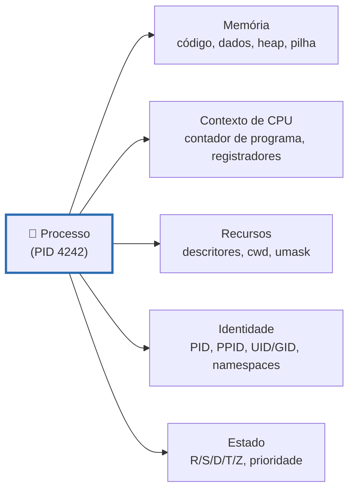
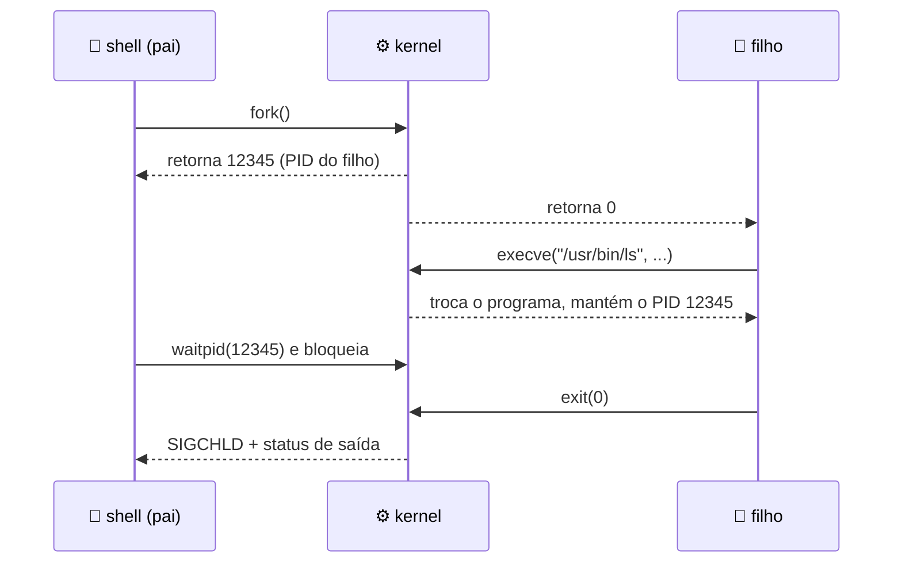
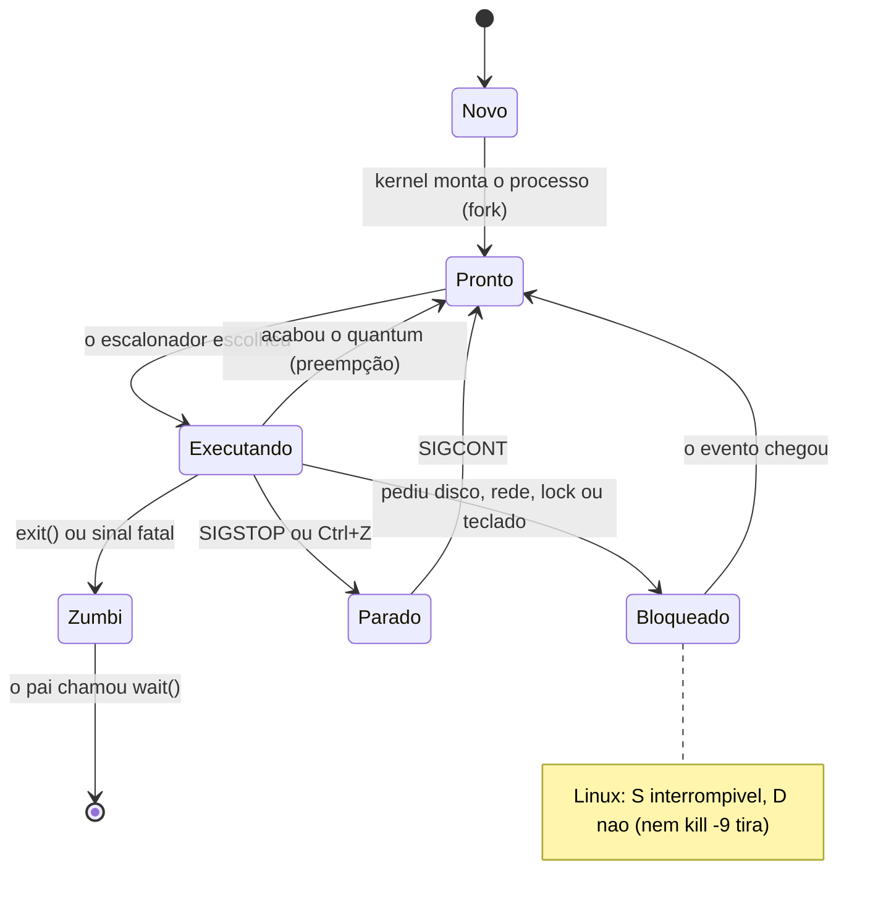

# Processos

> [!quote] Um programa é um substantivo, um processo é um verbo
> *Na máquina onde escrevi esta aula há **295 processos** e **845 threads** disputando **12 núcleos**. Quantos estão de fato executando? **Dois.** O resto dorme, esperando uma tecla, um pacote de rede ou um bloco de disco. A ilusão de que tudo roda ao mesmo tempo é a primeira grande mentira do sistema operacional, e ela tem nome: processo.*

> [!abstract] 🧭 O que você vai fazer nesta aula
> Duplicar um processo com `fork()` em Python e em C, ver o `execve` trocar o programa sem trocar o PID, criar um **zumbi** e descobrir por que `kill -9` não resolve, ler a ficha que o kernel mantém sobre você em `/proc`, congelar e ressuscitar um processo com sinais, medir uma troca de contexto e abrir um servidor de LLM para ver que ele é só... processo. Ambiente: Ubuntu 24.04 em WSL2, VM ou Docker ([[Laboratório de SO: preparando o ambiente]]).

---

## 1. 🧬 O que é um processo

Um **programa** é um arquivo parado no disco: bytes, instruções, uma receita. Um **processo** é essa receita **sendo executada**, com todo o estado vivo que isso exige.

A analogia é a cozinha: a receita de bolo é o programa, o cozinheiro seguindo a receita é o processo. Ele tem uma página aberta (o **contador de programa**), uma bancada com ingredientes no meio do caminho (a **memória**), panelas em uso (os **arquivos abertos**) e um crachá (o **PID** e as credenciais). Se o telefone toca, ele anota onde parou, larga tudo, resolve e volta: isso é uma **troca de contexto**. O mesmo `/usr/bin/python3` pode virar dez processos independentes.



Tanenbaum chama de **pseudoparalelismo** a impressão de que vários programas rodam ao mesmo tempo em uma única CPU: o que existe é revezamento em fatias de milissegundos. Com 12 núcleos há paralelismo real de 12 processos e pseudoparalelismo para os outros 283.

Faça a conta agora (no Windows use o WSL2, ou `(Get-Process).Count` no PowerShell):

```bash
$ echo "processos: $(ps -e --no-headers | wc -l) | threads: $(ps -eL --no-headers | wc -l) | nucleos: $(nproc)"
processos: 295 | threads: 845 | nucleos: 12
$ ps -eo stat --no-headers | cut -c1 | sort | uniq -c | sort -rn
    192 S        <-- dormindo, acordam com um sinal
    108 I        <-- threads ociosas do kernel
      2 R        <-- os unicos executando ou prontos
```

---

## 2. 🌱 Como um processo nasce: fork, exec, wait

No Unix (e portanto no Linux, macOS e Android) criar um processo é **duplicar** um que já existe. Não há "criar do zero": todo processo tem um pai.

| Chamada | O que faz | Detalhe que cai na prova |
|---|---|---|
| `fork()` | Cria uma cópia quase idêntica do processo atual | Retorna **duas vezes**: 0 no filho, o PID do filho no pai |
| `execve()` | Substitui o programa que roda dentro do processo | **Mantém** PID, PPID, diretório atual, umask e descritores sem `FD_CLOEXEC` |
| `wait()`, `waitpid()` | O pai bloqueia até um filho terminar e colhe o código de saída (0 a 255) | Se o pai não chamar, o filho morto vira **zumbi** e não sai da tabela |
| `clone()`, `clone3()` | `fork` geral, com controle do que é compartilhado | Cria **threads** (`CLONE_THREAD`) e **containers** (`CLONE_NEWPID`) |



**Copy-on-write: por que duplicar 2 GB é barato.** O man page do `fork(2)` é explícito: a chamada usa páginas de **copy-on-write**. O kernel não copia nada na hora; marca as páginas como somente leitura e as compartilha entre pai e filho, e só quando alguém **escreve** é que duplica aquela página (4 KB), apenas ela. Como o filho quase sempre chama `execve` logo depois e joga fora a memória herdada, o custo real fica perto de zero. Desde a glibc 2.3.3 o `fork()` da libc nem chama mais a syscall `fork`: chama `clone(2)`.

> [!example] 🧪 Atividade 1: seu primeiro fork em Python
> **Ferramenta:** `python3` (Linux, WSL2 ou macOS; não há `os.fork()` no Windows nativo).
>
> 1. Crie `forkdemo.py`:
>    ```python
>    import os, sys, time
>
>    print(f"antes do fork: PID={os.getpid()}")
>    sys.stdout.flush()               # esvazia o buffer ANTES de duplicar
>    pid = os.fork()                  # daqui em diante existem DOIS processos
>
>    if pid == 0:                     # só o filho entra aqui (fork devolveu 0)
>        print(f"  filho: PID={os.getpid()} PPID={os.getppid()}")
>        sys.stdout.flush()
>        time.sleep(1)
>        os._exit(3)                  # termina o filho com codigo 3
>    else:                            # só o pai entra aqui (fork devolveu o PID do filho)
>        print(f"  pai:   PID={os.getpid()} criou o filho {pid}")
>        morto, status = os.wait()    # bloqueia até um filho terminar
>        print(f"  pai:   filho {morto} saiu com codigo {os.waitstatus_to_exitcode(status)}")
>    ```
> 2. Rode `python3 forkdemo.py` **três vezes**.
>
> **Resultado esperado** (execução real):
> ```
> antes do fork: PID=46064
>   filho: PID=46065 PPID=46064
>   pai:   PID=46064 criou o filho 46065
>   pai:   filho 46065 saiu com codigo 3
> ```
> Entregue as três saídas e responda: **a ordem das linhas do pai e do filho foi sempre a mesma?** Quem decide isso é o escalonador, não o seu código.
>
> **Pegadinha:** tire os `flush()` e redirecione a saída para um arquivo (`python3 forkdemo.py > saida.txt`): linhas somem ou duplicam, porque o buffer de saída é memória comum e o `fork()` o copia junto, e porque `os._exit()` não esvazia buffer. Regra: flush antes de qualquer `fork`.
>
> 🪟 **No Windows:** use o WSL2. No Python nativo, `os.fork()` levanta `AttributeError`: o Win32 não tem fork (seção 8).

> [!example] 🧪 Atividade 2: fork + execvp + waitpid em C (o mesmo PID vira outro programa)
> **Ferramenta:** `gcc` (`sudo apt install build-essential`) e `strace`.
>
> 1. Crie `forkexec.c`:
>    ```c
>    #include <stdio.h>
>    #include <unistd.h>
>    #include <sys/wait.h>
>
>    int main(void) {
>        char ppid[16];
>        snprintf(ppid, sizeof ppid, "%d", getpid());
>        printf("pai: PID=%s\n", ppid);
>        fflush(stdout);                    /* esvazie o buffer antes do fork */
>
>        pid_t pid = fork();
>        if (pid < 0) { perror("fork"); return 1; }
>        if (pid == 0) {                    /* filho: mesmo codigo, PID novo */
>            printf("filho: PID=%d PPID=%d, vou virar 'ps'\n", getpid(), getppid());
>            fflush(stdout);
>            char *argv[] = {"ps", "-o", "pid,ppid,stat,comm", "--ppid", ppid, NULL};
>            execvp(argv[0], argv);         /* troca o programa, mantem o PID */
>            perror("execvp"); _exit(127);  /* so chega aqui se o exec falhar */
>        }
>        int status;
>        waitpid(pid, &status, 0);          /* pai espera ESTE filho */
>        if (WIFEXITED(status))
>            printf("pai: filho %d terminou, codigo %d\n", pid, WEXITSTATUS(status));
>        return 0;
>    }
>    ```
> 2. `gcc -Wall -O2 -o forkexec forkexec.c && ./forkexec`
> 3. Veja o kernel fazendo o mesmo por baixo de um pipeline do shell:
>    ```bash
>    strace -f -e trace=%process -e signal=none bash -c 'ls | wc -l'
>    ```
>
> **Resultado esperado** no passo 2:
> ```
> pai: PID=46321
> filho: PID=46322 PPID=46321, vou virar 'ps'
>     PID    PPID STAT COMMAND
>   46322   46321 R    ps
> pai: filho 46322 terminou, codigo 0
> ```
> Compare `filho: PID=46322` com a linha do `ps`: é o **mesmo PID**, mas o programa agora é outro. No passo 3 você vê o mesmo padrão em `clone` + `execve` + `wait4`:
> ```
> execve("/usr/bin/bash", ["bash", "-c", "ls | wc -l"], ...) = 0
> clone(flags=...|SIGCHLD) = 51574     |  [pid 51574] execve("/usr/bin/ls", ...) = 0
> clone(flags=...|SIGCHLD) = 51575     |  [pid 51575] execve("/usr/bin/wc", ...) = 0
> [pid 51573] wait4(-1, [{WIFEXITED(s) ...}], 0, NULL) = 51574
> ```
> **Entregue:** a saída do passo 2 marcando os dois lugares onde o mesmo PID aparece e a contagem de `clone` e `execve` do passo 3. Repita com `bash -c 'cd /tmp'` e explique por que não aparece clone nem execve (dica: `cd` é embutido no shell).
>
> 🪟 **No Windows:** compile no WSL2; o equivalente do passo 3 é o **Process Monitor** (Sysinternals) filtrando por "Operation is Process Create".

**clone, clone3 e os namespaces.** `fork()` é um caso particular de `clone()`, em que quem chama escolhe **o que compartilhar** com o filho por meio de flags: `CLONE_VM` (mesma memória), `CLONE_FILES` (mesmos descritores), `CLONE_THREAD` (mesmo grupo de threads) e a família `CLONE_NEW*`, que cria **namespaces** novos. A interface moderna é a `clone3()`, disponível desde o Linux 5.3, e o Linux 7.1 (junho de 2026) ainda acrescentou flags a ela. São **8 tipos de namespace** (cgroup, IPC, network, mount, PID, time, user, UTS), e é essa combinação que faz um container Docker parecer uma máquina separada sendo apenas um processo comum ([[Containers e Virtualização]]).

---

## 3. 👪 Árvore de processos, órfãos e zumbis

Todo processo tem um pai, então o conjunto forma uma **árvore** cuja raiz é o **PID 1** (`systemd` no Ubuntu, Debian e Fedora; dentro de um container, o seu próprio programa).

```bash
$ bash -c 'sleep 5 & sleep 5 & pstree -p $$; wait'
bash(48299)-+-pstree(48302)
            |-sleep(48300)
            `-sleep(48301)
```

**Órfão: o pai morreu primeiro.** O filho é **adotado**: o `wait(2)` diz que ele passa a ter como pai o `init(1)` ou o *subreaper* mais próximo, e o PPID vira 1.

```bash
$ bash -c 'sleep 120 & echo "pai (PID $$) criou o filho $! e vai morrer agora"'
pai (PID 50925) criou o filho 50926 e vai morrer agora
$ ps -o pid,ppid,stat,comm -C sleep
    PID    PPID STAT COMMAND
  50926       1 S    sleep
```

**Zumbi: o filho morreu e ninguém colheu.** Quando um processo termina ele **não some** da tabela: o kernel guarda uma entrada mínima (código de saída, tempos de CPU) até o pai chamar `wait()`. O `wait(2)` define: "um filho que termina, mas cujo status não foi colhido, torna-se um zumbi". Ele não gasta CPU nem memória de usuário, mas ocupa algo escasso: **uma entrada na tabela de processos e um PID**. Um servidor com um `wait` esquecido acumula zumbis até não criar mais processo nenhum.

![[Recursos/Sistemas operacionais/Processos/fork-bomb.png|Cada processo cria dois, que criam dois, que criam dois: é assim que uma bomba de fork esgota a tabela de processos (Wikimedia Commons)]]

> [!danger] Bomba de fork: entenda, não execute
> `:(){ :|:& };:` define uma função chamada `:` que chama a si mesma duas vezes em segundo plano; em segundos o sistema fica sem PIDs. **Não rode isso no laboratório nem na sua máquina.** Para ver o mecanismo com segurança, use uma VM descartável e limite antes com `ulimit -u 100` na **mesma** sessão; a proteção confiável é o cgroup v2 (`pids.max`).

> [!example] 🧪 Atividade 3: criar um zumbi, tentar matar e achar a cura
> **Ferramenta:** `python3` e `ps`.
>
> 1. Crie um pai que faz `fork` e **não** chama `wait`:
>    ```bash
>    python3 -c 'import os,time; pid=os.fork(); os._exit(0) if pid==0 else time.sleep(60)' &
>    PAI=$!
>    sleep 1
>    ps -o pid,ppid,stat,comm --ppid $PAI
>    ```
> 2. Confirme no `/proc`: `Z=$(ps -o pid= --ppid $PAI | tr -d ' ')` e `grep State /proc/$Z/status`.
> 3. Tente matar o zumbi (`kill -9 $Z`) e repita o `ps` do passo 1. Depois mate o **pai** (`kill $PAI`), espere 1 segundo e rode `ps -p $Z`.
>
> **Resultado esperado** (execução real):
> ```
>     PID    PPID STAT COMMAND
>   46678   46676 Z    python3 <defunct>       (State: Z (zombie) no /proc)
> depois de kill -9 no zumbi:  46678  Z  python3 <defunct>   <-- continua la!
> depois de matar o PAI:       zumbi 46678 sumiu da tabela de processos
> ```
> **Entregue** as saídas e explique por que `kill -9` não funcionou: o processo já está morto, não há ninguém para receber o sinal; faltava um `wait()`, e quando o pai morre o PID 1 adota o zumbi e colhe o status na hora.
>
> 🪟 **No Windows:** não há zumbi, porque o Win32 usa **handles**: o objeto do processo morto vive enquanto alguém mantiver o `hProcess` aberto, e o vazamento equivalente é esquecer o `CloseHandle`. Veja o total com `Get-Process | Measure-Object Handles -Sum`.

---

## 4. 🔁 Estados de um processo

![[Recursos/Sistemas operacionais/Processos/estados-de-processo.png|Diagrama clássico de estados. Atenção ao vocabulário: "Waiting" aqui é o nosso PRONTO (na fila esperando CPU) e "Blocked" é o BLOQUEADO (esperando E/S); as caixas de baixo são o processo mandado para a área de troca (Wikimedia Commons, domínio público)]]



No Linux o estado real aparece na coluna `STAT` do `ps`, com as letras definidas no man page do `ps(1)`:

| Letra | Nome no `ps` | Na prática |
|---|---|---|
| `R` | running or runnable | Na CPU **ou** na fila de prontos; o `ps` não separa os dois |
| `S` | interruptible sleep | Dormindo esperando um evento; um sinal acorda. É o estado da imensa maioria |
| `D` | uninterruptible sleep (usually I/O) | Dormindo no kernel esperando E/S: **não responde nem a `SIGKILL`**. Muitos `D` = disco ou NFS com problema |
| `T` | stopped by job control signal | Parado por `SIGSTOP` ou `SIGTSTP` (Ctrl+Z) |
| `Z` | defunct ("zombie") | Terminou e espera o pai colher o status |
| `I` | idle kernel thread | Thread ociosa do kernel |

Há ainda `t` (sob `ptrace`) e `X` (dead); na segunda letra vêm `s` (líder de sessão), `+` (foreground) e `l` (multi-thread).

**A troca de contexto tem preço.** Trocar de processo é salvar registradores, trocar a tabela de páginas (invalidando parte da TLB), esfriar os caches e carregar o outro contexto. Dá para medir:

```bash
$ perf bench sched pipe
# Executed 1000000 pipe operations between two processes
     Total time: 5.835 [sec]     5,835985 usecs/op     171350 ops/sec
```

São **5,8 microssegundos** por ida e volta entre dois processos, ou 171 mil trocas por segundo no melhor caso. Parece pouco, mas se um servidor faz uma troca por requisição de 100 microssegundos, 6 % da máquina evapora só trocando de processo. Daí a preferência moderna por **threads**, `epoll` e `io_uring` em vez de "um processo por cliente".

> [!example] 🧪 Atividade 4: congelar e ressuscitar um processo (o estado T ao vivo)
> **Ferramenta:** `yes`, `ps` e `kill` (já instalados).
>
> 1. Ponha um processo para queimar CPU e guarde o PID:
>    ```bash
>    yes > /dev/null &
>    PID=$!
>    sleep 2; ps -o pid,stat,pcpu,comm -p $PID
>    ```
> 2. Congele (`kill -STOP $PID`), espere 2 segundos e repita o `ps`. Descongele (`kill -CONT $PID`), espere e repita. Encerre (`kill -TERM $PID`) e confirme com `ps -p $PID`.
>
> **Resultado esperado** (execução real):
> ```
> rodando:              PID 49618  STAT R   %CPU 100
> depois de kill -STOP: PID 49618  STAT T   %CPU 50.0
> depois de kill -CONT: PID 49618  STAT R   %CPU 66.8
> depois de kill -TERM: processo 49618 nao existe mais
> ```
> **Entregue** as quatro linhas e explique por que o `%CPU` **caiu** com o processo em `T` (dica: o `%CPU` do `ps` é média sobre o tempo de vida, não instantâneo).
>
> 🪟 **No Windows:** não há `SIGSTOP`, mas o **Process Explorer** tem "Suspend" e "Resume" no menu de contexto: teste no Bloco de Notas.

> [!example] 🧪 Atividade 5: medir a troca de contexto e vê-la acontecer
> **Ferramenta:** `perf` (pacote `linux-tools-generic`) e `pidstat` (pacote `sysstat`).
>
> 1. Meça três vezes com `perf bench sched pipe` e tire a média de `usecs/op` (na minha máquina, `5,84`).
> 2. Veja as trocas acontecendo no mesmo terminal: `yes > /dev/null & pidstat -w -p $! 1`. Repita com `while true; do sleep 0.01; done & pidstat -w -p $! 1` e compare `cswch/s` (voluntárias, o processo se bloqueou) com `nvcswch/s` (forçadas, o escalonador tomou a CPU).
>
> **Resultado esperado:** o seu número em microssegundos, quantas trocas por segundo a sua CPU sustenta, e qual dos dois programas do passo 2 gera trocas **voluntárias**.
>
> 🪟 **No Windows:** rode no WSL2; o contador equivalente é "Context Switches/sec" no `perfmon`.

---

## 5. 🗂️ A ficha do processo: `task_struct` e `/proc`

Para cada processo o kernel mantém a estrutura que os livros chamam de **PCB** (*Process Control Block*). No Linux ela tem nome e endereço: `struct task_struct`, em `include/linux/sched.h`.

| Campo do `task_struct` | Guarda |
|---|---|
| `__state`, `exit_state` | O estado (`TASK_RUNNING` 0, `TASK_INTERRUPTIBLE` 1, `TASK_UNINTERRUPTIBLE` 2, `EXIT_ZOMBIE` 0x20) |
| `pid`, `tgid` | O ID da **thread** e o ID do **processo**: leia duas vezes, é assim que o Linux unifica os dois |
| `real_parent`, `parent`, `children` | A árvore de processos |
| `mm`, `files`, `fs`, `signal` | Memória, descritores abertos, diretório atual e a máquina de sinais |
| `nsproxy`, `cgroups`, `seccomp` | Namespaces, cgroups e filtro de syscalls: a base de containers e sandbox |
| `sched_class`, `prio`, `policy`, `cpus_mask` | Escalonamento e afinidade ([[Escalonamento de Processos]]); `utime`, `min_flt` e `nvcsw` fazem a contabilidade |

Você não precisa ler código do kernel: o Linux expõe a ficha como arquivos em `/proc/<pid>/`.

| Arquivo em `/proc/<pid>/` | O que você lê ali |
|---|---|
| `status` (e `stat`) | Resumo legível: `Name`, `State`, `Tgid`, `Pid`, `PPid`, `Threads`, `VmRSS`, `voluntary_ctxt_switches`. O `stat` tem o mesmo em uma linha de números, e é dali que o `ps` e o `top` leem |
| `cmdline`, `exe`, `cwd` | Linha de comando (argumentos separados por byte zero) e links para o binário e o diretório de trabalho |
| `fd/` | Um link por descritor aberto: `0` entrada, `1` saída, `2` erro, e todos os arquivos e sockets |
| `maps`, `smaps_rollup` | Mapa de memória virtual e resumo de uso ([[Gerenciamento de Memória]]) |
| `environ`, `limits`, `oom_score_adj` | Variáveis de ambiente (senha aí dentro vaza por aqui), limites do `ulimit` e prioridade de morte por falta de memória |
| `sched` | Estatísticas do escalonador: `se.vruntime`, `nr_switches`, `nr_voluntary_switches` |

> [!example] 🧪 Atividade 6: ler a sua própria ficha no `/proc`
> **Ferramenta:** `bash` e o pseudo-sistema `/proc`.
>
> 1. O `$$` do bash é o PID do próprio shell. Compare a ficha dele com a de um comando qualquer:
>    ```bash
>    grep -E '^(Name|State|Tgid|Pid|PPid|Threads|VmRSS)' /proc/$$/status
>    grep -E '^(Name|State|Tgid|Pid|PPid|Threads|VmRSS)' /proc/self/status
>    ```
> 2. Veja quem você é e onde está:
>    ```bash
>    readlink /proc/$$/exe ; readlink /proc/$$/cwd ; ls -l /proc/$$/fd
>    ```
> 3. Abra um arquivo, veja o descritor aparecer e sumir, e conte as trocas de contexto:
>    ```bash
>    exec 7> /tmp/teste-fd.txt
>    ls -l /proc/$$/fd | grep ' 7 ->'
>    exec 7>&-
>    grep ctxt /proc/$$/status
>    ```
>
> **Resultado esperado:** no passo 1 as fichas têm nomes diferentes (`bash` e `grep`), porque `/proc/self` é sempre o processo que está lendo; no passo 3 o link `7 -> /tmp/teste-fd.txt` aparece e some. Entregue `Tgid`, `Pid`, `Threads` e `VmRSS` do seu shell e explique por que `Tgid` e `Pid` são iguais num processo de uma thread só.
>
> 🪟 **No Windows:** não existe `/proc`. O equivalente é o **Process Explorer**: duplo clique num processo abre as abas Image, Performance, Threads e TCP/IP, e **Ctrl+H** lista os handles, o análogo de `/proc/<pid>/fd`.

---

## 6. 📣 Sinais: conversando com um processo

Sinal é a notificação assíncrona mais antiga do Unix: um inteiro entregue a um processo, que pode **tratar**, **ignorar** ou **morrer** por causa dele.

```bash
$ kill -l
 1) SIGHUP	 2) SIGINT	 3) SIGQUIT	 4) SIGILL	 5) SIGTRAP	 6) SIGABRT
 7) SIGBUS	 8) SIGFPE	 9) SIGKILL	10) SIGUSR1	11) SIGSEGV	12) SIGUSR2
13) SIGPIPE	14) SIGALRM	15) SIGTERM	16) SIGSTKFLT	17) SIGCHLD	18) SIGCONT
19) SIGSTOP	20) SIGTSTP	...	31) SIGSYS	34) SIGRTMIN	...	64) SIGRTMAX
```

| Sinal | Nº | Quem manda | Captura? | Padrão |
|---|---|---|---|---|
| `SIGINT` | 2 | Ctrl+C | Sim | Encerra |
| `SIGKILL` | 9 | `kill -9` | **NÃO** | Morte imediata, sem limpeza |
| `SIGTERM` | 15 | `kill`, `docker stop`, `systemctl stop` | Sim | Termina educadamente |
| `SIGCHLD` | 17 | O kernel, ao morrer um filho | Sim | Ignorado |
| `SIGCONT` | 18 | `kill -CONT`, `fg`, `bg` | Sim | Continua o processo parado |
| `SIGSTOP` | 19 | `kill -STOP` | **NÃO** | Congela |
| `SIGTSTP` | 20 | Você, com **Ctrl+Z** | Sim | Congela (versão educada) |

Faltam aí o `SIGSEGV` (11), do kernel em acesso inválido à memória, e o `SIGHUP` (1), quando o terminal fecha. O `signal(7)` é categórico sobre a regra mais importante: "`SIGKILL` e `SIGSTOP` não podem ser capturados, bloqueados ou ignorados". Todos os outros podem.

> [!tip] Por que `SIGTERM` antes de `SIGKILL`
> `SIGTERM` é um pedido (o processo salva o arquivo, fecha a conexão com o banco e sai); `SIGKILL` é uma execução (o kernel arranca o processo da memória e o buffer se perde). Por isso a doc do `docker stop` diz que o processo recebe `SIGTERM` e, "após um período de carência", `SIGKILL`. Digitar `kill -9` de primeira pula a parte em que o programa salvaria os dados.

> [!example] 🧪 Atividade 7: um processo teimoso com `trap`, e o limite dele
> **Ferramenta:** `bash`, `kill` e `ps`.
>
> 1. Salve como `teimoso.sh` e dê `chmod +x teimoso.sh`:
>    ```bash
>    #!/bin/bash
>    trap 'echo "[$$] recebi SIGTERM e vou ignorar"' TERM
>    trap 'echo "[$$] recebi SIGINT (Ctrl+C), tambem ignoro"' INT
>    echo "[$$] rodando"
>    while true; do sleep 1; done
>    ```
> 2. Rode em segundo plano (`./teimoso.sh &` e `PID=$!`), mande o sinal educado `kill $PID` e confira com `ps -o pid,stat,comm -p $PID`.
> 3. Mande o inapelável: `kill -9 $PID` e repita o `ps`.
> 4. Troque o handler por `trap 'rm -f /tmp/lock; exit 0' TERM INT`, crie `/tmp/lock` e comprove que ele some no `kill`, mas **não** no `kill -9`.
>
> **Resultado esperado** (execução real):
> ```
> --- kill 50229 (SIGTERM, capturado) ---
> [50229] recebi SIGTERM e vou ignorar
>     PID STAT COMMAND
>   50229 S    teimoso.sh          <-- continua vivo
> --- kill -9 50229 (SIGKILL) ---
> ./testa_trap.sh: line 9: 50229 Killed    ./teimoso.sh
> processo 50229 morreu
> ```
> **Entregue** as saídas dos passos 2, 3 e 4 e uma frase explicando por que o `rm` não roda no `kill -9`.
>
> 🪟 **No Windows:** existe o análogo do Ctrl+C (`SetConsoleCtrlHandler`), mas não há `SIGKILL`. `Stop-Process` usa o `Kill()` do .NET, terminação forçada sem limpeza: corresponde ao `kill -9`, não ao `kill`.

> [!info] O que acontece no Ctrl+C e no Ctrl+Z
> O terminal não fala com o programa: fala com o **kernel**. O driver de terminal traduz `^C` em `SIGINT` e o entrega ao **grupo de processos em foreground**, ou seja, ao pipeline inteiro, não só ao último comando; `^Z` faz o mesmo com `SIGTSTP`. É por isso que `jobs`, `fg` e `bg` funcionam. Confira com `ps -o pid,pgid,tpgid,stat,comm -t $(tty)`.

---

## 7. 🔭 As ferramentas que o mercado usa

![[Recursos/Sistemas operacionais/Processos/htop.png|htop 3.0.1: CPU por núcleo, memória e swap no topo, uma linha por processo embaixo. No canto superior direito, "1250 thr; 1 running": mil e duzentas threads e apenas UMA executando (Wikimedia Commons, GPL)]]

| Ferramenta | Pacote (Ubuntu) | Comando para começar | O que olhar |
|---|---|---|---|
| `ps` | `procps` | `ps -eo pid,ppid,stat,ni,pcpu,pmem,comm --sort=-pcpu \| head -15` | `STAT`, `NI`, quem é pai de quem |
| `pstree` | `psmisc` | `pstree -p $$` e `pstree -p 1 \| head -30` | A árvore com PIDs |
| `top` | `procps` | `top`, depois `H`, `1`, `M`, `k` | `PR`/`NI`, `VIRT`/`RES`, load avg |
| `htop` | `htop` | `htop`, **F5** (árvore), **F6**, **F9** (sinal), **F7/F8** (nice) | A árvore de fork colorida |
| `pidstat` | `sysstat` | `pidstat -w -p <PID> 1` | `cswch/s` e `nvcswch/s` |
| `lsof` | `lsof` | `lsof -p <PID>` e `lsof -i :8080` | Arquivos e sockets abertos |
| `strace` | `strace` | `strace -f -c ls` e `strace -p <PID>` | Quais syscalls o processo faz |
| `execsnoop` | `bpfcc-tools` | `sudo execsnoop-bpfcc -t` | Todo `execve` do sistema, ao vivo |

> [!example] 🧪 Atividade 8: achar o pai do seu terminal e matar pela árvore
> **Ferramenta:** `htop` (`sudo apt install htop`).
>
> 1. Rode `sleep 900 &` três vezes, abra o `htop` e aperte **F5** (árvore) e **F4** para filtrar por `sleep`.
> 2. Suba na árvore: quem é o pai dos três? E o pai do pai? Depois, com o cursor sobre um `sleep`, aperte **F9**, escolha `SIGTERM` (15) e confirme; repita com `SIGKILL` (9).
>
> **Resultado esperado:** você desenha a cadeia `systemd` > (gerenciador de sessão ou `sshd`) > `bash` > `sleep`, e os `sleep` somem quando o sinal chega. Entregue a cadeia de PIDs (foto da tela serve).
>
> 🪟 **No Windows:** o **Process Explorer** já mostra a árvore, e o Ctrl+F dele responde "qual processo tem este arquivo aberto", o `lsof` da Microsoft.

---

## 8. 🪟 E no Windows?

O Windows resolve o mesmo problema por um caminho **diferente**, e a comparação é das mais instrutivas do curso.

![[Recursos/Sistemas operacionais/Processos/task-manager-windows.png|Gerenciador de Tarefas do Windows (interface em alemão), aba CPU. Embaixo à esquerda: Prozesse 225, Threads 7092, Handles 127652 num Threadripper de 32 núcleos (64 processadores lógicos) (Wikimedia Commons)]]

| Assunto | Linux | Windows |
|---|---|---|
| Criar processo | `fork()` duplica e `execve()` troca o programa | `CreateProcess()` faz tudo de uma vez: **não existe fork** |
| Identificação e herança | PID + PPID no `task_struct`; descritores herdados por padrão (menos os com `FD_CLOEXEC`) | PID + **handle** (`hProcess`); herança de handles **explícita**, pelo parâmetro `bInheritHandles` |
| Terminar e esperar | `SIGTERM`, `SIGKILL` e `waitpid()`; o filho vira zumbi até o `wait()` | `TerminateProcess` (sempre forçado) e `WaitForSingleObject`; não há zumbi, o objeto vive enquanto houver handle aberto |
| Observar | `ps`, `htop`, `/proc` | Gerenciador de Tarefas, **Process Explorer**, `Get-Process` |

O código canônico da Microsoft resume tudo:

```c
STARTUPINFO si;  PROCESS_INFORMATION pi;
ZeroMemory(&si, sizeof(si));  si.cb = sizeof(si);  ZeroMemory(&pi, sizeof(pi));
CreateProcess(NULL, argv[1], NULL, NULL, FALSE, 0, NULL, NULL, &si, &pi);
WaitForSingleObject(pi.hProcess, INFINITE);           // espera o filho
CloseHandle(pi.hProcess);  CloseHandle(pi.hThread);   // libera os handles
```

Sem fork, o POSIX oferece `posix_spawn()` para código portável: no Linux vira `clone` + `exec`; no Windows, `CreateProcess`.

> [!example] 🧪 Atividade 9: criar e matar processos no PowerShell
> **Ferramenta:** PowerShell (já vem no Windows; no Linux, instale `pwsh`).
>
> 1. Crie um processo guardando o objeto: `$p = Start-Process -FilePath "notepad" -PassThru` e veja `$p.Id`.
> 2. Consulte de duas formas (`Get-Process -Id $p.Id` e `Get-Process -Name notepad`), descubra quem hospeda a sua sessão com `Get-Process -Id $PID` e mate com `Stop-Process -Id $p.Id -PassThru`, conferindo depois com `Get-Process -Name notepad`.
> 3. Instale o [Process Explorer](https://learn.microsoft.com/en-us/sysinternals/downloads/process-explorer), abra como administrador, ache o `explorer.exe` na árvore e use Ctrl+H (handles) e Ctrl+D (DLLs).
>
> **Resultado esperado:** as colunas padrão do `Get-Process` são `NPM(K)`, `PM(M)`, `WS(M)`, `CPU(s)`, `Id`, `SI` e `ProcessName`; depois do `Stop-Process` a consulta erra dizendo que não achou o processo. Entregue a captura de tela do passo 3 com a árvore do `explorer.exe`.
>
> 🐧 **No Linux:** `nohup gedit &` , `ps -p $!` , `kill $!`.

---

## 9. 🤖 Processos na era da IA

Tudo o que você estudou até aqui é o que faz um servidor de LLM funcionar: fork, exec, subprocessos, sinais e memória.

**Um servidor de inferência é uma árvore de processos.** O Ollama roda como serviço e, ao receber um pedido, cria um **runner** filho para segurar o modelo. Na máquina onde preparei esta aula (Ubuntu, RTX 2060 de 6 GB, Ollama 0.11.2), uma única pergunta ao `qwen3:1.7b` produziu isto:

```bash
$ ollama ps
NAME          ID              SIZE      PROCESSOR    CONTEXT    UNTIL
qwen3:1.7b    8f68893c685c    2.3 GB    100% GPU     4096       About a minute from now

$ ps -eo pid,ppid,stat,nlwp,rss,comm | grep ollama
   1825       1 Ssl    17  125512 ollama      <-- servidor, 17 threads
  54448    1825 Sl     12  729960 ollama      <-- runner (filho), 12 threads

$ nvidia-smi --query-compute-apps=pid,used_memory --format=csv
pid, used_gpu_memory [MiB]
54448, 1980 MiB                               <-- quem segura a VRAM e o FILHO
```

Três lições:

1. **Quem ocupa a GPU é um processo comum**, com PID, PPID e estado, visível no `ps`. E a VRAM fica amarrada ao PID do **filho**, não ao do servidor.
2. **O modelo tem prazo de validade na memória.** O Ollama o descarrega depois de **5 minutos** sem uso (o `UNTIL` é a contagem regressiva): mesma lógica de [[Memória Virtual e Substituição de Páginas]].
3. **Quando falta memória, forma-se fila.** Por padrão são no máximo **3 modelos carregados por GPU** e **1 requisição paralela** por modelo (`OLLAMA_MAX_LOADED_MODELS` e `OLLAMA_NUM_PARALLEL`); o que não cabe espera. Enfileirar porque o recurso é escasso é o que um SO faz desde 1960.

O vLLM foi mais longe: o **PagedAttention**, algoritmo que o tornou o servidor de inferência mais usado em produção, é descrito pelos próprios autores como "inspirado em memória virtual e paginação de sistemas operacionais", e rendeu de 2 a 4 vezes mais throughput (SOSP 2023).

> [!example] 🧪 Atividade 10: dissecar um servidor de LLM
> **Ferramenta:** [Ollama](https://ollama.com) e `ps`. Funciona **sem GPU**: sem placa, o modelo roda na CPU e o `ollama ps` mostra `100% CPU`.
>
> 1. Baixe um modelo pequeno (`ollama pull qwen3:1.7b`, 1,4 GB) e deixe rodando em um terminal:
>    ```bash
>    watch -n1 'ollama ps; ps -eo pid,ppid,stat,nlwp,rss,comm | grep -i ollama'
>    ```
> 2. Em outro terminal, pergunte algo: `ollama run qwen3:1.7b "explique fork em uma frase"`. Um **processo filho novo aparece**, com dezenas de threads: anote PID, PPID, `NLWP` e `RSS`.
> 3. Com GPU NVIDIA, rode também `nvidia-smi --query-compute-apps=pid,used_memory --format=csv` e confirme que o PID da GPU é o do **filho**. Depois espere 5 minutos sem usar e veja o filho desaparecer sozinho.
>
> **Resultado esperado:** a tabela PID / PPID / threads / RSS nos três momentos (antes, durante e 5 minutos depois), com uma frase explicando quem criou quem.
>
> 🪟 **No Windows:** o Ollama tem instalador nativo. Use `Get-Process ollama*` e, no Gerenciador de Tarefas, a aba Desempenho > GPU para ver a memória dedicada em uso.

**Agentes de código: `subprocess` é a ferramenta mais poderosa e mais perigosa.** Quando um agente de IA "roda um comando", ele faz a sequência da seção 2: `fork` + `exec` + `wait`. Em Python, o módulo `subprocess`:

```python
import os, subprocess
print("agente: PID", os.getpid())
r = subprocess.run(["bash", "-c", "echo filho PID=$$ PPID=$PPID; ls | wc -l"],
                   capture_output=True, text=True, timeout=10)
print("saida do filho:", r.stdout.strip().replace("\n", " | "))
print("codigo de saida:", r.returncode)
```

```
agente: PID 54799
saida do filho: filho PID=54800 PPID=54799 | 41
codigo de saida: 0
```

O filho herda **tudo**: variáveis de ambiente (inclusive chaves de API), diretório de trabalho, descritores abertos e as permissões do seu usuário. Do ponto de vista do SO, um agente que executa comandos **é você**. Por isso as ferramentas sérias encaixotam esse processo com as primitivas desta aula: o Claude Code usa `bubblewrap` (`clone` com `CLONE_NEWUSER` e amigos), um filtro seccomp e um proxy com lista de domínios permitidos. Nada disso é IA, é API de processo ([[Segurança em Sistemas Operacionais]]).

> [!warning] Duas regras de sobrevivência com `subprocess`
> **Passe lista, nunca string com `shell=True`**: `subprocess.run(f"ls {nome}", shell=True)` com `nome = "; rm -rf ~"` executa o `rm`; com lista, o argumento nunca vira comando. E **sempre `timeout=`**, senão um filho travado em estado `D` prende o pai para sempre no `wait()`.

> [!info] 💼 Onde isso vale dinheiro
> Ler `ps`, `htop` e `/proc` e mandar o sinal certo é o **primeiro** teste prático em entrevista de SRE, DevOps e Platform Engineering: a mediana no Brasil estava em torno de R\$ 10.400 por mês, com o quartil superior acima de R\$ 16.000 (Glassdoor BR, 817 salários, jun/2026).

---

## ❓ Quiz rápido

> [!question]- 1. Um processo aparece com `STAT` igual a `D` e não morre nem com `kill -9`. O que está acontecendo?
> **Resposta:** `D` é *uninterruptible sleep*, sono não interrompível no kernel, quase sempre esperando E/S (disco, NFS, USB). Sinais **não são entregues** nesse estado, nem o `SIGKILL`, porque a operação do kernel não pode ser abortada pela metade. A solução não é insistir no `kill`, é resolver a E/S travada.

> [!question]- 2. Qual afirmação sobre `fork()` é FALSA? (a) retorna 0 no filho; (b) retorna o PID do filho no pai; (c) copia toda a memória do pai imediatamente; (d) usa copy-on-write.
> **Resposta:** a **(c)**. O `fork(2)` usa copy-on-write: nada é copiado na hora. As páginas ficam compartilhadas e somente leitura, e só a página em que alguém escrever é duplicada, 4 KB por vez. É o que permite duplicar um processo de gigabytes em microssegundos.

> [!question]- 3. Um zumbi está na sua lista do `ps`. Você manda `kill -9` no PID dele e nada acontece. Por quê, e qual é a solução?
> **Resposta:** porque o zumbi **já está morto**: não há código para executar nem para receber sinal. Sobra a entrada na tabela de processos, mantida até o **pai** chamar `wait()`. A solução é agir sobre o pai: mandar `SIGCHLD`, corrigir o código dele ou encerrá-lo, o que faz o PID 1 adotar o zumbi e colher o status na hora.

> [!question]- 4. Depois de um `execve()` bem-sucedido, o que muda e o que permanece no processo?
> **Resposta:** **muda** a imagem do processo (código, dados, heap e pilha) e os handlers de sinal voltam ao padrão. **Permanece** o PID, o PPID, o diretório de trabalho, a umask e os descritores sem `FD_CLOEXEC`. É assim que redirecionamento e pipe funcionam: o shell abre o arquivo, faz `dup2` e só depois chama o `exec`.

> [!question]- 5. Verdadeiro ou falso: "no Windows, `Stop-Process -Id 1234` equivale ao `kill 1234` do Linux". Justifique.
> **Resposta:** **Falso.** `Stop-Process` usa o `Kill()` de `System.Diagnostics.Process`, terminação forçada: o processo não roda limpeza nenhuma. Corresponde ao `kill -9` (SIGKILL), não ao `kill` sem argumento (SIGTERM), que é um pedido capturável.

---

## 🔗 Veja também

- [[Chamadas de Sistema]]: `fork`, `execve`, `wait` e `kill` são syscalls; ali você vê a travessia usuário/kernel.
- [[Estrutura dos Sistemas Operacionais]]: onde o `task_struct` mora na arquitetura do kernel.
- [[Escalonamento de Processos]]: quem escolhe o próximo processo `R` e por quanto tempo.
- [[Comunicação entre Processos]]: pipes, sockets e memória compartilhada, como dois processos conversam depois do `fork`.
- [[Linux na prática]]: `ps`, `htop`, `lsof` e `strace` no dia a dia. [[Containers e Virtualização]]: `clone3()` com as flags `CLONE_NEW*`.
- ➡️ **Próxima aula:** [[Threads]]

---

> [!note] 📚 Fontes (2026)
> - man pages: [fork(2)](https://man7.org/linux/man-pages/man2/fork.2.html) · [execve(2)](https://man7.org/linux/man-pages/man2/execve.2.html) · [wait(2)](https://man7.org/linux/man-pages/man2/wait.2.html) · [clone(2)](https://man7.org/linux/man-pages/man2/clone.2.html) · [signal(7)](https://man7.org/linux/man-pages/man7/signal.7.html) · [namespaces(7)](https://man7.org/linux/man-pages/man7/namespaces.7.html) · [ps(1)](https://man7.org/linux/man-pages/man1/ps.1.html) · [proc_pid_status(5)](https://man7.org/linux/man-pages/man5/proc_pid_status.5.html) · [htop(1)](https://manpages.ubuntu.com/manpages/noble/en/man1/htop.1.html) · [pidstat(1)](https://manpages.ubuntu.com/manpages/noble/en/man1/pidstat.1.html)
> - Kernel: [The /proc filesystem](https://docs.kernel.org/filesystems/proc.html) · [struct task_struct (sched.h, master, set/2026)](https://raw.githubusercontent.com/torvalds/linux/master/include/linux/sched.h) · [Linux 7.1 (14/06/2026): novas flags de clone3()](https://kernelnewbies.org/Linux_7.1)
> - [docker stop: SIGTERM e, após carência, SIGKILL](https://docs.docker.com/reference/cli/docker/container/stop/) · Microsoft Learn: [CreateProcess (jul/2025)](https://learn.microsoft.com/en-us/windows/win32/procthread/creating-processes) · [Get-Process](https://learn.microsoft.com/en-us/powershell/module/microsoft.powershell.management/get-process) · [Start-Process](https://learn.microsoft.com/en-us/powershell/module/microsoft.powershell.management/start-process) · [Stop-Process (ago/2026)](https://learn.microsoft.com/en-us/powershell/module/microsoft.powershell.management/stop-process) · [Process Explorer](https://learn.microsoft.com/en-us/sysinternals/downloads/process-explorer)
> - IA: [Ollama FAQ](https://docs.ollama.com/faq) · [PagedAttention (SOSP 2023)](https://arxiv.org/abs/2309.06180) · [vLLM](https://docs.vllm.ai/en/latest/design/paged_attention.html) · [subprocess](https://docs.python.org/3/library/subprocess.html) · [Sandboxing do Claude Code](https://code.claude.com/docs/en/sandboxing)
> - Livros: Tanenbaum & Bos, *Sistemas Operacionais Modernos* (4ª ed.), cap. 2; Silberschatz, cap. 3; Maziero (aberto); OSTEP, cap. 4 a 6. As saídas de terminal aqui foram executadas em Ubuntu (kernel 6.8, 12 núcleos, RTX 2060) em 03/09/2026.
> - Imagens (Wikimedia Commons): [Process states.svg (A3r0, domínio público)](https://commons.wikimedia.org/wiki/File:Process_states.svg) · [Fork bomb.svg (Dake, CC BY-SA 3.0)](https://commons.wikimedia.org/wiki/File:Fork_bomb.svg) · [Htop 3.0.1 screenshot.png (Vulphere, GPL)](https://commons.wikimedia.org/wiki/File:Htop_3.0.1_screenshot.png) · [Task-Manager crop (2024)](https://commons.wikimedia.org/wiki/File:2024-05-05_22_28_34%E2%80%93Task-Manager_Greenshot_crop.png)
