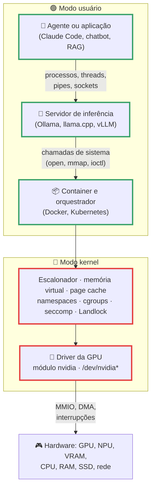
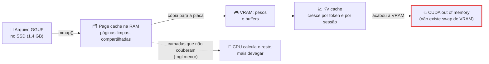
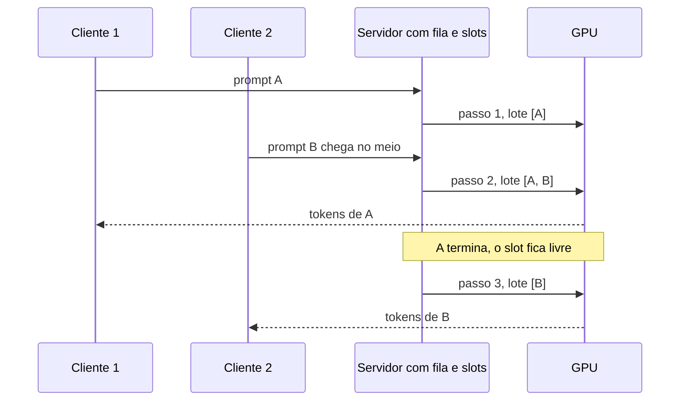
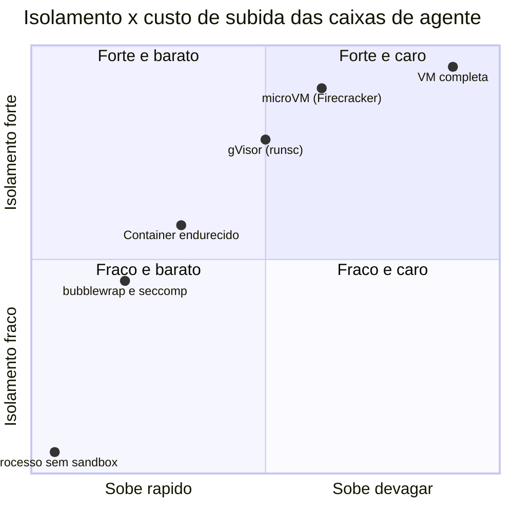

# Sistemas Operacionais na Era da IA

> [!quote] Tudo que parece "mágica de IA" é gerência de recurso
> *O vLLM, servidor de inferência usado por meio mundo, nasceu de uma ideia do capítulo de memória virtual: paginação. O artigo do SOSP 2023 diz com todas as letras que o PagedAttention é "inspirado em memória virtual e paginação", e essa cópia descarada rendeu de 2 a 4 vezes mais throughput. O llama.cpp carrega modelos de 5 GB com `mmap()`. O Ollama descarrega o modelo da GPU após 5 minutos parado, igual a um swap. Uma H100 é fatiada em até 7 GPUs virtuais pelo MIG. Não existe "stack de IA": existe sistema operacional, com nomes novos.*

> [!abstract] 🧭 O que você vai fazer nesta aula
> Achar o driver da sua GPU como módulo do kernel, ver a VRAM sendo disputada durante uma inferência de verdade, calcular por que um modelo de 8 bilhões de parâmetros não cabe em 8 GB, virar um servidor de inferência com fila e lote contínuo, entregar a GPU a um container, prender um agente de IA numa caixa que ele não arromba e terminar com três vagas de emprego abertas na tela, marcando quais requisitos são o que estudamos desde agosto.

---

## 1. 🧠 A tese: infraestrutura de IA é problema de SO

A disciplina desemboca aqui. "A IA está lenta", "o modelo não coube", "o agente apagou meu arquivo", "a GPU está ociosa": as quatro respostas estão em capítulos que já vimos.

Pense num restaurante. O modelo é a receita, a GPU é o fogão, a VRAM é a bancada. O SO é o maître e o chefe de cozinha juntos: decide quem entra, quem usa qual boca, por quanto tempo, o que fica na bancada e o que volta para a despensa. Nenhum prato sai porque a receita é boa; sai porque alguém gerenciou fogão, bancada e fila.



Cada degrau é uma unidade da disciplina:

| Degrau da pilha de IA | Unidade | Página |
|---|---|---|
| Agente executa um comando de shell | Processos, `fork`/`exec`, sinais | [[Processos]] |
| Servidor atende 20 clientes ao mesmo tempo | Threads, concorrência, GIL | [[Threads]] |
| Fila de requisições e lote contínuo | Escalonamento, latência × throughput | [[Escalonamento de Processos]] |
| Carregar 5 GB de pesos sem copiar tudo | `mmap`, page cache | [[Memória Virtual e Substituição de Páginas]] |
| KV cache que cresce por token | Alocação, fragmentação | [[Gerenciamento de Memória]] |
| Falar com a GPU | Chamadas de sistema, drivers, `ioctl` | [[Chamadas de Sistema]] |
| Empacotar o modelo e limitar recurso | Namespaces, cgroups | [[Containers e Virtualização]] |
| Impedir o agente de ler sua chave SSH | seccomp, LSM, menor privilégio | [[Segurança em Sistemas Operacionais]] |

> [!info] O número que resume a era
> Na lista TOP500 de junho de 2026, os 500 supercomputadores mais rápidos do mundo rodam Linux (assim desde novembro de 2017) e 276 deles usam aceleradores. O kernel Linux 7.2, de 16/08/2026, ganhou um **escalonador de GPU** com noção de justiça derivada do CFS, o mesmo algoritmo que divide CPU entre processos. A GPU virou recurso de primeira classe do SO, com fila e política, como a CPU é desde os anos 60.

---

## 2. 🎮 A GPU como recurso do sistema operacional

Uma GPU não é "acessada" pelo seu programa: é administrada pelo kernel, como o disco. O caminho é sempre **módulo do kernel** (driver) → **arquivo de dispositivo** em `/dev` → **biblioteca de espaço de usuário** (CUDA) → **seu processo**.

![[Recursos/Sistemas operacionais/Sistemas Operacionais na Era da IA/nvidia-h100.png|Quatro NVIDIA H100 no mesmo servidor: para o SO, cada uma é um dispositivo com fila, memória e política de acesso (Wikimedia Commons)]]

Estado real da GPU do servidor onde esta página foi escrita, uma RTX 2060 modesta, em 03/09/2026:

```console
$ lsmod | grep -E '^nvidia '
nvidia              104198144  49 nvidia_uvm,nvidia_modeset

$ cat /proc/driver/nvidia/version
NVRM version: NVIDIA UNIX x86_64 Kernel Module  580.173.02  Tue Jun 23 08:38:17 UTC 2026

$ ls -l /dev/nvidia*
crw-rw-rw- 1 root root 195,   0 /dev/nvidia0
crw-rw-rw- 1 root root 195, 255 /dev/nvidiactl
crw-rw-rw- 1 root root 507,   0 /dev/nvidia-uvm
```

Leia com olhos de aluno de SO: `nvidia` é um módulo de 104 MB carregado no kernel, com **49 referências ativas**; `/dev/nvidia0` é um **dispositivo de caractere** com major 195; `nvidia-uvm` é o módulo da memória unificada. É a anatomia de um driver de disco, só que a "impressora" custa o preço de um carro. E o módulo roda em modo kernel: um bug ali derruba a máquina, como o driver da CrowdStrike derrubou cerca de 8,5 milhões de Windows em 19/07/2024. Por isso a NVIDIA mantém módulos de kernel abertos (v610.57.04, GPUs Turing em diante) e o Linux ganhou o **Nova**, driver em Rust que, segundo a documentação do kernel, "pretende substituir o nouveau".

O `nvidia-smi` é a linha de comando sobre a biblioteca **NVML**, e não só consulta como altera o estado da GPU: `-L` lista GPUs com UUID (o identificador que Docker e Kubernetes usam), `-l 1` repete a cada segundo, `dmon` e `pmon` monitoram continuamente, e `--query-gpu=` e `--query-compute-apps=` saem em CSV. Saída real durante uma inferência do Ollama:

```console
$ nvidia-smi --query-compute-apps=pid,process_name,used_memory --format=csv
pid, process_name, used_gpu_memory [MiB]
54448, /usr/local/bin/ollama, 1980 MiB
```

Repare: **um PID**. O servidor de inferência é um processo comum do Linux, com RSS e threads, que abriu `/dev/nvidia0` e reservou 1980 MiB de VRAM. Você pode matá-lo com `kill`.

> [!example] 🧪 Atividade 1: Ache o driver da GPU e veja a VRAM ser disputada
> **Ferramenta:** dois terminais + [Ollama](https://ollama.com) com um modelo pequeno.
>
> 1. Ache o driver: `lsmod | grep -Ei 'nvidia|amdgpu|i915'`, `cat /proc/driver/nvidia/version`, `ls -l /dev/nvidia*`. Anote o número **major** e quantos módulos dependem de `nvidia`. Sem GPU dedicada: `lspci | grep -Ei 'vga|3d'` e `ls -l /dev/dri/`.
> 2. Terminal A: `watch -n 1 'nvidia-smi --query-gpu=memory.used,utilization.gpu --format=csv; nvidia-smi --query-compute-apps=pid,used_memory --format=csv'`. Terminal B: `ollama run qwen3:1.7b`, pedindo um texto de 500 palavras.
> 3. Anote três momentos: **antes** de carregar, **durante** a geração e **5 minutos depois** de parar (o Ollama descarrega por inatividade). Confirme com `ollama ps`.
>
> **Resultado esperado:** o major do dispositivo, o nome do módulo e uma tabela com VRAM e utilização nos três momentos, com o PID dono da memória, mais sua explicação de por que a VRAM cai sozinha após 5 minutos.
>
> 🪟 **No Windows:** `driverquery /v | findstr /i nvidia`; VRAM no Gerenciador de Tarefas (Desempenho → GPU) e `nvidia-smi.exe` em `C:\Windows\System32`. 🍎 **No macOS:** `system_profiler SPDisplaysDataType` e Monitor de Atividade, "Histórico da GPU" (Cmd+4). **Sem GPU:** rode igual, `ollama ps` mostra `100% CPU` e você observa a RAM no `htop`.

### 2.1 Dividir uma GPU: time-slicing, MPS e MIG

A analogia com CPU é literal. As três formas de compartilhar processador têm equivalente na GPU:

| Mecanismo | Como divide | Isolamento | Analogia |
|---|---|---|---|
| **Time-slicing** (padrão) | troca de contexto entre processos | nenhum | fatia de tempo do escalonador |
| **MPS** | kernels de processos diferentes rodam **sobrepostos** | fraco (memória não é particionada) | hyperthreading |
| **MIG** | particiona SMs **e** memória em instâncias | forte (falha em uma não afeta as outras) | cgroups |

Numa H100 de 80 GB os perfis MIG são `1g.10gb` (até 7 instâncias), `1g.20gb` (4), `2g.20gb` (3), `3g.40gb` (2) e `7g.80gb` (1). Os comandos são de administrador: `sudo nvidia-smi -i 0 -mig 1` liga o modo, `nvidia-smi mig -lgip` lista perfis, `sudo nvidia-smi mig -cgi 3g.20gb -C` cria instância, `-dgi` destrói. Detalhe de prova: **com MIG ligado e nenhuma instância criada, o CUDA simplesmente não roda**, o equivalente a ligar cgroups e esquecer de pôr o processo em um grupo. No MPS, a fatia por cliente sai de `CUDA_MPS_ACTIVE_THREAD_PERCENTAGE`, via `nvidia-cuda-mps-control`.

### 2.2 Levando a GPU para dentro de um container

Container é processo com namespaces e cgroups: não enxerga `/dev/nvidia0` por padrão, e não adianta copiar o driver para a imagem, porque **o driver mora no host** e o container compartilha o kernel dele. Quem resolve é o **NVIDIA Container Toolkit**, que injeta dispositivos e bibliotecas do host num hook do `runc`, antes de o processo começar.

![[Recursos/Sistemas operacionais/Sistemas Operacionais na Era da IA/nvidia-container-toolkit-arquitetura.png|O caminho real: docker chama nvidia-container-runtime, que chama runc, que dispara o hook prestart, que usa libnvidia-container para injetar dispositivos e bibliotecas (documentação NVIDIA)]]

```bash
sudo nvidia-ctk runtime configure --runtime=docker   # uma vez só
sudo systemctl restart docker
docker run --rm --gpus all ubuntu nvidia-smi
```

Dentro do container, `NVIDIA_VISIBLE_DEVICES` (`all`, `none`, `void`, índices ou UUIDs) e `NVIDIA_DRIVER_CAPABILITIES` (`compute`, `utility`, `graphics`, `video`, `all`) controlam o que aparece. Fora dele, `CUDA_VISIBLE_DEVICES` faz o mesmo papel, e o Ollama documenta que um ID inválido (`-1`) força CPU.

No Kubernetes o mesmo problema chama **device plugin**: a GPU vira o recurso `nvidia.com/gpu`, pedido como CPU e memória. Time-slicing é configurado por réplicas (10 réplicas em 8 GPUs anunciam 80 recursos) e MIG aparece como `nvidia.com/mig-1g.5gb`. Desde a versão 1.35 existe a **DRA** (Dynamic Resource Allocation) estável, com `ResourceClaim`, `DeviceClass` e `ResourceSlice`: reserva de dispositivo virou API de primeira classe (o Kubernetes está em 1.37.0 desde 26/08/2026).

> [!tip] E quem não é NVIDIA?
> **AMD:** ROCm (v7 é o exigido pelo Ollama), dispositivos `/dev/kfd` e `/dev/dri`, ferramenta `rocm-smi`. **Apple:** Metal sobre memória unificada, sem VRAM separada. **Genérico:** oneAPI e Vulkan compute. **NPU:** nos Copilot+ PCs, um terceiro processador (40+ TOPS) ao lado de CPU e GPU no Gerenciador de Tarefas. O Ubuntu 26.04 LTS (23/04/2026) já traz CUDA e ROCm nos repositórios.

> [!example] 🧪 Atividade 2: Entregue a GPU (ou a CPU) a um container
> **Ferramenta:** [Docker](https://docs.docker.com/engine/install/).
>
> 1. **Com GPU NVIDIA:** instale o toolkit, rode `sudo nvidia-ctk runtime configure --runtime=docker`, `sudo systemctl restart docker` e teste `docker run --rm --gpus all ubuntu nvidia-smi`.
> 2. Prove o que foi injetado: `docker run --rm --gpus all ubuntu bash -c 'ls /dev/nvidia*; ldconfig -p | grep -c libcuda'`. Compare **sem** a flag (`docker run --rm ubuntu ls /dev/nvidia*`) e copie a mensagem de erro exata.
> 3. **Sem GPU:** suba `docker run -d -v ollama:/root/.ollama -p 11434:11434 --name ollama ollama/ollama`, rode um modelo pequeno e limite o container com `docker update --memory 2g --cpus 1 ollama`, medindo antes e depois com `docker stats --no-stream`.
>
> **Resultado esperado:** duas saídas de terminal lado a lado (com e sem GPU, ou com e sem limite de cgroup) e uma frase dizendo qual componente do SO fez a diferença em cada caso.
>
> 🪟 **No Windows:** Docker Desktop com backend WSL2 repassa GPU NVIDIA aos containers Linux; sem GPU, a variante CPU funciona igual.

---

## 3. 🧮 Memória para modelos: a conta que decide tudo

O primeiro incidente de qualquer projeto de IA é sempre o mesmo: **o modelo não cabe**. E a conta é aritmética, não sorte.

Modelo é uma pilha de matrizes de números. Se cada número ocupa 16 bits (FP16), 8 bilhões de parâmetros dão 8 × 10⁹ × 2 bytes = 16 GB só de pesos. **Quantizar** é guardar cada número com menos bits: a qualidade cai um pouco, o tamanho despenca.

> [!info] A fórmula
> tamanho dos pesos ≈ (número de parâmetros × bits por peso) ÷ 8
>
> Para 8 bilhões: FP16 → 16 GB, INT8 → 8 GB, INT4 → 4 GB. O formato GGUF do llama.cpp aceita de 1,5 a 8 bits por peso, e os formatos "K" (como `Q4_K_M`) misturam precisões, ficando acima da conta ingênua.

Os arquivos reais do Llama 3.1 8B em GGUF confirmam: F32 tem 32,13 GB, Q8_0 tem 8,54 GB, Q5_K_M tem 5,73 GB, Q4_K_M tem 4,92 GB e Q2_K tem 3,18 GB. Por isso o Ollama entrega o `llama3.1` de 8 bilhões em 4,9 GB (Q4 por padrão), o de 70 bilhões em 43 GB e o de 405 bilhões em 243 GB.

### 3.1 Pesos são metade da história: o KV cache

Além dos pesos, que são fixos, existe o **KV cache**: a memória que guarda o que o modelo já leu para não recalcular a cada token. Ele cresce com o **contexto** e com o número de **conversas simultâneas**. É a parte dinâmica, e é ela que estoura. Medição real na mesma RTX 2060:

```console
$ ollama list
NAME          ID              SIZE      MODIFIED
qwen3:1.7b    8f68893c685c    1.4 GB    7 months ago

$ ollama ps
NAME          ID              SIZE      PROCESSOR    CONTEXT    UNTIL
qwen3:1.7b    8f68893c685c    2.3 GB    100% GPU     4096       About a minute from now
```

O arquivo tem **1,4 GB** no disco e ocupa **2,3 GB** na GPU. Os 900 MB de diferença são KV cache, buffers e overhead. Dobre o contexto ou abra quatro conversas em paralelo e esse pedaço dobra junto: o Ollama documenta que 4 requisições paralelas dobram o contexto reservado, e `OLLAMA_KV_CACHE_TYPE` permite quantizar o próprio cache (`f16`, `q8_0`, `q4_0`).



> [!warning] Por que "CUDA out of memory" mata o processo e falta de RAM nem sempre
> A RAM tem memória virtual: sob pressão o kernel manda páginas para o swap e só aciona o OOM killer no limite. A VRAM **não tem swap**: quando o alocador da GPU não acha espaço, a chamada falha e o processo aborta. Foi esse desperdício por fragmentação que o vLLM atacou com o PagedAttention, dividindo o KV cache em blocos de tamanho fixo (`BLOCK_SIZE` tokens), como páginas, em vez de exigir um bloco contínuo gigante por conversa.

### 3.2 VRAM, RAM e memória unificada

| Arranjo | Onde ficam os pesos | Custo de mover | Exemplo |
|---|---|---|---|
| **VRAM dedicada** | na placa | cópia pelo PCIe | RTX, H100 PCIe |
| **RAM do sistema** | na RAM, cálculo na CPU | nenhuma cópia, cálculo lento | llama.cpp sem `-ngl` |
| **Híbrido (offload)** | parte em cada uma | cópias constantes | `-ngl 20` no llama.cpp |
| **Memória unificada** | memória única, tabela de páginas compartilhada | quase zero | Apple M3 Ultra (até 512 GB), NVIDIA Grace Hopper (NVLink-C2C a 900 GB/s, 7x o PCIe Gen5) |

A memória unificada é [[Gerenciamento de Memória]] virando hardware: no Grace Hopper, CPU e GPU compartilham **uma tabela de páginas por processo**, e a GPU passa a sofrer page fault como qualquer cliente da MMU. Do lado da Apple, o Mac Studio M3 Ultra (05/03/2025) chega a 512 GB unificados com mais de 800 GB/s, o bastante para manter na memória um modelo de 600 bilhões de parâmetros.

Três truques de SO que todo runtime de LLM usa: **`mmap`** (o llama.cpp mapeia o GGUF em vez de lê-lo, padrão "auto"; as páginas ficam no page cache, limpas e compartilháveis, e `--mlock` prende-as na RAM com o `mlock()` que você estudou); **memória pinada** (com `cudaMallocHost` a página não pode ser trocada e o DMA vai direto: a própria NVIDIA mede 2,31 GB/s paginável contra 5,77 GB/s pinada); e **offload controlado** (`-ngl N` escolhe camadas na VRAM; o vLLM tem `--cpu-offload-gb`, padrão 0, e `--gpu-memory-utilization`, padrão 0,92, ou seja, reserva 92% da VRAM de saída).

> [!example] 🧪 Atividade 3: Meça o custo real de um modelo na memória
> **Ferramenta:** Ollama + `htop` (`sudo apt install htop`).
>
> 1. `ollama pull qwen3:1.7b` (ou `llama3.2:1b`) e veja o tamanho no disco com `ollama list`.
> 2. Ache o PID (`pgrep -a ollama`) e acompanhe com `htop -p <PID>` e `ps -o nlwp,rss,vsz -p <PID>` antes, durante e depois de uma geração.
> 3. Compare com `ollama ps` (SIZE e PROCESSOR) e, com GPU, com `nvidia-smi --query-compute-apps=pid,used_memory --format=csv`.
>
> **Resultado esperado:** tabela com quatro números (tamanho no disco, SIZE do `ollama ps`, RSS do processo, VRAM do processo) e a explicação de por que são **diferentes entre si**. Dica: `mmap` e page cache.
>
> 🪟 **No Windows:** Ollama nativo + Gerenciador de Tarefas (Detalhes → "Conjunto de trabalho" e "Threads") ou Process Explorer. No WSL2 o roteiro roda igual.

> [!example] 🧪 Atividade 4: Calcule a tabela de quantização e confira no arquivo real
> **Ferramenta:** planilha + [Hugging Face](https://huggingface.co) (busque por "GGUF").
>
> 1. Monte uma tabela 3 × 3: três modelos (1,7B, 8B e 70B parâmetros) por três quantizações (FP16, INT8, INT4), calculando cada célula com a fórmula e somando 20% para KV cache e buffers.
> 2. No Hugging Face, abra um repositório GGUF de um desses modelos e anote o tamanho **real** dos arquivos `Q8_0` e `Q4_K_M`.
> 3. Marque o que cabe na sua máquina, comparando com `nvidia-smi --query-gpu=memory.total --format=csv` e `free -h`.
>
> **Resultado esperado:** planilha preenchida, com a coluna "cabe aqui? (VRAM / RAM / não cabe)" e um parágrafo sobre a diferença entre o valor calculado e o arquivo real.
>
> 🪟 **No Windows:** `Get-CimInstance Win32_PhysicalMemory | Measure-Object Capacity -Sum` para a RAM; a VRAM está no Gerenciador de Tarefas.

---

## 4. 🧵 Servidores de inferência: concorrência aplicada

Um servidor de inferência é um exercício de [[Threads]] e [[Escalonamento de Processos]]: uma fila de pedidos, um recurso caro e indivisível (a GPU) e uma decisão constante entre **latência** (responder rápido a um) e **throughput** (atender muitos). A ideia que virou padrão é o **batching contínuo**: em vez de esperar juntar N pedidos, formar um lote novo a cada passo de geração, deixando pedidos entrarem e saírem no meio.



Os botões que controlam isso são, literalmente, botões de concorrência:

| Runtime | Botão | Efeito |
|---|---|---|
| `llama-server` | `-np N` / `--parallel N` | slots atendidos ao mesmo tempo |
| `llama-server` | `-t N` / `-c N` | threads de CPU / tamanho do contexto |
| Ollama | `OLLAMA_NUM_PARALLEL` (padrão 1) | requisições simultâneas por modelo |
| Ollama | `OLLAMA_MAX_LOADED_MODELS` (3 por GPU) | modelos residentes ao mesmo tempo |
| Ollama | `OLLAMA_MAX_QUEUE` (padrão 512) | fila antes de recusar pedidos |
| vLLM | `--max-num-seqs` | teto de sequências no lote |
| BLAS/OpenMP | `OMP_NUM_THREADS` | "número padrão de threads em regiões paralelas" |

> [!tip] O gargalo raramente é onde você acha
> Gerar tokens é limitado por **banda de memória**, não por poder de cálculo: a GPU passa a maior parte do tempo lendo pesos. Por isso aumentar o lote quase não aumenta o tempo por passo, e é isso que faz o batching contínuo compensar. Já `-t` maior que o número de núcleos físicos costuma **piorar** (mais troca de contexto, mesma banda). Meça, não chute.

Do lado do cliente, um servidor com centenas de conexões não usa uma thread por conexão: usa **I/O assíncrono** (o `asyncio` do Python existe para carga limitada por entrada e saída, não por CPU). Quando o trabalho é de CPU, entra o GIL: o Python 3.14 (07/10/2025) tornou o modo **free-threading** oficialmente suportado, com penalidade de 5% a 10% em código de uma thread só. É a mesma escolha entre threads, processos e eventos de [[Comunicação entre Processos]].

> [!example] 🧪 Atividade 5: Vire um servidor e escolha entre latência e throughput
> **Ferramenta:** Ollama + `curl` + `time`.
>
> 1. `sudo systemctl stop ollama` e, em outro terminal, `OLLAMA_NUM_PARALLEL=1 ollama serve`.
> 2. Dispare 4 requisições simultâneas e cronometre o total:
>    ```bash
>    time (for i in 1 2 3 4; do
>      curl -s http://localhost:11434/api/generate \
>        -d '{"model":"qwen3:1.7b","prompt":"explique paginacao em 100 palavras","stream":false}' \
>        -o /dev/null &
>    done; wait)
>    ```
> 3. Repita com `OLLAMA_NUM_PARALLEL=4 ollama serve`.
> 4. Em cada rodada anote `ollama ps` (SIZE e CONTEXT) e, com GPU, a VRAM em `nvidia-smi`.
>
> **Resultado esperado:** tabela com tempo total das 4 requisições e VRAM usada nas duas configurações, mais sua conclusão sobre qual serve a um chat de uma pessoa e qual serve a uma API com 50 usuários, e o que se paga em memória por isso.
>
> 🪟 **No Windows:** `$env:OLLAMA_NUM_PARALLEL=4; ollama serve` no PowerShell e `Measure-Command` no lugar do `time`. No WSL2, roteiro idêntico.

---

## 5. 📦 Containers e MLOps

"Na minha máquina funciona" é problema de SO, e a resposta é a de [[Containers e Virtualização]]: empacotar o processo com seu sistema de arquivos, seus namespaces e seus limites de cgroup. Em IA isso é mais crítico, porque a pilha é frágil: driver, CUDA, PyTorch e modelo precisam combinar. O container congela três dessas quatro; a quarta (o driver) fica no host e é injetada pelo toolkit da seção 2. No Compose a GPU é pedida como recurso reservado, em `deploy.resources.reservations.devices`, com `driver: nvidia`, `count: all` e `capabilities: ["gpu"]`.

O trabalho de **MLOps** é exatamente isto: manter imagens que combinam driver, runtime e modelo; declarar limites (`--memory`, `--cpus`, `--pids-limit`) para um treino maluco não derrubar o host; publicar no Kubernetes pedindo `nvidia.com/gpu`; observar fila, latência e VRAM. O relatório DORA 2025 (23/09/2025, cerca de 5.000 respondentes) mostra o tamanho disso: 90% usam IA no trabalho, mais de 80% relatam ganho de produtividade, **30% confiam pouco ou nada no código gerado** e 90% das organizações já têm plataforma interna. Alguém constrói e opera essa plataforma. É a vaga.

---

## 6. 🤖 Agentes que operam o sistema operacional

Aqui a disciplina encontra a novidade mais desconfortável de 2025-2026: programas que **decidem sozinhos** quais comandos executar na sua máquina. Um agente de código roda `bash`, edita arquivos, instala pacotes, abre conexões. Um agente de *computer use* controla teclado e mouse numa tela. O conjunto de ferramentas de computer use da Anthropic (`computer_toolset_20260801`, 17 ferramentas) vem com recomendação explícita na documentação: rodar em **VM ou container dedicado**, com lista de domínios permitidos e confirmação humana para ações relevantes. O ambiente de referência é um container Docker com Xvfb e Mutter, ou seja, um desktop inteiro descartável.

> [!danger] O que dá errado, em linguagem de SO
> - **Prompt injection:** o agente lê uma página, um issue ou um texto na tela com instruções e obedece. A documentação de computer use declara o risco de injeção **pela tela**. É confiança em entrada, agravada porque essa entrada tem o privilégio do usuário.
> - **Autoridade excessiva:** sem sandbox, o agente herda **todas** as suas permissões. A documentação do OpenHands diz que, sem sandbox, o agente tem "full access to your filesystem".
> - **Fuga pelo socket:** expor `/var/run/docker.sock` ao agente, segundo a documentação do Claude Code, "efetivamente concede acesso ao host": quem fala com o daemon do Docker cria um container privilegiado e sai da caixa.
> - **Proxy que não vê TLS:** a mesma documentação avisa que o proxy não inspeciona TLS, deixando espaço para domain fronting. Filtro de domínio não é firewall de conteúdo.

Nada do que existe para isolar agente foi inventado para IA. É [[Segurança em Sistemas Operacionais]] e [[Containers e Virtualização]] remontados:

| Sandbox | Sistema de arquivos | Rede | Chamadas de sistema | Extra |
|---|---|---|---|---|
| **Claude Code `/sandbox`** (Linux/WSL2) | `bubblewrap` (user e mount namespaces) | network namespace e proxy com allowlist (nenhum domínio liberado por padrão) | **seccomp BPF** opcional | escrita só no diretório de trabalho e temp; `~/.ssh` e `~/.aws/credentials` negados na leitura |
| **Claude Code** (macOS) | Seatbelt via `sandbox-exec` | proxy com allowlist | perfil Seatbelt | mesmo comando `/sandbox` |
| **OpenAI Codex** | `bwrap` (Linux), Seatbelt (macOS), sandbox nativa (Windows) | **desligada por padrão** em `workspace-write` | seccomp | modos `read-only`, `workspace-write`, `danger-full-access` |
| **Gemini CLI** | container ou `sandbox-exec` | conforme o runtime | conforme o runtime | `GEMINI_SANDBOX=docker\|podman\|runsc\|lxc` |
| **Docker endurecido** | mount namespace e overlayfs | network namespace | perfil seccomp padrão e capabilities | cgroups (memória, CPU, PIDs) |
| **gVisor (`runsc`)** | Gofer, processo separado | pilha de rede em espaço de usuário | **Sentry**, kernel de aplicação em Go, intercepta tudo | o container nunca fala direto com o kernel real |
| **Firecracker / Docker Sandboxes** | disco virtual | interface virtual | KVM: o hóspede tem kernel próprio | microVM, e o `jailer` ainda aplica cgroups e namespaces |

![[Recursos/Sistemas operacionais/Sistemas Operacionais na Era da IA/firecracker-integracao-host.png|Firecracker: cada agente ganha uma microVM sobre KVM, com dispositivos de bloco e rede virtuais e um orquestrador no espaço de usuário do host (documentação do projeto)]]

O **Firecracker** é o extremo bem resolvido dessa escala: microVM sobre KVM que sobe em menos de 125 ms, com menos de 5 MiB de overhead, capaz de criar 150 microVMs por segundo por host, com apenas 5 dispositivos emulados, escrita em Rust. É o que roda o AWS Lambda (mais de 15 trilhões de invocações por mês) e é a base da E2B, plataforma de sandbox para agentes, onde pausar uma sandbox salva o sistema de arquivos **e a memória**.



> [!success] Sandbox não é só segurança, é conforto
> A Anthropic reporta que o uso de sandbox **reduz em 84% os pedidos de permissão** ao usuário, e afirma que isolamento eficaz exige tanto sistema de arquivos quanto rede. Faz sentido: se o agente não pode causar dano, não precisa pedir licença o tempo todo. E se ele pode falar com a internet, pode exfiltrar o que leu mesmo sem escrever nada. As duas travas andam juntas. Nenhuma delas, porém, substitui o **humano no circuito**: o Codex expõe `approval_policy` (`untrusted`, `on-request`, `never`) separado do `sandbox_mode`, ou seja, "o que ele pode fazer" e "o que ele precisa perguntar" são eixos independentes. É a separação entre **mecanismo** e **política** que Tanenbaum repete o livro inteiro.

> [!example] 🧪 Atividade 6: Prenda um agente numa caixa e registre o que quebrou
> **Ferramenta:** Docker + um script "agente" (o Ollama gerando comandos, ou você digitando os comandos que um agente tentaria).
>
> 1. Suba a caixa mais fechada que o Docker permite:
>    ```bash
>    docker run --rm -it --network none --read-only \
>      --pids-limit 64 --memory 512m --cpus 1 \
>      --cap-drop ALL --security-opt no-new-privileges \
>      --user 1000:1000 -v "$PWD/trabalho:/trabalho" ubuntu bash
>    ```
> 2. Lá dentro, tente as **seis ações proibidas** e copie o erro **exato**: (a) `curl https://example.com`; (b) `touch /etc/teste`; (c) `cat /root/.ssh/id_rsa`; (d) `ping 8.8.8.8`; (e) `for i in $(seq 1 200); do sleep 60 & done`; (f) `apt-get update`.
> 3. Repita (a) sem `--network none` e (b) sem `--read-only`, para ver a diferença.
> 4. Monte a tabela **ação × flag que barrou × mensagem de erro × mecanismo do SO** (namespace de rede, sistema de arquivos somente leitura, cgroup de PIDs, capabilities).
>
> **Resultado esperado:** tabela de 6 linhas com mensagens de erro reais copiadas do terminal e uma frase por linha dizendo qual mecanismo do kernel produziu aquele erro.
>
> 🪟 **No Windows:** Docker Desktop com WSL2 roda o comando sem alteração (use `${PWD}` no PowerShell). Sem Docker, use [Play with Docker](https://labs.play-with-docker.com/) ou [Killercoda](https://killercoda.com/).

> [!example] 🧪 Atividade 7: Descubra de que material é feita a caixa do seu agente
> **Ferramenta:** documentação de sandbox do [Claude Code](https://code.claude.com/docs/en/sandboxing) ou do [Codex](https://learn.chatgpt.com/docs/sandboxing) + `bubblewrap` (`sudo apt install bubblewrap`).
>
> 1. Leia a página e liste os **mecanismos de SO** citados por nome (namespaces, seccomp, LSM, proxy, perfil Seatbelt).
> 2. Rode o mecanismo na mão, sem agente nenhum:
>    ```bash
>    bwrap --ro-bind /usr /usr --ro-bind /lib /lib --ro-bind /lib64 /lib64 \
>      --proc /proc --dev /dev --unshare-pid --unshare-net --new-session /bin/bash
>    ```
> 3. Lá dentro tente `curl example.com`, `cat ~/.ssh/id_rsa` e `ps aux` (repare como o `ps` mostra pouquíssimos processos: outro namespace de PID).
> 4. Veja o kernel matar um processo por chamada de sistema proibida: `systemd-run --user --pty --property=SystemCallFilter=~openat ls /`.
>
> **Resultado esperado:** lista de 4 a 6 mecanismos citados na documentação, cada um com a **evidência prática** correspondente e o sinal recebido pelo processo morto (dica: `SIGSYS`).
>
> 🪟 **No Windows:** a sandbox do Claude Code não roda em Windows nativo nem em WSL1; use WSL2 (no Ubuntu 24.04+ é preciso liberar o perfil AppArmor para o `bwrap` criar user namespaces). O Codex tem sandbox nativa no Windows: compare os mecanismos com os do Linux.

---

## 7. 🖥️ IA embutida no sistema operacional

**Windows.** Em 16/10/2025 a Microsoft publicou os princípios de segurança para agentes: **conta de agente distinta** da do usuário, privilégios limitados e "confiança operacional", com o risco de cross-prompt injection declarado no próprio texto. O **agent workspace** é um ambiente contido, com desktop próprio e isolamento em tempo de execução. Na build Insider 26220.7262 (17/11/2025) isso virou Configurações → Sistema → Componentes de IA → Recursos agênticos experimentais: só administrador liga, e o agente ganha acesso a Documentos, Downloads, Área de Trabalho, Vídeos, Imagens e Músicas. Em 05/12/2025 (build 26220.7344) veio o **registro nativo de MCP** no dispositivo, com conectores para o Explorador de Arquivos e para as Configurações, cada um contido, com identidade e trilha de auditoria próprias. No Build 2026 (2 a 5/06/2026) vieram Coreutils for Windows em GA, WSL Containers em preview e os **Execution Containers** (isolamento por processo, sessão e hardware), com Entra Agent ID para identidade de agente.

> [!warning] "Agentic OS" é termo de imprensa
> As páginas oficiais da Microsoft dizem "agentic features"; "sistema operacional agêntico" veio da cobertura do Build 2026. O que existe hoje, documentado, é **um conjunto de recursos de isolamento e identidade para agentes**, não um SO novo. Cuidado ao repetir manchete em prova.

**Recall e privacidade.** O melhor exemplo de que privacidade é função do SO. Anunciado em 20/05/2024 e adiado em 07/06/2024 após a reação pública, foi **rearquitetado** em 27/09/2024 com snapshots e índice vetorial processados num enclave VBS (isolamento por virtualização), chaves no TPM e acesso só com Windows Hello; chegou ao público geral em 25/04/2025. Tudo que o consertou são mecanismos clássicos de SO.

**Apple e Android.** O Apple Intelligence roda local e, quando precisa de mais, vai para o **Private Cloud Compute** (10/06/2024): SO endurecido derivado do iOS e do macOS, **sem shell remoto**, com computação sem estado, chaves rotacionadas a cada boot e imagens publicadas para auditoria independente. A Siri avançada do macOS 27 (08/06/2026) exige chip M3 ou superior com 12 GB de RAM, gerência de memória disfarçada de requisito de marketing. O Android 17 (16/06/2026) roda o Gemini Nano multimodal no serviço isolado **AICore**, e desde o Android 16 há um terminal Linux numa VM, pelo Android Virtualization Framework.

![[Recursos/Sistemas operacionais/Sistemas Operacionais na Era da IA/gerenciador-tarefas-npu.png|A NPU ao lado de CPU, Memória, Disco e GPU no Gerenciador de Tarefas do Windows: um novo tipo de processador virou recurso monitorado pelo SO (documentação Microsoft)]]

**A NPU como terceiro processador.** Nos Copilot+ PCs (desde 20/05/2024) existe uma **Neural Processing Unit** de 40 ou mais TOPS, em chips Snapdragon X, Intel Core Ultra 200V e AMD Ryzen AI 300. Ela aparece no Gerenciador de Tarefas ao lado de CPU e GPU, tem driver, versão e memória compartilhada, e é programada pelo Windows ML sobre o ONNX Runtime. Para nós é mais um dispositivo a escalonar, com uma peculiaridade: os modelos precisam ser **quantizados para INT8**, porque a NPU faz aritmética inteira em baixa precisão. Ou seja, esta seção volta para a seção 3.

> [!example] 🧪 Atividade 8: Ache a NPU (ou prove que ela não existe na sua máquina)
> **Ferramenta:** Windows 11 + Gerenciador de Tarefas.
>
> 1. Ctrl+Shift+Esc → aba **Desempenho**. Procure "NPU 0" abaixo de GPU.
> 2. Se existir: anote fabricante, versão do driver, "Memória compartilhada" e a utilização em repouso; depois abra um recurso de IA local (efeitos de câmera do Windows Studio) e veja a curva subir.
> 3. Se não existir: prove pelo PowerShell que não é um Copilot+ PC (`Get-PnpDevice -Class ComputeAccelerator` sem resultado, `Get-ComputerInfo -Property CsProcessors`) e confira o requisito de 40+ TOPS na documentação.
> 4. No Linux, faça o equivalente para a GPU: `nvidia-smi -q -d UTILIZATION | head -20` ou `cat /sys/class/drm/card0/device/gpu_busy_percent`.
>
> **Resultado esperado:** captura de tela (ou saída do PowerShell) mostrando se há NPU, com fabricante e driver, e uma frase explicando por que o SO precisa expor esse dispositivo separadamente em vez de tratá-lo como "mais uma GPU".

---

## 🪟 E no Windows? (resumo prático)

| Tarefa desta aula | Linux | Windows |
|---|---|---|
| Ver GPU e VRAM | `nvidia-smi` | Gerenciador de Tarefas → Desempenho → GPU; `nvidia-smi.exe` |
| Ver a NPU | sem equivalente padrão | Gerenciador de Tarefas → Desempenho → NPU 0 |
| Driver como módulo | `lsmod`, `/proc/driver/nvidia/version` | `driverquery /v`, `Get-PnpDevice -Class Display` |
| Rodar modelo local | Ollama, llama.cpp, vLLM | Ollama nativo, ou tudo isso no WSL2 |
| GPU em container | NVIDIA Container Toolkit | Docker Desktop com backend WSL2 |
| Sandbox de agente | bubblewrap, seccomp, Landlock, gVisor | sandbox nativa do Codex, Execution Containers, WSL2 |

Desde 19/05/2025 o WSL é **open source** (o `wsl.exe`, o serviço e o init), embora `lxcore.sys` e `p9rdr.sys` sigam fechados. E o WSL2 roda um kernel Linux de verdade numa VM leve: praticamente tudo desta página funciona no notebook Windows da sala.

---

## 8. 💼 Mercado: quem paga por isso

Esta aula não é futurologia, é descrição de vaga.

| Cargo | Brasil (Glassdoor BR, mensal, P25 a P75) | EUA (Glassdoor US, anual) |
|---|---|---|
| SRE/DevOps Engineer | R\$ 10.438 (8.191 a 16.250), 817 salários, jun/2026 | US\$ 162.440 |
| DevOps Engineer | R\$ 9.091 (6.281 a 13.417), mar/2026 | US\$ 145.296 |
| DevOps Engineer sênior | R\$ 13.750 (10.656 a 17.083), jul/2026 | US\$ 182.379 |
| Engenheiro de Plataforma | R\$ 10.679 (5.750 a 12.750), jun/2026 | US\$ 128 mil a 205 mil (base) |
| MLOps Engineer | sem dado público | US\$ 161.411 |

O que os anúncios reais pediam em 2026:

| Empresa e cargo | Requisitos de SO no anúncio |
|---|---|
| credsystem, Especialista de SRE | "Conhecimento de sistemas operacionais Linux", Docker, Kubernetes, Prometheus, SLIs/SLAs/SLOs, troubleshooting |
| C6 Bank, SRE | "Conhecer os Sistemas Operacionais Windows e Linux", AWS, Kubernetes, Terraform, Grafana, Zabbix |
| SESC SP, Eng. de Plataforma, R\$ 15.683,00 | "Conhecimentos avançados de Linux", Kubernetes em produção, Docker, Ansible/Bash/Python; desejável CKA e **GPU computing** |
| Grupo GBI, Cloud e IA (MLOps) | Docker, Kubernetes, infraestrutura como código, Python obrigatório, deploy de modelos |
| Unimed do Brasil, DevOps Sênior | "infraestrutura e sistemas operacionais Linux e Windows", Docker, Kubernetes, Zabbix/Grafana |

O padrão se repete: **Linux + containers + Kubernetes + observabilidade** em todas. É a nossa ementa com nome comercial.

**Certificações** (preços oficiais): LFCS e CKA custam US\$ 445 cada, ambas com 2 horas de prova **prática** e validade de 2 anos; LPIC-1 são duas provas de US\$ 200 (90 min, 60 questões cada, versão 5.0, validade 5 anos); há ainda a CompTIA Linux+ XK0-006 (lançada em 15/07/2025) e a RHCSA EX200, também prática.

**Concursos** cobram o que estudamos: o CNU 2025 (CPNU 2, banca FGV), Bloco 3, pede "sistemas operacionais (Linux, Windows, virtualização)"; a INFRA S.A. 2025 (Cebraspe) lista "Gerenciamento de memória, processos e Linux"; a EMBRAPA cobra "gerenciamento de processos, escalonamento do processador"; a UFRJ (Edital 1.188/2025, SELECON) pede "Ambientes operacionais: utilização básica dos sistemas operacionais Windows 10, 11 e Linux".

E a lacuna é real: o relatório *2025 State of Tech Talent* da Linux Foundation (jun/2025, mais de 500 líderes) aponta que **68% das organizações não têm gente com habilidades de IA/ML**, 65% relatam lacuna em cibersegurança e 61% em FinOps.

> [!example] 🧪 Atividade 9: Abra três vagas reais e marque o que é matéria desta disciplina
> **Ferramenta:** [LinkedIn Jobs](https://www.linkedin.com/jobs/), [Gupy](https://portal.gupy.io/) ou [Glassdoor BR](https://www.glassdoor.com.br/).
>
> 1. Busque "SRE", "Platform Engineer" e "MLOps" no Brasil; abra uma vaga de cada e **copie URL e data**.
> 2. Monte uma planilha com uma linha por vaga e uma coluna por tópico: processos, threads, escalonamento, memória, sistema de arquivos, containers, virtualização, shell, systemd, observabilidade, isolamento, GPU.
> 3. Marque 1 quando o tópico aparece, mesmo com outro nome ("troubleshooting de performance" conta como escalonamento e memória), e 0 quando não aparece.
> 4. Some as colunas e responda: qual tópico aparece nas três vagas e qual não apareceu em nenhuma. Repita com **um edital de concurso** recente de analista de TI e compare vaga com edital.
>
> **Resultado esperado:** planilha com 4 linhas (3 vagas e 1 edital), URLs e datas verificáveis, totais por coluna e um parágrafo de conclusão. É o embrião do trabalho de análise de mercado em [[Possíveis trabalhos e projetos de Sistemas Operacionais]].

---

## ❓ Quiz rápido

> [!question]- 1. O vLLM chama sua técnica principal de PagedAttention. Qual conceito de SO ela copia, e qual problema resolve?
> **Resposta:** paginação da memória virtual. O KV cache de cada conversa era um bloco contínuo dimensionado para o pior caso, desperdiçando VRAM por fragmentação. Dividido em blocos de tamanho fixo (`BLOCK_SIZE` tokens), com tabela de blocos lógicos para físicos, o desperdício cai para quase zero e o throughput sobe de 2 a 4 vezes (SOSP 2023).

> [!question]- 2. Um colega diz: "vou copiar o driver da NVIDIA para dentro da imagem Docker, aí o container enxerga a GPU". Por que não funciona?
> **Resposta:** o driver é **módulo do kernel**, e o container compartilha o kernel do host: não existe "kernel do container" para carregar módulo. O Container Toolkit faz o oposto, mantendo o driver no host e **injetando**, num hook `prestart` do `runc`, os dispositivos (`/dev/nvidia*`) e as bibliotecas compatíveis.

> [!question]- 3. Um modelo de 8 bilhões de parâmetros em FP16 tem cerca de 16 GB de pesos e você tem 8 GB de VRAM. Cite duas saídas tecnicamente diferentes e o custo de cada uma.
> **Resposta:** (a) **quantizar** para 4 bits (o `Q4_K_M` do Llama 3.1 8B ocupa 4,92 GB), custo: pequena perda de qualidade; (b) **offload híbrido**, com parte das camadas na GPU (`-ngl N`) e o resto na CPU, custo: muito mais lento por causa das cópias pelo PCIe. Terceira saída: reduzir o contexto ou quantizar o KV cache (`OLLAMA_KV_CACHE_TYPE=q8_0`), atacando a parte dinâmica.

> [!question]- 4. Por que "CUDA out of memory" costuma matar o processo, enquanto falta de RAM no Linux muitas vezes só deixa o sistema lento?
> **Resposta:** a RAM tem swap: sob pressão o kernel move páginas para o disco e só aciona o OOM killer no limite. A VRAM não tem swap; quando o alocador não encontra espaço, a chamada falha e o programa aborta. É a diferença entre um recurso com hierarquia de armazenamento atrás e um recurso com teto rígido.

> [!question]- 5. Você vai rodar um agente de código na sua máquina. Por que isolar apenas o sistema de arquivos não basta?
> **Resposta:** com rede liberada o agente pode **exfiltrar** o que leu (chaves, código, dados) sem escrever um byte, e pode baixar código novo para executar. A documentação do Claude Code afirma que isolamento eficaz exige sistema de arquivos **e** rede, com allowlist de domínios. E ainda há limites conhecidos: o proxy não inspeciona TLS, e expor `/var/run/docker.sock` concede acesso ao host.

---

## 🔗 Veja também

- [[Memória Virtual e Substituição de Páginas]] e [[Gerenciamento de Memória]]: a paginação que o PagedAttention copiou, o `mmap` que carrega os pesos e a conta que decide se o modelo cabe.
- [[Threads]] e [[Escalonamento de Processos]]: slots, filas, batching contínuo, latência contra throughput.
- [[Containers e Virtualização]]: namespaces, cgroups, gVisor e microVMs, o material das sandboxes de agente.
- [[Segurança em Sistemas Operacionais]] (**aula anterior**): seccomp, capabilities, Landlock e menor privilégio aplicados a um programa que decide sozinho o que executar.
- [[Linux na prática]]: os comandos de observação das atividades. [[Materiais, cursos e certificações de SO]]: onde estudar para LFCS, CKA e concursos.
- [[Desenvolvimento de Software com IA]] e [[Vibe Coding e Engenharia Agêntica]]: o lado do desenvolvedor da mesma história.
- ➡️ **Próxima aula:** [[Possíveis trabalhos e projetos de Sistemas Operacionais]]

---

> [!note] 📚 Fontes (2025-2026, visitadas em 02 e 03/09/2026)
> - **GPU:** [nvidia-smi e NVML](https://developer.nvidia.com/system-management-interface) · [perfis MIG](https://docs.nvidia.com/datacenter/tesla/mig-user-guide/supported-mig-profiles.html) · [MPS](https://docs.nvidia.com/deploy/mps/index.html) · [Container Toolkit](https://docs.nvidia.com/datacenter/cloud-native/container-toolkit/latest/arch-overview.html) · [Kubernetes DRA](https://kubernetes.io/docs/concepts/scheduling-eviction/dynamic-resource-allocation/) · [Linux 7.2](https://kernelnewbies.org/Linux_7.2) · [TOP500 jun/2026](https://top500.org/lists/top500/2026/06/)
> - **Memória e inferência:** [PagedAttention (SOSP 2023)](https://arxiv.org/abs/2309.06180) · [vLLM engine args](https://docs.vllm.ai/en/latest/configuration/engine_args.html) · [llama-server](https://github.com/ggml-org/llama.cpp/blob/master/tools/server/README.md) · [FAQ do Ollama](https://docs.ollama.com/faq) · [memória pinada em CUDA](https://developer.nvidia.com/blog/how-optimize-data-transfers-cuda-cc/) · [Grace Hopper](https://www.nvidia.com/en-us/data-center/grace-hopper-superchip/) · [Mac Studio M3 Ultra](https://www.apple.com/newsroom/2025/03/apple-unveils-new-mac-studio-the-most-powerful-mac-ever/) · [OMP_NUM_THREADS](https://gcc.gnu.org/onlinedocs/libgomp/OMP_005fNUM_005fTHREADS.html)
> - **Agentes e sandbox:** [Claude Code](https://code.claude.com/docs/en/sandboxing) · [Codex](https://learn.chatgpt.com/docs/sandboxing) · [bubblewrap](https://github.com/containers/bubblewrap) · [seccomp BPF](https://docs.kernel.org/userspace-api/seccomp_filter.html) · [Landlock](https://docs.kernel.org/userspace-api/landlock.html) · [gVisor](https://gvisor.dev/docs/) · [Firecracker](https://firecracker-microvm.github.io/) · [computer use](https://platform.claude.com/docs/en/agents-and-tools/tool-use/computer-use-tool)
> - **IA no SO:** [agentes no Windows](https://blogs.windows.com/windowsexperience/2025/10/16/securing-ai-agents-on-windows/) · [recursos agênticos experimentais](https://support.microsoft.com/en-us/windows/experimental-agentic-features-a25ede8a-e4c2-4841-85a8-44839191dfb3) · [Build 2026](https://developer.microsoft.com/blog/build-recap/) · [Copilot+ PC e NPU](https://learn.microsoft.com/en-us/windows/ai/npu-devices/) · [Recall](https://blogs.windows.com/windowsexperience/2024/09/27/update-on-recall-security-and-privacy-architecture/) · [WSL open source](https://blogs.windows.com/windowsdeveloper/2025/05/19/the-windows-subsystem-for-linux-is-now-open-source/) · [Private Cloud Compute](https://security.apple.com/blog/private-cloud-compute/)
> - **Mercado:** [Glassdoor BR](https://www.glassdoor.com.br/Sal%C3%A1rios/sre-devops-engineer-sal%C3%A1rio-SRCH_KO0,19.htm) · [Glassdoor US](https://www.glassdoor.com/Salaries/mlops-engineer-salary-SRCH_KO0,14.htm) · [Linux Foundation 2025](https://www.linuxfoundation.org/research/open-source-jobs-report-2025) · [DORA 2025](https://cloud.google.com/blog/products/ai-machine-learning/announcing-the-2025-dora-report) · [LFCS](https://training.linuxfoundation.org/certification/linux-foundation-certified-sysadmin-lfcs/) · [CKA](https://training.linuxfoundation.org/certification/certified-kubernetes-administrator-cka/) · [LPIC-1](https://www.lpi.org/our-certifications/lpic-1-overview/)
> - **Livros:** Tanenbaum e Bos, *Sistemas Operacionais Modernos* (4ª ed.), caps. 2, 3 e 10; [OSTEP](https://pages.cs.wisc.edu/~remzi/OSTEP/); Maziero, *Sistemas Operacionais: Conceitos e Mecanismos*.
> - **Imagens:** [NVIDIA H100 (Wikimedia Commons)](https://commons.wikimedia.org/wiki/File:NVIDIA_H100_(%E6%9E%81%E5%AE%A2%E6%B9%BEGeekerwan)_023.png) · [Container Toolkit (NVIDIA)](https://docs.nvidia.com/datacenter/cloud-native/container-toolkit/latest/arch-overview.html) · [Firecracker (GitHub)](https://github.com/firecracker-microvm/firecracker/blob/main/docs/images/firecracker_host_integration.png) · [NPU no Gerenciador de Tarefas (Microsoft Learn)](https://learn.microsoft.com/en-us/windows/ai/npu-devices/)
