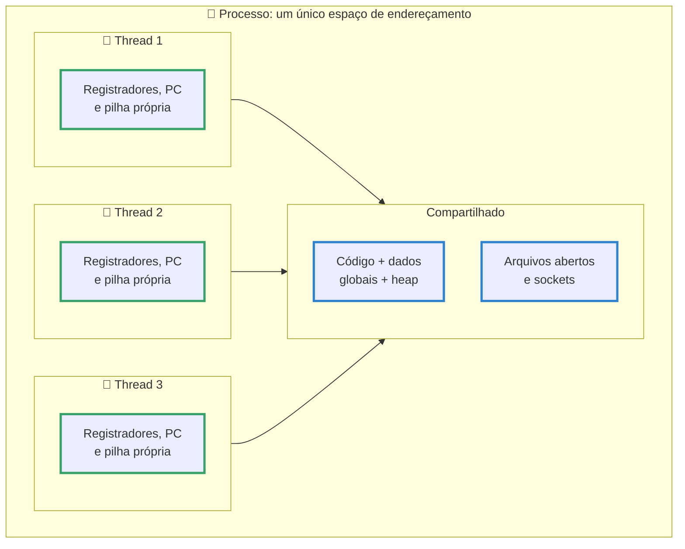
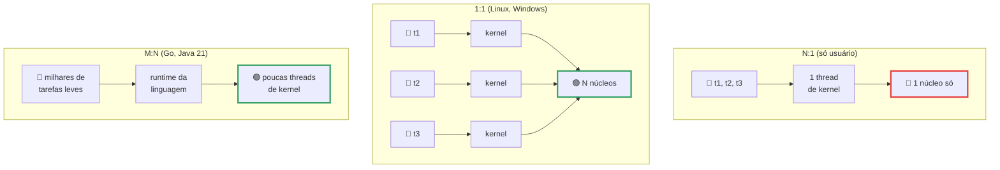

# Threads

> [!quote] Um processo, muitas linhas de execução
> *Em 2 de setembro de 2026, no notebook do professor, o mesmo programa Python contando primos até 2 milhões levou 5,66 s em linha reta, 5,66 s com 4 threads (ganho zero) e 2,02 s com as mesmas 4 threads em outro interpretador. A diferença não estava no algoritmo, no processador nem no sistema operacional: estava em um cadeado dentro do interpretador que o Python 3.14 finalmente tornou opcional.*

> [!abstract] 🧭 O que você vai fazer nesta aula
> Contar as threads dos processos que já rodam na sua máquina, criar threads em C e ver o `clone3` que o kernel executa por baixo, medir por que threads não aceleram cálculo em Python (e aceleram no build free-threaded), comparar threads com `asyncio`, medir quanto custa manter 1.000 unidades de concorrência vivas e descobrir por que `OMP_NUM_THREADS` decide o desempenho de um servidor de IA. Anterior: [[Processos]].

---

## 1. 🧵 Um processo, várias linhas de execução

Na aula de [[Processos]], o processo apareceu como duas coisas coladas: um **espaço de endereçamento** (código, dados, heap, arquivos abertos) e uma **linha de execução** (contador de programa, registradores, pilha). A thread é o resultado de separar as duas: **vários fluxos de execução dentro do mesmo espaço de endereçamento**.

A analogia é a cozinha de um restaurante. O processo é a cozinha: bancada, geladeira, fogão. Cada thread é um cozinheiro, com as próprias mãos e a própria receita aberta na página em que parou, mas todos usam a mesma geladeira. Contratar cozinheiro é barato (não precisa alugar outra cozinha); em compensação, se dois pegarem o mesmo ovo ao mesmo tempo, dá briga. Esse "dá briga" é a condição de corrida da seção 7.

![[Recursos/Sistemas operacionais/Threads/programa-processo-thread.png|Do arquivo no disco até a CPU: o programa é instanciado como processo na memória, e cada processo carrega uma ou mais threads, que são o que o escalonador realmente coloca na CPU (Wikimedia Commons)]]

| Recurso | Compartilhado pelas threads | Privado de cada thread |
|---|---|---|
| Código, dados globais, heap (`malloc`) | ✅ | |
| Tabela de descritores de arquivo e sockets | ✅ | |
| PID, usuário, diretório atual, ambiente, namespaces, cgroups | ✅ | |
| Contador de programa e demais registradores | | ✅ |
| **Pilha** (variáveis locais, endereços de retorno) | | ✅ |
| TID, `errno`, máscara de sinais, TLS (thread-local storage) | | ✅ |



![[Recursos/Sistemas operacionais/Threads/processo-multithread.png|Duas threads executando dentro do mesmo processo ao longo do tempo, sem sair do mesmo espaço de endereçamento (Wikimedia Commons)]]

**Por que não usar só processos?** **Responsividade** (uma thread trava esperando o disco, as outras seguem, e por isso o seu editor não congela ao salvar), **paralelismo real** (em 6 núcleos, 6 threads do mesmo processo rodam ao mesmo tempo), **custo** (criar thread não copia tabela de páginas: o `clone` só aponta para o mesmo `mm`) e **compartilhamento grátis** (duas threads leem a mesma variável global; dois processos precisariam de [[Comunicação entre Processos]]).

Tanenbaum resume no exemplo do **servidor web**: uma thread **despachante** recebe conexões e entrega cada uma a uma thread **trabalhadora**; enquanto uma trabalhadora bloqueia esperando o disco, o despachante já aceitou outras dez. Sem threads, o servidor viraria uma máquina de estados escrita à mão, que é o que o `asyncio` da seção 5 faz por você.

> [!example] 🧪 Atividade 1: Conte as threads dos processos que já estão rodando
> **Ferramenta:** terminal Linux (WSL2, VM ou nativo) com `ps`, `htop` e o `/proc`.
>
> 1. Ranking por número de threads (`NLWP` = "number of light-weight processes", como o `ps` chama thread): `ps -eo pid,nlwp,comm --sort=-nlwp | head -10`.
> 2. Pegue o PID campeão, liste as threads e confira o total por outros dois caminhos:
>    ```bash
>    ps -eLf | head -3                 # colunas LWP e NLWP
>    ps -o pid,tid,pcpu,stat,comm -L -p <PID>
>    ls /proc/<PID>/task | wc -l
>    grep -E '^(Tgid|Pid|Threads):' /proc/<PID>/status
>    ```
> 3. No `htop`, aperte **H** (liga e desliga a exibição de threads de usuário): a lista cresce e encolhe.
>
> **Resultado esperado:** os três métodos dão **o mesmo número**; todas as threads mostram o **mesmo PID** com **TIDs diferentes**, e a primeira tem TID igual ao PID. Anote o processo mais "cabeludo" da máquina (navegadores passam de 100 threads).
>
> 🪟 **No Windows:** Gerenciador de Tarefas → aba **Detalhes** → clique direito no cabeçalho → **Selecionar colunas** → marque **Threads**. No PowerShell, `(Get-Process -Id $PID).Threads.Count` (a propriedade vem do objeto .NET `System.Diagnostics.Process`).

---

## 2. 🏗️ Como o sistema operacional implementa threads

Há três formas clássicas de mapear as threads que o programador criou nas entidades que o escalonador do kernel conhece.

| Modelo | Como funciona | Vantagem | Problema | Quem usa |
|---|---|---|---|---|
| **N:1** (só usuário) | Uma biblioteca multiplexa N threads em 1 thread de kernel; o kernel nem sabe que elas existem | Troca de contexto baratíssima | Uma chamada bloqueante trava **todas**; nunca passa de 1 núcleo | Green threads antigas do Java, LinuxThreads |
| **1:1** (kernel) | Cada thread do programa é uma entidade escalonável do kernel | Bloqueio isolado, paralelismo real | Criar thread custa uma chamada de sistema; milhares pesam | **Linux (NPTL)**, Windows, macOS, Java desde 1.3 |
| **M:N** (híbrido) | M threads do programa sobre N do kernel, escalonadas pelo runtime da linguagem | Centenas de milhares de "threads" com pouca memória | O runtime tem que interceptar toda operação bloqueante | **goroutines do Go**, **threads virtuais do Java 21**, Erlang |



### No Linux: NPTL, 1:1, e a thread que é uma tarefa que compartilha tudo

A biblioteca de threads do Linux é a **NPTL** (Native POSIX Thread Library), presente desde a glibc 2.3.2. A man page `pthreads(7)` é direta: a NPTL é uma implementação **"1:1"**, ou seja, "cada thread mapeia para uma entidade escalonável do kernel", e usa `clone(2)` para criar threads e `futex(2)` para sincronizá-las.

O detalhe elegante é que **o Linux não tem uma chamada de sistema "criar thread"**. Ele tem `clone`, que cria uma tarefa nova e recebe flags dizendo o que ela compartilha com a original: `CLONE_VM` (a memória), `CLONE_FS` (diretório atual e `umask`), `CLONE_FILES` (a tabela de descritores), `CLONE_SIGHAND` (os tratadores de sinal) e `CLONE_THREAD` (o mesmo grupo de threads, isto é, o mesmo PID visível). Um `fork` é um `clone` quase sem nenhuma delas; uma **thread** é um `clone` com todas.

> [!info] PID, TID e TGID em uma frase
> `getpid()` devolve o **TGID**, o número que o `ps` mostra na coluna PID e que você usa no `kill`. `gettid()` devolve o **TID** daquela thread, que aparece em `/proc/<pid>/task/` e na coluna TID do `ps -L`. Por isso o manual do `/proc` chama o campo `Tgid` de "i.e., Process ID" e o campo `Pid` de "Thread ID": internamente **o kernel só conhece tarefas**, e "processo" é o grupo de tarefas com o mesmo `tgid`.

```c
#define _GNU_SOURCE
#include <stdio.h>
#include <pthread.h>
#include <unistd.h>
#include <sys/syscall.h>

int contador = 0;                    /* memória COMPARTILHADA entre as threads */

void *trabalho(void *arg) {
    printf("thread %ld: PID=%d TID=%ld\n", (long) arg, getpid(), syscall(SYS_gettid));
    for (int i = 0; i < 1000000; i++) contador++;   /* sem lock: de propósito */
    return NULL;
}

int main(void) {
    pthread_t t1, t2;
    printf("main   : PID=%d TID=%ld\n", getpid(), syscall(SYS_gettid));
    pthread_create(&t1, NULL, trabalho, (void *) 1);
    pthread_create(&t2, NULL, trabalho, (void *) 2);
    pthread_join(t1, NULL); pthread_join(t2, NULL);
    printf("contador = %d (esperado 2000000)\n", contador);
    return 0;
}
```

```text
$ gcc -pthread duas_threads.c -o duas_threads && ./duas_threads
main   : PID=48358 TID=48358
thread 1: PID=48358 TID=48359
thread 2: PID=48358 TID=48360
contador = 1009254 (esperado 2000000)
```

Guarde as duas surpresas: **um PID só e três TIDs**, e um contador que deu 1.009.254 em vez de 2.000.000. A segunda é a seção 7.

> [!example] 🧪 Atividade 2: Crie threads em C e veja o `clone3` que o kernel executa
> **Ferramenta:** `gcc` (pacote `build-essential`) e `strace`.
>
> 1. Compile **sem otimização** (com `-O2` o compilador vira o laço em uma soma só e a corrida some), rode 5 vezes e anote os contadores: `gcc -pthread duas_threads.c -o duas_threads && ./duas_threads`.
> 2. Veja a chamada por baixo da `pthread_create`: `strace -f -e trace=clone,clone3 ./duas_threads`. Com o programa vivo (`sleep(30)` antes do `pthread_join`), em outro terminal: `ls /proc/$(pidof duas_threads)/task`.
>
> **Resultado esperado:** **duas** chamadas `clone3` com as flags da tabela acima. Linha real do notebook do professor:
> ```text
> clone3({flags=CLONE_VM|CLONE_FS|CLONE_FILES|CLONE_SIGHAND|CLONE_THREAD|
>   CLONE_SYSVSEM|CLONE_SETTLS|CLONE_PARENT_SETTID|CLONE_CHILD_CLEARTID,
>   exit_signal=0, stack=0x7623a89fe000, stack_size=0x7fff00, ...}) = 48674
> ```
> `stack_size=0x7fff00` são 8.388.352 bytes: **cada thread ganha pilha própria de ~8 MiB** (por isso 1.000 threads reservam ~8 GiB de espaço virtual, medidos na atividade 6). E `exit_signal=0`: a thread não manda `SIGCHLD` ao morrer, porque não é filha, é irmã.
>
> 🪟 **No Windows:** compile no WSL2; a chamada nativa equivalente é `CreateThread`, observável no Process Monitor.

### Sincronização barata: o futex

Se cada `lock`/`unlock` precisasse entrar no kernel, threads seriam lentas demais. A solução do Linux é o **futex** ("fast userspace mutex"). O manual `futex(2)` explica o truque: "a maioria das operações de sincronização é feita no espaço de usuário", com uma instrução atômica sobre um inteiro na memória compartilhada; o kernel só é chamado quando a thread precisa mesmo **dormir** (`FUTEX_WAIT`) ou **acordar** alguém (`FUTEX_WAKE`). Sem disputa, zero chamadas de sistema.

> [!example] 🧪 Atividade 3: Prove que o mutex só chama o kernel quando há disputa
> **Ferramenta:** `strace -c` (conta chamadas de sistema em vez de imprimir cada uma).
>
> 1. Conte as chamadas de um programa que cria 4 threads e as sincroniza:
>    ```bash
>    strace -c -f python3 -c "
>    import threading
>    ev = threading.Event()
>    ts = [threading.Thread(target=ev.wait) for _ in range(4)]
>    [t.start() for t in ts]; ev.set(); [t.join() for t in ts]"
>    ```
> 2. Ache as linhas `futex` e `clone3` na tabela; troque `range(4)` por `range(40)` e compare.
>
> **Resultado esperado:** no notebook do professor, a versão com 4 threads gastou **66,40% do tempo de sistema em `futex`** (57 chamadas) e exatamente **4 `clone3`**, uma por thread. Conclusão: criar thread custa uma chamada de sistema; sincronizar custa uma **só quando alguém precisa esperar**.
>
> 🪟 **No Windows:** o equivalente conceitual é `WaitOnAddress`/`WakeByAddressSingle`; para observar, Process Monitor com filtro em `Thread Create`.

---

## 3. 🐍 Threads em Python e o GIL

A documentação do módulo `threading` não esconde o problema: "por causa do Global Interpreter Lock, apenas uma thread pode executar código Python por vez". O **GIL** é um cadeado global do interpretador CPython, e ele existe porque a contagem de referências precisaria de operações atômicas em todo incremento, o que deixaria o Python de uma thread só mais lento.

| Tipo de carga | Threads em Python ajudam? | Por quê |
|---|---|---|
| **CPU-bound** (calcular, comprimir, processar em Python puro) | ❌ não | O GIL serializa: as 4 threads se revezam no mesmo cadeado |
| **I/O-bound** (rede, disco, banco, API) | ✅ muito | Toda chamada bloqueante **libera o GIL** enquanto espera |
| **Bibliotecas em C que soltam o GIL** (NumPy, PyTorch, `hashlib`) | ✅ sim | O trabalho pesado acontece fora do interpretador |

O programa abaixo conta os primos até 2.000.000 por divisão sucessiva: uma vez em linha reta, uma vez dividido em 4 faixas com threads e uma vez com processos.

```python
import sys, time
from threading import Thread
from multiprocessing import Pool

LIMITE, N = 2_000_000, 4

def conta_primos(inicio, fim):
    total = 0
    for n in range(inicio, fim):
        if n < 2: continue
        if n % 2 == 0:
            total += (n == 2); continue
        d, ok = 3, True
        while d * d <= n:
            if n % d == 0: ok = False; break
            d += 2
        total += ok
    return total

def faixas(limite, n):
    passo = limite // n
    return [(i * passo, (i + 1) * passo if i < n - 1 else limite) for i in range(n)]

def cronometra(fn):
    t0 = time.perf_counter(); fn(); return time.perf_counter() - t0

def com_threads():
    ts = [Thread(target=conta_primos, args=f) for f in faixas(LIMITE, N)]
    for t in ts: t.start()
    for t in ts: t.join()

if __name__ == "__main__":
    conta_primos(0, 200_000)                                 # aquecimento
    t_seq = cronometra(lambda: conta_primos(0, LIMITE))
    t_thr = cronometra(com_threads)
    with Pool(N) as p:
        t_proc = cronometra(lambda: p.starmap(conta_primos, faixas(LIMITE, N)))
    print(f"GIL={getattr(sys,'_is_gil_enabled',lambda:True)()} | seq={t_seq:.2f}s | "
          f"{N} threads={t_thr:.2f}s | {N} processos={t_proc:.2f}s")
```

Medição real no notebook do professor (Intel Core i7-9750H, 6 núcleos físicos e 12 lógicos, `nproc` = 12, Ubuntu 22.04, kernel 6.8.0-138):

| Interpretador | GIL | 1 linha de execução | 4 threads | 4 processos |
|---|---|---|---|---|
| Python 3.10.12 (o do Ubuntu 22.04) | ligado | 8,27 s | **8,89 s** (mais lento!) | 3,71 s |
| Python 3.14.4 | ligado | 5,66 s | **5,66 s** (ganho zero) | 2,30 s |
| Python 3.14.4t (free-threaded) | desligado | 5,83 s | **2,02 s** (2,9x) | 2,16 s |

Leia devagar, porque a aula inteira está nesses cinco números. Com o GIL ligado, 4 threads não ajudam **em nada** em carga de CPU (e no 3.10 até atrapalham, pelo custo de passar o cadeado de dono). Com 4 **processos** o ganho aparece, porque cada um tem o próprio interpretador e o próprio GIL: a documentação do `multiprocessing` chama isso de "contornar o GIL usando subprocessos".

> [!warning] Por que 2,9x e não 4x?
> Porque as quatro faixas não têm o mesmo trabalho: testar se 1.999.999 é primo custa muito mais divisões do que testar se 3 é, e o tempo total é ditado pela faixa mais pesada. É a **lei de Amdahl** aparecendo na sua frente, e um bom motivo para usar fila de tarefas (`concurrent.futures`, `Pool` com pedaços pequenos) em vez de fatiar o trabalho na mão.

> [!example] 🧪 Atividade 4: Meça o GIL com cronômetro
> **Ferramenta:** `python3` (qualquer versão ≥ 3.8) e o programa acima.
>
> 1. Salve como `cpu_bound.py`, rode `python3 cpu_bound.py` e anote os três tempos junto com o seu `nproc`.
> 2. Rode de novo com `top` (ou `htop`) ao lado: na fase das **threads** o `%CPU` fica perto de **100%** (um núcleo); na fase dos **processos** passa de 300%.
> 3. Mude `N` para 8 e 12 e refaça. Depois troque o trabalho por algo I/O-bound (`time.sleep(1)` no lugar do laço): agora as threads ganham.
>
> **Resultado esperado:** uma tabela sua com `tempo(4 threads) ≈ tempo(1 thread)` e `tempo(4 processos) ≈ tempo(1 thread) / 3`. É a resposta certa para a pergunta de entrevista "por que Python não escala com threads?".
>
> 🪟 **No Windows:** igual (`python cpu_bound.py`), mas o `multiprocessing` usa o método `spawn`, que reimporta o módulo em cada filho. Por isso o `if __name__ == "__main__":` **não é decorativo**: sem ele o programa entra em recursão infinita de processos.

---

## 4. 🔓 O fim do GIL: Python free-threaded

Em outubro de 2023 foi aceita a **PEP 703** ("Making the Global Interpreter Lock Optional in CPython", de Sam Gross), que troca a contagem de referências simples por *biased reference counting*, imortaliza objetos permanentes, adota o alocador mimalloc e coloca cadeados por objeto, com custo medido de 5% a 6% em programa de uma thread só.

| Versão | Data | Situação do free-threading |
|---|---|---|
| **3.13** | 07/10/2024 | Experimental. Binário `python3.13t`, controle por `PYTHON_GIL=0/1` e `-X gil`, verificação por `sys._is_gil_enabled()`. Extensão C sem suporte **religa o GIL** |
| **PEP 779** | 16/06/2025 | Define a fase "suportado" com teto de 15% de sobrecarga; medido ~10% em Linux e Windows, ~3% no macOS |
| **3.14** | 07/10/2025 | "Free-threaded Python is officially supported". Penalidade de uma thread só "roughly 5-10%"; o HOWTO mede "de cerca de 1% no macOS aarch64 a 8% no Linux x86-64" |
| **3.15** | final em 01/10/2026 (rc2 em 01/09/2026) | Continua **opt-in**, com a ABI `abi3t` padronizada pela PEP 803 |

Ou seja: em setembro de 2026 o free-threading **é oficial mas não é o padrão**. Você continua instalando um binário separado, cujo nome termina em `t`.

> [!tip] Instalando o Python free-threaded com o `uv`
> A documentação de versões do `uv` (gerenciador da Astral) define o formato de pedido `<versão><variante curta>`, com o exemplo `3.13t`, e o equivalente longo `<versão>+<variante>`, como `3.13+freethreaded`:
> ```bash
> # instala o uv (uma vez): curl -LsSf https://astral.sh/uv/install.sh | sh
> uv python install 3.14t          # baixa o CPython 3.14 free-threaded
> uv python list                   # confirma: cpython-3.14.x+freethreaded
> uv run --python 3.14t python -c "import sys; print(sys._is_gil_enabled())"
> ```
> Saída real no notebook do professor: `3.14.4 free-threading build` e `False`. No `python3.14` normal, a mesma linha imprime `True`.

> [!example] 🧪 Atividade 5: Instale o Python sem GIL e repita a medição
> **Ferramenta:** [uv](https://docs.astral.sh/uv/) (ou o instalador do python.org marcando "Download free-threaded binaries" no Windows).
>
> 1. `uv python install 3.14t` e depois `uv run --python 3.14t python -c "import sys; print(sys.version, sys._is_gil_enabled())"`. Tem que aparecer `free-threading build` e `False`.
> 2. Rode o **mesmo** `cpu_bound.py` da atividade 4 nos dois: `uv run --python 3.14 python cpu_bound.py` e `uv run --python 3.14t python cpu_bound.py`. Calcule o *speedup* das threads (`tempo_sequencial / tempo_4_threads`) e repita com `top` aberto: o `%CPU` do free-threaded passa de 300%.
>
> **Resultado esperado:** speedup ≈ **1,0x** no build normal e **≈ 3x** no free-threaded (no notebook do professor, 5,83 s para 2,02 s). Entregue a tabela com o seu `nproc` no cabeçalho.
>
> ⚠️ **Armadilha do "GIL silencioso":** se o script importar uma extensão C que ainda não declara suporte a free-threading, o CPython **religa o GIL sozinho** e o speedup some sem aviso. Por isso a checagem do passo 1 tem que ser feita **dentro** do mesmo script, depois dos `import`.
>
> 🪟 **No Windows:** o `uv` instala com `irm https://astral.sh/uv/install.ps1 | iex` no PowerShell e o resto é idêntico.

---

## 5. ⏳ Entrada e saída: threads contra `asyncio`

Quando o programa passa a vida **esperando** (rede, disco, banco), o gargalo é a latência, não a CPU. Aí há dois caminhos: uma thread por espera, ou **uma thread só** com um laço que reveza entre milhares de esperas. O segundo é o `asyncio`, descrito na documentação como "código concorrente usando a sintaxe async/await".

![[Recursos/Sistemas operacionais/Threads/event-loop-javascript.png|O laço de eventos, aqui na versão do JavaScript: a pilha de chamadas executa uma coisa por vez, as operações demoradas vão para fora e voltam pela fila de callbacks. O asyncio do Python usa o mesmo desenho (Wikimedia Commons)]]

```python
import asyncio, time
from concurrent.futures import ThreadPoolExecutor

N, LATENCIA = 20, 0.20           # 20 "requisições" de 200 ms, sem depender da rede

def baixa(i):                    # bloqueia a thread (o GIL é liberado no sleep)
    time.sleep(LATENCIA); return i

async def baixa_async(i):        # devolve o controle ao laço de eventos
    await asyncio.sleep(LATENCIA); return i

async def todas(): await asyncio.gather(*(baixa_async(i) for i in range(N)))

t0 = time.perf_counter(); [baixa(i) for i in range(N)]
print(f"sequencial = {time.perf_counter() - t0:.2f}s")

t0 = time.perf_counter()
with ThreadPoolExecutor(max_workers=N) as ex: list(ex.map(baixa, range(N)))
print(f"{N} threads  = {time.perf_counter() - t0:.2f}s")

t0 = time.perf_counter(); asyncio.run(todas())
print(f"asyncio    = {time.perf_counter() - t0:.2f}s")
```

| Estratégia | Python 3.10.12 | Python 3.14.4 | Ganho |
|---|---|---|---|
| Sequencial | 4,01 s | 4,00 s | 1x |
| 20 threads | 0,21 s | 0,22 s | **19x** |
| `asyncio` | 0,20 s | 0,22 s | **19x** |

Em tempo, empatam. A diferença aparece no **custo por unidade de concorrência**. Mantendo 1.000 unidades vivas e lendo o próprio `/proc/self/status`:

| 1.000 unidades vivas | `VmSize` (virtual) | `VmRSS` (RAM de verdade) | `/proc/self/task` |
|---|---|---|---|
| 1.000 threads | 14.457.136 kB (≈ 13,8 GiB) | 36.208 kB (≈ 35 MiB) | **1001** |
| 1.000 tarefas `asyncio` | 30.972 kB (≈ 30 MiB) | 19.196 kB (≈ 19 MiB) | **1** |

Os 13,8 GiB de espaço virtual são a soma das pilhas de 8 MiB do `strace` da atividade 2. Elas quase não viram RAM física (páginas só são alocadas quando tocadas, assunto de [[Memória Virtual e Substituição de Páginas]]), mas cada thread ocupa uma entrada na tabela do escalonador. Por isso servidores de 100 mil conexões usam laço de eventos, não 100 mil threads.

| Use... | Quando | Exemplos |
|---|---|---|
| **`threading`** | I/O bloqueante com bibliotecas síncronas, até algumas centenas de tarefas | `requests`, drivers de banco antigos |
| **`asyncio`** | Milhares de conexões simultâneas, código todo assíncrono | FastAPI, aiohttp, bots, proxies |
| **`multiprocessing`** | CPU-bound em Python puro, com GIL | 10.000 imagens, simulação |
| **Threads em build free-threaded** | CPU-bound quando você controla as dependências | Pipeline de dados em 3.14t |
| **Biblioteca que solta o GIL** | Quase sempre que for número | NumPy, PyTorch, Polars |

> [!example] 🧪 Atividade 6: Compare threads e `asyncio` em tempo e em memória
> **Ferramenta:** `python3` e o `/proc/self/status`.
>
> 1. Rode o comparativo acima e anote os três números; depois suba `N` para 200 e 2.000 (o `asyncio` fica em ~0,2 s, o `ThreadPoolExecutor` começa a sofrer).
> 2. Meça o custo de manter 1.000 unidades vivas:
>    ```bash
>    python3 - <<'FIM'
>    import os, threading
>    def st():
>        for l in open("/proc/self/status"):
>            if l.startswith(("VmRSS", "VmSize")): print("  ", l.strip())
>    ev = threading.Event()
>    ts = [threading.Thread(target=ev.wait) for _ in range(1000)]
>    for t in ts: t.start()
>    st(); print("   task/:", len(os.listdir("/proc/self/task")))
>    ev.set()
>    for t in ts: t.join()
>    FIM
>    ```
> 3. Faça a versão `asyncio` (1.000 `asyncio.create_task(asyncio.sleep(1))`, imprimindo as mesmas linhas) e compare.
>
> **Resultado esperado:** os tempos empatam, mas `/proc/self/task` mostra **1001** com threads e **1** com `asyncio`, e o `VmSize` das threads é ~450x maior. Explique em uma frase por que o `VmRSS` **não** cresceu na mesma proporção.
>
> 🪟 **No Windows:** troque a leitura do `/proc` por `(Get-Process -Id $PID).Threads.Count` e `(Get-Process -Id $PID).WorkingSet64` no PowerShell.

---

## 6. 🚀 Threads nas outras linguagens (e nas GPUs)

| Linguagem | Unidade de concorrência | Modelo | Detalhe que importa |
|---|---|---|---|
| **C / C++** | `pthread_create` | 1:1 no Linux | Você mesmo cuida de mutex, condição e ordem de memória |
| **C com OpenMP** | `#pragma omp parallel for` | 1:1, pool gerenciado | O número de threads vem de `OMP_NUM_THREADS`; é o motor de quase toda biblioteca numérica |
| **Java** | `Thread` e **thread virtual** (JDK 21) | 1:1 e **M:N** | A JEP 444 descreve as virtuais como "escalonamento M:N ... sobre um número menor (N) de threads do SO". Na JDK 21 um bloco `synchronized` **prendia** a virtual à do SO; a JEP 491 (JDK 24) removeu esse "pinning" |
| **Go** | goroutine | **M:N** | Pilha inicial de "a few kilobytes" que cresce sob demanda, o que permite "hundreds of thousands of goroutines"; `GOMAXPROCS` limita quantas rodam em paralelo |
| **Rust** | `std::thread` e tarefas do Tokio | 1:1 e M:N | O compilador **impede** corrida de dados: `Send` é o que pode ir para outra thread, `Sync` o que pode ser compartilhado. `Rc` e ponteiros crus não são, e o código nem compila |
| **JavaScript** | uma thread + laço de eventos, `Worker` para paralelismo | N:1 por padrão | Popularizou o modelo que o `asyncio` copiou |
| **GPU (CUDA)** | thread de GPU, em **warps** de 32 | SIMT | As 32 threads do warp executam a **mesma instrução** em dados diferentes; se divergirem num `if`, a GPU roda os dois caminhos em série. Não é thread de SO: sem pilha de 8 MiB e sem troca de contexto do kernel |

> [!example] 🧪 Atividade 7: Crie 10.000 goroutines no navegador
> **Ferramenta:** [Go Playground](https://go.dev/play/) (não precisa instalar nada; com Go instalado, `go run`).
>
> 1. Cole e execute:
>    ```go
>    package main
>
>    import ("fmt"; "runtime"; "sync"; "sync/atomic")
>
>    func main() {
>        var wg sync.WaitGroup
>        var n int64
>        for i := 0; i < 10000; i++ {
>            wg.Add(1)
>            go func() { defer wg.Done(); atomic.AddInt64(&n, 1) }()
>        }
>        fmt.Println("goroutines vivas:", runtime.NumGoroutine())
>        fmt.Println("GOMAXPROCS:", runtime.GOMAXPROCS(0))
>        wg.Wait()
>        fmt.Println("total:", n)
>    }
>    ```
> 2. Troque 10.000 por 100.000 e rode de novo.
> 3. Calcule (só calcule, **não rode**) quanto de espaço virtual seriam 100.000 threads de verdade, a 8 MiB de pilha cada.
>
> **Resultado esperado:** o Go executa 10.000 e 100.000 unidades sem reclamar, com `GOMAXPROCS` igual ao número de núcleos. A conta do passo 3 dá ~800 GiB: a diferença entre M:N e 1:1 em um número só.
>
> 🪟 **No Windows:** o Playground roda no navegador, então é idêntico.

---

## 7. ⚠️ O que dá errado com threads

Voltando ao contador que deu 1.009.254 em vez de 2.000.000: `contador++` **não é uma operação só**. Em código de máquina são três (ler da memória, somar 1, escrever de volta). Se as duas threads leem o mesmo valor antes de qualquer uma escrever, um incremento evapora. Isso é uma **condição de corrida**, e a próxima aula, [[Comunicação entre Processos]], é inteira sobre como consertar.

| Problema | O que é | Como se protege |
|---|---|---|
| **Condição de corrida** | O resultado depende da ordem em que as threads rodaram | Mutex (`threading.Lock`, `pthread_mutex_t`), operações atômicas, dados imutáveis |
| **Código não thread-safe** | Uma função guarda estado global entre chamadas (o clássico é o `strtok`) | Usar a versão reentrante (`strtok_r`) ou dar uma cópia por thread |
| **TLS (thread-local storage)** | Cada thread precisa da própria cópia da variável (o `errno` é assim) | `threading.local()` em Python, `thread_local` em C/C++ |
| **`fork` com threads** | O filho nasce com **uma thread só**, mas herda os mutexes no estado em que estavam: se outra thread segurava um deles, o filho trava para sempre | Entre `fork` e `exec`, só funções async-signal-safe; usar `spawn`/`forkserver` no `multiprocessing` (padrão do POSIX desde o 3.14) |
| **Excesso de threads** | Mais threads que núcleos em carga de CPU só aumenta troca de contexto | Dimensionar o pool pelo `nproc` (CPU) ou pela latência (I/O) |

> [!danger] O bug que só aparece na apresentação
> Corrida de dados é **não determinística**: o mesmo binário acerta 99 vezes e erra na centésima, geralmente na máquina do cliente, que tem mais núcleos. Por isso o `ThreadSanitizer` (`gcc -fsanitize=thread`) e o sistema de tipos do Rust valem tanto: transformam "às vezes dá errado" em "acusa na hora" ou "não compila".

> [!example] 🧪 Atividade 8: Quebre e conserte um contador compartilhado
> **Ferramenta:** `python3` e, opcionalmente, `gcc -fsanitize=thread`.
>
> 1. Rode a versão sem proteção 5 vezes:
>    ```bash
>    python3 -c "
>    import threading
>    c = 0
>    def soma():
>        global c
>        for _ in range(1_000_000): c += 1
>    ts = [threading.Thread(target=soma) for _ in range(4)]
>    [t.start() for t in ts]; [t.join() for t in ts]
>    print('sem lock:', c, 'esperado:', 4_000_000)"
>    ```
> 2. Se der sempre 4.000.000, você está num CPython com GIL e com sorte: use 8 threads **ou rode em `python3.14t`** (sem GIL a corrida aparece na hora).
> 3. Conserte com `lock = threading.Lock()` e `with lock:` em volta do `c += 1`; meça o tempo antes e depois com `time python3 ...`.
>
> **Resultado esperado:** valores diferentes a cada execução sem trava (no notebook do professor, a versão em C deu 1.340.305, 1.009.254 e 1.010.929 em três execuções seguidas), sempre 4.000.000 com trava, e um tempo maior com trava: esse é o preço da correção.
>
> 🪟 **No Windows:** idêntico no PowerShell ou no WSL2. O `-fsanitize=thread` precisa do WSL2 ou do clang.

---

## 8. 🤖 Threads na era da IA

Um chatbot local que atende 100 pessoas ao mesmo tempo é, ponta a ponta, um problema de threads: **receber as 100 conexões** é I/O puro (laço de eventos, não 100 threads bloqueadas); **tokenizar os textos** é CPU, feito por bibliotecas em C/Rust que soltam o GIL e usam um pool de threads; **rodar o modelo** são milhares de threads SIMT na GPU ou threads de OpenMP na CPU; e **juntar os pedidos em lote** é o *batching contínuo*, que mistura requisições de usuários diferentes no mesmo passo do modelo em vez de esperar o lote encher.


O número de threads não é detalhe de configuração: é a diferença entre um servidor rápido e um servidor entupido. Medição real no notebook do professor (PyTorch 2.10.0, CPU, dez multiplicações de matrizes 2000x2000):

| `OMP_NUM_THREADS` | `torch.get_num_threads()` | Tempo |
|---|---|---|
| 1 | 1 | 1,33 s |
| 2 | 2 | 0,76 s |
| 4 | 4 | 0,43 s |
| 6 | 6 | **0,30 s** |
| 12 | 6 | 0,30 s |

De 1 para 6 threads o ganho é de 4,4x; de 6 para 12 não muda nada, porque a máquina tem **6 núcleos físicos** (os outros 6 são hyper-threading, que não dobra a unidade de ponto flutuante) e o próprio PyTorch continuou reportando 6. Num servidor com vários modelos dividindo a mesma máquina, deixar cada processo abrir threads iguais ao total de núcleos faz todos brigarem pelos mesmos núcleos e **todos** ficarem mais lentos. A documentação do PyTorch é explícita: `torch.set_num_threads` "define o número de threads usadas para paralelismo intra-op na CPU" e precisa ser chamada **antes** de rodar o modelo.

| Botão | Onde vive | O que controla |
|---|---|---|
| `OMP_NUM_THREADS` | ambiente | Threads do OpenMP: PyTorch, NumPy, scikit-learn, llama.cpp |
| `torch.set_num_threads(n)` | código Python | Paralelismo intra-op da CPU no PyTorch |
| `OLLAMA_NUM_PARALLEL` | ambiente do Ollama | "Número máximo de requisições paralelas que cada modelo processa ao mesmo tempo", **padrão 1**; a memória cresce com esse número vezes o contexto. Sem memória, os pedidos **entram em fila** (`OLLAMA_MAX_LOADED_MODELS` limita os modelos carregados, padrão 3 por GPU) |
| `--max-num-seqs` | vLLM | Quantas sequências entram no mesmo lote |

> [!example] 🧪 Atividade 9: Descubra o número de threads que deixa o seu modelo mais rápido
> **Ferramenta:** `python3` com PyTorch (`pip install torch --index-url https://download.pytorch.org/whl/cpu`) ou, sem PyTorch, NumPy.
>
> 1. Veja quantos núcleos você tem: `nproc` (lógicos) e `lscpu | grep -E 'Core|Thread|Model name'` (físicos). Depois salve como `torch_threads.py`:
>    ```python
>    import os, time, torch
>    a = torch.randn(2000, 2000); b = torch.randn(2000, 2000)
>    torch.mm(a, b)                                    # aquecimento
>    t0 = time.perf_counter()
>    for _ in range(10): torch.mm(a, b)
>    print(os.environ.get("OMP_NUM_THREADS", "padrão"),
>          torch.get_num_threads(), f"{time.perf_counter()-t0:.2f}s")
>    ```
> 2. Varra os valores: `for n in 1 2 4 6 8 12; do OMP_NUM_THREADS=$n python3 torch_threads.py; done`.
> 3. **Sem PyTorch:** troque `torch.mm` por `numpy.dot` de matrizes 2000x2000 (o OpenBLAS obedece à mesma variável). **Com Ollama:** rode `OLLAMA_NUM_PARALLEL=1 ollama serve`, depois `=4`, dispare 4 `curl` ao mesmo tempo e compare o tempo total e a memória em `ollama ps`.
>
> **Resultado esperado:** uma curva que melhora até o número de **núcleos físicos** e depois fica plana (ou piora). Anote o ponto de saturação e explique por que `OMP_NUM_THREADS=64` num servidor de 8 núcleos é péssima ideia. Mais em [[Sistemas Operacionais na Era da IA]].
>
> 🪟 **No Windows:** no PowerShell a variável se define com `$env:OMP_NUM_THREADS=4` antes de chamar o Python; ou rode tudo no WSL2.

---

## 9. 🪟 E no Windows?

No Windows a thread não é detalhe de implementação: é **a** unidade de escalonamento. A documentação da Microsoft define assim: "uma *thread* é a entidade dentro de um processo que pode ser escalonada para execução. Todas as threads de um processo compartilham o espaço de endereçamento virtual e os recursos do sistema dele", e completa que "cada processo é iniciado com uma única thread, frequentemente chamada de *thread primária*".

| Conceito | Linux | Windows |
|---|---|---|
| Criar processo | `fork` + `execve` | `CreateProcess` (cria o processo **e** a thread primária) |
| Criar thread | `pthread_create` (chama `clone` com `CLONE_VM` e `CLONE_THREAD`) | `CreateThread` |
| Identificador | PID (= TGID) e TID | Process ID e Thread ID |
| Sincronização rápida | `futex` | `WaitOnAddress`, seções críticas, eventos |
| Escalonado pelo **programa** | corrotinas (`asyncio`), goroutines | **fibers** e **user-mode scheduling (UMS)** |

Sobre as *fibers*, a própria documentação desaconselha: "uma fiber é uma unidade de execução que precisa ser escalonada manualmente pela aplicação ... Em geral, fibers não oferecem vantagens sobre uma aplicação multithread bem projetada". O que sobra como justificativa é portar programas antigos que já faziam o próprio escalonamento, que é a história das green threads. Mais sobre o sistema em [[Windows]].

> [!example] 🧪 Atividade 10: Abra a aba Threads no Process Explorer
> **Ferramenta:** [Process Explorer](https://learn.microsoft.com/en-us/sysinternals/downloads/process-explorer) (Sysinternals, versão de 12/08/2026, 3,4 MB, sem instalação: baixe e execute `procexp.exe`).
>
> 1. Ache o processo do seu navegador, duplo clique nele e vá na aba **Threads**: uma linha por thread, com TID, CPU e a função de partida (Start Address).
> 2. Ordene por **CPU** para achar **qual thread** consome o processador; clique nela e em **Stack** para ver a pilha de chamadas. Compare o total com o Gerenciador de Tarefas (coluna Threads da atividade 1) e, no WSL2, com `ps -eo pid,nlwp,comm --sort=-nlwp | head`.
>
> **Resultado esperado:** uma captura da aba Threads com pelo menos uma thread identificada por nome de função, e o total batendo com o do Gerenciador de Tarefas. A mesma abstração ("thread é o que o escalonador coloca na CPU") com nomes diferentes nos dois sistemas.
>
> 🐧 **No Linux:** o par mais próximo é o `htop` com **H** ligado e o `perf top -p <PID>`, que também mostra em qual função o tempo está sendo gasto.

---

## ❓ Quiz rápido

> [!question]- 1. Duas threads do mesmo processo compartilham: (a) a pilha, (b) o heap, (c) os registradores, (d) o contador de programa.
> **Resposta: (b) o heap.** Pilha, registradores e contador de programa são privados: é o que permite que cada thread esteja num ponto diferente do código. Heap, código, dados globais e arquivos abertos são compartilhados, e é isso que torna a comunicação barata e a corrida de dados possível.

> [!question]- 2. Em Python com GIL, um cálculo pesado com 4 threads numa máquina de 8 núcleos fica cerca de 4 vezes mais rápido. Verdadeiro ou falso?
> **Resposta: falso.** Só uma thread executa bytecode Python por vez, então o tempo fica igual ao sequencial (5,66 s contra 5,66 s na medição da aula). Para acelerar: `multiprocessing` (2,30 s) ou um interpretador free-threaded (2,02 s). Threads em Python resolvem I/O, não CPU.

> [!question]- 3. A `pthread_create` executa `clone3` com `CLONE_VM|CLONE_FS|CLONE_FILES|CLONE_SIGHAND|CLONE_THREAD`. O que aconteceria se a flag `CLONE_VM` fosse retirada?
> **Resposta:** a tarefa nova ganharia uma **cópia** do espaço de endereçamento em vez de compartilhá-lo: deixaria de ser thread e viraria um processo filho (um `fork`). As duas parariam de enxergar as alterações uma da outra na memória.

> [!question]- 4. Você precisa atender 50.000 conexões simultâneas que passam quase todo o tempo esperando. Qual estratégia é a mais adequada: 50.000 threads, 50.000 processos ou um laço de eventos?
> **Resposta: laço de eventos** (`asyncio`, goroutines ou threads virtuais). Na medição da aula, 1.000 threads reservaram 13,8 GiB de espaço virtual e 1.001 entradas em `/proc/self/task`, contra 30 MiB e **1** entrada com `asyncio`; multiplique por 50 e o escalonador passa mais tempo trocando de contexto do que trabalhando. Processos seriam piores ainda, porque cada um tem espaço de endereçamento próprio.

> [!question]- 5. Em setembro de 2026 o Python free-threaded (sem GIL) já é o padrão da linguagem. Verdadeiro ou falso?
> **Resposta: falso.** É **oficialmente suportado** desde o 3.14 (07/10/2025), depois de experimental no 3.13 (07/10/2024), mas segue sendo um **build separado**, com binário terminando em `t` (`uv python install 3.14t`), inclusive no 3.15. E importar extensão C sem suporte faz o CPython religar o GIL silenciosamente: por isso a checagem com `sys._is_gil_enabled()` vem depois dos imports.

---

## 🔗 Veja também

- [[Processos]]: o que a thread herda, o `task_struct`, os estados e o `/proc/<pid>/`. Leia antes desta página.
- [[Comunicação entre Processos]]: o conserto do contador que deu errado (mutex, semáforo, futex).
- [[Escalonamento de Processos]]: quem o kernel escolhe quando 12 threads querem 6 núcleos.
- [[Sistemas Operacionais na Era da IA]]: GPU como recurso escasso e servidores de inferência.
- [[Chamadas de Sistema]]: o `clone`, o `futex` e o `strace` desta página, em detalhe.
- [[Linux na prática]] e [[Glossário de Sistemas Operacionais]]: o ferramental (`ps`, `htop`, `/proc`) e os termos em uma linha cada.
- ➡️ **Próxima aula:** [[Comunicação entre Processos]]

---

> [!note] 📚 Fontes (2026)
> - Man pages: [pthreads(7)](https://man7.org/linux/man-pages/man7/pthreads.7.html), [clone(2)](https://man7.org/linux/man-pages/man2/clone.2.html), [futex(2)](https://man7.org/linux/man-pages/man2/futex.2.html), [proc_pid_status(5)](https://man7.org/linux/man-pages/man5/proc_pid_status.5.html), [ps(1)](https://man7.org/linux/man-pages/man1/ps.1.html) e [strace(1)](https://man7.org/linux/man-pages/man1/strace.1.html)
> - Python: [threading](https://docs.python.org/3/library/threading.html), [multiprocessing](https://docs.python.org/3/library/multiprocessing.html), [asyncio](https://docs.python.org/3/library/asyncio.html), [HOWTO free threading](https://docs.python.org/3/howto/free-threading-python.html), [3.13 (07/10/2024)](https://docs.python.org/3.13/whatsnew/3.13.html), [3.14 (07/10/2025)](https://docs.python.org/3.14/whatsnew/3.14.html) e [3.15](https://docs.python.org/3.15/whatsnew/3.15.html)
> - PEPs: [703 (24/10/2023)](https://peps.python.org/pep-0703/), [779 (16/06/2025)](https://peps.python.org/pep-0779/) e [790](https://peps.python.org/pep-0790/); [uv: versões e o formato `3.13t`](https://docs.astral.sh/uv/concepts/python-versions/) e [uv: instalando Python](https://docs.astral.sh/uv/guides/install-python/)
> - Linguagens: [Go FAQ](https://go.dev/doc/faq), [JEP 444 (JDK 21)](https://openjdk.org/jeps/444), [JEP 491 (JDK 24)](https://openjdk.org/jeps/491) e [Rustonomicon: Send e Sync](https://doc.rust-lang.org/nomicon/send-and-sync.html)
> - Windows: [About Processes and Threads](https://learn.microsoft.com/en-us/windows/win32/procthread/about-processes-and-threads), [Scheduling Priorities](https://learn.microsoft.com/en-us/windows/win32/procthread/scheduling-priorities), [Creating Processes](https://learn.microsoft.com/en-us/windows/win32/procthread/creating-processes), [Get-Process](https://learn.microsoft.com/en-us/powershell/module/microsoft.powershell.management/get-process) e [Process Explorer (12/08/2026)](https://learn.microsoft.com/en-us/sysinternals/downloads/process-explorer)
> - IA: [torch.set_num_threads](https://docs.pytorch.org/docs/stable/generated/torch.set_num_threads.html), [PyTorch: CPU threading](https://docs.pytorch.org/docs/stable/notes/cpu_threading_torchscript_inference.html), [Ollama FAQ](https://docs.ollama.com/faq), [vLLM: engine args](https://docs.vllm.ai/en/latest/configuration/engine_args.html) e [vLLM: PagedAttention (SOSP 2023)](https://arxiv.org/abs/2309.06180)
> - Medições: 02/09/2026, Intel Core i7-9750H (6 núcleos físicos, 12 lógicos, `nproc` = 12), Ubuntu 22.04, kernel 6.8.0-138, CPython 3.10.12, 3.14.4 e 3.14.4t, PyTorch 2.10.0. Reproduza na sua máquina: os números mudam, as **relações** não.
> - Livros: Tanenbaum & Bos, *Sistemas Operacionais Modernos*, 4ª ed., cap. 2 (livro-base do PPC); [OSTEP, cap. 26 a 28](https://pages.cs.wisc.edu/~remzi/OSTEP/); [Maziero, *Sistemas Operacionais: Conceitos e Mecanismos* (UFPR)](https://wiki.inf.ufpr.br/maziero/doku.php?id=socm:start)
> - Imagens: [Program Process Thread Infographic.svg (Wikimedia Commons, Trara123, Hooman Mallahzadeh e Cburnett, CC BY-SA 4.0)](https://commons.wikimedia.org/wiki/File:Program_Process_Thread_Infographic.svg), [Multithreaded process.svg (Wikimedia Commons, Cburnett, CC BY-SA 3.0 e GFDL)](https://commons.wikimedia.org/wiki/File:Multithreaded_process.svg) e [JavaScript Event Loop.png (Wikimedia Commons, Byteslovesbits, CC BY-SA 4.0)](https://commons.wikimedia.org/wiki/File:JavaScript_Event_Loop.png)
