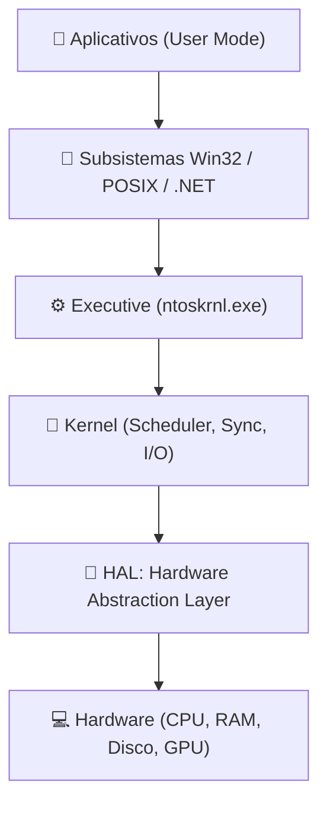
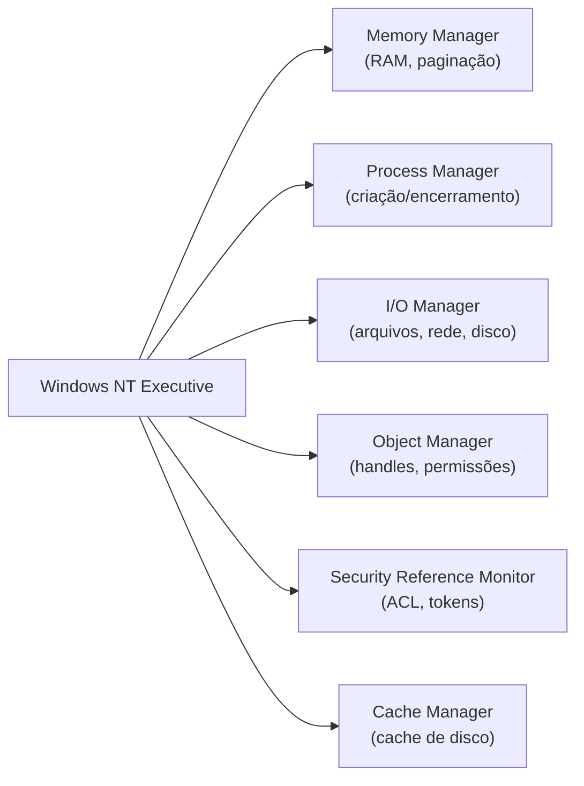

# Windows

> [!quote] Linha de Comando no Windows
> *Aprenda a usar o prompt de comandos e criar scripts para automatizar tarefas no Windows.*

---

## 🌍 Windows no Mundo Atual

O Windows é o sistema operacional de desktop mais usado no mundo. Em fevereiro de 2026, o Windows 11 atingiu **72,57% de participação** entre os usuários Windows, enquanto o Windows 10 caiu para 26,45% após atingir o fim de suporte oficial em outubro de 2025. O Windows domina cerca de **72% do mercado global de desktops**, com o macOS em torno de 15%.

| Versão | Market Share (fev/2026) | Status |
|--------|------------------------|--------|
| Windows 11 | 72,57% | Versão principal |
| Windows 10 | 26,45% | Fim de suporte (out/2025) |
| Outras versões | ~1% | Legacy |

> [!info] 1 bilhão de usuários
> Em janeiro de 2026, a Microsoft anunciou que o Windows 11 ultrapassou **1 bilhão de usuários**, um marco atingido mais rápido do que o Windows 10.

### Novidades do Windows 11 em 2025 e 2026

- **Controle de atualizações**: possibilidade de pausar atualizações por tempo indeterminado, com reinicialização mensal única (segunda terça-feira do mês).
- **Copilot Actions**: funções de IA que executam tarefas em um desktop paralelo, tornando o Windows "agentic-ready".
- **File Explorer aprimorado**: busca mais rápida, menos flickering de interface, suporte a novos formatos de arquivo (uu, cpio, xar, NuGet Packages).
- **Dark mode completo**: diálogos de copiar, mover e excluir recebendo tema escuro em 2026.

---

## 🏛️ Arquitetura do Windows

O Windows moderno (Windows NT, base do Windows 10 e 11) possui uma arquitetura **híbrida**: combina elementos de microkernel com um núcleo monolítico para equilibrar desempenho e modularidade.

### Camadas Principais



| Componente | Modo | Função Principal |
|------------|------|-----------------|
| Aplicativos | User Mode | Programas que o usuário executa |
| Win32 API | User Mode | Interface entre app e SO |
| Executive | Kernel Mode | Gerência de I/O, memória, objetos, segurança |
| Kernel | Kernel Mode | Escalonamento de threads, interrupções, sincronização |
| HAL | Kernel Mode | Abstrai diferenças de hardware (CPU, chipset) |
| Drivers | Kernel Mode | Comunicação com dispositivos específicos |

> [!tip] Por que HAL existe?
> O HAL (Hardware Abstraction Layer) permite que o mesmo kernel do Windows rode em hardware diferente (Intel, AMD, ARM) sem precisar reescrever o núcleo do sistema. É ele que traduz chamadas genéricas de hardware em instruções específicas do chipset.

### Gerência de Recursos pelo Windows



---

## 💻 O Prompt de Comandos

> [!tip] O que é o CMD?
> O prompt de comandos (cmd) é um programa de linha de comando que executa instruções direto no sistema operacional. Você não está limitado à interface gráfica.

---

## 🔧 Comandos Básicos

| Comando | Descrição |
|---------|-----------|
| `echo` | Escrever algo na tela |
| `dir` | Listar diretórios |
| `cd` | Navegar entre diretórios |
| `mkdir` | Criar diretórios |
| `rmdir` | Remover diretórios |
| `cls` | Limpar a tela |
| `type` | Mostra conteúdo de um arquivo |
| `del` | Apaga arquivo |
| `copy arquivo.txt arquivo2.txt` | Copia um arquivo |
| `rename` | Renomeia um arquivo |
| `move arquivo.txt pasta/` | Move um arquivo ou pasta |
| `tree` | Mostra árvore de diretórios |
| `more` | Mostra por páginas (espaço: página, enter: linha, q: sai) |

---

## 💡 Dicas Úteis

| Dica | Descrição |
|------|-----------|
| **Seta para cima** | Acessa últimos comandos digitados |
| `echo texto > arquivo.txt` | Redireciona saída para arquivo (sobrescreve) |
| `echo texto >> arquivo.txt` | Adiciona no final do arquivo |
| `cd .` ou `cd ..` | Diretório atual / diretório acima |
| **TAB** | Auto completa comandos e nomes |
| `help dir` | Ajuda sobre o comando |

> [!info] Por que aprender comandos?
> Nem todos os sistemas possuem interface gráfica, e muitos recursos só estão disponíveis em linha de comando. A linha de comando pode ser utilizada por outros programas, tornando possível escrever scripts e automações.

---

## 🖥️ PowerShell: a Linha de Comando Moderna

> [!tip] CMD vs PowerShell
> O CMD é antigo e limitado. O PowerShell é o sucessor oficial: orientado a objetos, integrado ao .NET, capaz de gerenciar qualquer recurso do Windows, da nuvem Azure a serviços locais.

O PowerShell trabalha com **cmdlets** (pronuncia-se "command-lets"): comandos no formato `Verbo-Substantivo`, por exemplo `Get-Process`, `Stop-Service`, `New-Item`.

### Cmdlets Essenciais

| Cmdlet | O que faz |
|--------|-----------|
| `Get-Process` | Lista processos em execução (nome, PID, CPU, memória) |
| `Get-Service` | Lista serviços do Windows e seus estados |
| `systeminfo` | Informações completas do sistema (SO, RAM, CPU, rede) |
| `Get-ComputerInfo` | Versão moderna de systeminfo (PowerShell nativo) |
| `Get-EventLog` | Consulta logs de eventos do sistema |
| `Get-NetAdapter` | Lista adaptadores de rede e seus estados |
| `Invoke-Command` | Executa comandos em máquinas remotas |
| `Get-Help <cmdlet>` | Exibe ajuda detalhada sobre qualquer cmdlet |

### Filtros e Ordenação

```powershell
# 10 processos que mais consomem CPU
Get-Process | Sort-Object CPU -Descending | Select-Object -First 10

# Somente serviços em execução
Get-Service | Where-Object { $_.Status -eq "Running" }

# Processos usando mais de 100 MB de RAM
Get-Process | Where-Object { $_.WorkingSet -gt 100MB }
```

> [!warning] Modo administrador
> Alguns cmdlets exigem que o PowerShell seja aberto **como Administrador** (clique direito no ícone e escolha "Executar como administrador"). Sem isso, comandos como `Stop-Service` podem ser bloqueados.

---

## 🔍 Gerenciador de Tarefas e Monitor de Recursos

O **Gerenciador de Tarefas** (`Ctrl + Shift + Esc` ou `taskmgr`) é a ferramenta visual para monitorar processos, desempenho e serviços em tempo real.

### Abas do Gerenciador de Tarefas

| Aba | O que mostra |
|-----|-------------|
| Processos | Lista de apps e processos em segundo plano com CPU, RAM, disco e rede |
| Desempenho | Gráficos de CPU, memória, disco e rede ao longo do tempo |
| Inicialização | Programas que iniciam com o Windows e seu impacto no boot |
| Serviços | Serviços do sistema com opção de iniciar/parar |
| Usuários | Sessões abertas e consumo por usuário |
| Detalhes | Visão técnica de cada processo (PID, prioridade, threads) |

> [!example] 🧪 Atividade 1: Identificar processos que mais consomem recursos
>
> **Ferramenta:** Gerenciador de Tarefas (`Ctrl + Shift + Esc`)
>
> **Passo a passo:**
> 1. Abra o Gerenciador de Tarefas com `Ctrl + Shift + Esc`.
> 2. Clique na aba **Processos**.
> 3. Clique no cabeçalho **CPU** para ordenar do maior para o menor consumo.
> 4. Anote o nome e o PID dos 3 processos que mais consomem CPU.
> 5. Repita ordenando por **Memória** e anote os 3 maiores.
> 6. Clique com o botão direito sobre um processo e escolha **Ir para detalhes** para ver o arquivo executável responsável.
>
> **Resultado observável:** você verá que processos como `svchost.exe` aparecem várias vezes: cada instância hospeda um grupo diferente de serviços do Windows. Isso é normal e esperado.

---

> [!example] 🧪 Atividade 2: Explorar o sistema via PowerShell
>
> **Ferramenta:** PowerShell (abrir com `Win + X` → "Windows PowerShell")
>
> **Execute cada comando e observe a saída:**
>
> ```powershell
> # Comando 1: listar processos e ordenar por memória
> Get-Process | Sort-Object WorkingSet -Descending | Select-Object -First 10 Name, Id, CPU, @{n="RAM_MB";e={[math]::Round($_.WorkingSet/1MB,1)}}
> ```
> Resultado esperado: tabela com os 10 processos que mais ocupam RAM, mostrando nome, PID, CPU e uso de memória em MB.
>
> ```powershell
> # Comando 2: informações do sistema
> systeminfo | Select-String "Nome do SO|Versão do SO|Memória Física Total|Processador"
> ```
> Resultado esperado: linhas com o nome da versão do Windows, a quantidade de RAM instalada e o modelo do processador.
>
> ```powershell
> # Comando 3: listar serviços em execução e contar
> $servicos = Get-Service | Where-Object { $_.Status -eq "Running" }
> Write-Host "Serviços em execução: $($servicos.Count)"
> $servicos | Sort-Object DisplayName | Select-Object -First 15 DisplayName, Status
> ```
> Resultado esperado: o total de serviços ativos seguido dos 15 primeiros em ordem alfabética com seus estados.

---

> [!example] 🧪 Atividade 3: Explorar serviços com services.msc e Monitor de Recursos
>
> **Ferramenta:** `services.msc` e Monitor de Recursos (`resmon`)
>
> **Passo a passo:**
> 1. Pressione `Win + R`, digite `services.msc` e tecle Enter.
> 2. Localize o serviço **Windows Update** (ou **wuauserv**) na lista.
> 3. Anote: tipo de inicialização (Automático/Manual/Desabilitado) e status atual.
> 4. Clique duas vezes no serviço para ver a descrição e as dependências.
> 5. Agora pressione `Win + R`, digite `resmon` e tecle Enter.
> 6. Na aba **CPU**, expanda a seção **Serviços** e identifique qual processo `svchost.exe` está consumindo mais CPU, clicando nele para ver quais serviços ele hospeda.
>
> **Resultado observável:** cada `svchost.exe` agrupa serviços por categoria (rede, segurança, atualizações). No Monitor de Recursos é possível ver quais serviços reais estão dentro de cada instância do svchost.

---

## 🚀 Cmder: Terminal Avançado

> [!tip] Terminal Poderoso
> O `cmder` é um emulador de terminal para Windows que permite executar comandos Unix e muitas outras funcionalidades.

🔗 [Cmder - Console Emulator](https://cmder.net/)

### Instalação

1. Fazer download no site
2. Extrair o arquivo
3. Colocar a pasta em local de preferência
4. Executar arquivo Cmder
5. Na primeira vez, clicar em "Unblock and Continue"

### Facilidades do Cmder

| Funcionalidade | Descrição |
|----------------|-----------|
| **Copiar/Colar** | Texto selecionado já está automaticamente copiado |
| **Múltiplas abas** | Abrir várias instâncias |
| **Configurações** | Windows + ALT + P > Features |

---

## 📜 Scripts Batch (.bat)

> [!info] O que é um Script?
> Um script é um arquivo de texto (.bat) com comandos que, quando executado, executa todos os comandos de uma vez.

### Exemplo: Criar script simples

```bash
echo cls > limpatela.bat
```

### Comandos Úteis para Scripts

| Comando | Descrição |
|---------|-----------|
| `pause` | Espera o usuário interagir |
| `echo %date%` | Imprime a data atual |
| `echo %time%` | Imprime a hora atual |
| `@echo off` | Oculta os comandos (mostra só resultado) |

### Exemplo: Script de Backup

```bash
@echo off
cls
echo Deseja realmente fazer o backup?
pause
cls
echo ok, fazendo backup...
mkdir Backup
xcopy /E /Y "C:\Users\wesley\Documents"  "C:\Users\wesley\Backup"
echo Listando os arquivos do backup
dir C:\Users\wesley\Backup
```

### Exemplo: Exibir Data e Hora

```bash
@echo off
cls
echo Dia de hoje:
echo %date%
echo Hora atual:
echo %time%
```

> [!tip] @echo off
> O prompt sempre exibe o comando e o resultado, o que pode duplicar informações. Use `@echo off` no início do script para evitar isso.

---

## 🔐 Segurança e Permissões no Windows

O Windows usa um modelo de controle de acesso baseado em **ACL (Access Control List)**: cada arquivo, pasta e processo tem uma lista que define quem pode ler, gravar ou executar.

### Conceitos Fundamentais

| Conceito | Descrição |
|----------|-----------|
| **UAC** (User Account Control) | Solicita confirmação antes de ações administrativas |
| **ACL** (Access Control List) | Lista de permissões de cada objeto (arquivo, pasta, registro) |
| **SID** (Security Identifier) | Identificador único de cada usuário e grupo |
| **Token de Acesso** | Credencial carregada pelo processo ao fazer login |
| **Princípio do Menor Privilégio** | Cada processo recebe só as permissões que precisa |

> [!warning] Conta de Administrador vs Usuário Padrão
> No Windows, mesmo o usuário administrador roda aplicativos com privilégios reduzidos por padrão. O UAC pede elevação só quando realmente necessário, reduzindo o risco de malware que precisa de privilégios altos para se instalar.

---

## 📝 Tópicos Avançados

> [!info] Em Desenvolvimento

| Tópico | Status |
|--------|--------|
| Variáveis de ambiente do Windows | 🔜 |
| Automatização de tarefas e scripts | 🔜 |
| Gerenciamento de pacotes (Chocolatey / winget) | 🔜 |
| Linux bash no Windows (WSL) | 🔜 |
| Microsoft Power Automate Desktop | 🔜 |
| AutoHotkey | 🔜 |

---

## 📎 Veja Também

- [[Automações]]
- [[Docker - gerenciamento de containers]]

---

> [!note] 📚 Fontes (2026)
> - [Windows 11 ultrapassa 72% de market share em fev/2026 (Windows Central)](https://www.windowscentral.com/microsoft/windows-11/windows-11-statcounter-market-share-february-2026)
> - [Windows 11 market share crescimento dramático em 2026 (TweakTown)](https://www.tweaktown.com/news/110293/windows-11-market-share-sees-dramatic-increase-in-2026/index.html)
> - [Novidades do Windows 11 em 2026 (Windows Latest)](https://www.windowslatest.com/2026/04/09/full-list-of-features-coming-to-windows-11-in-2026/)
> - [Arquitetura do Windows NT (Wikipedia)](https://en.wikipedia.org/wiki/Architecture_of_Windows_NT)
> - [HAL: Hardware Abstraction Layer (Microsoft Learn)](https://learn.microsoft.com/en-us/windows-hardware/drivers/kernel/windows-kernel-mode-hal-library)
> - [Get-Process (Microsoft Learn PT-BR)](https://learn.microsoft.com/pt-br/powershell/module/microsoft.powershell.management/get-process?view=powershell-7.6)
> - [Get-Service (Microsoft Learn PT-BR)](https://learn.microsoft.com/pt-br/powershell/module/microsoft.powershell.management/get-service?view=powershell-7.4)
> - [Gerenciar processos com PowerShell (Microsoft Learn PT-BR)](https://learn.microsoft.com/pt-br/powershell/scripting/samples/managing-processes-with-process-cmdlets?view=powershell-7.5)
