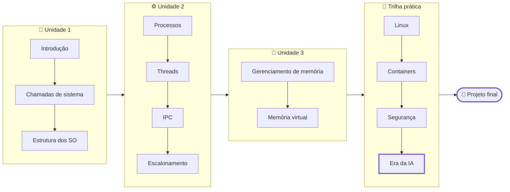

# Sistemas Operacionais

> [!quote] O software que faz todos os outros funcionarem
> *Toda vez que você abre um app, roda um modelo de IA ou sobe um container, um sistema operacional decide quem usa a CPU, quem fica na memória e quem pode falar com quem. Esta disciplina abre essa caixa: você vai ver o kernel trabalhando na sua própria máquina.*

> [!abstract] 🧭 Sobre esta disciplina (7º período, 2026.2)
> **Sistemas Operacionais I** cobre a base que todo engenheiro de computação precisa: **introdução e estrutura dos SO, chamadas de sistema, processos e threads, comunicação e escalonamento, gerenciamento de memória e memória virtual**. Por cima dessa base entra a **trilha prática**: Linux como sistema de trabalho, Windows como contraste, containers, segurança do SO e o papel do sistema operacional na **era da inteligência artificial** (GPU como recurso, memória para LLMs, sandbox de agentes). Sistemas de arquivos, entrada/saída e deadlocks ficam para **Sistemas Operacionais II**.

---

## 🎯 Organização da disciplina

> [!tip] Links rápidos
> - [[Possíveis trabalhos e projetos de Sistemas Operacionais|📝 Possíveis trabalhos e projetos]]: banco de trabalhos práticos com rubrica; o professor define em aula quais valem no semestre.
> - [[Laboratório de SO - preparando o ambiente|🧪 Laboratório: preparando o ambiente]]: comece por aqui na primeira semana (WSL2, VM, Docker, navegador).
> - [[Materiais, cursos e certificações de SO|📚 Materiais, cursos e certificações]]: livros abertos, cursos de referência, simuladores, canais e concursos.
> - [[Glossário de Sistemas Operacionais|📖 Glossário]]: os termos da disciplina explicados em uma linha.
> - [[SO I 7Eng 2026-2|🗒️ Log da turma]]: o que foi dado em cada aula.

---

## 📚 Conteúdo da disciplina

### Unidade 1: Introdução e estrutura dos sistemas operacionais

| Página | O que você vai ver |
|--------|--------------------|
| [[Introdução aos Sistemas Operacionais]] | O que é um SO, revisão de hardware (modos de CPU, interrupções, hierarquia de memória, GPU), tipos de SO, os conceitos centrais e o panorama de 2026 |
| [[Chamadas de Sistema]] | A fronteira entre usuário e kernel: como uma syscall acontece, as famílias de chamadas (processos, arquivos, diretórios) e como espiar tudo com `strace` |
| [[Estrutura dos Sistemas Operacionais]] | Monolítico, camadas, microkernel, cliente-servidor, máquinas virtuais, exokernel e unikernel; Linux, Windows NT, macOS, seL4; módulos, eBPF, Rust no kernel e WSL2 |

### Unidade 2: Processos e threads

| Página | O que você vai ver |
|--------|--------------------|
| [[Processos]] | O que é um processo, estados, `fork`/`exec`/`wait`, `/proc`, sinais, zumbis e as ferramentas de observação |
| [[Threads]] | Threads versus processos, modelos de implementação, GIL e Python free-threaded, `asyncio`, goroutines e threads virtuais |
| [[Comunicação entre Processos]] | Condições de corrida, exclusão mútua, semáforos, mutex, monitores, troca de mensagens, os problemas clássicos e os mecanismos de IPC do Linux |
| [[Escalonamento de Processos]] | Objetivos e algoritmos de escalonamento, tempo real, o escalonador do Linux (CFS, EEVDF, sched_ext) e do Windows, `nice`, `chrt`, `taskset` e cgroups |

### Unidade 3: Gerenciamento de memória

| Página | O que você vai ver |
|--------|--------------------|
| [[Gerenciamento de Memória]] | Da memória sem abstração aos espaços de endereçamento: swapping, alocação, paginação, tabelas de páginas, TLB e page faults |
| [[Memória Virtual e Substituição de Páginas]] | Demand paging, algoritmos de substituição (FIFO, ótimo, LRU, clock, aging, WSClock), working set, thrashing, questões de projeto e implementação, segmentação, e o que o Linux faz hoje |

### Trilha prática: o SO como plataforma de trabalho

| Página | O que você vai ver |
|--------|--------------------|
| [[Linux na prática]] | Shell, arquivos, permissões, usuários, pacotes, `systemd`, logs, agendamento, SSH e shell script: o kit de sobrevivência de quem opera servidores |
| [[Windows]] | Arquitetura do Windows, prompt, PowerShell, scripts batch, gerenciador de tarefas e automação |
| [[Containers e Virtualização]] | Máquinas virtuais, hipervisores, namespaces, cgroups, overlayfs, um container construído na mão e o Docker com limites de recursos |
| [[Segurança em Sistemas Operacionais]] | Usuários, permissões, `sudo`, capabilities, seccomp, SELinux/AppArmor, Secure Boot e os incidentes que explicam por que isso importa |
| [[Sistemas Operacionais na Era da IA]] | GPU como recurso escalonado, memória para LLMs, servidores de inferência, containers para ML, sandbox de agentes e o SO com IA embutida |

---

## 🗺️ Roadmap

---

## 🤖 O ângulo desta turma: o SO na era da IA

> [!info] Por que estudar SO em 2026?
> Porque a infraestrutura de inteligência artificial é, no fundo, um problema de sistema operacional: um modelo de linguagem precisa de **memória** (pesos e cache mapeados em RAM e VRAM), roda em **processos e threads** que atendem milhares de requisições, disputa a **GPU** com outros trabalhos e, quando vira um **agente** que executa comandos, precisa de uma **caixa** (namespaces, cgroups, seccomp) para não estragar a máquina. Cada unidade desta disciplina fecha com esse "e na IA?".

> [!tip] Como as aulas funcionam
> As páginas são roteiros de laboratório: teoria curta, diagrama, exemplo real de 2026 e uma atividade 🧪 para cada conceito. Você pode (e deve) usar IA como copiloto para entender saídas de comandos e gerar código, mas **executa, mede e verifica** tudo na sua máquina, e defende o que entregou. Leia [[Minha metodologia de ensino]] e [[Regras e boas práticas]].

---

## 📎 Veja também

- [[Sistemas Operacionais|Sistemas Operacionais (Fundamentos da Computação)]]: a visão introdutória do 1º período, boa para revisar antes de começar.
- [[Docker - gerenciamento de containers]]: a página do Roadmap do Futuro sobre Docker.
- [[Tópicos/Redes de Computadores/DevOps|DevOps]] e [[Tópicos/Segurança da informação/index|Segurança da Informação]]: as disciplinas vizinhas desta trilha.
- [[Automações]]: automatizar tarefas por cima do sistema operacional.
